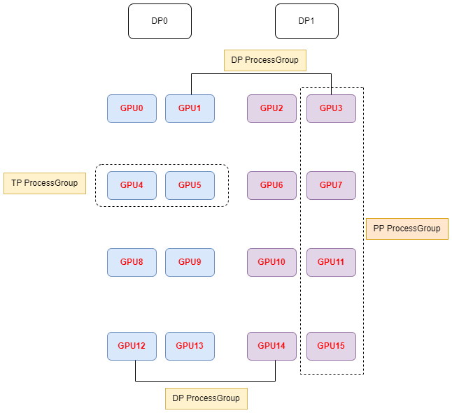
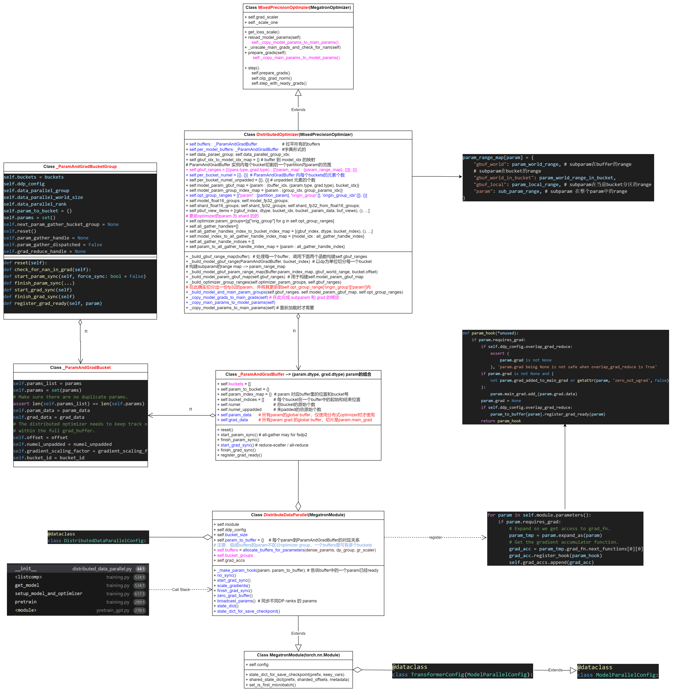

# 0 Megatron-LM ZeRO-1
目前Megatron-LM 里实现的是 ZeRO-1. 结合DistributedDataParallel 实现。

# 1 启动
&nbsp;&nbsp;&nbsp;&nbsp;&nbsp;&nbsp;&nbsp;&nbsp;此处将torchrun 传入的环境变量打包成worker_env 传入启动的进程里。`每个进程根据特定的环境变量来对进程组进行初始化(init_process_group)`。<br>

-[代码链接](https://github.com/pytorch/pytorch/blob/main/torch/distributed/elastic/agent/server/local_elastic_agent.py)

```python
def _start_workers(self, worker_group: WorkerGroup) -> Dict[int, Any]:
    spec = worker_group.spec
    store = worker_group.store
    assert store is not None
    restart_count = spec.max_restarts - self._remaining_restarts

    use_agent_store: bool = spec.rdzv_handler.use_agent_store
    logger.info("use_agent_store: %s", use_agent_store)

    args: Dict[int, Tuple] = {}
    envs: Dict[int, Dict[str, str]] = {}
    log_line_prefixes: Optional[Dict[int, str]] = (
        {} if self._log_line_prefix_template else None
    )
    for worker in worker_group.workers:
        local_rank = worker.local_rank
        worker_env = {
            "LOCAL_RANK": str(local_rank),
            "RANK": str(worker.global_rank),
            "GROUP_RANK": str(worker_group.group_rank),
            "ROLE_RANK": str(worker.role_rank),
            "ROLE_NAME": spec.role,
            "LOCAL_WORLD_SIZE": str(spec.local_world_size),
            "WORLD_SIZE": str(worker.world_size),
            "GROUP_WORLD_SIZE": str(worker_group.group_world_size),
            "ROLE_WORLD_SIZE": str(worker.role_world_size),
            "MASTER_ADDR": worker_group.master_addr,
            "MASTER_PORT": str(worker_group.master_port),
            "TORCHELASTIC_RESTART_COUNT": str(restart_count),
            "TORCHELASTIC_MAX_RESTARTS": str(spec.max_restarts),
            "TORCHELASTIC_RUN_ID": spec.rdzv_handler.get_run_id(),
            "TORCHELASTIC_USE_AGENT_STORE": str(use_agent_store),
            "TORCH_NCCL_ASYNC_ERROR_HANDLING": os.getenv(
                "TORCH_NCCL_ASYNC_ERROR_HANDLING", str(1)
            ),
        }
        if "OMP_NUM_THREADS" in os.environ:
            worker_env["OMP_NUM_THREADS"] = os.environ["OMP_NUM_THREADS"]

        if self._log_line_prefix_template:
            log_line_prefix = Template(
                self._log_line_prefix_template
            ).safe_substitute(
                role_name=spec.role,
                rank=worker.global_rank,
                local_rank=local_rank,
            )
            log_line_prefixes[local_rank] = log_line_prefix

        envs[local_rank] = worker_env
        worker_args = list(spec.args)
        worker_args = macros.substitute(worker_args, str(local_rank))
        args[local_rank] = tuple(worker_args)

    self._setup_local_watchdog(envs=envs)
    self._setup_healthcheck()

    assert spec.entrypoint is not None
    assert self._logs_specs is not None
    self._pcontext = start_processes(
        name=spec.role,
        entrypoint=spec.entrypoint,
        args=args,
        envs=envs,
        logs_specs=self._logs_specs,
        log_line_prefixes=log_line_prefixes,
        start_method=self._start_method,
    )

    return self._pcontext.pids()
```

# 2 megatron-lm 中进程组的初始化

## 2.1 初始化进程组

- [代码链接(training/initialize.py)](https://github.com/NVIDIA/Megatron-LM/blob/main/megatron/training/initialize.py)

```python
def _initialize_distributed(get_embedding_ranks, get_position_embedding_ranks):
    """Initialize torch.distributed and core model parallel."""
    args = get_args()

    device_count = torch.cuda.device_count()
    if torch.distributed.is_initialized():

        if args.rank == 0:
            print(
                "torch distributed is already initialized, "
                "skipping initialization ...",
                flush=True,
            )
        args.rank = torch.distributed.get_rank()
        args.world_size = torch.distributed.get_world_size()

    else:

        if args.rank == 0:
            print("> initializing torch distributed ...", flush=True)
        # Manually set the device ids.
        if device_count > 0:
            torch.cuda.set_device(args.local_rank)
            device_id = torch.device(f'cuda:{args.local_rank}')
        else:
            device_id = None

        # Call the init process
        init_process_group_kwargs = {
            'backend' : args.distributed_backend,
            'world_size': args.world_size,
            'rank': args.rank,
            'timeout': timedelta(minutes=args.distributed_timeout_minutes),
        }

        torch.distributed.init_process_group(**init_process_group_kwargs)

    # Set the tensor model-parallel, pipeline model-parallel, and
    # data-parallel communicators.
    if device_count > 0:
        if mpu.model_parallel_is_initialized():
            print("model parallel is already initialized")
        else:
            mpu.initialize_model_parallel(
                args.tensor_model_parallel_size,
                args.pipeline_model_parallel_size,
                args.virtual_pipeline_model_parallel_size,
                args.pipeline_model_parallel_split_rank,
                context_parallel_size=args.context_parallel_size,
                hierarchical_context_parallel_sizes=args.hierarchical_context_parallel_sizes,
                expert_model_parallel_size=args.expert_model_parallel_size,
                num_distributed_optimizer_instances=args.num_distributed_optimizer_instances,
                expert_tensor_parallel_size=args.expert_tensor_parallel_size,
                distributed_timeout_minutes=args.distributed_timeout_minutes,
                nccl_communicator_config_path=args.nccl_communicator_config_path,
                order='tp-cp-ep-dp-pp' if not args.use_tp_pp_dp_mapping else 'tp-pp-dp',
                encoder_tensor_model_parallel_size=args.encoder_tensor_model_parallel_size,
                encoder_pipeline_model_parallel_size=args.encoder_pipeline_model_parallel_size,
                get_embedding_ranks=get_embedding_ranks,
                get_position_embedding_ranks=get_position_embedding_ranks,
            )
            if args.rank == 0:
                print(
                    f"> initialized tensor model parallel with size "
                    f"{mpu.get_tensor_model_parallel_world_size()}"
                )
                print(
                    f"> initialized pipeline model parallel with size "
                    f"{mpu.get_pipeline_model_parallel_world_size()}"
                )
```

## 2.2 划分进程组

在 mpu.initialize_model_parallel 里进行真正的各不同ProcessGroup里进程组的初始化。每个进程可能会创建多个进程组。

```python
new_group

    Let's say we have a total of 16 GPUs denoted by g0 ... g15 and we  use 2 GPUs to parallelize the model tensor, and 4 GPUs to parallelize  the model pipeline.

   The present function will create 8 tensor model-parallel groups, 4 pipeline model-parallel groups  and 8 data-parallel groups as:


        8 data_parallel groups:
            [g0, g2], [g1, g3], [g4, g6], [g5, g7], [g8, g10], [g9, g11], [g12, g14], [g13, g15]
        8 tensor model-parallel groups:
            [g0, g1], [g2, g3], [g4, g5], [g6, g7], [g8, g9], [g10, g11], [g12, g13], [g14, g15]
        4 pipeline model-parallel groups:
            [g0, g4, g8, g12], [g1, g5, g9, g13], [g2, g6, g10, g14], [g3, g7, g11, g15]


    Note that for efficiency, the caller should make sure adjacent ranks  are on the same DGX box（机箱）. For example if we are using 2 DGX-1 boxes
    with a total of 16 GPUs, rank 0 to 7 belong to the first box and  ranks 8 to 15 belong to the second box.
```
**进程组与GPU对应关系** <br>




## 2.3 进程组并行状态管理

- [parallel_state.py](https://github.com/NVIDIA/Megatron-LM/blob/main/megatron/training/initialize.py)

每个进程中会拥有多个进程组，分别来控制当前进程的DP、TP、PP等通信任务。当前进程的所有进程组作为全局变量存储在parallel_state.py中。<br>

```python
# Intra-layer model parallel group that the current rank belongs to.
_TENSOR_MODEL_PARALLEL_GROUP = None
# Inter-layer model parallel group that the current rank belongs to.
_PIPELINE_MODEL_PARALLEL_GROUP = None
# Model parallel group (both intra- and pipeline) that the current rank belongs to.
_MODEL_PARALLEL_GROUP = None
# Model parallel group (both intra-, pipeline, and expert) that the current rank belongs to.
_MODEL_AND_EXPERT_PARALLEL_GROUP = None
# Embedding group.
_EMBEDDING_GROUP = None
# Position embedding group.
_POSITION_EMBEDDING_GROUP = None
# Data parallel group that the current rank belongs to.
_DATA_PARALLEL_GROUP = None
_DATA_PARALLEL_GROUP_GLOO = None
# tensor model parallel group and data parallel group combined
# used for fp8 and moe training
_TENSOR_AND_DATA_PARALLEL_GROUP = None
# Expert parallel group that the current rank belongs to.
_EXPERT_MODEL_PARALLEL_GROUP = None
_TENSOR_AND_EXPERT_PARALLEL_GROUP = None
_DATA_MODULO_EXPERT_PARALLEL_GROUP = None
_DATA_MODULO_EXPERT_PARALLEL_GROUP_GLOO = None
_DATA_MODULO_EXPERT_PARALLEL_GROUP_WITH_CP = None
_DATA_MODULO_EXPERT_PARALLEL_GROUP_WITH_CP_GLOO = None


_VIRTUAL_PIPELINE_MODEL_PARALLEL_RANK = None
_VIRTUAL_PIPELINE_MODEL_PARALLEL_WORLD_SIZE = None
_PIPELINE_MODEL_PARALLEL_SPLIT_RANK = None

_PIPELINE_MODEL_PARALLEL_DECODER_START = None

# These values enable us to change the mpu sizes on the fly.
_MPU_TENSOR_MODEL_PARALLEL_WORLD_SIZE = None
_MPU_PIPELINE_MODEL_PARALLEL_WORLD_SIZE = None
_MPU_EXPERT_MODEL_PARALLEL_WORLD_SIZE = None
_MPU_DATA_PARALLEL_WORLD_SIZE = None
_MPU_DATA_PARALLEL_RANK = None
_MPU_TENSOR_MODEL_PARALLEL_RANK = None
_MPU_PIPELINE_MODEL_PARALLEL_RANK = None
_MPU_EXPERT_MODEL_PARALLEL_RANK = None

# A list of ranks that have a copy of the embedding.
_EMBEDDING_GLOBAL_RANKS = None

# A list of ranks that have a copy of the position embedding.
_POSITION_EMBEDDING_GLOBAL_RANKS = None

# A list of global ranks for each pipeline group to ease calculation of the source
# rank when broadcasting from the first or last pipeline stage.
_PIPELINE_GLOBAL_RANKS = None

# A list of global ranks for each data parallel group to ease calculation of the source
# rank when broadcasting weights from src to all other data parallel ranks
_DATA_PARALLEL_GLOBAL_RANKS = None

# A list of global ranks for each tensor model parallel group to ease calculation of
# the first local rank in the tensor model parallel group
_TENSOR_MODEL_PARALLEL_GLOBAL_RANKS = None

# Context parallel group that the current rank belongs to
_CONTEXT_PARALLEL_GROUP = None
# A list of global ranks for each context parallel group to ease calculation of the
# destination rank when exchanging KV/dKV between context parallel_ranks
_CONTEXT_PARALLEL_GLOBAL_RANKS = None

# Data parallel group information with context parallel combined.
_DATA_PARALLEL_GROUP_WITH_CP = None
_DATA_PARALLEL_GROUP_WITH_CP_GLOO = None
_DATA_PARALLEL_GLOBAL_RANKS_WITH_CP = None

# combined parallel group of TP and CP
_TENSOR_AND_CONTEXT_PARALLEL_GROUP = None

# combined parallel group of TP, DP, and CP used for fp8
_TENSOR_AND_DATA_PARALLEL_GROUP_WITH_CP = None

# Memory buffers to avoid dynamic memory allocation
_GLOBAL_MEMORY_BUFFER = None

# MOE logging
_MOE_LAYER_WISE_LOGGING_TRACKER = {}
```

# 3 Megatron-lm 中的数据并行

## 3.1 数据并行调用栈 <br>

```python
__init__                      distributed_data_parallel.py:44
<listcomp>                    training.py:534
get_model                     training.py:534
setup_model_and_optimizer     training.py:617
pretrain                      training.py:289
<module>                      pretrain_gpt.py:278
```

## 3.2 Zero-1 数据组织


# 4 DistributedOptimizer

一个buffer会却分成多个bucket, Zero 是在Bucket上进行切分的。`buffer里的每个bucket都要切成data_parallel_world_size份。` <br>

几个关键函数：<br>

## 4.1 _build_gbuf_range_map

- 代码将遍历梯度缓冲区（grad buffer）的所有桶（buckets），以构建当前进程“拥有”的参数范围(注意是当前进程在buffer里的参数范围)。

- 这里的“拥有”是指每个进程负责梯度缓冲区中每个桶的特定分片（shard），其中每个分片的大小是桶大小的1/dp_world_size，dp_world_size是数据并行组中的进程数量。

## 4.2 __build_model_gbuf__param_range_map

- 由于梯度缓冲区的分区方式不考虑参数边界，因此每个数据并行进程实际上是在对梯度缓冲区的视图（views）进行操作，而不是直接对完整的参数进行操作。

- 这些操作包括梯度的规约（reduce）和参数的更新（gather）。

## 4.3 optimizer state

- 鉴于之前方法中创建的概念性梯度缓冲区划分并不遵循参数的边界，**优化器操作的是模型参数的分片**，而非完整参数。


# 5 代码结构



