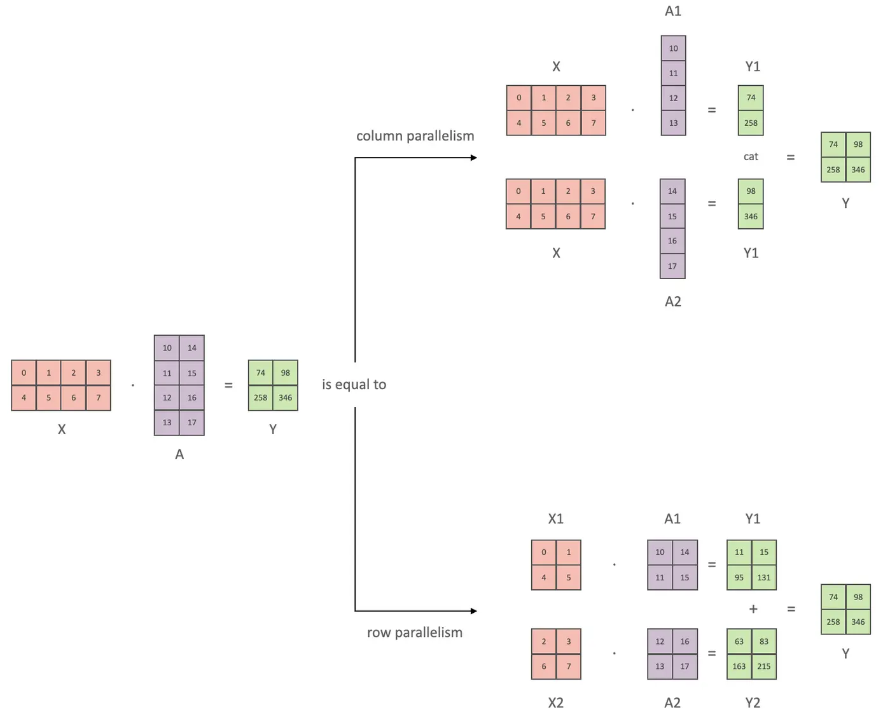
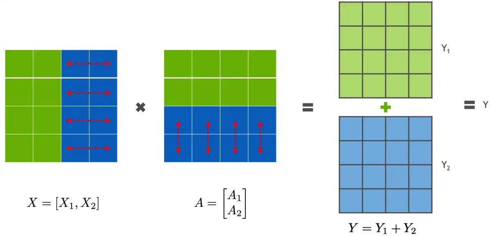

# Tensor Parallel
# 1.张量并行

和流水线并行类似，张量并行也是将模型分解放置到不同的GPU上，以解决单块GPU无法储存整个模型的问题。和流水线并行不同的地方在于，**张量并行是针对模型中的张量进行拆分，将其放置到不同的GPU上**。

### 1.简述

模型并行是不同设备负责单个计算图不同部分的计算。而将计算图中的层内的参数（张量）切分到不同设备（即层内并行），每个设备只拥有模型的一部分，以减少内存负荷，我们称之为张量模型并行。


张量并行从数学原理上来看就是对于`linear`层就是把矩阵分块进行计算，然后把结果合并；对于非`linear`层，则不做额外设计。

### 2.张量并行方式

张量切分方式分为按行进行切分和按列进行切分，分别对应**行并行（Row Parallelism）**与**列并行（Column Parallelism）**。



下面用通用矩阵的矩阵乘法（GEMM）来进行示例，看看线性层如何进行模型并行。假设 Y = XA ，对于模型来说，X 是输入，A是权重，Y是输出。


#### 2.1 行并行

行并行就是把权重 A 按照行分割成两部分。为了保证运算，同时我们也把 X 按照列来分割为两部分，具体如下所示：

$$
X A=\left[\begin{array}{ll}X 1 & X 2\end{array}\right]\left[\begin{array}{l}A 1 \\ A 2\end{array}\right]=X 1 A 1+X 2 A 2=Y 1+Y 2=Y
$$

这样，X1 和 A1 就可以放到 GPU0 之上计算得出 Y1，，X2 和 A2 可以放到第二个 GPU1 之上计算得出 Y2，然后，把Y1和Y2结果相加，得到最终的输出Y。



### 2.2 列并行

列并行就是把 A按照列来分割，具体示例如下：

$$
X A=[X]\left[\begin{array}{ll}A 1 & A 2\end{array}\right]=\left[\begin{array}{ll}X A 1 & X A 2\end{array}\right]=\left[\begin{array}{ll}Y 1 & Y 2\end{array}\right]=Y
$$

这样，将 X 分别放置在GPU0 和GPU1，将 A1 放置在 GPU0，将 A2 放置在 GPU1，然后分别进行矩阵运行，最终将2个GPU上面的矩阵拼接在一起，得到最终的输出Y。


# 3 Megatron-lm TP

- [译文连接](https://github.com/Elvin-Ma/ai_papers/blob/main/megatron/megatron_lm.md)
- [论文连接-EN](https://arxiv.org/pdf/1909.08053)
- [论文连接-CN](https://yiyibooks.cn/arxiv/1909.08053v4/index.html)

# 4 Megatron-lm 实现
```python
from megatron.core import mpu, tensor_parallel

mpu.initialize_model_parallel(args.tensor_model_parallel_size,
                  args.pipeline_model_parallel_size,
                  args.virtual_pipeline_model_parallel_size,
                  args.pipeline_model_parallel_split_rank)
```