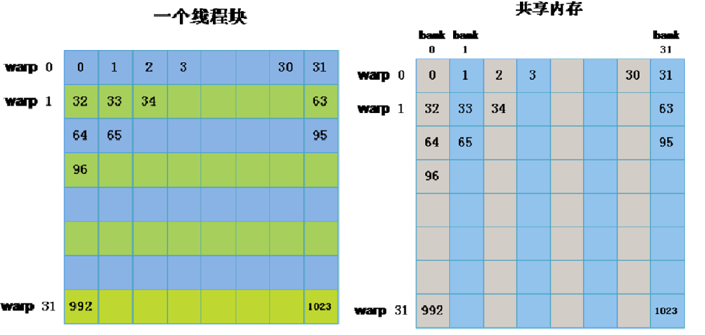

# 0 cpu matmul
```c++
#include <stdio.h>
#include <sys/time.h>
#include <cuda.h>

// 挂钟时间
double get_walltime() {
    struct timeval tp;
    gettimeofday(&tp, NULL);
    return (double)(tp.tv_sec + tp.tv_usec * 1e-6);
}

// 数据对比
float compare(float *hostC, float *serialC, int M, int N) {
    float error = 0;
    for (int i = 0; i < M * N; i++) {
        error = fmax(error, fabs(hostC[i] - serialC[i]));
    }
    return error;
}

void matmul_cpu(float *hostA, float *hostB, float *hostC, int M, int K, int N) {
    for (int i = 0; i < M; i++) {
        for (int j = 0; j < N; j++) {
            float tmp = 0;
            for (int s = 0; s < K; s++) {
                tmp += hostA[i * K + s] * hostB[s * N + j];
            }
            hostC[i * N + j] = tmp;
        }
    }
}

int main() {
    float *hostA, *hostB, *hostC, *serialC;
    int M = 1024;
    int K = 1024;
    int N = 1024;

    hostA = (float *)malloc(M * K * sizeof(float));
    hostB = (float *)malloc(N * K * sizeof(float));
    hostC = (float *)malloc(M * N * sizeof(float));
    for (int i = 0; i < M * K; i++) { // hostA 赋值
        hostA[i] = i % 3;
    }

    for (int i = 0; i < N * K; i++) { // hostB 赋值
        hostB[i] = i % 3;
    }

    double st, ela;
    st = get_walltime();
    matmul_cpu(hostA, hostB, hostC, M, K, N);
    ela = get_walltime() -st;
    printf("CPU time:%.2f second\n", ela);
    free(hostA);
    free(hostB);
    free(hostC);
    return 0;
}
```

- result : "CPU time:4.21 second"

# 1 matmul_cuda_v1
- cuda 实现没有任何优化
- 计算/访存 比为 1/3K : $\frac{2K}{K + K + 1} = \frac{1}{K + K + k}$
- K为矩阵A的列, 矩阵B的行

## 1.1 代码
- [matmul_cuda_v1](./matmul_v1.cu)


## 1.2 执行结果

```shell
M-K-N: 1024-1024-1024
GPU use time: 0.5813 second
kernel time: 0.0078 second, 7.7576 ms
grid dim: 32, 32, 1
block dim: 32, 32, 1
GPU output all right
CPU time:4.19 second
```

# 2 matmul_cuda_v2
- cuda 按照block 使用share memory进行优化
- 计算/访存 比为 $\frac{1}{\frac{2k}{BlockDim} + 1}$
- *注释：计算一个output 元素需要访存K/BlockDim.x + K/BlockDim.y + 1*

## 2.1 代码实现
- [matmul_cuda_v2](matmul_v2.cu)

## 2.2 执行结果
```shell
M-K-N: 1024-1024-1024
GPU use time: 1.0670 second
kernel time: 0.0031 second, 3.0679 ms
grid dim: 32, 32, 1
block dim: 32, 32, 1
GPU output all right
CPU time:4.51 second
```

# 3 matmul_cuda_v3
- 一个线程处理多个元素(TMxTN个元素);
- 访存比为 $\frac{BMxBNXKX2}{BMxK + BNxK + BMxBN} = \frac{2}{\frac{1}{BM} + \frac{1}{BN} \frac{1}{K}}$
- 根据数学公式BM、BN 越大, 计算/访存比越高，计算潜力发挥的越好.
- BM=BlockDim.x * TM ; BN = BlockDim.y * TN
- 因此一个线程处理的TM * TN 越大，越好.
- v3版本读取数据循环太多，未能将所有线程同时用于加载数据，导致时间变慢。

## 3.1 实现代码
- [matmul_cuda_v3](matmul_v3.cu)

## 3.2 执行结果
```shell
M-K-N: 1024-1024-1024
GPU use time: 1.6474 second
kernel time: 0.0072 second, 7.1556 ms
grid dim: 8, 8, 1
block dim: 32, 32, 1
CPU time:4.39 second
GPU output all right
```

# 4 matmul_cuda_v4
- 一个线程处理多个元素(TMxTN个元素);
- threadIdx.x, threadIdx.y 同时读取数据;
- 可以根据一维线程索引重新排布为二维线程索引,但需满足 BMxBK = BNxBK = blockDim.x * blockDim.y;

## 4.1 实现代码
- [matmul_cuda_v4](matmul_v4.cu)

## 4.2 执行结果
```shell
M-K-N: 1024-1024-1024
GPU use time: 0.7812 second
kernel time: 0.0010 second, 1.0462 ms
grid dim: 8, 8, 1
block dim: 32, 32, 1
CPU time:4.59 second
GPU output all right
```

# 5 matmul_kernel_v5
- burst mode 通过float4 来加速数据的读取

## 5.1 代码
- [matmul_kernel_v5](./matmul_v5.cu)

## 5.2 执行结果
```shell
M-K-N: 1024-1024-1024
GPU use time: 0.0169 second
kernel time: 0.0006 second, 0.6237 ms
grid dim: 8, 8, 1
block dim: 16, 16, 1
CPU time:4.26 second
GPU output all right
```

# 6 matmul_kernel_v6
- 优化back confict



## 6.1 代码
- [matmul_kernel_v6](./matmul_v6.cu)

## 6.2 执行结果
```shell
M-K-N: 1024-1024-1024
GPU use time: 0.0210 second
kernel time: 0.0005 second, 0.4559 ms
grid dim: 8, 8, 1
block dim: 16, 16, 1
CPU time:4.67 second
GPU output all right
```

# 7 优化shared memory 读取过程
## 7.1 代码
- [matmul_kernel_v7](./matmul_v7.cu)

## 7.2 执行结果
```shell
M-K-N: 1024-1024-1024
GPU use time: 0.0169 second
kernel time: 0.0005 second, 0.4559 ms
grid dim: 8, 8, 1
block dim: 16, 16, 1
CPU time:4.67 second
GPU output all right
```

- [本文参考](https://github.com/xgqdut2016/hpc_project)

# 非常好的一篇参考 : SGEMM_CUDA
- [CUDA_MMM](https://siboehm.com/articles/22/CUDA-MMM)
- [code address](https://github.com/siboehm/SGEMM_CUDA)
