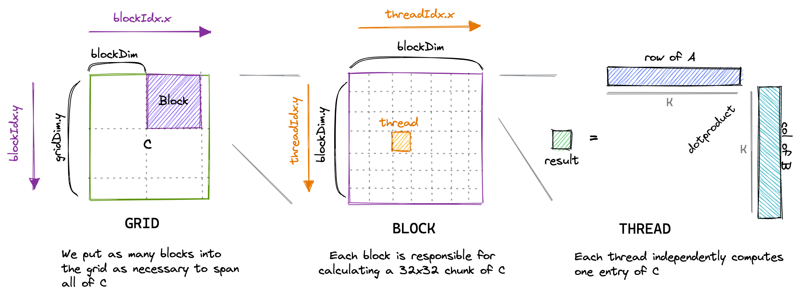
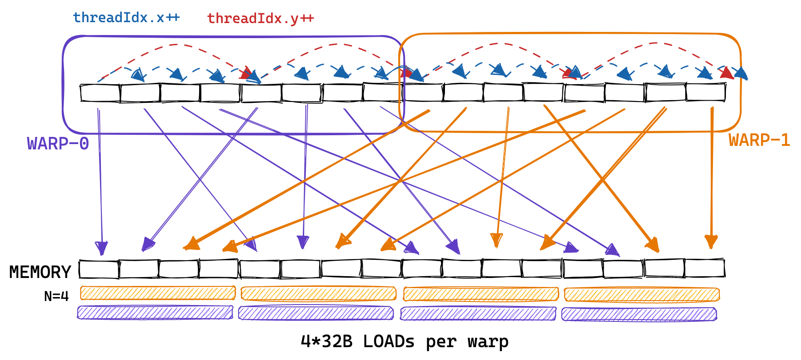
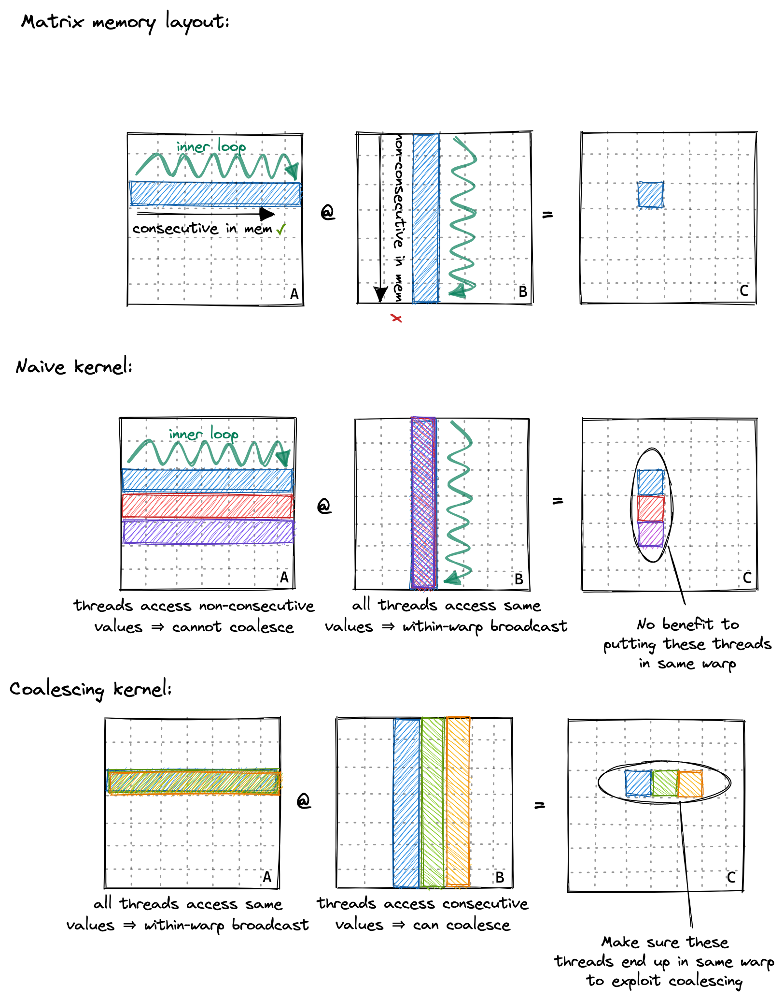
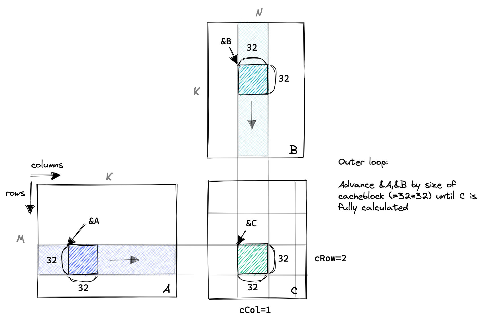

# 1. CUDA-SGEMM
- [CUDA_MMM](https://siboehm.com/articles/22/CUDA-MMM)
- [code address](https://github.com/siboehm/SGEMM_CUDA)

# 2 code run
1. Install dependencies: CUDA toolkit 12, Python (+ Seaborn), CMake, Ninja. See [environment.yml](environment.yml).
1. Configure NVCC compilation parameters. Look up your GPUs compute
   capability [here](https://developer.nvidia.com/cuda-gpus). Then configure the `CMakeLists.txt` and change:
    ```cmake
    set(CUDA_COMPUTE_CAPABILITY 80)
    ```
1. pip install cmake
1. Build: `mkdir build && cd build && cmake .. && cmake --build .`
1. Run one of the kernels: `DEVICE=<device_id> ./sgemm <kernel number>`
1. Profiling via [NVIDIA Nsight Compute](https://developer.nvidia.com/nsight-compute) (ncu): `make profile KERNEL=<kernel number>`

# 3 结果对比（基于A6000）
Running the kernels on a NVIDIA A6000 (Ampere):不同输入size


GFLOPs at matrix size **4096x4096**:
<!-- benchmark_results -->
| Kernel                              |  GFLOPs/s | Performance relative to cuBLAS |
|:------------------------------------|----------:|:-------------------------------|
| 1: Naive                            |   `309.0` | 1.3%                           |
| 2: GMEM Coalescing                  |  `1986.5` | 8.5%                           |
| 3: SMEM Caching                     |  `2980.3` | 12.8%                          |
| 4: 1D Blocktiling                   |  `8474.7` | 36.5%                          |
| 5: 2D Blocktiling                   | `15971.7` | 68.7%                          |
| 7: Avoid Bank Conflicts (Linearize) | `16213.4` | 69.7%                          |
| 8: Avoid Bank Conflicts (Offset)    | `16459.2` | 70.8%                          |
| 11: Double Buffering                | `17278.3` | 74.3%                          |
| 6: Vectorized Mem Access            | `18237.3` | 78.4%                          |
| 9: Autotuning                       | `19721.0` | 84.8%                          |
| 10: Warptiling                      | `21779.3` | 93.7%                          |
| 0: cuBLAS                           | `23249.6` | 100.0%                         |
<!-- benchmark_results -->

# 4 优化思路
## 4.1 Naive Implementation

&nbsp;&nbsp;&nbsp;&nbsp;&nbsp;&nbsp;&nbsp;&nbsp;在 CUDA 编程模型中，计算是按照三级层次结构来组织的。每次调用一个 CUDA 核函数（kernel）都会**创建一个新的网格（grid）**，该网格(grid)由**多个线程块（block）组成**。每个线程块最多包含 **1024 个独立线程**。这些常量数值（即线程块中线程数量的上限等）可以在 [CUDA 编程指南](https://docs.nvidia.com/cuda/cuda-c-programming-guide/index.html#compute-capabilities)中查阅到。处于`同一线程块中的线程可以访问同一个共享内存区域`（SMEM，即 shared memory）。<br>

&nbsp;&nbsp;&nbsp;&nbsp;&nbsp;&nbsp;&nbsp;&nbsp;`线程块中的线程数量可以通过一个通常称为 blockDim 的变量来配置`，该变量是一个由三个整数组成的向量。该向量的各个条目分别指定了 blockDim.x、blockDim.y 和 blockDim.z 的大小，具体可视化如下：<br>


&nbsp;&nbsp;&nbsp;&nbsp;&nbsp;&nbsp;&nbsp;&nbsp;类似地，网格（grid）中的线程块（block）数量可以通过 gridDim 变量来配置。当我们从主机（在加速器术语中，主机指 CPU，设备指加速器，此处即 GPU）启动一个新的核函数（kernel）时，它会**创建一个单一的网格**，其中`包含所指定的线程块和线程`。从这里开始，我将只讨论二维的网格和线程块，部分原因是三维结构很少使用，而且三维绘图太难了。重要的是要记住，我们刚才讨论的线程层次结构主要关系到程序的正确性。至于程序性能（我们稍后会看到），将同一线程块中的所有线程视为等同的并不是一个好主意。<br>


&nbsp;&nbsp;&nbsp;&nbsp;&nbsp;&nbsp;&nbsp;&nbsp;对于我们的第一个核函数（kernel），我们将利用网格（grid）、线程块（block）和线程（thread）的层次结构，**为每个线程分配结果矩阵 C 中的一个唯一位置**。然后，该**线程**将计算矩阵 A 的对应行与矩阵 B 的对应列的点积(**即：一个线程计算一个向量积**)，并将结果写入 C。由于 C 中的每个位置仅由一个线程写入，因此我们不需要进行同步操作。我们将像下面这样启动核函数：<br>


```c++
// create as many blocks as necessary to map all of C
dim3 gridDim(CEIL_DIV(M, 32), CEIL_DIV(N, 32), 1);
// 32 * 32 = 1024 thread per block
dim3 blockDim(32, 32, 1);
// launch the asynchronous execution of the kernel on the device
// The function call returns immediately on the host
sgemm_naive<<<gridDim, blockDim>>>(M, N, K, alpha, A, B, beta, C);
```

&nbsp;&nbsp;&nbsp;&nbsp;&nbsp;&nbsp;&nbsp;&nbsp;CUDA 代码是从单线程的视角编写的。在核函数（kernel）的代码中，我们可以访问内置变量 blockIdx 和 threadIdx。这些变量会根据访问它们的线程返回不同的值。<br>

```c++
__global__ void sgemm_naive(int M, int N, int K, float alpha, const float *A,
                            const float *B, float beta, float *C) {
  // compute position in C that this thread is responsible for
  const uint x = blockIdx.x * blockDim.x + threadIdx.x;
  const uint y = blockIdx.y * blockDim.y + threadIdx.y;

  // `if` condition is necessary for when M or N aren't multiples of 32.
  if (x < M && y < N) {
    float tmp = 0.0;
    for (int i = 0; i < K; ++i) {
      tmp += A[x * K + i] * B[i * N + y];
    }
    // C = α*(A@B)+β*C : x 为C中行，y 为C中列
    C[x * N + y] = alpha * tmp + beta * C[x * N + y];
  }
}
```
To visualize this simple kernel: <br>



**[tile quantization](https://docs.nvidia.com/deeplearning/performance/dl-performance-matrix-multiplication/index.html#tile-quant)**


&nbsp;&nbsp;&nbsp;&nbsp;&nbsp;&nbsp;&nbsp;&nbsp;这个核函数（kernel）在 A6000 GPU 上处理三个 4092² 大小的 fp32（单精度浮点数）矩阵大约需要 **0.5 秒**。这个kernel是否有优化空间呢？下面我们来做一些与具体实现无关的计算. <br>

---

**估计最快可能运行时间**

&nbsp;&nbsp;&nbsp;&nbsp;&nbsp;&nbsp;&nbsp;&nbsp;对于两个 4092² 矩阵的矩阵乘法，随后再加上一个 4092² 矩阵（以构成 GEMM，即通用矩阵乘法运算）：<br>

1. 总浮点运算次数（FLOPS）：2*4092³ + 4092²(bias 项) = 137 GFLOPS
1. 最小总数据读取量（read）：3 * 4092² * 4B（字节） = 201MB（兆字节）
1. 总数据存储量(write)：4092² * 4B（字节） = 67MB（兆字节）

>*注释：对于矩阵 C 的每个 4092² 个元素，我们都需要对两个大小为 4092 的向量执行点积运算，每一步都涉及一次乘法和一次加法。“先乘后加”通常映射到一条称为 FMA（融合乘加）的汇编指令，但**仍算作两次浮点运算（FLOPs）**。因此，总运算次数为 2*4092³ + 4092² = 137 GFLOPS（每秒十亿次浮点运算）。* <br>


&nbsp;&nbsp;&nbsp;&nbsp;&nbsp;&nbsp;&nbsp;&nbsp;因此，268MB（201MB读+67MB写）是任何实现都必须从/向全局 GPU 内存传输的绝对最小内存量, 这里假设全局内存有足够大的缓存。让我们来计算一下核函数性能的一些上限。该 GPU(A6000) 宣传的 fp32 计算吞吐量为 **30TFLOPs/s (vector core)**，全局内存带宽为 **768GB/s**。如果我们能达到这些数值，我们需要 **4.5ms 来进行计算，需要 0.34ms 来进行内存传输**。所以，根据我们的粗略估算，**计算时间大约是内存访问时间的 10 倍**。这意味着，只要我们最终需要传输的内存量小于绝对最小内存量 278MB）的 10 倍，我们最终优化的核函数就会是**计算受限的(compute-bound)**。

>*注释：全局内存是 GPU 的主内存区域。如果英伟达（Nvidia）宣传的 GPU 配备 80GB 内存和 1TB/s 的带宽，他们所说的就是全局内存的容量和带宽。稍后我们会讨论 GPU 上的其他内存区域，比如共享内存，它在物理上是独立的，并且具有非常不同的性能特征，。* <br>

&nbsp;&nbsp;&nbsp;&nbsp;&nbsp;&nbsp;&nbsp;&nbsp;既然我们已经计算出了 fp32 GEMM（浮点32位矩阵乘法）计算的一些性能下限，那让我们再回到当前正在讨论的核函数（kernel）上来，弄清楚**为什么它比应有的速度慢这么多**。<br>

**Memory Access Pattern of the Naive Kernel**

&nbsp;&nbsp;&nbsp;&nbsp;&nbsp;&nbsp;&nbsp;&nbsp;在我们的kernel中，同一block中两个thread(如 (0,0) 和(0,1) 号线程) 将访问加载B矩阵的同一行，A矩阵的不同行。如果我们假设最坏的情况：zero caching。此时每个线程都要从global memory load $2*4092 + 1$ floats 的数据。因为我们共有 $4092^2$ 个threads, 这将引起 548GB 的memory traffic.

> 548GB 需要传输的时间为 548 / 768 = 0.71s


&nbsp;&nbsp;&nbsp;&nbsp;&nbsp;&nbsp;&nbsp;&nbsp;因此总结一下，当我在一块 A6000 GPU 上运行这个内核程序来计算两个 4092×4092 的 float32 类型矩阵相乘时，它仅实现了约 **300GFLOPs**（每秒 3000 亿次浮点运算）的性能。这**相当糟糕**，因为 A6000 的宣传性能是几乎可以达到 30 TFLOPs（每秒 30 万亿次浮点运算）。那么我们该如何提高这个速度呢？一种方法是对内核程序的内存访问模式进行优化，`使全局内存访问能够被合并（coalesced，即组合）为更少的访问次数`。


## 4.2 Kernel 2: Global Memory Coalescing

在我们深入探讨全局内存合并（global memory coalescing）之前，需要先了解“warp（线程束）”这一概念。在执行过程中，一个线程块（block）中的线程会被分组到所谓的“warp”中，**每个warp包含32个线程**。然后，一个warp会被分配给一个warp调度器（该调度器是执行指令的物理核心core）。每个多处理器（multiprocessor）有**四个warp调度器scheduler**。线程被分组到warp的过程是**基于连续的threadId（线程ID）进行的**。如果我们设置blockDim（线程块维度）为多维，那么threadId的计算方式如下：<br>

```c++
threadId = threadIdx.x+blockDim.x*(threadIdx.y+blockDim.y*threadIdx.z)

threadId = threadIdx.x + blockDim.x * threadIdx.y + blockDim.x * blockDim.y * threadIdx.z
```

> 注释：在Volta架构之前，warp中的所有线程都来自同一个指令流。当遇到分支时，那些没有执行该分支的线程会通过所谓的“active mask（活动掩码）”被置为不活跃状态。然而，自Volta架构以来，依赖这种“warp同步”行为已经不再明智，因为即使是相同warp内的线程，不同分支的指令也可能会被交错执行（eg:16个lane执行32个threads）.<br>

&nbsp;&nbsp;&nbsp;&nbsp;&nbsp;&nbsp;&nbsp;&nbsp;然后，**具有相邻 threadId（线程ID）的线程会成为同一个 warp（线程束）的一部分**。下面我尝试用一个包含 8 个线程的较小“warpsize”（真实的 warp 总是包含 32 个线程）来对此进行说明：<br>


> 我喜欢将 threadId（线程 ID）的三个维度 x、y、z 视为“按列优先（column-major）”排列的，因为在“warp 空间”中，第一个维度 x 是连续的。我不知道其他人是否使用这个术语，但对我来说它能让这个概念更清晰。<br>


&nbsp;&nbsp;&nbsp;&nbsp;&nbsp;&nbsp;&nbsp;&nbsp;warp（线程束）这一概念与第 Kernel 2 的实现方案相关，因为**属于同一个 warp 的线程进行的顺序内存访问可以被分组并作为一个操作来执行。这被称为全局内存合并（global memory coalescing，也可译为全局内存合并访问）**。在优化内核的全局内存（GMEM）访问以实现峰值带宽时，`这是需要牢记的最重要的一点`。<br>

&nbsp;&nbsp;&nbsp;&nbsp;&nbsp;&nbsp;&nbsp;&nbsp;以下是示例：同一个 warp（线程束）中的线程进行的连续内存访问被分组，使得每个 warp 只需使用 2 次 32B 加载即可执行 8 次内存访问：<br>


&nbsp;&nbsp;&nbsp;&nbsp;&nbsp;&nbsp;&nbsp;&nbsp;实际上，GPU 支持 32B、64B 和 128B 的内存访问。因此，如果每个线程都从全局内存中加载一个 32 位浮点数，warp 调度器（可能是 MIO）可以将这 **32*4B=128B** 的加载合并为**一次事务(transation)**。这只有`在加载的浮点数在内存中是连续的，且访问是对齐的情况下才可能实现`。如果访问不是连续的，或者由于其他原因无法实现合并访问，那么 GPU 将执行尽可能多的 32B 加载操作来获取所有浮点数，从而导致大量带宽浪费。在对我们的简单内核（naive kernel）进行性能分析时，我们可以观察到非合并访问的不利影响，因为此时我们仅实现了 15GB/s 的全局内存（GMEM）吞吐量。

> 针对 GPU 的`全局内存合并访问进行优化`，与针对 CPU 的缓存行利用率进行优化有很多相似之处。有趣的是，为了实现合并访问，warp 内的线程必须访问连续的地址，但这些访问在 warp 内不必是连续的。下面进行说明：


回顾之前的内核（kernel）代码，我们为线程分配 C 的元素时是这样做的：<br>

```c++
const uint x = blockIdx.x * blockDim.x + threadIdx.x; // x 为 C 中的行
const uint y = blockIdx.y * blockDim.y + threadIdx.y; // C 为 C 中的列
```

&nbsp;&nbsp;&nbsp;&nbsp;&nbsp;&nbsp;&nbsp;&nbsp;因此，同一 warp 中的线程（即 threadIdx.x 连续的线程）会从内存中**非连续地加载矩阵 A 的行**。简单内核（naive kernel）访问矩阵 A 内存的模式更像是如下所示：<br>



&nbsp;&nbsp;&nbsp;&nbsp;&nbsp;&nbsp;&nbsp;&nbsp;为了实现合并访问（coalescing），我们可以更改将结果矩阵 C 的位置分配给线程的方式。这种对全局内存访问模式的更改如下所示：<br>



**直接替换naive 代码的前两行即可实现合并coalesced 的访问**：<br>

```c++
template <const uint BLOCKSIZE>
__global__ void sgemm_global_mem_coalesce(int M, int N, int K, float alpha,
                                          const float *A, const float *B,
                                          float beta, float *C) {

  // 连续的threadIdx.x cRow 是不变的
  const int cRow = blockIdx.x * BLOCKSIZE + (threadIdx.x / BLOCKSIZE);
  // B 是合并的访问？
  const int cCol = blockIdx.y * BLOCKSIZE + (threadIdx.x % BLOCKSIZE);

  // if statement is necessary to make things work under tile quantization
  if (cRow < M && cCol < N) {
    float tmp = 0.0;
    for (int i = 0; i < K; ++i) {
      // A 是合并的访问, 因为访问同一个value, 属于within-warp broadcast
      tmp += A[cRow * K + i] * B[i * N + cCol];
    }
    // C 是合并的访问
    C[cRow * N + cCol] = alpha * tmp + beta * C[cRow * N + cCol];
  }
}
```

**Launch kernel 指令变为：**<br>

```c++
void run_sgemm_coalesce(int M, int N, int K, float alpha, float *A, float *B,
                        float beta, float *C) {
  dim3 gridDim(CEIL_DIV(M, 32), CEIL_DIV(N, 32));
  dim3 blockDim(32 * 32);
  sgemm_global_mem_coalesce<32>
      <<<gridDim, blockDim>>>(M, N, K, alpha, A, B, beta, C);
}
```

&nbsp;&nbsp;&nbsp;&nbsp;&nbsp;&nbsp;&nbsp;&nbsp;全局内存合并访问（Global memory coalescing）将内存吞吐量从 15GB/s 提高到了 110GB/s。性能达到了 2000 GFLOPS，与第一个简单内核（naive kernel）的 300 GFLOPS 相比，这是一个**很大的提升**。在接下来的内核（kernel）中，我们将使用 GPU 快速的片上内存（称为共享内存）来缓存将要重复使用的数据。


> 我一开始没立即明白这一点，但启用全局内存（GMEM）合并访问**并不会改变汇编代码（assembly）**，可以看看 Godbolt 上的 SASS 输出。**访问合并是在内核（kernel）运行时由硬件完成的**。这是有道理的，因为合并访问需要对齐的访问，而由于我们将矩阵指针作为函数参数传递，所以无法在编译时保证这一点。另外：汇编代码中即便在编译时不知道循环计数 K 的情况下，仍然对内层循环进行了部分展开（unrolling）。这太有趣了！<br>

**还有一种方式也可缓解GMEM 非合并访问的问题**

```diff
--- a/src/kernels/1_naive.cuh
+++ b/src/kernels/1_naive.cuh
@@ -14,16 +14,16 @@ MxK * KxN = MxN

 __global__ void sgemm_naive(int M, int N, int K, float alpha, const float *A,
                             const float *B, float beta, float *C) {
-  const uint x = blockIdx.x * blockDim.x + threadIdx.x;
-  const uint y = blockIdx.y * blockDim.y + threadIdx.y;
+  const uint x = blockIdx.x * blockDim.x + threadIdx.x; // x 设为列方向
+  const uint y = blockIdx.y * blockDim.y + threadIdx.y; // y 设为行方向

   // if statement is necessary to make things work under tile quantization
   if (x < M && y < N) {
     float tmp = 0.0;
     for (int i = 0; i < K; ++i) {
-      tmp += A[x * K + i] * B[i * N + y];
+      tmp += A[y * K + i] * B[i * N + x];
     }
     // C = α*(A@B)+β*C
-    C[x * N + y] = alpha * tmp + beta * C[x * N + y];
+    C[y * N + x] = alpha * tmp + beta * C[y * N + x];
   }
 }
```

## 4.3 Kernel 3: Shared Memory Cache-Blocking
&nbsp;&nbsp;&nbsp;&nbsp;&nbsp;&nbsp;&nbsp;&nbsp;在大型全局内存（Global Memory）旁边，GPU 拥有一块物理上位于芯片上的、容量小得多的内存区域，称为共享内存（Shared memory）。从物理结构上看，`每个流式多处理器（SM）配备有一块共享内存`。从逻辑层面来讲，这块`共享内存会在各个线程块（block）之间进行划分`。这意味着，一个线程可以通过共享内存分区与**同属一个线程块**的其他线程进行通信。在我的 A6000 GPU 上，每个线程块最多可访问 48KB 的共享内存。

以下是一张关于 A100 GPU 内存层次结构的有用示意图：


> 注释：SMEM 大小可配置，于L1 cache 进行trade-off.

Shared Memory 属于片上内存，与Global Memory 相比具有显著的低带宽和高带宽。

| 特性 | Shared Memory | Global Memory |
| :--: | :--: | :--: |
| 带宽理论值 | 单 SM 约 360 GB/s，总峰值高但受限 | 总带宽 1,555–2,039 GB/s，聚合吞吐量大 |
| 访问效率 | 依赖程序优化（避免 Bank Conflict） | 依赖合并访问和显存控制器优化 |
| 适用场景 | 线程协作、数据重用、**低延迟需求** | 大规模数据并行、**高吞吐**需求 |

&nbsp;&nbsp;&nbsp;&nbsp;&nbsp;&nbsp;&nbsp;&nbsp;因此，对于下一个内核（kernel），我们将从全局内存中加载一块(a chunk) A 和一块 B 到共享内存中。然后，我们将在两块数据上**执行尽可能多的计算**，每个线程仍然负责计算 C 中的**一个元素**。我们将`沿着 A 的列和 B 的行`移动这些数据块，对 C 执行**部分和**的计算，直到得出最终结果。

如下图所示: <br>



核心代码如下：<br>

```c++
#define CEIL_DIV(M, N) (((M) + (N)-1) / (N))

template <const int BLOCKSIZE>
__global__ void sgemm_shared_mem_block(int M, int N, int K, float alpha,
                                       const float *A, const float *B,
                                       float beta, float *C) {
  // the output block that we want to compute in this threadblock
  const uint cRow = blockIdx.x;
  const uint cCol = blockIdx.y;

  // allocate buffer for current block in fast shared mem
  // shared mem is shared between all threads in a block
  __shared__ float As[BLOCKSIZE * BLOCKSIZE]; // 32x32 一维的
  __shared__ float Bs[BLOCKSIZE * BLOCKSIZE];

  // the inner row & col that we're accessing in this thread
  const uint threadCol = threadIdx.x % BLOCKSIZE; // 列的索引连续thread
  const uint threadRow = threadIdx.x / BLOCKSIZE;

  // advance pointers to the starting positions
  A += cRow * BLOCKSIZE * K;                    // row=cRow, col=0
  B += cCol * BLOCKSIZE;                        // row=0, col=cCol
  C += cRow * BLOCKSIZE * N + cCol * BLOCKSIZE; // row=cRow, col=cCol

  float tmp = 0.0;
  for (int bkIdx = 0; bkIdx < K; bkIdx += BLOCKSIZE) {
    // Have each thread load one of the elements in A & B
    // Make the threadCol (=threadIdx.x) the consecutive index
    // to allow global memory access coalescing
    As[threadRow * BLOCKSIZE + threadCol] = A[threadRow * K + threadCol];
    Bs[threadRow * BLOCKSIZE + threadCol] = B[threadRow * N + threadCol];

    // block threads in this block until cache is fully populated
    __syncthreads();
    A += BLOCKSIZE;
    B += BLOCKSIZE * N;

    // execute the dotproduct on the currently cached block
    for (int dotIdx = 0; dotIdx < BLOCKSIZE; ++dotIdx) {
      tmp += As[threadRow * BLOCKSIZE + dotIdx] *
             Bs[dotIdx * BLOCKSIZE + threadCol];
    }
    // need to sync again at the end, to avoid faster threads
    // fetching the next block into the cache before slower threads are done
    __syncthreads();
  }
  C[threadRow * N + threadCol] =
      alpha * tmp + beta * C[threadRow * N + threadCol];
}
```

&nbsp;&nbsp;&nbsp;&nbsp;&nbsp;&nbsp;&nbsp;&nbsp;上述kernel在A6000 上可以达到 ~2200GFLOPS 的性能。 但距离A6000 vector core 的 性能上限 ~30 TFLOPS 还差很多。从下面的 roofline 图可明显看出：<br>


在32 chunksize下，一个block中使用 $2 x 32 x 32 x 4B= 8 kB$ 的shared memory 大小. A6000 GPU 上每个block 最多使用 48 kB 的shared memory。因此，上述kernel 还远远低于上限。这可能不是一个问题，因为增加per-block 的shared-memory 使用量也可能有缺点。每个流式多处理器（SM）最多有**100KB**的共享内存（SMEM）可用。这意味着，如果我们修改内核以使用全部48KB的SMEM，则每个SM同时**只能保持两个块的加载状态**。在CUDA术语(parlance)中，`增加每个块对SMEM的使用率可能会降低占用率`。占用率(occupancy)被定义为`每个SM上活跃线程束的数量与每个SM上可能的最大活跃线程束数量之比`。

> 重点：**增加每个块对Shard-memory的使用率可能会降低占用率**

> 注解：A100 中 Shared-memory 静态分配(__shared__)时最大使用48KB，动态分配(extern __shared__)时最大使用64KB, 动态分配需要显示指定动态共享内存的大小： kernel<<<grid, block, dynamic_size>>>()。


&nbsp;&nbsp;&nbsp;&nbsp;&nbsp;&nbsp;&nbsp;&nbsp;高占用率（High occupancy）是有用的，因为它允许我们通过**拥有更多可发布的指令池**来隐藏操作的高延迟。在流式多处理器（SM）上加载更多active blocks存在三个主要限制：寄存器数量、线程束数量和共享内存（SMEM）容量。让我们为当前内核进行一个示例计算。

Kernel 3 Occupancy Calculation:

以下是与我的GPU相关的硬件参数，这些参数是通过cudaGetDeviceProperties API获取的（多处理器是我们之前讨论过的SMs）：<br>


