# 1. CUDA-SGEMM
- [CUDA_MMM](https://siboehm.com/articles/22/CUDA-MMM)
- [code address](https://github.com/siboehm/SGEMM_CUDA)

# 2 code run
1. git clone https://github.com/siboehm/SGEMM_CUDA.git
1. Install dependencies: CUDA toolkit 12, Python (+ Seaborn), CMake, Ninja. See [environment.yml](environment.yml).
1. 配置匹配的NVCC编译选项(Configure NVCC compilation parameters). 查询你的GPU计算能力 [here](https://developer.nvidia.com/cuda-gpus). 最后配置 `CMakeLists.txt`:
    ```cmake
    set(CUDA_COMPUTE_CAPABILITY 80) # 安培架构
    ```
1. pip install cmake
1. Build: `mkdir build && cd build && cmake .. && cmake --build .`
1. Run one of the kernels: `DEVICE=<device_id> ./sgemm <kernel number>`
1. Profiling via [NVIDIA Nsight Compute](https://developer.nvidia.com/nsight-compute) (ncu): `make profile KERNEL=<kernel number>`

# 3 结果对比（基于A6000）
Running the kernels on a NVIDIA A6000 (Ampere):不同输入size。这里的cublas 性能是在SIMT 下测得的性能，而非在TensorCore 下的性能。


GFLOPs at matrix size **4096x4096**:
<!-- benchmark_results -->
| Kernel                              |  GFLOPs/s | Performance relative to cuBLAS |
|:------------------------------------|----------:|:-------------------------------|
| 1: Naive                            |   `309.0` | 1.3%                           |
| 2: GMEM Coalescing                  |  `1986.5` | 8.5%                           |
| 3: SMEM Caching                     |  `2980.3` | 12.8%                          |
| 4: 1D Blocktiling                   |  `8474.7` | 36.5%                          |
| 5: 2D Blocktiling                   | `15971.7` | 68.7%                          |
| 7: Avoid Bank Conflicts (Linearize) | `16213.4` | 69.7%                          |
| 8: Avoid Bank Conflicts (Offset)    | `16459.2` | 70.8%                          |
| 11: Double Buffering                | `17278.3` | 74.3%                          |
| 6: Vectorized Mem Access            | `18237.3` | 78.4%                          |
| 9: Autotuning                       | `19721.0` | 84.8%                          |
| 10: Warptiling                      | `21779.3` | 93.7%                          |
| 0: cuBLAS                           | `23249.6` | 100.0%                         |
<!-- benchmark_results -->

# 4 Kernel1: Naive Implementation

&nbsp;&nbsp;&nbsp;&nbsp;&nbsp;&nbsp;&nbsp;&nbsp;在 CUDA 编程模型中，计算是按照三级层次结构来组织的。每次调用一个 CUDA 核函数（kernel）都会**创建一个新的网格（grid）**，该网格(grid)由**多个线程块（block）组成**。每个线程块最多包含 **1024 个独立线程**。这些常量数值（即线程块中线程数量的上限等）可以在 [CUDA 编程指南](https://docs.nvidia.com/cuda/cuda-c-programming-guide/index.html#compute-capabilities)中查阅到。处于`同一线程块中的线程可以访问同一个共享内存区域`（SMEM，即 shared memory）。<br>

&nbsp;&nbsp;&nbsp;&nbsp;&nbsp;&nbsp;&nbsp;&nbsp;`线程块中的线程数量可以通过一个通常称为 blockDim 的变量来配置`，该变量是一个由三个整数组成的向量。该向量的各个条目分别指定了 blockDim.x、blockDim.y 和 blockDim.z 的大小，具体可视化如下：<br>

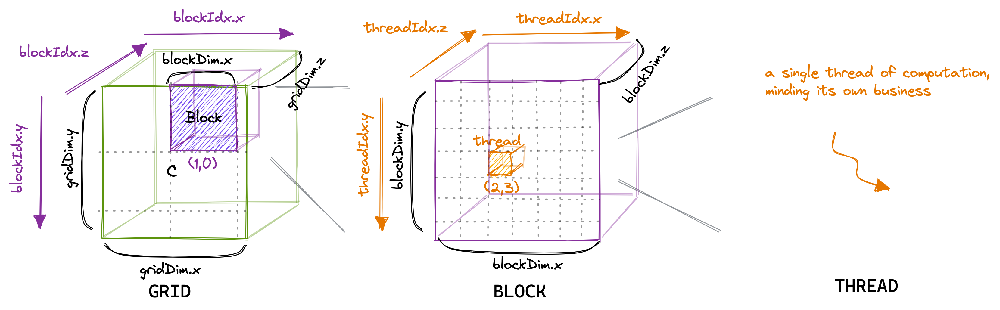

&nbsp;&nbsp;&nbsp;&nbsp;&nbsp;&nbsp;&nbsp;&nbsp;类似地，网格（grid）中的线程块（block）数量可以通过 gridDim 变量来配置。当我们从主机（在加速器术语中，主机指 CPU，设备指加速器，此处即 GPU）启动一个新的核函数（kernel）时，它会**创建一个单一的网格**，其中`包含所指定的线程块和线程`。从这里开始，我将只讨论二维的网格和线程块，部分原因是三维结构很少使用，而且三维绘图太难了。重要的是要记住，我们刚才讨论的线程层次结构主要关系到程序的正确性。至于程序性能（我们稍后会看到），将同一线程块中的所有线程视为等同的并不是一个好主意。<br>


&nbsp;&nbsp;&nbsp;&nbsp;&nbsp;&nbsp;&nbsp;&nbsp;对于我们的第一个核函数（kernel），我们将利用网格（grid）、线程块（block）和线程（thread）的层次结构，**为每个线程分配结果矩阵 C 中的一个唯一位置**。然后，该**线程**将计算矩阵 A 的对应行与矩阵 B 的对应列的点积(**即：一个线程计算一个向量积**)，并将结果写入 C。由于 C 中的每个位置仅由一个线程写入，因此我们不需要进行同步操作。我们将像下面这样启动核函数：<br>


```c++
// create as many blocks as necessary to map all of C
dim3 gridDim(CEIL_DIV(M, 32), CEIL_DIV(N, 32), 1);
// 32 * 32 = 1024 thread per block
dim3 blockDim(32, 32, 1);
// launch the asynchronous execution of the kernel on the device
// The function call returns immediately on the host
// C=αAB+βC : M 行 N列 K列, A指针，B指针，C指针 beta 系数
sgemm_naive<<<gridDim, blockDim>>>(M, N, K, alpha, A, B, beta, C);
```

&nbsp;&nbsp;&nbsp;&nbsp;&nbsp;&nbsp;&nbsp;&nbsp;CUDA 代码是从**单线程**的视角编写的。在核函数（kernel）的代码中，我们可以访问内置变量 blockIdx 和 threadIdx。这些变量会根据访问它们的线程返回不同的值。<br>

```c++
__global__ void sgemm_naive(int M, int N, int K, float alpha, const float *A,
                            const float *B, float beta, float *C) {
  // compute position in C that this thread is responsible for
  // C-Row : 连续的 threadIdx.x 访问不同的row;
  const uint x = blockIdx.x * blockDim.x + threadIdx.x;
  // C-Col : 连续的 threadIdx.x 访问相同的B原始值 : within-warp broadcast
  const uint y = blockIdx.y * blockDim.y + threadIdx.y;

  // `if` condition is necessary for when M or N aren't multiples of 32.
  if (x < M && y < N) {
    float tmp = 0.0;
    for (int i = 0; i < K; ++i) {
      tmp += A[x * K + i] * B[i * N + y];
    }
    // C = α*(A@B)+β*C : x 为C中行，y 为C中列
    C[x * N + y] = alpha * tmp + beta * C[x * N + y];
  }
}
```
To visualize this simple kernel: <br>

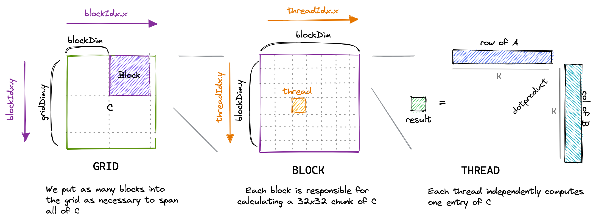

**[tile quantization](https://docs.nvidia.com/deeplearning/performance/dl-performance-matrix-multiplication/index.html#tile-quant)**

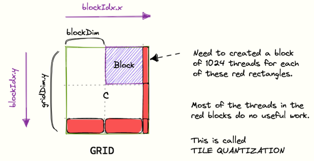


&nbsp;&nbsp;&nbsp;&nbsp;&nbsp;&nbsp;&nbsp;&nbsp;这个核函数（kernel）在 A6000 GPU 上处理三个 4092² 大小的 fp32（单精度浮点数）矩阵大约需要 **0.5 秒**。这个kernel是否有优化空间呢？下面我们来做一些与具体实现无关的计算. <br>

---

# 5 理论性能分析

A6000 GPU 理论性能

### A6000 GPU 性能规格表

| 精度类型 | 性能指标 | 应用领域 |
|:--------:|:--------:|:--------:|
| FP32（单精度） | 38.7 TFLOPS | 传统 HPC、CAD/CAE、科学模拟 |
| FP64（双精度） | 1.21 TFLOPS | 高精度科学计算（约为 FP32 的 1/32） |
| FP16/BF16 | 309.7 TFLOPS（Tensor Core 加速） | AI 训练 / 推理，LLM 大模型 |
| TF32 | 309.7 TFLOPS | 无需代码修改，AI 训练提速 5 倍 |
| INT8 | 619.4 TOPS | 高效 AI 推理，计算机视觉 |
| RT Core | 75.6 TFLOPS | 光线追踪，实时渲染 |

从表格中可以看出：

- **FP32 标称性能**：38.7 TFLOPS（传统 CUDA 核心）
- **Tensor Core 性能**：对于 FP16/BF16 和 TF32 分别可达 309.7 TFLOPS
- **双精度性能**：1.21 TFLOPS，约为单精度的 1/32
- **AI 专用性能**：INT8 可达 619.4 TOPS，适用于高效的 AI 推理任务

## 5.1 界定最快可能运行时间的下界

&nbsp;&nbsp;&nbsp;&nbsp;&nbsp;&nbsp;&nbsp;&nbsp;对于两个 4092² 矩阵的矩阵乘法，随后再加上一个 4092² 矩阵（以构成 GEMM，即通用矩阵乘法运算）：<br>

1. 总浮点运算次数（FLOPS）：2*4092³ + 4092²(bias 项) = 137 GFLOPS
1. 最小总数据读取量（read）：3 * 4092² * 4B（字节） = 201MB（兆字节）
1. 总数据存储量(write)：4092² * 4B（字节） = 67MB（兆字节）

>*注释：对于矩阵 C 的每个 4092² 个元素，我们都需要对两个大小为 4092 的向量执行点积运算，每一步都涉及一次乘法和一次加法。“先乘后加”通常映射到一条称为 FMA（融合乘加）的汇编指令，但**仍算作两次浮点运算（FLOPs）**。因此，总运算次数为 2*4092³ + 4092² = 137 GFLOPS（每秒十亿次浮点运算）。* <br>


&nbsp;&nbsp;&nbsp;&nbsp;&nbsp;&nbsp;&nbsp;&nbsp;因此，268MB（201MB读+67MB写）是任何实现都必须从/向全局 GPU 内存传输的绝对最小内存量, 这里假设全局内存有足够大的缓存。让我们来计算一下核函数性能的一些上限。该 GPU(A6000) 宣传的 fp32 计算吞吐量为 **30TFLOPs/s (vector core)**，全局内存带宽为 **768GB/s**。如果我们能达到这些数值，我们需要 **4.5ms** 来进行计算，需要 **0.34ms** 来进行内存传输。所以，根据我们的粗略估算，**计算时间大约是内存访问时间的 10 倍**。这意味着，`只要我们最终需要传输的内存量小于绝对最小内存量 278MB）的 10 倍`，我们最终优化的核函数就会是**计算受限的(compute-bound)**。

>*注释：全局内存是 GPU 的主内存区域。如果英伟达（Nvidia）宣传的 GPU 配备 80GB 内存和 1TB/s 的带宽，他们所说的就是全局内存的容量和带宽。稍后我们会讨论 GPU 上的其他内存区域，比如共享内存，它在物理上是独立的，并且具有非常不同的性能特征，。* <br>

## 5.2 Memory Access Pattern of the Naive Kernel

&nbsp;&nbsp;&nbsp;&nbsp;&nbsp;&nbsp;&nbsp;&nbsp;既然我们已经计算出了 fp32 GEMM（浮点32位矩阵乘法）计算的一些性能下限，那让我们再回到当前正在讨论的核函数（kernel）上来，弄清楚**为什么它比应有的速度慢这么多**。<br>

&nbsp;&nbsp;&nbsp;&nbsp;&nbsp;&nbsp;&nbsp;&nbsp;在我们的kernel中，同一block中两个thread(如 (0,0) 和(0,1) 号线程) 将访问加载B矩阵的同一行，A矩阵的不同行。如果我们假设最坏的情况：zero caching。此时每个线程都要从global memory load $2*4092 + 1$ floats 的数据。因为我们共有 $4092^2$ 个threads, 这将引起 548GB 的memory traffic.

> 548GB 需要传输的时间为 548 / 768 = 0.71s

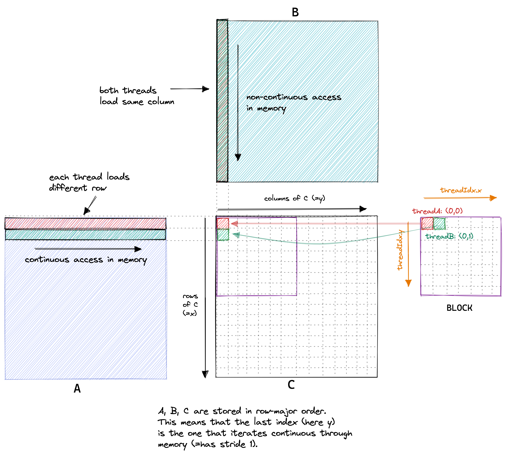

&nbsp;&nbsp;&nbsp;&nbsp;&nbsp;&nbsp;&nbsp;&nbsp;因此总结一下，当我在一块 A6000 GPU 上运行这个内核程序来计算两个 4092×4092 的 float32 类型矩阵相乘时，它仅实现了约 **300GFLOPs**（每秒 3000 亿次浮点运算）的性能。这**相当糟糕**，因为 A6000 的宣传性能是几乎可以达到 30 TFLOPs（每秒 30 万亿次浮点运算）。那么我们该如何提高这个速度呢？一种方法是对内核程序的内存访问模式进行优化，`使全局内存访问能够被合并（coalesced，即组合）为更少的访问次数`。


# 6 Kernel 2: Global Memory Coalescing

## 6.1 warp 访问 显存
在我们深入探讨全局内存合并（global memory coalescing）之前，需要先了解“warp（线程束）”这一概念。在执行过程中，一个线程块（block）中的线程会被分组到所谓的“warp”中，**每个warp包含32个线程**。然后，一个warp会被分配给一个warp调度器（该调度器是执行指令的物理核心core）。每个多处理器（multiprocessor）有**四个warp调度器scheduler**。线程被分组到warp的过程是**基于连续的threadId（线程ID）进行的**。如果我们设置blockDim（线程块维度）为多维，那么threadId的计算方式如下：<br>

```c++
// 第一个维度x 是连续的，在总线程ID中
threadId = threadIdx.x+blockDim.x*(threadIdx.y+blockDim.y*threadIdx.z)

// 等价形式(拆分括号)
threadId = threadIdx.x + blockDim.x * threadIdx.y + blockDim.x * blockDim.y * threadIdx.z
```

> 注释：在Volta架构之前，warp中的所有线程都来自同一个指令流。当遇到分支时，那些没有执行该分支的线程会通过所谓的“active mask（活动掩码）”被置为不活跃状态。然而，自Volta架构以来，依赖这种“warp同步”行为已经不再明智，因为即使是相同warp内的线程，不同分支的指令也可能会被交错执行（eg:16个lane执行32个threads）.<br>

&nbsp;&nbsp;&nbsp;&nbsp;&nbsp;&nbsp;&nbsp;&nbsp;然后，**具有相邻 threadId（线程ID）的线程会成为同一个 warp（线程束）的一部分**。下面我用一个包含 8 个线程的较小“warpsize”（真实的 warp 总是包含 32 个线程）来对此进行说明：<br>

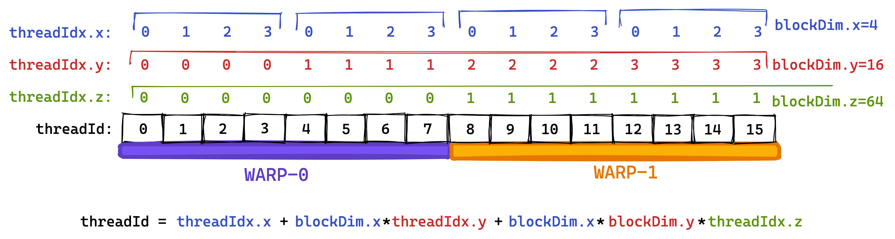

> 注释: 我们将 threadId（线程 ID）的三个维度 x、y、z 视为“按列优先（column-major）”排列的，因为在“warp 空间”中，第一个维度 x 是连续的。我不知道其他人是否使用这个术语，但对我来说它能让这个概念更清晰。<br>


&nbsp;&nbsp;&nbsp;&nbsp;&nbsp;&nbsp;&nbsp;&nbsp;warp（线程束）这一概念与第 Kernel 2 的实现方案相关，因为**属于同一个 warp 的线程进行的顺序内存访问可以被分组并作为一个操作来执行。这被称为全局内存合并（global memory coalescing，也可译为全局内存合并访问）**。在优化内核的全局内存（GMEM）访问以实现峰值带宽时，`这是需要牢记的最重要的一点`。<br>

## 6.2 如何合并全局内存访问

&nbsp;&nbsp;&nbsp;&nbsp;&nbsp;&nbsp;&nbsp;&nbsp;以下是示例：同一个 warp（线程束）中的线程进行的连续内存访问被分组，使得每个 warp 只需使用 2 次 32B 加载即可执行 8 次内存访问：<br>

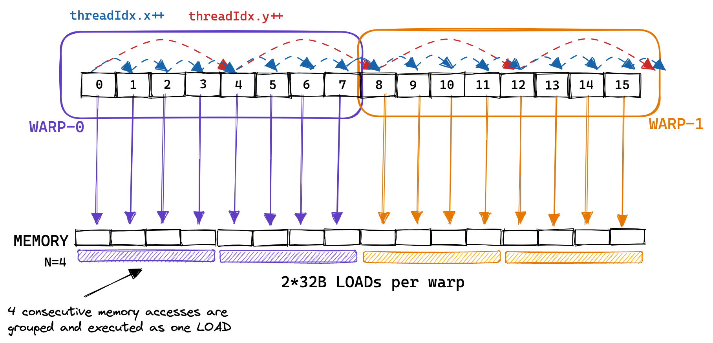

&nbsp;&nbsp;&nbsp;&nbsp;&nbsp;&nbsp;&nbsp;&nbsp;实际上，GPU 支持 32B、64B 和 128B 的内存访问。因此，如果每个线程都从全局内存中加载一个 32 位浮点数，warp 调度器（可能是 MIO）可以将这 **32*4B=128B** 的加载合并为**一次内存事务(transation)**。这只有`在加载的浮点数在内存中是连续的，且访问是对齐的情况下才可能实现`。如果访问不是连续的，或者由于其他原因无法实现合并访问，那么 GPU 将执行尽可能多的 32B 加载操作来获取所有浮点数，从而导致大量带宽浪费。在对我们的简单内核（naive kernel）进行性能分析时，我们可以观察到非合并访问的不利影响，因为此时我们仅实现了 15GB/s 的全局内存（GMEM）吞吐量。

> 针对 GPU 的`全局内存合并访问进行优化`，与针对 CPU 的缓存行利用率进行优化有很多相似之处。有趣的是，为了实现合并访问，warp 内的线程必须访问连续的地址，但这些访问在 warp 内不必是连续的。下面进行说明：

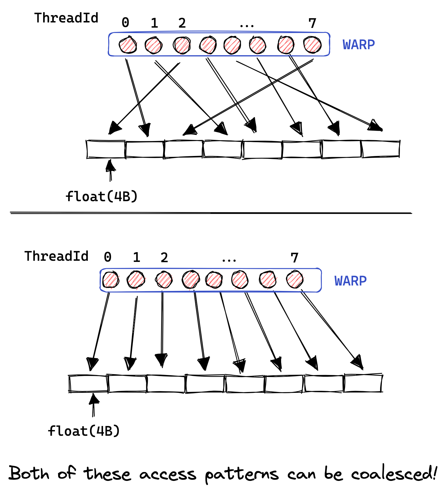

回顾之前的内核（kernel）代码，我们为线程分配 C 的元素时是这样做的：<br>

```c++
const uint x = blockIdx.x * blockDim.x + threadIdx.x; // x 为 C 中的行
const uint y = blockIdx.y * blockDim.y + threadIdx.y; // y 为 C 中的列
```

&nbsp;&nbsp;&nbsp;&nbsp;&nbsp;&nbsp;&nbsp;&nbsp;因此，同一 warp 中的线程（即 **threadIdx.x 连续的线程**）会从内存中`非连续地加载矩阵 A 的行`。上节 naive kernel 访问矩阵 A 内存的模式更像是如下所示：<br>

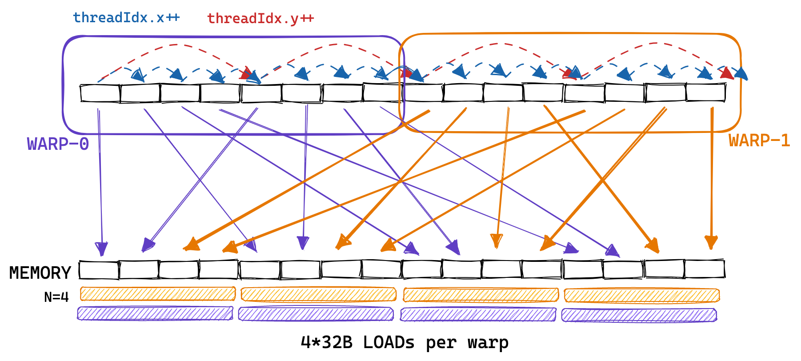

&nbsp;&nbsp;&nbsp;&nbsp;&nbsp;&nbsp;&nbsp;&nbsp;为了实现合并访问（coalescing），我们可以**更改将结果矩阵 C 的位置分配给线程的方式**。这种对全局内存访问模式的更改如下所示：<br>

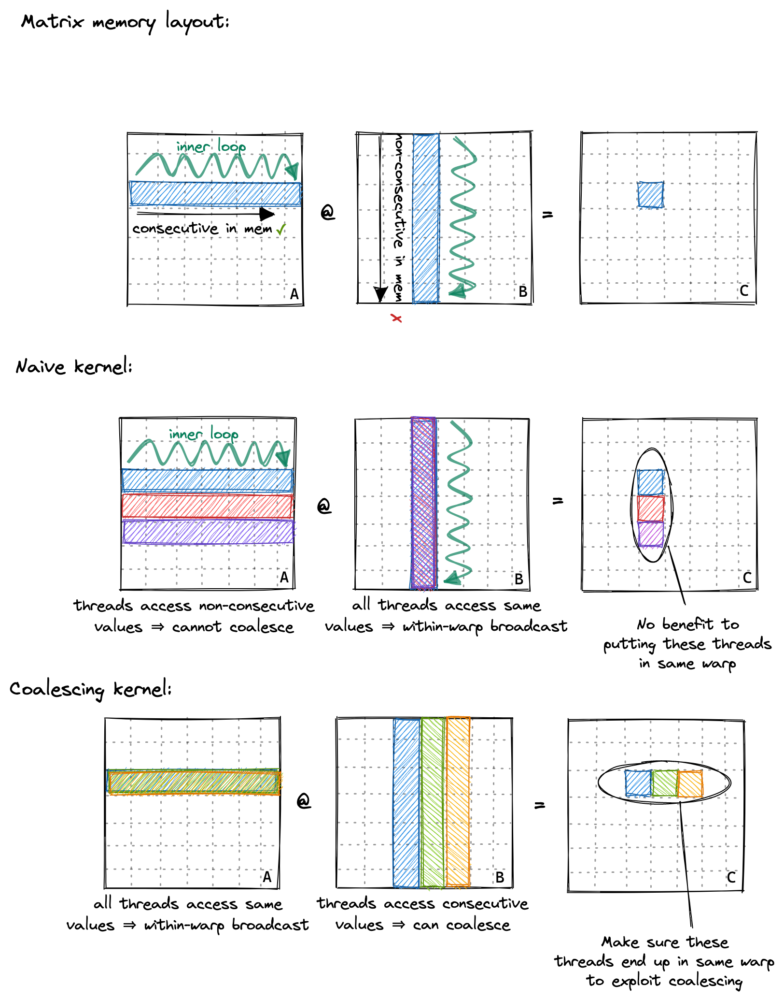


## 6.3 合并访问的的内核代码

**直接替换naive 代码的前两行即可实现合并coalesced 的访问**。<br>

```c++
template <const uint BLOCKSIZE>
__global__ void sgemm_global_mem_coalesce(int M, int N, int K, float alpha,
                                          const float *A, const float *B,
                                          float beta, float *C) {

  // 连续的threadIdx.x cRow 是不变的， 相邻threadIdx.x 读取A中相同的数据 ： within-warp broadcast
  const int cRow = blockIdx.x * BLOCKSIZE + (threadIdx.x / BLOCKSIZE);
  // B 是合并的访问, 相邻threadIdx.x 访问B中的连续数据
  const int cCol = blockIdx.y * BLOCKSIZE + (threadIdx.x % BLOCKSIZE);

  // if statement is necessary to make things work under tile quantization
  if (cRow < M && cCol < N) {
    float tmp = 0.0;
    for (int i = 0; i < K; ++i) {
      // A 是合并的访问, 因为访问同一个value, 属于within-warp broadcast
      tmp += A[cRow * K + i] * B[i * N + cCol];
    }
    // C 是合并的访问
    C[cRow * N + cCol] = alpha * tmp + beta * C[cRow * N + cCol];
  }
}
```

**Launch kernel 指令变为：**<br>

```c++
void run_sgemm_coalesce(int M, int N, int K, float alpha, float *A, float *B,
                        float beta, float *C) {
  dim3 gridDim(CEIL_DIV(M, 32), CEIL_DIV(N, 32));
  dim3 blockDim(32 * 32);
  sgemm_global_mem_coalesce<32>
      <<<gridDim, blockDim>>>(M, N, K, alpha, A, B, beta, C);
}
```

## 6.4 性能提升

&nbsp;&nbsp;&nbsp;&nbsp;&nbsp;&nbsp;&nbsp;&nbsp;全局内存合并访问（Global memory coalescing）将内存吞吐量从 15GB/s 提高到了 110GB/s。**性能达到了 2000 GFLOPS**，与第一个简单内核（naive kernel）的 **300 GFLOPS**相比，这是一个很大的提升。在接下来的内核（kernel）中，我们将使用 GPU 快速的片上内存（称为共享内存）来缓存将要重复使用的数据。


> 我一开始没立即明白这一点，但启用全局内存（GMEM）合并访问**并不会改变汇编代码（assembly）**，可以看看 Godbolt 上的 SASS 输出。**访问合并是在内核（kernel）运行时由硬件完成的**。这是有道理的，因为合并访问需要对齐的访问，而由于我们将矩阵指针作为函数参数传递，所以无法在编译时保证这一点。另外：汇编代码中即便在编译时不知道循环计数 K 的情况下，仍然对内层循环进行了部分展开（unrolling）。这太有趣了！<br>


## 6.5 另一种简单方式也可缓解GMEM 非合并访问的问题

**x,y 行列交换**

```diff
--- a/src/kernels/1_naive.cuh
+++ b/src/kernels/1_naive.cuh
@@ -14,16 +14,16 @@ MxK * KxN = MxN

 __global__ void sgemm_naive(int M, int N, int K, float alpha, const float *A,
                             const float *B, float beta, float *C) {
-  const uint x = blockIdx.x * blockDim.x + threadIdx.x;
-  const uint y = blockIdx.y * blockDim.y + threadIdx.y;
+  const uint x = blockIdx.x * blockDim.x + threadIdx.x; // x 设为列方向
+  const uint y = blockIdx.y * blockDim.y + threadIdx.y; // y 设为行方向

   // if statement is necessary to make things work under tile quantization
   if (x < M && y < N) {
     float tmp = 0.0;
     for (int i = 0; i < K; ++i) {
-      tmp += A[x * K + i] * B[i * N + y];
+      tmp += A[y * K + i] * B[i * N + x];
     }
     // C = α*(A@B)+β*C
-    C[x * N + y] = alpha * tmp + beta * C[x * N + y];
+    C[y * N + x] = alpha * tmp + beta * C[y * N + x];
   }
 }
```

# 7 Kernel 3: Shared Memory Cache-Blocking

## 7.1 shared memory 介绍
&nbsp;&nbsp;&nbsp;&nbsp;&nbsp;&nbsp;&nbsp;&nbsp;在大型全局内存（Global Memory）旁边，GPU 拥有一块物理上位于芯片上的、容量小得多的内存区域，称为共享内存（Shared memory）。从物理结构上看，`每个流式多处理器（SM）配备有一块共享内存`。从逻辑层面来讲，这块`共享内存会在各个线程块（block）之间进行划分`。这意味着，一个线程可以通过共享内存分区与**同属一个线程块**的其他线程进行通信。在我的 A6000 GPU 上，每个线程块最多可访问 **48KB** 的共享内存。

以下是一张关于 A100 GPU 内存层次结构的有用示意图：

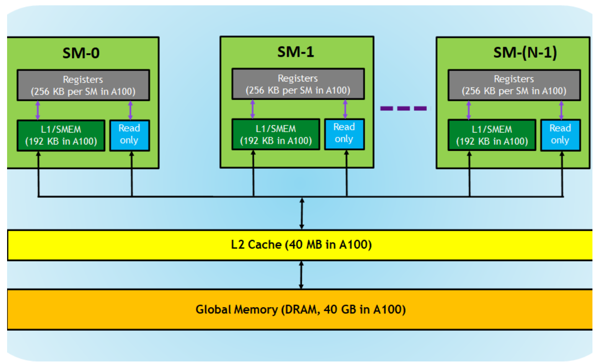

> 注释：SMEM 大小可配置，与L1 cache 进行trade-off.

Shared Memory 属于片上内存，与Global Memory 相比具有显著的低带宽和高带宽。A100 80GB SXM4 HBM2e 数据中心旗舰 提供 2039 GB/s (**2.04 TB/s**) 的带宽。对应 shared memory 总带宽 **19.4 TB/s** (128×108×1.41×10^9 字节 / 秒)。其中 SHM 128 字节 / 时钟周期, 1.41 GHz 的基础频率, 108个SM.

&nbsp;&nbsp;&nbsp;&nbsp;&nbsp;&nbsp;&nbsp;&nbsp;因此，对于下一个内核（kernel），我们将从全局内存中加载一块(a chunk) A 和一块 B 到共享内存中。然后，我们将在两块数据上**执行尽可能多的计算**，每个线程仍然负责计算 C 中的**一个元素**。我们将`沿着 A 的列和 B 的行`移动这些数据块，对 C 执行**部分和**的计算，直到得出最终结果。

- 共享内存容量提升：安培架构 SM 的共享内存可配置至164 KB(GA100) 或100 KB(GA102)，远超 Volta 的 96 KB 上限;
- 异步全局→共享内存拷贝：安培新增硬件加速的异步拷贝指令，大幅提升数据预取效率，减少等待时间NVIDIA;
- 带宽对比：共享内存带宽通常是全局内存的15-20 倍，同时延迟降低20-40 倍，是 GPU 内存层级中性能最优的层级之一;

## 7.2 shared memory kernel

对于下一个核函数，我们从全局内存中读取矩阵 A 和矩阵 B 的一个数据块，将其加载到共享内存中。随后，我们`在这两个数据块上执行尽可能多的运算`，每个线程依旧负责计算矩阵 C 中的`一个元素`。我们会沿着矩阵 A 的列方向与矩阵 B 的行方向滑动这些数据块，持续对矩阵 C 的元素进行部分和运算，直至最终结果计算完成。

详细过程如下图所示: <br>

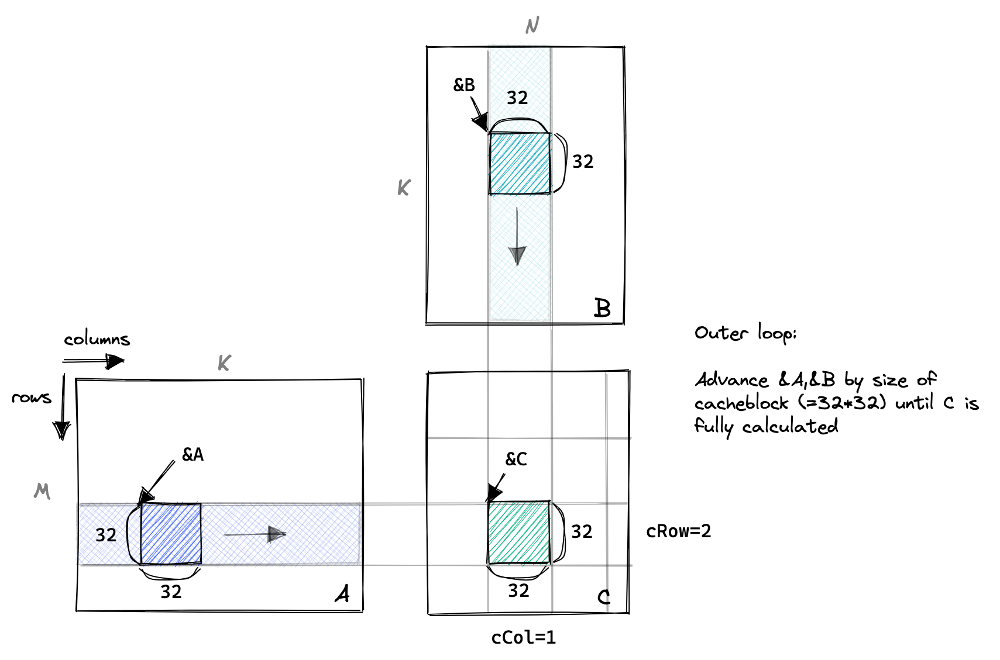


## 7.3 kernel代码如下

```c++
#define CEIL_DIV(M, N) (((M) + (N)-1) / (N))

void run_sgemm_shared_mem_block(int M, int N, int K, float alpha, float *A,
                                float *B, float beta, float *C) {
  dim3 gridDim(CEIL_DIV(M, 32), CEIL_DIV(N, 32));
  dim3 blockDim(32 * 32);
  // L1 cache becomes useless, since we access GMEM only via SMEM, so we carve
  // out all of L1 to SMEM. This doesn't currently make a difference, since
  // occupancy is limited by reg and thread count, but it's good to do anyway.
  cudaFuncSetAttribute(sgemm_shared_mem_block<32>,
                       cudaFuncAttributePreferredSharedMemoryCarveout,
                       cudaSharedmemCarveoutMaxShared);
  sgemm_shared_mem_block<32>
      <<<gridDim, blockDim>>>(M, N, K, alpha, A, B, beta, C);
}

template <const int BLOCKSIZE> // 32
__global__ void sgemm_shared_mem_block(int M, int N, int K, float alpha,
                                       const float *A, const float *B,
                                       float beta, float *C) {
  // the output block that we want to compute in this threadblock
  const uint cRow = blockIdx.x; // block 的行索引
  const uint cCol = blockIdx.y; // block 的列索引

  // 分配 shared mem, SHM 被一个block 内的所有线程共享
  __shared__ float As[BLOCKSIZE * BLOCKSIZE]; // 32x32
  __shared__ float Bs[BLOCKSIZE * BLOCKSIZE]; // 32x32

  // 当前线程对应的block 内的行号和列号
  const uint threadCol = threadIdx.x % BLOCKSIZE; // 列的索引连续threadIdx.x
  const uint threadRow = threadIdx.x / BLOCKSIZE; // 行索引非连续threadIdx.x

  // advance pointers to the starting positions
  A += cRow * BLOCKSIZE * K;                    // row=cRow, col=0  --> 矩阵 A 从第一列开始遍历
  B += cCol * BLOCKSIZE;                        // row=0, col=cCol  --> 矩阵 B 从第一行开始遍历
  C += cRow * BLOCKSIZE * N + cCol * BLOCKSIZE; // row=cRow, col=cCol --> 矩阵 C 当前block位置

  float tmp = 0.0; // 缓存每个 block 的中间结果

  // K iterations 按照 BlockSize 遍历
  for (int bkIdx = 0; bkIdx < K; bkIdx += BLOCKSIZE) {
    // 每个线程加载 A 和 B 中的 一个元素
    // 让 threadIdx.x 为 threadCol, 如此访问全局内存， 线程索引连续
    As[threadRow * BLOCKSIZE + threadCol] = A[threadRow * K + threadCol];
    Bs[threadRow * BLOCKSIZE + threadCol] = B[threadRow * N + threadCol];

    // block threads in this block until cache is fully populated
    __syncthreads();
    A += BLOCKSIZE;
    B += BLOCKSIZE * N;

    // execute the dotproduct on the currently cached block
    for (int dotIdx = 0; dotIdx < BLOCKSIZE; ++dotIdx) {
      tmp += As[threadRow * BLOCKSIZE + dotIdx] *
             Bs[dotIdx * BLOCKSIZE + threadCol];
    }
    // need to sync again at the end, to avoid faster threads
    // fetching the next block into the cache before slower threads are done
    __syncthreads();
  }

  // 最后将结果写回C
  C[threadRow * N + threadCol] =
      alpha * tmp + beta * C[threadRow * N + threadCol];
}
```

## 7.4 运行结果性能分析

&nbsp;&nbsp;&nbsp;&nbsp;&nbsp;&nbsp;&nbsp;&nbsp;上述kernel在A6000 上可以达到 **~2200GFLOPS** 的性能。 但距离A6000 vector core 的 性能上限 ~30 TFLOPS 还差很多。从下面的 roofline 图可明显看出：<br>

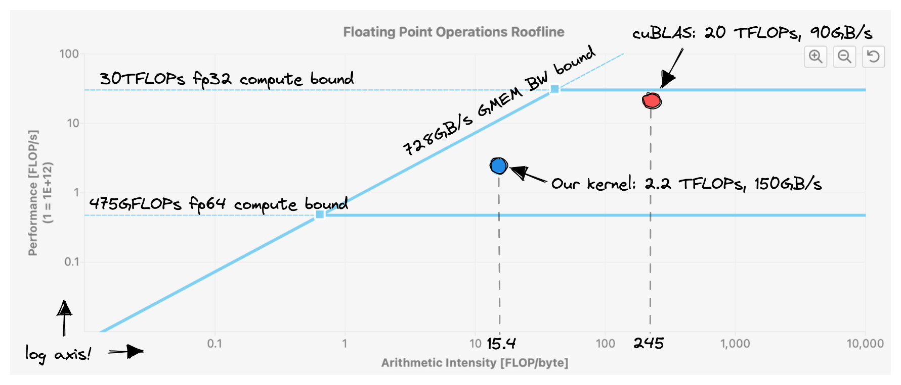

在32 chunksize下，一个block中使用 $2 * 32 * 32 * 4B= 8 KB$ 的shared memory 大小. A6000 GPU 上每个block 最多使用 48 kB 的shared memory。因此，上述kernel 还远远低于上限。这可能不是一个问题，因为增加per-block 的shared-memory 使用量也可能有缺点。每个流式多处理器（SM）最多有**100KB**的共享内存（SMEM）可用。这意味着，如果我们修改内核以使用全部48KB的SMEM，则每个SM同时**只能保持两个块的加载状态**。在CUDA术语(parlance)中，`增加每个块对SMEM的使用率可能会降低占用率`。

- 占用率(occupancy)：每个SM上活跃线程束(warp)的数量与每个SM上可能的最大活跃线程束(active warp)数量之比。

> 重点：**增加每个块对Shard-memory的使用率可能会降低占用率**

> 注解：A100 中 Shared-memory 静态分配(__shared__)时最大使用**48KB**，动态分配(extern __shared__)时最大使用**64KB**, 动态分配需要显示指定动态共享内存的大小： kernel<<<grid, block, dynamic_size>>>()。


&nbsp;&nbsp;&nbsp;&nbsp;&nbsp;&nbsp;&nbsp;&nbsp;高占用率（High occupancy）是有用的，因为它允许我们通过**拥有更多可发布的指令池**来隐藏操作的高延迟。在流式多处理器（SM）上加载更多active blocks存在三个主要限制：寄存器数量、线程束数量和共享内存（SMEM）容量。让我们为当前内核进行一个示例计算。

Kernel 3 Occupancy Calculation:

以下是与我的GPU相关的硬件参数，这些参数是通过cudaGetDeviceProperties API获取的（多处理器是我们之前讨论过的SMs）：<br>

# 8 占用率分析 occupancy calculation

## 8.1 概念
占用率(occupancy)：每个SM上活跃线程束(warp)的数量与每个SM上可能的最大活跃线程束(active warp)数量之比。

任务发放力度：**以线程块为粒度分配至流式多处理器（SM）** 上执行。`只要某一流式多处理器拥有足够的资源来容纳线程块，它就会加载更多的线程块`。

## 8.2 硬件资源获取
以下是通过 cudaGetDeviceProperties 接口获取的、我的 GPU 的相关硬件参数（其中多处理器就是我们之前提到的流式多处理器（SM））：

> 注释： 共享内存的容量可通过一项名为 SharedMemoryCarveout 的特性进行配置。所谓的统一数据缓存会被划分为一级缓存（L1 cache）和共享内存，因此我们可以通过减少共享内存容量来换取更大的一级缓存空间。

NVDIA RTX A6000 GPU 硬件参数:

**NVIDIA RTX A6000 GPU 硬件规格表**

| Metric | Value |
|--------|-------|
| Name | NVIDIA RTX A6000 |
| Compute Capability | 8.6 |
| max threads per block | 1024 |
| max threads per multiprocessor | 1536 |
| threads per warp | 32 |
| warp allocation granularity | 4 |
| max regs per block | 65536 |
| max regs per multiprocessor | 65536 |
| reg allocation unit size | 256 |
| reg allocation granularity | warp |
| total global mem | 48685 MB |
| max shared mem per block | 48 KB |
| CUDA runtime shared mem overhead per block | 1024 B |
| shared mem per multiprocessor | 102400 B |
| multiprocessor count | 84 |
| max warps per multiprocessor | 48 |

> 这份硬件规格表提供了开发CUDA程序时所需的关键参数，特别是对于优化线程块大小、共享内存使用和寄存器分配等方面非常重要。

## 8.3 占用率计算
我们kernel 3 的 需求：

将您提供的信息转换为markdown格式：

| Parameter | Value |
|-----------|--------|
| Registers per Thread | 37 |
| SMEM per Block | 8192 B |
| Threads per Block | 1024 |

任务会**以线程块为粒度分配至流式多处理器（SM）** 上执行。`只要某一流式多处理器拥有足够的资源来容纳线程块，它就会加载更多的线程块`。计算过程如下：

- **共享内存：** 每线程块 8192B + 每线程块 1024B（CUDA 运行时占用, 用户无法直接使用） = 每线程块 9216B。==> （每流式多处理器 102400B）÷（每线程块 9216B）= 11.11 → 线程块数量上限为 11 个。
- **Threads:** 1024 Threads per Block, max 1536 threads per SM ⇒ 线程块数量上限为 1 block.
- **寄存器：** 每个线程 37 个寄存器 × 每个线程束 32 个线程 = `每个线程束 1184 个寄存器`。寄存器的分配对齐粒度为线程束级 256 个寄存器，因此向上取整为`每个线程束 1280 个寄存器`。我们按每线程块（1024 个线程 ÷ 32）= 32 个线程束计算，由此可得 1280 个寄存器每线程束 × 32 个线程束每线程块 = 40960 个寄存器每线程块。每流式多处理器（SM）的寄存器上限为 65536 个 ==> 线程块数量上限为 1 个。

> 注释：令人惊讶的是，寄存器文件的存储空间竟然比共享内存还要大！每个线程块最多可使用 48KB 的共享内存，而寄存器空间则可达 65536 × 4B = 262KB。

因此，这个核函数的性能会受到每线程块**线程数**与每线程**寄存器数**的限制。每个流式多处理器（SM）最多只能加载**一个**线程块，最终计算得出的线程束占用率为：32 个活跃线程束 ÷ 48(gpu 限制) 个最大活跃线程束 = 66%。

## 8.4 性能分析

66% 的线程束**占用率**其实不算低，所以这并不能解释我们的核函数为何运行得如此缓慢。借助性能分析器，我们找到了一些线索。首先，`观察已执行指令的构成`可以发现，其中大部分都是**内存加载指令**。

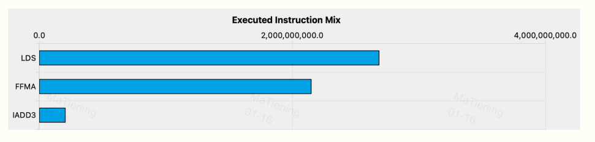

我们内部的循环类似于这种 **PTX** ([Godbolt link](https://godbolt.org/#z:OYLghAFBqd5TKALEBjA9gEwKYFFMCWALugE4A0BIEAZgQDbYB2AhgLbYgDkAjF%2BTXRMiAZVQtGIHgBYBQogFUAztgAKAD24AGfgCsp5eiyahUAV0wtyKxqiIEh1ZpgDC6embZMQAVgBs5M4AMgRM2AByngBG2KQgAMwA7OQADuhKxA5Mbh5evgFpGfZCIWGRbDFxSdbYtsVMIkQspEQ5nt7SyTbYdlmNzUSlEdGxCV1NLW15ndYTg6HDFaNJAJTW6GakqJxcAKQATPGhqB44ANS78S4SwGTESGyXuLtaAIIHR0wnFtgXV6hKIiEdBPF7vQ7HU6/S4uAFA%2BgEKKgt4fSE/P6wsxRIxKAD6ADd9gA6JDI8Gfb7nGHmSy40hmYQEDgkslgj44OhhM4uXAASSCuIAIryAGoQACy5DO4RWZyg4tlBwAQnKZQBaHiygD0qpWbLeuNxwHo6CiEkNZ3x6AImDOSmA2DYbFxSiQzWwmFxHGd2PQqAA1hBQkQzpKzsHpVKIwBpKU0E0sEMSFJu8hgs4ZzNZ7M53N5zMYJiAs7x9CJs4AKleUsLxdL5YrSrTb3zrbb%2BfrIZiTTjCZDFZcisSSvTZ1rIYjSqCAHkXNGRLyAFrPeKC%2BL7S4jlsXbdanVEJC/DZEFJmLsmgNnA/lgDuvxvxhDJDH6DYp6Iv1CV6QBCU39I2AsJgvoBqO45nGYEaoAASugN5/IKZwgf6vKYOoRLqJuYFCMWkHCGOOQIUhF4oWhRIAJ5YSiu46hIF6Jr8URmDQNCxCWZBjpsAH4ch4ZMCWLDFq67q2t6o57naboAaJjrhn%2BwnSUh2BEHezBnHR/6AZgf5fiwxF%2Bv6o6GgpHoWp2ZyvEouw%2BEqU6zvOS64JWZx2XOC7LtZgpUa8GbGVJpm4iWfYuVZNmuQ5y7OeF7nPD4XnxFu7w0d%2Bn5MGEpBnKQcEXPsfgvvQ363tgYBcAB6moNsSgZCYfHfr%2BmlAdhRYhnhT5IABQGEZciEHh1mCoeh6g5T4Lkzm5jneRm4GtQ1mCwfB3WzQNGFnDq0UTQl%2Bo%2BattGYPixjbGcaTBrEf7PgevyAgMoTAEd6SZDho4%2Bcqi0wdlFajfZMXOdGm7tnmElZTe3VvTeNbuN1WijiqL2rgR7hRWNEUriq/2toDcGQ%2BD9Agzko4uDlI5w6DiNfY5znhIT8MFR960eQlO2ZZjq6g9juMQ9R23mUQb5EVoRJQ5t26CBlQY8aRQ2LYLKpRBLGJnL9DOywNhOLXTuBDolWYSQAEiw%2BK/IBqBILNZwJraQhHjQKVnLUjrMEQOn8c9uUuaOGYSeKLD%2Br8F2zYREDdb1WnLeosp%2B7WPRngQBt8TgmHbh7%2B7oOp9AmvBxqmhIZzemQ5HlZVf4YBI2BKKgN3uxZoVKsHQHzaT42Rcq/sQ3FRHvDZtdze9CtU13eNxZNmZKtXXf17TSPfc3/et4havWTX7VaeP0p90vnWz95lcSbxXdO3Vf68Qy9gFeIxufn%2BNBmGn%2BdpKeRgfpglfGeRXx7xAepC9tGYu0TiHq0PDMMN9h/0%2Bo3JyH1whb0TozbA6go4fhtpgdAJ4sqYDMHYM4QgbbmFINxIg9B85n0PLaZClcRZygjMgogKspZ/WobQq4YDkZ/ReiAhhaFNaVwzDzFIqs4aWQXmPHu6sqYcMwm3Cs3C8wjwXuIhuyM159QHvFLWmZdiJC8jAiSYQPRXhTkoV%2BqB1LABYLpNqhsmCYClM%2BfW1pbQ0EEh%2BDKe9t46lYkQY2N0bZhHUOeAyfFzqHjHCwc%2BSkRaXXTmxPe6kyrILCM/F0Rj36fzURorR20XBCPXt3eCkClFaRUQhaRyY3TOV4VTbsekPpZM7jklelNp45JUVvTRXA1j0G4D4fg3guA6HIOgbgLgFCCh8lkkBzclAbC2NCQ4fByBEG0O0tYh4gKjA/uQf0vgtCGG4NIHpSyBncH4EoEAOzFl9PaeQOAsAUAYDfAwWIlBqD3JSI8uITB8QVR4DwZIOB8QEG2CKAg2AbzThSMwQ5dB6DONORAKIhyoihGaORbg8z7kcGENOJghDDk4DYMYY0Ox%2BmEAAr0A2pzLmBHgeYD8aL%2BAnU6VShEURSAorcDgQ5RBSBMnpWseMLBgBKGBaC8FkLeD8EEMIMQJcpCyClYoFQGhDn6H2IYQlaALBWBZacyAax0ApHqJSk5dteiOAgM4KY3geCBCsUMcolQDCFAetkdw7QnX3XqPakYcQbXdDNQ0OYVqDD%2BvqP0Fo3qli%2BtmAMYNfq5iRsdZqdYmxthSA6V0g5VLBlcGlCKFwBMflEkSALOU%2BBiAcQ%2BJqfgFydArBWVpdZawtk%2BB2Uy/Z5Ben9JzScs5Cyln1t2VwfY/A2AgGkPzPwPhEgAE5DhaH2IkeIWgfAzp8D4Tthye39suWsG5yAQD/MBdgZ5EBXnvPCOwHY4R82Fp4MWgW/APQVp5ZgAwCqZWSBkHIYQyg1CaCpaqmodQshOCscG6QAAOW1mBE2jB4D4G1zr6hxtSJ6rIcHfXSBncBnoYag1uumNB0NfQE0LAdfBxDMbJiEetdR%2BYZQfVypnWsbl2BsA2jORmrg3TN3Zu4IKbAALDoirvBlG9BazhFpLVoMthASAZSrVKNwDzGCKcOPsFYNaB0NrWXEDZWyeBaDbXs0dvgZ1EniNIfYWhEh%2BBnYkXKM6J2yC7fwbdpzzk6c2VIYzQ74hZu7ccndda1gG1IBkRw0ggA%3D))

```sh
ld.shared.f32   %f91, [%r8+3456];
ld.shared.f32   %f92, [%r7+108];
fma.rn.f32      %f93, %f92, %f91, %f90;
```

> 注释：LDS 指的是共享内存读取操作。FMA 是我们所使用的乘加融合指令。IADD3 是一种三输入整数加法指令，我们在沿 K 维度移动指针时会用到该指令。

> 注释 ： **运算强度/ai对性能影响（compute bounds 和 memory bounds 对应最高最低值）**

> 注释：我们发现，cuBLAS 可实现约 245 次浮点运算每字节（FLOPs/Byte） 的运算强度，据此我们能够针对 arithmetic intensity（AI） 对内核进行优化。无论是在运算强度极高还是极低的场景下，要达到峰值吞吐量都无需依赖高线程占用率。

> arithmetic intensity (AI)：运算强度，指计算过程中浮点运算次数与内存访问字节数的比值，是衡量内核计算效率的核心指标。
> FLOPs/Byte：次浮点运算每字节，运算强度的单位。
> occupancy：线程占用率，指 GPU 上实际活跃的线程束占硬件最大支持线程束数量的比例
> cusp behaviour：尖点特性，由 Volkov 在论文中提出的概念，描述 GPU kernel 性能随运算强度变化的非线性特征 —— **在特定运算强度区间内**，性能会出现 “尖点” 式跃升。

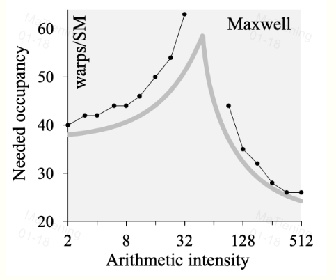

这可不是个好现象 —— 要知道`内存加载操作的延迟必然高于简单的融合乘加（FMA） 指令`，而且我们原本的预期是这个核函数应该属于计算密集型。我们从**性能分析器**的线程束状态采样数据中就能看到这种影响：该数据会量化统计`每条已执行指令`在各个状态下消耗的`时钟周期数`。

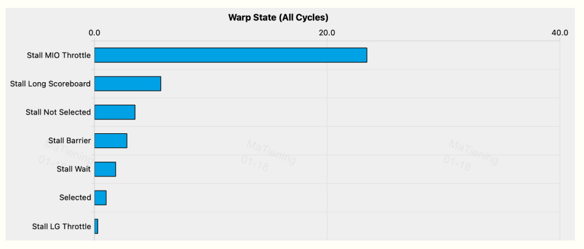

The meaning of the states is documented in the [Kernel Profiling Guide](https://docs.nvidia.com/nsight-compute/ProfilingGuide/index.html#metrics-reference).

- 关于MIO 节流型Throttle Stall，其描述如下:<br>
线程束处于停顿状态，等待内存输入输出（MIO）指令队列被清空。当内存输入输出（MIO）流水线被高度占用时，此类停顿原因的占比会显著升高 —— 该流水线涵盖特殊数学运算指令、动态分支指令以及共享内存操作指令。

- Stall Not Selected <br>
是指线程束已具备被调度的条件，但调度器却选择了另一路符合条件的线程束。这一现象进一步印证了我们此前的假设 —— 当前线程占用率并非性能瓶颈所在。<br>
**原因**：如果占用率不足，活跃线程束数量少，调度器根本没有 “选择其他线程束” 的空间 —— 只要有线程束满足调度条件，就会立刻调度它，不会出现 “选中其他线程束而让当前线程束停顿” 的情况。

我们既没有使用特殊的数学指令，也没有使用动态分支，因此可以明确，程序执行停滞的原因是**等待共享内存（SMEM）的访问结果返回**。那么，我们该如何减少核函数中共享内存指令的调用次数呢？一种方法是**让每个线程计算多个输出元素**，这样就能`更多地在寄存器中完成运算，从而降低对共享内存的依赖`。


# 9 Kernel 4: 1D Blocktiling for Calculating Multiple Results per Thread

因此，下一个核函数的工作方式与上一个核函数类似，但新增了一个内层循环，用于每个线程计算多个 C 矩阵元素。我们现在将共享内存缓存大小设置为 BM x BK + BN x Bk = 64×8+64×8 = 1024 个浮点型数据，这意味着每个线程块占用的共享内存总计为 4KB。

下方是对应的可视化示意图，我用橙色和红色分别高亮了两个线程，以及它们在内层循环中访问的数据。

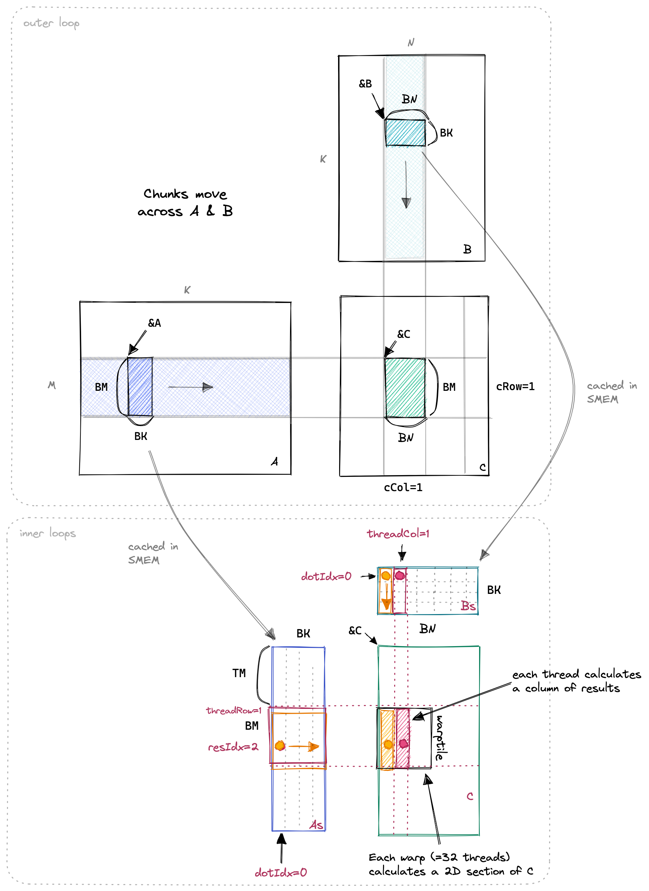


这个核函数的所有关键改动都发生在内层循环中。从全局内存（GMEM）到共享内存（SMEM）的数据加载过程，则基本和之前保持一致。我们来看具体实现：

```c++
#pragma once

#include <algorithm>
#include <cassert>
#include <cstdio>
#include <cstdlib>
#include <cublas_v2.h>
#include <cuda_runtime.h>

#define CEIL_DIV(M, N) (((M) + (N)-1) / (N))

void runSgemm1DBlocktiling(int M, int N, int K, float alpha, float *A, float *B,
                           float beta, float *C) {
  const uint BM = 64;
  const uint BN = 64;
  const uint BK = 8;
  const uint TM = 8;

  dim3 gridDim(CEIL_DIV(N, BN), CEIL_DIV(M, BM));
  dim3 blockDim((BM * BN) / TM); // 64 * 8 = 512

  sgemm1DBlocktiling<BM, BN, BK, TM><<<gridDim, blockDim>>>(M, N, K, alpha, A, B, beta, C);
}

template <const int BM, const int BN, const int BK, const int TM>
__global__ void sgemm1DBlocktiling(int M, int N, int K, float alpha,
                                   const float *A, const float *B, float beta,
                                   float *C) {
  // 若此处交换 x 和 y 的顺序，在处理大型矩阵时性能会下降约 30%。
  // 当前的配置可提升 30% 的性能，其优势在于：块 ID 连续的线程块会按顺序访问矩阵 B 的列，
  // 同时复用矩阵 A 的同一行数据。
  // 而性能较差的那种配置，虽然会复用矩阵 A 的列数据，但对矩阵 B 的访问将变为非连续模式。
  // 因此，前者具备更优的空间局部性，进而能实现更高的 L2 缓存命中率。
  const uint cRow = blockIdx.y;
  const uint cCol = blockIdx.x; // blockIdx.x 沿着列方向移动

  // each warp will calculate 32*TM elements, with 32 being the columnar dim.
  // threadIdx.x : 64 * 8 = 512
  const int threadCol = threadIdx.x % BN; // block 内的列
  const int threadRow = threadIdx.x / BN; // 512 / 64 = 8 --> 0 ...8

  // 分配SMEM : allocate space for the current blocktile in SMEM
  __shared__ float As[BM * BK]; // 64 * 8 = 512
  __shared__ float Bs[BK * BN]; // 64 * 8 = 512

  // 分块的开始位置
  A += cRow * BM * K;
  B += cCol * BN;
  C += cRow * BM * N + cCol * BN;

  // todo: adjust this to each thread to load multiple entries and
  // better exploit the cache sizes
  assert(BM * BK == blockDim.x);
  assert(BN * BK == blockDim.x);

  // tile A 矩阵中的列和行 threadIdx.x : 64 * 8 = 512
  const uint innerColA = threadIdx.x % BK; // warp-level GMEM coalescing
  const uint innerRowA = threadIdx.x / BK;

  // tile B 矩阵中的列和行
  const uint innerColB = threadIdx.x % BN; // warp-level GMEM coalescing
  const uint innerRowB = threadIdx.x / BN; // 64 个元素一行

  // allocate thread-local cache for results in registerfile
  // 一次计算 TM=8 个值
  float threadResults[TM] = {0.0};

  // 外层循环遍历 K, 间隔 BK
  for (uint bkIdx = 0; bkIdx < K; bkIdx += BK) {
    // 填充共享内存缓存
    As[innerRowA * BK + innerColA] = A[innerRowA * K + innerColA];
    Bs[innerRowB * BN + innerColB] = B[innerRowB * N + innerColB];
    __syncthreads();

    // advance blocktile
    A += BK;
    B += BK * N;

    // 0 ... 8 : calculate per-thread results
    for (uint dotIdx = 0; dotIdx < BK; ++dotIdx) {
      // we make the dotproduct loop the outside loop, which facilitates
      // reuse of the Bs entry, which we can cache in a tmp var.
      float tmpB = Bs[dotIdx * BN + threadCol];
      for (uint resIdx = 0; resIdx < TM; ++resIdx) { // 0 ... 8, 8 列元素
        threadResults[resIdx] += As[(threadRow * TM + resIdx) * BK + dotIdx] * tmpB;
      }
    }
    __syncthreads();
  }

  // 一个线程执行 TM 个结果
  for (uint resIdx = 0; resIdx < TM; ++resIdx) {
    C[(threadRow * TM + resIdx) * N + threadCol] = alpha * threadResults[resIdx] + beta * C[(threadRow * TM + resIdx) * N + threadCol];
  }
}

```


# 10 参考
- [CUDA_MMM](https://siboehm.com/articles/22/CUDA-MMM)
- [code address](https://github.com/siboehm/SGEMM_CUDA)
