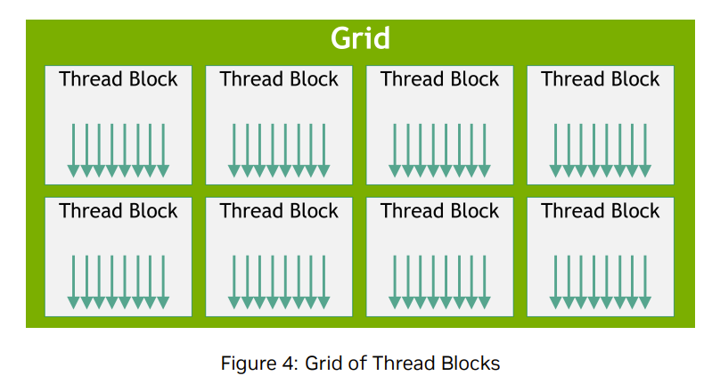
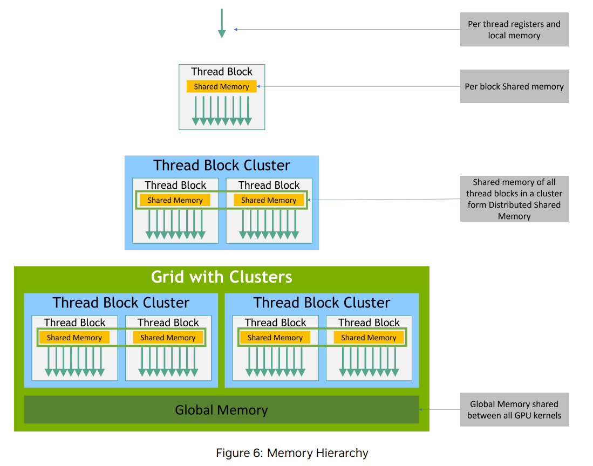
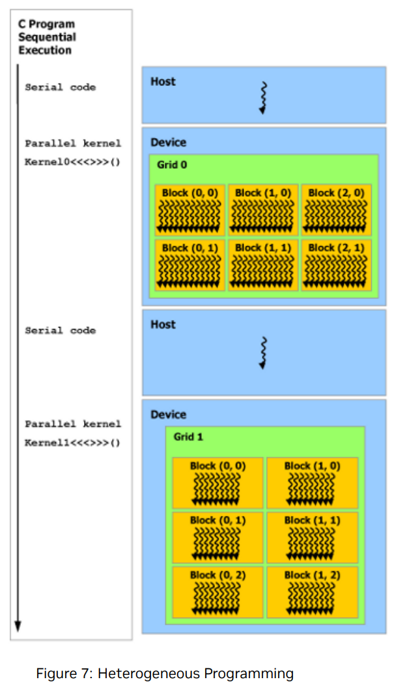

# 2 线程层次结构

&nbsp;&nbsp;&nbsp;&nbsp;&nbsp;&nbsp;&nbsp;&nbsp;为了方便起见，**threadIdx 是一个三维向量**，因此可以使用一维、二维或三维的`线程索引`来标识线程，从而形成一个一维、二维或三维的线程块，称为线程块。这提供了一种自然的方式来在域（如向量、矩阵或体数据）的元素上调用计算。

&nbsp;&nbsp;&nbsp;&nbsp;&nbsp;&nbsp;&nbsp;&nbsp;**线程的索引(threadIdx)与其线程 ID** 之间存在直接的关系：`对于一维块，它们是相同的`；对于大小为 (Dx, Dy) 的二维块，索引为 (x, y) 的线程的线程 ID 是 (x + y * Dx)；对于大小为 (Dx, Dy, Dz) 的三维块，索引为 (x, y, z) 的线程的线程 ID 是 (x + y * Dx + z * Dx * Dy)。

&nbsp;&nbsp;&nbsp;&nbsp;&nbsp;&nbsp;&nbsp;&nbsp;例如，以下代码将两个大小为 NxN 的矩阵 A 和 B 相加，并将结果存储到矩阵 C 中。

```cu
∕∕ Kernel definition
__global__ void MatAdd(float A[N][N], float B[N][N],
float C[N][N]) {
    int i = threadIdx.x;
    int j = threadIdx.y;
    C[i][j] = A[i][j] + B[i][j];
}

int main() {
    ...
    ∕∕ Kernel invocation with one block of N * N * 1 threads
    int numBlocks = 1;
    dim3 threadsPerBlock(N, N);
    MatAdd<<<numBlocks, threadsPerBlock>>>(A, B, C);
    ...
}
```

&nbsp;&nbsp;&nbsp;&nbsp;&nbsp;&nbsp;&nbsp;&nbsp;每个线程块中的线程数量是有限制的，因为`同一线程块中的所有线程`都预期驻留在**同一个**流式多处理器（Streaming Multiprocessor，简称**SM**）核心上，并且必须共享该核心有限的内存资源。在当前 GPU 上，`一个线程块最多可以包含 1024 个线程`。

&nbsp;&nbsp;&nbsp;&nbsp;&nbsp;&nbsp;&nbsp;&nbsp;然而，一个内核（kernel）可以由多个形状相同的线程块来执行，因此`线程的总数等于每个线程块中的线程数乘以线程块的数量`。

&nbsp;&nbsp;&nbsp;&nbsp;&nbsp;&nbsp;&nbsp;&nbsp;`线程块被组织成一维、二维或三维的线程块网格`，如图4所示。网格中线程块的数量通常由正在处理的数据的大小决定，而`数据大小通常会超过系统中处理器的数量`。



&nbsp;&nbsp;&nbsp;&nbsp;&nbsp;&nbsp;&nbsp;&nbsp;在<<<...>>>语法中指定的**每个线程块中的线程数**以及**每个网格中的线程块数**可以是int类型或dim3类型。二维的线程块或网格可以像上面的示例那样指定。

&nbsp;&nbsp;&nbsp;&nbsp;&nbsp;&nbsp;&nbsp;&nbsp;网格中的**每个线程块都可以通过一个一维、二维或三维的唯一索引来标识**，该索引可以通过内置变量blockIdx在内核(kernel)中访问。线程块的维度可以通过内置变量blockDim在内核(kernel)中访问。

&nbsp;&nbsp;&nbsp;&nbsp;&nbsp;&nbsp;&nbsp;&nbsp;将前面的MatAdd()（矩阵相加）示例扩展为处理多个线程块，代码将如下所示。

```cu
∕∕ Kernel definition
__global__ void MatAdd(float A[N][N], float B[N][N], float C[N][N]) {
    int i = blockIdx.x * blockDim.x + threadIdx.x;
    int j = blockIdx.y * blockDim.y + threadIdx.y;
    if (i < N && j < N)
    C[i][j] = A[i][j] + B[i][j];
}

int main() {
    ...
    ∕∕ Kernel invocation
    dim3 threadsPerBlock(16, 16);
    dim3 numBlocks(N ∕ threadsPerBlock.x, N ∕ threadsPerBlock.y);
    MatAdd<<<numBlocks, threadsPerBlock>>>(A, B, C);
    ...
}
```

# 3 内存层次结构

&nbsp;&nbsp;&nbsp;&nbsp;&nbsp;&nbsp;&nbsp;&nbsp;CUDA 线程在执行期间可能会访问多个内存空间，如图 6 所示。每个线程都有私有的本地内存。**每个线程块都有共享内存**，该内存对`块中的所有线程可见`，且生命周期与该块相同。线程块集群(Cluster)中的线程块可以对彼此的共享内存执行读、写和原子操作。所有线程都可以访问相同的`全局内存`。<br>

&nbsp;&nbsp;&nbsp;&nbsp;&nbsp;&nbsp;&nbsp;&nbsp;此外，还有两个**所有线程均可访问的只读内存空间：1.常量内存空间和2.纹理内存空间**。全局、常量和纹理内存空间针对不同的内存使用场景进行了优化（详见“设备内存访问”）。纹理内存还为某些特定数据格式提供了不同的寻址模式以及数据过滤功能（详见“纹理和表面内存”）。

&nbsp;&nbsp;&nbsp;&nbsp;&nbsp;&nbsp;&nbsp;&nbsp;全局、常量和纹理内存空间在同一应用程序的多次kernel启动过程中是持久的。



# 4 异构编程

&nbsp;&nbsp;&nbsp;&nbsp;&nbsp;&nbsp;&nbsp;&nbsp;如图 7 所示，CUDA 编程模型假设 CUDA 线程在一个与运行 C++ 程序的主机物理上分离的设备上执行，该设备作为主机的协处理器运行。例如，**当kernel在 GPU 上执行，而其余的 C++ 程序在 CPU 上执行时**，就是这种情况。<br>

&nbsp;&nbsp;&nbsp;&nbsp;&nbsp;&nbsp;&nbsp;&nbsp;CUDA 编程模型还假设主机和设备都在 DRAM 中**维护各自独立的内存空间**，分别称为主机内存和设备内存。因此，程序通过调用 CUDA runtime API（described in Programming Interface）来管理kernel可见的全局、常量和纹理内存空间。这包括设备内存的分配和释放，以及主机和设备内存之间的数据传输。

&nbsp;&nbsp;&nbsp;&nbsp;&nbsp;&nbsp;&nbsp;&nbsp;统一内存（Unified Memory）提供了托管内存来桥接主机和设备内存空间。托管内存作为单一、一致的内存映像，具有公共地址空间，系统中的所有 CPU 和 GPU 均可访问。此功能支持设备内存的超量分配，并且通过消除在主机和设备上显式镜像数据的需要，可以极大地简化应用程序移植的任务。有关统一内存的介绍，请参阅统一内存编程(Unified Memory Programming)。



# 5 异步单指令多线程（SIMT）编程模型

&nbsp;&nbsp;&nbsp;&nbsp;&nbsp;&nbsp;&nbsp;&nbsp;在 CUDA 编程模型中，线程是执行**计算或内存操作**的最低级别抽象。从基于 NVIDIA Ampere GPU 架构的设备开始，CUDA 编程模型通过`异步编程模型为内存操作提供加速`。异步编程模型定义了`异步操作`相对于 CUDA 线程的行为。<br>

&nbsp;&nbsp;&nbsp;&nbsp;&nbsp;&nbsp;&nbsp;&nbsp;异步编程模型定义了用于 CUDA 线程之间同步的异步栅栏（Asynchronous Barrier）的行为。该模型还解释并定义了如何使用 **cuda::memcpy_async** 在 `GPU 上进行计算的同时，异步地从全局内存中移动数据.`

## 5.1 异步操作(Asynchronous Operations)
&nbsp;&nbsp;&nbsp;&nbsp;&nbsp;&nbsp;&nbsp;&nbsp;异步操作被定义为由一个 CUDA 线程发起，并由另一个线程（虚拟意义上）异步执行的操作。在一个结构良好的程序中，一个或多个 CUDA 线程会与该异步操作进行同步。发起异步操作的 CUDA 线程不一定是参与同步的线程之一。

&nbsp;&nbsp;&nbsp;&nbsp;&nbsp;&nbsp;&nbsp;&nbsp;这样的异步线程（虚拟意义上的线程）总是与发起异步操作的 CUDA 线程相关联。异步操作使用一个同步对象来同步操作的完成。这样的同步对象可以由用户显式管理（例如，cuda::memcpy_async），也可以在库中隐式管理（例如，cooperative_groups::memcpy_async）。

&nbsp;&nbsp;&nbsp;&nbsp;&nbsp;&nbsp;&nbsp;&nbsp;同步对象可以是 cuda::barrier 或 cuda::pipeline。这些对象在“异步栅栏”和“使用 cuda::pipeline 的异步数据拷贝”中有详细解释。这些同步对象可以在不同的线程作用域中使用。作用域定义了一组可能使用同步对象与异步操作进行同步的线程。下表定义了 CUDA C++ 中可用的线程作用域以及可以与每个作用域同步的线程。

