# 1 CUDA Memory Model

## 1.1 memory 层次

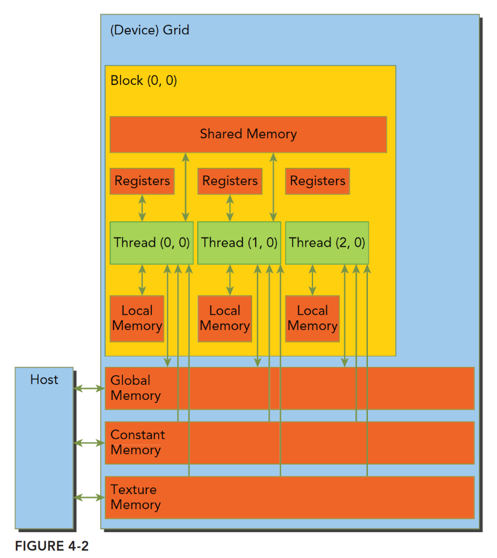

&nbsp;&nbsp;&nbsp;&nbsp;&nbsp;&nbsp;&nbsp;&nbsp;双箭头代表可读可写，单箭头代表只读.

## 1.2 CUDA内存统计

|内存类型|是否在芯片上|缓存|访问方式|作用范围|生命周期|大小|速度|备注|
| ---- | ---- | ---- | ---- | ---- | ---- | ---- | ---- | ---- |
|Register|在|无|读/写|单个线程内|线程|每个线程63个 etc.|最快|由编译器决定如何使用寄存器，当寄存器不够用会使用`local memory`|
|Local|不在|无|读/写|单个线程内|线程|可用内存/SM数量/SM最大常驻线程数，81KB etc.|普通|本质是`global memory`在一起。局部定义的变量，或者寄存器不够用时会使用到|
|Shared|在|无|读/写|block内的所有线程|block|48KB etc.|快|block内的所有线程共享访问，由`__shared__`修饰的变量|
|Global|不在|无|读/写|所有线程 + 主机|主机分配|11GB etc.|普通|全局所有线程任意时候都可以访问，由cudaMalloc、cudaMallocHost、cudaHostAlloc、cudaMallocManaged所涉及分配，具体还有Pinned Memory、Zero Copy Memory、Unified Memory|
|Constant|不在|有|读|所有线程 + 主机|主机分配|64KB etc.|快|只读内存，全局所有线程都可以访问，由`cudaMemcpyToSymbol`进行初始化|
|Texture|不在|有|读|所有线程 + 主机|主机分配|n/o|快|只读内存，全局所有线程都可以访问。针对3D编程使用|

# 2 Global Memory Alignment and Coalested(合并)

&nbsp;&nbsp;&nbsp;&nbsp;&nbsp;&nbsp;&nbsp;&nbsp;在 CUDA 编程中，指令的执行是以 warp 为单位的，内存的操作同样也是以 warp 为单位的。Warp 中的每个 thread 会使用自己的地址进行数据的读写。而内存的读写会因为**使用 cache 的不同**，一次读取的数据的 segment 的长度也会不同，是由于不同的对齐方式来决定的。<br>

&nbsp;&nbsp;&nbsp;&nbsp;&nbsp;&nbsp;&nbsp;&nbsp;如下图所示，`内存的读取是通过 cache 来实现的`。全局内存是从逻辑角度的叫法，实际的全局内存就是设备的DRAM. 从下图可以发现，所有对全局内存的访问都会经过L2 Cache，有部分会经过L1 Cache。因为**CUDA可以通过指令来选择是否启用L1 Cache**，由此每次访问全局内存有两种粒度：`同时使用L1 Cache 和 L2 Cache则粒度为128字节和只使用L2 Cache则粒度为32字节。`

> *内存事务：在CUDA编程中，内存事务（Memory Transaction）是GPU在执行内存访问操作时的基本数据传输单元，主要用于描述线程如何高效地从全局内存（Global Memory）或其他内存类型中读写数据。* <br>

> 在一次数据传输中，从全局内存地址转移到L2 缓存的一片内存的首地址一定是一个最小粒度（不走L1的话就是32 Byte）的整数倍。eg: **一次数据传输**只能从全局内存读取地址为 0~31，32~63，64~95Byte, 96~127Byte等片段的数据。

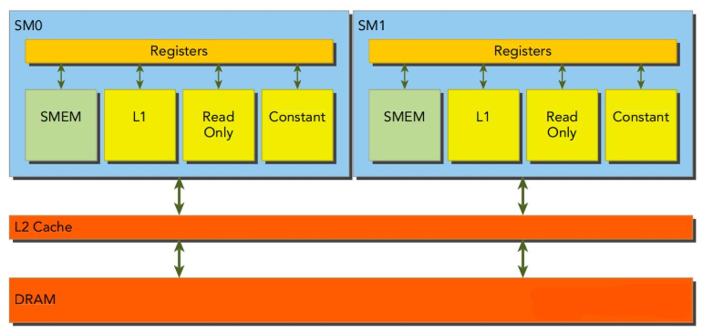


- 所有对 global memory 的读写可以分为两种:

  - 只通过 L2 cache 不通过 L1 cache：一般以 32 Bytes 对齐
  - 既通过 L2 cache 又通过 L1 cache：一般以 128 Bytes 对齐

- 对于内存的访问方式也分为两种：

  - 对齐访问：一个 Warp 访问的内存起始位置是不是数据对齐所要求数据的整数倍
  - 合并访问：一个 Warp 访问的内存是否是连续的一组数据。

- 总结
  - 计算能力3.x及以上的GPU通常以32字节、64字节或128字节的块（称为缓存行）进行全局内存访问；
  - 事务大小：常见为32B（非缓存加载）、64B（启用L1缓存时的缓存行）或128B（某些架构的默认值）。
  - 对齐要求：起始地址需为事务大小的整数倍。若未对齐，可能触发额外事务（如访问64B块但起始于32B偏移，需两个32B事务）。

- 不同架构区别
  - Fermi/Kepler：
    - 对齐且连续：1次128B事务。
    - 未对齐或跨步：可能触发2次128B事务（如起始地址偏移64B）。

  - Volta/Ampere：
    - 对齐且连续：1次128B事务。
    - 部分非连续模式（如跨步2）：可能合并为1次事务（依赖硬件优化）。

- 使用几个内存事务
  - 如果所有线程的访问地址均落在单个缓存行（如128字节）内，即使不连续，仅需1个事务。
  - 若访问地址跨越多个缓存行（如分散在多个128字节块），则需多个事务，数量等于覆盖的缓存行数。
  - 每个事务传输的所有数据均被线程访问，无带宽浪费，利用率可达到100%。

## 2.1 合并与非合并访问举例

&nbsp;&nbsp;&nbsp;&nbsp;&nbsp;&nbsp;&nbsp;&nbsp;GPU 的全局内存访问对性能极其敏感。当线程访问全局内存时，NVIDIA GPU 会尝试`将多个相邻线程的内存访问请求合并为单个内存事务（Memory Transaction）`。这种优化称为 **合并访问（Coalesced Access）**。<br>

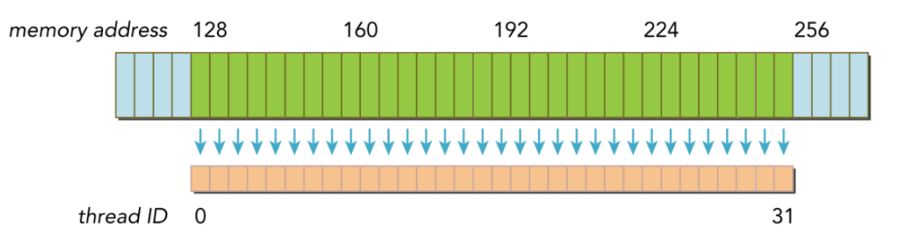

$$对齐 + 合并 访问$$

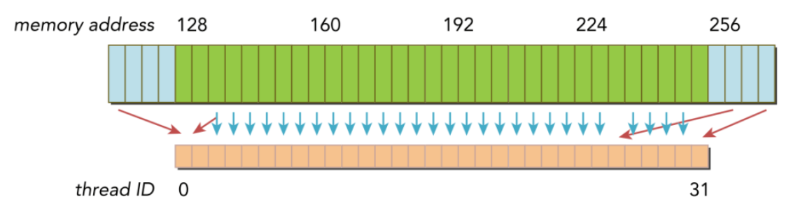

$$非对齐合并访问$$

## 2.2 全局内存的读取

&nbsp;&nbsp;&nbsp;&nbsp;&nbsp;&nbsp;&nbsp;&nbsp;以一个线程束32个线程为例，每个线程访问**4字节**数据，即每次内存事务访问数据为128字节。

### 2.2.1 使用 L1 Cache

&nbsp;&nbsp;&nbsp;&nbsp;&nbsp;&nbsp;&nbsp;&nbsp;当使用一级缓存时，此时访问粒度为128字节，即缓存行为128字节，所谓缓存行就是主存上一个可以被一次读取到缓存的一段数据.

- 最理想的情况，对齐合并访问，利用率 100%. <br>

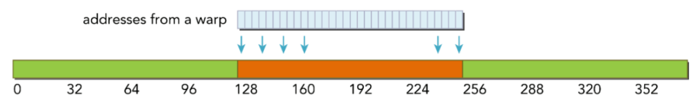

- 对齐访问，但访问地址不是连续的线程ID，**依然只需要一个128字节的内存事务完成**，总线利用率100%.

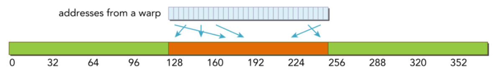

- 非对齐但连续访问，此时因为粒度为128字节，而访问首地址又不是128整数倍，所以`需要两个内存事务得到线程束中的全部地址`，总线利用率**50%**.

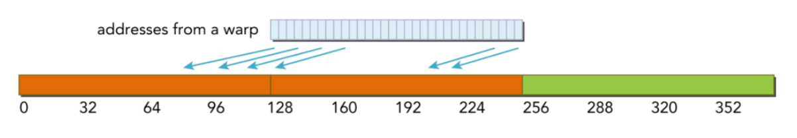

- 线程束中所有线程请求相同地址(必然属于一个缓存行(128字节))，如果加载的值是4字节，那么利用率为4/128=3.125%. (虽然利用率低，但还是一个内存事务)

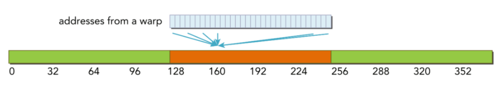

- 最坏情况，非对齐且不连续，那么此时需要进行N次缓存读取(0<=N<=32)，利用率1/N.

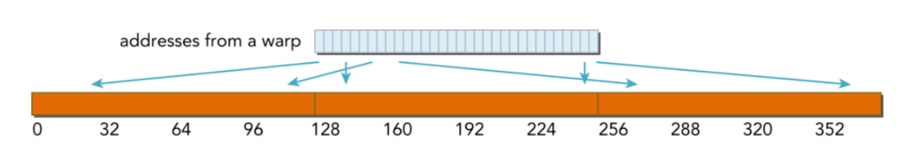

> CPU的一级缓存优化了时间和空间局部性，而GPU一级缓存是专为空间局部性设计的，即**频繁访问一个一级缓存的内存位置不会增加数据留在缓存中的概率.**

### 2.2.2 不使用 L1 Cache 读取

&nbsp;&nbsp;&nbsp;&nbsp;&nbsp;&nbsp;&nbsp;&nbsp;不经过一级缓存市，它是内存段的粒度(32字节)而非缓存池粒度(128字节)。

- 对齐合并访问，最理想利用率100%。

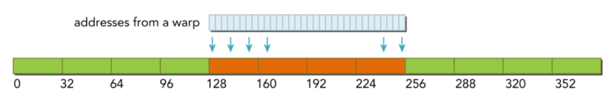

- 对齐但不连续访问，利用率100%。

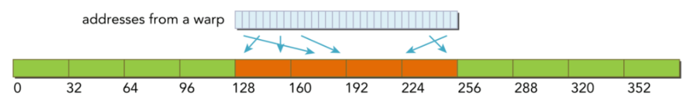

- 非对齐但连续，线程束请求32个连续的4字节元素，但加载没有对齐。请求的地址最多落在5个内存段(粒度为32字节)，所以利用率4/5=80%.

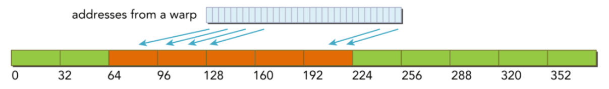

- 所有线程束访问同一个地址(必然属于一个内存段(32字节))，所以总线利用率 4/32 = 12.5% (有改善，原来是3.125%).

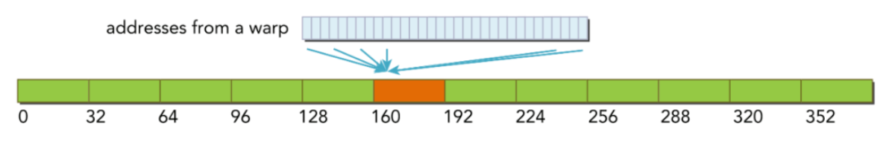

- 最坏的情况，非对齐不连续，所以就会出现N次内存访问(0<=N<=32)，不过与使用一级缓存相比，此时最多的是每个线程32个内存段(每个内存段32个字节)而不是每个线程32个缓存行(每个缓存行128字节)，所以也有改善.

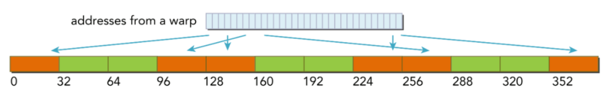

## 2.3 全局内存的写入

&nbsp;&nbsp;&nbsp;&nbsp;&nbsp;&nbsp;&nbsp;&nbsp;CUDA写入操作只通过二级缓存，所以写入操作在32个字节段的粒度上被执行，而内存事务可以同时被分为一段、两段或四段。

- 内存对齐合并写入，1个四段内存事务.


- 分散在192字节范围内，不连续，使用3个一段事务.

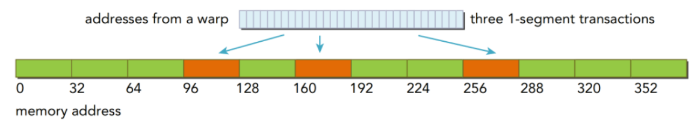

- 对齐的，在64字节内连续，则使用一个两段事务完成.

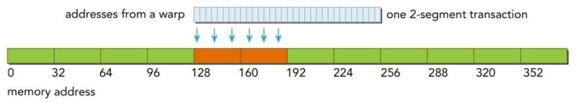


## 2.4 cudaMallocPitch

```cu
cudaError_t cudaMallocPitch(
    void** devPtr,   // 分配的设备内存指针
    size_t* pitch,   // 实际分配的内存行宽度（字节）
    size_t width,    // 用户请求的每行宽度（字节）
    size_t height    // 行数（二维）或切片数（三维）
);
```

- [example](./cuda_malloc_pitch_demo.cu)

```bash
nvcc cuda_malloc_pitch_demo.cu
./a.out
```

## 2.5 example

- questions: 如何控制所使用的全局内存的地址呢？
  答：使用CUDA API 函数（如 cudaMalloc） 分配的内存的首地址至少是256字节的整数倍。

- 顺序的合并访问：
```c++
/*
第一个线程块中的线程束将访问数据x 和 y 中 第 0~31个元素，
对应128字节的连续内存；首地址一定是256Byte的整数倍。
此访问只需4次数据传输即可完成，是合并访问，合并度100%.
**/
void __global__ add(float* x, float* y, float* z) {
  int n = threadIdx.x + blockIdx.x * blockDim.x;
  z[n] = x[n] + y[n];
}

// run
add<<<128, 32>>>(x, y, z);
```

- 乱序的合并访问

```c++
/*访问虽是乱序的，但合并度仍是100%*/
void __global__ add_permute(float* x, float* y, float* z) {
  // 最后bit 0->1 ; 1->0 两两交换相邻数
  int tid_permuted = threadIdx.x ^ 0x1;
  int n = tid_permuted + blockIdx.x + blockDim.x;
  z[n] = x[n] + y[n];
}

add_permuted<<<128, 32>>>(x, y, z);
```

- 不对齐引起的非合并访问
```c++
/* 多一次内存事务，合并度为 4/5 x 100% = 80% */
void __global__ add_offset(float* x, float* y, float* z) {
  // 最后bit 0->1 ; 1->0 两两交换相邻数
  int n = tid_permuted + blockIdx.x + blockDim.x + 1;
  z[n] = x[n] + y[n];
}

add_offset<<<128, 32>>>(x, y, z);
```

- 跨越式的非合并访问

```c++
/* 该线程束的访问将触法32次数据传输，合并度为4/32 = 12.5% */
void __global__ add_stride(float* x, float* y, float* z) {
  // 两个相邻thread 的 地址差了 128
  int n = blockIdx.x + threadIdx.x * gridDim.x;
  z[n] = x[n] + y[n];
}

add_stride<<<128, 32>>>(x, y, z);
```

- 广播式非合并访问(**适合使用常量内存**)

```c++
/**
  传输x[0]时，只传输4字节的数据，但用了一次传输（可以传输32Byte）;
  合并度 4/32 = 12.5%.
**/
void __global add_broadcast(float* x, float* y, float* z) {
  int n = threadIdx.x + blockIdx.x * blockDim.x;
  z[n] = x[0] + y[n];
}

add_broadcast<<<128, 32>>>(x, y, z);
```

## 2.6 程序调优（Transpose）

- transpose1
```c++
__global__ void transpose1(const real* A, real* B, const int N) {

  // 一个warp 中 线程idx 先排nx, 再排ny
  const int nx = blockIdx.x * blockDim.x + threadIdx.x;
  const int ny = blockIdx.y * blockDim.y + threadIdx.y;

  if (nx < N && ny < N) {
    // nx * N，导致相邻线程访问 global memory 相差很多
    B[nx * N + ny] = A[ny * N + nx];
  }
}
```

- transpose2
```c++
__global__ void transpose2(const real* A, real* B, const int N) {

  // 一个warp 中 线程idx 先排nx, 再排ny
  const int nx = blockIdx.x * blockDim.x + threadIdx.x;
  const int ny = blockIdx.y * blockDim.y + threadIdx.y;

  if (nx < N && ny < N) {
    // 读取A不是合并访问，但写入B是
    B[ny * N + nx] = A[nx * N + ny];
  }
}
```

- transpose2 性能更好，因为从Pascal 架构开始，如果编译器能够判断一个全局内存变量在整个核函数的范围都只可读，则会自动调用 __ldg() 读取全局内存，从而对数据的读取进行缓存，缓解非合并访问带来的影响。写入时没有类似优化，因此：**在不能满足读取和写入都是合并（coalesed）的情况下，一般应尽量做到合并的写入。**


# 3 Shared Memory

Shared memory 经常和 L1 cache 共享。因此有几种划分方案。

&nbsp;&nbsp;&nbsp;&nbsp;&nbsp;&nbsp;&nbsp;&nbsp;共享内存（Shared memory）有 32 个存储体（banks） 对应warp 内的**32个**线程，这些存储体的组织方式是：连续的 32-bit words映射到连续的不同存储体(bank)中。每个存储体的带宽为每个时钟周期 32 bits。<br>

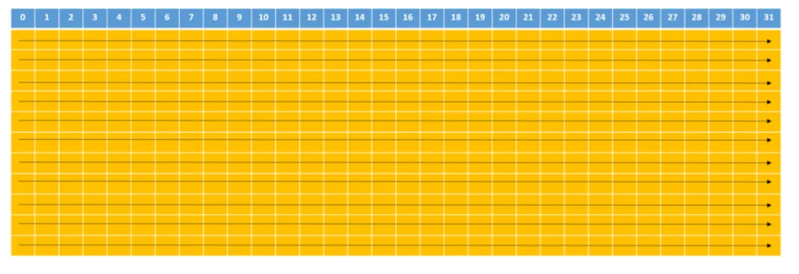

&nbsp;&nbsp;&nbsp;&nbsp;&nbsp;&nbsp;&nbsp;&nbsp;共享内存中，连续的 32-bits 字被分配到连续的 **32个bank** 中，这就像电影院的座位一样：<br>
- 一列座位就相当于一个 bank，所以每行有 32 个座位，在每个座位上可以“坐”一个32-bits(4Byte)的数据(或者多个小于32-bits的数据，如4个char型的数据，2个short型的数据)
- 正常情况下，我们是按照先坐完一行(32个bank的第一行)再坐下一行的顺序来坐座位的，在shared memory 中地址映射的方式也是这样的。上图中内存地址是按照箭头的方向依次映射的：

## 3.1 Bank conflict

&nbsp;&nbsp;&nbsp;&nbsp;&nbsp;&nbsp;&nbsp;&nbsp;当**同一个 warp 的**不同线程访问**同一个 bank** 中的不同的地址时，就会发生bank 冲突。如果没有 bank 冲突的话，共享内存的访存速度将会非常的快，大约比全局内存的访问延迟**低100多倍**，但是速度没有寄存器快。

&nbsp;&nbsp;&nbsp;&nbsp;&nbsp;&nbsp;&nbsp;&nbsp;然而，如果在使用共享内存时发生了 bank 冲突的话，性能将会降低很多很多。在最坏的情况下，即一个 warp 中的所有线程访问了相同 bank 的32个不同字地址的话，那么这 32 个访问操作将会全部被序列化，大大降低了内存带宽。

- 访问步长(stride)为1(share-memory 里的步长)，由于每个warp中的线程ID与每个bank的ID一一对应，因此不会产生bank冲突。

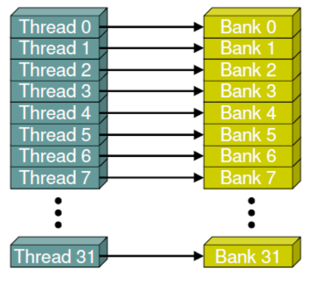

- 交叉的访问，每个线程并没有与 bank 一一对应，但每个线程都会对应一个唯一的 bank，所以也不会产生bank冲突。

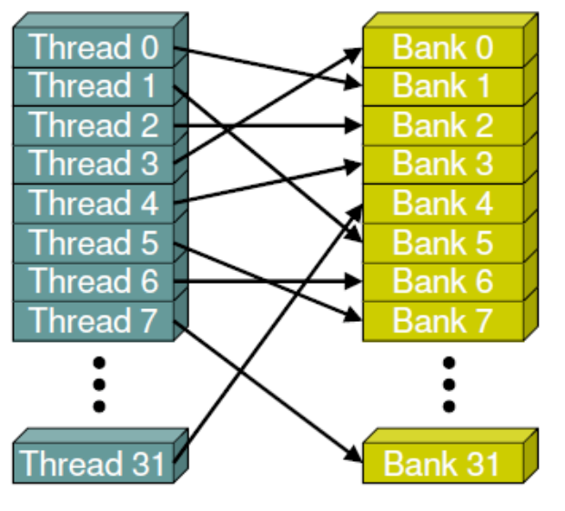

- 线程0与线程28都访问到了bank 0，线程1与线程29都访问到了bank 2...，于是就造成了2路的bank冲突：
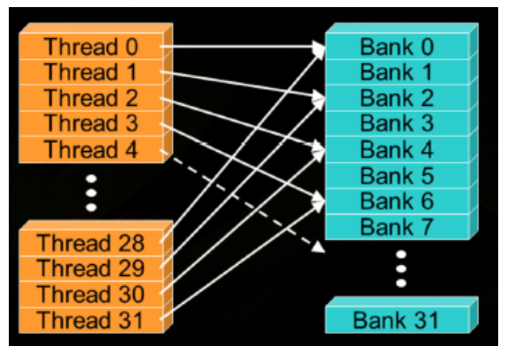

- 下面这种访问造成了8路的bank冲突：
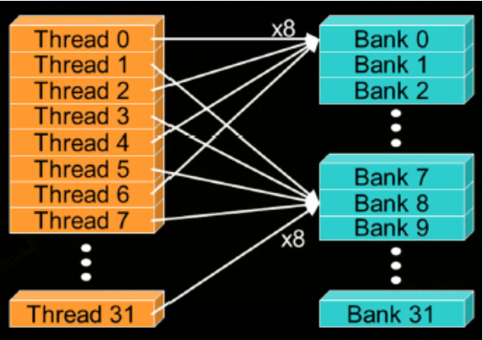

- 特殊情况 I：当一个warp中的所有线程访问一个bank中的**同一个字(word)地址时**，就会向所有的线程广播这个字(word)，这种情况并不会发生bank冲突.

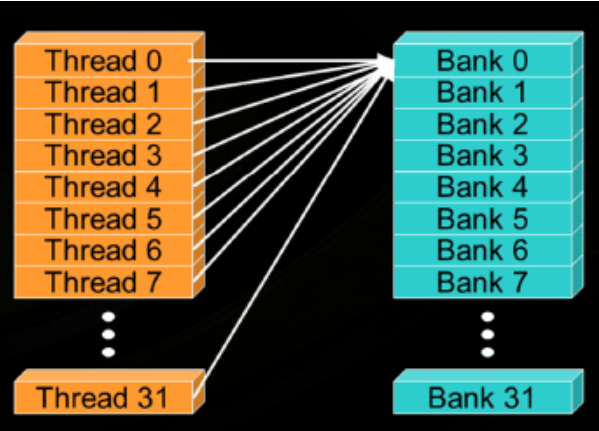

- 特殊情况 II：多播机制(multicast)：当一个warp中的几个线程访问同一个bank 中的相同字地址时，会将该字广播给这些线程, 此时也不会发生bank冲突. (计算能力2.0及以上的设备)

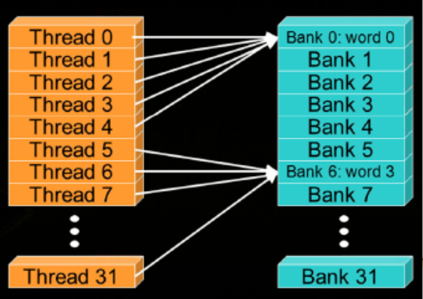

## 3.2 何时发生Bank conflict

**根据thread idx 从shared memory 提取元素。**

```cu
extern __shared__ float shared[];
float data = shared[baseIndex + stride * tid];
```

有两种情况，线程 tid 和线程 tid+n **会访问相同的bank**：
  1. stride * n 是 bank 的数量(即32)的整数倍;
  2. n 是 32 / d 的整数倍(d是32和stride的最大公约数);<br>

其中:
  - n 表示 和 tid 相差 n 个线程的另一个线程; <br>
  - stride 指的是两个相邻线程读取的元素在shared memory中的步长.

>访问相同bank 是bank conflict 的必要条件，但不是充分条件，bank conflict 的线程还必须在**同一个wrap里**


**推论1：如果 tid 与 tid+n 位于同一个warp时，且访问相同bank时，就会发生bank冲突，相反则不会。**

**推论2：当访问步长s为奇数时，就不会发生bank冲突。**

**结论** <br>
>只有warp的大小(即32) ≤ 32/d时，才不会有bank冲突，而只有当**d等于1时**才能满足这个条件。要想让32和s的最大公约数d为1，**stride必须为奇数**。<br>

> 通俗点就是两个相邻线程threadIdx.x 访问shared memory 的 stride 需要是奇数就可以避免bank confilct.

## 3.3 example1： 规约算法

&nbsp;&nbsp;&nbsp;&nbsp;&nbsp;&nbsp;&nbsp;&nbsp;我们以经典的归约算法为例来做一个简单的练习。假设有一个大小为**2048的向量**，我们想用归约算法对该向量求和。于是我们申请了一个大小为**1024的线程块**，并声明了一个大小为 2048 的共享内存数组，并将数据从全局内存拷贝到了该共享内存数组。<br>

### 3.3.1 不连续规约

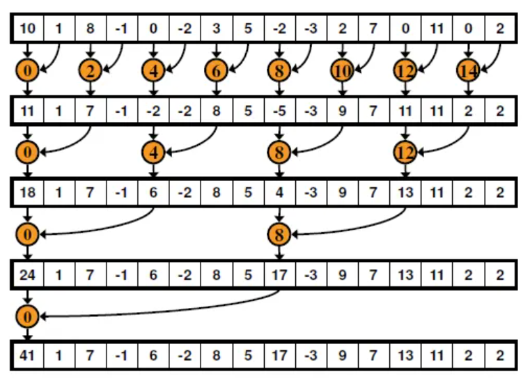

- [完整代码](./bank_conflict_sum.cu)

```c++
// 非连续的归约求和：Bank Conflict kernel
__global__ void BC_addKernel(const int *a, int *r) {

  // 每个block里thread的个数
  __shared__ int cache[ThreadsPerBlock];
  int tid = blockIdx.x * blockDim.x + threadIdx.x;
  int cacheIndex = threadIdx.x;

  // copy data to shared memory from global memory
  cache[cacheIndex] = a[tid]; // no conflict
  __syncthreads();

  // add these data using reduce
  for (int i = 1; i < blockDim.x; i *= 2) {
    // 由近到远的累加, 两个相邻threadIdx.x 在shared memory 的索引相差index
    int index = 2 * i * cacheIndex;
    if (index < blockDim.x) {
      // 相邻线程index > 1 且为偶数，必定会Bank Conflict
      cache[index] += cache[index + i]
    }

    __syncthreads();
  }

  // copy the result of reduce to global memory
  if (cacheIndex == 0) {
    // 每个block 都往外copy
    r[blockIdx.x] = cache[cacheIndex];
  }
}
```

### 3.3.2 连续规约


- [完整代码](./no_bank_conflict_sum.cu)

```c++
// 连续的归约求和
__global__ void NBC_addKernel2(const int *a, int *r) {
  __shared__ int cache[ThreadsPerBlock];
  int tid = blockIdx.x * blockDim.x + threadIdx.x;
  int cacheIndex = threadIdx.x;
  // copy data to shared memory from global memory
  cache[cacheIndex] = a[tid];
  __syncthreads();

  // add these data using reduce
  for (int i = blockDim.x / 2; i > 0; i /= 2) {
    if (cacheIndex < i) {
      // 相邻thread stride = 1
      cache[cacheIndex] += cache[cacheIndex + i];
    }
    __syncthreads(); // 跨warp共享数据时才需要使用 __syncthreads()
  }

  // copy the result of reduce to global memory
  if (cacheIndex == 0) {
    r[blockIdx.x] = cache[cacheIndex];
  }
}
```

## 3.4 example2: Transpose

- [代码地址](https://github.com/QINZHAOYU/CudaSteps/blob/master/capter8/matrix.cu)

```c++
__global__ void transpose4(const real *src, real *dst, const int N)
{
    // 通过修改数组行大小，错开数组元素在共享内存bank中的分布，
    // 避免线程束的 32路bank冲突。
    __shared__ real s_mat[TILE_DIM][TILE_DIM + 1]; // 通过将stride 该为奇数可以方便的解决bank conflict

    int bx = blockIdx.x * blockDim.x;
    int by = blockIdx.y * blockDim.y;

    int tx = threadIdx.x + bx;
    int ty = threadIdx.y + by;

    if (tx < N && ty < N)
    {
        s_mat[threadIdx.y][threadIdx.x] = src[ty * N + tx];
    }

    // warp 间有数据依赖时需要使用 __syncthreads()
    __syncthreads();

    if (tx < N && ty < N)
    {
        int x = by + threadIdx.x;
        int y = bx + threadIdx.y;
        dst[y * N + x] = s_mat[threadIdx.x][threadIdx.y];
    }
}
```

# 4 寄存器 ： Register

## 4.1 A100

| 项目 | 规格/分析 |
| ---- | -------- |
| 每个 SM 的 32 位寄存器文件总大小 | 64 KiB 或 65,536 个 32 位寄存器 |
| 每个 thread 最大寄存器数量 | **255 个**（这是编译器的硬性限制，由架构定义） |
| 每个 block 最大寄存器数量 | 64 KiB（即 65,536 个寄存器）。这个限制通常远高于实际可能达到的值，因为首先会受到 SM 总资源的限制。 |
| 每个 SM 最大线程数 | 2,048 个 |
| 每个 SM 最大线程块数 | 32 个 |
| 每个 block 线程数上限 | 1024 个（与 H100 相同）|
| SM 个数  | 108 |
| 每个 SM Tensor core 个数 | 4个 |

- 寄存器对线程个数的影响

如果一个kernel每个线程使用 **32 个**寄存器，那么一个 SM 最多可以支持 65,536 / 32 = 2,048 个线程。这正好达到了 A100 每个 SM 的最大线程数上限。

如果每个线程使用 64 个寄存器，则 65,536 / 64 = 1,024 个线程。此时，虽然线程数未达到 SM 上限，但寄存器已成为限制因素，SM 无法驻留更多的线程块。

- 寄存器对SM内线程块数量的影响

一个线程块有 256 个线程，每个线程使用 32 个寄存器。那么一个线程块需要 256 * 32 = 8,192 个寄存器。一个 SM 可以支持 65,536 / 8,192 = 8 个这样的线程块。

## 4.2 H100

| 项目 | 规格/分析 |
| ---- | -------- |
| 每个 SM 的 32 位寄存器文件总大小 | **128 KB / 131,072 个** 32 位寄存器（是 A100 的**两倍**） |
| 每个 thread 最大寄存器数量 | 255 个（与 A100 相同） |
| 每个 block 最大寄存器数量 | 64 KiB（即 65,536 个寄存器）。注意，虽然 SM 总资源翻倍，但单个线程块的寄存器上限与 A100 相同 |
| 每个 SM 最大thread数 | 2,048 个（与 A100 相同） |
| 每个 SM 最大 block 数 | 48 个（比 A100 的 32 个更多） |
| 每个 block 线程数上限 | 1024 个（与 A100 相同）|
| SM 个数  | 144 个 |
| 每个 SM Tensor Coreg 数量 | 4 个 |

H100 的单个 Block 线程数上限仍为 1024，但通过增加 SM 的 Block 槽位数（48 个）和寄存器总量，提升了整体并发能力。例如，H100 的 SM 可同时运行 48 个 256 线程的 Block（总计 12,288 线程），而 A100 仅能运行 32 个（总计 8,192 线程）.


# 5 向量化数据加载与存储

向量化加载（Vectorized Loading） 是**提升内存访问效率**的核心优化技术 —— 它让线程（或线程束 Warp）通过单条向量指令**批量加载连续数据**，`充分匹配 GPU 内存事务（Memory Transaction）的宽度（128B/256B），减少内存事务数量`，最大化全局内存带宽利用率。其本质是「用向量指令替代标量指令，让单次内存访问承载更多数据」，是「Burst Mode」的关键手段之一。

内存事务: 主流 GPU 的事务宽度为 128B 或 256B（可通过 cudaDeviceProp::memoryBusWidth 查询）。

问题描述：若数据类型更小（如 char=1B），32 个线程（一个warp）仅加载 32B，仅利用 128B 事务的 25% 带宽。

解决思路：向量化加载

- 让单个线程加载 4 个 char（char4=4B），32 个线程仍加载 32×4B=128B，完全利用事务带宽 ——核心是通过向量类型让单次访问的数据量与事务宽度匹配。
- float4 时： 一个Warp 可加载 32×4=128 个 float（512B），需 4 个 128B 事务。内存带宽利用率还是100%， 但需要的线程是原来的1/4, **减少了线程启动开销，在线程数不变的情况下，数据吞吐量提升了4倍。**

| 基础类型 | 向量类型（2 元素） | 向量类型（4 元素） | 向量类型（8 元素） | 向量类型（16 元素） |
|----------|--------------------|--------------------|--------------------|---------------------|
| char     | char2              | char4              | char8              | char16              |
| short    | short2             | short4             | short8             | short16             |
| int      | int2               | int4               | int8               | int16               |
| float    | float2             | float4             | float8             | float16             |
| double   | double2            | double4            | double8            | double16            |

要不要我帮你生成一份**带高亮重点类型**的优化版Markdown表格？

使用案例：
```c++
float4 vec = make_float4(1.0f, 2.0f, 3.0f, 4.0f);
// 可通过 .x/.y/.z/.w 或数组下标访问元素
printf("%f, %f\n", vec.x, vec.z); // 输出 1.000000, 3.000000
printf("%f, %f\n", vec[0], vec[3]); // 输出 1.000000, 4.000000
```
