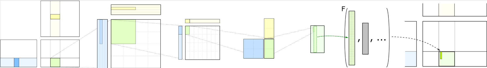
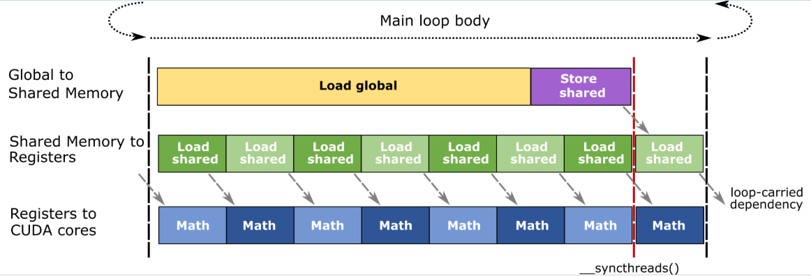

# 1 cutlass introduce
- [github src](https://github.com/NVIDIA/cutlass)

CUTLASS 是一个用于在 CUDA 中实现高性能矩阵-矩阵乘法（GEMM）及相关计算的抽象集合，涵盖所有层次和规模。它包含了分层分解和数据移动的策略。CUTLASS 将这些“活动部件”分解为可重用的、模块化的软件组件和抽象。<br>

概念并行化层次结构的**不同层次的原语**可以通过自定义平铺大小(tiling sizes)、数据类型和其他算法策略进行专业化和优化。由此产生的灵活性简化了它们在自定义内核和应用程序中的使用作为构建块。<br>

CUTLASS自**2017年**以来一直为高性能线性代数提供`CUDA C++模板抽象`，这些抽象为广泛的计算提供了广泛的支持，包括混合精度计算、专业化的数据移动（异步复制）以及FP64、FP32、TF32、FP16、BF16的乘法累加抽象，通过张量核心指令模拟FP32，8位浮点类型（e5m2和e4m3），块缩放数据类型（NVIDIA NVFP4和OCP标准MXFP4、MXFP6、MXFP8），窄整数类型（4和8位有符号和无符号整数），以及**二进制1位数据类型**（在架构允许的情况下支持此类数据类型的原生支持）跨越NVIDIA的Volta、Turing、Ampere、Ada、Hopper和Blackwell架构。<br>

在这个基于C++的内核编程抽象丰富生态系统中，CUTLASS 4 增加了 CUTLASS 领域专用语言（DSLs）。这些是用于编写高性能 CUDA 内核的 **Python 原生接口**，基于kernel的 CUTLASS 和 CuTe 概念，且**不会有任何性能损失**。这使得学习曲线更加平滑，`编译时间快了几个数量级`，与深度学习框架的原生集成无需编写胶水代码(glue code)，并且元编程更加直观，不再需要深厚的 C++ 专业知识。

总体而言，我们设想CUTLASS DSLs是一个领域特定语言（DSLs）的家族。随着4.0版本的发布，我们在CuTe DSL中发布了这些DSL中的第一个。这是一个低级别的编程模型，与CuTe C++抽象完全一致——暴露core concept，如layouts, tensors, hardware atoms以及对硬件线程和数据层次结构的完全控制。<br>

CuTe DSL 展示了针对 NVIDIA Ampere、Hopper 和 Blackwell 架构实现的可编程、高吞吐量张量核心的最优矩阵乘法和其他线性代数运算。

我们相信，它将成为学生、研究人员以及性能工程师不可或缺的工具——降低GPU编程的学习曲线，快速原型化内核设计，并将优化的解决方案投入生产。

CuTe DSL 当前处于公测阶段，并将于2025年夏季结束前正式推出beta版本。

# 2 c++ quick guide

- [doc](https://github.com/NVIDIA/cutlass/blob/main/media/docs/cpp/quickstart.md)

# 3 Cute DSL Quick Start Guide
- [doc](https://github.com/NVIDIA/cutlass/blob/main/media/docs/pythonDSL/quick_start.rst)

---

# 4 cutlass 源码导读-1
## 4.1 cutlass 到底是什么
> CUTLASS is a collection of CUDA C++ template abstractions for implementing high-performance matrix-multiplication (GEMM) and related computations at all levels and scales within CUDA.

1. CUTLASS要解决的是问题是**矩阵乘法（GEMM）和相关计算???**。GEMM的全称其实是`通用矩阵乘法`，具体来说除了矩阵乘法，还包括了深度学习里面常见的fully connected(全连接)和convolution。fully connected和matrix-multiplication是等价的，这个比较好理解，无非就是把weights作为参与相乘的矩阵。Convolution有几种实现方式，一种方式是`将卷积核每次对应的部分展开，转化成矩阵乘法，CUTLASS里面对于conv的实现局限于这种方法`，通过wignord算法或者傅里叶变换来做conv在里面是没有涉及的。而“related computations”，主要指的是**接在GEMM后面的activation或者一些pointwise计算**，比如bias，scales，这些计算可以和GEMM`融合在一起`，从而减少访存压力，由于这类计算一般发生在GEMM之后，我们管这类计算叫epilogue（尾处理）。（这个egilogue的定义不算准确，可以先这么理解，后面写到了再细聊）

2. CUTLASS使用CUDA来完成GPU上kernel的编程

3. CUTLASS的编程语言为C++，且大量使用C++模板

4. 上述的levels指的应该是GPU硬件里的各个层次，从计算部件到寄存器，到L1/share memory，到L2。scalse大概就是适配要求解的问题的规模和参与计算的硬件的规模

## 4.1 cutlass API
看一个volta_tensorop_gemm好了，这个sample要做的事情很简单：在volta架构上完成一个矩阵乘法,tensorop指的是想用使用tensor core来完成计算。

volta_tensorop_gemm.cu 如下：
```c++
using MMAOp = cutlass::arch::OpClassTensorOp;

// This code section describes CUDA SM architecture number
using SmArch = cutlass::arch::Sm70;

// This code section describes the tile size a thread block will compute
using ShapeMMAThreadBlock =
    cutlass::gemm::GemmShape<128, 128, 32>;  // <- threadblock tile M = 128, N = 128, K = 32

...

using Gemm = cutlass::gemm::device::Gemm<ElementInputA,
                                         LayoutInputA,
                                         ElementInputB,
                                         LayoutInputB,
                                         ElementOutput,
                                         LayoutOutput,
                                         ElementAccumulator,
                                         MMAOp,
                                         SmArch,
                                         ShapeMMAThreadBlock,
                                         ShapeMMAWarp,
                                         ShapeMMAOp,
                                         EpilogueOp,
                                         SwizzleThreadBlock,
                                         NumStages>;
```

上述代码中Gemm这个类型就是我们最后获得的可以进行GEMM的类型.

## 4.2 计算
```c++
const int length_m = 5120;
const int length_n = 4096;
const int length_k = 4096;

...

// Create a tuple of gemm kernel arguments. This is later passed as arguments to launch
// instantiated CUTLASS kernel
typename Gemm::Arguments arguments{problem_size,           // <- problem size of matrix multiplication
                                   tensor_a.device_ref(),  // <- reference to matrix A on device
                                   tensor_b.device_ref(),  // <- reference to matrix B on device
                                   tensor_c.device_ref(),  // <- reference to matrix C on device
                                   tensor_d.device_ref(),  // <- reference to matrix D on device
                                   {alpha, beta},          // <- tuple of alpha and beta
                                   split_k_slices};        // <- k-dimension split factor

...

// Instantiate CUTLASS kernel depending on templates
Gemm gemm_op; // 实例化之前定义的Gemm

// Check the problem size is supported or not
cutlass::Status status = gemm_op.can_implement(arguments);
CUTLASS_CHECK(status);

// Initialize CUTLASS kernel with arguments and workspace pointer
status = gemm_op.initialize(arguments, workspace.get());
CUTLASS_CHECK(status);

// Launch initialized CUTLASS kernel
status = gemm_op();
CUTLASS_CHECK(status);
```

**上述输入信息主要包括三部分:**
1. runtime阶段的动态资源

主要体现在part 5的code里面，包括输入tensor的指针，workspace的指针。相关的显存的空间需要用户自己申请好。

2. 对要解决问题的静态描述

包括part 3定义了这个GEMM的M,N,K。也包括在part 2里面ElementInputA，LayoutInputA，它们分别定义了A的数据类型(float, half, int8)和Layout(行主存还是列主存)。

3. 对于计算硬件和计算策略的选择

体现在part 1和part 2中，比如SmArch表示运行在什么卡上，比如“using MMAOp = cutlass::arch::OpClassTensorOp”指的是使用tensor core来进行乘加运算，这些是硬件选择。又比如ShapeMMAThreadBlock指的是一个CTA处理多大的shape，这就是计算策略的一部分。

## 4.3 cublas设计模式分析

### 4.3.1 丰富的模板化
类模板的信息**也可以以函数传参的方式传入**，而之所以选择模板这种形式，我认为有两个考虑: <br>
- 第一，把编译期就可以确定的信息用模板来实现，**减少cpu端运行代码的开销**，是符合C++的设计理念的;
- 第二，更重要的一点是，对于GPU kernel来说，函数传参就意味着要用寄存器，而寄存器的数量是有可能影响性能的.

如果GPU kernel使用模板，那么上层有两种可能，第一种是计算库内部完成所有的实例化，接口层不对用户暴露模版，第二种是**接口层直接对用户暴露模板**，基于下文说的设计理念3，**CUTLASS选择的是第二种: 接口层直接对用户暴露模板**.

### 4.3.2 设计理念
1. CUTLASS希望把**模块化**做好，使得各个level的策略和实现代码可以`重用`，这是一个非常重要的思路，我会在下一篇详细展开。

2. 大量使用模板以及各种手段，`把尽可能多的事情放在编译期完成`。

3. 对用户**暴露大量的实现策略**，用户需要`自己做出实现策略的选择。这是CUTLASS和CUBLAS,CUDNN的重要差别所在`，CUBLAS和CUDNN用户只需要描述计算问题，所有的策略选择在内部完成。这意味着从软件分层上来说，CUTLASS可以是CUBLAS和CUDNN的backend，换而言之，CUBLAS和CUDNN可以是CUTLASS的用户。

# 5 cutlass 源码导读-2
- 本篇主要介绍CUTLASS使用CUDA进行GEMM的计算的基本流程，是一个相对偏入门科普的内容.
- [官方参考](https://link.zhihu.com/?target=https%3A//github.com/NVIDIA/cutlass/blob/master/media/docs/efficient_gemm.md)

官方参考描述不通俗，需要我们重新解读下.

## 5.1 矩阵乘法

矩阵乘法运算描述如下：C[M, N] = A[M, K] * B[K, N] + C[M, N]

矩阵C里面的每个元素都是经历了**K次**乘加运算得到的，我们稍微添加两个**约束条件**，就可以得到最简单的CUDA算法：<br>

- `乘加计算由每个thread的乘加指令完成`，也即暂时不考虑使用Tensor Core;
- 对于结果矩阵的一个元素C[i, j]，该元素的所有（K次）乘加计算都是在同一个CUDA thread上完成的;

那么单纯从计算的视角看来，整个过程就就很简单了，一个thread t负责计算C[i,j], 过程就是一开始把C[i,j]放进**自己的寄存器**，然后依次把(A[i, 0], B[0, j]), (A[i, 1], B[1, j])......(A[i, K], B[K, j])送入t的寄存器，并进行乘加运算，就可以得到结果了。<br>

让我们再把问题变得再稍微复杂一点，**一个thread可以负责若干个结果元素(output element)的计算**，这些元素之间有的同行，有的同列，比如负责C[i1, j1], C[i1, j2], C[i2, j1], C[i2, j2]四个点，那么计算过程就变成了依次把(A[i1, 0], A[i2, 0], B[0, j1], B[0, j2])....依次读入寄存器并进行计算。

我们可以把这个理解扩展到warp和CTA(Thread blocks)，那就是每个warp会负责结果矩阵里面的一小块，每个CTA会负责若干个warp连成的更大的一块。总结起来就是官网的这张图：<br>



> CTA : 在CUDA中，CTA（Cooperative Thread Array，协作线程数组）是线程块（Thread Block）的官方术语，用于描述GPU执行模型中的基本并行单位。
> 线程块（Thread Block）是编程模型中的常用术语，强调逻辑分组。
> CTA则更常用于硬件架构或底层文档，强调线程间的协作能力。
> 多个CTA构成网格（Grid），由GPU的流多处理器（SM）执行;
> 每个SM可同时运行多个CTA，具体数量受限于资源(如寄存器、共享内存等);
> 最大线程数通常为1024（具体取决于GPU架构），且CTA内线程通过threadIdx访问局部坐标;
> 线程协作通过共享内存和同步实现，适用于需要数据共享的任务（如矩阵乘法、图像处理）


## 5.2 数据移动
在GPU中，数据是多级存储的，主要是三级：**Global memory -- Shared Memory -- Register** <br>

整个CUDA Kernel共享一个Global memory地址空间，每个CTA有自己的Shared Memory, 该CTA的warps可以共用这份Shared Memory(**Hopper引入了distrubute shared memory**, 暂时先不讨论). 每个thread拥有自己独立的多个Register，也称为Register file.

在整个GEMM的流程中，数据的移动轨迹是这样的：<br>
**Global memory -> Register -> Shared Memory -> Register -> Compute -> Shared Memory -> Register -> Gloable memory**

如果引入**LDGSTS(Load Global Store to Shared Store)指令**，Global memory的数据可以直接进Shared Memory，不需要经过Register周转。

> 注释: LDGSTS 是Ampere架构（如A100）及后续架构引入的指令，用于高效地将数据从全局内存（Global Memory）直接**异步加载**到共享内存（Shared Memory），无需经过寄存器中转。

```c++
// 异步从全局内存加载到共享内存（LDGSTS的核心操作）
// 使用 cp.async 指令（LDGSTS 的具体实现）
asm volatile(
    "cp.async.cg.shared.global [%0], [%1], %2;"
    :: "r"(&As[tx][ty]), "l"(A_ptr + t), "n"(sizeof(float)*TILE_SIZE)
);
asm volatile(
    "cp.async.cg.shared.global [%0], [%1], %2;"
    :: "r"(&Bs[tx][ty]), "l"(B_ptr + t*N), "n"(sizeof(float)*TILE_SIZE)
);

asm volatile(
    "汇编指令模板"
    : 输出操作数（本例无）
    : 输入操作数列表（[%0], [%1], %2 对应此处参数）
    : 破坏的寄存器或内存（隐式声明，本例未显式指定）
);
```

## 5.3 数据的移动分工

数据的移动不是凭空发生的，具体来说也是需要分配到每个thread去完成的，这里需要考虑几个问题。

**第一个问题是为什么数据需要进Shared Memory呢？** <br>
答案是同一个CTA的若干个warp之间需要的数据是有重复的，比如处理C中相同行的两个warps，它们需要从A中读取的部分是一样的，这就造成了冗余。而从Global memory读取数据的速度要远慢于从Shared Memory中读取数据的速度。所以一种显而易见的优化方法就是，把一个CTA的所有warps需要的A，B的部分，只读一次到Shared Memory，然后**各个warp再去Shared Memory读自己需要的部分**，这样从globle memory读数据的部分就不存在冗余，`冗余仅仅存在于从Shared Memory再读回Register的部分`。<br>

**第二个问题是从Global memory读数据到Shared Memory该如何分工到各个thread?** <br>
如果还是按照thread的计算环节的分工来进行，那毫无疑问就会产生冗余，与我们的初衷不符，所以这个环节要重新进行分工，**将整个CTA需要读的A的部分，分摊到各个thread**，同样的方法处理B。所以对于每个thread而言，`在读Global memory负责的A,B的部分和在乘加计算要负责的部分是不一样的`。<br>

**第三个问题是，如果shared memory一次装不下CTA所需的全部A,B部分怎么办？** <br>
我们的方法是：**按K方向进行切分**，每个warp一次只加载一部分数据到Register中。这个思想叫做**IterationK**。所以整个过程可以理解为嵌套的三层循环，最外层循环是把Global memory的数据分成多批放到Shared Memory中，第二层循环是对于每批Shared Memory的数据，分成多批放入Register中，最内层的循环才是对Register中的数据进行计算。

> 注释: 还有些优化之后再讲.
> 如果通过**异步流水**的方式来加速这个过程？
> 如果分工来得到对性能最友好的访存pattern?

## 5.4 SplitK与SlicedK
回到一开始我们做出的假设: <br>

对于结果矩阵的一个元素C[i, j]，该元素的所有（K次）乘加计算都是在**同一个CUDA thread**上完成的。

这意味着，基于IterationK的算法，每个thread至少需要完成K次乘加运算，对于K比较大，M,N比较小的case来说，这个算法显然不是最优的，于是这时候我们需要打破这个假设，也就是把C[i, j]的运算`分拆到不同的thread来进行`。

**SlicedK:** 第一个思路是把原本的一个warp，`在K方向上拆成若干个warp`，也就是说这若干个warp负责C中的同一部分。这么做可以解决问题，但需要额外增加一个环节——`把这个几个warp得到的结果做累加`。CUTLASS把这个环节放在了Kernel的Epilogue(尾声)的部分。这就是**SlicedK**。

**SplitK:** SplitK的思路与SlicedK类似，只不过方法是把原本的一个CTA，`在K方向上拆成若干个CTA`。那么这若干个CTA之间也需要做累加。CUTLASS选择`额外launch一个新的CUDA Kernel来完成CTA的结果之间的Reduction`。

## 5.5 TensorCore的使用
如果不使用乘加指令，而是使用Tensor Core指令会有什么影响。其实也不会有什么很大的影响，无非是**把计算的最低层级从thread上调到warp而已**，对IterationK而言，每个warp依旧负责结果矩阵的某一小部分的所有K方向的累加，只不过`计算的粒度变大了，累加的次数就变小了`。而**Tensor Core的使用也要求数据全部在寄存器中**，属于对于数据移动部分的流程也`没有影响`。

## 5.6 复习API中参数含义

```c++
// This code section describes the tile size a thread block will compute
using ShapeMMAThreadBlock = cutlass::gemm::GemmShape<128, 128, 32>;  // <- threadblock tile M = 128, N = 128, K = 32
```

对于上面的参数，我们称之为**tile size**。含义是**每个CTA**负责结果矩阵中M * N（128 * 128）的部分，每次把A矩阵的M * K（128 * 32）和B矩阵的 K * M（32*128）放入Shared Memory中。

```c++
// This code section describes tile size a warp will compute
using ShapeMMAWarp = cutlass::gemm::GemmShape<64, 64, 32>;  // <- warp tile M = 64, N = 64, K = 32
```

这样的参数，我们称之为warp size。用`tile size来除以warp size就是每个CTA的warp数`（每一维前者都**必须是后者的整数倍**）。M与N的含义是该warp负责的大小。warp size.k如果小于tile_size.k,那么这里就是使用了**SlicedK**的方法，反之则为单纯的**IterationK**。

```c++
// This code section describes the size of MMA op
using ShapeMMAOp = cutlass::gemm::GemmShape<8, 8, 4>;  // <- MMA Op tile M = 8, N = 8, K = 4
```

上述就是单条Tensor Core指令负责的部分的大小，这个比较好理解。

而如果用户要使用SplitK(block 上进行reduce)，那就得使用特别的针对SplitK的最上层的模板类，具体可以参考官网examples路径下的06_splitK_gemm。

# 6 cutlass 源码导读-3
从哲学来说，认知分为形式与内容，深刻理解了形式，理解内容就仅仅只是时间和精力问题. 所以这一篇我们试图研究下CUTLASS的方法论也就是核心的软件抽象。<br>

下面进入正题。CUTLASS的大部分类甚至说大部分代码，本质上来说都是在做这四件事的其中之一：**模板推导，数据访问，数据计算，流水编排**。我们搞明白这四件事情是怎么被抽象的，也就搞明白了CUTLASS的软件方法论。

## 6.1 模板推导
### 6.1.1 模板推导形式
我们先来看一个模板推导的例子。进入*/cutlass/include/cutlass/gemm/device/gemm.h文件，我们可以找到接口类Gemm，里面可以看到代码段A：<br>

```c++
template <
    /// Element type for A matrix operand
    typename ElementA_,
    /// Layout type for A matrix operand
    typename LayoutA_,
    /// Element type for B matrix operand
    typename ElementB_,
    /// Layout type for B matrix operand
    typename LayoutB_,
    /// Element type for C and D matrix operands
    typename ElementC_,
    /// Layout type for C and D matrix operands
    typename LayoutC_,
    /// Element type for internal accumulation
    typename ElementAccumulator_ = ElementC_,
    /// Operator class tag
    typename OperatorClass_ = arch::OpClassSimt,
    /// Tag indicating architecture to tune for
    typename ArchTag_ = arch::Sm70,
    /// Threadblock-level tile size (concept: GemmShape)
    typename ThreadblockShape_ = typename DefaultGemmConfiguration<
        OperatorClass_, ArchTag_, ElementA_, ElementB_, ElementC_,
        ElementAccumulator_>::ThreadblockShape,
    /// Warp-level tile size (concept: GemmShape)
    typename WarpShape_ = typename DefaultGemmConfiguration<
        OperatorClass_, ArchTag_, ElementA_, ElementB_, ElementC_,
        ElementAccumulator_>::WarpShape,
    /// Instruction-level tile size (concept: GemmShape)
    typename InstructionShape_ = typename DefaultGemmConfiguration<
        OperatorClass_, ArchTag_, ElementA_, ElementB_, ElementC_,
        ElementAccumulator_>::InstructionShape,
    /// Epilogue output operator
    typename EpilogueOutputOp_ = typename DefaultGemmConfiguration<
        OperatorClass_, ArchTag_, ElementA_, ElementB_, ElementC_,
        ElementAccumulator_>::EpilogueOutputOp,
    /// Threadblock-level swizzling operator
    typename ThreadblockSwizzle_ =
        typename threadblock::GemmIdentityThreadblockSwizzle<>,
    /// Number of stages used in the pipelined mainloop
    int Stages =
        DefaultGemmConfiguration<OperatorClass_, ArchTag_, ElementA_, ElementB_,
                                 ElementC_, ElementAccumulator_>::kStages,
    /// Access granularity of A matrix in units of elements
    int AlignmentA =
        DefaultGemmConfiguration<OperatorClass_, ArchTag_, ElementA_, ElementB_,
                                 ElementC_, ElementAccumulator_>::kAlignmentA,
    /// Access granularity of B matrix in units of elements
    int AlignmentB =
        DefaultGemmConfiguration<OperatorClass_, ArchTag_, ElementA_, ElementB_,
                                 ElementC_, ElementAccumulator_>::kAlignmentB,
    /// If true, kernel supports split-K with serial reduction
    bool SplitKSerial = false,
    /// Operation performed by GEMM
    typename Operator_ = typename DefaultGemmConfiguration<
        OperatorClass_, ArchTag_, ElementA_, ElementB_, ElementC_,
        ElementAccumulator_>::Operator,
    /// Gather operand A by using an index array
    bool GatherA = false,
    /// Gather operand B by using an index array
    bool GatherB = false,
    /// Scatter result D by using an index array
    bool ScatterD = false,
    /// Permute result D
    typename PermuteDLayout = layout::NoPermute>
class Gemm {
 public:

  using ElementA = ElementA_;
  using LayoutA = LayoutA_;
  using TensorRefA = TensorRef<ElementA const, LayoutA>;
  using ElementB = ElementB_;
  using LayoutB = LayoutB_;
  using TensorRefB = TensorRef<ElementB const, LayoutB>;
  using ElementC = ElementC_;
  using LayoutC = LayoutC_;
  using TensorRefC = TensorRef<ElementC const, LayoutC>;
  using TensorRefD = TensorRef<ElementC, LayoutC>;
  using ElementAccumulator = ElementAccumulator_;
  using OperatorClass = OperatorClass_;
  using ArchTag = ArchTag_;
  using ThreadblockShape = ThreadblockShape_;
  using WarpShape = WarpShape_;
  using InstructionShape = InstructionShape_;
  using EpilogueOutputOp = EpilogueOutputOp_;
  using ThreadblockSwizzle = ThreadblockSwizzle_;
  using Operator = Operator_;
  static int const kStages = Stages;
  static int const kAlignmentA = AlignmentA;
  static int const kAlignmentB = AlignmentB;
  static int const kAlignmentC = EpilogueOutputOp::kCount;
  static bool const kSplitKSerial = SplitKSerial;
  static ComplexTransform const kTransformA = ComplexTransform::kNone;
  static ComplexTransform const kTransformB = ComplexTransform::kNone;

  /// Define the kernel
  using GemmKernel = typename kernel::DefaultGemm<
    ElementA,
    LayoutA,
    kAlignmentA,
    ElementB,
    LayoutB,
    kAlignmentB,
    ElementC,
    LayoutC,
    ElementAccumulator,
    OperatorClass,
    ArchTag,
    ThreadblockShape,
    WarpShape,
    InstructionShape,
    EpilogueOutputOp,
    ThreadblockSwizzle,
    kStages,
    kSplitKSerial,
    Operator,
    SharedMemoryClearOption::kNone,
    GatherA,
    GatherB,
    ScatterD,
    PermuteDLayout
  >::GemmKernel;

  ...
```

**上述Gemm模板里面会调用kernel::DefaultGemm**

```c++
  /// Define the kernel
  using GemmKernel = typename kernel::DefaultGemm<
    ElementA,
    LayoutA,
    kAlignmentA,
    ElementB,
    LayoutB,
    kAlignmentB,
    ElementC,
    LayoutC,
    ElementAccumulator,
    OperatorClass,
    ArchTag,
    ThreadblockShape,
    WarpShape,
    InstructionShape,
    EpilogueOutputOp,
    ThreadblockSwizzle,
    kStages,
    kSplitKSerial,
    Operator,
    SharedMemoryClearOption::kNone,
    GatherA,
    GatherB,
    ScatterD,
    PermuteDLayout
  >::GemmKernel;
```

这段代码把Gemm类的**模板参数**几乎原封不动地给到了**DefaultGemm**这个类，最后得到了DefaultGemm类里面的**GemmKernel这个类**。Gemm和GemmKernel的关系我们会在下一篇软件分层里面仔细讲，现在，我们需要关注的是DefaultGemm这个类，`DefaultGemm就是一个典型的负责模板推导的类`，这些类可以看成是一个**工厂**，`输入是模板参数，输出是一个或多个想要的类`（注意，**是类，而不是实例化的对象**）。

### 6.1.2 模板推导做了什么

模板推导需要做什么呢？或者说，`模板参数如何影响目标类的产生呢？`有两个方面。

- 第一: 决定成员变量的`类型选择`

比如说，Gemm有个模板参数叫ArchTag(架构便签)，指的是Gemm会跑在哪一代架构的显卡上，是Volta,Turing,还是Ampere,不同的架构，对应的最后的`TensorCore指令`肯定不是完全一样的，所以**不同的ArchTag，会给Gemm选到不同的TensorCore调用的实现类**，这个选择，就是通过`模板推导`实现的。更具体地来说，这是通过`模板特化`来实现的。比如说我们看代码段B，这是一个特化的DefaultGemm的定义:<br>

```c++
/// Partial specialization for Ampere
template <
    /// Element type for A matrix operand
    typename ElementA,
    /// Layout type for A matrix operand
    typename LayoutA,
    /// Access granularity of A matrix in units of elements
    int kAlignmentA,
    /// Element type for B matrix operand
    typename ElementB,
    /// Layout type for B matrix operand
    typename LayoutB,
    /// Access granularity of A matrix in units of elements
    int kAlignmentB,
    /// Element type for C and D matrix operands
    typename ElementC,
    /// Layout type for C and D matrix operand
    typename LayoutC,
    /// Element type for internal accumulation
    typename ElementAccumulator,
    /// Threadblock-level tile size (concept: GemmShape)
    typename ThreadblockShape,
    /// Warp-level tile size (concept: GemmShape)
    typename WarpShape,
    /// Epilogue output operator
    typename EpilogueOutputOp,
    /// Threadblock-level swizzling operator
    typename ThreadblockSwizzle,
    /// Number of stages
    int Stages,
    /// If true, kernel is configured to support serial reduction in the epilogue
    bool SplitKSerial,
    /// Operation performed by GEMM
    typename Operator,
    /// Use zfill or predicate for out-of-bound cp.async
    SharedMemoryClearOption SharedMemoryClear,
    /// Gather operand A by using an index array
    bool GatherA,
    /// Gather operand B by using an index array
    bool GatherB,
    /// Scatter result D by using an index array
    bool ScatterD,
    /// Permute result D
    typename PermuteDLayout
>
struct DefaultGemm<ElementA,
                   LayoutA,
                   kAlignmentA,
                   ElementB,
                   LayoutB,
                   kAlignmentB,
                   ElementC,
                   LayoutC,
                   ElementAccumulator,
                   arch::OpClassSimt,
                   arch::Sm80,
                   ThreadblockShape,
                   WarpShape,
                   GemmShape<1, 1, 1>,
                   EpilogueOutputOp,
                   ThreadblockSwizzle,
                   Stages,
                   SplitKSerial,
                   Operator,
                   SharedMemoryClear,
                   GatherA,
                   GatherB,
                   ScatterD,
                   PermuteDLayout> {

  static_assert(platform::is_same<LayoutC, layout::RowMajor>::value
             || platform::is_same<LayoutC, layout::AffineRankN<2>>::value,
             "Epilogue in the kernel level must be row major");

  /// Define the threadblock-scoped matrix multiply-accumulate
  using Mma = typename cutlass::gemm::threadblock::DefaultMma<
      ElementA, LayoutA, kAlignmentA, ElementB, LayoutB, kAlignmentB,
      ElementAccumulator, LayoutC, arch::OpClassSimt, arch::Sm80,
      ThreadblockShape, WarpShape, GemmShape<1, 1, 1>, Stages,
      Operator, false, SharedMemoryClear, GatherA, GatherB>::ThreadblockMma;

  static int const kEpilogueElementsPerAccess = EpilogueOutputOp::kCount;
  static_assert(kEpilogueElementsPerAccess == 1, "simt epilogue must operate on scalars");

  /// Define the epilogue
  using RegularEpilogue = typename cutlass::epilogue::threadblock::DefaultEpilogueSimt<
      ThreadblockShape,
      typename Mma::Operator,
      EpilogueOutputOp,
      kEpilogueElementsPerAccess,
      ScatterD,
      PermuteDLayout
      >::Epilogue;

  using Affine2Epilogue = typename cutlass::epilogue::threadblock::DefaultEpilogueSimtAffineRankN<
      2,
      ThreadblockShape,
      typename Mma::Operator,
      EpilogueOutputOp,
      kEpilogueElementsPerAccess
      >::Epilogue;

  using Epilogue = typename platform::conditional<platform::is_same<LayoutC, layout::RowMajor>::value,
                                                  RegularEpilogue,
                                                  Affine2Epilogue>::type;

  /// Define the kernel-level GEMM operator.
  using GemmKernel = kernel::Gemm<Mma, Epilogue, ThreadblockSwizzle, SplitKSerial>;
};
```

上述代码就是一个针对Amphere架构进行特化的DefaultGemm(另外还是有针对Volta/Hopper 架构进行特化的DefaultGemm)，可以看到arch::Sm80被写死进了这个DefaultGemm的模板参数里面。也就是说，在代码段A中，如果用户传给Gemm的ArchTag是arch::Sm80，那么Gemm会将它传给DefaultGemm，那么选择到的的DefaultGemm类就会是代码段B中的这个DefaultGemm(还有其它DefaultGemm模板)。所以也很好理解，DefaultGemm实现有很多个用以针对不同模板参数的模板特化。除了ArchTag，其他的模板参数也会带来不同的特化实现。

一般来说，重要的类，比如Gemm会有`为自己服务的模板推导的类`，比如DefaultGemm。DefaultGemm`代码中会推导出`Gemm需要的`下一层的子类`，对于Gemm来说就是GemmKernel类(using GemmKernel = ...)，而GemmKernel类又会拥有自己的Mma类作为参数，Mma类用DefaultMma来推到出具体类， 最后调用kernel::Gemm(__global__)来完成最终kernel的加载。

kernel::Gemm代码(cutlass/tools/util/include/cutlass/util/reference/device/kernel/gemm.h):<br>
```c++
template <
  typename ElementA,
  typename LayoutA,
  typename ElementB,
  typename LayoutB,
  typename ElementC,
  typename LayoutC,
  typename ScalarType,
  typename AccumulatorType,
  typename InnerProductOp = multiply_add<AccumulatorType>,
  typename ConvertOp = NumericConverter<ElementC, ScalarType>
>
void compute_gemm(
  gemm::GemmCoord problem_size,
  ScalarType alpha,
  TensorRef<ElementA, LayoutA> tensor_a,
  TensorRef<ElementB, LayoutB> tensor_b,
  ScalarType beta,
  TensorRef<ElementC, LayoutC> tensor_c,
  TensorRef<ElementC, LayoutC> tensor_d,
  AccumulatorType initial_accum) {

  static_assert(
    LayoutA::kRank == 2 &&
    LayoutB::kRank == 2 &&
    LayoutC::kRank == 2, "Tensors must be of rank 2");

  // Blocking structure potentially improves performance of reference implementation
  // with a minor increase in complexity.
  //
  // Note, this reference implementation is NOT expected to approach peak performance.
  using OutputTile = MatrixShape<4, 4>;

  dim3 block(16, 8);

  dim3 grid(
    (problem_size.m() + block.x * OutputTile::kRow - 1) / (block.x * OutputTile::kRow),
    (problem_size.n() + block.y * OutputTile::kColumn - 1) / (block.y * OutputTile::kColumn)
  );

  // Launch a GEMM kernel
  kernel::Gemm<
    TensorRef<ElementA, LayoutA>,
    TensorRef<ElementB, LayoutB>,
    TensorRef<ElementC, LayoutC>,
    ScalarType,
    AccumulatorType,
    OutputTile,
    InnerProductOp,
    ConvertOp
  ><<< grid, block >>>(
    problem_size,
    alpha,
    tensor_a,
    tensor_b,
    beta,
    tensor_c,
    tensor_d,
    initial_accum
  );
}
```

- 第二：影响静态参数的计算

一部分模板参数其实是静态数据，比如tile_size，就是三个int。这些静态数据，会决定实现过程中的大量参数，这个决定的过程，也是在模板推导中实现的。比如说在DefaultGemm的定义里，我们可以看到这个定义: <br>

```c++
// */cutlass/include/cutlass/gemm/kernel/default_gemm.h
static const int kPartitionsK = ThreadblockShape::kK / WarpShape::kK;
```

ThreadblockShape和WarpShape都是**模板参数**，kPartitionsK就是一个根据模板参数计算出来的**静态参数**。它会作为一个变量被应用在后续的代码实现中，比如：<br>


```c++
// cutlass/include/cutlass/epilogue/threadblock/epilogue.h
// cutlass/include/cutlass/epilogue/threadblock/epilogue_with_broadcast.h
// cutlass/include/cutlass/epilogue/threadblock/epilogue_with_reduction.h
// cutlass/include/cutlass/epilogue/threadblock/epilogue_with_visitor.h
// cutlass/include/cutlass/gemm/warp/mma_tensor_op_tile_iterator_sparse.h
// cutlass/include/cutlass/gemm/warp/mma_simt_tile_iterator.h
// cutlass/include/cutlass/gemm/warp/mma_tensor_op_tile_iterator.h
if (kPartitionsK > 1) {
      ++k_group_idx_;
      // Jump to next stage
      if (k_group_idx_ == kGroupPerTile) {
        k_group_idx_ = 0;
        add_tile_offset({0, kGroupPerTile * (kPartitionsK-1)});
      }
    }
```

在CUTLASS中，最核心的类会拥有专属的**模板推导类**，其他类需要的模板推导的工作就直接在**类内完成**即可。

## 6.2 数据移动

如上一篇内容所讲，数据移动指的是数据在Global Memory, Shared Memory, Registers之间移动。

首先介绍一下从CUDA层面而言，数据访问是如何进行的，`Global Memory和Shared Memory的指针都是在Kernel launch的时候传进来的`，之后的使用就和C语言一样了，可以：<br>

```c++
*dst = *src
```

也可以

```c++
dst[dst_offset] = src[src_offset]
```

而本地申请的变量，都会**默认存进Register**，Register存不下会溢出到Local memroy. Register数据是最好管理的，因为被每个thread所单独持有，**thread之间不会共享**。在**CUTLASS中，Register中的数据被抽象成Fragment类**，`本质上就是一个固定长度的本地数组，所以也可以用指针访问`。

对于Global Memory和Shared Memory中的数据，编程管理起来就要复杂得多了，要让很多个thread配合去读取一块数据，首先要知道数据是怎么分布的，是`行主存还是列主存`，还是有更复杂的分布，其次**每个thread要知道自己负责哪些数据，是负责一小块的连续数据，还是隔固定的offset负责一个数据**。

对于形形色色的数据访问，CUTLASS将其统一抽象为**Iterator**的概念。

注意这个Iterator它不是一个单独的类，甚至不是一个公共的父类，**它只是一个概念**。每种类型的数据移动，会有专属的Iterator类，比如`MmaSimtTileIterator就是一个在负责将数据从Shared Memory读到Register的类`。由于TensorCore指令和乘加指令需要的数据的寄存器排布是不一样的，所以需要不一样的Iterator。MmaSimtTileIterator中的Simt表明这是一个针对乘加指令计算的Gemm的Iterator。又比如说，RegularTileIterator是一个负责将数据从Global Memory读进Register的类。

> **重点: TensorCore 指令和乘加指令需要的数据的寄存器排布是不一样的** <br>


各种Iterator类虽然五花八门，但形式上其实大同小异，会接收以下参数（模板参数或运行参数，这里挑最重要的几个来说）: <br>

- **Shape**：CTA/Wrap要读取的Memory的各个维度的大小

- **Layout**：要读取数据的数据排布，描述N维的数据如何放到一维的Memory上，更本质地来说，是N维坐标到一维数组上的offset的映射，比如对于二维数据，offset = f(i, j),这个f就是Layout。这个映射对于所有thread来说都是一样的。Layout和Shape就完全表达了数据在Memory上的静态信息。

- **TensorMap**：thread的分工方式完全体现在`TensorMap`中，TensorMap会提供以下四个信息: <br>

1. 初始化函数<br>
```c++
static TensorCoord initial_offset(int thread_id)
```

这个函数输入thread_id，返回的**TensorCoor**是一个N维的初始值，Iterator再通过Layout就可以计算出**每个thread的初始offset**。要注意**Layout不是TensorMap的一部分，这两个概念分别是Iterator的一部分，分别解决了数据在memory上的排布，和每个thread应该如何分工这两个问题**。我认为这个解耦是做的很漂亮的。<br>

2. kElementsPerAccess

int 类型，指每次连续读取的元素个数(类似于burt mode ???)；

3. Iterations

指的是每个thread 需要做多少次的连续读取，是一个N维的数据。

4. Delta

指的是连续两次读取的增量，也是一个N维的数据.

这几个概念的理解伪代码: <br>

```c++
TensorCoord pos = initial_offset(thread_id);
TensorCoord i = kTensorCoordZero;  // Nd zeros
for (; i < Iterations; i++, pos += Delta)
{
    // store/load kElementsPerAccess consective elements.
}
```

**TensorRef** ：对Global Memory或Shared Memory的**指针的封装**。配合`TensorMap进行迭代和移动。`


**Fragment**：如前所述，`将Register资源抽象成一个定长一维数组`。

### 6.2.2 Iterator的常用API
构造函数： 完成初始化；

load/store: 从当前指向的memory load/store 数据到Register中；

```c++
void load(Fragment & frag) const
```

指针移动接口: 重载++运算符, 如:

```c++
PredicatedTileIterator &operator++()
```

对有些Iterator来说，单一的移动接口可能不够用，需要多个或者说多层的移动接口，如：<br>

```c++
MmaTensorOpMultiplicandTileIterator &add_tile_offset(TensorCoord const &tile_offset)
```

## 6.3 数据计算

这部分要完成的任务很简单，没什么可说的，就是**对已经在寄存器里面的数据进行计算**。主要是两个类: <br>

- **MmaTensorOp**负责使用Tensor Core的计算;
- **MmaSimt**类负责使用乘加指令完成计算。

他们的对外接口都很简单，就是重载operator()，而参数全部都是Fragment，如：<br>

```c++
void operator()(
    FragmentC &D,
    TransformedFragmentA const &A,
    TransformedFragmentB const &B,
    FragmentC const &C
  )
```

不过上述两个类不是最底层的类，对于MmaTensorOp来说，调用传进来的Fragment的数据不是单次mma指令调用的量，而是如我们上一篇所说，**是一个批次从Shared Memory读到寄存器的量**，所以里面**还需要用一个循环**来调用arch::Mma的operator()，最后底层调用TensorCore指令的代码是：<br>

```c++
CUTLASS_HOST_DEVICE
  void operator()(FragmentC &d, FragmentA const &a, FragmentB const &b,
                  FragmentC const &c) const {

#if defined(CUTLASS_ARCH_MMA_SM80_ENABLED)

  uint32_t const *A = reinterpret_cast<uint32_t const *>(&a);
  uint32_t const *B = reinterpret_cast<uint32_t const *>(&b);
  float const *C = reinterpret_cast<float const *>(&c);
  float *D = reinterpret_cast<float *>(&d);

  asm(
      "mma.sync.aligned.m16n8k8.row.col.f32.bf16.bf16.f32 "
      "{%0,%1,%2,%3}, {%4,%5}, {%6}, {%7,%8,%9,%10};\n"
      : "=f"(D[0]), "=f"(D[1]), "=f"(D[2]), "=f"(D[3])
      :
        "r"(A[0]), "r"(A[1]),
        "r"(B[0]),
        "f"(C[0]), "f"(C[1]), "f"(C[2]), "f"(C[3])
  );
```

## 6.4 流水编排
在GPU编程中，要想获得较好的性能，很重要的一点是要**让访存操作和计算操作并发执行**。




上图来自于CUTLASS的官方文档，描述了一种比较理想的流水编排的情况，`每个thread在去读Global Memory的同时，也会去Shared Memory里读数据`，同时也会对已经在Register中的数据做Math计算。三条硬件Pipeline并发执行，一直处于运转状态，从而获得最高的性能。而这也不是完全没有代价的，**代价就是需要的Register和Shared Memory会翻倍**。不同的pipeline用的buffer是独立的，所以这种优化方式也被成为**double buffer**，在使用的时候，两个pipeline会交替使用两个buffer，比如第一个iteration的时候Load shared用buffer[0],Math没事儿做,第二个iteration的时候Math必须用buffer[0],那Load shared就只能去用buffer[1],下一个iteration又换回来，这个过程也被形象地称为**pingpong**。

在CUTLASS中有一部分的类是专门用来做**流水编排的，比如MmaPipelined**，该类是CTA完成Gemm的乘加运算的一种实现，我们就以它为例进行讲解，首先它需要集成所需的Iterator类，Fragment类，数据运算类或者是子流水编排类。其次，MmaPipelined的operator()就是整个流水运转起来的入口，其函数签名如下: <br>

```cpp
void operator()(
    int gemm_k_iterations,                            ///< number of iterations of the mainloop
    FragmentC &accum,                                 ///< destination accumulator tile
    IteratorA iterator_A,                             ///< iterator over A operand in global memory
    IteratorB iterator_B,                             ///< iterator over B operand in global memory
    FragmentC const &src_accum)                       ///< source accumulator tile
```

一个流水编排的类需要解决如下两个问题: <br>

- **第一，要设计流水编排策略**。不同的流水编排的策略会带来不同的性能，也会带来不同的资源需求量，不同的problem适配的流水编排也是不一样的。MmaPipelined不是唯一的实现，具体的实现策略后面可能会开一篇来单独讲讲.

- **第二，是要解决数据依赖带来的同步问题**。示意图只是一个理想中的情况，实际运行的情况如何我们是没法保证的，为了结果的正确性我们必须保证数据依赖得到保证，比如说从Shared Memory读取数据进行计算之前，必须保证上一个tile的数据从Global Memory转移到Shared Memory的过程已经完全完成了。常用的保证同步的办法有两种，一种是显式地调用__syncthreads()，这可以保证整个CTA的thread的同步，也就是要求CTA的每个thread都运行到了这个位置，才能往下运行，图中的Load Gloabal的和Load Shared的同步，就需要使用这种方式，因为正如我们上一篇讲过的，每个thread在这两个阶段负责的数据是不一样的。另一种是隐式地利用CUDA编译器来实现，**CUDA代码对同一个本地变量(Register)进行先写后读的时候，编译器会保证数据依赖体现在指令中**，可以用这个方式来实现Load Shared和Math之间的同步.

> 注意：Load Gloabal和Load Shared的同步，在Ampere用了async global to shared的3-stage pipeline的main loop中，
> 不是用__syncthread()同步了，而是用了Ampere新加cp_async_fence()和cp_async_wait()了.

# 7 cutlass 源码导读-4

今天我们来看看cutlass的分层和目录。软件分层是编写大型软件的重要方法论，分层可以让代码变得清晰和可维护。CUTLASS目前还不算是一个规模很大的软件，但是理解它的分层对源码阅读依旧非常重要。

CUTLASS的核心代码全部在include/cutlass路径下，进入这个路径后，子目录分成两类: <br>
- gemm,conv,epilog,reduction是CUTLASS支持的四类计算;
- 而剩下的子目录比如arch,platform是这四类计算公用的部分.

我们进入gemm目录，我们又会看到五个子目录，device,kernel,threadblock,warp,thread. <br>

由上及下，**device->kernel->threadblock->warp->thread**，这就是CUTLASS的软件分层. <br>


## 7.1 device

我们从最简单的device层开始。**device层的功能非常清晰，它对外提供API的接口类，对内完成对Kernel的调用**。也就是说device层`可以理解是host端的代码`（所以给这一层取名叫device就非常奇怪，还不如叫host）。具体可以看include/cutlass/gemm/device/gemm.h里的Gemm类。这个类的API在本系列的第一篇文章就有讲解。该路径下的其他文件，比如gemv.h，则是其他的API类。

```C++
  Status run(cudaStream_t stream = nullptr) {

    ThreadblockSwizzle threadblock_swizzle;

    dim3 grid = threadblock_swizzle.get_grid_shape(params_.grid_tiled_shape);
    dim3 block(GemmKernel::kThreadCount, 1, 1);

    cudaError_t result;

    int smem_size = int(sizeof(typename GemmKernel::SharedStorage));

    if (smem_size >= (48 << 10)) {
      result = cudaFuncSetAttribute(Kernel<GemmKernel>,
                                    cudaFuncAttributeMaxDynamicSharedMemorySize,
                                    smem_size);

      if (result != cudaSuccess) {
        return Status::kErrorInternal;
      }
    }

    cutlass::Kernel<GemmKernel><<<grid, block, smem_size, stream>>>(params_);

    result = cudaGetLastError();

    return result == cudaSuccess ? Status::kSuccess : Status::kErrorInternal;
  }
```

**ThreadblockSwizzle这个类**，这个类**负责thread block的切分**，是一个比较重要但不在我们上篇所讲的四类抽象之列。在launch的时候**Gemm类需要知道grid的size**，所以需要ThreadblockSwizzle，后面在GPU kernel里的代码，也需要这个类来获得每个CTA需要处理的部分的初始偏移量。

## 7.2 warp/thread
按照自顶向下的顺序的话，接下来应该讲的是kernel层。不过由易向难的讲解对读者来说比较友好，所以先看下warp/thread层的内容。我们以gemm/wrap/mma_tensor_op.h里的MmaTensorOp类作为示例讲解。

warp/thread最重要的工作就是完成数据计算，具体可参见上一章的第三部分。对于Gemm来说: `最后的mma计算如果是通过TensorCore(MmaTensorOp)完成的，那么它计算的实现就在warp层，否则就在thread层`。在MmaTensorOp类的operator()方法中，我们可以看到计算是如何完成的。其函数签名为：<br>

```c++
void operator()(
    FragmentC &D,
    TransformedFragmentA const &A,
    TransformedFragmentB const &B,
    FragmentC const &C
  )
```

可见，参数全部是Fragment, 也就是都已经在寄存器中的数据。核心循环如下：<br>

```c++
    CUTLASS_PRAGMA_UNROLL
    for (int m = 0; m < MmaIterations::kRow; ++m) {

      CUTLASS_PRAGMA_UNROLL
      for (int n = 0; n < MmaIterations::kColumn; ++n) {

        int n_serpentine = ((m % 2) ? (MmaIterations::kColumn - 1 - n) : n);

        if (AccumulatorsInRowMajor) {  // matrix B is reordered
          mma(
            ptr_D[n_serpentine + m * MmaIterations::kColumn],
            ptr_A[m],
            ptr_B[n_serpentine],
            ptr_D[n_serpentine + m * MmaIterations::kColumn]);
        } else {
          mma(ptr_D[m + n_serpentine * MmaIterations::kRow],
              ptr_A[m],
              ptr_B[n_serpentine],
              ptr_D[m + n_serpentine * MmaIterations::kRow]);
        }
      }
    }
```

这里面的mma调用会调TensorCore的指令，具体代码在include/cutlass/arch目录下。之所以需要循环的原因是，**每次operator()传入的数据，是可以完成多次TensorCore**指令的，更具体地来说，每次operator()传入的数据，是从Shared Memory到Register的Iterator一批次访问返回的数据。<br>

**所以这就自然地引入了MmaTensorOp的第二个任务，就是定义从Shared Memory读数据到Register（进行计算的前一个步骤）的Iterator**。MmaTensorOp包含如下代码：<br>

```c++
/// Iterates over the A operand in memory
  using IteratorA = MmaTensorOpMultiplicandTileIterator<
     MatrixShape<Shape::kM, Shape::kK>, Operand::kA, ElementA, LayoutA,
     MatrixShape<ArchMmaOperator::Shape::kM, ArchMmaOperator::Shape::kK>,
     Policy::OpDelta::kRow, kThreadCount, kPartitionsK>;
```

模板参数中的LayoutA指的是**数据在Shared Memory中的Layout**。这里要注意的是，**MmaTensorOp只负责定义IteratorA**，在自己的方法中都没使用IteratorA，真正使用IteratorA的是threadblock层的流水调度类。为什么要把这个Iterator的定义放在这儿呢？也很好理解，因为这个Iterator读数据的顺序和方式，直接决定了mma计算要怎么做。

MmaTensorOpMultiplicandTileIterator类的实现代码也在同一个warp路径下。该目录下名字带iterator的代码文件，定义了MMA所需要的各种从Shared Memory到Register的Iterator。


最后，名字带default的代码文件，就是我们前面说过的专门负责模板推导的类的代码。

## 7.3 threadblock

简单来说，**threadblock层的任务是对于主循环（mainloop）进行流水编排**。我们依旧以gemm目录下的threadblock为例，老规矩带default的文件是进行模板推导的类，剩下的文件，比如mma_pipelined.h，比如mma_multistage.h，就是负责进行流水编排的代码，`不同的代码文件中是不同的流水编排策略`，具体策略如何，之后可以再写一篇好好讲讲，我们这里先以mma_multistage.h中的MmaPipelined类为例看一个大概的结构。这个类需要负责完成该threadblock负责的矩阵乘法运算。老规矩，还是从operator()进入：<br>

```c++
  /// Perform a threadblock-scoped matrix multiply-accumulate
  CUTLASS_DEVICE
  void operator()(
    int gemm_k_iterations,                            ///< number of iterations of the mainloop
    FragmentC &accum,                                 ///< destination accumulator tile
    IteratorA iterator_A,                             ///< iterator over A operand in global memory
    IteratorB iterator_B,                             ///< iterator over B operand in global memory
    FragmentC const &src_accum,                       ///< source accumulator tile
    TransformA transform_A = TransformA(),            ///< transformation applied to A fragment
    TransformB transform_B = TransformB()) {          ///< transformation applied to B fragment

    //
    // Prologue : 序言
    //

    // Perform accumulation in the 'd' output operand
    accum = src_accum;

    FragmentA tb_frag_A;
    FragmentB tb_frag_B;

    tb_frag_A.clear();
    tb_frag_B.clear();

    // The last kblock is loaded in the prolog
    iterator_A.load(tb_frag_A);
    iterator_B.load(tb_frag_B);

    ++iterator_A;
    ++iterator_B;

    this->smem_iterator_A_.store(transform_A(tb_frag_A));
    this->smem_iterator_B_.store(transform_B(tb_frag_B));

    ++this->smem_iterator_A_;
    ++this->smem_iterator_B_;

    __syncthreads();

    // Pair of fragments used to overlap shared memory loads and math instructions
    WarpFragmentA warp_frag_A[2]; // bufferA and bufferB
    WarpFragmentB warp_frag_B[2]; // bufferA and bufferB

    this->warp_tile_iterator_A_.set_kgroup_index(0);
    this->warp_tile_iterator_B_.set_kgroup_index(0);

    this->warp_tile_iterator_A_.load(warp_frag_A[0]); // 提前load buffer A
    this->warp_tile_iterator_B_.load(warp_frag_B[0]); // 提前load buffer A

    ++this->warp_tile_iterator_A_;
    ++this->warp_tile_iterator_B_;

    Operator warp_mma;

    int smem_write_stage_idx = 1;

    // Avoid reading out of bounds
    iterator_A.clear_mask(gemm_k_iterations <= 1);
    iterator_B.clear_mask(gemm_k_iterations <= 1);

    // Issue loads during the first warp-level matrix multiply-add *AFTER* issuing
    // shared memory loads (which have the tighest latency requirement).

    //
    // Mainloop
    //

    // Note: The main loop does not support Base::kWarpGemmIterations == 2.
    CUTLASS_GEMM_LOOP
    for (; gemm_k_iterations > 0; --gemm_k_iterations) {
      //
      // Loop over GEMM K dimension
      //

      CUTLASS_PRAGMA_UNROLL
      for (int warp_mma_k = 0; warp_mma_k < Base::kWarpGemmIterations; ++warp_mma_k) {

        // Load warp-level tiles from shared memory, wrapping to k offset if this is the last group
        // as the case may be.

        if (warp_mma_k == Base::kWarpGemmIterations - 1) {

          // Write fragments to shared memory
          this->smem_iterator_A_.store(transform_A(tb_frag_A));

          this->smem_iterator_B_.store(transform_B(tb_frag_B));

          __syncthreads();

          ++this->smem_iterator_A_;
          ++this->smem_iterator_B_;

          // Add negative offsets to return iterators to the 'start' of the circular buffer in shared memory
          if (smem_write_stage_idx == 1) {
            this->smem_iterator_A_.add_tile_offset({0, -Base::kStages});
            this->smem_iterator_B_.add_tile_offset({-Base::kStages, 0});
          }
          else {
            this->warp_tile_iterator_A_.add_tile_offset(
                {0, -Base::kStages * Policy::kPartitionsK * Base::kWarpGemmIterations});
            this->warp_tile_iterator_B_.add_tile_offset(
                {-Base::kStages * Policy::kPartitionsK * Base::kWarpGemmIterations,
                 0});
          }

          smem_write_stage_idx ^= 1;
        }

        this->warp_tile_iterator_A_.set_kgroup_index((warp_mma_k + 1) % Base::kWarpGemmIterations);
        this->warp_tile_iterator_B_.set_kgroup_index((warp_mma_k + 1) % Base::kWarpGemmIterations);

        this->warp_tile_iterator_A_.load(warp_frag_A[(warp_mma_k + 1) % 2]); // load buffer B
        this->warp_tile_iterator_B_.load(warp_frag_B[(warp_mma_k + 1) % 2]); // load buffer B

        ++this->warp_tile_iterator_A_;
        ++this->warp_tile_iterator_B_;

        if (warp_mma_k == 0) {

          iterator_A.load(tb_frag_A);
          iterator_B.load(tb_frag_B);

          ++iterator_A;
          ++iterator_B;

          // Avoid reading out of bounds if this was the last loop iteration
          iterator_A.clear_mask(gemm_k_iterations <= 2);
          iterator_B.clear_mask(gemm_k_iterations <= 2);
        }

        warp_mma(accum, warp_frag_A[warp_mma_k % 2],
                 warp_frag_B[warp_mma_k % 2], accum); // warp_mma kernel
      }
    }

  }
```

MmaPipelined类从global memory读数据这个环节就开始接管了。所以可以想见，这个类内包含的内容非常庞杂. warp_mma 可能是MmaPolicy(也可能是其他Policy)里的Operator <br>

```c++
/// Policy object describing MmaTensorOp
template <
    /// Warp-level GEMM operator (concept: gemm::warp::Mma)
    typename Operator_,
    /// Padding used for A operand in shared memory (concept: MatrixShape)
    typename SmemPaddingA_,
    /// Padding used for B operand in shared memory (concept: MatrixShape)
    typename SmemPaddingB_,
    /// Number of partitions of K dimension of GEMM
    int PartitionsK = 1>
struct MmaPolicy {
  /// Warp-level GEMM operator (concept: gemm::warp::MmaTensorOp or gemm::warp::MmaSimt)
  using Operator = Operator_;

  /// Padding used for A operand in shared memory
  using SmemPaddingA = SmemPaddingA_;

  /// Padding used for B operand in shared memory
  using SmemPaddingB = SmemPaddingB_;

  /// Number of partitions of K dimension
  static int const kPartitionsK = PartitionsK;
};
```

**上面Operator_ 可以是MmaTensorOp** <br>

```c++
    // */cutlass/include/cutlass/gemm/warp/mma_tensor_op.h
    CUTLASS_PRAGMA_UNROLL
    for (int m = 0; m < MmaIterations::kRow; ++m) {

      CUTLASS_PRAGMA_UNROLL
      for (int n = 0; n < MmaIterations::kColumn; ++n) {

        int n_serpentine = ((m % 2) ? (MmaIterations::kColumn - 1 - n) : n);

        if (AccumulatorsInRowMajor) {  // matrix B is reordered
          mma(
            ptr_D[n_serpentine + m * MmaIterations::kColumn],
            ptr_A[m],
            ptr_B[n_serpentine],
            ptr_D[n_serpentine + m * MmaIterations::kColumn]);
        } else {
          mma(ptr_D[m + n_serpentine * MmaIterations::kRow],
              ptr_A[m],
              ptr_B[n_serpentine],
              ptr_D[m + n_serpentine * MmaIterations::kRow]);
        }
      }
    }
```

## 7.4 kernel

include/cutlass/gemm/kernel/gemm.h 里Gemm类的operator()如下：

```c++
CUTLASS_DEVICE
  void operator()(Params const &params, SharedStorage &shared_storage)
```

我们先来说第一个任务，gemm和epilogue的解耦，为什么需要放在这儿而不是device层呢？因为**gemm结束了之后，矩阵C的结果是完全在寄存器里的，所以epilogue可以接着直接进行自己的运算。而device层launch kernel，数据只能以global memory指针的形式传进来**。所以我们看到kernel层里面的代码逻辑是，声明一个用来存矩阵C的Fragment C,然后将其作为参数，传入gemm和epilogue的threadblock层的类实例，核心代码如下：<br>

```c++
Mma mma(shared_storage.main_loop, thread_idx, warp_idx, lane_idx);
...
typename Mma::FragmentC accumulators;
...
// Compute threadblock-scoped matrix multiply-add
mma(gemm_k_iterations, accumulators, iterator_A, iterator_B, accumulators);
...
Epilogue epilogue(shared_storage.epilogue, thread_idx, warp_idx, lane_idx);
...
// Execute the epilogue operator to update the destination tensor.
epilogue(output_op, iterator_D, accumulators, iterator_C);
```

至于第二个目的，**管理threadblock之间的依赖**，也不难理解。对于SplitK而言，主要需要使用一个semaphore(信号标，旗语)来保证负责同一个分片的几个threadblock依次做epilogue即可.
