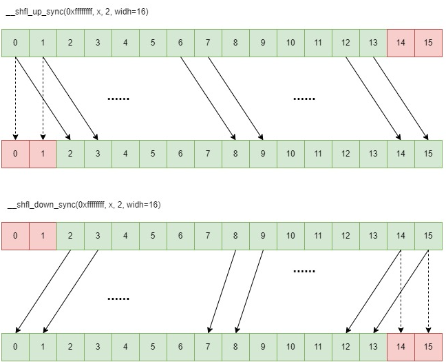
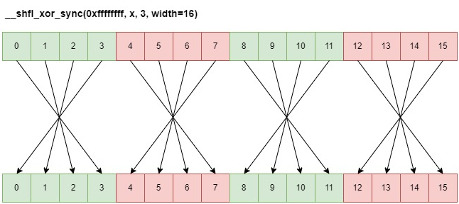

# 1 __shfl_sync()

这个函数主要用来把某一个或几个线程的值广播到其它线程.

**函数签名**

```c++
T __shfl_sync(unsigned mask, T var, int srcLane, int width=warpSize);
```

> - mask: 参与线程的mask，要参与的线程对应的位置所在的比特为1，否则为0；
> - var: 当前线程的var变量的值;
> - width: 32个线程中没width个线程为一组，同步操作发生在组内.

## 1.1 eg: 32个线程都广播得到id为5的线程的值

```c++
#include <stdio.h>
#include <cuda_runtime.h>

// 定义检查CUDA调用错误的宏
#define CUDA_CHECK(call) \
    do { \
        cudaError_t err = call; \
        if (err != cudaSuccess) { \
            fprintf(stderr, "CUDA error at %s:%d: %s\n", __FILE__, __LINE__, cudaGetErrorString(err)); \
            exit(EXIT_FAILURE); \
        } \
    } while (0)

// CUDA核函数
__global__ static void test(int lid) {
    int tid = threadIdx.x;
    int value = tid;
    // 使用__shfl_sync函数进行数据交换
    int ret = __shfl_sync(0xFFFFFFFF, value, 5, 32);
    // 输出每个线程在数据交换前后的值, 只能在 __global__ 函数中使用
    // 如果在__device__函数中使用, 会出现编译错误
    printf("thread id = %d, before shuffle value = %d, after shuffle value=%d\n", tid, value, ret);
}

int main() {
    // 启动CUDA核函数
    test<<<1, 32>>>(0);
    // 检查核函数启动是否出错
    CUDA_CHECK(cudaGetLastError());
    // 同步设备
    CUDA_CHECK(cudaDeviceSynchronize());
    // 重置CUDA设备
    CUDA_CHECK(cudaDeviceReset());
    return 0;
}
```

## 1.2 width 进行分组

&nbsp;&nbsp;&nbsp;&nbsp;&nbsp;&nbsp;&nbsp;&nbsp;然后我们再来看一下width这个参数。这个参数其实是控制我们的一个warp里面32个线程如何分组。默认值为32，也就是把32个线程当成一组。这里我们尝试把一个warp的线程分为2组，每组都通过广播得到该组里面id为5的线程的值. <br>

```c++
int ret = __shfl_sync(0xFFFFFFFF, value, 5, 16);

```

输出：
```shell
thread id = 0, before shuffle value = 0, after shuffle value=5
thread id = 1, before shuffle value = 1, after shuffle value=5
thread id = 2, before shuffle value = 2, after shuffle value=5
thread id = 3, before shuffle value = 3, after shuffle value=5
thread id = 4, before shuffle value = 4, after shuffle value=5
thread id = 5, before shuffle value = 5, after shuffle value=5
thread id = 6, before shuffle value = 6, after shuffle value=5
thread id = 7, before shuffle value = 7, after shuffle value=5
thread id = 8, before shuffle value = 8, after shuffle value=5
thread id = 9, before shuffle value = 9, after shuffle value=5
thread id = 10, before shuffle value = 10, after shuffle value=5
thread id = 11, before shuffle value = 11, after shuffle value=5
thread id = 12, before shuffle value = 12, after shuffle value=5
thread id = 13, before shuffle value = 13, after shuffle value=5
thread id = 14, before shuffle value = 14, after shuffle value=5
thread id = 15, before shuffle value = 15, after shuffle value=5
thread id = 16, before shuffle value = 16, after shuffle value=21
thread id = 17, before shuffle value = 17, after shuffle value=21
thread id = 18, before shuffle value = 18, after shuffle value=21
thread id = 19, before shuffle value = 19, after shuffle value=21
thread id = 20, before shuffle value = 20, after shuffle value=21
thread id = 21, before shuffle value = 21, after shuffle value=21
thread id = 22, before shuffle value = 22, after shuffle value=21
thread id = 23, before shuffle value = 23, after shuffle value=21
thread id = 24, before shuffle value = 24, after shuffle value=21
thread id = 25, before shuffle value = 25, after shuffle value=21
thread id = 26, before shuffle value = 26, after shuffle value=21
thread id = 27, before shuffle value = 27, after shuffle value=21
thread id = 28, before shuffle value = 28, after shuffle value=21
thread id = 29, before shuffle value = 29, after shuffle value=21
thread id = 30, before shuffle value = 30, after shuffle value=21
thread id = 31, before shuffle value = 31, after shuffle value=21
```

&nbsp;&nbsp;&nbsp;&nbsp;&nbsp;&nbsp;&nbsp;&nbsp;因为width=16，也就是16个线程为一组，那么一个warp里面32个线程就有两组。每组都被广播得到各自组里面的id为5，也就是第6个线程(因为id从0开始)的值，所以0到15号线程得到的值都是5，而16到32号线程得到值为21，也就是第二组里面第六个线程的值。

## 1.3 srcLane > width 怎么办？

这时候有个问题，如果我们指定的srcLane比width大的话如何处理？比如：

```c++
int ret = __shfl_sync(0xFFFFFFFF, value, 17, 16);
```

**实际上，真实的lane是srcLane % width.**

**output:** <br>

```shell
thread id = 0, before shuffle value = 0, after shuffle value=1
thread id = 1, before shuffle value = 1, after shuffle value=1
thread id = 2, before shuffle value = 2, after shuffle value=1
thread id = 3, before shuffle value = 3, after shuffle value=1
thread id = 4, before shuffle value = 4, after shuffle value=1
thread id = 5, before shuffle value = 5, after shuffle value=1
thread id = 6, before shuffle value = 6, after shuffle value=1
thread id = 7, before shuffle value = 7, after shuffle value=1
thread id = 8, before shuffle value = 8, after shuffle value=1
thread id = 9, before shuffle value = 9, after shuffle value=1
thread id = 10, before shuffle value = 10, after shuffle value=1
thread id = 11, before shuffle value = 11, after shuffle value=1
thread id = 12, before shuffle value = 12, after shuffle value=1
thread id = 13, before shuffle value = 13, after shuffle value=1
thread id = 14, before shuffle value = 14, after shuffle value=1
thread id = 15, before shuffle value = 15, after shuffle value=1
thread id = 16, before shuffle value = 16, after shuffle value=17
thread id = 17, before shuffle value = 17, after shuffle value=17
thread id = 18, before shuffle value = 18, after shuffle value=17
thread id = 19, before shuffle value = 19, after shuffle value=17
thread id = 20, before shuffle value = 20, after shuffle value=17
thread id = 21, before shuffle value = 21, after shuffle value=17
thread id = 22, before shuffle value = 22, after shuffle value=17
thread id = 23, before shuffle value = 23, after shuffle value=17
thread id = 24, before shuffle value = 24, after shuffle value=17
thread id = 25, before shuffle value = 25, after shuffle value=17
thread id = 26, before shuffle value = 26, after shuffle value=17
thread id = 27, before shuffle value = 27, after shuffle value=17
thread id = 28, before shuffle value = 28, after shuffle value=17
thread id = 29, before shuffle value = 29, after shuffle value=17
thread id = 30, before shuffle value = 30, after shuffle value=17
thread id = 31, before shuffle value = 31, after shuffle value=17
```

## 1.4 mask

&nbsp;&nbsp;&nbsp;&nbsp;&nbsp;&nbsp;&nbsp;&nbsp;我们再来看mask，理论上这是一个需要至少32个比特的值，因为需要32个比特才能指定32个线程的参与情况。「标准文档说明，如果从一个inactive的lane取值，得到的结果是undefined。实际上，没什么影响，至少在A100上是这样，这个mask设定为任何值都没有影响。」<br>

# 2 __shfl_up_sync和__shfl_down_sync

```c++
T __shfl_up_sync(unsigned mask, T var, unsigned int delta, int width=warpSize);
```

&nbsp;&nbsp;&nbsp;&nbsp;&nbsp;&nbsp;&nbsp;&nbsp;首先，按照width把一个warp的线程进行分组，每组有width个线程。然后，在每一组内部，0到delta-1的线程值保持不变，lane为delta到width-1的线程的值为lane-delta的线程的值。<br>

&nbsp;&nbsp;&nbsp;&nbsp;&nbsp;&nbsp;&nbsp;&nbsp;换句话说，一个组内所有的值都往右移动delta位置，低delta个线程的值不变，大于等于delta的位置的值用新值覆盖。<br>

```c++
int ret = __shfl_up_sync(0xFFFFFFFF, value, 2, 16);
```



# 3 __shfl_xor_sync

&nbsp;&nbsp;&nbsp;&nbsp;&nbsp;&nbsp;&nbsp;&nbsp;这个函数是**做reduce的关键**, 主打的就是一个交换数据。函数声明如下:<br>

```c++
T __shfl_xor_sync(unsigned mask, T var, int laneMask, int width=warpSize);
```

&nbsp;&nbsp;&nbsp;&nbsp;&nbsp;&nbsp;&nbsp;&nbsp;同样的，一个warp里面32个线程根据width进行分组，每组有width个线程。一个组里面id为lane的线程的最终值是组里面**原始线程(lane^laneMask)的值**。

&nbsp;&nbsp;&nbsp;&nbsp;&nbsp;&nbsp;&nbsp;&nbsp;当width < 32的时候，那么连续的width个线程可以取比它们原始id小的线程的值，哪怕这些线程在其它的group里面。但是它们如果要取比它们原始id还要大的线程的值，那么它们的值**保持不变**。

```c++
int ret = __shfl_xor_sync(0xFFFFFFFF, value, 16, 32);
```

## 3.1 __shfl_xor_sync(0xffffffff, x, 1) 3.1 __shfl_xor_sync(0xffffffff, x, 3)

默认 width 等于 warpSize（即 32），对 0 ~ 31 和 1 进行按位异或计算得到 1、 0、 3、 2、 5、 4、 ... 29、 28、 31、 30，各自通道根据计算结果获得目标通道的变量 x 的值.

同样地，当调用 __shfl_xor_sync(0xffffffff, x, 3) 时，默认 width 等于 warpSize（即32），对 0 ~ 31 和 3 进行按位异或计算得到 3、2、1、0、7、6、5、4 ...、 31、 30、29、 28，各自通道根据计算结果获得目标通道的变量 x 的值。



## 3.2 laneMask 为 偶数时


# 4 allreduce 算法
```c++
#include <cuda_runtime.h>
#include <cuda_fp16.h>
#include <iostream>
#include <vector>

template <typename T, int warpSize = 32>
__device__ __forceinline__ T warp_reduce_sum(T val) {
    #pragma unroll
    for (int mask = warpSize/2; mask > 0; mask >>= 1) {
        T shfl_val = __shfl_xor_sync(0xffffffff, val, mask, warpSize);
        val += shfl_val;
    }
    return val;
}

template <typename T>
__global__ void reduce_sum_kernel(T* dst, const T* src, int n) {
    const int tid = blockIdx.x * blockDim.x + threadIdx.x;
    T val = (tid < n) ? src[tid] : static_cast<T>(0);

    val = warp_reduce_sum(val);

    if ((threadIdx.x & (warpSize-1)) == 0) {
        atomicAdd(dst, val);
    }
}

template <typename T>
void launch_reduce_sum(T* d_dst, const T* d_src, int n, int block_size=1024) {
    int grid_size = (n + block_size - 1) / block_size;
    reduce_sum_kernel<<<grid_size, block_size>>>(d_dst, d_src, n);
    cudaDeviceSynchronize();
}

int main() {
    int n = 1 << 20; // 1 million elements
    std::vector<int> h_data(n);
    for (int i = 0; i < n; ++i) h_data[i] = i % 100; // Generate test data

    int* d_src, *d_dst;
    cudaMalloc(&d_src, n * sizeof(int));
    cudaMalloc(&d_dst, sizeof(int));
    cudaMemcpy(d_src, h_data.data(),  n * sizeof(int), cudaMemcpyHostToDevice);

    // Initialize destination
    cudaMemset(d_dst, 0, sizeof(int));

    launch_reduce_sum<int>(d_dst, d_src, n);

    int h_result;
    cudaMemcpy(&h_result, d_dst, sizeof(int), cudaMemcpyDeviceToHost);#include <cuda_runtime.h>
#include <cuda_fp16.h>
#include <iostream>
#include <vector>

template <typename T, int warpSize = 32>
__device__ __forceinline__ T warp_reduce_sum(T val) {
    #pragma unroll
    for (int mask = warpSize/2; mask > 0; mask >>= 1) {
        T shfl_val = __shfl_xor_sync(0xffffffff, val, mask, warpSize);
        val += shfl_val;
    }
    return val;
}

template <typename T>
__global__ void reduce_sum_kernel(T* dst, const T* src, int n) {
    const int tid = blockIdx.x * blockDim.x + threadIdx.x;
    T val = (tid < n) ? src[tid] : static_cast<T>(0);

    val = warp_reduce_sum(val);

    if ((threadIdx.x & (warpSize-1)) == 0) {
        atomicAdd(dst, val);
    }
}

template <typename T>
void launch_reduce_sum(T* d_dst, const T* d_src, int n, int block_size=1024) {
    int grid_size = (n + block_size - 1) / block_size;
    reduce_sum_kernel<<<grid_size, block_size>>>(d_dst, d_src, n);
    cudaDeviceSynchronize();
}

int main() {
    int n = 1 << 20; // 1 million elements
    std::vector<int> h_data(n);
    for (int i = 0; i < n; ++i) h_data[i] = i % 100; // Generate test data

    int* d_src, *d_dst;
    cudaMalloc(&d_src, n * sizeof(int));
    cudaMalloc(&d_dst, sizeof(int));
    cudaMemcpy(d_src, h_data.data(),  n * sizeof(int), cudaMemcpyHostToDevice);

    // Initialize destination
    cudaMemset(d_dst, 0, sizeof(int));

    launch_reduce_sum<int>(d_dst, d_src, n);

    int h_result;
    cudaMemcpy(&h_result, d_dst, sizeof(int), cudaMemcpyDeviceToHost);

    // Verification
    int expected = 0;
    for (int i = 0; i < n; ++i) expected += h_data[i];
    std::cout << "CUDA Result: " << h_result << std::endl;
    std::cout << "Expected:    " << expected << std::endl;
    std::cout << "Correct: " << (h_result == expected ? "Yes" : "No") << std::endl;

    cudaFree(d_src);
    cudaFree(d_dst);
    return 0;
}

    // Verification
    int expected = 0;
    for (int i = 0; i < n; ++i) expected += h_data[i];
    std::cout << "CUDA Result: " << h_result << std::endl;
    std::cout << "Expected:    " << expected << std::endl;
    std::cout << "Correct: " << (h_result == expected ? "Yes" : "No") << std::endl;

    cudaFree(d_src);
    cudaFree(d_dst);
    return 0;
}
```


