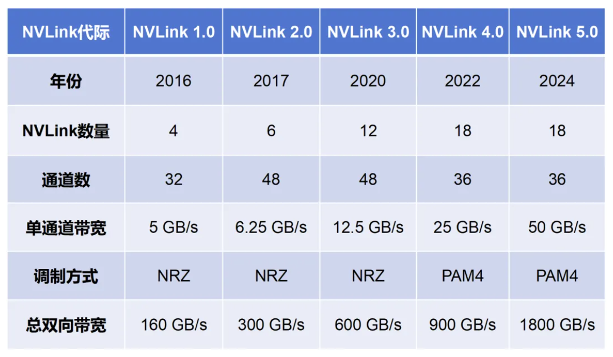
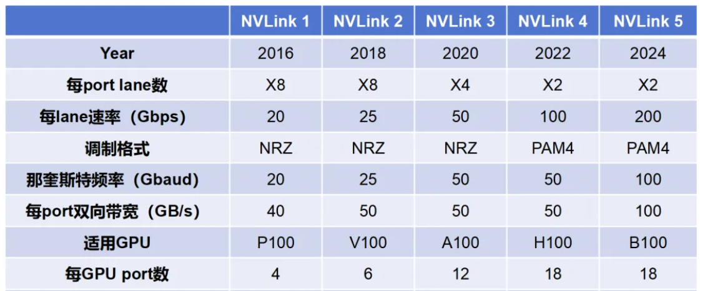
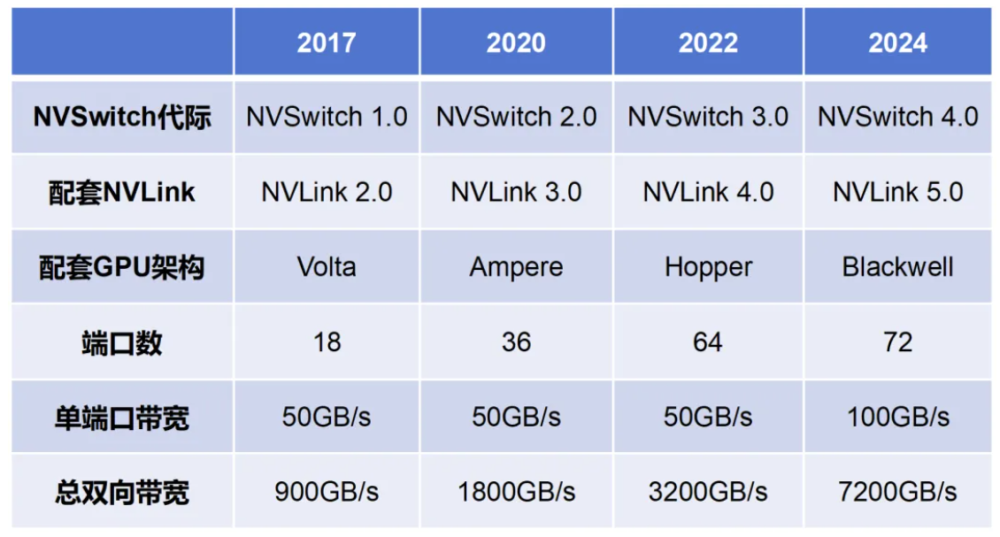

# 1 H2D 和 D2D 走 PCIE

**pcie 4.0 版本**

- 单向带宽 = 16 GT/s × 128/130 × 16(通道: lane) ≈ 31.5 GB/s
- 双向带宽 = 16 GT/s × 128/130 × 16(通道: lane) × 2 ≈ 63 GB/s
- 该计算结果通常表示单个GPU通过独立链路（如PCIe x16或NVLink）的理论最大单向带宽。此时，每个GPU独享31.5 GB/s的带宽;
- **每个GPU均享有独立的31.5 GB/s带宽，8个GPU总带宽为 31.5 GB/s × 8 = 252 GB/s.**

*GT/s 即 GigaTransfers per second（千兆传输次数/秒），代表每秒完成的传输次数, 按照bit 来计算的，通过除以8转化为Byte* <br>

*若每个GPU有独立互联链路 → 31.5 GB/GPU。若共享同一链路 → 总带宽31.5 GB，均分给8个GPU。 具体需根据硬件配置和互联协议确认* <br>

**PCIe 版本与速度对照表**

| PCIe 版本   | 传输速率（GT/s） | 单通道单向带宽（GB/s）                 | x16 总带宽（双向） |
|------------|------------------|---------------------------------------|--------------------|
| PCIe 1.0   | 2.5              | 0.25                                  | 8 GB/s             |
| PCIe 2.0   | 5.0              | 0.5                                   | 16 GB/s            |
| PCIe 3.0   | 8.0              | ~0.985 (128b/130b 编码)               | ~31.5 GB/s         |
| PCIe 4.0   | 16.0             | ~1.969                                | ~63 GB/s           |
| PCIe 5.0   | 32.0             | ~3.938                                | ~126 GB/s          |

>> nccl 中给出的值:
```c++
struct kvDict kvDictPciGen[] = {
  { "2.5 GT/s", 15 }, { "5 GT/s", 30 }, { "8 GT/s", 60 }, { "16 GT/s", 120 }, { "32 GT/s", 240 }, /* Kernel 5.6 and earlier */
  { "2.5 GT/s PCIe", 15 }, { "5.0 GT/s PCIe", 30 }, { "8.0 GT/s PCIe", 60 }, { "16.0 GT/s PCIe", 120 }, { "32.0 GT/s PCIe", 240 }, { "64.0 GT/s PCIe", 480 },
  { NULL, 60 /* Default fallback */ } }; // x100 Mbps per lane
```


# 2 InfiniBand带宽规格

跨节点IB网络传输GPU数据时，节点内部必须通过PCIe总线（GPU与IB网卡间），而跨节点阶段仅依赖IB网络。RDMA技术通过减少CPU干预和内存拷贝，使PCIe路径的效率最大化，整体实现低延迟、高带宽的GPU数据交换。

## 2.1 优势
- 无损传输：基于信用机制的流控避免丢包，保障高吞吐量。
- 协议栈优化：原生支持RDMA，无需额外协议封装，降低CPU负载
- RDMA（远程直接内存访问）允许数据直接在GPU显存与IB网卡之间传输，无需经过CPU和系统内存，大幅降低延迟（低至600纳秒）；
- 需要经过PCIe，RDMA仍能减少数据复制次数：GPU显存 → IB网卡（通过PCIe）→ IB网络 → 目标节点IB网卡（通过PCIe）→ 目标GPU显存
- IB网络结合RDMA的端到端延迟仅为传统TCP/IP以太网的1/10；
- 一个节点上, 通常只配备1-4块IB网卡，所有GPU 通过PCIe Switch 共享这两块网卡.

## 2.2 IB 网络的带宽 Gbit/s
| 类型       | 单链路带宽   | 4x链路聚合带宽 |
|------------|--------------|----------------|
| SDR（单数据率） | 20Gbps       | 80Gbps         |
| QDR（四数据率） | 40Gbps       | 160Gbps        |
| FDR（十四数据率） | 56Gbps       | 224Gbps        |
| EDR（增强型数据率） | 100Gbps      | 400Gbps        |
| HDR（高数据率） | 200Gbps      | 800Gbps        |
| NDR（下一代数据率） | 400Gbps      | 1.6Tbps        |

*注意：上表中指的是双向总带宽。eg: HDR标准的200Gb/s带宽为双向总和（即每个方向100Gb/s）*

## 2.3 计算细节

&nbsp;&nbsp;&nbsp;&nbsp;&nbsp;&nbsp;&nbsp;&nbsp;DeepSeek-V3 论文中提到：NVLink(H20) 提供 160 GB/s 的带宽，大约是 IB (50 GB/s) 的 3.2 倍。此处的带宽指的均是单向带宽。以2.2节中的带宽为例，HDR的4x链路聚合带宽为800Gbps=100GB/s 为双向带宽, 单向便为50GB/s(4x链路). <br>

## 2.4 聚合带宽的分配逻辑
非平均分配：
- 聚合带宽并非简单平均分配到每个GPU卡，而是通过负载均衡动态分配。例如：多个GPU任务并行时，流量会被分散到不同物理链路上，以充分利用总带宽。<br>
- 单一任务的传输速率仍受限于单条物理链路的带宽（如12.5GB/s），但多任务可叠加总吞吐量. <br>

# 3 NVLink and NVSwitch

## 3.1 NVLink
NVLink 的双向特性: <br>

每条 NVLink 是 全双工通道（类似双向高速公路）: <br>
- 可同时 发送 + 接收数据（各 25 GB/s）;
- **实际有效带宽 = 50 GB/s（双向）**
- v100 每个GPU 6条NVlink, 总带宽 300 GB/s（双向）;

2014 年，NVIDIA 推出 NVLink 技术来代替 PCIe，旨在突破 PCIe 互联的带宽性能瓶颈，实现 GPU 芯片之间的高带宽、低延迟数据传输。NVLink 互联，即：GPU 通过 NVLink 两两直连，而不再需要通过 PCIe Switch.


NVLink 发展历程：





- [参考连接](https://cloud.tencent.com/developer/article/2517231)

## 3.2 NVSwitch
NVSwitch 是 NVIDIA 于 2018 年在 DGX-2 中首次推出，它是为了解决多 GPU 通信瓶颈而设计的全互连交换架构，它标志着从 PCIe 和点对点 NVLink 向真正“巨型 GPU”模型的演进，如今已发展到第三代，广泛应用于 DGX A100/H100、Hopper 架构等新一代 AI 超算平台中。




- [参考连接](https://mp.weixin.qq.com/s?__biz=MzI1OTExNzkzNw==&mid=2650480852&idx=3&sn=9c1730bc2ba0262937e29a7096a0697d&chksm=f3811d2cccd9dfae64115574577a78a3875cdf8ef926a79ac1b03232dc910508cff4df37533b&scene=27)