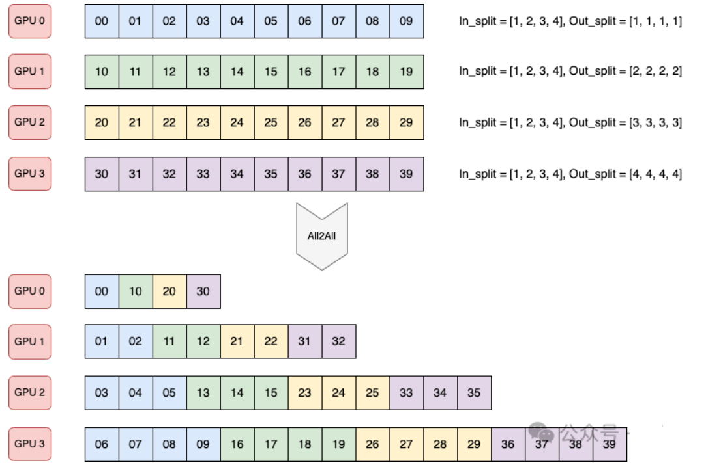
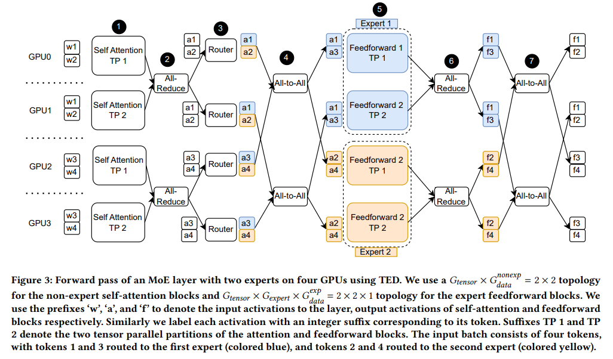

# 1 NCCL doc
- [Nccl doc](https://docs.nvidia.com/deeplearning/nccl/user-guide/docs/index.html)

# 2. NCCL collective ops
- [collective ops](https://docs.nvidia.com/deeplearning/nccl/user-guide/docs/usage/collectives.html)

# 3. AllTOAll

## 3.1 All-to-All 原理图
- **token 分配**

- **Dispatch and Combine**

在 All-to-All（**Dispatch**）操作之前需要准备好 All-to-All 的输入；在 All-to-All（**Combine**）操作之后需要解包 All-to-All 的输出，组织为原始的顺序.

- **dispatch example**

- **TP + EP**

# 3.2 MoEAlltoAllTokenDispatcher流程详解

- **Token Permutation流程**
> 注意：在开始这个流程前，probs 和indices 在routing 阶段是先经过了tp group 上的all gather(开启了sequence parallel)， 从而将sequential 的hidden states 进行了一轮收集， 所以probs， indices 是不需要除以TP 的。

Permute 是依据路由得到的信息将hidden_states 分发到对应的专家，供MLP计算, 细节如下： 

**intput**  

- **hidden_states:** 表示输入的信息，一般叫做activation；它的形状为[S/TP, B, H]; S 表示sequence 长度； B表示micro-batch size, H表示隐藏层; 注意这里S 要除以TP 是因为**启用了sequential parallelism**;

- **indices:**  它的形状为： **[toks, k]**; 这里的toks 应该是**S * B**; k为top k的值， 一般设置为2（或者1）；注意： **toks** 没有除以TP的原因是在routing的时候， 如果dispatch的type 是all2all的，则`进行了all gather`，将数据进行了聚合，所以不用;

- **probs:** 它的形状为： [toks, k];就是每个tok**在不同expert的权重**；

**output**  

- **tokens_per_expert：** 表示每个expert 上面有**多少个tokens**， 其实是 num_tokens_per_local_expert；它的形状为： [num_local_experts];

- **global_input_tokens:** 这个其实就是输出给最后的**Grouped GEMM**的输入的值;
