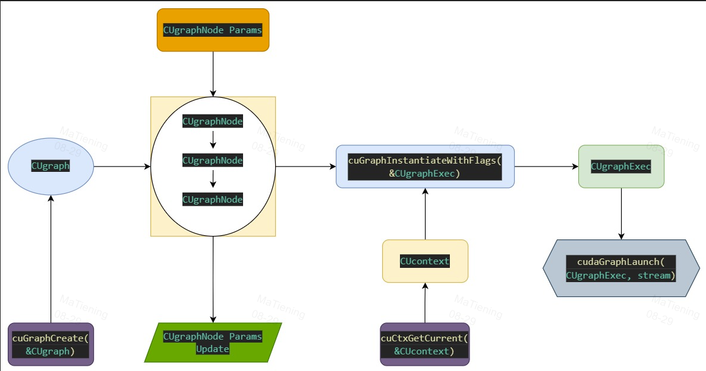
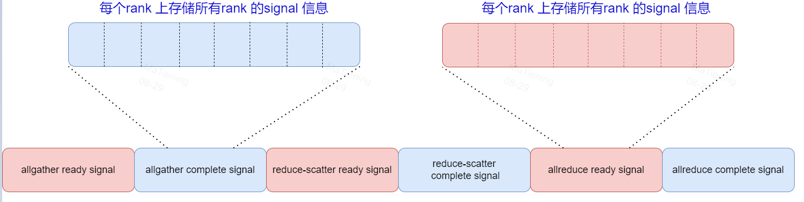
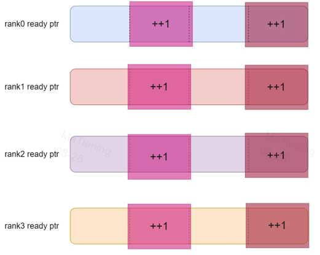
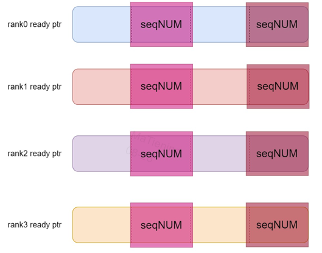
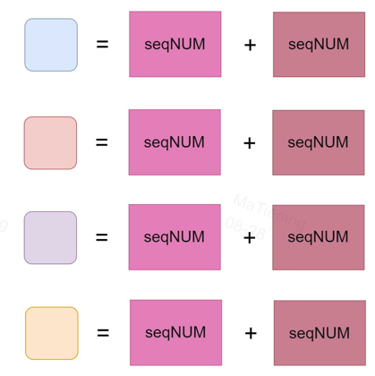
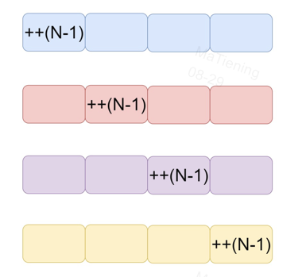
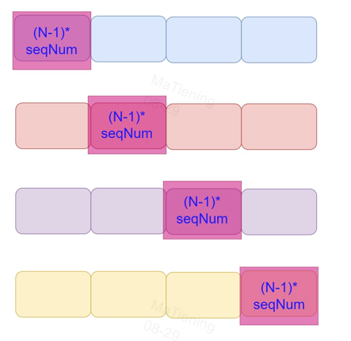
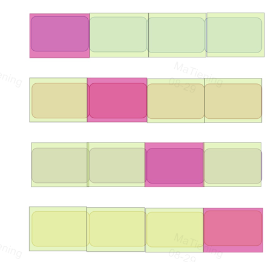
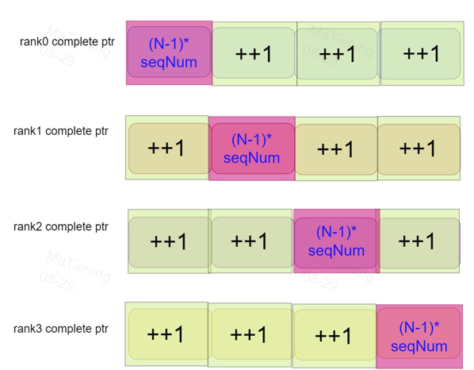
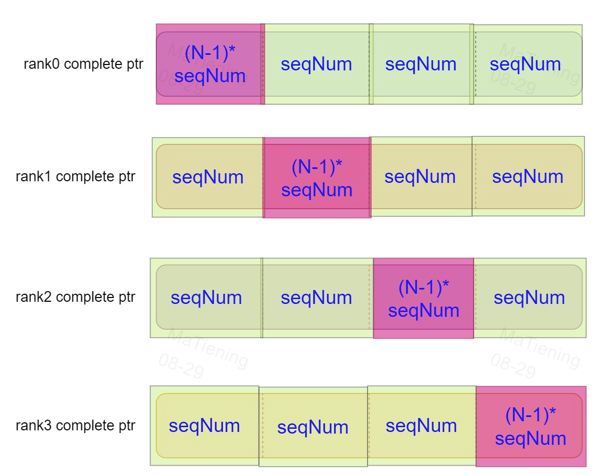

# 1 introduce

This guide introduce how to impletment high performance ace communication by combine symmetric memory and cuda graph.

# 2 base data structrue

## 2.1 node

| 结构体 | 用途 |
|---|---|
| `CUDA_MEM_ATOMIC_VALUE_NODE_PARAMS` | 对一个设备内存中的 64 位值执行原子运算 |
| `CUDA_MEM_WAIT_WRITE_NODE_PARAMS` | 对设备内存执行等待、写入、内存屏障或远端写刷新 |
| `CUDA_MEM_TRANSFER_NODE_PARAMS` | 通过 transfer engine 做GPU ptr 可见的数据拷贝 |

```c++
// /usr/local/cusa-5.1.0/include/cusa.h

// 1. atomic value node params ---> add to graph by cuGraphAddMemAtomicValueNode_
typedef struct CUDA_MEM_ATOMIC_VALUE_NODE_PARAMS_st {
    CUdeviceptr dst;
    cuuint64_t value;
    // CU_ATOMIC_VALUE_TYPE_ATOMIC_ADD64/SUB64/UMINT64/IMIN64/UMAX64/IMAX64/AND64/OR64/XOR64
    CUatomicValueType operation;
} CUDA_MEM_ATOMIC_VALUE_NODE_PARAMS_v1;
typedef CUDA_MEM_ATOMIC_VALUE_NODE_PARAMS_v1 CUDA_MEM_ATOMIC_VALUE_NODE_PARAMS;

// 2. mem wait-write node params --> add by cuGraphAddMemWaitWriteNode_
typedef struct CUDA_MEM_WAIT_WRITE_NODE_PARAMS_st {
    CUdeviceptr addr;
    cuuint64_t value;
    unsigned int flags;
    // CU_STREAM_MEM_OP_WAIT_VALUE_32/64  CU_STREAM_MEM_OP_WRITE_VALUE_32/64
    // CU_STREAM_MEM_OP_BARRIER  CU_STREAM_MEM_OP_FLUSH_REMOTE_WRITES
    CUstreamBatchMemOpType operation;
} CUDA_MEM_WAIT_WRITE_NODE_PARAMS_v1;
typedef CUDA_MEM_WAIT_WRITE_NODE_PARAMS_v1 CUDA_MEM_WAIT_WRITE_NODE_PARAMS;

// 3. mem transfer node params --> cuGraphAddMemTransferNode_
typedef struct CUDA_MEM_TRANSFER_NODE_PARAMS_st {
    CUdeviceptr dst;
    CUdeviceptr src;
    size_t ByteCount;
} CUDA_MEM_TRANSFER_NODE_PARAMS_v1;
typedef CUDA_MEM_TRANSFER_NODE_PARAMS_v1 CUDA_MEM_TRANSFER_NODE_PARAMS;


// 4. mem atomic node param : copy engine op --> add to graph by cuGraphAddMemAtomicNode_
typedef struct CUDA_MEM_ATOMIC_NODE_PARAMS_st {
    CUdeviceptr dst;
    CUdeviceptr src;
    size_t elementCount;
    // CU_ATOMIC_TYPE_ATOMIC_ADD32/ADD64/UMIN32/UMIN64/IMIN32/IMIN64/UMAX32/
    //  /UMAX64/IMAX32/IMAX64/ADD_F32/ADD_F64/ADD_HF16/ADD_BF16
    CUatomicType operation;
} CUDA_MEM_ATOMIC_NODE_PARAMS_v1;
typedef CUDA_MEM_ATOMIC_NODE_PARAMS_v1 CUDA_MEM_ATOMIC_NODE_PARAMS;
```

## 2.2 node add to graph

```c++
CUresult CUDAAPI cuGraphAddMemAtomicNode(CUgraphNode *phGraphNode, CUgraph hGraph, const CUgraphNode *dependencies, size_t numDependencies, const CUDA_MEM_ATOMIC_NODE_PARAMS* memAtomicParams, CUcontext ctx);

CUresult CUDAAPI cuGraphAddMemAtomicValueNode(CUgraphNode *phGraphNode, CUgraph hGraph, const CUgraphNode *dependencies, size_t numDependencies, const CUDA_MEM_ATOMIC_VALUE_NODE_PARAMS* memAtomicValueParams, CUcontext ctx);

CUresult CUDAAPI cuGraphAddMemWaitWriteNode(CUgraphNode *phGraphNode, CUgraph hGraph, const CUgraphNode *dependencies, size_t numDependencies, const CUDA_MEM_WAIT_WRITE_NODE_PARAMS* memWaitWriteParams, CUcontext ctx);

CUresult CUDAAPI cuGraphAddMemTransferNode(CUgraphNode *phGraphNode, CUgraph hGraph, const CUgraphNode *dependencies, size_t numDependencies, const CUDA_MEM_TRANSFER_NODE_PARAMS* memTransferParams, CUcontext ctx);

CUresult CUDAAPI cuGraphAddNode(CUgraphNode *phGraphNode, CUgraph hGraph, const CUgraphNode *dependencies, size_t numDependencies, CUgraphNodeParams *nodeParams);
```

## 2.3 param get and set

```c++
CUresult CUDAAPI cuGraphMemAtomicNodeGetParams(CUgraphNode hNode, CUDA_MEM_ATOMIC_NODE_PARAMS *nodeParams);

CUresult CUDAAPI cuGraphMemAtomicNodeSetParams(CUgraphNode hNode, const CUDA_MEM_ATOMIC_NODE_PARAMS *nodeParams);

CUresult CUDAAPI cuGraphMemAtomicValueNodeGetParams(CUgraphNode hNode, CUDA_MEM_ATOMIC_VALUE_NODE_PARAMS *nodeParams);

CUresult CUDAAPI cuGraphMemAtomicValueNodeSetParams(CUgraphNode hNode, const CUDA_MEM_ATOMIC_VALUE_NODE_PARAMS *nodeParams);

CUresult CUDAAPI cuGraphMemWaitWriteNodeGetParams(CUgraphNode hNode, CUDA_MEM_WAIT_WRITE_NODE_PARAMS *nodeParams);

CUresult CUDAAPI cuGraphMemWaitWriteNodeSetParams(CUgraphNode hNode, const CUDA_MEM_WAIT_WRITE_NODE_PARAMS *nodeParams);

CUresult CUDAAPI cuGraphMemTransferNodeGetParams(CUgraphNode hNode, CUDA_MEM_TRANSFER_NODE_PARAMS* nodeParams);

CUresult CUDAAPI cuGraphMemTransferNodeSetParams(CUgraphNode hNode, const CUDA_MEM_TRANSFER_NODE_PARAMS* nodeParams);

CUresult CUDAAPI cuGraphExecMemAtomicNodeSetParams(CUgraphExec hGraphExec, CUgraphNode hNode, const CUDA_MEM_ATOMIC_NODE_PARAMS *nodeParams, CUcontext ctx);

CUresult CUDAAPI cuGraphExecMemAtomicValueNodeSetParams(CUgraphExec hGraphExec, CUgraphNode hNode, const CUDA_MEM_ATOMIC_VALUE_NODE_PARAMS *nodeParams, CUcontext ctx);

CUresult CUDAAPI cuGraphExecMemWaitWriteNodeSetParams(CUgraphExec hGraphExec, CUgraphNode hNode, const CUDA_MEM_WAIT_WRITE_NODE_PARAMS *nodeParams, CUcontext ctx);

CUresult CUDAAPI cuGraphExecMemTransferNodeSetParams(CUgraphExec hGraphExec, CUgraphNode hNode, const CUDA_MEM_TRANSFER_NODE_PARAMS *nodeParams, CUcontext ctx);

CUresult CUDAAPI cuGraphNodeSetParams(CUgraphNode hNode, CUgraphNodeParams *nodeParams);

CUresult CUDAAPI cuGraphExecNodeSetParams(CUgraphExec hGraphExec, CUgraphNode hNode, CUgraphNodeParams *nodeParams);
```

# 3 cuda graph topology diagram



# 4 comm: allreduce ace graph procedures

- signal ptr = ready ptr + complte ptr



- method: reduce-scatter and allgather

## 4.1 increment remote step
Local data arrive/ready and increse remote step.

Local Loop world size to write peer ready ptr ++1.



```c++
// Signal each peer that this rank's input is ready.
CUDA_MEM_ATOMIC_VALUE_NODE_PARAMS barrier_param{
    (CUdeviceptr)(peer_ready_ptrs + rank),
    1,
    CU_ATOMIC_VALUE_TYPE_ATOMIC_ADD64};
C10_CUDA_DRIVER_CHECK(driver_api->cuGraphAddMemAtomicValueNode_(
    &nodes[peer][0], graph, nullptr, 0, &barrier_param, ctx));
```

## 4.2 local wait

Local step update by remote and wait itself. When local step arrive target it indicate Remote data is ready.



```c++
CUDA_MEM_WAIT_WRITE_NODE_PARAMS wait_ready_param{
    (CUdeviceptr)(local_ready_ptrs + peer),
    seqNUM,
    CU_STREAM_WAIT_VALUE_EQ,
    CU_STREAM_MEM_OP_WAIT_VALUE_64};
C10_CUDA_DRIVER_CHECK(driver_api->cuGraphAddMemWaitWriteNode_(
    &nodes[peer][1], graph, &nodes[peer][0], 1, &wait_ready_param, ctx));
```

## 4.3 reduce-scatter : reduce peer data to local data

Peer data Reduce to Local data when local wait succssfully.

Loop (WORLD_SIZE -1) times.



```c++
// Reduce peer's rank-local slice into this rank's slice.
CUDA_MEM_ATOMIC_NODE_PARAMS reduce_param{
    .dst = (CUdeviceptr)(local_complete_ptrs + rank),
    .src = (CUdeviceptr)(peer_complete_ptrs + rank),
    .elementCount = 1,
    .operation = CU_ATOMIC_TYPE_ATOMIC_ADD64};
C10_CUDA_DRIVER_CHECK(driver_api->cuGraphAddMemAtomicNode_(
    &nodes[peer][2], graph, &nodes[peer][1], 1, &reduce_param, ctx));
```

## 4.4 Complete signal: increase
Local ++1 Loop (WORLD_SIZE - 1) times.



```c++
CUDA_MEM_ATOMIC_VALUE_NODE_PARAMS reduce_complete_param{
    (CUdeviceptr)(local_complete_ptrs + rank),
    1,
    CU_ATOMIC_VALUE_TYPE_ATOMIC_ADD64};
C10_CUDA_DRIVER_CHECK(driver_api->cuGraphAddMemAtomicValueNode_(
    &nodes[peer][3],
    graph,
    &nodes[peer][2],
    1,
    &reduce_complete_param,
    ctx));
```


## 4.5 Wait peer finish shard reduce

Local Wait peer complete date until to seqNum * (WORLD_SIZE - 1)



```c++
// Wait until peer has reduced its own slice.
CUDA_MEM_WAIT_WRITE_NODE_PARAMS wait_reduce_param{
    (CUdeviceptr)(peer_complete_ptrs + peer),
    static_cast<uint64_t>(world_size - 1),
    CU_STREAM_WAIT_VALUE_EQ,
    CU_STREAM_MEM_OP_WAIT_VALUE_64};
C10_CUDA_DRIVER_CHECK(driver_api->cuGraphAddMemWaitWriteNode_(
    &nodes[peer][4], graph, &nodes[peer][3], 1, &wait_reduce_param, ctx));
```

## 4.6 gather data

MemoryCpy peer reduced ready data to local right position.



```c++
CUDA_MEM_TRANSFER_NODE_PARAMS gather_param{
    (CUdeviceptr)(local_ready_ptrs + peer),
    (CUdeviceptr)(peer_ready_ptrs + peer),
    sizeof(uint64_t)};
C10_CUDA_DRIVER_CHECK(driver_api->cuGraphAddMemTransferNode_(
    &nodes[peer][5], graph, &nodes[peer][4], 1, &gather_param, ctx));
```


## 4.7 Complete signal: peer step increase

Tell peer its shard reduced data has been confused.



```c++
// Tell peer that its reduced slice has been consumed.
CUDA_MEM_ATOMIC_VALUE_NODE_PARAMS gather_complete_param{ // peer complete signal
    (CUdeviceptr)(peer_complete_ptrs + rank),
    1,
    CU_ATOMIC_VALUE_TYPE_ATOMIC_ADD64};
C10_CUDA_DRIVER_CHECK(driver_api->cuGraphAddMemAtomicValueNode_(
    &nodes[peer][6],
    graph,
    &nodes[peer][5],
    1,
    &gather_complete_param,
    ctx));
```

## 4.8 local wait to seqNum

Local wait all peers has used the data.

Peer remote write.



```c++
CUDA_MEM_WAIT_WRITE_NODE_PARAMS wait_complete_param{
    (CUdeviceptr)(local_complete_ptrs + peer),
    0,
    CU_STREAM_WAIT_VALUE_EQ,
    CU_STREAM_MEM_OP_WAIT_VALUE_64};
C10_CUDA_DRIVER_CHECK(driver_api->cuGraphAddMemWaitWriteNode_(
    &nodes[peer][7], graph, &nodes[peer][6], 1, &wait_complete_param, ctx));
```
