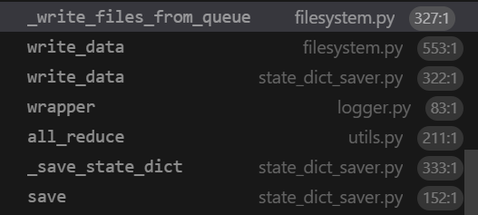

# 1 Distributed Checkpoint - torch.distributed.checkpoint

&nbsp;&nbsp;&nbsp;&nbsp;&nbsp;&nbsp;&nbsp;&nbsp;分布式检查点（Distributed Checkpoint，DCP）支持**在多个进程（rank）上并行加载和保存模型**。它具备**加载时的重分片（resharding）功能**，这使得模型能够`以一种集群拓扑结构保存，而以另一种集群拓扑结构加载`。

DCP 与 torch.save 和 torch.load 存在一些显著差异：

- DCP 会在每个检查点生成`多个文件`，每个进程(对应每个rank)`至少生成一个文件`。

- DCP 采用原地（in place）操作方式，这意味着**模型需要先分配好自身的数据存储空间**，而 DCP 会直接使用这些已分配的存储空间，而非另行分配。


# 2 How DCP works
torch.distributed.checkpoint() 支持在多个进程（rank）上并行地保存和加载模型。你可以使用这个模块在任意数量的进程上并行地进行保存操作，然后在加载时**重新分片（re-shard）以适应不同的集群拓扑结构**。

此外，通过使用 torch.distributed.checkpoint.state_dict() 中的模块，分布式检查点（DCP）提供了在分布式环境中优雅处理 state_dict 生成和加载(loading)的支持。这包括**管理模型和优化器之间的完全限定名（Fully Qualified Name，FQN）映射**，以及为 PyTorch 提供的并行性设置默认参数。

分布式检查点（DCP）与 torch.save() 和 torch.load() 存在几个显著的不同之处：

- DCP 在每个检查点会生成多个文件，每个进程（rank）**至少生成一个文件**。<br>
- DCP 采用**原地操作方式**，这意味着**模型需要先分配好自身的数据存储空间**，而 DCP 会直接使用这些已分配的存储空间，而不是另行分配。<br>
- DCP `对有状态（Stateful）对象提供了特殊处理`（这些对象在 torch.distributed.checkpoint.stateful 中有正式定义），如果定义了 state_dict 和 load_state_dict 方法，DCP 会自动调用它们。<br>

# 3 save example

```python
import os

import torch
import torch.distributed as dist
import torch.distributed.checkpoint as dcp
import torch.multiprocessing as mp
import torch.nn as nn

from torch.distributed.fsdp import FullyShardedDataParallel as FSDP
from torch.distributed.checkpoint.state_dict import get_state_dict, set_state_dict
from torch.distributed.checkpoint.stateful import Stateful
from torch.distributed.fsdp.fully_sharded_data_parallel import StateDictType

CHECKPOINT_DIR = "checkpoint"


class AppState(Stateful):
    """This is a useful wrapper for checkpointing the Application State. Since this object is compliant
    with the Stateful protocol, DCP will automatically call state_dict/load_stat_dict as needed in the
    dcp.save/load APIs.

    Note: We take advantage of this wrapper to hande calling distributed state dict methods on the model
    and optimizer.
    """

    def __init__(self, model, optimizer=None):
        self.model = model
        self.optimizer = optimizer

    def state_dict(self):
        # this line automatically manages FSDP FQN's, as well as sets the default state dict type to FSDP.SHARDED_STATE_DICT
        model_state_dict, optimizer_state_dict = get_state_dict(self.model, self.optimizer)
        return {
            "model": model_state_dict,
            "optim": optimizer_state_dict
        }

    def load_state_dict(self, state_dict):
        # sets our state dicts on the model and optimizer, now that we've loaded
        set_state_dict(
            self.model,
            self.optimizer,
            model_state_dict=state_dict["model"],
            optim_state_dict=state_dict["optim"]
        )

class ToyModel(nn.Module):
    def __init__(self):
        super(ToyModel, self).__init__()
        self.net1 = nn.Linear(16, 16)
        self.relu = nn.ReLU()
        self.net2 = nn.Linear(16, 8)

    def forward(self, x):
        return self.net2(self.relu(self.net1(x)))


def setup(rank, world_size):
    os.environ["MASTER_ADDR"] = "localhost"
    os.environ["MASTER_PORT"] = "12355 "

    # initialize the process group
    dist.init_process_group("nccl", rank=rank, world_size=world_size)
    torch.cuda.set_device(rank)


def cleanup():
    dist.destroy_process_group()


def run_fsdp_checkpoint_save_example(rank, world_size):
    print(f"Running basic FSDP checkpoint saving example on rank {rank}.")
    setup(rank, world_size)

    # create a model and move it to GPU with id rank
    model = ToyModel().to(rank)
    model = FSDP(model)

    loss_fn = nn.MSELoss()
    optimizer = torch.optim.Adam(model.parameters(), lr=0.1)

    optimizer.zero_grad()
    model(torch.rand(8, 16, device="cuda")).sum().backward()
    optimizer.step()

    state_dict = { "app": AppState(model, optimizer) }
    dcp.save(state_dict, checkpoint_id=CHECKPOINT_DIR)

    cleanup()


if __name__ == "__main__":
    world_size = torch.cuda.device_count()
    print(f"Running fsdp checkpoint example on {world_size} devices.")
    mp.spawn(
        run_fsdp_checkpoint_save_example,
        args=(world_size,),
        nprocs=world_size,
        join=True,
    )
```

运行结果：


# 4 load example

在保存之后，我们创建一个相同的由全分片数据并行（Fully Sharded Data Parallel，FSDP）包裹的模型，并将存储中保存的状态字典（state dict）加载到该模型中。你可以在相同的世界大小（world size）或不同的世界大小下进行加载。

请注意，在加载之前，你需要调用 model.state_dict()，并将其传递给 DCP 的 load_state_dict() API。这与 torch.load() 有根本的不同，因为 torch.load() 只需要在加载前提供检查点的路径即可。我们需要在加载前获取状态字典的原因是：

- DCP **使用来自模型状态字典的预分配存储空间来从检查点目录加载数据**。在加载过程中，传入的状态字典会被**原地更新**。

- DCP 在加载前需要模型的分片信息，以支持**重新分片（resharding）**。

```python
import os

import torch
import torch.distributed as dist
import torch.distributed.checkpoint as dcp
from torch.distributed.checkpoint.stateful import Stateful
from torch.distributed.checkpoint.state_dict import get_state_dict, set_state_dict
import torch.multiprocessing as mp
import torch.nn as nn

from torch.distributed.fsdp import FullyShardedDataParallel as FSDP

CHECKPOINT_DIR = "checkpoint"


class AppState(Stateful):
    """This is a useful wrapper for checkpointing the Application State. Since this object is compliant
    with the Stateful protocol, DCP will automatically call state_dict/load_stat_dict as needed in the
    dcp.save/load APIs.

    Note: We take advantage of this wrapper to hande calling distributed state dict methods on the model
    and optimizer.
    """

    def __init__(self, model, optimizer=None):
        self.model = model
        self.optimizer = optimizer

    def state_dict(self):
        # this line automatically manages FSDP FQN's, as well as sets the default state dict type to FSDP.SHARDED_STATE_DICT
        model_state_dict, optimizer_state_dict = get_state_dict(self.model, self.optimizer)
        return {
            "model": model_state_dict,
            "optim": optimizer_state_dict
        }

    def load_state_dict(self, state_dict):
        # sets our state dicts on the model and optimizer, now that we've loaded
        set_state_dict(
            self.model,
            self.optimizer,
            model_state_dict=state_dict["model"],
            optim_state_dict=state_dict["optim"]
        )

class ToyModel(nn.Module):
    def __init__(self):
        super(ToyModel, self).__init__()
        self.net1 = nn.Linear(16, 16)
        self.relu = nn.ReLU()
        self.net2 = nn.Linear(16, 8)

    def forward(self, x):
        return self.net2(self.relu(self.net1(x)))


def setup(rank, world_size):
    os.environ["MASTER_ADDR"] = "localhost"
    os.environ["MASTER_PORT"] = "12355 "

    # initialize the process group
    dist.init_process_group("nccl", rank=rank, world_size=world_size)
    torch.cuda.set_device(rank)


def cleanup():
    dist.destroy_process_group()


def run_fsdp_checkpoint_load_example(rank, world_size):
    print(f"Running basic FSDP checkpoint loading example on rank {rank}.")
    setup(rank, world_size)

    # create a model and move it to GPU with id rank
    model = ToyModel().to(rank)
    model = FSDP(model)

    optimizer = torch.optim.Adam(model.parameters(), lr=0.1)

    state_dict = { "app": AppState(model, optimizer)}
    dcp.load(
        state_dict=state_dict,
        checkpoint_id=CHECKPOINT_DIR,
    )

    cleanup()


if __name__ == "__main__":
    world_size = torch.cuda.device_count()
    print(f"Running fsdp checkpoint example on {world_size} devices.")
    mp.spawn(
        run_fsdp_checkpoint_load_example,
        args=(world_size,),
        nprocs=world_size,
        join=True,
    )
```

# 5 src code analysis
- 调用方式

```python
torch.distributed.checkpoint.save()
```

- save func stack



# 参考链接
- [torch.doc](https://docs.pytorch.org/docs/stable/distributed.checkpoint.html#module-torch.distributed.checkpoint)