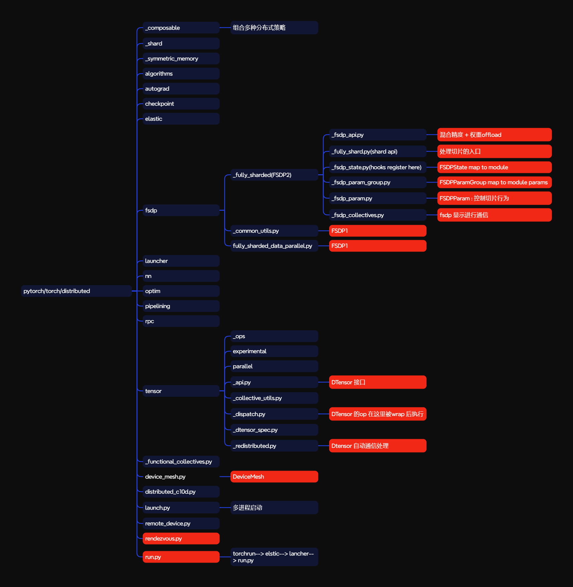
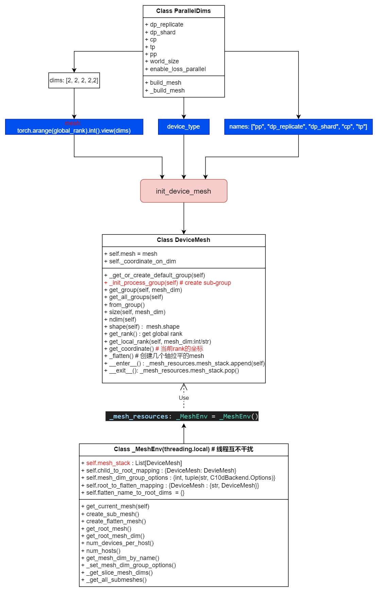
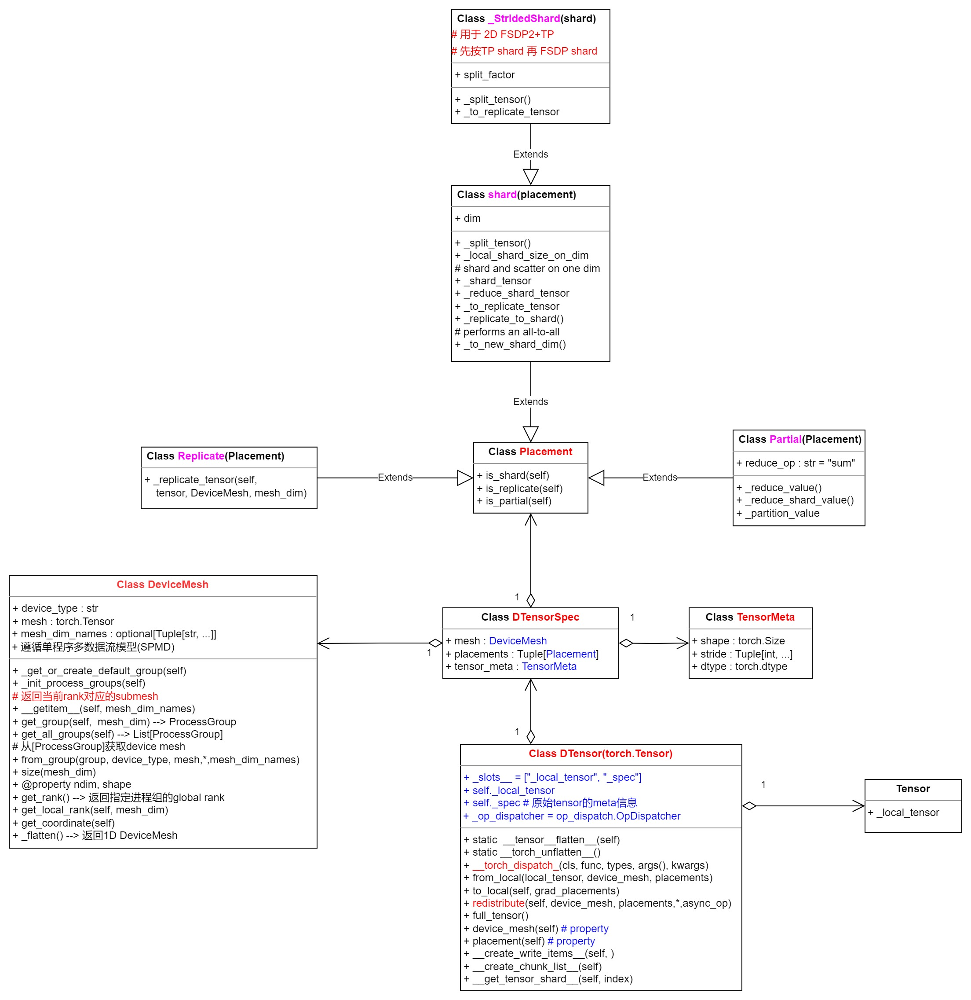

# 1. 设备抽象 : DeviceMesh 和 _MeshEnv


## 1.1 DeviceMesh

`DeviceMesh` 表示一个设备网格，其中设备的布局可以用一个 **n 维数组** 表示，该数组的每个值代表默认进程组中各进程（rank）的**全局 ID**。

`DeviceMesh` 可用于描述集群中设备的布局，并作为集群内设备列表之间通信的代理。

`DeviceMesh` 可以用作上下文管理器。

.. 注意：
    `DeviceMesh` 遵循 **SPMD（单程序多数据）** 编程模型，这意味着相同的 PyTorch Python 程序会在集群中的所有进程/rank 上运行。因此，用户需要确保所有 rank 上的 `mesh` 数组（描述设备布局的数组）必须一致。如果 `mesh` 不一致，将导致程序静默挂起。

参数：
- `device_type` (str)：网格的设备类型。目前支持："cpu"、"cuda/cuda-like"（即支持 CUDA 或类似 CUDA 的设备）。
- `mesh` (ndarray)：一个多维数组或整数张量，用于描述设备的布局，其中 ID 是默认进程组的全局 ID。

返回值：
- `DeviceMesh`：一个表示设备布局的 :class:`DeviceMesh` 对象。

&nbsp;&nbsp;&nbsp;&nbsp;&nbsp;&nbsp;&nbsp;&nbsp;以下程序以 **SPMD 方式** 在每个进程/rank 上运行。在此示例中，我们有 2 台主机，每台主机有 4 个 GPU。对网格的第一维进行归约操作时，将在列方向上进行归约（如 (0, 4), ..., (3, 7)）；对网格的第二维进行归约操作时，将在行方向上进行归约（如 (0, 1, 2, 3) 和 (4, 5, 6, 7)）。

example: <br>

```python
>>> # xdoctest: +SKIP("no rank")
>>> from torch.distributed.device_mesh import DeviceMesh
>>>
>>> # 初始化设备网格为 (2, 4)，表示跨主机（第 0 维）和主机内（第 1 维）的拓扑结构
>>> mesh = DeviceMesh(device_type="cuda", mesh=[[0, 1, 2, 3],[4, 5, 6, 7]])
```

> 值得注意的是：在DeviceMesh 初始化时还会创建各维度对应的sub_process_group，用于后续通信。<br>
> DeviceMesh 利用 _MeshEnv 提供的功能来实现设备**网格(Mesh)的创建、管理和通信优化**。<br>
> Mesh 的flatten 操作，将设备网格中的设备映射到一维空间中，方便PP stage 划分， 更容易控制通讯范围， 方便调试和可视化。

## 1.2 _MeshEnv



&nbsp;&nbsp;&nbsp;&nbsp;&nbsp;&nbsp;&nbsp;&nbsp;_MeshEnv 是 DeviceMesh 的核心管理类，负责维护设备网格的上下文、子网格映射、通信组配置和扁平化网格管理。
它通过**线程局部变量确保多线程环境下的设备网格状态隔离**。

**_MeshEnv 的作用**

**1. 线程局部上下文管理**

- `_MeshEnv` 继承自 `threading.local`，这意味着每个线程都拥有独立的实例变量副本。
- 通过这种方式，`_MeshEnv` 能够为每个线程维护独立的 **设备网格（DeviceMesh）状态**，从而避免线程间的资源竞争。

**2. 设备网格栈（mesh_stack）**

- 用于记录当前线程中 **激活的设备网格（DeviceMesh）上下文**。
- 类似于 Python 的上下文管理器（`with` 语句），`mesh_stack` 通过 `enter()` 和 `exit()` 方法管理设备网格的 **进入和退出**，确保设备网格的正确切换和资源释放。

**3. 设备网格映射（child_to_root_mapping）**

- 记录 **子网格（submesh）与其根网格（root mesh）之间的映射关系**。
- 这对于设备网格的 **嵌套管理** 非常重要，尤其是在分布式训练中需要 **动态调整设备布局** 时，可以确保子网格与根网格的正确关联。

**4. 设备网格分组选项（mesh_dim_group_options）**

- 存储每个设备维度（`dim`）的 **通信组（ProcessGroup）配置**。
- 这些配置包括 **通信后端**（如 `gloo`、`nccl`）和相关选项（如 `Options`），用于优化设备网格的 **通信性能**。

**5. 扁平化网格管理（root_to_flatten_mapping 和 flatten_name_to_root_dims）**

- 管理 **扁平化网格（flatten mesh）的创建和映射**。
- 扁平化网格用于将多个维度合并为一个维度，从而 **简化设备网格的管理和通信操作**，提高分布式计算的效率。

**6. 辅助方法**

- **`get_current_mesh()`**：获取当前线程中 **激活的设备网格**。
- **`create_sub_mesh()`**：基于当前设备网格 **创建子网格**。
- **`create_flatten_mesh()`**：将设备网格的某些维度 **扁平化**。
- **`get_root_mesh()`**：获取设备网格的 **根网格**。

## 1.3 _MeshEnv 与 DeviceMesh 的关系

**上下文管理：**

- _MeshEnv 通过 mesh_stack 维护当前线程中激活的设备网格上下文。
- DeviceMesh 使用 enter 和 exit 方法来管理设备网格的生命周期。

**子网格和根网格管理：**

- _MeshEnv 通过 child_to_root_mapping 记录子网格与其根网格之间的关系。
- DeviceMesh 在创建子网格时，会调用 _MeshEnv 的 create_sub_mesh() 方法，并**记录其根网格(root mesh)**。

**扁平化网格支持：**

- _MeshEnv 提供 create_flatten_mesh() 方法，用于将设备网格的某些维度扁平化。
- DeviceMesh 调用该方法来生成扁平化网格，并通过 getitem 方法访问。

**通信组配置：**

- _MeshEnv 通过 mesh_dim_group_options 存储每个设备维度的通信组配置。
- DeviceMesh 在初始化通信组时，会从 _MeshEnv 中获取这些配置。

**全局资源管理：**

- _MeshEnv 是一个全局资源管理器，为 DeviceMesh 提供了上下文管理、资源映射和配置支持

## 1.4 注意事项
> 1. 不同rank下 mesh_shape 必须维持一致<br>
> 2. 如果process group 未找到的话，会进行初始化；<br>
> 3. mesh shape 是设备的layout;<br>
> 4. mesh_dim_names : mesh_shape 每一个维度的名称；<br>
> 5. 多维度mesh_shape 需要配置 mesh_dim_names<br>
> 6. 越里面的维度，越应该在集群中靠的近<br>
> 7. 值得注意的是：在DeviceMesh 初始化时还会创建各维度对应的sub_process_group，用于后续通信。<br>
> 8. DeviceMesh 利用 _MeshEnv 提供的功能来实现设备**网格(Mesh)的创建、管理和通信优化**。<br>
> 9. Mesh 的flatten 操作，将设备网格中的设备映射到一维空间中，方便PP stage 划分， 更容易控制通讯范围， 方便调试和可视化。

# 2 Tensor 抽象 : DTensor

## 2.1 class guilde

“DTensor”（分布式张量）是“torch.Tensor”的子类，它提供了类似单设备的抽象，用于对多设备的“torch.Tensor”进行编程。它通过 :class:`DeviceMesh`（设备网格）以及以下几种 :class:`Placement`（布局方式）来描述分布式张量的分片布局（即 DTensor 布局）：

* :class:`Shard`（分片）：张量在“DeviceMesh”维度的设备上，沿着张量的“dim”维度进行分片。
* :class:`Replicate`（复制）：张量在“DeviceMesh”维度的设备上进行复制。
* :class:`Partial`（部分）：张量在“DeviceMesh”维度的设备上**等待归约**操作。

调用 PyTorch 算子时，“DTensor”会重写 PyTorch 算子，以执行分片计算，并在必要时进行通信。在算子计算过程中，“DTensor”会根据算子自身的语义，适当地转换或传播布局方式（即 DTensor 布局），并生成新的“DTensor”输出。

为确保调用 PyTorch 算子时“DTensor”分片计算的数值正确性，“DTensor”要求算子的每个张量参数都必须是 DTensor。

.. 注意：不建议直接使用此处的张量子类构造函数来创建“DTensor”（即它无法正确处理自动求导，因此并非公共 API）。请参考 `create_dtensor`_ 部分了解如何创建“DTensor”。

## 2.2 data structure


## 2.3 核心机制

**通过DeviceMesh, local_tensor, 和 Placement 来描述一个DTensor**

### dispatch 机制:
  通过dispather 里 Python key, 拦截 PyTorch 算子的调用， 统一通过_op_dispather 处理DTensor 后来调度原始tensor。<br>

```python
    def __torch_dispatch__(cls, func, types, args=(), kwargs=None):
        return DTensor._op_dispatcher.dispatch(
            func,
            args,
            kwargs or {},
        )
```
### redistribute 机制

`redistribute` 函数用于执行必要的集体通信操作，将当前的 DTensor 从其当前的分片布局（placements）重新分配到新的分片布局，或者从当前的设备网格（DeviceMesh）迁移到新的设备网格。例如，我们可以通过为设备网格的每个维度指定 `Replicate` 分片布局，将一个分片（Sharded）的 DTensor 转换为复制（Replicated）的 DTensor。

当在一个设备网格维度上从当前分片布局重新分配到新的分片布局时，我们将执行以下操作，包括通信集体操作或本地操作：

1. 从 `Shard(dim)`（按某维度分片）转换为 `Replicate()`（复制）：使用 `all_gather`（全局收集）操作。
2. 从 `Shard(src_dim)`（按源维度分片）转换为 `Shard(dst_dim)`（按目标维度分片）：使用 `all_to_all`（全局到全局交换）操作。
3. 从 `Replicate()`（复制）转换为 `Shard(dim)`（按某维度分片）：执行本地分块操作（即 `torch.chunk`）。
4. 从 `Partial()`（部分）转换为 `Replicate()`（复制）：使用 `all_reduce`（全局归约）操作。
5. 从 `Partial()`（部分）转换为 `Shard(dim)`（按某维度分片）：使用 `reduce_scatter`（归约分散）操作。

`redistribute` 能够正确计算出针对在 1-D 或 N-D 设备网格上创建的 DTensor 所必需的重新分配步骤。

参数：
- `device_mesh` (:class:`DeviceMesh`, 可选)：用于放置 DTensor 的设备网格。如果未指定，则使用当前 DTensor 的设备网格。默认值：None。
- `placements` (List[:class:`Placement`], 可选)：描述如何将 DTensor 放置到设备网格上的新分片布局，其元素数量必须与 `device_mesh.ndim` 相同。默认值：在所有网格维度上复制。

关键字参数：
- `async_op` (bool, 可选)：是否异步执行 DTensor 重新分配操作。默认值：False。

返回值：
- 一个 :class:`DTensor` 对象。

.. 注意：`redistribute` 是可微分的，这意味着用户无需担心重新分配操作的反向传播公式。

.. 注意：目前 `redistribute` 仅支持在同一个设备网格上重新分配 DTensor。如果需要将 DTensor 重新分配到不同的设备网格，请提交问题反馈。

```python

    def redistribute(
        self,
        device_mesh: Optional[DeviceMesh] = None,
        placements: Optional[Sequence[Placement]] = None,
        *,
        async_op: bool = False,
    ) -> "DTensor":
        # NOTE: This redistribute API currently only supports out
        # of place redistribution, i.e. it always create a new
        # DTensor object and leave the original one unchanged.

        # if device_mesh is not specified, use the current device_mesh
        device_mesh = device_mesh or self.device_mesh
        # raise error if new placements not specified
        if placements is None:
            raise RuntimeError("placements is needed for redistribute!")

        placements = list(placements)
        for i, placement in enumerate(placements):
            if placement.is_partial():
                raise RuntimeError(
                    "Can not redistribute to Partial, redistributing to Partial is for internal use only!"
                )
            elif isinstance(placement, Shard) and placement.dim < 0:
                # normalize shard dim to be positive
                placements[i] = Shard(placement.dim + self.ndim)
        placements = tuple(placements)

        # pyre-fixme[16]: `Redistribute` has no attribute `apply`.
        return Redistribute.apply(self, device_mesh, placements, async_op)
```

```python
class Redistribute(torch.autograd.Function):
    @staticmethod
    def forward(  # type: ignore[override]
        # pyre-fixme[2]: Parameter must be annotated.
        ctx,
        input: "dtensor.DTensor",
        device_mesh: DeviceMesh,
        placements: Tuple[Placement, ...],
        async_op: bool = False,
    ):
        current_spec = input._spec
        ctx.current_spec = current_spec
        ctx.async_op = async_op

        if current_spec.placements != placements:
            target_spec = DTensorSpec(
                device_mesh, placements, tensor_meta=input._spec.tensor_meta
            )

            local_tensor = input._local_tensor
            output = redistribute_local_tensor(
                local_tensor, current_spec, target_spec, async_op=async_op
            )
        else:
            # use the same local tensor if placements are the same.
            output = input._local_tensor
            target_spec = current_spec

        return dtensor.DTensor(
            output,
            target_spec,
            requires_grad=input.requires_grad,
        )

    @staticmethod
    def backward(ctx, grad_output: "dtensor.DTensor"):  # type: ignore[override]
        previous_spec = ctx.current_spec
        current_spec = grad_output._spec
        async_op = ctx.async_op

        local_tensor = grad_output._local_tensor
        output = redistribute_local_tensor(
            local_tensor,
            current_spec,
            previous_spec,
            async_op=async_op,
            is_backward=True,
        )
        # normalize the target placement to replicate if it is partial
        normalized_placements: List[Placement] = []
        for previous_placement in previous_spec.placements:
            if previous_placement.is_partial():
                # keep target placement to replicate instead of partial in this case
                normalized_placements.append(Replicate())
            else:
                normalized_placements.append(previous_placement)

        spec = DTensorSpec(
            previous_spec.device_mesh,
            tuple(normalized_placements),
            tensor_meta=TensorMeta(
                shape=grad_output.shape,
                stride=grad_output.stride(),
                dtype=grad_output.dtype,
            ),
        )
        output_dtensor = dtensor.DTensor(
            output,
            spec,
            requires_grad=grad_output.requires_grad,
        )

        return (
            output_dtensor,
            None,
            None,
            None,
        )
```

# 参考资料

[pytorch DTensor](https://github.com/pytorch/pytorch/blob/main/torch/distributed/tensor/README.md)