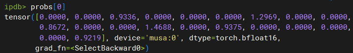
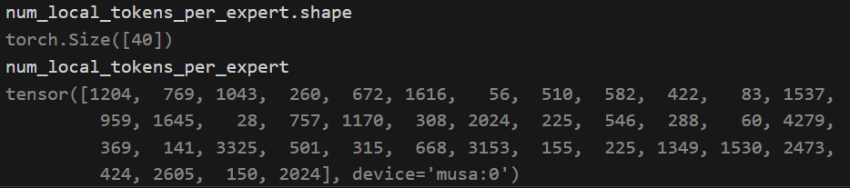
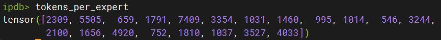

# 1. 执行流程
- hidden state : [4096, 2, 5120]

- 得到 probs 和 对应 routing_map : [8192, 20] --> 20 个专家

> 不同batch 里是的数据会折叠起来

```python
probs, routing_map = self.router(hidden_states)
```

probs : [8192, 20] --> 一行有6个value 不为0



routing_map : [8192, 20] --> 一行有6个True



- tokens_per_expert = self.preprocess(self.routing_map)

得到 每个专家的token 个数:



- top token 拉平
```python
    permutated_local_input_tokens, self.reversed_local_input_permutation_mapping = permute(
        hidden_states,
        routing_map,
        num_out_tokens=self.num_out_tokens,
        fused=self.config.moe_permute_fusion,
        drop_and_pad=self.drop_and_pad,
    )
```

- permutated_local_input_tokens : [49152, 5120]
- self.reversed_local_input_permutation_mapping : [20, 8192]

- alltoall

```python
    global_input_tokens = all_to_all(
        self.ep_group, permutated_local_input_tokens, self.output_splits, self.input_splits
    )
```


