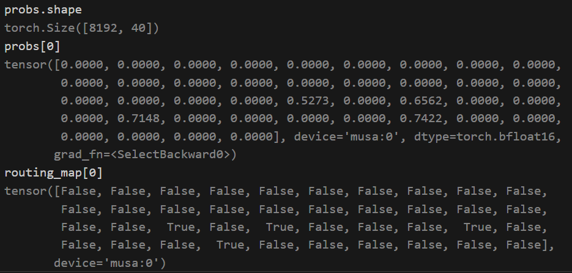
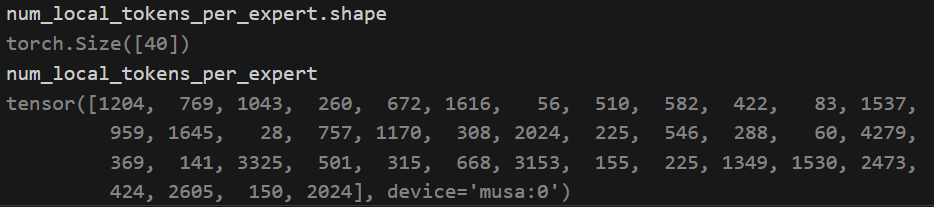
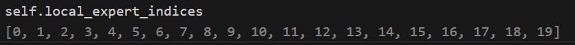
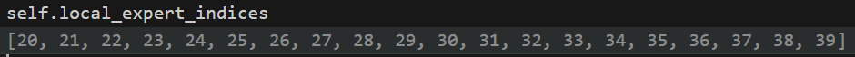
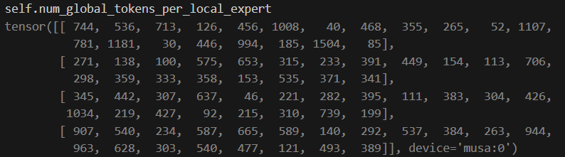
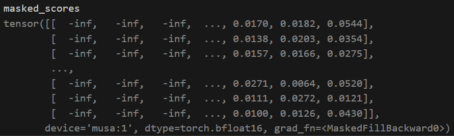

# 1. 主要过程

- **MOE configuration example**
```shell
NODE=1
GPUS=2
EP_Size=2
--num-experts 40
--moe-router-num-groups $EP_SIZE
--moe-router-group-topk 1
--moe-router-topk 6
```

## 1.1 初始状态

- **初始状态** <br>

```python
# router 得到 probs 和routing_map
probs, routing_map = self.router(hidden_states)
```

```shell
hidden_states [4096, 2, 5120] # seq_len * batch_size * hidden_size

- probs : [8192, 40] # merge seq_len and batch_size

- routing_map : [8192, 40] --> 20 个专家

```



> 选择对应专家的得分，对应位置设置为True;
> 注意：**所选择的专家都在一个group 内**

```python
# hidden_states 维度折叠
# [seq_len, batch_size, hidden_size] --> [seq_len * batch_size, hidden_size]
hidden_states = hidden_states.view(-1, self.hidden_shape[-1])
```

## 1.2 preprocess meta 信息交换

- tokens_per_expert = self.preprocess(self.routing_map)

**step1 : 本rank input 上每个专家出来的tokes num** <br>
```python
# 得到本地(local)每个专家的出来的token个数
num_local_tokens_per_expert = routing_map.sum(dim=0).long() # [40]
```


**step2 : local proc input 分发的总tokens个数** <br>

```python
# rank0: 42679; rank1: 43594  ≈ 8192 * 6
self.num_out_tokens = num_local_tokens_per_expert.sum().to(
    torch.device("cpu"), non_blocking=True
)
```

**step3 : input split 的计算** <br>
- 计算本rank 发送给各ep rank 的tokens num

```python
# [2]
# rank0: [24580, 18099] rank1: [19014, 24580]
self.input_splits = (
    num_local_tokens_per_expert.reshape(self.ep_size, self.num_local_experts) # [2, 20]
    .sum(axis=1)
    .to(torch.device("cpu"), non_blocking=True)
    .numpy()
)
```

**step4: num_local_tokens_per_expert 进行allgather** <br>

- allgather 汇总每个进程inputs 的 dispatch 个数信息

```python
# [tp_size, ep_size, num_experts] --> [1, 2, 40]
num_global_tokens_per_expert = (
    gather_from_sequence_parallel_region(
        num_local_tokens_per_expert, group=self.tp_ep_group
    )
    .reshape(self.ep_size, self.tp_size, self.num_experts)
    .transpose(0, 1)
```

**step5: 从汇总信息中抽取本进程要处理的tokens** <br>

```python
 # [tp_size, ep_size, num_experts] -> [tp_size, ep_size, num_local_experts]
num_global_tokens_per_local_expert = num_global_tokens_per_expert[
    :, :, self.local_expert_indices[0] : self.local_expert_indices[-1] + 1
].contiguous()
```

- rank0 index: <br>


- rank1 index: <br>


**step6 : 本地处理的其他rank上的tokens个数**

```python
# [tp_size, ep_size, num_local_experts] -> [tp_size, ep_size]
# rank0: [[24580, 19014]] rank1: [[18099, 24580]]
num_global_tokens_per_rank = num_global_tokens_per_local_expert.sum(axis=2)
```

**step7 : 本地处理的tokens 总和**

```python
# [tp_size, ep_size] -> [tp_size]
# self.output_splits_tp 用于统计TP 时(SP) output 的总seq_len 长度
# rank0: [43594] rank1: [42679] 本rank 上总seq len 长度
self.output_splits_tp = (
    num_global_tokens_per_rank.sum(axis=1)
    .to(torch.device("cpu"), non_blocking=True)
    .numpy()
)
```

**step8 : 本地每个专家处理的tokens 个数**

> **preprocess 阶段最终return 的就是这个值**

```python
# [tp_size, ep_size, num_local_experts] -> [num_local_experts]
num_tokens_per_local_expert = num_global_tokens_per_local_expert.sum(dim=(0, 1)).to(
    torch.device("cpu"), non_blocking=True
)
```

**step9: 拉平本地TP 和 EP** <br>
```python
# [tp_size * ep_size, num_local_experts]. Represents the number of tokens sent
# to each local expert by all ranks.
# # [2, 20]
self.num_global_tokens_per_local_expert = num_global_tokens_per_local_expert.view(
    -1, self.num_local_experts
)
```

## 1.3 all-to-all dispatch

- **step1 : 将hidden_states 进行 permute** <br>

```python
# 处理的所有进程的tokens 统计: rank0: [[24580, 19014]] rank1: [[18099, 24580]]
# permutated_local_input_tokens : rank0:[42679, 5120]  rank1: [43594, 5120];
# 42679 = 24580 + 18099
# self.reversed_local_input_permutation_mapping: rank0 [40, 8192], rank1: [40, 8192]
permutated_local_input_tokens, self.reversed_local_input_permutation_mapping = permute(
    hidden_states, # [8192, 5120]
    routing_map,   # [8192, 40]
    num_out_tokens=self.num_out_tokens,   # []
    fused=self.config.moe_permute_fusion, # True
    drop_and_pad=self.drop_and_pad,       # False
)
```

- **step2: 前反向permute bind** <br>
```python
class _moe_permute_mask_map(torch.autograd.Function):
    """functional Permute with mask router map"""

    @staticmethod
    def forward(
        ctx,
        inp: torch.Tensor,
        routing_map: torch.Tensor,
        num_out_tokens: int,
        probs: torch.Tensor,
    ) -> Tuple[torch.Tensor, torch.Tensor]:
        # pylint: disable=missing-function-docstring
        if not inp.numel():
            ctx.probs = probs
            return inp, torch.tensor([], device=inp.device), torch.tensor([], device=inp.device)

        assert inp.is_cuda, "TransformerEngine needs CUDA."
        assert routing_map.is_cuda, "TransformerEngine needs CUDA."
        if probs is not None:
            assert probs.is_cuda, "TransformerEngine needs CUDA."

        assert inp.size(0) == routing_map.size(0), "Permute not possible"
        num_tokens, hidden_size = inp.size()
        num_experts = routing_map.size(1)
        assert (
            num_out_tokens is not None
        ), "num_out_tokens must be provided to the fused permute function."

        row_id_map, row_id_map_non_trans = triton_permutation.make_row_id_map(routing_map, num_tokens, num_experts)

        fp8 = isinstance(inp, Float8Tensor)
        if fp8:
            fp8_dtype = inp._fp8_dtype
            fp8_scale_inv = inp._scale_inv
            fake_dtype = inp.dtype
            inp = inp._data

        if not fp8 and num_experts % 4 == 0:
            dtype = TE_DType[inp.dtype]
            if probs is None:
                probs = torch.empty(0)
            output, permuted_probs = tex.moe_permute_mask(
                dtype,
                inp,
                row_id_map_non_trans,
                probs,
                num_tokens,
                num_experts,
                num_out_tokens,
                hidden_size,
            )
        else:
            output, permuted_probs = triton_permutation.permute_with_mask_map(
                inp,
                row_id_map,
                probs,
                num_tokens,
                num_experts,
                num_out_tokens,
                hidden_size,
            )
        if fp8:
            output = Float8Tensor(
                data=output,
                fp8_dtype=fp8_dtype,
                fp8_scale_inv=fp8_scale_inv,
                shape=output.shape,
                dtype=fake_dtype,
            )

        ctx.save_for_backward(row_id_map)
        ctx.num_experts = num_experts
        ctx.num_tokens = num_tokens
        ctx.hidden_size = hidden_size
        return output, row_id_map, permuted_probs

    @staticmethod
    def backward(
        ctx,
        permuted_act_grad: torch.Tensor,
        _,
        permuted_probs_grad: torch.Tensor,
    ) -> Tuple[torch.Tensor, ...]:
        # pylint: disable=missing-function-docstring
        if not permuted_act_grad.numel():
            return permuted_act_grad, None, None, ctx.probs

        act_grad = None
        probs_grad = None
        if ctx.needs_input_grad[0]:
            (row_id_map,) = ctx.saved_tensors
            fp8 = isinstance(permuted_act_grad, Float8Tensor)
            if fp8:
                fp8_dtype = permuted_act_grad._fp8_dtype
                fp8_scale_inv = permuted_act_grad._scale_inv
                fake_dtype = permuted_act_grad.dtype
                permuted_act_grad = permuted_act_grad._data
            else:
                fp8_dtype = None

            if not fp8 and ctx.num_experts % 4 == 0:
                dtype = TE_DType[permuted_act_grad.dtype]
                if permuted_probs_grad is None:
                    permuted_probs_grad = torch.empty(0)
                act_grad, probs_grad = tex.moe_unpermute_mask(
                    dtype,
                    permuted_act_grad,
                    row_id_map,
                    torch.empty(0),
                    permuted_probs_grad,
                    ctx.num_tokens,
                    ctx.num_experts,
                    ctx.hidden_size,
                )
            else:
                act_grad, probs_grad = triton_permutation.unpermute_with_mask_map(
                    permuted_act_grad,
                    row_id_map,
                    None,
                    permuted_probs_grad,
                    ctx.num_tokens,
                    ctx.num_experts,
                    ctx.hidden_size,
                    fp8_dtype,
                )
            if fp8:
                act_grad = Float8Tensor(
                    data=act_grad,
                    fp8_dtype=fp8_dtype,
                    fp8_scale_inv=fp8_scale_inv * ctx.num_experts,
                    shape=act_grad.shape,
                    dtype=fake_dtype,
                )
        if not ctx.needs_input_grad[3]:
            probs_grad = None
        return act_grad, None, None, probs_grad
```

- **step3: all_to_all 通讯** <br>

```python
    global_input_tokens = all_to_all(
        self.ep_group, permutated_local_input_tokens, self.output_splits, self.input_splits
    )
```

- **step4: 后处理及return** <br>

将每个专家处理的tokens拼接起来. <br>

```python
    hidden_states = sort_chunks_by_idxs(
        hidden_states,
        self.num_global_tokens_per_local_expert.T.ravel(),
        self.restore_output_by_local_experts,
        fused=self.config.moe_permute_fusion,
    )

    # global_input_tokens 本地专家处理的总tokens, 并排号序
    # glocal_expert_probs 为 preprocess 得到的本地各专家处理的tokens个数
    global_input_tokens = sort_chunks_by_idxs(
        global_input_tokens,
        self.num_global_tokens_per_local_expert.ravel(),
        self.sort_input_by_local_experts,
        fused=self.config.moe_permute_fusion,
    )
    return global_input_tokens, global_input_probs
```

## 1.4 all-to-all combine

-**Represents the number of tokens sent to each local expert by all ranks.** <br>



hidden_states 是按照每个专家搜集多个rank来排序的，因此，这里先将hidden_states 按照rank 重新进行排序。

**step1: hidden_states 按照rank 排序**
```python
def sort_chunks_by_idxs(
    input: torch.Tensor, split_sizes: torch.Tensor, sorted_idxs: torch.Tensor, fused: bool = False
):
    """Split and sort the input tensor based on the split_sizes and sorted indices."""
    # TODO(yehua.zhang) optimize the sort chunk kernel
    if False:#fused:
        if not HAVE_TE or fused_sort_chunks_by_index is None:
            raise ValueError(
                "fused_sort_chunks_by_index is not available. Please install TE >= 2.1.0."
            )
        return fused_sort_chunks_by_index(input, split_sizes, sorted_idxs)

    input = torch.split(input, split_sizes.tolist(), dim=0) # [4, 20].T = [20, 4] --> [80] 接收到的每个进程传过来的每个专家上的tokens
    output = torch.cat([input[i] for i in sorted_idxs.tolist()], dim=0) # [35052, 5120]
    return output
```

**step2: 正常进行all-to-all**<br>

> 注意: input_splits 和 output_splits 要交换下位置

```python
# Perform expert parallel AlltoAll communication
# hidden_states: [SEQL, H] -> [SEQL, H/TP]
permutated_local_input_tokens = all_to_all(
    self.ep_group, hidden_states, self.input_splits, self.output_splits
)
```

**step3: unpermute 并且恢复到原来的形状**

```python
    # Unpermutation 1: AlltoAll output to output
    output = unpermute(
        permutated_local_input_tokens,
        self.reversed_local_input_permutation_mapping,
        restore_shape=self.hidden_shape_before_permute,
        probs=self.probs,
        routing_map=self.routing_map,
        fused=self.config.moe_permute_fusion,
        drop_and_pad=self.drop_and_pad,
    )

    # Reshape the output tensor
    output = output.view(self.hidden_shape)

    # Add shared experts output
    if self.shared_experts is not None:
        shared_expert_output = self.shared_experts.get_output()
        output += shared_expert_output
    return output, None
```

# 2. backward 时如何处理呢？

all_to_all 的 前向和反向需要bind.(*/Megatron-LM/megatron/core/tensor_parallel/mappings.py)

```python
class _AllToAll(torch.autograd.Function):
    @staticmethod
    def forward(ctx, group, input, output_split_sizes, input_split_sizes):
        """Forward function."""
        ctx.group = group
        ctx.output_split_sizes = output_split_sizes
        ctx.input_split_sizes = input_split_sizes

        world_size = torch.distributed.get_world_size(group=group)
        # Bypass the function if we are using only 1 GPU.
        if world_size == 1:
            return input

        input = input.contiguous()
        if output_split_sizes is None:
            # Equal split (all2all)
            output = torch.empty_like(input)
        else:
            # Unequal split (all2all-v)
            output = input.new_empty(
                size=[sum(output_split_sizes)] + list(input.size()[1:]),
                dtype=input.dtype,
                device=torch.cuda.current_device(),
            )
        # print(f'output_split_sizes is {output_split_sizes}')
        # print(f'input_split_sizes is {input_split_sizes}')
        # print(f'output is {output.shape}')
        # print(f'input is {input.shape}')
        torch.distributed.all_to_all_single(
            output,
            input,
            output_split_sizes=output_split_sizes,
            input_split_sizes=input_split_sizes,
            group=group,
        )
        return output

    @staticmethod
    def backward(ctx, *grad_output):
        """Backward function."""
        return (
            None,
            _AllToAll.apply(ctx.group, *grad_output, ctx.input_split_sizes, ctx.output_split_sizes),
            None,
            None,
        )
```

# 3 moe_router_num_groups 和 moe_router_group_topk

**先分组，分组之后选择topk 个group, 之后再从group_topk个group中选择一个topk 个专家**

> moe_router_group_topk <= moe_router_num_groups



```
def group_limited_topk(
    scores: torch.Tensor,
    topk: int,
    num_tokens: int,
    num_experts: int,
    num_groups: int,
    group_topk: int,
):
    """Perform top-k routing on a subset of expert groups.

    When using group-limited routing:
    1. Experts are divided into 'moe_router_num_groups' equal-sized groups
    2. For each token, 'moe_router_group_topk' groups are selected based on routing scores
       (specifically, the sum of top-2 expert scores within each group)
    3. From these selected groups, 'moe_router_topk' individual experts are chosen

    Two common use cases:
    - Device-limited routing: Set 'moe_router_num_groups' equal to expert parallel size (EP)
      to limit each token to experts on a subset of devices
      (See DeepSeek-V2: https://arxiv.org/pdf/2405.04434)

    - Node-limited routing: Set 'moe_router_num_groups' equal to number of nodes in EP group
      to limit each token to experts on a subset of nodes
      (See DeepSeek-V3: https://arxiv.org/pdf/2412.19437)

    Args:
        scores (torch.Tensor): Softmax scores generated by the router.
        topk (int): The number of experts to select for each token.
        num_tokens (int): The number of tokens.
        num_experts (int): The number of experts.
        num_groups (int): Number of groups for routed experts.
        group_topk (int): Number of groups selected for each token.

    Returns:
        Tuple[torch.Tensor, torch.Tensor]: Probs and indices tensor.
    """
    # Organize the experts into groups
    group_scores = scores.view(num_tokens, num_groups, -1).max(dim=-1).values #.topk(2, dim=-1)[0].sum(dim=-1)
    group_idx = torch.topk(group_scores, k=group_topk, dim=-1, sorted=False)[1]
    group_mask = torch.zeros_like(group_scores)
    group_mask.scatter_(1, group_idx, 1)

    # Mask the experts based on selection groups
    score_mask = (
        group_mask.unsqueeze(-1)
        .expand(num_tokens, num_groups, num_experts // num_groups)
        .reshape(num_tokens, -1)
    )

    masked_scores = scores.masked_fill(~score_mask.bool(), float('-inf'))
    probs, top_indices = torch.topk(masked_scores, k=topk, dim=-1)

    return probs, top_indices
```

# 4 loss 计算

都在 */Megatron-LM/megatron/core/transformer/moe/router.py 里.

```python
class TopKRouter(Router):
    """Route each token to the top-k experts."""

    def __init__(self, config: TransformerConfig) -> None:
        """Initialize the zero token dropping router.

        Args:
            config (TransformerConfig): The configuration for the transformer model.
        """
        super().__init__(config=config)
        self.topk = self.config.moe_router_topk
        self.routing_type = self.config.moe_router_load_balancing_type
        self.score_function = self.config.moe_router_score_function
        self.input_jitter = None

        self.enable_expert_bias = self.config.moe_router_enable_expert_bias
        if self.enable_expert_bias:
            self.register_buffer(
                'local_tokens_per_expert',
                torch.zeros(self.config.num_moe_experts, dtype=torch.float32),
                persistent=False,
            )
            self.register_buffer(
                'expert_bias', torch.zeros(self.config.num_moe_experts, dtype=torch.float32)
            )
        else:
            self.local_tokens_per_expert = None
            self.expert_bias = None

    def sinkhorn_load_balancing(self, logits: torch.Tensor):
        """Apply sinkhorn routing to the logits tensor.

        Args:
            logits (torch.Tensor): The logits tensor.

        Returns:
            Tuple[torch.Tensor, torch.Tensor]: A tuple containing token assignment
            probabilities and mask.
        """

        def _sinkhorn_activation(logits):
            if self.topk == 1:
                logits = torch.sigmoid(logits)
            else:  # k > 1
                logits = torch.softmax(logits, dim=-1, dtype=torch.float32).type_as(logits)
            return logits

        assert self.config.moe_aux_loss_coeff == 0, "Sinkhorn routing does not support aux loss."
        if self.training:
            with torch.no_grad():
                norm_logits = sinkhorn(
                    logits.to(dtype=torch.float32)
                )  # explicit fp32 conversion for stability
                _, indices = torch.topk(norm_logits, k=self.topk, dim=1)
            logits = _sinkhorn_activation(logits)
        else:
            logits = _sinkhorn_activation(logits)
            _, indices = torch.topk(logits, k=self.topk, dim=1)
        map = torch.zeros_like(logits).int().scatter(1, indices, 1).bool()
        scores = logits * map
        return scores, map

    def aux_loss_load_balancing(self, logits: torch.Tensor):
        """Apply loss-based load balancing to the logits tensor.

        Args:
            logits (torch.Tensor): the logits tensor after gating, shape: [num_tokens, num_experts].

        Returns:
            probs (torch.Tensor): The probabilities of token to experts assignment.
            routing_map (torch.Tensor): The mask of token to experts assignment.
        """
        probs, routing_map, tokens_per_expert = topk_softmax_with_capacity(
            logits,
            self.topk,
            capacity_factor=self.config.moe_expert_capacity_factor,
            pad_to_capacity=self.config.moe_pad_expert_input_to_capacity,
            drop_policy=self.config.moe_token_drop_policy,
            use_pre_softmax=self.config.moe_router_pre_softmax,
            num_groups=self.config.moe_router_num_groups,
            group_topk=self.config.moe_router_group_topk,
            scaling_factor=self.config.moe_router_topk_scaling_factor,
            deterministic_mode=self.config.deterministic_mode,
            score_function=self.score_function,
            expert_bias=self.expert_bias,
        )

        if self.training:
            # Apply load balancing loss
            scores = torch.softmax(logits, dim=-1, dtype=torch.float32)
            aux_loss_func = partial(
                switch_load_balancing_loss_func,
                probs=scores,
                tokens_per_expert=tokens_per_expert,
                topk=self.topk,
            )
            probs = self.apply_load_balancing_loss(
                activation=probs, load_balancing_loss_func=aux_loss_func
            )
        return probs, routing_map

    def seq_aux_loss_load_balancing(self, logits: torch.Tensor, bsz: int, seq_length: int):
        """Apply loss-based load balancing to the logits tensor."""

        probs, routing_map, tokens_per_expert = topk_softmax_with_capacity(
            logits,
            self.topk,
            capacity_factor=self.config.moe_expert_capacity_factor,
            pad_to_capacity=self.config.moe_pad_expert_input_to_capacity,
            drop_policy=self.config.moe_token_drop_policy,
            use_pre_softmax=self.config.moe_router_pre_softmax,
            num_groups=self.config.moe_router_num_groups,
            group_topk=self.config.moe_router_group_topk,
            scaling_factor=self.config.moe_router_topk_scaling_factor,
            deterministic_mode=self.config.deterministic_mode,
            score_function=self.score_function,
            expert_bias=self.expert_bias,
        )

        if self.training:
            scores = torch.softmax(logits, dim=-1, dtype=torch.float32)
            aux_loss_func = partial(
                sequence_load_balancing_loss_func,
                probs=scores,
                routing_map=routing_map,
                batch_size=bsz,
                seq_length=seq_length,
                topk=self.topk,
            )
            probs = self.apply_load_balancing_loss(
                activation=probs, load_balancing_loss_func=aux_loss_func
            )

        return probs, routing_map

    def apply_load_balancing_loss(
        self, activation: torch.Tensor, load_balancing_loss_func: Callable
    ):
        """Calculate auxiliary loss, attach gradient function to activation and add to logging."""
        moe_aux_loss_coeff = self.config.moe_aux_loss_coeff
        if moe_aux_loss_coeff == 0:
            return activation
        sequence_partition_group = None
        if self.config.moe_token_dispatcher_type == "alltoall_seq":
            sequence_partition_group = parallel_state.get_context_parallel_group()
            moe_aux_loss_coeff /= parallel_state.get_tensor_model_parallel_world_size()
        elif parallel_state.get_tensor_and_context_parallel_world_size() > 1:
            sequence_partition_group = parallel_state.get_tensor_and_context_parallel_group()

        aux_loss = load_balancing_loss_func(
            moe_aux_loss_coeff=moe_aux_loss_coeff, sequence_partition_group=sequence_partition_group
        )
        save_to_aux_losses_tracker(
            "load_balancing_loss",
            aux_loss / moe_aux_loss_coeff,
            self.layer_number,
            self.config.num_layers,
            reduce_group=sequence_partition_group,
        )
        activation = MoEAuxLossAutoScaler.apply(activation, aux_loss)
        return activation

    def apply_z_loss(self, logits):
        """Encourages the router's logits to remain small to enhance stability.
        Please refer to the ST-MoE paper (https://arxiv.org/pdf/2202.08906.pdf) for details.

        Args:
            logits (torch.Tensor): The logits of the router.

        Returns:
            torch.Tensor: The logits after applying the z-loss.
        """
        if self.config.moe_z_loss_coeff is not None and self.training:
            moe_z_loss_coeff = (
                self.config.moe_z_loss_coeff
                / parallel_state.get_tensor_and_context_parallel_world_size()
            )
            z_loss = z_loss_func(logits, moe_z_loss_coeff)
            logits = MoEAuxLossAutoScaler.apply(logits, z_loss)
            save_to_aux_losses_tracker(
                "z_loss", z_loss / moe_z_loss_coeff, self.layer_number, self.config.num_layers
            )
        return logits

    def apply_input_jitter(self, input: torch.Tensor):
        """Add noise to the input tensor.
        Refer to https://arxiv.org/abs/2101.03961.

        Args:
            input (Tensor): Input tensor.

        Returns:
            Tensor: Jittered input.
        """
        if self.config.moe_input_jitter_eps is not None:
            eps = self.config.moe_input_jitter_eps
            if self.input_jitter is None:
                self.input_jitter = torch.distributions.uniform.Uniform(
                    torch.tensor(1.0 - eps, device=input.device),
                    torch.tensor(1.0 + eps, device=input.device),
                ).rsample
            return input * self.input_jitter(input.shape)
        else:
            return input

    def routing(self, logits: torch.Tensor):
        """Top-k routing function

        Args:
            logits (torch.Tensor): Logits tensor after gating.

        Returns:
            probs (torch.Tensor): The probabilities of token to experts assignment.
            routing_map (torch.Tensor): The mapping of token to experts assignment,
                with shape [num_tokens, num_experts].
        """
        seq_length, bsz = logits.shape[:2] # 4096, 2
        logits = logits.view(-1, self.config.num_moe_experts) # [8192, 40]

        # Apply Z-Loss
        logits = self.apply_z_loss(logits)

        if self.config.moe_token_dispatcher_type == "alltoall_seq":
            # Gather the logits from the TP region
            logits = gather_from_sequence_parallel_region(logits)

        if self.routing_type == "sinkhorn":
            scores, routing_map = self.sinkhorn_load_balancing(logits)
        elif self.routing_type == "aux_loss":
            scores, routing_map = self.aux_loss_load_balancing(logits)
        elif self.routing_type == "seq_aux_loss":
            scores, routing_map = self.seq_aux_loss_load_balancing(logits, bsz, seq_length)
        elif self.routing_type == "none":
            # A naive top-k routing without load balancing
            scores, routing_map, _ = topk_softmax_with_capacity(
                logits,
                self.topk,
                capacity_factor=self.config.moe_expert_capacity_factor,
                pad_to_capacity=self.config.moe_pad_expert_input_to_capacity,
                drop_policy=self.config.moe_token_drop_policy,
                use_pre_softmax=self.config.moe_router_pre_softmax,
                num_groups=self.config.moe_router_num_groups,
                group_topk=self.config.moe_router_group_topk,
                scaling_factor=self.config.moe_router_topk_scaling_factor,
                deterministic_mode=self.config.deterministic_mode,
                score_function=self.score_function,
                expert_bias=self.expert_bias,
            )
        else:
            raise ValueError(f"Unsupported MoE routing type: {self.routing_type}")
        # Prevent extra local tokens accumulation on evaluation or activation recomputation
        if self.enable_expert_bias and torch.is_grad_enabled():
            with torch.no_grad():
                self.local_tokens_per_expert += routing_map.sum(dim=0)

        return scores, routing_map

    def forward(self, input: torch.Tensor):
        """
        Forward pass of the router.

        Args:
            input (torch.Tensor): Input tensor.
        """

        # Apply input jitter
        input = self.apply_input_jitter(input)
        logits = self.gating(input)

        scores, routing_map = self.routing(logits)

        return scores, routing_map
```

# 5. MOEAlltoAllTokenDispatcher 完整代码
- */Megatron-LM/megatron/core/transformer/moe/token_dispatcher.py

```python
class MoEAlltoAllTokenDispatcher(MoETokenDispatcher):
    """
    AlltoAll-based token dispatcher.

    The workflow of AlltoAll token dispatcher is as follows:
    (1) preprocess(): calculate necessary metadata for communication and permute
    (2) token_permutation(): permute->A2A(EP)->AG(TP)->sort_chunk(if num_local_experts>1)
    (3) token_unpermutation(): sort_chunk(if num_local_experts>1)->RS(TP)->A2A(EP)->unpermute
    """

    def __init__(
        self, num_local_experts: int, local_expert_indices: List[int], config: TransformerConfig
    ) -> None:
        """
        Initialize the AlltoAll token dispatcher.

        Args:
            num_local_experts (int): Number of local experts on the current device.
            local_expert_indices (List[int]): Indices of local experts on the current device.
            config (TransformerConfig): Configuration for the transformer model.
        """
        super().__init__(config=config)
        self.num_local_experts = num_local_experts
        assert config.num_moe_experts is not None
        self.num_experts = config.num_moe_experts
        assert self.num_local_experts > 0, "Expected at least one expert"
        self.local_expert_indices = local_expert_indices
        assert (
            len(self.local_expert_indices) == self.num_local_experts
        ), "Invalid local expert indices"
        for i in range(len(self.local_expert_indices) - 1):
            assert (
                self.local_expert_indices[i] == self.local_expert_indices[i + 1] - 1
            ), "local_expert_indices must be continous"

        # [ep_size]. Represents the number of tokens sent by the current rank to other
        # EP ranks.
        self.input_splits = None
        # [ep_size]. Represents the number of tokens received by the current rank from
        # other EP ranks.
        self.output_splits = None
        # [tp_size]. Represents the number of tokens received by the current rank from
        # other TP ranks.
        self.output_splits_tp = None
        self.permute_idx_device = torch.device("cuda") if self.config.moe_permute_fusion else None
        input_chunk_idxs = torch.arange(
            self.num_experts * self.tp_size, device=self.permute_idx_device
        )
        # [num_local_experts, tp_size * ep_size]. Sort the input chunks by local experts.
        self.sort_input_by_local_experts = input_chunk_idxs.reshape(
            -1, self.num_local_experts
        ).T.ravel()
        # [tp_size * ep_size, num_local_experts]. Restore the output chunks by local experts.
        self.restore_output_by_local_experts = input_chunk_idxs.reshape(
            self.num_local_experts, -1
        ).T.ravel()

        # Token drop and padding.
        # Drop and pad the input to capacity.
        self.drop_and_pad = self.config.moe_pad_expert_input_to_capacity
        if self.drop_and_pad:
            assert self.config.moe_expert_capacity_factor is not None
            self.moe_expert_capacity_factor = self.config.moe_expert_capacity_factor
        self.capacity = None

        # A cuda stream synchronization is needed in self.token_permutation() in some cases,
        # because there are several non-blocking DtoH data transfers called in self.preprocess().
        # The synchronization happens at different points based on MoE settings as late as possible.
        # Valid sync points are "before_permutation_1", "before_ep_alltoall", "before_finish",
        # and "no_sync".
        self.cuda_sync_point = "no_sync"

        self.shared_experts = None

    def preprocess(self, routing_map: torch.Tensor) -> torch.Tensor:
        """
        Preprocess token routing map for AlltoAll communication and token permutation.

        This method computes the number of tokens assigned to each expert based on the routing_map.
        It also initializes the necessary data structures for AlltoAll communication, such as input
        and output splits, and the mapping between global tokens and local experts.

        Args:
            routing_map (torch.Tensor): The mapping of tokens to experts, with shape
                [num_tokens, num_experts].

        Returns:
            torch.Tensor: Tensor containing the number of tokens assigned to local expert.
        """
        # [num_experts], number of tokens assigned to each expert from the current rank's input.
        num_local_tokens_per_expert = routing_map.sum(dim=0).long()

        if self.drop_and_pad:
            # Drop and pad the input to capacity.
            num_tokens = routing_map.size(0) * self.config.moe_router_topk
            self.capacity = get_capacity(
                num_tokens=num_tokens,
                num_experts=self.num_experts,
                capacity_factor=self.moe_expert_capacity_factor,
            )
            self.num_out_tokens = self.capacity * self.num_experts
            # [num_local_experts], number of tokens processed by each expert.
            num_tokens_per_local_expert = torch.full(
                (self.num_local_experts,),
                self.capacity * self.tp_size * self.ep_size,
                dtype=torch.long,
            )
            # [tp_size * ep_size, num_local_experts]. Represents the number of tokens sent
            # to each local expert by all ranks.
            self.num_global_tokens_per_local_expert = torch.full(
                (self.num_experts * self.tp_size,),
                self.capacity,
                dtype=torch.long,
                device=self.permute_idx_device,
            )
            return num_tokens_per_local_expert
        elif self.config.moe_expert_capacity_factor is not None:
            # Drop tokens to capacity, no padding.
            # A synchronization is needed before the first
            # permutation to get the `num_out_tokens` CPU value.
            self.num_out_tokens = num_local_tokens_per_expert.sum().to(
                torch.device("cpu"), non_blocking=True
            )
            self.cuda_sync_point = "before_permutation_1"
        else:
            # Dropless
            self.num_out_tokens = routing_map.size(0) * self.config.moe_router_topk
            if self.ep_size > 1 or self.num_local_experts > 1:
                # Token dropless and enable ep. A synchronization is needed before expert parallel
                # AlltoAll communication to get the `input_splits` and `output_splits` CPU values.
                self.cuda_sync_point = "before_ep_alltoall"
            else:
                # Token dropless and no ep. A synchronization is needed before the returns
                # to get the `tokens_per_expert` CPU value for
                self.cuda_sync_point = "before_finish"

        if self.ep_size > 1 or self.tp_size > 1:
            # ===================================================
            # Calculate input_splits, output_splits for alltoall/allgather in variable size.
            # ===================================================
            # [ep_size]. Represents the number of tokens sent by the current rank to other
            # EP ranks.
            self.input_splits = (
                num_local_tokens_per_expert.reshape(self.ep_size, self.num_local_experts)
                .sum(axis=1)
                .to(torch.device("cpu"), non_blocking=True)
                .numpy()
            )
            # Gather the global distribution of tokens across ranks.
            # num_global_tokens_per_expert represents the number of tokens sent to each
            # expert by all ranks.
            # [tp_size, ep_size, num_experts]
            num_global_tokens_per_expert = (
                gather_from_sequence_parallel_region(
                    num_local_tokens_per_expert, group=self.tp_ep_group
                )
                .reshape(self.ep_size, self.tp_size, self.num_experts)
                .transpose(0, 1)
            )
            # [tp_size, ep_size, num_experts] -> [tp_size, ep_size, num_local_experts]
            num_global_tokens_per_local_expert = num_global_tokens_per_expert[
                :, :, self.local_expert_indices[0] : self.local_expert_indices[-1] + 1
            ].contiguous()
            # [tp_size, ep_size, num_local_experts] -> [tp_size, ep_size]
            num_global_tokens_per_rank = num_global_tokens_per_local_expert.sum(axis=2)
            # [tp_size, ep_size] -> [ep_size]
            # self.output_splits represents the number of tokens received by the current rank
            # from other EP rank.
            self.output_splits = (
                num_global_tokens_per_rank[self.tp_rank]
                .to(torch.device("cpu"), non_blocking=True)
                .numpy()
            )
            # [tp_size, ep_size] -> [tp_size]
            # self.output_splits_tp represents the number of tokens received by the current
            # rank from other TP rank.
            self.output_splits_tp = (
                num_global_tokens_per_rank.sum(axis=1)
                .to(torch.device("cpu"), non_blocking=True)
                .numpy()
            )
            # [tp_size, ep_size, num_local_experts] -> [num_local_experts]
            num_tokens_per_local_expert = num_global_tokens_per_local_expert.sum(dim=(0, 1)).to(
                torch.device("cpu"), non_blocking=True
            )
        else:
            num_global_tokens_per_local_expert = num_local_tokens_per_expert.reshape(
                self.num_experts
            )
            num_tokens_per_local_expert = num_local_tokens_per_expert.to(
                torch.device("cpu"), non_blocking=True
            )

        if self.num_local_experts > 1:
            # [tp_size * ep_size, num_local_experts]. Represents the number of tokens sent
            # to each local expert by all ranks.
            self.num_global_tokens_per_local_expert = num_global_tokens_per_local_expert.view(
                -1, self.num_local_experts
            )
            if not self.config.moe_permute_fusion:
                self.num_global_tokens_per_local_expert = num_global_tokens_per_local_expert.to(
                    torch.device("cpu"), non_blocking=False
                )

        return num_tokens_per_local_expert

    def token_permutation(
        self, hidden_states: torch.Tensor, probs: torch.Tensor, routing_map: torch.Tensor
    ) -> Tuple[torch.Tensor, torch.Tensor]:
        """
        Dispatch tokens to local experts using AlltoAll communication.

        This method performs the following steps: # 准备metadata
        1. Preprocess the routing map to get metadata for communication and permutation. # 获取metadata
        2. Permute input tokens for AlltoAll communication. # 转置input tokens
        3. Perform expert parallel AlltoAll communication.  # 实现 alltoall 通信
        4. Sort tokens by local expert (if multiple local experts exist). # 排序tokens

        Args:
            hidden_states (torch.Tensor): Input token embeddings. # [4096, 1, 5120] seq len : 4096
            probs (torch.Tensor): The probabilities of token to experts assignment. # [4096, 40] --> 每一个token 对应40个专家
            routing_map (torch.Tensor): The mapping of token to experts assignment. #

        Returns:
            Tuple[torch.Tensor, torch.Tensor]:
                - Permuted token embeddings for local experts.
                - Number of tokens per expert.
        """
        import debugpy; debugpy.breakpoint()
        # Preprocess: Get the metadata for communication, permutation and computation operations.
        self.hidden_shape = hidden_states.shape
        self.probs = probs
        self.routing_map = routing_map
        assert probs.dim() == 2, "Expected 2D tensor for probs"
        assert routing_map.dim() == 2, "Expected 2D tensor for token2expert mask"
        assert routing_map.dtype == torch.bool, "Expected bool tensor for mask"
        hidden_states = hidden_states.view(-1, self.hidden_shape[-1])
        tokens_per_expert = self.preprocess(self.routing_map)

        if self.shared_experts is not None:
            self.shared_experts.pre_forward_comm(hidden_states.view(self.hidden_shape))

        # Permutation 1: input to AlltoAll input
        self.hidden_shape_before_permute = hidden_states.shape
        if self.cuda_sync_point == "before_permutation_1":
            torch.cuda.current_stream().synchronize()
        permutated_local_input_tokens, self.reversed_local_input_permutation_mapping = permute(
            hidden_states,
            routing_map,
            num_out_tokens=self.num_out_tokens,
            fused=self.config.moe_permute_fusion,
            drop_and_pad=self.drop_and_pad,
        )

        # Perform expert parallel AlltoAll communication
        if self.cuda_sync_point == "before_ep_alltoall":
            torch.cuda.current_stream().synchronize()
        global_input_tokens = all_to_all(
            self.ep_group, permutated_local_input_tokens, self.output_splits, self.input_splits
        )
        if self.shared_experts is not None:
            self.shared_experts.linear_fc1_forward_and_act(global_input_tokens)

        if self.tp_size > 1:
            if self.output_splits_tp is None:
                output_split_sizes = None
            else:
                output_split_sizes = self.output_splits_tp.tolist()
            global_input_tokens = gather_from_sequence_parallel_region(
                global_input_tokens, group=self.tp_group, output_split_sizes=output_split_sizes
            )

        # Permutation 2: Sort tokens by local expert.
        if self.num_local_experts > 1:
            if self.drop_and_pad:
                global_input_tokens = (
                    global_input_tokens.view(
                        self.tp_size * self.ep_size,
                        self.num_local_experts,
                        self.capacity,
                        *global_input_tokens.size()[1:],
                    )
                    .transpose(0, 1)
                    .contiguous()
                    .flatten(start_dim=0, end_dim=2)
                )
            else:
                global_input_tokens = sort_chunks_by_idxs(
                    global_input_tokens,
                    self.num_global_tokens_per_local_expert.ravel(),
                    self.sort_input_by_local_experts,
                    fused=self.config.moe_permute_fusion,
                )

        if self.cuda_sync_point == "before_finish":
            torch.cuda.current_stream().synchronize()

        return global_input_tokens, tokens_per_expert

    def token_unpermutation(
        self, hidden_states: torch.Tensor, bias: Optional[torch.Tensor] = None
    ) -> Tuple[torch.Tensor, Optional[torch.Tensor]]:
        """
        Reverse the token permutation to restore the original order.

        This method performs the following steps:
        1. Unsort tokens by local expert (if multiple local experts exist).
        2. Perform expert parallel AlltoAll communication to restore the original order.
        3. Unpermute tokens to restore the original order.

        Args:
            hidden_states (torch.Tensor): Output from local experts.
            bias (torch.Tensor, optional): Bias tensor (not supported).

        Returns:
            Tuple[torch.Tensor, Optional[torch.Tensor]]:
                - Unpermuted token embeddings in the original order.
                - None (bias is not supported).
        """
        assert bias is None, "Bias is not supported in MoEAlltoAllTokenDispatcher"

        # Unpermutation 2: Unsort tokens by local expert.
        if self.num_local_experts > 1:
            if self.drop_and_pad:
                hidden_states = (
                    hidden_states.view(
                        self.num_local_experts,
                        self.tp_size * self.ep_size,
                        self.capacity,
                        *hidden_states.size()[1:],
                    )
                    .transpose(0, 1)
                    .contiguous()
                    .flatten(start_dim=0, end_dim=2)
                )
            else:
                hidden_states = sort_chunks_by_idxs(
                    hidden_states,
                    self.num_global_tokens_per_local_expert.T.ravel(),
                    self.restore_output_by_local_experts,
                    fused=self.config.moe_permute_fusion,
                )

        if self.tp_size > 1:
            if self.output_splits_tp is None:
                input_split_sizes = None
            else:
                input_split_sizes = self.output_splits_tp.tolist()
            hidden_states = reduce_scatter_to_sequence_parallel_region(
                hidden_states, group=self.tp_group, input_split_sizes=input_split_sizes
            )

        # Perform expert parallel AlltoAll communication
        # hidden_states: [SEQL, H] -> [SEQL, H/TP]
        permutated_local_input_tokens = all_to_all(
            self.ep_group, hidden_states, self.input_splits, self.output_splits
        )
        if self.shared_experts is not None:
            self.shared_experts.linear_fc2_forward(permutated_local_input_tokens)
            self.shared_experts.post_forward_comm()

        # Unpermutation 1: AlltoAll output to output
        output = unpermute(
            permutated_local_input_tokens,
            self.reversed_local_input_permutation_mapping,
            restore_shape=self.hidden_shape_before_permute,
            probs=self.probs,
            routing_map=self.routing_map,
            fused=self.config.moe_permute_fusion,
            drop_and_pad=self.drop_and_pad,
        )

        # Reshape the output tensor
        output = output.view(self.hidden_shape)

        # Add shared experts output
        if self.shared_experts is not None:
            shared_expert_output = self.shared_experts.get_output()
            output += shared_expert_output
        return output, None
```
