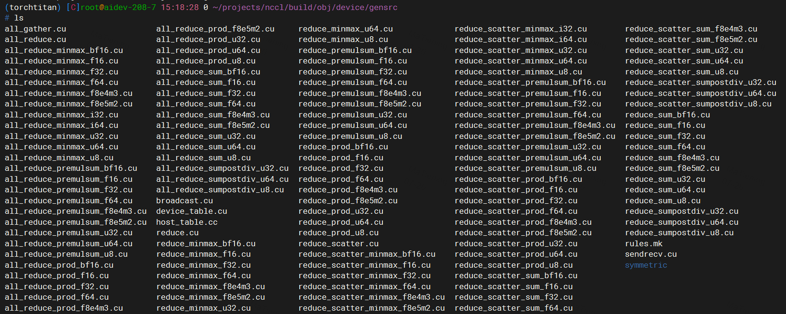

# NCCL 算子调度过程

本文梳理当前仓库中通信算子从 API 入队、选择算法、映射 kernel table、到 CUDA kernel 实际执行的路径。这里的“通信 kernel”分三类：

- 常规 device 通信 kernel：由 `src/device/generate.py` 生成表和 `__global__` wrapper。
- symmetric 通信 kernel：由 `src/device/symmetric/generate.py` 生成表和 `__global__` wrapper。
- CE collective：特殊路径，不进 kernel 指针表，`plan->isCeColl` 时直接走 `ncclLaunchCeColl()` 的 CUDA memcpy/batch mem-op。



# 1. 通信 Kernel Table 长什么样

## 1.1 常规 device kernel/function 表

### 1.1.1 算子基本排布说明

生成脚本是 `src/device/generate.py`。生成位置：

- Make 构建：`build/obj/device/gensrc/`
- CMake 构建：`${CMAKE_CURRENT_BINARY_DIR}/gensrc/`

当前 build 中主要产物：

- `build/obj/device/gensrc/host_table.cc`
- `build/obj/device/gensrc/device_table.cu`
- `build/obj/device/gensrc/<collective>[_<redop>_<type>].cu`
- `build/obj/device/gensrc/rules.mk`

生成脚本的维度：

| 维度 | 取值 |
| --- | --- |
| collective | `Broadcast`, `Reduce`, `AllGather`, `ReduceScatter`, `AllReduce`, `SendRecv` |
| redop | `Sum`, `Prod`, `MinMax`, `PreMulSum`, `SumPostDiv` |
| type | `i8`, `u8`, `i32`, `u32`, `i64`, `u64`, `f16`, `f32`, `f64`, `bf16`, `f8e4m3`, `f8e5m2` |
| proto | `LL`, `LL128`, `SIMPLE` |
| algo | `TREE`, `RING`, `COLLNET_DIRECT`, `COLLNET_CHAIN`, `NVLS`, `NVLS_TREE`, `PAT` |

不同 collective 的 algo 子集：

| collective | algo 子集 |
| --- | --- |
| `AllGather` | `RING`, `COLLNET_DIRECT`, `NVLS`, `PAT` |
| `AllReduce` | `TREE`, `RING`, `COLLNET_DIRECT`, `COLLNET_CHAIN`, `NVLS`, `NVLS_TREE` |
| `Broadcast` | `RING` |
| `Reduce` | `RING` |
| `ReduceScatter` | `RING`, `COLLNET_DIRECT`, `NVLS`, `PAT` |
| `SendRecv` | 无 algo/proto/type/redop 维度 |

- generate.py 中四层表:

| 层 | 生成期名字 | 运行期实体 | 含义 |
| --- | --- | --- | --- |
| 1 | func_rows | ncclDevFuncRowToId[row] | 所有逻辑组合的 row：coll/redop/type/algo/proto |
| 2 | primary_funcs | funcId / ncclDevFuncTable[funcId] | 规范化后的 device 精确执行函数 |
| 3 | kernel_funcs | ncclDevKernelList[] | 实际生成的物理 __global__ kernel wrapper |
| 4 | best_kernel() 映射 | ncclDevKernelForFunc[funcId] | 每个 funcId 启动哪个物理 kernel |

> func_rows：逻辑全集，当前 1996 个 row，有些 row 是 -1，表示不支持;
> primary_funcs：真正 device function 的全集，当前 670 个;
> primary_to_index：生成期辅助字典，把 primary tuple 转成 funcId;
> kernel_funcs：实际生成多少个物理 CUDA kernel，当前 39 个;
> kernel_funcs 负责 host launch, primary_funcs 负责底层真正执行.

### 1.1.2 `host_table.cc` 里的表：

下面的大小是当前 build/default `ONLY_FUNCS` 配置下的生成结果；如果用 `ONLY_FUNCS` 过滤 device 函数，表大小和映射会变化。

| 符号 | 当前大小 | 作用 |
| --- | ---: | --- |
| `ncclDevFuncIdCount` | `670` | primary device function 的数量 |
| `ncclDevFuncRowToId[]` | 逻辑 row `1996` + `-1` sentinel | 把 `(coll, redop, type, algo, proto)` 逻辑 row 映射成 primary `funcId`，不支持的组合为 `-1` |
| `ncclDevKernelCount` | `39` | 物理 `__global__` kernel 数量 |
| `ncclDevKernelList[]` | `39` + `nullptr` sentinel | 所有物理 kernel 指针列表，主要给 `ncclInitKernelsForDevice()` 设置属性/动态 shared memory |
| `ncclDevKernelForFunc[]` | `670` + `nullptr` sentinel | 调度用表：`funcId -> 最合适的物理 __global__ kernel` |
| `ncclDevKernelForFuncIsSpecialized[]` | `670` + `0` sentinel | 标记 `ncclDevKernelForFunc[funcId]` 是否正好专门为该 `funcId` 生成 |

- ncclDevKernelCount = 39 : **39 个物理 kernel**, 所有kernel 最终都会走这 39 个物理kernel;
- ncclDevKernelList[] : **39个物理 kernel 指针列表**, 是所有host-launchable kernel 的清单;
- ncclDevKernelList 初始化时被遍历，得到所有可 launch 的 kernel，查询 CUDA 属性，比如 stack size、shared memory carveout 之类。它是初始化/校准用的，不是运行时按 funcId 选 kernel 的表.

- ncclDevFuncIdCount: 670
  - 指的是 src/device/generate.py 里 primary_funcs 的数量，也就是 device 侧 ncclDevFuncTable[] 中可被 funcId 索引到的“规范化后”的 __device__ 函数数量。定义在 src/device/generate.py:194.
- ncclDevFuncRowToId[] :
  - generate.py 里 的 func_rows， 是最原始的逻辑组合表，顺序由 src/device/generate.py:158 枚举;
  - 把 逻辑row 映射成 primary `funcId`，里面最大值为 ncclDevFuncIdCount/669;
  - host 运行时 ncclDevFuncId() 必须按同样公式算 row，见 src/include/device.h:560;

- ncclDevKernelForFunc[] :
  - 一共有670 个 device function，对应 `ncclDevFuncIdCount` 个 primary device function;
  - 里面存储大量重复的 kernel，用于标识每种情况对应的最佳 **物理kernel(39个)**;

> 注意: **这39个 物理 kernel 均以 ncclDevKernel- 开始**
> 注意: **670 个 device function, 均以 mcclDevFunc- 开头**;
> 注意: symmetric path 不走 ncclDevWorkBatch，它的 task->devFuncId 存的是 ncclSymkKernelId，语义不同.

**host 表 运行时选择逻辑** <br>
```sh
host 表
host 侧最关键是两个表：

ncclDevFuncRowToId[row]          -> funcId
ncclDevKernelForFunc[funcId]     -> __global__ kernel pointer

运行时 ncclPrepareTasks() 先选出 algorithm/protocol，再算：

task->devFuncId = ncclDevFuncId(func, op, datatype, algorithm, protocol);

之后 scheduleCollTasksToPlan() 做两件事：

addWorkBatchToPlan(..., task->devFuncId, ...);
plan->kernelFn = ncclDevKernelForFunc[task->devFuncId];

也就是：

- task->devFuncId 会写进 ncclDevWorkBatch::funcId
- plan->kernelFn 是 host 最后要 cuLaunchKernel 的 __global__ 函数指针
```

**__global__ 物理kernel 生成逻辑**

- 物理kernel 的宏
```c++
// common.h
#define DEFINE_ncclDevKernel(suffix, coll, redop, ty, algo, proto, specializedFnId) \
  __global__ void ncclDevKernel_##suffix(ncclDevKernelArgs4K NCCL_GRID_CONSTANT const args4K) { \
    ncclKernelMain<specializedFnId, RunWorkBatch<coll, ty, redop<ty>, algo, proto>>(&args4K.args); \
  }
```

> 注意: 所有的物理 kernel 入口都是 ncclKernelMain

- 物理 kernel 的定义(自动生成)
```c++
// /root/projects/nccl/build/obj/device/gensrc/all_reduce_sum_f32.cu
#include "common.h"
#include "all_reduce.h"
DEFINE_ncclDevKernel(AllReduce_Sum_f32_RING_LL, ncclFuncAllReduce, FuncSum, float, NCCL_ALGO_RING, NCCL_PROTO_LL, 258)
DEFINE_ncclDevKernel(AllReduce_Sum_f32_TREE_LL, ncclFuncAllReduce, FuncSum, float, NCCL_ALGO_TREE, NCCL_PROTO_LL, 261)
```

- ncclKernelMain 根据 funcId 进行函数的分发:
  - 每个 **物理kernel** 对应一个 SpecializedFnId inline 的快速路径;
  - 否则，调用 device 侧 fallback 表 ncclDevFuncTable[funcId]
  - 虽然有 670 个 device function, 但这670 个device function 会打包成 **39 个物理 kernel**，由host 来 kernel launch;

```c++
  if (0 <= SpecializedFnId && ncclShmem.funcId == (unsigned)SpecializedFnId) {
    SpecializedRunWorkBatch().run();
  } else {
    ncclDevFuncTable[ncclShmem.funcId]();
  }
```

### 1.1.3 `device_table.cu` 里的表：

| 符号 | 当前大小 | 作用 |
| --- | ---: | --- |
| `__device__ ncclDevFuncTable[]` | `670` + `nullptr` sentinel | device 侧 fallback 表：kernel 内根据 `funcId` 调用真正的 `ncclDevFunc_*()` |

逻辑 row 的顺序必须和 `src/include/device.h` 里的 `ncclDevFuncId()` 保持一致：

```text
row 0: SendRecv
row 1..12: AllGather[algo in RING/COLLNET_DIRECT/NVLS/PAT][proto]
row 13..15: Broadcast[RING][proto]
then: AllReduce[redop][type][algo in TREE/RING/COLLNET_DIRECT/COLLNET_CHAIN/NVLS/NVLS_TREE][proto]
then: Reduce[redop][type][RING][proto]
then: ReduceScatter[redop][type][algo in RING/COLLNET_DIRECT/NVLS/PAT][proto]
```

当前 build 的 `ncclDevKernelList[]` 是 39 个物理 kernel：

```text
0  ncclDevKernel_AllGather_RING_LL
1  ncclDevKernel_AllReduce_Sum_bf16_RING_LL
2  ncclDevKernel_AllReduce_Sum_bf16_TREE_LL
3  ncclDevKernel_AllReduce_Sum_f16_RING_LL
4  ncclDevKernel_AllReduce_Sum_f16_TREE_LL
5  ncclDevKernel_AllReduce_Sum_f32_RING_LL
6  ncclDevKernel_AllReduce_Sum_f32_TREE_LL
7  ncclDevKernel_AllReduce_Sum_f64_RING_LL
8  ncclDevKernel_AllReduce_Sum_f64_TREE_LL
9  ncclDevKernel_AllReduce_Sum_f8e4m3_RING_LL
10 ncclDevKernel_AllReduce_Sum_f8e4m3_TREE_LL
11 ncclDevKernel_AllReduce_Sum_f8e5m2_RING_LL
12 ncclDevKernel_AllReduce_Sum_f8e5m2_TREE_LL
13 ncclDevKernel_AllReduce_Sum_u32_RING_LL
14 ncclDevKernel_AllReduce_Sum_u32_TREE_LL
15 ncclDevKernel_AllReduce_Sum_u64_RING_LL
16 ncclDevKernel_AllReduce_Sum_u64_TREE_LL
17 ncclDevKernel_AllReduce_Sum_u8_RING_LL
18 ncclDevKernel_AllReduce_Sum_u8_TREE_LL
19 ncclDevKernel_Broadcast_RING_LL
20 ncclDevKernel_Reduce_Sum_bf16_RING_LL
21 ncclDevKernel_Reduce_Sum_f16_RING_LL
22 ncclDevKernel_Reduce_Sum_f32_RING_LL
23 ncclDevKernel_Reduce_Sum_f64_RING_LL
24 ncclDevKernel_Reduce_Sum_f8e4m3_RING_LL
25 ncclDevKernel_Reduce_Sum_f8e5m2_RING_LL
26 ncclDevKernel_Reduce_Sum_u32_RING_LL
27 ncclDevKernel_Reduce_Sum_u64_RING_LL
28 ncclDevKernel_Reduce_Sum_u8_RING_LL
29 ncclDevKernel_ReduceScatter_Sum_bf16_RING_LL
30 ncclDevKernel_ReduceScatter_Sum_f16_RING_LL
31 ncclDevKernel_ReduceScatter_Sum_f32_RING_LL
32 ncclDevKernel_ReduceScatter_Sum_f64_RING_LL
33 ncclDevKernel_ReduceScatter_Sum_f8e4m3_RING_LL
34 ncclDevKernel_ReduceScatter_Sum_f8e5m2_RING_LL
35 ncclDevKernel_ReduceScatter_Sum_u32_RING_LL
36 ncclDevKernel_ReduceScatter_Sum_u64_RING_LL
37 ncclDevKernel_ReduceScatter_Sum_u8_RING_LL
38 ncclDevKernel_SendRecv
```

为什么逻辑函数有 670 个，但物理 kernel 只有 39 个：

- `equivalent_primary()` 会合并等价类型，例如部分 signed integer reduction 映射到 unsigned 类型实现。
- `best_kernel()` 会把很多逻辑 `(algo, proto, redop)` 映射到较少的物理 wrapper：
  - `SendRecv -> SendRecv`
  - `AllGather/Broadcast -> RING LL`
  - reduction 类 `AllReduce/Reduce/ReduceScatter -> Sum + 同 type + (TREE 或 RING) + LL`
  - 被 `ONLY_FUNCS` 过滤但 CUDA 本身支持的组合可映射到 `Nop/Generic`
- 物理 kernel 只是外层入口。进入 kernel 后，如果当前 work 的 `funcId` 和 wrapper 的 specialized id 不一致，会通过 device 侧 `ncclDevFuncTable[funcId]()` 跳到精确的 `RunWorkBatch<coll,type,redop,algo,proto>()`。

**调度例子** <br>
```sh
AllReduce Sum f32 RING LL
funcId = 258
launch ncclDevKernel_AllReduce_Sum_f32_RING_LL
SpecializedFnId = 258
=> 走 inline RunWorkBatch<AllReduce, float, Sum, RING, LL>
=> 不调用 ncclDevFuncTable[258]

另一个：

AllReduce Prod f32 RING SIMPLE
funcId = 182
launch 仍可能是 ncclDevKernel_AllReduce_Sum_f32_RING_LL
SpecializedFnId = 258
182 != 258
=> 调 ncclDevFuncTable[182]
=> ncclDevFunc_AllReduce_Prod_f32_RING_SIMPLE()
```

### 1.1.4 funcId  和 specializedFnId 两条路径解惑

1. 两个 id 分别从哪来

```sh
ncclShmem.funcId 来源链路是：

host: ncclDevFuncId(coll, redop, type, algo, proto)
  -> task->devFuncId
  -> batch->funcId
device: batch.funcId
  -> ncclShmem.funcId

关键代码：

- host 计算 task->devFuncId：src/enqueue.cc:383
- host 写 batch->funcId = devFuncId：src/enqueue.cc:140
- device 读 batch 并写 ncclShmem.funcId = batch.funcId：src/device/common.h:136, src/device/common.h:236

SpecializedFnId 来源链路是：

generate.py 选 kernel_funcs
  -> fn_id = primary_to_index[kfn]
  -> DEFINE_ncclDevKernel(..., specializedFnId)
  -> ncclKernelMain<specializedFnId, RunWorkBatch<...>>()

关键代码：

- 生成时取 fn_id = primary_to_index[kfn]：src/device/generate.py:401
- 写出 DEFINE_ncclDevKernel(..., {fn_id})：src/device/generate.py:407
- 宏展开后进入 ncclKernelMain<specializedFnId, ...>：src/device/common.h:406
```

2. 为何会不同

```sh
因为 ncclDevKernelForFunc[funcId] 会把很多 logical device func 映射到少量 physical __global__ kernel wrapper。这个选择由 best_kernel() 决定：src/device/generate.py:145。

例子：

AllReduce Prod f32 RING SIMPLE
  -> ncclShmem.funcId = 182
  -> host launch kernel = ncclDevKernel_AllReduce_Sum_f32_RING_LL
  -> 这个 wrapper 的 SpecializedFnId = 258

所以 device 里：

if (ncclShmem.funcId == SpecializedFnId)
  inline RunWorkBatch<...>().run();
else
  ncclDevFuncTable[ncclShmem.funcId]();

这里 182 != 258，所以走 ncclDevFuncTable[182]()，也就是 ncclDevFunc_AllReduce_Prod_f32_RING_SIMPLE。判断点在 src/device/common.h:387。
```

3. inline 实现在哪

```sh
inline fast path 在物理 __global__ wrapper 里：

- 生成文件例子：build/obj/device/gensrc/all_reduce_sum_f32.cu:3
- 宏定义：src/device/common.h:406
- 进入 RunWorkBatch<...>().run()：src/device/common.h:408
- collective batch 执行模板：src/device/common.h:264
- AllReduce Ring LL 的真正算法特化：src/device/all_reduce.h:755
```

4. 和 device function pointer 是不同 kernel 吗

```sh
不是不同 CUDA kernel。

- inline path：在当前 launched __global__ ncclDevKernel_* 里直接跑 RunWorkBatch<...>().run()。
- function pointer path：仍然在同一个 launched __global__ ncclDevKernel_* 里，通过 ncclDevFuncTable[id]() 调一个 __device__ void ncclDevFunc_*()。
- ncclDevFunc_*() 不是 host 可 launch 的 kernel，只是 device 函数；它内部同样调用 RunWorkBatch<...>().run()：src/device/common.h:414。

所以差异是“直接内联调用” vs “device function pointer 间接调用”，不是“launch 了另一个 CUDA kernel”。
```

## 1.2 symmetric kernel 表

生成脚本是 `src/device/symmetric/generate.py`。生成位置：

- Make 构建：`build/obj/device/gensrc/symmetric/`
- CMake 构建：`${CMAKE_CURRENT_BINARY_DIR}/gensrc/symmetric/`

主要产物：

- `build/obj/device/gensrc/symmetric/sym_kernels_host.cc`
- `build/obj/device/gensrc/symmetric/<collective>[_sum_<type>].cu`
- `build/obj/device/gensrc/symmetric/rules.mk`

`src/include/sym_kernels.h` 定义 high-level kernel id：

```text
AllReduce_AGxLL_R
AllReduce_AGxLLMC_R
AllReduce_RSxLD_AGxST
AllReduce_RSxLDMC_AGxSTMC
AllReduce_RSxNet_ARxMC_AGxNet   // 当前只在 enum/name 中出现，生成表未生成对应物理 kernel
AllGather_LL
AllGather_LLMC
AllGather_ST
AllGather_STMC
ReduceScatter_LL
ReduceScatter_LD
ReduceScatter_LDMC
```

当前 `sym_kernels_host.cc` 中：

| 符号 | 当前大小 | 作用 |
| --- | ---: | --- |
| `ncclSymkKernelCount` | `39` | symmetric 物理 kernel 数量 |
| `ncclSymkKernelList[]` | `39` + `nullptr` sentinel | 给 `ncclInitKernelsForDevice()` 初始化 kernel 属性 |
| `ncclSymkGetKernelPtr(id, red, ty)` | switch 表 | 调度用表：`kernelId + red + type -> symmetric __global__ kernel` |

当前 symmetric 物理 kernel 组合：

```text
AllGather: LL, LLMC, ST, STMC                         => 4
AllReduce: 4 个 algo x sum x {f32,f16,bf16,f8e4m3,f8e5m2} => 20
ReduceScatter: 3 个 algo x sum x {f32,f16,bf16,f8e4m3,f8e5m2} => 15
合计 39
```

# 2. Kernel 最外层接口代码生成在哪

## 2.1 用户可见 NCCL API

用户调用的 `ncclAllReduce()`、`ncclBroadcast()` 等实现不是由 device 生成脚本生成的，而是手写在 `src/collectives.cc`。这些 API 组装 `ncclInfo` 后统一调用 `ncclEnqueueCheck()`。

导出的头文件 `build/include/nccl.h` 由 `src/nccl.h.in` 通过 Make/CMake 规则替换版本号生成。

## 2.2 常规 CUDA kernel wrapper

常规 `__global__` wrapper 由 `src/device/generate.py` 写到 `build/obj/device/gensrc/*.cu`。例如当前 build 的 `build/obj/device/gensrc/all_reduce_sum_f32.cu`：

```cpp
#include "common.h"
#include "all_reduce.h"
DEFINE_ncclDevKernel(AllReduce_Sum_f32_RING_LL, ncclFuncAllReduce, FuncSum, float, NCCL_ALGO_RING, NCCL_PROTO_LL, 258)
DEFINE_ncclDevKernel(AllReduce_Sum_f32_TREE_LL, ncclFuncAllReduce, FuncSum, float, NCCL_ALGO_TREE, NCCL_PROTO_LL, 261)
DEFINE_ncclDevFunc(AllReduce_Sum_f32_RING_SIMPLE, ncclFuncAllReduce, FuncSum, float, NCCL_ALGO_RING, NCCL_PROTO_SIMPLE)
...
```

宏定义在 `src/device/common.h`：

```cpp
#define DEFINE_ncclDevKernel(suffix, coll, redop, ty, algo, proto, specializedFnId) \
  __global__ void ncclDevKernel_##suffix(ncclDevKernelArgs4K const args4K) { \
    ncclKernelMain<specializedFnId, RunWorkBatch<coll, ty, redop<ty>, algo, proto>>(&args4K.args); \
  }

#define DEFINE_ncclDevFunc(suffix, coll, redop, ty, algo, proto) \
  __device__ void ncclDevFunc_##suffix() { \
    RunWorkBatch<coll, ty, redop<ty>, algo, proto>().run(); \
  }
```

也就是说，最外层 CUDA kernel 入口形如：

```cpp
__global__ void ncclDevKernel_<suffix>(ncclDevKernelArgs4K const args4K)
```

真正的通用入口是 `ncclKernelMain<specializedFnId, SpecializedRunWorkBatch>()`。

## 2.3 symmetric CUDA kernel wrapper

symmetric wrapper 由 `src/device/symmetric/generate.py` 直接生成到 `build/obj/device/gensrc/symmetric/*.cu`。例如：

```cpp
__global__ void ncclSymkDevKernel_AllReduce_RSxLD_AGxST_sum_f32(ncclSymkDevWorkArgs4K const args4K) {
  ncclSymkRun_AllReduce_RSxLD_AGxST<FuncSum, float>(&args4K.args);
}
```

这里没有常规路径中的 `ncclKernelMain()` 和 `ncclDevFuncTable[]` fallback，wrapper 直接调用 `ncclSymkRun_*()`。

# 3 最终kernel

生成的 all_reduce_sum_*.cu 里 #include "all_reduce.h" 主要用的是 src/device/all_reduce.h:232 里的 RunWorkColl<ncclFuncAllReduce, ...> 模板特化。

生成的 .cu 本身只写了 DEFINE_ncclDevKernel/DEFINE_ncclDevFunc，这些宏在 src/device/common.h:406 展开成 RunWorkBatch<...>().run()，再在 src/device/common.h:294 调到 RunWorkColl<...>().run()。

对 all_reduce_sum_bf16.cu 来说，实例化参数固定是：

```c++
T = __nv_bfloat16
RedOp = FuncSum<__nv_bfloat16>
Fn = ncclFuncAllReduce
```

all_reduce_sum_*.cu 内真正的kernel 实现逻辑在 all_reduce.h 中：

| .cu 里的算法/协议 | all_reduce.h 里用到的实现 |
|---|---|
| NCCL_ALGO_RING + NCCL_PROTO_SIMPLE | RunWorkColl<..., RING, SIMPLE>，调用 runRing |
| NCCL_ALGO_RING + NCCL_PROTO_LL | RunWorkColl<..., RING, LL>，调用 runRing |
| NCCL_ALGO_RING + NCCL_PROTO_LL128 | RunWorkColl<..., RING, LL128>，调用 runRing |
| NCCL_ALGO_TREE + NCCL_PROTO_SIMPLE | RunWorkColl<..., TREE, SIMPLE>，通常调用 runTreeSplit，特定 CUDA 11.2/11.3 + sm80 条件下调用 runTreeUpDown |
| NCCL_ALGO_TREE + NCCL_PROTO_LL | RunWorkColl<..., TREE, LL>，调用 runTreeSplit |
| NCCL_ALGO_TREE + NCCL_PROTO_LL128 | RunWorkColl<..., TREE, LL128>，调用 runTreeSplit |
| NCCL_ALGO_COLLNET_DIRECT + NCCL_PROTO_SIMPLE | RunWorkColl<..., COLLNET_DIRECT, SIMPLE> 的完整实现 |
| NCCL_ALGO_COLLNET_CHAIN + NCCL_PROTO_SIMPLE | RunWorkColl<..., COLLNET_CHAIN, SIMPLE> 的完整实现 |
| NCCL_ALGO_NVLS + NCCL_PROTO_SIMPLE | RunWorkColl<..., NVLS, SIMPLE>，仅在对应 CUDART_VERSION/__CUDA_ARCH__ 条件满足时 |
| NCCL_ALGO_NVLS_TREE + NCCL_PROTO_SIMPLE | RunWorkColl<..., NVLS_TREE, SIMPLE>，同样受条件控制 |


所以简单说：all_reduce_sum_bf16.cu 中 include all_reduce.h 是为了**拿到 AllReduce 各种 algo/proto 的 RunWorkColl 特化实现**；
否则宏虽然还能引用 RunWorkBatch，但不会有这些 AllReduce 的具体 ring/tree/collnet/nvls 实现。

# 3. 如何调度到后端真正执行的 Kernel

## 3.1 API 入队

以 `ncclAllReduce()` 为例：

1. `src/collectives.cc` 中的 `ncclAllReduce()` 填 `ncclInfo`：
   - `coll = ncclFuncAllReduce`
   - `sendbuff/recvbuff/count/datatype/op/root/comm/stream`
   - `chunkSteps/sliceSteps`
2. 调用 `ncclEnqueueCheck(&info)`。
3. `ncclEnqueueCheck()` 做 communicator/pointer/argument 检查，然后调用 `taskAppend()`。

`taskAppend()` 的分流：

- `ncclSend/ncclRecv`：进入 `p2pTaskAppend()`，生成 `ncclTaskP2p`。
- `AlltoAll/Gather/Scatter`：拆成多组 P2P send/recv task。
- `nRanks == 1`：直接 `ncclLaunchOneRank()`。
- CE 条件满足：进入 `ceCollTaskAppend()`，后续不走 kernel table。
- 其他 collective：进入 `collTaskAppend()`，生成 `ncclTaskColl`，插入 `planner->collSorter`。

## 3.2 group end 触发 prepare 和 launch

`ncclEnqueueCheck()` 会隐式包一层 `ncclGroupStartInternal()` / `ncclGroupEndInternal()`。如果用户显式用了 group，则等最外层 `ncclGroupEnd()` 触发。

主路径：

```text
ncclGroupEndInternal()
  -> groupLaunch()
    -> ncclPrepareTasksAndCollPreconnect()
      -> ncclPrepareTasks()
    -> ncclTasksRegAndEnqueue()
    -> doLaunches()
```

`ncclPrepareTasks()` 做算法选择和 `funcId` 计算：

1. 按 `(func, op, datatype)` 聚合 task。
2. 调 `getAlgoInfo()`，通过 topo/tuner 成本表选择 `algorithm/protocol/nMaxChannels/nWarps`。
3. 调 `ncclDevFuncId(func, opDev.op, datatype, algorithm, protocol)` 得到 `task->devFuncId`。
4. 如果 symmetric 可用，`ncclMakeSymmetricTaskList()` 会把 task 移到 `planner->collSymTaskQueue`，其 `devFuncId` 存的是 `ncclSymkKernelId`。

## 3.3 plan 构建时查 kernel table

`ncclLaunchPrepare()` 把 task drain 成一个或多个 `ncclKernelPlan`。

常规 collective 在 `scheduleCollTasksToPlan()` 中：

```cpp
addWorkBatchToPlan(comm, plan, c, workNode->workType, task->devFuncId, plan->workBytes);

if (!plan->kernelSpecialized) {
  plan->kernelFn = ncclDevKernelForFunc[task->devFuncId];
  plan->kernelSpecialized = ncclDevKernelForFuncIsSpecialized[task->devFuncId];
}
```

含义：

- `addWorkBatchToPlan()` 把 `funcId` 写入 `ncclDevWorkBatch::funcId`。
- `plan->kernelFn` 是最终 host launch 的物理 `__global__` 函数指针。
- 如果一个 plan 里混了多个 `funcId`，物理 kernel 可以只专门优化其中一个 `funcId`；其他 work 在 device 侧通过 `ncclDevFuncTable[]` fallback。

P2P 在 `scheduleP2pTasksToPlan()` 中：

```cpp
plan->kernelFn = ncclDevKernelForFunc[ncclDevFuncId_P2p()];
addWorkBatchToPlan(..., ncclDevFuncId_P2p(), ...);
```

symmetric 在 `ncclSymmetricTaskScheduler()` 中：

```cpp
plan->isSymColl = true;
plan->kernelFn = ncclSymkGetKernelPtr((ncclSymkKernelId)headTask->devFuncId,
                                      headTask->opDev.op,
                                      headTask->datatype);
plan->kernelSymArgs = argsBuf;
```

CE 在 `ncclLaunchPrepare()` 中：

```cpp
plan->isCeColl = true;
plan->ceCollArgs = ...
```

CE 不设置 `plan->kernelFn`，后续由 `ncclLaunchCeColl()` 处理。

### 3.4 host 侧真正 launch

`doLaunches()` 按 communicator clique 和 launch round 调：

```text
ncclLaunchKernelBefore_NoUncapturedCuda()
  -> uploadWork()
if plan->isCeColl:
  ncclLaunchCeColl()
else:
  ncclLaunchKernel()
ncclLaunchKernelAfter_NoCuda()
ncclLaunchFinish()
```

`uploadWork()` 把 `ncclDevKernelArgs + ncclDevWorkBatch + ncclDevWork*` 放到 kernel args、FIFO 或 persistent buffer。

`ncclLaunchKernel()`：

1. `sym = plan->kernelFn`
2. `cudaGetFuncBySymbol(&fn, sym)`
3. 构造 launch 参数：
   - `grid.x = countOneBits(plan->channelMask)`
   - `block.x = plan->threadPerBlock`
   - `smem = ncclShmemDynamicSize(comm->cudaArch)`
   - `extra = {CU_LAUNCH_PARAM_BUFFER_POINTER, plan->kernelArgs/kernelSymArgs, ...}`
4. 调 `cuLaunchKernelEx()` 或 `cuLaunchKernel()`。

### 3.5 device 侧真正执行

常规 kernel wrapper 进入 `ncclKernelMain()`：

1. 根据 `blockIdx.x` 和 `channelMask` 找到 `channelId`。
2. 把 `ncclKernelComm`、`ncclDevChannel`、`ncclDevWorkBatch`、`ncclDevWork*` load 到 shared memory。
3. 每个 batch 根据 `batch.funcId` 选择执行路径：

```cpp
if (0 <= SpecializedFnId && ncclShmem.funcId == (unsigned)SpecializedFnId) {
  SpecializedRunWorkBatch().run();
} else {
  ncclDevFuncTable[ncclShmem.funcId]();
}
```

`SpecializedRunWorkBatch` 和 `ncclDevFuncTable[]` 里的 `ncclDevFunc_*()` 最终都会到：

```cpp
RunWorkBatch<coll, ty, redop<ty>, algo, proto>().run();
```

对 collective，`RunWorkBatch` 再调用：

```cpp
RunWorkColl<Fn, T, RedOp, Algo, Proto>().run(tid, subtn, work);
```

`RunWorkColl` 的具体实现分布在：

- `src/device/all_reduce.h`
- `src/device/all_gather.h`
- `src/device/broadcast.h`
- `src/device/reduce.h`
- `src/device/reduce_scatter.h`

P2P 的 `RunWorkBatch<ncclFuncSendRecv, ...>` 专门实现在 `src/device/sendrecv.h`。

这些实现内部使用 `src/device/primitives.h`、`src/device/prims_simple.h`、`src/device/prims_ll.h`、`src/device/prims_ll128.h` 等 primitive 执行真正的数据搬运和 reduce/copy。需要 host proxy 参与的网络传输，会在 enqueue 阶段生成 `ncclProxyOp`，`ncclLaunchKernelAfter_NoCuda()` 或 host callback 里通过 `hostStreamPlanTask()` / `ncclProxyStart()` 推进 proxy。

symmetric kernel wrapper 不进入 `ncclKernelMain()`，而是直接调用：

```cpp
ncclSymkRun_<Coll>_<Algo>[<RedOp, T>](&args4K.args)
```

具体实现分布在：

- `src/device/symmetric/all_gather.cuh`
- `src/device/symmetric/all_reduce.cuh`
- `src/device/symmetric/reduce_scatter.cuh`
- `src/device/symmetric/kernel.cuh`
- `src/device/symmetric/primitives.cuh`

CE collective 的执行点是 `src/ce_coll.cc`：

- `ncclLaunchCeColl()` 根据 `args->func` 分派到 `ncclCeAllGather()`、`ncclCeAlltoAll()`、`ncclCeScatter()`、`ncclCeGather()`。
- 内部使用 `cudaMemcpyAsync()`、`cudaMemcpyBatchAsync()` 和 stream memory op 做同步/搬运，不走 `ncclDevKernelForFunc[]`。

# 4. 一条 AllReduce 的完整调度链路

```text
ncclAllReduce()
  -> ncclEnqueueCheck()
    -> taskAppend()
      -> collTaskAppend()
        -> planner->collSorter

ncclGroupEndInternal()
  -> groupLaunch()
    -> ncclPrepareTasks()
      -> getAlgoInfo()
      -> task->devFuncId = ncclDevFuncId(AllReduce, op, type, algo, proto)
    -> ncclTasksRegAndEnqueue()
    -> doLaunches()
      -> ncclLaunchPrepare()
        -> scheduleCollTasksToPlan()
          -> addWorkBatchToPlan(..., task->devFuncId, ...)
          -> plan->kernelFn = ncclDevKernelForFunc[task->devFuncId]
          -> finishPlan()
      -> ncclLaunchKernelBefore_NoUncapturedCuda()
        -> uploadWork()
      -> ncclLaunchKernel()
        -> cudaGetFuncBySymbol(plan->kernelFn)
        -> cuLaunchKernelEx/cuLaunchKernel

GPU:
ncclDevKernel_<best_kernel>()
  -> ncclKernelMain<specializedFnId, RunWorkBatch<...>>()
    -> if funcId == specializedFnId: inline RunWorkBatch
       else: ncclDevFuncTable[funcId]()
    -> RunWorkColl<AllReduce, T, RedOp, Algo, Proto>().run()
    -> Primitives / protocol-specific primitives
```

# 5. 关键结论

- 常规通信算子的调度关键不是直接按 `(coll, op, type, algo, proto)` 找 `__global__`，而是先算 `funcId`，再通过 `ncclDevKernelForFunc[funcId]` 找一个“最好”的物理 wrapper。
- `ncclDevKernelList[]` 是物理 kernel 全列表，主要用于初始化属性；真正调度用的是 `ncclDevKernelForFunc[]`。
- `ncclDevFuncTable[]` 是 device 侧精确函数表，用于一个物理 kernel wrapper 执行多个不同 logical function 的 fallback。
- 用户 API 实现在 `src/collectives.cc`；CUDA kernel 最外层 wrapper 生成在 `build/obj/device/gensrc/*.cu` 和 `build/obj/device/gensrc/symmetric/*.cu`。
- AlltoAll/Gather/Scatter 默认不在常规 device collective table 中，它们在 `taskAppend()` 中拆成 P2P，或者在 CE 条件满足时走 CE collective。
- symmetric path 有独立 table 和独立 wrapper，不经过 `ncclDevFuncId()` / `ncclDevFuncTable[]`。
