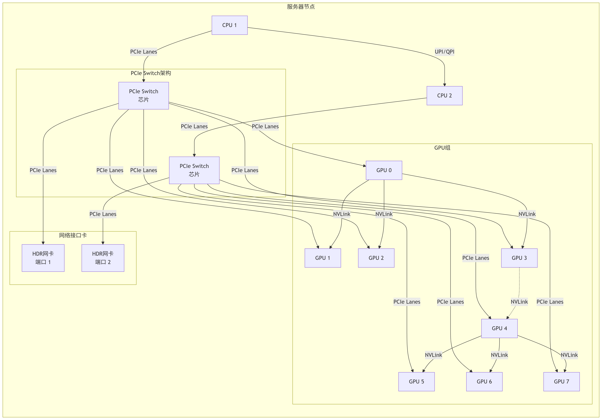

# 0 ncclUniqueId

NCCL 通信中 MPI (Message Passing Interface)：是一个跨语言的通信协议，通常用于 CPU 进程之间的通信。它的核心职责是：

- 进程管理：启动多个进程（可能分布在多个节点上），并为每个进程分配一个唯一的 rank。

- 协调与控制：在进程间交换控制信息、同步状态。例如，在你提供的代码中，MPI 被用来广播 ncclUniqueId，以及通过 Allgather 主机名来计算 localRank。

NCCL 充当“劳动者”：一旦进程知道了彼此的存在并且拿到了**共同的 ncclUniqueId**，它们就会初始化各自的 NCCL 通信器。之后，所有繁重的 GPU 数据搬运工作 就全部交给性能更强的 NCCL 来处理。

`NCCL 本身只需要一个 ncclUniqueId 来创建通信组`。只要你能通过其他方式让所有进程**共享这个 ncclUniqueId**，你就可以不使用 MPI。

**替代 MPI 的其他方法包括：**

- 文件系统：让 rank 0 将 ncclUniqueId 写入一个共享文件，其他进程去读取。
- TCP：自己写一个简单的 TCP 服务器来分发 ncclUniqueId。
- 环境变量：在启动所有进程前，预先设置好环境变量（但这通常不实用）。

# 1. pytorch 中是如何传播ncclUniqueId的呢？

PyTorch 需要一个中央协调点来让所有进程交换信息（最重要的就是 ncclUniqueId）。这个协调点被称为 **Store**，它通常是一个`简单的键值存储系统`。

- TCPStore：最常用的方式。*一个进程（通常是 rank 0）作为“服务器”（master），其他进程作为“客户端”连接到它来交换信息*。
- FileStore：使用一个共享文件系统（如 NFS）来交换信息。每个进程读写共享目录下的指定文件。
- HashStore：用于测试的临时内存存储，不能用于多机。

当调用 torch.distributed.init_process_group() 时，需要通过 init_method 参数或 store 参数来指定这个协调中心的位置（**例如 master 的 IP 和端口**）。

**具体流程** <br>

假设我们使用 NCCL 后端和 TCPStore。

- **step1 进程 0 (Rank 0) 启动：**

你的脚本调用 dist.init_process_group(backend='nccl', init_method='tcp://10.0.0.1:23456', world_size=4, rank=0)。

PyTorch 会启动一个 TCPStore 服务器在 10.0.0.1:23456。

PyTorch 的 NCCL 后端会调用 ncclGetUniqueId(&id) 生成一个唯一的 ncclUniqueId。

将这个 ncclUniqueId 以一个预定义的键（例如 "nccl_id"）存储到 TCPStore 中。

- **step2 其他进程 (Rank 1, 2, 3) 启动：**

它们调用类似的 init_process_group，rank 参数分别为 1, 2, 3，但 **init_method 指向同一个地址**。

它们会`作为客户端连接到 Rank 0 的 TCPStore`。

- **step3 集结同步和获取 ID：**

所有进程（包括 Rank 0）会在 Store 上进行一次集结操作（rendezvous），确保所有人都已连接。

集结完成后，Rank 1, 2, 3 会去 Store 上用那个预定义的键取出（get） 由 Rank 0 存放的 ncclUniqueId。

- **step4 初始化 NCCL 通信器：**

现在，所有进程都拿到了`完全相同的 ncclUniqueId`。

每个进程都会调用 NCCL 的 **ncclCommInitRank**(&comm, world_size, **id**, my_rank)。

这个调用是**阻塞集体通信**，必须所有进程同时调用才能成功。成功之后，`每个进程都拥有了一个可以互相通信的 NCCL 通信器 (comm)`。

- **step5 完成**

init_process_group 调用成功返回，此后 PyTorch 在任何分布式操作（如 all_reduce）中都可以直接使用这个已经初始化好的 NCCL 通信器。


# 2 pytorch c++ ProcessGroup 中 ncclGetUniqueId 函数的调用

## 2.1 初始化ncclComm_t
ProcessGroup 最终执行collective 的算子或 P2P 算子 是在collective 和 pointToPoint 方法里会调用 initNCCLComm 来初始化 **ncclComm_t** <br>

**通过device 可以获取key, 通过key 拿到对应的comm** <br>

```cpp
// ProcessGroupNCCL::collective
  const auto key = getKeyFromDevice(device);
  std::shared_ptr<NCCLComm> ncclComm = getNCCLComm(key);
  if (ncclComm == nullptr) {
    ncclComm = initNCCLComm(key, device, opType);
  }
```

## 2.2 initNCCLComm

先在rank 0 生成uniqueID --> broadcast other rank --> initNCCLComm

**broadcastUniqueNCCLID 是通过store_.get 拿到的** <br>

**UniqueId: C10D_NCCL_CHECK(ncclGetUniqueId(&ncclID), std::nullopt);**

```cpp
void ProcessGroupNCCL::broadcastUniqueNCCLID(
    ncclUniqueId* ncclID,
    bool isSingleP2POp,
    const std::string& p2pKey,
    int p2pRank) {
  std::string storeKey;
  if (!isSingleP2POp) {
    storeKey = std::to_string(ncclCommCounter_++);
  } else {
    storeKey = p2pKey;
  }
  if (rank_ == 0 || (isSingleP2POp && p2pRank == 0)) {
    auto vec = std::vector<uint8_t>(
        reinterpret_cast<uint8_t*>(ncclID),
        reinterpret_cast<uint8_t*>(ncclID) + NCCL_UNIQUE_ID_BYTES);
    store_->set(storeKey, vec);
  } else {
    try {
      auto vec = store_->get(storeKey);
      TORCH_CHECK_WITH(
          DistBackendError,
          vec.size() == NCCL_UNIQUE_ID_BYTES,
          "Invalid size for ncclUniqueId");
      std::memcpy(ncclID, vec.data(), vec.size());
    }
  }
}

std::shared_ptr<NCCLComm> ProcessGroupNCCL::initNCCLComm(
    const std::string& deviceKey,
    at::Device& device,
    OpType opType,
    int p2pRank,
    bool isSendRecvSelf) {
  usedDeviceIdxs_.insert(device.index());

  // NCCL communicator not cached, create a new entry
  std::shared_ptr<NCCLComm> ncclComm;

  // Create the unique NCCL ID and broadcast it
  ncclUniqueId ncclID;

  // For batch_isend_irecv, ncclGroupStart() would be called upfront
  bool batchP2P = ncclActiveGroupCounter_ > 0;
  bool singleP2POp = isP2POp(opType, batchP2P);

  // Get the device index
  auto deviceIndex = device.index();
  at::cuda::OptionalCUDAGuard gpuGuard(device);

  // To simplify conditional nesting, just create the ncclComms[i]
  // entry if it hasn't been yet rather than untangling the
  // conditions that might have resulted in a split above.
  if (!ncclComm) {
    if (getCvarBool(TORCH_NCCL_BCAST_UNIQUEID, true) && !isSendRecvSelf) {
      // For point-to-point communication, lower rank of the two will get unique
      // id.
      if (rank_ == 0 || (singleP2POp && p2pRank == 0)) {
        C10D_NCCL_CHECK(ncclGetUniqueId(&ncclID), std::nullopt);
      }

      // Broadcast so that each process can have a unique NCCL ID
      auto timeStarted = std::chrono::steady_clock::now();
      broadcastUniqueNCCLID(&ncclID, singleP2POp, deviceKey, p2pRank);
    }

#ifdef NCCL_HAS_COMM_NONBLOCKING
    ncclComm =
        NCCLComm::create(numRanks, rank, ncclID, deviceIndex, options_->config);
#else
    ncclComm = NCCLComm::create(numRanks, rank, ncclID, deviceIndex);
#endif
  }

  // Creates the NCCL streams
  bool force_high = getCvarBool(TORCH_NCCL_HIGH_PRIORITY, false);
  auto streamVal = at::cuda::getStreamFromPool(
      options_->is_high_priority_stream || force_high);

  {
    std::lock_guard<std::mutex> lock(mutex_);
    inInitializationCommMap_.emplace(deviceKey, ncclComm);
  }

  FlightRecorder::get()->record_pg_ranks(
      std::make_tuple(pg_uid_, pg_desc_), groupRanks());

  // See [Group Start/End Note]
  for (const auto i : c10::irange(ncclActiveGroupCounter_)) {
    (void)i;
    C10D_NCCL_CHECK(ncclGroupStart(), std::nullopt);
  }

  ncclStreams_.emplace(deviceKey, streamVal);

  // Note: these events are created with the (default) cudaEventDisableTiming
  // flag This flag provides the best performance when used with
  // cudaStreamWaitEvent() and cudaEventQuery(). Since we here don't measure the
  // performance using cudaEvent, this should be set.
  // TODO(kwen2501): is ncclEvents_ used anywhere else?
  ncclEvents_.emplace(deviceKey, at::cuda::CUDAEvent(cudaEventDisableTiming));

  // Move the NCCL resource to cache
  auto it = inInitializationCommMap_.find(deviceKey);
  // A previous thread could've already removed devicesKey from
  // inInitializationCommMap_ and added it to devNCCLCommMap_
  if (it != inInitializationCommMap_.end()) {
    devNCCLCommMap_.emplace(deviceKey, std::move(it->second));
    inInitializationCommMap_.erase(deviceKey);

    // Now ncclComms are fully initialized.
    // Register all active CUDA memory segments in cache allocator to
    // the new NCCL communicators
    if (useTensorRegisterAllocatorHook_) {
      auto snapshot = c10::cuda::CUDACachingAllocator::snapshot();
      // Register the segment to a new NCCL communicator if on the same device
      for (const auto& segmentInfo : snapshot.segments) {
        TORCH_INTERNAL_ASSERT(
            segmentInfo.device == device.index(),
            "Mismatch between CUDA memory segment device and current device");
        ncclComm->registerSegment(
            reinterpret_cast<void*>(segmentInfo.address),
            segmentInfo.total_size);
      }
    }
    // Record the mapping between ncclComm and device index so that later
    // register hook can register a newly allocated segment to communicators
    // on the same device.
    // NOTE: we need remove the communicator from this map when it is
    // destroyed, otherwise may register onto an invalid communicator.
    ncclCommDevIdxMapMutex.lock();
    ncclCommDevIdxMap.emplace(ncclComm, device.index());
    ncclCommDevIdxMapMutex.unlock();
  }

  it = devNCCLCommMap_.find(deviceKey);
  TORCH_INTERNAL_ASSERT(
      it != devNCCLCommMap_.end(), "Communicators not populated in cache!");
  return it->second;
}
```

## 2.3 nccl 中 ncclGetUniqueId 接口

主要任务: 完成 **ncclInit** 和 **bootstrapGetUniqueId**. <br>

**ncclUniqueID 其实就是ncclBootstrapHandle.**

```cpp
#define NCCL_UNIQUE_ID_BYTES 128
typedef struct { char internal[NCCL_UNIQUE_ID_BYTES]; } ncclUniqueId;

// old version
NCCL_API(ncclResult_t, ncclGetUniqueId, ncclUniqueId* out);
ncclResult_t ncclGetUniqueId(ncclUniqueId* out) {
  NCCLCHECK(ncclInit());
  NCCLCHECK(PtrCheck(out, "GetUniqueId", "out"));
  ncclResult_t res = bootstrapGetUniqueId((struct ncclBootstrapHandle*)out);
  TRACE_CALL("ncclGetUniqueId(0x%llx)", (unsigned long long)hashUniqueId(*out));
  return res;
}

// new version
ncclResult_t ncclGetUniqueId(ncclUniqueId* out) {
  NCCLCHECK(ncclInit());
  NCCLCHECK(PtrCheck(out, "GetUniqueId", "out"));
  struct ncclBootstrapHandle handle;
  NCCLCHECK(bootstrapGetUniqueId(&handle));
  // ncclUniqueId and bootstrapHandle don't have the same size and alignment
  // reset to 0 to avoid undefined data
  memset(out, 0, sizeof(*out));
  // copy to avoid alignment mismatch
  memcpy(out, &handle, sizeof(handle));
  TRACE_CALL("ncclGetUniqueId(0x%llx)", (unsigned long long)getHash(out->internal, NCCL_UNIQUE_ID_BYTES));
  return ncclSuccess;
}
```

## 2.4 通过broadcast 广播给其他rank

**pytorch ProcessGroupNCCL 中其实是通过store 完成broadcast的**

Key：是一个字符串，通常包含一个序列号（或其他标识符），其作用是让所有进程能够同步地找到并同意使用哪一个 Unique ID。

```cpp
void ProcessGroupNCCL::broadcastUniqueNCCLID(
    ncclUniqueId* ncclID,
    bool isSingleP2POp,
    const std::string& p2pKey,
    int p2pRank) {
  // For collective operations:
  // For every NCCL communicator that we create we need to broadcast
  // a unique ID from rank 0 to all other ranks. This broadcast is
  // done by rank 0 setting a key in the store and all other ranks
  // retrieving the contents of that key. A single process group
  // may create multiple NCCL communicators, so we use a sequence
  // number to differentiate between them.
  // For single point-to-point operations:
  // The sequence number will only be increased on 2 out of all the
  // processes in a Process Group. So all following collective
  // operations will see different sequence numbers which will cause
  // runtime errors. To avoid that, use the src:target pair instead
  // of sequence number for p2p communications.

  std::string storeKey;
  if (!isSingleP2POp) {
    storeKey = std::to_string(ncclCommCounter_++);
  } else {
    storeKey = p2pKey;
  }

  if (rank_ == 0 || (isSingleP2POp && p2pRank == 0)) {
    auto vec = std::vector<uint8_t>(
        reinterpret_cast<uint8_t*>(ncclID),
        reinterpret_cast<uint8_t*>(ncclID) + NCCL_UNIQUE_ID_BYTES);
    store_->set(storeKey, vec);
  } else {
    try {
      auto vec = store_->get(storeKey);
      TORCH_CHECK_WITH(
          DistBackendError,
          vec.size() == NCCL_UNIQUE_ID_BYTES,
          "Invalid size for ncclUniqueId");
      std::memcpy(ncclID, vec.data(), vec.size());
    } catch (const std::exception& e) {
      ...
    }
  }
}

```

# 3 通信知识补充

## 3.1 example : 一个网络通信的建立过程

> step1: 初始化：每个节点调用 ncclFindInterfaces(“ib0”, ...)，找到本地的 **IB 网卡 IP 地址**（例如，节点A是 192.168.1.10，节点B是 192.168.1.11）。

> step2: Bootstrap (引导):

> - 节点A和节点B通过一个简单的 TCP 协议（运行在 IPoIB 之上），连接到指定的主节点。

> - 它们互相交换信息：“我是 192.168.1.10，我的 RDMA GID/LID 是 XXX...”，“我是 192.168.1.11，我的 RDMA GID/LID 是 YYY...”。

> - 它们也协商好用于后续控制的 TCP 端口

> step3: 建立高速数据通道：

> - 节点A和节点B不仅知道了对方的 IP，还知道了对方的 RDMA 地址;

> - 直接使用 InfiniBand 的原生 Verbs API（而不是 TCP/IP Socket）来创建和连接各自的 RDMA 队列（QP）;

> - 所有大规模的数据交换（梯度、模型参数）都通过零拷贝、内核旁路（Kernel Bypass）的 RDMA 协议在这个高速通道上直接进行，性能达到极致;

> step4: 控制通道的保留: 之前建立的 TCP 连接通常会保留下来，作为一个控制通道，用于传输一些量小但重要的协调和控制消息.

## 3.2 不同网络技术特性对比表

| 特性 | TCP/IP over Ethernet | TCP/IP over InfiniBand (IPoIB) | Native InfiniBand (RDMA) |
| :--- | :--- | :--- | :--- |
| 协议 | 标准 TCP/IP | 标准 TCP/IP (封装在IB帧中) | 原生 IB 协议 |
| API | Socket | Socket | Verbs API (ibv_*) |
| 性能 | 低带宽，高延迟 | 中等带宽，低延迟 | 极高带宽，极低延迟 |
| CPU 开销 | 高（需要内核参与） | 中 | 极低（内核旁路） |
| 在 NCCL 中的角色 | 备用方案 | Bootstrap & 控制通道 | 数据传输通道 |

**正确理解: 理解可以更新为：TCP/IP 是一种上层协议，它可以运行在多种底层硬件上，包括以太网和 InfiniBand。NCCL 利用 IPoIB 在 InfiniBand 硬件上建立可靠的 TCP 引导和控制通道，并借此通道为后续建立真正的、纯原生的、高性能的 RDMA 数据通道铺平道路。**

- Socket（通常指 IPoIB - IP over InfiniBand）, 即使物理上是 InfiniBand 网卡，NCCL 也可以选择使用其兼容模式：IPoIB。在这种模式下，InfiniBand 网卡被当作一个普通的以太网卡来使用，通信过程走标准的 TCP/IP 协议栈。(兼容性好：只要是支持 TCP/IP 的网络（以太网、InfiniBand、IPoIB）都能用)
- Verbs（指 RDMA - Remote Direct Memory Access）: Verbs 是 RDMA 技术的软件接口（API）. 配置复杂：需要安装专门的驱动（如 libibverbs）、固件，并进行一定的网络配置（如设置子网管理器）。

## 3.3 RDMA 通信需要什么？

仅知道IB网卡和**TCP风格的端口号**远远不够建立RDMA连接。RDMA通信需要一整套**复杂的地址信息**来在网络中精确定位对端的通信实体，而GID和LID正是这套“地址簿”里的关键组成部分。

**LID (Local Identifier) - “本地街道号”**

- 作用：在一个单一的InfiniBand子网内部，用于唯一标识一个端口（Port）。可以把它想象成一个在一个小镇内部使用的、简短的街道门牌号。

- 使用场景：在传统的、所有节点都位于同一个IB交换网络中的集群里，使用LID进行通信是最高效的方式。

- 特点：范围小：通常是一个16位的值（1-65535），所以范围有限；本地性：由子网管理器（Subnet Manager, SM）在初始化子网时分配，只在同一个子网内有效。高效：因为地址短，在数据包头部开销小，处理速度快。

**GID (Global Identifier) - “全球GPS坐标”**

- 作用：用于在全球范围或跨多个IB子网的路由网络中唯一标识一个端口。它是一个128位的地址，遵循IPv6的地址格式。

- 全局唯一：可以跨子网、跨路由器定位到世界上任何一台支持RoCE (RDMA over Converged Ethernet) 或IB的机器。

- 与IP网络融合：GID的设计使得IPoIB和RoCE成为可能。RoCEv2数据包甚至可以承载在普通的IP网络上。

- 使用场景： 跨子网的RDMA通信； RoCE (RDMA over Converged Ethernet)：RoCEv2依赖GID在IP网络中路由RDMA数据包；

- 现代大规模集群中，即使是在单个子网内，也倾向于使用GID，因为它更灵活、更现代；

**建立RDMA连接还需要什么？**

RDMA通信的端点不是网卡本身，而是建立在网卡上的队列对（QP）. 除了LID/GID，要建立一条可工作的RDMA连接，通信双方还需要交换更多核心信息. 这些信息共同构成了一个Queue Pair (QP) 的完整地址：<br>

- Queue Pair Number (QP号) : 队列对(QP)的唯一标识

- Memory Key (内存键)：内存地址：你注册的用于RDMA操作的内存块的起始地址。内存保护密钥：一个名为**lkey（本地密钥）**和**rkey（远端密钥）**的token.

**密钥验证 remote key**

rkey，IB网卡硬件会验证该密钥是否有权访问指定的内存区域。这是RDMA内存安全的核心保障。

## 3.4 RDMA through InfiniBand or RoCE

RDMA 是“无需与收货人当面交接，直接放门口”的**服务模式**

InfiniBand 是自家组建的**专用物流车队和高速公路**，只为这一种服务模式而生。

RoCE 是尝试在现有的、繁忙的**公共公路系统（以太网）** 上，为我们的“送货上门”服务开辟一条`专属绿色通道(公交车道?)`。

**IB 和 RoCE 带宽计算** <br>

IB 和 RoCE 的带宽计算方式完全相同，因为它们都是基于物理链路的速率。计算时需要考虑两个值：理论峰值带宽 和 有效应用带宽。

核心计算公式:

- 理论峰值带宽 (Theoretical Peak Bandwidth) = 链路速率 × ( 1 - 编码开销 )

- 有效应用带宽 (Effective Goodput) ≈ 理论峰值带宽 × **传输效率**

**InfiniBand 单链路不同速率等级参数对比表**

| 通用叫法 | 链路速率 | 理论峰值带宽 (Gbps) | 理论峰值带宽 (GB/s) | 备注 |
| :--- | :--- | :--- | :--- | :--- |
| 40G (QDR) | 40 Gbps | 40 * (64/66) ≈ 38.79 Gbps | 38.79 / 8 ≈ 4.85 GB/s | 较老一代 |
| 56G (FDR) | 56 Gbps | 56 * (64/66) ≈ 54.30 Gbps | 54.30 / 8 ≈ 6.79 GB/s | 较老一代 |
| 100G (EDR) | 100 Gbps | 100 * (64/66) ≈ 96.97 Gbps | 96.97 / 8 ≈ 12.12 GB/s | 常见主流 |
| 200G (HDR) | 200 Gbps | 200 * (64/66) ≈ 193.94 Gbps | 193.94 / 8 ≈ 24.24 GB/s | 当前主流 |
| 400G (NDR) | 400 Gbps | 400 * (64/66) ≈ 387.88 Gbps | 387.88 / 8 ≈ 48.48 GB/s | 最新一代 |

> 注：表格中理论峰值带宽计算时引入 **(64/66)** 系数，源于 InfiniBand 协议中采用 64B/66B 编码方式（每 66 个比特的传输帧中包含 64 个比特的有效数据），需扣除编码开销以得到实际有效带宽。

> 注: 上表计算的是单向带宽。IB和RoCE网卡都是全双工的，意味着同时的发送和接收都能达到这个速率。

**多条链路**

- N 条链路可以提供接近 N 倍的单链路带宽（对于多个TCP流效果很好）
- 1.链路直连通过交换机连接; 2.多链路聚合/捆绑;  多轨网络；
- 多轨网络 (Multi-Rail Networking): 每个节点有 N 条 物理链路（通常是 2 条或 4 条），连接到一台或多台交换机. 这是在高性能计算和顶级AI集群中追求极致带宽和延迟的高级用法。它超越了简单的链路聚合。(方式1： 网卡多轨：一块物理网卡上提供多个端口； 节点多轨：一个节点里安装多块网卡)。多轨需要应用程序和通信库（如 NCCL、MPI）明确感知和支持。应用程序会看到多个独立的网络接口（如 ib0, ib1），并由通信库智能地将不同的通信任务分配到不同的“轨”上。在追求高性能的AI/HPC集群中，**每个节点通常会配置 2 条或 4 条链路（称为“双轨”或“四轨”）**，并通过像NCCL这样的软件库利用所有这些链路进行并行通信，从而将两个节点间的总带宽提升 2 倍或 4 倍。


**不同链路如何连接到多个GPU: 物理连接和逻辑带宽分配**



一个节点内的2个HDR网卡端口和8个GPU之间的连接，并不是一根线直接连过去，而是通过一个复杂的内部I/O架构实现的。其核心是 PCIe Switch 和 NVLink。

1. PCIe Switch是枢纽：CPU不会直接连接所有设备。PCIe Switch芯片（类似于网络交换机）负责在CPU、GPU和网卡之间路由数据。一个高端服务器会有多个PCIe Switch。

2. NUMA架构：在多路CPU服务器中，硬件资源具有NUMA（非统一内存访问） 特性。上图为例，连接到CPU1的PCIe Switch上的GPU和网卡，与CPU1的通信速度最快。跨CPU访问其他设备会有更高的延迟和更低的带宽。

3. 网卡的归属：一块HDR网卡会物理安装在一个PCIe插槽上，该插槽通过PCIe Lanes连接到某个PCIe Switch，进而连接到某个CPU。因此，一块网卡在物理上更“亲近”某一部分GPU。聪明的驱动和软件（如NCCL）会意识到这种拓扑结构，并优先让“亲近”的GPU使用“亲近”的网卡端口，以获得最佳性能。

4. NVLink的作用：NVLink是GPU之间极其高速的直接互联通道，速度远高于PCIe。它使得GPU之间交换数据（例如在模型并行中）几乎不占用PCIe带宽，从而为网络通信留出更多PCIe资源。

- **逻辑带宽 - 8个GPU分享48GB/s带宽吗？**

> 答案是：是的，从整个节点的出口总量来看，这8个GPU共享总计约48GB/s的跨节点通信带宽。但这是一种“智能的、可优化的”共享，而非简单的争抢。

**场景一：所有GPU都需要进行All-Reduce操作（最典型）**

> 在训练中，每个GPU计算完梯度后，需要所有GPU一起进行All-Reduce操作来同步梯度。这会产生大量的跨节点通信。

> 流量聚合：8个GPU的梯度数据首先通过超高速的NVLink在节点内部进行聚合和交换。这是一个非常快的过程。

> 智能分发：NCCL库感知到节点有2个网络端口（多轨）。它会智能地将需要发送到其他节点的聚合后的数据流，并行地拆分到这两个端口中。

> 例如，它可能将一半的梯度数据通过网卡端口1发送，另一半通过网卡端口2发送。

> 这样，总出口带宽就从单口的24GB/s变成了双口的48GB/s。

结论：在这种情况下，8个GPU共同使用这48GB/s的总带宽，但由于NCCL的多轨优化，它们是以一种协同并行的方式在使用，从而实现了极高的带宽利用率。你不会感觉到某个GPU在“独享”带宽而其他在“等待”。

**场景二：单个GPU需要大量跨节点通信（不常见）**

> 如果某个任务需要GPU 0频繁且大量地与另一个节点上的某个GPU交换数据（例如在推理或某些特定模型并行中），那么这条通信流可能会被NCCL固定在某一条链路上。

> 此时，GPU 0的跨节点通信速度上限就是单条链路的24GB/s。

> 其他GPU的通信则可以共享另一条24GB/s的链路。

这种情况下，带宽资源是按需分配的，而非平均分配.

**总结与关键要点**

- 是共享IB 带宽，但不是平均分配：48GB/s是节点的总出口带宽容量。所有GPU的跨节点通信流量都共享这个总池子。

- NCCL是多轨功能的核心：是NCCL（或其他MPI库）的算法智能地、动态地将数据流分布到多个网络端口上，从而汇聚带宽，使得总带宽接近各端口带宽之和。

- 内部互联是关键基础：高速的NVLink和PCIe Switch架构是前提。如果GPU之间通过慢速的PCIe交换数据，内部就会成为瓶颈，根本无力“喂饱”两个200G的网络端口。

- 拓扑感知：最佳的软件性能来自于软件（NCCL）对硬件拓扑（哪个GPU离哪个网卡更近）的感知，从而优先安排“亲近”的设备之间通信，减少跨NUMA的延迟。

所以，你的理解是正确的：8个GPU共享约48GB/s的单向带宽，但得益于先进的硬件互联和极其智能的软件库，这种共享是高效的，使得大规模分布式训练成为可能。

# 4 nccl : ncclGetUniqueId analysis

*/nccl/src/init.cc*

ncclGetUniqueId 里封装了 bootstrapGetUniqueId 函数.

```cpp
NCCL_API(ncclResult_t, ncclGetUniqueId, ncclUniqueId* out);
ncclResult_t ncclGetUniqueId(ncclUniqueId* out) {
  NCCLCHECK(ncclInit());
  NCCLCHECK(PtrCheck(out, "GetUniqueId", "out"));
  struct ncclBootstrapHandle handle;
  NCCLCHECK(bootstrapGetUniqueId(&handle));
  // ncclUniqueId and bootstrapHandle don't have the same size and alignment
  // reset to 0 to avoid undefined data
  memset(out, 0, sizeof(*out));
  // copy to avoid alignment mismatch
  memcpy(out, &handle, sizeof(handle));
  TRACE_CALL("ncclGetUniqueId(0x%llx)", (unsigned long long)getHash(out->internal, NCCL_UNIQUE_ID_BYTES));
  return ncclSuccess;
}
```

## 4.1 ncclInit

**在多机（多节点）训练时，不同的进程（可能分布在不同的服务器上）需要相互发现、交换信息（如通信地址、端口号）并建立连接 !!!** <br>

- initEnv() : 解析和处理环境变量;
- setCpuStackSize() : 设置当前线程的 CPU 栈大小, 可移植性和稳定性措施, 防止发生栈溢出;
- initGdrCopy() : GPU direct RDMA 配置
- bootstrapNetInit(): 初始化引导网络模块, 建立一个简单的通信层，使得所有参与集体通信的 rank 能够交换元数据，为后续建立高速的、可能基于 RDMA 的通信链路做准备;
- initNvtxRegisteredEnums() : NVIDIA Tools Extension 的缩写，它是一个用于标记应用程序时间线的库.

```cpp
static void initOnceFunc() {
  initEnv();
  setCpuStackSize();
  initGdrCopy();
  // Always initialize bootstrap network
  NCCLCHECKGOTO(bootstrapNetInit(), initResult, exit);

  initNvtxRegisteredEnums();
exit:;
}
```

## 4.1.1 initEnv

代码位置: */nccl/src/misc/param.cc, 主要用于初始化环境变量.

&nbsp;&nbsp;这段代码用于确定 NCCL 配置文件的路径，并按照优先级顺序加载配置。

```cpp
void initEnv() {
  static std::once_flag once;
  std::call_once(once, initEnvFunc);
}

static void initEnvFunc() {
  char confFilePath[1024];
  const char* userFile = getenv("NCCL_CONF_FILE");
  if (userFile && strlen(userFile) > 0) {
    snprintf(confFilePath, sizeof(confFilePath), "%s", userFile);
    setEnvFile(confFilePath);
  } else {
    const char* userDir = userHomeDir();
    if (userDir) {
      snprintf(confFilePath, sizeof(confFilePath), "%s/.nccl.conf", userDir);
      setEnvFile(confFilePath);
    }
  }
  snprintf(confFilePath, sizeof(confFilePath), "/etc/nccl.conf");
  setEnvFile(confFilePath);
}
```

```sh
# ~/.nccl.conf 示例配置
NCCL_ALGO=Ring
NCCL_PROTO=LL128
NCCL_NET_GDR=1  # 启用 GPU Direct RDMA
NCCL_IB_DISABLE=0
```

### 4.1.2 initGdrCopy

**不支持GDR (GPU Direct RDMA) 时的一种替代方案: 先到Pinned SysMem(copy-engine)，再从Pinned SysMem到NIC**

**GPU与NIC数据传输路径对比**

> NIC的全程是网络接口卡（Network Interface Card），也称为**网卡** .

| 通信路径               | 数据流                          | 性能   | 硬件要求                                   |
|------------------------|---------------------------------|--------|--------------------------------------------|
| GPU Direct RDMA (理想) | GPU Mem ←→ NIC                  | 最佳   | 苛刻，需要特定硬件和拓扑                   |
| GDRCopy (备用)         | GPU Mem ←→ Pinned SysMem ←→ NIC | 很好   | 宽松，大部分现代系统都支持                 |
| 默认回退 (最差)        | GPU Mem → SysMem → NIC          | 差     | 通用，所有系统都支持                       |

initGdrCopy() 函数的作用：初始化一个名为 "GDRCopy" 的备用通信路径。这条路径用于在不支持原生GPU Direct RDMA的系统上，实现一种高性能的、基于P2P DMA的替代方案来在GPU内存和NIC（网卡）之间传输数据。

ncclParamGdrCopyEnable() 会启用copy-engine吗？：会的，但这里的 "copy-engine" 不是指CPU，而是特指NIC上的DMA引擎。它启用的是NIC与GPU之间的Peer-to-Peer DMA拷贝，这个过程依然** bypass了CPU和系统内存**，所以性能远高于传统的CPU拷贝路径，但略低于完美的原生GPU Direct RDMA。

```cpp
ncclResult_t initGdrCopy() {
  if (ncclParamGdrCopyEnable() == 1) {
    ncclGdrCopy = ncclGdrInit(); // initOnceFunc
  }
  return ncclSuccess;
}
```

> GPU Direct RDMA：就像从你家客厅（GPU）直接修了一条高速公路到公司（NIC）。

> GDRCopy：你家和公司不在一个区，不能直接修路。但你在你们区边界的一个物流中转站（Pinned SysMem）租了个永久车位。你先开车到中转站（一次DMA拷贝），然后换公司的车直接从中转站上高速（第二次DMA拷贝）。虽然多了次装卸，但远比绕道市中心（整个系统内存）快。

> 默认回退：你开车拉着货从家到市中心的巨型仓库（**系统内存**），卸货，然后公司的车再来仓库装货，最后再上高速。

**GPU数据传输路径特性对比** <br>
| 特性         | 默认路径 (GPU→SysMem→NIC)                | GDRCopy路径 (GPU→Pinned SysMem→NIC)       |
|--------------|-------------------------------------------|-------------------------------------------|
| 内存准备     | 临时分配普通SysMem                        | 预先分配好专用的Pinned SysMem             |
| 锁定方式     | 每次传输前临时锁定                        | 一次性分配时就永久锁定                    |
| 锁定开销     | 每次传输都有**锁定/解锁的开销，非常昂贵**      | 一次性开销，后续传输无此成本              |
| 内存位置     | 数据在庞大的系统内存池中                  | 数据在一块小巧、固定的缓存区中            |
| 物理地址     | 每次传输都需要重新查询和映射物理地址      | 物理地址固定不变，设备早已熟知            |
| 类比         | 每次送货前，现找一个新的临时停车位并办理手续。 | 拥有一个固定的专属物流中转仓库。              |

**加载libgdrapi.so**

```c++
static void initOnceFunc(void) {
  static void* gdrhandle = NULL;
  void* tmp;
  void** cast;

  // #define GDRAPI_LIBNAME "libgdrapi.so"
  gdrhandle=dlopen(GDRAPI_LIBNAME, RTLD_NOW);
  if (!gdrhandle) {
    WARN("Failed to open %s", GDRAPI_LIBNAME);
    goto teardown;
  }

  /* Load the function pointers from the DL library image */
  LOAD_SYM(gdrhandle, "gdr_open", gdr_internal_open);
  LOAD_SYM(gdrhandle, "gdr_close", gdr_internal_close);
  LOAD_SYM(gdrhandle, "gdr_pin_buffer", gdr_internal_pin_buffer);
  LOAD_SYM(gdrhandle, "gdr_unpin_buffer", gdr_internal_unpin_buffer);
  LOAD_SYM(gdrhandle, "gdr_get_info", gdr_internal_get_info);
  LOAD_SYM(gdrhandle, "gdr_map", gdr_internal_map);
  LOAD_SYM(gdrhandle, "gdr_unmap", gdr_internal_unmap);
  LOAD_SYM(gdrhandle, "gdr_runtime_get_version", gdr_internal_runtime_get_version);
  LOAD_SYM(gdrhandle, "gdr_driver_get_version", gdr_internal_driver_get_version);
  LOAD_SYM(gdrhandle, "gdr_copy_to_mapping", gdr_internal_copy_to_mapping);
  LOAD_SYM(gdrhandle, "gdr_copy_from_mapping", gdr_internal_copy_from_mapping);

  initResult = ncclSuccess;
  return;

teardown:
  gdr_internal_open = NULL;
  gdr_internal_close = NULL;
  gdr_internal_pin_buffer = NULL;
  gdr_internal_unpin_buffer = NULL;
  gdr_internal_get_info = NULL;
  gdr_internal_map = NULL;
  gdr_internal_unmap = NULL;
  gdr_internal_runtime_get_version = NULL;
  gdr_internal_driver_get_version = NULL;
  gdr_internal_copy_to_mapping = NULL;
  gdr_internal_copy_from_mapping = NULL;

  if (gdrhandle != NULL) dlclose(gdrhandle);
  initResult = ncclSystemError;
  return;
}
```

### 4.1.3 bootstrapNetInit : 初始化引导网络模块

**作用:** 找出“我”（本进程）`应该使用哪个IP地址来与其他节点通信`. <br>

**原理及要点:**

- 详细说明：这是初始化过程中至关重要的一步。在多机（多节点）训练时，不同的进程（可能分布在不同的服务器上）需要相互发现、交换信息（如通信地址、端口号）并建立连接。

- “Bootstrap” 指的是这个初始的“引导”过程。它通常需要一个**简单的、通用的网络通道**来开始这次"**握手**"。

- bootstrapNetInit() 负责初始化这个用于**引导的网络通信模块**。它通常会使用 TCP/IP 套接字(socket)，因为 TCP/IP 是几乎所有系统都支持的通用协议。

- 它的任务是建立一个简单的通信层，使得所有参与集体通信的 rank 能够**交换元数据**，为后续建立高速的、可能基于 RDMA 的通信链路做准备。

- ncclFindInterfaces 函数只查询和操作**本地主机**（当前进程所在的服务器）的`网络接口`信息。

- TCP/IP 完全可以运行在 InfiniBand (IB) 网络之上。 IB 网卡不仅能处理其原生的 IB 协议，也能处理 IP 协议;

- NCCL 在引导阶段即使使用 TCP/IP，也强烈建议甚至优先选择 InfiniBand 接口的 IP 地址。

- ncclFindInterfaces 和 NCCL_SOCKET_IFNAME 的作用就是**强制所有节点使用同一类型的、互联互通的物理网络**;

- 即使传输的数据量很小（元数据），在 IB 网络上跑 TCP/IP（IPoIB）的延迟也远低于普通以太网。这可以加速作业的启动过程;


**被初始化的变量举例** <br>
假设系统中使用 IB 接口 ib0，GID 为 fe80::1234:5678:9abc:def0，端口 12345

**bootstrapNetIfName = "ib0" / "mlx5_0"**;
- 值示例: "ib0"、"mlx5_0" 等 IB 接口名称。
- 来源: 通过系统调用 ibv_get_device_list() 获取 IB 设备列表后，根据环境变量 NCCL_IB_HCA 或默认规则选择。

**bootstrapNetIfAddr 类型 ncclSocketAddress

- 联合体存储了 IB 地址信息（IPv6 格式）**

```c++
union ncclSocketAddress {
  struct sockaddr sa;
  struct sockaddr_in sin;
  struct sockaddr_in6 sin6;
};

struct sockaddr_in6 {
    __SOCKADDR_COMMON (sin6_);
    // Transport layer port : htons(host to net short)以网络字节序存储，接收方通过ntohs解析（net to host short）
    in_port_t sin6_port; // example: htons(12345)
    // 流信息：为数据包标记特定的流量特征，帮助网络设备（如交换机、路由器）进行流量管理和优先级调度
    // 高 8 位（bit 24-31）用于标识数据包的服务类型（如低延迟、高吞吐量等），类似于 IPv4 的 TOS（Type of Service）
    // 0x00：默认服务（Best Effort）; 0x08：最小延迟（Low Delay）; 0x10：最大吞吐量（High Throughput）; 0x20：最小丢包率（Low Loss）
    // 低 20 位（bit 0-19）用于标识特定的数据流标签（如某个 TCP 连接或 UDP 会话），网络设备可以基于流标签对数据流进行分类和优化。
    // 由操作系统或应用程序随机生成，用于区分不同连接。示例：TCP 连接：每个连接分配唯一流标签（如 0x12345）。UDP 会话：每个会话分配独立流标签（如 0x54321）。
    uint32_t sin6_flowinfo;	// IPv6 flow information :
    struct in6_addr sin6_addr;	// IPv6 address : 解析后的 GID（如 fe80::1234:5678:9abc:def0）
    // Scope ID : 标识 IPv6 地址的作用域 : sin6_scope_id 为预定义范围值（如 2 表示链路本地，5 表示站点本地）
    // 它的核心作用是解决 链路本地地址（Link-Local）和多播地址（Multicast）的歧义性问题，确保网络通信的准确性;
    // 链路本地地址（Link-Local）：fe80::/10，仅在同一链路（如局域网）内有效。
    // 站点本地地址（Site-Local）：fec0::/10，仅在站点内有效。
    // 全局地址（Global）：公网地址，全球范围内有效.
    // 多个网络接口可能拥有相同的链路本地地址（如 fe80::1234），操作系统需要知道通过哪个接口发送数据包。
    // 0: 全局通信地址(默认: 由地址本身决定作用域); 2: 链路本地，链路内通信（如局域网探测）；5: 站点内通信（如数据中心）; 8: 公网通信
    // 0： 表示地址的作用域由地址本身决定（如全局地址自动属于全局作用域）；
    // 8: 显式标记地址为全局作用域，确保网络协议栈将其视为全局地址, 行为与 0 完全相同，但代码可读性更高。
    uint32_t sin6_scope_id;	/* IPv6 scope-id */
  };
```

> 多播：数据包的复制工作由网络交换机完成，而不是由源节点完成。源节点只承担了一份数据的发送压力。


**bootstrapNetInitDone = 1;  // 初始化完成标志置为 1**

- 初始化标志被置为 1，表示网络已经成功初始化，这个变量确保初始化过程只执行一次。

**bootstrapNetMutex;  // 内部状态为 unlocked，互斥锁处于解锁状态，初始化已完成**


**代码展示**

```c++
/* Init functions */
static char bootstrapNetIfName[MAX_IF_NAME_SIZE+1]; // "ib0"、"mlx5_0" 等 IB 接口名称;
static union ncclSocketAddress bootstrapNetIfAddr;  //
static int bootstrapNetInitDone = 0;
static std::mutex bootstrapNetMutex;

ncclResult_t bootstrapNetInit() {
  if (bootstrapNetInitDone == 0) {
    std::lock_guard<std::mutex> lock(bootstrapNetMutex);
    if (bootstrapNetInitDone == 0) {
      const char* env = ncclGetEnv("NCCL_COMM_ID");
      int nIfs = 0;
      if (env) {
        union ncclSocketAddress remoteAddr;
        if (ncclSocketGetAddrFromString(&remoteAddr, env) != ncclSuccess) {
          WARN("Invalid NCCL_COMM_ID, please use format: <ipv4>:<port> or [<ipv6>]:<port> or <hostname>:<port>");
          return ncclInvalidArgument;
        }
        NCCLCHECK(ncclFindInterfaceMatchSubnet(bootstrapNetIfName, &bootstrapNetIfAddr, &remoteAddr, MAX_IF_NAME_SIZE,
                                               &nIfs));
        if (nIfs <= 0) {
          WARN("NET/Socket : No usable listening interface found");
          return ncclSystemError;
        }
      } else {
        NCCLCHECK(ncclFindInterfaces(bootstrapNetIfName, &bootstrapNetIfAddr, MAX_IF_NAME_SIZE, 1, &nIfs));
        if (nIfs <= 0) {
          WARN("Bootstrap : no socket interface found");
          return ncclInvalidUsage;
        }
      }
      char line[SOCKET_NAME_MAXLEN+MAX_IF_NAME_SIZE+2];
      snprintf(line, sizeof(line), " %s:", bootstrapNetIfName);
      ncclSocketToString(&bootstrapNetIfAddr, line+strlen(line));
      INFO(NCCL_BOOTSTRAP, "Bootstrap: Using%s", line);
      bootstrapNetInitDone = 1;
    }
  }
  return ncclSuccess;
}
```

## 4.2 bootstrapGetUniqueId

这个UniqueId 其实就是ncclBootstrapHandle.

**总结: bootstrapGetUniqueId 功能很简单: 就是通过随机magic number 和 ncclSocketAddress 生成一个ID.**

**但这里在bootstrapGetUniqueId的同时，直接生成了ncclSocket 并开始进行listen. pthread_t 中. 在这个pthread_t 中 执行bootstrapRoot 函数，等待其它rank send 数据。这个过程 即使bootstrapGetUniqueId 函数结束后还在持续进行。**

> 分离状态（detached）：
> 通过 pthread_detach(thread) 将线程设置为分离状态，线程结束后自动释放资源，无需 pthread_join。
> 生命周期独立性：
> bootstrapCreateRoot 在创建线程后立即返回，线程的运行与 bootstrapCreateRoot 无关。即使bootstrapCreateRoot 结束，**线程仍会继续执行**。

- 代码原理
```c++
ncclResult_t bootstrapCreateRoot(...) {
  pthread_create(&thread, NULL, bootstrapRoot, ...);  // 启动线程
  pthread_detach(thread);  // 分离线程
  return ncclSuccess;  // 函数返回，线程仍在运行
}
```

**代码展示**

```c++
struct ncclBootstrapHandle {
  uint64_t magic;
  union ncclSocketAddress addr;
};

union ncclSocketAddress {
  struct sockaddr sa;
  struct sockaddr_in sin;
  struct sockaddr_in6 sin6;
};


struct sockaddr_in6
  {
    __SOCKADDR_COMMON (sin6_);
    in_port_t sin6_port;	/* Transport layer port # */
    uint32_t sin6_flowinfo;	/* IPv6 flow information */
    struct in6_addr sin6_addr;	/* IPv6 address */
    uint32_t sin6_scope_id;	/* IPv6 scope-id */
  };

ncclResult_t bootstrapGetUniqueId(struct ncclBootstrapHandle* handle) {
  memset(handle, 0, sizeof(ncclBootstrapHandle)); // 128 bytes ?

  const char* env = ncclGetEnv("NCCL_COMM_ID");
  if (env) {
    INFO(NCCL_ENV, "NCCL_COMM_ID set by environment to %s", env);
    if (ncclSocketGetAddrFromString(&handle->addr, env) != ncclSuccess) {
      WARN("Invalid NCCL_COMM_ID, please use format: <ipv4>:<port> or [<ipv6>]:<port> or <hostname>:<port>");
      return ncclInvalidArgument;
    }
    handle->magic = NCCL_MAGIC;
  } else {
    NCCLCHECK(getRandomData(&handle->magic, sizeof(handle->magic))); // magic 随机值
    memcpy(&handle->addr, &bootstrapNetIfAddr, sizeof(union ncclSocketAddress)); // 静态变量addr
    NCCLCHECK(bootstrapCreateRoot(handle, false));
  }

  return ncclSuccess;
}

ncclResult_t bootstrapCreateRoot(struct ncclBootstrapHandle* handle, bool idFromEnv) {
  ncclResult_t ret = ncclSuccess;
  struct ncclSocket* listenSock = NULL;
  struct bootstrapRootArgs* args = NULL;
  pthread_t thread;

  NCCLCHECK(ncclCalloc(&listenSock, 1));
  NCCLCHECKGOTO(ncclSocketInit(listenSock, &handle->addr, handle->magic, ncclSocketTypeBootstrap, NULL, 0), ret, fail);
  NCCLCHECKGOTO(ncclSocketListen(listenSock), ret, fail);
  NCCLCHECKGOTO(ncclSocketGetAddr(listenSock, &handle->addr), ret, fail);

  NCCLCHECKGOTO(ncclCalloc(&args, 1), ret, fail);
  args->listenSock = listenSock;
  args->magic = handle->magic;
  PTHREADCHECKGOTO(pthread_create(&thread, NULL, bootstrapRoot, (void*)args), "pthread_create", ret, fail);
  ncclSetThreadName(thread, "NCCL BootstrapR");
  PTHREADCHECKGOTO(pthread_detach(thread), "pthread_detach", ret, fail); // will not be pthread_join()'d
exit:
  return ret;
fail:
  if (listenSock) free(listenSock);
  if (args) free(args);
  goto exit;
}

ncclResult_t ncclSocketInit(struct ncclSocket* sock, const union ncclSocketAddress* addr, uint64_t magic, enum ncclSocketType type, volatile uint32_t* abortFlag, int asyncFlag, int customRetry) {
  ncclResult_t ret = ncclSuccess;

  if (sock == NULL) goto exit;
  sock->errorRetries = 0;
  sock->abortFlag = abortFlag;
  sock->asyncFlag = asyncFlag;
  sock->state = ncclSocketStateInitialized;
  sock->magic = magic;
  sock->type = type;
  sock->fd = -1;
  sock->acceptFd = -1;
  sock->customRetry = customRetry;

  if (addr) {
    /* IPv4/IPv6 support */
    int family;
    memcpy(&sock->addr, addr, sizeof(union ncclSocketAddress));
    family = sock->addr.sa.sa_family;
    if (family != AF_INET && family != AF_INET6) {
      char line[SOCKET_NAME_MAXLEN+1];
      WARN("ncclSocketInit: connecting to address %s with family %d is neither AF_INET(%d) nor AF_INET6(%d)",
          ncclSocketToString(&sock->addr, line), family, AF_INET, AF_INET6);
      ret = ncclInternalError;
      goto exit;
    }
    sock->salen = (family == AF_INET) ? sizeof(struct sockaddr_in) : sizeof(struct sockaddr_in6);
    // in case of error, we close the fd before returning as it's unclear if the caller has to use ncclSocketClose for cleanup
    NCCLCHECKGOTO(socketResetFd(sock), ret, fail);
  } else {
    memset(&sock->addr, 0, sizeof(union ncclSocketAddress));
  }
exit:
  return ret;
fail:
  if (sock->fd != -1) {
    close(sock->fd);
    sock->fd = -1;
  }
  goto exit;
}

// ncclSocket attributes
struct ncclSocket {
  int fd;
  int acceptFd;
  int errorRetries;
  union ncclSocketAddress addr;
  volatile uint32_t* abortFlag;
  int asyncFlag;
  enum ncclSocketState state;
  int salen;
  uint64_t magic;
  enum ncclSocketType type;
  int customRetry;
  int finalizeCounter; // Used to keep track of initial handshake for async sockets.
  char finalizeBuffer[sizeof(uint64_t)]; // Used to keep track of initial handshake for async sockets.
};
```

