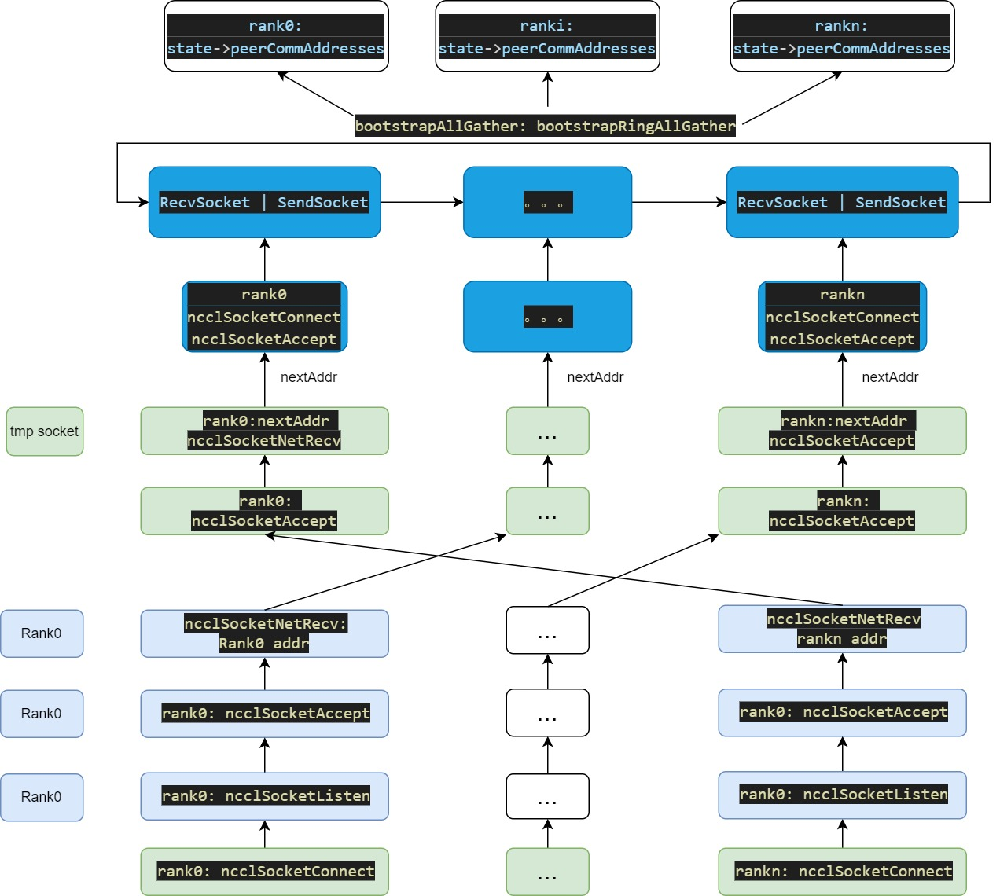

**bootstrap： 引导通信句柄，用于执行 AllGather 交换信息.**

# 0 pytorch 创建ncclComm_t

- **pytorch 测代码**

```c++
std::shared_ptr<NCCLComm> ProcessGroupNCCL::initNCCLComm(
    const std::string& deviceKey,
    at::Device& device,
    OpType opType,
    int p2pRank,
    bool isSendRecvSelf) {
  // Sanity check

  ...

  // To simplify conditional nesting, just create the ncclComms[i]
  // entry if it hasn't been yet rather than untangling the
  // conditions that might have resulted in a split above.
  if (!ncclComm) {
    if (getCvarBool(TORCH_NCCL_BCAST_UNIQUEID, true) && !isSendRecvSelf) {
      // For point-to-point communication, lower rank of the two will get unique
      // id.
      if (rank_ == 0 || (singleP2POp && p2pRank == 0)) {
        C10D_NCCL_CHECK(ncclGetUniqueId(&ncclID), std::nullopt);
      }

      // Broadcast so that each process can have a unique NCCL ID
      auto timeStarted = std::chrono::steady_clock::now();
      broadcastUniqueNCCLID(&ncclID, singleP2POp, deviceKey, p2pRank);
      auto timerDeltaMs =
          std::chrono::duration_cast<std::chrono::duration<double>>(
              std::chrono::steady_clock::now() - timeStarted)
              .count() *
          1000;
      LOG(INFO) << logPrefix()
                << "ProcessGroupNCCL broadcast unique ID through store took "
                << timerDeltaMs << " ms";
    }

#ifdef NCCL_HAS_COMM_NONBLOCKING
    ncclComm =
        NCCLComm::create(numRanks, rank, ncclID, deviceIndex, options_->config);
#else
    // ranks 数量，当前rank, uniqueID, 设备索引
    ncclComm = NCCLComm::create(numRanks, rank, ncclID, deviceIndex);
#endif
  }
}
```

- **NCCL 开始代码:**

- sync: ncclCommInitRank
- async: ncclCommInitRankConfig

```c++
  // method1 : 同步模式
  static std::shared_ptr<NCCLComm> create(
      int numRanks,
      int rank,
      ncclUniqueId commId,
      at::DeviceIndex deviceIndex) {
    at::cuda::OptionalCUDAGuard gpuGuard(deviceIndex);
    auto comm = std::make_shared<NCCLComm>();
    C10D_NCCL_CHECK(
        ncclCommInitRank(&(comm->ncclComm_), numRanks, commId, rank),
        std::nullopt);
    comm->ncclId_ = commId;
    comm->rank_ = rank;
    comm->deviceIndex_ = deviceIndex;
    comm->initialized_ = true;
    // Old style comm is always blocking.
    comm->nonBlocking_ = false;
    return comm;
  }

#ifdef NCCL_HAS_COMM_NONBLOCKING
  // method2 : 异步模式
  static std::shared_ptr<NCCLComm> create(
      int numRanks,
      int rank,
      ncclUniqueId commId,
      at::DeviceIndex deviceIndex,
      ncclConfig_t& config) {
    at::cuda::OptionalCUDAGuard gpuGuard(deviceIndex);
    auto comm = std::make_shared<NCCLComm>();
    comm->nonBlocking_ = config.blocking == 0;
    LOG(INFO) << "Rank " << rank << ": creating NCCL communicator with mode: "
              << (comm->nonBlocking_ ? "nonblocking" : "blocking");
    C10D_NCCL_CHECK_NONBLOCKING(
        ncclCommInitRankConfig(
            &(comm->ncclComm_), numRanks, commId, rank, &config),
        std::nullopt);
    comm->ncclId_ = commId;
    comm->rank_ = rank;
    comm->deviceIndex_ = deviceIndex;
    // Under blocking mode, comm is initialized immediately after NCCL init
    // returns; Under nonblocking mode, we check whether comm is initialized the
    // *next* time ncclComm_ is accessed.
    comm->initialized_ = !comm->nonBlocking_;
    return comm;
  }
```

# 1 准备知识: 相关数据结构

## 1.1 ncclBootstrapHandle

bootstrap 的核心数据结构，是要得到什么信息呢：<br>

```c++
struct ncclBootstrapHandle {
  uint64_t magic;
  union ncclSocketAddress addr;
};
static_assert(sizeof(struct ncclBootstrapHandle) <= sizeof(ncclUniqueId), "Bootstrap handle is too large to fit inside NCCL unique ID");

/*套接字地址信息的结构体 */
/* Common socket address storage structure for IPv4/IPv6 */
union ncclSocketAddress {
  // 当需要同时处理 IPv4 和 IPv6 时，用 sockaddr 指针接收任意地址类型。
  struct sockaddr sa;      // 16 bytes
  // IPv4 地址的存储与配置
  struct sockaddr_in sin;  // 16 bytes
  // IPv6 地址的存储与配置
  struct sockaddr_in6 sin6; // 28 bytes
};

/* Structure describing a generic socket address.
  内存中的实际字节: 02 00 (小端序)
  IPv4 地址 192.168.1.100:56835
  struct sockaddr_in {
  sa_family: 2    // 内存中的实际字节: 02 00 (小端序)
  sin_port:  56835 // 0xDEF1 → 网络字节序: F1 DE
  sin_addr:  16885953 // 0xC0A80164 → 192.168.1.100
  ...
}
**/
struct sockaddr
  {
    // sa_family: 2 bytes
    // 内存中的实际字节: 02 00 (小端序)
    //
    __SOCKADDR_COMMON (sa_);	/* Common data: address family and length.  */
    char sa_data[14];		/* Address data.  */
  };

/* Structure describing an Internet socket address.  */
struct sockaddr_in
  {
    // sin_family: 2 bytes
    __SOCKADDR_COMMON (sin_);
    in_port_t sin_port;			/* Port number.  */
    struct in_addr sin_addr;		/* Internet address.  */

    /* Pad to size of `struct sockaddr'.  */
    unsigned char sin_zero[sizeof (struct sockaddr)
			   - __SOCKADDR_COMMON_SIZE
			   - sizeof (in_port_t)
			   - sizeof (struct in_addr)];
  };

#if !__USE_KERNEL_IPV6_DEFS
/* Ditto, for IPv6.  */
struct sockaddr_in6
  {
    // sin6_family: 2 bytes
    __SOCKADDR_COMMON (sin6_);
    in_port_t sin6_port;	/* Transport layer port # */
    uint32_t sin6_flowinfo;	/* IPv6 flow information */
    struct in6_addr sin6_addr;	/* IPv6 address */
    uint32_t sin6_scope_id;	/* IPv6 scope-id */
  };
#endif /* !__USE_KERNEL_IPV6_DEFS */
```

## 1.2 ncclSocket

NCCL网络通信层的核心结构体，用于封装GPU间通信的网络连接。

```c++

/* 套接字与fd 的对应关系
+----------------+     +--------------------------------+
| 用户进程        |     | 操作系统内核                   |
|                |     |                                |
| ncclSocket.fd = 5 |-->| [进程A的文件描述符表]          |
|                |     |   0: stdin                     |
|                |     |   1: stdout                    |
|                |     |   2: stderr                    |
|                |     |   3: 指向 struct file #123     |
|                |     |   4: 指向 struct file #456     |
|                |     |   5: 指向 struct file #789  <--+
+----------------+     +--------------------------------+
                                 |
                                 v
                         +-----------------+
                         | struct file     |
                         |   f_op: ...     |
                         |   private_data: |
                         |     --> struct socket*  <--+
                         +-----------------+        |
                                                    |
                                                    v
                                            +-----------------+
                                            | struct socket   |
                                            |   state: ESTAB  |
                                            |   sk: ...       |
                                            +-----------------+
**/

struct bootstrapState {
  struct ncclSocket listenSock;
  struct ncclSocket ringRecvSocket;
  struct ncclSocket ringSendSocket;
  union ncclSocketAddress* peerCommAddresses;
  union ncclSocketAddress* peerProxyAddresses;
  uint64_t* peerProxyAddressesUDS;
  struct unexConn* unexpectedConnections;
  int cudaDev;
  int rank;
  int nranks;
  uint64_t magic;
  volatile uint32_t *abortFlag;
};

struct ncclSocket {
  // 监听套接字：套接字文件描述符，标识网络连接的证书
  // 必须认识到它是由操作系统动态分配的资源句柄，而非 NCCL 代码可控制的普通整数
  // 创建套接字并返回其文件对应索引id: int fd = socket(AF_INET, SOCK_STREAM, 0);
  int fd;
  // 已建立连接的通信套接字: 接收连接的文件描述符，专用于服务端
  int acceptFd;
  // 错误重试次数计数器
  int errorRetries;
  // ncclBootstrapHandle.ncclSocketAddress
  union ncclSocketAddress addr;
  // 全局中止标志指针，用于安全终止通信
  // 在 socketPoll 中检查 *abortFlag，若为 1 则立即返回 ncclSuccess，避免阻塞
  // 非破坏性退出：检测到abortFlag 后，函数返回ncclSuccess, 进入安全中止流程
  // 利用已建立的Bootstrap 通信环(在bootstrapInit中创建) 快速传播错误
  // Bootstrap 通信环在初始化阶段已建立，无需新建连接
  //  1000 GPU 集群中，广播延迟 < 50 μs（实测值），远低于 TCP 重传超时（通常 > 100 ms）
  volatile uint32_t* abortFlag;
  // 异步操作标志，标识套接字是否处于异步模式
  // 用于高吞吐场景（如大规模 All-Reduce），避免线程阻塞导致性能下降
  int asyncFlag;
  // socket 的当前状态
  enum ncclSocketState state;
  // 地址结构体的实际长度（socklen_t 的整数表示）
  int salen;
  // 唯一身份标识, 随机自动生成，确保进程仅与所属子组的根节点通信
  uint64_t magic;
  // 套接字的用途类型：初始化、代理等
  // ncclSocketTypeBootstrap：用于通信初始化阶段（如 bootstrapInit）
  // ncclSocketTypeProxy：用于代理服务通信（如 ncclProxyInit）
  enum ncclSocketType type;
  // 自定义重试策略标志，覆盖默认重试逻辑
  // NCCL_OOB_NET_ENABLED 时会导致customRetry被置为1
  // 此时跳过默认重试，改用自定义网络层重试逻辑
  int customRetry;
  // Used to keep track of initial handshake for async sockets.
  // 异步握手阶段的计数器，跟踪初始连接状态
  //  ncclAsyncSocketFinalize 中，通过递减 finalizeCounter 确认双向连接建立完成
  // 解决异步连接中的竞态条件，确保双方同时进入数据传输阶段
  int finalizeCounter;
  // Used to keep track of initial handshake for async sockets.
  // 异步握手缓冲区，用于交换初始同步数据
  // 在ncclAsyncSocketFinalize中, 双方交换随机数(如 getRandomData 生成的8字节值)，验证连接一致性.
  // 防止半开连接，确保通信双方状态同步.
  char finalizeBuffer[sizeof(uint64_t)];
};

// 报错处理机制
// +------------+     +----------------+     +------------+
// | 进程 A     |     | Bootstrap 环   |     | 进程 B-Z   |
// |            |     |                |     |            |
// | 1. 检测错误 | --> | 2. 广播 error=1 | --> | 3. 设置    |
// |  comm->abortFlag=1 |                |     |  comm->abortFlag=1 |
// +------------+     +----------------+     +------------+
//        |                                       ^
//        | 4. RAS 代理广播 (可选)                |
//        +---------------------------------------+
```

# 2 主进程 ncclSocket 服务 的发起

## 2.1 创建ncclUniqueId 时可能发起

如[ncclUniqueID](../ncclUniqueID/README.md) 章节所述:

bootstrapCreateRoot 发起server.

主进程创建完成ncclUniqueId后，还会创建一个**ncclSocket** 监听线程，该线程会监听来自其他进程的连接请求, 该过程在bootstrapCreateRoot 函数中创建。


```c++
ncclResult_t bootstrapGetUniqueId(struct ncclBootstrapHandle* handle) {
  memset(handle, 0, sizeof(ncclBootstrapHandle));

  const char* env = ncclGetEnv("NCCL_COMM_ID");
  if (env) {
    INFO(NCCL_ENV, "NCCL_COMM_ID set by environment to %s", env);
    if (ncclSocketGetAddrFromString(&handle->addr, env) != ncclSuccess) {
      WARN("Invalid NCCL_COMM_ID, please use format: <ipv4>:<port> or [<ipv6>]:<port> or <hostname>:<port>");
      return ncclInvalidArgument;
    }
    handle->magic = NCCL_MAGIC;
  } else {
    NCCLCHECK(getRandomData(&handle->magic, sizeof(handle->magic)));
    memcpy(&handle->addr, &bootstrapNetIfAddr, sizeof(union ncclSocketAddress));
    // rank0 在这里发起server
    NCCLCHECK(bootstrapCreateRoot(handle, false));
  }

  return ncclSuccess;
}
```

## 2.2 创建ncclComm_t 时发起server

- pytorch 的 ncclCommInitRankConfig 或 ncclCommInitRank 中都会调度到 ncclCommInitRankDev

- env = ncclGetEnv("NCCL_COMM_ID") 并且 NCCL_COMM_ID 打开时，同样会发起server.

```c++
static ncclResult_t ncclCommInitRankDev(ncclComm_t* newcomm, int nranks, ncclUniqueId commId, int myrank, int cudaDev, ncclConfig_t *config) {
  ncclResult_t res = ncclSuccess;
  ncclComm_t comm = NULL;
  struct ncclCommInitRankAsyncJob *job = NULL;
  const char* env = ncclGetEnv("NCCL_COMM_ID");
  if (env && myrank == 0) {
    INFO(NCCL_ENV, "NCCL_COMM_ID set by environment to %s", env);
    NCCLCHECKGOTO(bootstrapCreateRoot((struct ncclBootstrapHandle*)&commId, true), res, fail);
  }

  NCCLCHECKGOTO(ncclInit(), res, fail);
  if (myrank == 0) showVersion();

  // Make sure the CUDA runtime is initialized.
  CUDACHECKGOTO(cudaFree(NULL), res, fail);

  NCCLCHECKGOTO(PtrCheck(newcomm, "CommInitRank", "newcomm"), res, fail);
  NCCLCHECKGOTO(PtrCheck(config, "CommInitRank", "config"), res, fail);
  if (nranks < 1 || myrank < 0 || myrank >= nranks) {
    WARN("Invalid rank requested : %d/%d", myrank, nranks);
    res = ncclInvalidArgument;
    goto fail;
  }

  NCCLCHECKGOTO(ncclCalloc(&comm, 1), res, fail);
  comm->startMagic = comm->endMagic = NCCL_MAGIC; // Used to detect comm corruption.
  NCCLCHECKGOTO(ncclCudaHostCalloc((uint32_t**)&comm->abortFlag, 1), res, fail);
  NCCLCHECKGOTO(ncclCalloc((uint32_t**)&comm->abortFlagRefCount, 1), res, fail);
  *comm->abortFlagRefCount = 1;
  NCCLCHECKGOTO(parseCommConfig(comm, config), res, fail);
  /* start with ncclInternalError and will be changed to ncclSuccess if init succeeds. */
  comm->initState = ncclInternalError;
  *newcomm = comm;

  NCCLCHECKGOTO(ncclCalloc(&job, 1), res, fail);
  job->comm = comm;
  job->nranks = nranks;
  job->commId = commId; // C++ struct assignment
  job->myrank = myrank;
  job->cudaDev = cudaDev;
  NCCLCHECKGOTO(ncclAsyncLaunch(&job->base, ncclCommInitRankFunc, NULL, free, comm), res, fail);

exit:
  return ncclGroupErrCheck(res);
fail:
  if (comm) {
    if (comm->abortFlag) ncclCudaHostFree((void *)comm->abortFlag);
    if (comm->abortFlagRefCount) free(comm->abortFlagRefCount);
    free(comm);
  }
  if (newcomm) *newcomm = NULL;
  goto exit;
}
```

## 2.3 最终 rank0: bootstrapCreateRoot 发起监听

- 线程内执行bootstrapRoot

```c++
ncclResult_t bootstrapCreateRoot(struct ncclBootstrapHandle* handle, bool idFromEnv) {
  ncclResult_t ret = ncclSuccess;
  struct ncclSocket* listenSock = NULL;  // 用于监听客户端连接的套接字
  struct bootstrapRootArgs* args = NULL; // 传递给线程的参数结构体
  pthread_t thread;                      // 线程标识符，用于管理线程生命周期

  NCCLCHECK(ncclCalloc(&listenSock, 1));
  // NULL 0 : 未设置超时和终止标志（根节点需长期监听）
  // handle->magic：根节点的唯一身份标识（在 bootstrapGetUniqueId 中生成的随机值）
  // 不同根节点使用不同的 magic 值，确保进程只与归属的根节点通信，避免跨子组干扰
  // 这是多根初始化的需求
  NCCLCHECKGOTO(ncclSocketInit(listenSock, &handle->addr, handle->magic, ncclSocketTypeBootstrap, NULL, 0), ret, fail);
  // 启动监听 : 将套接字切换到监听模式，等待其他进程的连接请求。
  // 调用底层系统 listen() 函数完成监听任务
  NCCLCHECKGOTO(ncclSocketListen(listenSock), ret, fail);
  // 操作系统实际分配的监听地址: 如 192.168.1.1:54321
  NCCLCHECKGOTO(ncclSocketGetAddr(listenSock, &handle->addr), ret, fail);

  NCCLCHECKGOTO(ncclCalloc(&args, 1), ret, fail);
  args->listenSock = listenSock;
  args->magic = handle->magic;
  PTHREADCHECKGOTO(pthread_create(&thread, NULL, bootstrapRoot, (void*)args), "pthread_create", ret, fail);
  ncclSetThreadName(thread, "NCCL BootstrapR");
  PTHREADCHECKGOTO(pthread_detach(thread), "pthread_detach", ret, fail); // will not be pthread_join()'d
exit:
  return ret;
fail:
  if (listenSock) free(listenSock);
  if (args) free(args);
  goto exit;
}
```

## 2.4 rank0: bootstrapRoot

- 发起 nranks 个ncclSocketAccept 接收口 : while (c < nranks)
- 根进程会依次连接到每个rank（通过rankAddressesRoot数组中的地址），然后向每个rank发送该rank在环中的下一个rank的地址.

```c++
// third_party/nccl/nccl/src/bootstrap.cc
static void *bootstrapRoot(void* rargs) {
  struct bootstrapRootArgs* args = (struct bootstrapRootArgs*)rargs;
  struct ncclSocket* listenSock = args->listenSock;
  uint64_t magic = args->magic;
  ncclResult_t res = ncclSuccess;
  int nranks = 0, c = 0;
  struct extInfo info;
  // 用于存储所有rank的地址信息
  union ncclSocketAddress *rankAddresses = NULL;
  // rankAddressesRoot 用来存储从各个rank接收到的地址信息的
  // root会将这些地址整合到 rankAddresses 中，
  // 最后通过all-gather操作（或类似的方式）将 rankAddresses 分发给所有rank
  union ncclSocketAddress *rankAddressesRoot = NULL; // for initial rank <-> root information exchange
  union ncclSocketAddress *zero = NULL;
  NCCLCHECKGOTO(ncclCalloc(&zero, 1), res, out);
  setFilesLimit();

  TRACE(NCCL_INIT, "BEGIN");
  /* Receive addresses from all ranks */
  do {
    struct ncclSocket sock;
    NCCLCHECKGOTO(ncclSocketInit(&sock), res, out);
    NCCLCHECKGOTO(ncclSocketAccept(&sock, listenSock), res, out);
    // 专门用于接收来自其他进程的网络连接信息
    // 接收其他 GPU 节点的 IP 地址、端口号、设备标识符 等网络参数，用于后续建立直接通信通道（如 TCP 或 InfiniBand 连接）。
    // 接收的数据类型是: struct extInfo
    NCCLCHECKGOTO(bootstrapNetRecv(&sock, &info, sizeof(info)), res, out);
    NCCLCHECKGOTO(ncclSocketClose(&sock), res, out);

    if (c == 0) {
      nranks = info.nranks;
      NCCLCHECKGOTO(ncclCalloc(&rankAddresses, nranks), res, out);
      NCCLCHECKGOTO(ncclCalloc(&rankAddressesRoot, nranks), res, out);
    }

    if (nranks != info.nranks) {
      WARN("Bootstrap Root : mismatch in rank count from procs %d : %d", nranks, info.nranks);
      goto out;
    }

    if (memcmp(zero, &rankAddressesRoot[info.rank], sizeof(union ncclSocketAddress)) != 0) {
      WARN("Bootstrap Root : rank %d of %d ranks has already checked in", info.rank, nranks);
      goto out;
    }

    // Save the connection handle for that rank
    memcpy(rankAddressesRoot+info.rank, &info.extAddressListenRoot, sizeof(union ncclSocketAddress));
    memcpy(rankAddresses+info.rank, &info.extAddressListen, sizeof(union ncclSocketAddress));

    ++c;
    TRACE(NCCL_INIT, "Received connect from rank %d total %d/%d",  info.rank, c, nranks);
  } while (c < nranks);
  TRACE(NCCL_INIT, "COLLECTED ALL %d HANDLES", nranks);

  // Send the connect handle for the next rank in the AllGather ring
  // 在根节点上为所有 rank 构建一个单向环状通信拓扑，用于后续的 AllGather 操作
  for (int r=0; r<nranks; ++r) {
    // 计算环中的下一个 rank（最后一个 rank 的下一个是 rank 0）
    int next = (r+1) % nranks;
    struct ncclSocket sock;
    // 初始化 socket 连接到当前 rank r
    NCCLCHECKGOTO(ncclSocketInit(&sock, rankAddressesRoot+r, magic, ncclSocketTypeBootstrap), res, out);
    // 连接到 rank r
    NCCLCHECKGOTO(ncclSocketConnect(&sock), res, out);
    // 关键：告诉 rank r，它在环中的下一个邻居是 rank "next"
    // 发送的是 rank "next" 的地址信息
    // 根进程会依次连接到每个rank（通过rankAddressesRoot数组中的地址），然后向每个rank发送该rank在环中的下一个rank的地址
    NCCLCHECKGOTO(bootstrapNetSend(&sock, rankAddresses+next, sizeof(union ncclSocketAddress)), res, out);
    NCCLCHECKGOTO(ncclSocketClose(&sock), res, out);
  }
  TRACE(NCCL_INIT, "SENT OUT ALL %d HANDLES", nranks);

out:
  if (listenSock != NULL) {
    ncclSocketClose(listenSock);
    free(listenSock);
  }
  if (rankAddresses) free(rankAddresses);
  if (rankAddressesRoot) free(rankAddressesRoot);
  if (zero) free(zero);
  free(rargs);

  TRACE(NCCL_INIT, "DONE");
  return NULL;
}
```

# 3 client 端是如何连接 server 端的呢？


| 维度 | bootstrapInit | initTransportsRank |
| ---- | ---- | ---- |
| **核心职责** | 建立初始控制通信通道（Bootstrap网络） | 初始化用于GPU数据交换的传输层 |
| **通信类型** | 基于TCP/IP的Socket通信，处理控制信息 | 优先使用高性能网络（如InfiniBand），并支持GPU Direct RDMA (GDR) 直接传输 |
| **主要任务** | <ol><li>所有Rank向Rank 0注册</li><li>Rank 0构建环形拓扑并分发邻居地址</li><li>完成AllGather，使所有Rank知晓全局地址</li></ol> | <ol><li>收集所有Rank的硬件信息（如PCIe总线ID）</li><li>分析机器内拓扑（GPU、NVLink、网卡等连接关系）</li><li>基于拓扑信息，建立Rank间点对点传输连接</li></ol> |
| **阶段** | 前置的引导阶段，为后续通信搭建"信使"通道 | 核心的数据传输准备阶段，规划并建设"数据高速公路" |
| **输出结果** | 一个可用于集合通信的Bootstrap状态句柄 (comm->bootstrap) | 完整的通信器 (ncclComm)，包含所有数据传输所需的资源与路径信息 |


## 3.1 clinent 端和 server 端都会执行 ncclComm_t 创建

**所有rank pytorch 侧创建 ncclComm_t : 通过ncclCommInitRank 和 ncclCommInitRankConfig 开始nccl调用过程**

**ncclCommInitRank:** <br>
- 这是 NCCL 的基础 API。
- 它只接受最基本的参数：通信器指针、进程总数 (numRanks)、当前进程的秩 (rank) 和一个全局唯一的 ncclUniqueId。
- 它创建的是一个标准的、**阻塞模式**的通信器。

**ncclCommInitRankConfig:** <br>
- 这是一个更高级的 API，允许在初始化时进行详细的配置。
- 它除了接受 ncclCommInitRank 的所有参数外，还额外接受一个指向 ncclConfig_t 结构体的指针。
- ncclConfig_t 结构体包含了多种配置选项，最显著的是可以指定通信器的工作模式：
  - 阻塞模式 (Blocking): 默认行为，调用会一直阻塞直到通信器完全初始化。
  - 非阻塞模式 (Non-blocking): 调用会立即返回，即使通信器尚未完成初始化。这允许应用程序在后台进行其他工作，同时通过 ncclCommGetAsyncError() 等函数轮询通信器的状态。
- 因此，ncclCommInitRankConfig 提供了更大的灵活性，特别是在需要重叠通信初始化与计算或其他 I/O 操作以提高性能的场景下。

```c++
  // pytorch 代码
  static std::shared_ptr<NCCLComm> create(
      int numRanks,
      int rank,
      ncclUniqueId commId,
      at::DeviceIndex deviceIndex) {
    at::cuda::OptionalCUDAGuard gpuGuard(deviceIndex);
    auto comm = std::make_shared<NCCLComm>();
    C10D_NCCL_CHECK(
        ncclCommInitRank(&(comm->ncclComm_), numRanks, commId, rank),
        std::nullopt);
    comm->ncclId_ = commId;
    comm->rank_ = rank;
    comm->deviceIndex_ = deviceIndex;
    comm->initialized_ = true;
    // Old style comm is always blocking.
    comm->nonBlocking_ = false;
    return comm;
  }

#ifdef NCCL_HAS_COMM_NONBLOCKING
  static std::shared_ptr<NCCLComm> create(
      int numRanks,
      int rank,
      ncclUniqueId commId,
      at::DeviceIndex deviceIndex,
      ncclConfig_t& config) {
    at::cuda::OptionalCUDAGuard gpuGuard(deviceIndex);
    auto comm = std::make_shared<NCCLComm>(); // typedef struct ncclComm* ncclComm_t;
    comm->nonBlocking_ = config.blocking == 0;
    LOG(INFO) << "Rank " << rank << ": creating NCCL communicator with mode: "
              << (comm->nonBlocking_ ? "nonblocking" : "blocking");
    C10D_NCCL_CHECK_NONBLOCKING(
        ncclCommInitRankConfig(
            &(comm->ncclComm_), numRanks, commId, rank, &config),
        std::nullopt);
    comm->ncclId_ = commId;
    comm->rank_ = rank;
    comm->deviceIndex_ = deviceIndex;
    // Under blocking mode, comm is initialized immediately after NCCL init
    // returns; Under nonblocking mode, we check whether comm is initialized the
    // *next* time ncclComm_ is accessed.
    comm->initialized_ = !comm->nonBlocking_;
    return comm;
  }
```

如上代码所示，创建ncclComm_t 时，最核心的函数是:**ncclCommInitRank 和 ncclCommInitRankConfig**, 无论那条路径都会调度到: **ncclCommInitRankDev**, 之后无论是否是主进程都会调度 **ncclCommInitRankFunc**. <br>

## 3.2 开始通信组的初始化(ncclCommInitRankFunc)

- rank0 的服务器也可能在这里启动；
- ncclCommInitRankFunc 函数会异步启动，并在后台完成通信器的初始化；

### 3.2.1 ncclCommInitRankFunc 初始化总体逻辑

```c++
static ncclResult_t ncclCommInitRankFunc(struct ncclAsyncJob* job_) {
  struct ncclCommInitRankAsyncJob* job = (struct ncclCommInitRankAsyncJob*)job_;
  ncclComm_t comm = job->comm;
  ncclResult_t res = ncclSuccess;
  int archMajor, archMinor;
  size_t maxLocalSizeBytes = 0;
  int cudaDev = job->cudaDev;
  int* parentRanks = NULL;
  int cudaArch;
  int maxSharedMem = 0;
  double sum_timers = 0;
  uint64_t timers[TIMERS_INIT_COUNT] = {0};
  unsigned long long commIdHash;

  timers[TIMER_INIT_TOTAL] = clockNano();
  CUDACHECKGOTO(cudaSetDevice(cudaDev), res, fail);
  // 当前GPU 单个SM 的物理共享内存上限， Volta/Ampere 架构中，每个 SM 的共享内存为 96KB 或 100KB
  CUDACHECKGOTO(cudaDeviceGetAttribute(&maxSharedMem, cudaDevAttrMaxSharedMemoryPerBlockOptin, cudaDev), res, fail);
  CUDACHECKGOTO(cudaDeviceGetAttribute(&archMajor, cudaDevAttrComputeCapabilityMajor, cudaDev), res, fail);
  CUDACHECKGOTO(cudaDeviceGetAttribute(&archMinor, cudaDevAttrComputeCapabilityMinor, cudaDev), res, fail);
  cudaArch = 100*archMajor + 10*archMinor;

  timers[TIMER_INIT_KERNELS] = clockNano();
  NCCLCHECK(ncclInitKernelsForDevice(cudaArch, maxSharedMem, &maxLocalSizeBytes));
  // Set the maximum kernel stack size of all kernels to avoid
  // a CUDA memory reconfig on load (c.f. NVSHMEM issue)
  if (maxLocalSizeBytes > 0 && ncclParamSetStackSize() == 1) {
    TRACE(NCCL_INIT, "Setting cudaLimitStackSize to %zu", maxLocalSizeBytes);
    CUDACHECKIGNORE(cudaDeviceSetLimit(cudaLimitStackSize, maxLocalSizeBytes));
  }
  timers[TIMER_INIT_KERNELS] = clockNano() - timers[TIMER_INIT_KERNELS];

  if (job->parent) {
    NCCLCHECKGOTO(ncclCalloc(&parentRanks, job->parent->nRanks), res, fail);
    if (job->excludeRanksCount) {
      NCCLCHECKGOTO(getParentRanks(job->parent->nRanks, job->parent->rank, job->excludeRanksList, job->excludeRanksCount, &job->nranks, &job->myrank, parentRanks), res, fail);
    } else {
      NCCLCHECKGOTO(commGetSplitInfo(comm, job->parent, job->color, job->key, &job->nranks, &job->myrank, parentRanks), res, fail);
      // Negative color does not create a new comm object. We needed to take part in the allgather, but we're done now.
      if (job->color == NCCL_SPLIT_NOCOLOR) goto exit;
    }
    // child hash obtained from (parent hash, split count, color)
    uint64_t hacc[2] = {1, 1};
    eatHash(hacc, &job->parent->commHash);
    eatHash(hacc, &job->splitCount);
    eatHash(hacc, &job->color);
    comm->commHash = digestHash(hacc);
    timers[TIMER_INIT_ALLOC] = clockNano();
    NCCLCHECKGOTO(commAlloc(comm, job->parent, job->nranks, job->myrank), res, fail);
    timers[TIMER_INIT_ALLOC] = clockNano() - timers[TIMER_INIT_ALLOC];
    INFO(NCCL_INIT, "%s comm %p rank %d nranks %d cudaDev %d nvmlDev %d busId %lx parent %p splitCount %d color %d key %d- Init START", job->funcName,
         comm, comm->rank, comm->nRanks, comm->cudaDev, comm->nvmlDev, comm->busId, job->parent, job->splitCount, job->color, job->key);
    timers[TIMER_INIT_BOOTSTRAP] = clockNano();
    NCCLCHECKGOTO(bootstrapSplit(comm->commHash, comm, job->parent, job->color, job->key, parentRanks), res, fail);
    timers[TIMER_INIT_BOOTSTRAP] = clockNano() - timers[TIMER_INIT_BOOTSTRAP];
    // debug info, no commId was used
    commIdHash = 0;
  } else {
    // obtain a unique hash using the first commId
    // ncclUniqueID 其实就是ncclBootstrapHandle. commId : ncclBootstrapHandle
    // typedef struct { char internal[NCCL_UNIQUE_ID_BYTES]; } ncclUniqueId;
    // typedef struct ncclComm* ncclComm_t;
    comm->commHash = commIdHash = getHash(job->commId->internal, NCCL_UNIQUE_ID_BYTES);
    timers[TIMER_INIT_ALLOC] = clockNano();
    // 初始化comm
    NCCLCHECKGOTO(commAlloc(comm, NULL, job->nranks, job->myrank), res, fail);
    timers[TIMER_INIT_ALLOC] = clockNano() - timers[TIMER_INIT_ALLOC];
    INFO(NCCL_INIT, "%s comm %p rank %d nranks %d cudaDev %d nvmlDev %d busId %lx commId 0x%llx - Init START", job->funcName,
         comm, comm->rank, comm->nRanks, comm->cudaDev, comm->nvmlDev, comm->busId, commIdHash);
    timers[TIMER_INIT_BOOTSTRAP] = clockNano();
    //
    NCCLCHECKGOTO(bootstrapInit(job->nId, (struct ncclBootstrapHandle*)job->commId, comm), res, fail);
    timers[TIMER_INIT_BOOTSTRAP] = clockNano() - timers[TIMER_INIT_BOOTSTRAP];
  }
  comm->cudaArch = cudaArch;

  NCCLCHECKGOTO(initTransportsRank(comm, job->parent, timers), res, fail);

  // update communicator state
  comm->initState = ncclSuccess;
  timers[TIMER_INIT_TOTAL] = clockNano() - timers[TIMER_INIT_TOTAL];

  // Trace this call for replay tool
  if (job->parent) {
    /* unlink child abort flag. */
    __atomic_store_n(&job->parent->childAbortFlag, NULL, __ATOMIC_RELEASE);
    TRACE_CALL("ncclCommSplit(%p, %d, %d, %p, %d, %d)", job->parent, job->color, job->key, comm, comm->rank, comm->nRanks);
    INFO(NCCL_INIT, "%s comm %p rank %d nranks %d cudaDev %d nvmlDev %d busId %lx parent %p splitCount %d color %d key %d - Init COMPLETE", job->funcName,
         comm, comm->rank, comm->nRanks, comm->cudaDev, comm->nvmlDev, comm->busId, job->parent, job->splitCount, job->color, job->key);
  } else {
    // the name for the replay tool is ncclCommInitRank for all the variations
    TRACE_CALL("ncclCommInitRank(%p, %d, 0x%llx, %d, %d)", comm, comm->nRanks, commIdHash, comm->rank, comm->cudaDev);
    INFO(NCCL_INIT, "%s comm %p rank %d nranks %d cudaDev %d nvmlDev %d busId %lx commId 0x%llx - Init COMPLETE", job->funcName,
         comm, comm->rank, comm->nRanks, comm->cudaDev, comm->nvmlDev, comm->busId, commIdHash);
  }
  sum_timers = 0.0;
  for (int it = 1; it < TIMERS_INIT_COUNT; ++it)
    sum_timers += (timers[it] / 1e9);
  INFO(NCCL_INIT | NCCL_PROFILE,
       "Init timings - %s: rank %d nranks %d total %.2f (kernels %.2f, alloc %.2f, bootstrap %.2f, allgathers %.2f, topo %.2f, graphs %.2f, "
       "connections %.2f, rest %.2f)",
       job->funcName, comm->rank, comm->nRanks,
       timers[TIMER_INIT_TOTAL] / 1e9, timers[TIMER_INIT_KERNELS] / 1e9, timers[TIMER_INIT_ALLOC] / 1e9,
       timers[TIMER_INIT_BOOTSTRAP] / 1e9, timers[TIMER_INIT_ALLGATHER] / 1e9, timers[TIMER_INIT_TOPO] / 1e9,
       timers[TIMER_INIT_GRAPHS] / 1e9, timers[TIMER_INIT_CONNECT] / 1e9, timers[TIMER_INIT_TOTAL] / 1e9 - sum_timers);
exit:
  if (job->newcomm) {
    /* assign it to user pointer. */
    __atomic_store_n(job->newcomm, comm, __ATOMIC_RELEASE);
  }
  free(parentRanks);
  return res;
fail:
  comm->initState = res;
  goto exit;
}
```

## 3.3 bootstrapInit 是个核心过程

bootstrapInit 是 NCCL 初始化过程中建立进程间控制通道的核心步骤，它利用 UniqueId 作为“通信种子”，通过轻量级 TCP 连接实现进程间初始握手，为后续的 GPU 直接通信（如 NVLink/IB）奠定基础。这一设计使 NCCL 能在无 MPI 环境下独立工作，同时保持与 MPI 的兼容

bootstrapInit 是 NCCL 中负责**初始化通信组引导(strap)过程**的核心函数，其作用是**建立节点间的初始通信网络**。 <br>

**bootstrapInit流程：** <br>
1. 创建两个监听Socket
   ├── state->listenSock (长期) ← 用于环形通信
   └── listenSockRoot (临时)    ← 用于接收root指令

2. 向root注册自己的两个地址

3. 通过listenSockRoot接收下一个邻居地址 ← 临时Socket使用

4. 关闭listenSockRoot ← 临时Socket使命完成

5. 使用state->listenSock建立环形连接 ← 长期Socket持续服务




```c++
ncclResult_t bootstrapInit(struct ncclBootstrapHandle* handle, struct ncclComm* comm) {
  int rank = comm->rank;
  int nranks = comm->nRanks;
  struct bootstrapState* state;
  struct ncclSocket* proxySocket;
  ncclSocketAddress nextAddr;
  struct ncclSocket sock, listenSockRoot; // 临时用套接字
  struct extInfo info = { 0 };

  // 分配并初始化bootstrap状态结构体
  NCCLCHECK(ncclCalloc(&state, 1));
  state->rank = rank;
  state->nranks = nranks;
  state->abortFlag = comm->abortFlag;
  // 初始化comm 的bootstrap状态
  comm->bootstrap = state;
  // 初始化comm 的 unique id
  comm->magic = state->magic = handle->magic;

  TRACE(NCCL_INIT, "rank %d nranks %d", rank, nranks);

  // 设置当前rank的基本信息
  info.rank = rank;
  info.nranks = nranks;

  // 第一个：主监听Socket（长期存在）: 创建监听socket，供其他rank连接（用于环形通信）
  // 接受环形拓扑中前一个rank的连接请求, 用于后续的AllGather操作和rank间数据交换, 是构建通信环的基础设施
  // 为当前rank创建一个网络通信端点, 设置正确的网络接口和协议类型, 使用magic值确保只有合法的NCCL进程可以连接
  NCCLCHECK(ncclSocketInit(&state->listenSock, &bootstrapNetIfAddr, comm->magic, ncclSocketTypeBootstrap, comm->abortFlag));
  // 使Socket进入被动监听状态，可以接受传入连接
  NCCLCHECK(ncclSocketListen(&state->listenSock));
  // copy listenSock to info.extAddressListen,
  // 获取Socket绑定后的实际地址（特别是动态分配的端口号）
  NCCLCHECK(ncclSocketGetAddr(&state->listenSock, &info.extAddressListen));

  // 第二个：Root专用监听Socket（临时使用）
  // 专门用于接收root rank发送的下一个邻居地址, 只在bootstrap初始化阶段使用, 完成后立即关闭释放资源
  // 监听前：只知道大概的地址信息（IP、协议等）
  NCCLCHECK(ncclSocketInit(&listenSockRoot, &bootstrapNetIfAddr, comm->magic, ncclSocketTypeBootstrap, comm->abortFlag));
  // 系统实际绑定到某个端口
  NCCLCHECK(ncclSocketListen(&listenSockRoot));
  // 监听后：系统分配了具体的端口号，需要获取完整地址
  NCCLCHECK(ncclSocketGetAddr(&listenSockRoot, &info.extAddressListenRoot));

  // 大集群优化：当rank数量超过128时，错开连接时间避免root rank过载
  if (nranks > 128) {
    long msec = rank;  // 每个rank延迟的时间与其rank号成正比
    struct timespec tv;
    tv.tv_sec = msec / 1000;
    tv.tv_nsec = 1000000 * (msec % 1000);
    TRACE(NCCL_INIT, "rank %d delaying connection to root by %ld msec", rank, msec);
    (void) nanosleep(&tv, NULL);
  }

  /********************* stage 1 **************************
  阶段1：向root rank注册当前rank的信息
        连接root并发送包含监听地址的info结构体
    bootstrap.cc : bootstrapCreateRoot 发起监听
      NCCLCHECK(ncclCalloc(&listenSock, 1));
      NCCLCHECK(ncclSocketInit(listenSock, &handle->addr, handle->magic, ncclSocketTypeBootstrap, NULL, 0));
      NCCLCHECK(ncclSocketListen(listenSock));
      NCCLCHECK(ncclSocketGetAddr(listenSock, &handle->addr));

    bootstrap.cc : bootstrapRoot 里接收数据
      struct ncclSocket sock;
      NCCLCHECKGOTO(ncclSocketInit(&sock), res, out);
      NCCLCHECKGOTO(ncclSocketAccept(&sock, listenSock), res, out);
      NCCLCHECKGOTO(bootstrapNetRecv(&sock, &info, sizeof(info)), res, out);
      NCCLCHECKGOTO(ncclSocketClose(&sock), res, out);
  **/

  NCCLCHECK(ncclSocketInit(&sock, &handle->addr, comm->magic, ncclSocketTypeBootstrap, comm->abortFlag));
  // connect : client connect to root
  NCCLCHECK(ncclSocketConnect(&sock));
  // send : send info to root 发送当前rank 的信息给root
  NCCLCHECK(bootstrapNetSend(&sock, &info, sizeof(info)));
  NCCLCHECK(ncclSocketClose(&sock));

  // ******************** stage 2 **************************

  /* 阶段2：从root rank接收环形拓扑中下一个rank的地址信息
           等待root连接并接收下一个邻居的地址

           listen 发起是上述当前rank 发起的，这里是接收过程，

           listen 的发起和接收要在同一个 rank 完成
  **/

  NCCLCHECK(ncclSocketInit(&sock));
  NCCLCHECK(ncclSocketAccept(&sock, &listenSockRoot));
  NCCLCHECK(bootstrapNetRecv(&sock, &nextAddr, sizeof(union ncclSocketAddress)));
  // 两个socket 都关闭
  NCCLCHECK(ncclSocketClose(&sock));
  NCCLCHECK(ncclSocketClose(&listenSockRoot));

  // 阶段3：建立环形通信连接
  // 连接到环形拓扑中的下一个rank，nextAddr 是上面刚接收到的
  NCCLCHECK(ncclSocketInit(&state->ringSendSocket, &nextAddr, comm->magic, ncclSocketTypeBootstrap, comm->abortFlag));
  // 连接到前一个rank，即环形拓扑中的前一个rank
  NCCLCHECK(ncclSocketConnect(&state->ringSendSocket));

  // 接受环形拓扑中前一个rank的连接请求
  NCCLCHECK(ncclSocketInit(&state->ringRecvSocket));
  NCCLCHECK(ncclSocketAccept(&state->ringRecvSocket, &state->listenSock));

  // 阶段4：AllGather操作 - 收集所有rank的通信地址
  // 分配存储所有rank地址的数组
  NCCLCHECK(ncclCalloc(&state->peerCommAddresses, nranks));
  // 直接获取本rank的地址并存入对应位置
  NCCLCHECK(ncclSocketGetAddr(&state->listenSock, state->peerCommAddresses+rank));
  // 执行AllGather，所有rank交换通信地址
  NCCLCHECK(bootstrapAllGather(state, state->peerCommAddresses, sizeof(union ncclSocketAddress)));

  // 阶段5：初始化代理服务（用于异步通信管理）
  // 分配常规代理地址数组
  NCCLCHECK(ncclCalloc(&state->peerProxyAddresses, nranks));
  // 分配UDS代理地址数组
  NCCLCHECK(ncclCalloc(&state->peerProxyAddressesUDS, nranks));

  // 创建代理监听socket（代理有自己的错误处理机制，不使用abortFlag）
  NCCLCHECK(ncclCalloc(&proxySocket, 1));
  NCCLCHECK(ncclSocketInit(proxySocket, &bootstrapNetIfAddr, comm->magic, ncclSocketTypeProxy, comm->abortFlag));
  NCCLCHECK(ncclSocketListen(proxySocket));
  // 获取代理地址并执行AllGather
  NCCLCHECK(ncclSocketGetAddr(proxySocket, state->peerProxyAddresses+rank));
  NCCLCHECK(bootstrapAllGather(state, state->peerProxyAddresses, sizeof(union ncclSocketAddress)));

  // 为cuMem UDS支持生成唯一的socket名称
  // 使用PID哈希和随机数确保唯一性
  uint64_t randId;
  NCCLCHECK(getRandomData(&randId, sizeof(randId)));
  state->peerProxyAddressesUDS[rank] = getPidHash()+randId;
  NCCLCHECK(bootstrapAllGather(state, state->peerProxyAddressesUDS, sizeof(*state->peerProxyAddressesUDS)));

  // 初始化代理服务
  NCCLCHECK(ncclProxyInit(comm, proxySocket, state->peerProxyAddresses, state->peerProxyAddressesUDS));

  TRACE(NCCL_INIT, "rank %d nranks %d - DONE", rank, nranks);

  return ncclSuccess;
}
```

**proxySocket 代理**

上述代码最后为每个rank创建了proxySocket 并对所有rank的proxySocket 进行了Allgather. Service Proxy是NCCL中用于管理**异步通信和资源协调**的重要机制。

代理具体功能：
1. 异步操作管理
- 非阻塞的集合通信
- 后台数据传输
- 资源清理和回收

2. 连接管理和复用
- 代理**维护连接池**，避免频繁建立和断开连接；
- 提高通信效率，减少连接开销

3. 错误处理和恢复
- 代理有独立的错误处理机制，通过消息通知中止；
- 不直接使用abortFlag，提供更优雅的错误恢复.

```shell
Rank 0 ───── Proxy 0 ──────┐
Rank 1 ───── Proxy 1 ───────┼─── 代理网络
Rank 2 ───── Proxy 2 ──────┘
    ↓               ↓
数据平面          控制平面
(直接通信)       (代理协调)
```

## 3.4 initTransportsRank

initTransportsRank 是 NCCL 库在初始化通信器 (ncclCommInitRank) 过程中的一个核心且关键的内部函数。它的名字直译就是“初始化传输层（对于某个）Rank”。

简单来说，它的核心作用是：为当前进程（Rank）建立与**其他所有进程（Ranks）**进行点对点（P2P）数据通信的`物理路径和抽象连接`。

如果说 NCCL 的拓扑发现是“画地图”，那么 initTransportsRank 就是根据这张地图去“修路”。没有它，GPU 之间就无法进行高效的集合通信。

