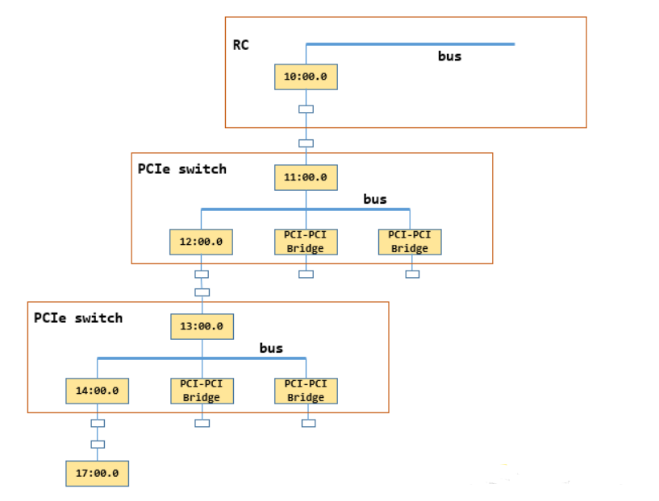

# 0 initTransportsRank

bootstrap 最后是一个initTransportsRank 过程，旨在构建全部ranks 间的传输层。其逻辑代码较长，本问分段分析。

initTransportsRank 负责**在NCCL通信器初始化过程**中设置传输层(transports)，包括拓扑发现、通道分配、连接建立等关键步骤。

**主要功能模块** <br>
```c++
// 获取系统拓扑信息
NCCLCHECKGOTO(ncclTopoGetSystem(comm, &comm->topo), ret, fail);
// 计算GPU和NIC之间的路径
NCCLCHECKGOTO(ncclTopoComputePaths(comm->topo, comm), ret, fail);
// 修剪不可访问的GPU和未使用的NIC
NCCLCHECKGOTO(ncclTopoTrimSystem(comm->topo, comm), ret, fail);
```

**CPU亲和性设置** <br>
```c++
// 设置CPU亲和性到本地GPU
NCCLCHECKGOTO(ncclTopoGetCpuAffinity(comm->topo, comm->rank, &comm->cpuAffinity), ret, fail);
```

**多种通信拓扑图计算** <br>
- Ring Graph（环状拓扑）：用于AllReduce等集体操作
- Tree Graph（树状拓扑）：用于**广播**等操作
- CollNet Graph：用于集合通信网络
- NVLS Graph：用于NVLink SHARP

**三级AllGather操作** <br>

# 1 基本变量

**不同的拓扑图** <br>

```c++
  struct ncclTopoGraph ringGraph;
  struct ncclTopoGraph treeGraph;
  struct ncclTopoGraph collNetGraph;
  struct ncclTopoGraph nvlsGraph;
  struct ncclTopoGraph* graphs[] = { &treeGraph, &ringGraph, &collNetGraph, &collNetGraph, &nvlsGraph, &nvlsGraph };
```

**管理NCCL通信初始化过程中各个rank（进程）之间的网络连接建立和状态信息**

```c++
struct bootstrapState {
  struct ncclSocket listenSock;                // 监听socket，接受其他进程连接
  struct ncclSocket ringRecvSocket;            // 环状通信接收socket
  struct ncclSocket ringSendSocket;            // 环状通信发送socket
  union ncclSocketAddress* peerCommAddresses;  // 所有对等进程的通信地址
  union ncclSocketAddress* peerProxyAddresses; // 所有对等进程的代理地址
  uint64_t* peerProxyAddressesUDS;             // UDS（Unix Domain Socket）代理地址
  struct unexConn* unexpectedConnections;      // 未预期连接管理
  int cudaDev;                                 // CUDA设备ID
  int rank;                                    // 当前进程的rank（0到nranks-1）
  int nranks;                                  // 总进程数
  uint64_t magic;                              // UniqueId : 验证连接合法性
  volatile uint32_t *abortFlag;                // 中止标志指针（volatile确保可见性）
};
```

**存储和管理集群中其他GPU节点的信息(allGather 的对象)**

```c++
struct ncclPeerInfo {
  int rank;                          // 节点在通信组中的排名（全局唯一标识）
  int cudaDev;                       // CUDA设备ID（在本节点中的设备编号）
  int nvmlDev;                       // NVML设备ID（用于GPU管理）
  int gdrSupport;                    // 是否支持GPUDirect RDMA（直接内存访问）
  uint64_t hostHash;                 // 主机名的哈希值，用于识别不同物理主机
  uint64_t pidHash;                  // 进程ID的哈希值，用于识别不同进程
  dev_t shmDev;                      // 共享内存设备ID，用于进程间通信
  int64_t busId;                     // PCIe总线ID，标识GPU的物理位置, lspci可查看：0001:05:02.3（域 0001，总线 05，设备 02，功能 3）
  struct ncclComm* comm;             // 指向所属NCCL通信器的指针
  int cudaCompCap;                   // CUDA计算能力版本（如7.0、8.0等）
  // MNNVL support
  nvmlGpuFabricInfoV_t fabricInfo;   // GPU Fabric信息，用于多节点多GPU拓扑发现
};
```

# 2 initTransportsRank 流程

## 2.1 Allgather1 : get peerInfo

```c++
  // AllGather1 - begin
  // 额外分配一个位置给 CollNet 的根节点使用: Extra rank to represent CollNet root
  NCCLCHECKGOTO(ncclCalloc(&comm->peerInfo, nranks+1), ret, fail);
  // 填充当前进程 (rank) 的设备信息
  NCCLCHECKGOTO(fillInfo(comm, comm->peerInfo+rank, comm->commHash), ret, fail);
  NCCLCHECKGOTO(bootstrapAllGather(comm->bootstrap, comm->peerInfo, sizeof(struct ncclPeerInfo)), ret, fail);

  for (int i = 0; i < nranks; i++) {
    if (comm->peerInfo[i].hostHash != comm->peerInfo[rank].hostHash) nNodes++;
    if ((i != rank) && (comm->peerInfo[i].hostHash == comm->peerInfo[rank].hostHash) && (comm->peerInfo[i].busId == comm->peerInfo[rank].busId)) {
      WARN("Duplicate GPU detected : rank %d and rank %d both on CUDA device %lx", rank, i, comm->peerInfo[rank].busId);
      ret = ncclInvalidUsage;
      goto fail;
    }
  }
  // AllGather1 - end
```

## 2.2 进程内ranks及对应链表的建立

```c++
  do {
    // Compute intra-process ranks
    int intraProcRank0 = -1, intraProcRank = -1, intraProcRanks = 0; // GPU 的 计算能力 最大值和最小值
    for (int i = 0; i < nranks; i++) comm->minCompCap = std::min(comm->minCompCap, comm->peerInfo[i].cudaCompCap);
    for (int i = 0; i < nranks; i++) comm->maxCompCap = std::max(comm->maxCompCap, comm->peerInfo[i].cudaCompCap);

    comm->nvlsRegSupport = 1;
    // 一个进程可以包含多个rank（通过多线程multi-thread实现）, 以下代码每个thread 实现
    for (int i = 0; i < nranks; i++) { // 遍历 nranks, 但进程数可能少于 nranks
      if ((comm->peerInfo[i].hostHash == comm->peerInfo[rank].hostHash)
          && (comm->peerInfo[i].pidHash == comm->peerInfo[rank].pidHash)) { // 在同一节点且在同一进程
        // Rank is in same process
        if (intraProcRanks == 0) intraProcRank0 = i;   // 同一进程中第一个 rank 的索引
        if (i == rank) intraProcRank = intraProcRanks; // 当前rank 在同一进程内的相对rank
        intraProcRanks++;                              // 同一进程内的rank 个数递增
        if (intraProcRank0 == rank && rank != i) {     // 当前 rank 恰好是进程中的第一个rank, 且正在处理其他rank
          comm->peerInfo[i].comm->intraNext = comm->intraNext; // 建立链表：rank0 --> rank3 --> rank2 --> rank1 --> rank0
          comm->intraNext = comm->peerInfo[i].comm;
        }
      }

      if (comm->nvlsRegSupport) {
        for (int j = i + 1; j < nranks; j++) {
          if (comm->peerInfo[i].hostHash == comm->peerInfo[j].hostHash &&
            comm->peerInfo[i].pidHash == comm->peerInfo[j].pidHash) {
            comm->nvlsRegSupport = 0; // 发现两个rank在同一主机且同一进程（但进程多rank），则不支持NVLS注册
            break;
          }
        }
      }
    }

    // Buffer Registration is not supported with MNNVL
    // MNNVL 是 Multi-Node NVLink 的缩写，指跨服务器 NVLink 通信技术
    if (comm->MNNVL) comm->nvlsRegSupport = 0; // 多节点NVLink(MNNVL)，则禁用NVLS注册支持

    TRACE(NCCL_INIT,"pidHash[%d] %lx intraProcRank %d intraProcRanks %d intraProcRank0 %d",
        rank, comm->peerInfo[rank].pidHash, intraProcRank, intraProcRanks, intraProcRank0);
    if (intraProcRank == -1 || intraProcRank0 == -1 || comm->peerInfo[intraProcRank0].comm == NULL) {
      WARN("Failed to determine intra proc ranks rank %d hostHash %lx pidHash %lx intraProcRank %d intraProcRanks %d intraProcRank0 %d",
          rank, comm->peerInfo[rank].hostHash, comm->peerInfo[rank].pidHash,
          intraProcRank, intraProcRanks, intraProcRank0);
      ret = ncclInternalError;
      goto fail;
    }
    struct ncclComm* comm0 = comm->peerInfo[intraProcRank0].comm; // 指向进程内第一个rank的通信器
    assert(intraProcRank==0 ? comm==comm0 : true);
    comm->intraComm0 = comm0;          // 保存进程内第一个rank的通信器指针
    comm->intraRank = intraProcRank;   // 当前rank在进程内的相对rank
    comm->intraRanks = intraProcRanks; // 进程内rank总数
    comm->intraBarrierPhase = 0;       // 三个barrier 用于进程内同步
    comm->intraBarrierCounter = 0;
    comm->intraBarrierGate = 0;
  } while(0);
  ```

# 3 xml 拓扑表示
```c++
struct ncclXmlNode {
  char name[MAX_STR_LEN+1];
  struct {
    char key[MAX_STR_LEN+1];
    char value[MAX_STR_LEN+1];
  } attrs[MAX_ATTR_COUNT+1]; // Need an extra one to consume extra params
  int nAttrs;
  int type;
  struct ncclXmlNode* parent;
  struct ncclXmlNode* subs[MAX_SUBS];
  int nSubs;
};

struct ncclXml {
  int maxIndex, maxNodes; // maxNodes XML 配置的理论硬性上限
  struct ncclXmlNode nodes[1];
};

struct ncclTopoNodeSet {
  int count;
  struct ncclTopoNode nodes[NCCL_TOPO_MAX_NODES];
};

struct ncclTopoSystem {
  int systemId; // 标识当前通信系统的唯一编号
  uint64_t hostHashes[NCCL_TOPO_MAX_NODES]; // 存储所有参与通信节点的唯一主机标识哈希值
  int nHosts;
  struct ncclTopoNodeSet nodes[NCCL_TOPO_NODE_TYPES]; // 按类型分类存储所有拓扑节点
  float maxBw; // 系统中最大可用带宽
  float totalBw; // 总聚合带宽
};
```

- ncclXml 是自定义的格式，但确实和xml 格式可相互转化
- 核心作用: 让NCCL理解硬件连接关系，从而优化通信路径

```sh
system (根节点)
├── pci [domain:0, bus:0] (PCIe根复合体)
│   ├── pci [domain:0, bus:1] (PCIe交换机)
│   │   ├── gpu [busid:0000:01:00.0, dev:0] (GPU 0)
│   │   └── gpu [busid:0000:02:00.0, dev:1] (GPU 1)
│   └── nic [busid:0000:03:00.0, dev:0] (网卡)
└── cpu [numa:0] (CPU/NUMA节点)
    └── mem [size:64G] (内存)
```

```xml
<system version="4">
  <pci domain="0" bus="0" dev="0">
    <pci domain="0" bus="1" dev="0">
      <gpu busid="0000:01:00.0" dev="0" rank="0" gdr="1"/>
      <gpu busid="0000:02:00.0" dev="1" rank="1" gdr="1"/>
    </pci>
    <nic busid="0000:03:00.0" dev="0" speed="100000" gdr="1"/>
  </pci>
</system>
```

# 4 本结点拓扑检测 : ncclTopoGetSystem

```c++
NCCLCHECKGOTO(ncclTopoGetSystem(comm, &comm->topo), ret, fail);
```

- 功能：扫描**当前节点**的硬件拓扑（PCIe 结构、GPU 互联、NIC 网络连接等），构建系统级拓扑图。
- 关键作用：
  - 识别所有可用 GPU 设备及其物理连接关系（如 NVLink、PCIe 层级）
  - 检测网络接口（NIC）与 GPU 的绑定关系（例如哪些 GPU 直连 InfiniBand）
  - 生成 comm->topo 数据结构，存储节点内所有设备的连接信息
- 为什么需要：后续通信路径优化依赖准确的硬件拓扑信息。
- 发现的拓扑信息完全可以用于节点间通信的优化

> 科普: NIC 特指用于节点间通信的高性能网络接口卡(network interface card)（通常是 InfiniBand 或 RoCE）

## 4.1 ncclTopoFillGpu

**代码解析** <br>

- 设备类别

```c++
// 是 PCI 设备的类代码
struct kvDict kvDictPciClass[] = { { "0x060400", PCI }, { "0x068000", NVS }, { "0x068001", CPU }, { "0x03", GPU }, { "0x02", NIC }, { NULL, PCI /* Default fallback value */ } };

// PCIe 各代速度描述与速度值的映射
// 有效带宽 (Gbps) = GT/s × 编码效率 × 通道数
struct kvDict kvDictPciGen[] = {
  { "2.5 GT/s", 15 }, { "5 GT/s", 30 }, { "8 GT/s", 60 }, { "16 GT/s", 120 }, { "32 GT/s", 240 }, /* Kernel 5.6 and earlier */
  { "2.5 GT/s PCIe", 15 }, { "5.0 GT/s PCIe", 30 }, { "8.0 GT/s PCIe", 60 }, { "16.0 GT/s PCIe", 120 }, { "32.0 GT/s PCIe", 240 }, { "64.0 GT/s PCIe", 480 },
  { NULL, 60 /* Default fallback */ } }; // x100 Mbps per lane
```

- ncclTopoFillGpu

```c++
// 参数：xml-拓扑XML结构，busId-GPU的PCI总线ID，gpuNode-输出的GPU节点指针
ncclResult_t ncclTopoFillGpu(struct ncclXml* xml, const char* busId, struct ncclXmlNode** gpuNode) {
  struct ncclXmlNode* node;

  // 1. 根据PCI总线ID获取或创建PCI节点
  // 通过ncclTopoGetPciNode获取xml中的有没有创建当前卡的xml node，
  // 此时没有，所以就新建一个xml node叫做"pci"，表示当前gpu卡，设置"pci"["busid"]=busd
  NCCLCHECK(ncclTopoGetPciNode(xml, busId, &node));

  // 2. 设置设备类别为0x03（显示控制器类 - GPU）
  // 如果该属性尚未设置，则设置为0x03
  // PU: 0x030000 → 显示控制器
  // NIC: 0x020000 → 网络控制器
  // NVMe: 0x010802 → 存储控制器 (固态硬盘的高速接口协议)
  NCCLCHECK(xmlSetAttrIfUnset(node, "class", "0x03"));

  // 3. 从系统文件（如sysfs）获取PCI设备的详细信息
  // 这会填充PCI设备的其他属性，如厂商ID、设备ID等
  // 在sysfs中获取gpu节点到cpu的路径，通过这个路径转成xml树，并读取该路径下相关属性设置到xml里
  NCCLCHECK(ncclTopoGetXmlFromSys(node, xml));

  // 4. 声明NVML设备句柄，GPU(图形处理器)的管理和监控
  // NVIDIA Management Library, 通常作为 NVIDIA 驱动程序的一部分安装，是更高级工具（如 nvidia-smi）的基础, nvidia-smi 就是基于 NVML 构建的
  // 查询状态：获取 GPU 温度、功耗、利用率、显存使用情况、时钟频率等。
  // 管理操作：设置 GPU 功耗上限、调整风扇速度、改变性能模式（P-State）、对 GPU 进行重置等
  // 拓扑信息：获取 GPU 的详细信息，如架构名称、PCIe 连接信息、NVLink 状态等
  // 进程信息：查看哪些进程正在使用 GPU 及其显存占用
  nvmlDevice_t nvmlDev;

  // 5. 通过PCI总线ID获取NVML设备句柄
  // NVML是NVIDIA的管理库，用于获取GPU详细信息
  // 加载动态库libnvidia-ml.so.1，用来获取gpu的相关信息
  NCCLCHECK(ncclNvmlDeviceGetHandleByPciBusId(busId, &nvmlDev));

  // 6. 从NVML获取GPU的详细信息并填充到XML节点
  // 这会设置GPU的各种属性，如架构、计算能力、内存大小，nvlink 的链路数量等
  NCCLCHECK(ncclTopoGetXmlFromGpu(node, nvmlDev, xml, gpuNode));

  return ncclSuccess;
}
```
> example:

```sh
<pci busid="0000:17:00.0" class="0x030200" vendor="0x10de" device="0x2330">
  <gpu dev="0" sm="90">
    <!-- 所有GPU都连接到NVSwitch， 链路数3 -->
    <nvlink target="0000:01:00.0" count="3" tclass="0x068000"/>  <!-- NVSwitch -->
    <c2c bw="400" count="2"/>
  </gpu>
</pci>

<!-- NVSwitch设备 -->
<pci busid="0000:01:00.0" class="0x068000" vendor="0x10de" device="0x22ff">
  <!-- NVSwitch连接多个GPU -->
  <gpu .../> <!-- 实际这里可能不会有gpu子节点 -->
</pci>
```

- ncclTopoFillGpu -> getPciPath : 获取busId 对应的sysfs 路径path (PCI 树中 根到叶结点的路径)

> example:
> path是 /sys/devices/pci0000:10/0000:10:00.0/0000:11:00.0/0000:12:00.0/0000:13:00.0/0000
> :14:00.0/0000:15:00.0/0000:16:00.0/0000:17:00.0，其中gpu的busId是0000:17:00.0，那么这个path对应下图.
> 注意，下图略去了15:00.0 和 16:00:0 对应的switch



- **ncclTopoFillGpu -> ncclTopoGetStrFromSys : 构建 GPU 的拓扑**

> 原理: 这个函数主要逻辑就是在sysfs中**获取gpu节点到cpu的路径(通过getPciPath 获取busId 对应的sysfs路径path)**，通过这个`路径转成xml树`，并读取该路径下相关属性(pci设备类型，link_speed, link_width)设置到xml里.

> step1: 获取gpu busID --> ncclTopoGetPciNode(xml, busId, &node) --> 获得一个GPU 的 pciNode;

> step2: 通过getPciPath 获取gpu节点（ncclxmlNode）到cpu的路径(sysfs路径path);

> step3: 从叶子gpu节点pciNode开始往上跳，因为一个switch的上游端口和下游端口分别对应了一个bridge，NCCL使用`上游端口bridge的busid表示这个switch`，因此这里要向上**跳两次再建立一个xml node表示这个switch**，往上找到一个PCI设备就将slashCount加一，当slashCount==2就找到了一个switch上游端口，这个时候创建一个新的xml pci节点parent表示当前switch，然后**将当前节点pciNode链接到parent**，此时parent仍然是xml pci节点，因此继续递归执行ncclTopoGetXmlFromSys，`直到遇到RC`，此时给"system"创建一个**子节点"cpu"**，停止递归，然后执行ncclTopoGetXmlFromCpu，设置"cpu"的各种属性，比如arch（比如x86还是arm），affinity（该cpu的numa都有哪些cpu core），numaid等。

> step4: 到这里ncclTopoGetXmlFromSys就执行结束了，之后继续ncclTopoFillGpu 剩余流程


- **ncclTopoFillGpu -> ncclTopoGetXmlFromGpu**

> step1 : 首先在xml gpu节点"pci"下创建节点"gpu"，然后设置"gpu"节点的属性，比如dev，计算能力sm;
> step2 : 然后开始查询nvlink相关信息，遍历所有可能的nvlink，通过nvmlDeviceGetNvLinkCapability查询nvlink信息，如果这个nvlink被启用，那么在"gpu"节点下新建一个"nvlink"节点，设置"target"属性表示nvlink对端的PCIe busId，将"target"相同的"nvlink"节点表示为一个，用"count"表示起止点之间有多少条nvlink，然后设置属性"tclass"表示"target"是什么类型的PCI设备
> step3 : 到这里ncclTopoFillGpu就执行结束了，此时xml如下所示，图里只展示了一张网卡的情况，其中"gpu"和他的父节点其实都是指的同一个gpu.


ncclTopoGetXmlFromGpu 具体代码如下：

```c++
// 函数：从GPU设备获取拓扑信息并生成XML节点
// 参数：
//   pciNode - PCI设备的XML节点
//   nvmlDev - NVML设备句柄
//   xml - XML文档结构体
//   gpuNodeRet - 返回的GPU节点指针
// 返回值：ncclResult_t 表示操作状态
ncclResult_t ncclTopoGetXmlFromGpu(struct ncclXmlNode* pciNode, nvmlDevice_t nvmlDev, struct ncclXml* xml, struct ncclXmlNode** gpuNodeRet) {
  // 初始化GPU节点指针
  struct ncclXmlNode* gpuNode = NULL;

  // 尝试从PCI节点获取GPU子节点
  NCCLCHECK(xmlGetSub(pciNode, "gpu", &gpuNode));
  // 如果GPU节点不存在，则创建一个新的GPU节点
  if (gpuNode == NULL) NCCLCHECK(xmlAddNode(xml, pciNode, "gpu", &gpuNode));

  // 初始化属性索引
  int index = -1;
  // 初始化设备编号
  int dev = -1;

  // 检查GPU节点是否已有"dev"属性
  NCCLCHECK(xmlGetAttrIndex(gpuNode, "dev", &index));
  // 如果没有"dev"属性，则通过NVML获取设备索引并设置
  if (index == -1) {
    // 通过NVML获取设备索引
    NCCLCHECK(ncclNvmlDeviceGetIndex(nvmlDev, (unsigned int*)&dev));
    // 将设备索引设置为XML属性
    NCCLCHECK(xmlSetAttrInt(gpuNode, "dev", dev));
  }
  // 从XML节点读取设备索引
  NCCLCHECK(xmlGetAttrInt(gpuNode, "dev", &dev));
  // 如果设备索引无效，返回空指针
  if (dev == -1) { *gpuNodeRet = NULL; return ncclSuccess; }

  // 检查GPU节点是否已有"sm"属性（计算能力）
  NCCLCHECK(xmlGetAttrIndex(gpuNode, "sm", &index));
  // 如果没有"sm"属性，则获取计算能力信息
  if (index == -1) {
    int cudaMajor, cudaMinor;
    // 如果没有NVML设备句柄，使用CUDA API获取设备属性
    if (nvmlDev == NULL) {
      cudaDeviceProp devProp;
      // 获取CUDA设备属性
      CUDACHECK(cudaGetDeviceProperties(&devProp, dev));
      cudaMajor = devProp.major; cudaMinor = devProp.minor;
    } else {
      // 使用NVML获取CUDA计算能力
      NCCLCHECK(ncclNvmlDeviceGetCudaComputeCapability(nvmlDev, &cudaMajor, &cudaMinor));
    }
    // 将计算能力设置为XML属性（主版本*10 + 次版本）
    NCCLCHECK(xmlSetAttrInt(gpuNode, "sm", cudaMajor*10+cudaMinor));
  }
  int sm;
  // 从XML节点读取计算能力
  NCCLCHECK(xmlGetAttrInt(gpuNode, "sm", &sm));

  // 初始化NVLink节点指针
  struct ncclXmlNode* nvlNode = NULL;
  // 尝试获取现有的NVLink子节点
  NCCLCHECK(xmlGetSub(gpuNode, "nvlink", &nvlNode));
  // 如果没有NVLink节点，开始检测NVLink拓扑
  if (nvlNode == NULL) {
    // *************** 根据计算能力确定最大NVLink数量 *******************************
    // SM60: 0, SM60-70: 4, SM70-80: 6, SM80-90: 12, SM90+: 18
    int maxNvLinks = (sm < 60) ? 0 : (sm < 70) ? 4 : (sm < 80) ? 6 : (sm < 90) ? 12 : 18;

    // 如果有NVLink但没有NVML设备句柄，发出警告并跳过检测
    if (maxNvLinks > 0 && nvmlDev == NULL) {
      WARN("No NVML device handle. Skipping nvlink detection.");
      maxNvLinks = 0;
    }

    // 遍历所有可能的NVLink
    for (int l=0; l<maxNvLinks; ++l) {
      // 检查该NVLink是否支持P2P通信
      unsigned canP2P;
      if ((ncclNvmlDeviceGetNvLinkCapability(nvmlDev, l, NVML_NVLINK_CAP_P2P_SUPPORTED, &canP2P) != ncclSuccess) || !canP2P) continue;

      // 确保NVLink已激活
      nvmlEnableState_t isActive = NVML_FEATURE_DISABLED;
      // 对于SM90+和CUDA 11.8+，使用新的字段值API
#if CUDART_VERSION >= 11080
      if (sm >= 90) {
        nvmlFieldValue_t fv;
        fv.fieldId = NVML_FI_DEV_NVLINK_GET_STATE;  // 设置字段ID为NVLink状态
        fv.scopeId = l;  // 指定NVLink索引
        // 获取字段值，结果存储在fv.value.uiVal中
        if ((ncclNvmlDeviceGetFieldValues(nvmlDev, 1, &fv) == ncclSuccess) && (fv.nvmlReturn == NVML_SUCCESS))
          isActive = (nvmlEnableState_t) fv.value.uiVal;
      } else /* 对于SM90之前的架构，回退到GetNvLinkState */
#endif
      {
        // 使用传统API获取NVLink状态
        (void) ncclNvmlDeviceGetNvLinkState(nvmlDev, l, &isActive);
      }
      // 如果NVLink未激活，跳过
      if (isActive != NVML_FEATURE_ENABLED) continue;

      // 获取NVLink远端设备的PCI信息
      nvmlPciInfo_t remoteProc;
      if (ncclNvmlDeviceGetNvLinkRemotePciInfo(nvmlDev, l, &remoteProc) != ncclSuccess) continue;

      // 将总线ID转换为小写（PCI系统路径使用小写）
      char* p = remoteProc.busId;
      char lowerId[NVML_DEVICE_PCI_BUS_ID_BUFFER_SIZE];
      for (int c=0; c<NVML_DEVICE_PCI_BUS_ID_BUFFER_SIZE; c++) {
        lowerId[c] = tolower(p[c]);
        if (p[c] == 0) break;
      }

      // 查找或创建以目标总线ID为键的NVLink节点
      NCCLCHECK(xmlGetSubKv(gpuNode, "nvlink", &nvlNode, "target", lowerId));
      if (nvlNode == NULL) {
        // 创建新的NVLink节点
        NCCLCHECK(xmlAddNode(xml, gpuNode, "nvlink", &nvlNode));
        // 设置目标设备属性
        NCCLCHECK(xmlSetAttr(nvlNode, "target", lowerId));
        // 初始化连接计数为1
        NCCLCHECK(xmlSetAttrInt(nvlNode, "count", 1));
      } else {
        // 现有节点，增加连接计数
        int count;
        NCCLCHECK(xmlGetAttrInt(nvlNode, "count", &count));
        NCCLCHECK(xmlSetAttrInt(nvlNode, "count", count+1)); // nvlink 链路数 +1
      }
    }
  }

  // 检测C2C（芯片到芯片）链接（仅限CUDA 11.8+）
#if CUDART_VERSION >= 11080
  struct ncclXmlNode* c2cNode = NULL;
  NCCLCHECK(xmlGetSub(gpuNode, "c2c", &c2cNode));
  if (c2cNode == NULL) {
      // 仅对SM90+架构检测C2C链接
      if (sm >= 90) {
        int c2cLinksCount = 0;
        nvmlFieldValue_t fv;
        fv.fieldId = NVML_FI_DEV_C2C_LINK_COUNT;  // 获取C2C链接数量
        if ((ncclNvmlDeviceGetFieldValues(nvmlDev, 1, &fv) == ncclSuccess) && (fv.nvmlReturn == NVML_SUCCESS)) {
          c2cLinksCount = fv.value.uiVal;
          int bw = 0;
	  int count = 0;
          // 遍历所有C2C链接
          for (int l=0; l<c2cLinksCount; l++) {
            nvmlFieldValue_t fvs[2];
            fvs[0].fieldId = NVML_FI_DEV_C2C_LINK_GET_STATUS;  // 链接状态
            fvs[0].scopeId = l;
            fvs[1].fieldId = NVML_FI_DEV_C2C_LINK_GET_MAX_BW;  // 最大带宽
            fvs[1].scopeId = l;
            // 获取链接状态和带宽
            if ((ncclNvmlDeviceGetFieldValues(nvmlDev, 2, fvs) == ncclSuccess) &&
                (fvs[0].nvmlReturn == NVML_SUCCESS) &&
                (fvs[0].value.uiVal == 1) &&  // 链接状态为激活
                (fvs[1].nvmlReturn == NVML_SUCCESS)) {
              bw = fvs[1].value.uiVal;  // 记录带宽
	      count++;  // 增加有效链接计数
            }
          }
          // 如果有有效的C2C链接，创建C2C节点
          if (count > 0) {
            NCCLCHECK(xmlAddNode(xml, gpuNode, "c2c", &c2cNode));
            NCCLCHECK(xmlSetAttrInt(c2cNode, "bw", bw));    // 设置带宽属性
            NCCLCHECK(xmlSetAttrInt(c2cNode, "count", count));  // 设置链接数量
          }
        }
      }
  }
#endif

  // 填充目标设备类别信息
  for (int s=0; s<gpuNode->nSubs; s++) {
    struct ncclXmlNode* sub = gpuNode->subs[s];
    // 只处理NVLink节点
    if (strcmp(sub->name, "nvlink") != 0) continue;

    int index;
    // 检查是否已有目标类别属性，设备另一端
    NCCLCHECK(xmlGetAttrIndex(sub, "tclass", &index));
    if (index == -1) {
      const char* busId;
      // 获取目标设备的总线ID
      NCCLCHECK(xmlGetAttr(sub, "target", &busId));
      char* path;
      // 临时禁用警告，获取PCI路径
      ncclDebugNoWarn = NCCL_GRAPH;
      getPciPath(busId, &path);
      ncclDebugNoWarn = 0;

      // 如果无法获取PCI路径或总线ID为特殊值，假设是NVSwitch
      if (path == NULL || strcmp(busId, "fffffff:ffff:ff") == 0) {
        // 设置默认的NVSwitch设备类别
        NCCLCHECK(xmlSetAttr(sub, "tclass", "0x068000"));
      } else {
        // 从系统文件获取设备类别并设置
        NCCLCHECK(ncclTopoSetAttrFromSys(sub, path, "class", "tclass"));
        free(path);
      }
    }
  }

  // 返回填充完成的GPU节点
  *gpuNodeRet = gpuNode;
  return ncclSuccess;
}
```

## 4.2 ncclTopoFillNet

类似于上述GPU拓扑的构建过程，ncclTopoGetXmlFromSys也可用建立net的xml树，类似上述gpu的过程，通过 ncclTopoFillNet 构建CollNet/Net 结点.


对应的xml树长啥样呢：

```xml
<system version="1">
  <cpu numaid="0" affinity="00000000,0000000f,ffff0000,00000000,000fffff" arch="x86_64" vendor="GenuineIntel" familyid="6" modelid="85">
    <pci busid="0000:11:00.0" class="0x060400" link_speed="8 GT/s" link_width="16">
      <pci busid="0000:13:00.0" class="0x060400" link_speed="8 GT/s" link_width="16">
        <pci busid="0000:15:00.0" class="0x060400" link_speed="8 GT/s" link_width="16">
          <pci busid="0000:17:00.0" class="0x030200" link_speed="16 GT/s" link_width="16">
            <gpu dev="0" sm="80" rank="0" gdr="1">
              <nvlink target="0000:e7:00.0" count="2" tclass="0x068000"/>
              <nvlink target="0000:e4:00.0" count="2" tclass="0x068000"/>
              <nvlink target="0000:e6:00.0" count="2" tclass="0x068000"/>
              <nvlink target="0000:e9:00.0" count="2" tclass="0x068000"/>
              <nvlink target="0000:e5:00.0" count="2" tclass="0x068000"/>
              <nvlink target="0000:e8:00.0" count="2" tclass="0x068000"/>
            </gpu>
          </pci>
        </pci>
      </pci>
      <pci busid="0000:1c:00.0" class="0x020000" link_speed="8 GT/s" link_width="16">
        <nic>
          <net name="mlx5_0" dev="0" speed="100000" port="1" guid="0x82d0c0003f6ceb8" maxconn="262144" gdr="1"/>
        </nic>
      </pci>
    </pci>
  </cpu>
</system>
```

## 4.3 MNNVL : Multi-Node NVLink

MNNVL 指的是**跨多个计算节点（服务器）的 NVLink 高速互连网络**。 它允许`不同服务器中的 GPU` 直接通过 NVLink 进行通信，而不仅仅局限于单一服务器内部。

硬件基础： 主要基于 NVIDIA DGX SuperPOD 参考架构，特别是使用 NVIDIA Spectrum-X 以太网平台或类似的专用交换技术。这些交换机能够感知并优化 NVLink 流量。

核心思想： 将每个节点上的 NVLink 网络“穿透”出去，通过外部的高速交换机（如 Spectrum-X）连接起来，形成一个统一的、大规模的 NVLink 网络 fabric。这使得一个节点上的 GPU 可以直接与另一个节点上的 GPU 建立 NVLink 级别的连接。

| 术语       | 全称                | 描述                                   | 范围            |
|------------|---------------------|----------------------------------------|-----------------|
| NVLink     | -                   | GPU 间高速点对点互连技术               | 单机内（板内、板间） |
| NVSwitch   | -                   | 单机内连接所有 GPU 的交换芯片          | 单机内          |
| MNNVL      | Multi-Node NVLink   | 跨多台服务器的 NVLink 网络             | 多节点/集群      |

MNNVL 集群拓扑发现和合并 的核心逻辑是什么样呢 ?

```c++
  if (comm->MNNVL) {
    // MNNVL clique support
    char* mem;

    // 目的：为整个集群分配共享内存缓冲区
    // comm->clique.size：集群中的节点总数
    // xmlMemSize(NCCL_TOPO_XML_MAX_NODES)：每个节点拓扑数据的固定大小 : 256
    // 结果是分配了一个 节点数 × 单节点拓扑大小 的连续内存块
    NCCLCHECK(ncclCalloc(&mem, comm->clique.size * xmlMemSize(NCCL_TOPO_XML_MAX_NODES)));
    // 目的：当前节点的拓扑数据rankXml获取
    // comm->cliqueRank：当前节点在集群中的排名（0, 1, 2...）
    // 计算偏移：基础地址 + 排名 × 单节点大小
    // 将本节点的 xml 拓扑数据复制到对应位置
    struct ncclXml* rankXml = (struct ncclXml*)(mem+xmlMemSize(NCCL_TOPO_XML_MAX_NODES)*comm->cliqueRank);
    // 将xml copy 到共享内存缓冲区
    memcpy(rankXml, xml, xmlMemSize(NCCL_TOPO_XML_MAX_NODES));
    // 修复拓扑数据中的指针引用
    // 由于拓扑数据包含指针，在序列化/反序列化时需要特殊处理
    // 1 表示序列化
    NCCLCHECK(ncclTopoConvertXml(rankXml, (uintptr_t)xml->nodes, 1));
    // 集群内做 bootstrap allgather 交换拓扑数据
    // mem 缓冲区在每个节点上都包含了整个集群的完整拓扑数据
    NCCLCHECK(bootstrapIntraNodeAllGather(comm->bootstrap, comm->clique.ranks, comm->cliqueRank, comm->clique.size, mem, xmlMemSize(NCCL_TOPO_XML_MAX_NODES)));
    // 合并后的全局拓扑
    struct ncclXml* cliqueXml;
    // 分配一个足够大的 XML 结构来容纳合并后的全局拓扑
    NCCLCHECK(xmlAlloc(&cliqueXml, comm->clique.size*NCCL_TOPO_XML_MAX_NODES));
    for (int i = 0; i < comm->clique.size; i++) {
      struct ncclXml* peerXml = (struct ncclXml*)(mem+xmlMemSize(NCCL_TOPO_XML_MAX_NODES)*i);
      // 反序列化接收到的拓扑数据 ： 0 表示反序列化
      NCCLCHECK(ncclTopoConvertXml(peerXml, (uintptr_t)peerXml->nodes, 0));
      // 将该节点的硬件拓扑融合到全局拓扑中 : 识别节点间的 NVLink 连接 + 合并相同的硬件组件 + 建立跨节点的连接关系
      NCCLCHECK(ncclTopoFuseXml(cliqueXml, peerXml));
    }
    // 释放原来的单节点拓扑数据
    free(xml);
    // 用全局拓扑替换原来的单节点拓扑
    xml = cliqueXml;
  }
  ```

```sh
节点0: [GPU0, GPU1] ---NVLink--- [NIC]    ────┐
节点1: [GPU2, GPU3] ---NVLink--- [NIC]    ────┤ → 合并为统一的全局拓扑
节点2: [GPU4, GPU5] ---NVLink--- [NIC]    ────┘

结果:
全局视图: [GPU0]-[GPU1]-[NVLink Switch]-[GPU2]-[GPU3]-[NVLink Switch]-[GPU4]-[GPU5]
```

## 4.4 拓扑信息dump

```c++
xmlTopoFile = ncclGetEnv("NCCL_TOPO_DUMP_FILE");
if (xmlTopoFile && comm->rank == ncclParamTopoDumpFileRank()) {
  INFO(NCCL_ENV, "NCCL_TOPO_DUMP_FILE set by environment to %s", xmlTopoFile);
  NCCLCHECK(ncclTopoDumpXmlToFile(xmlTopoFile, xml));
}
```

# 5 结点内建图 ：ncclTopoGetSystemFromXml

上次分析到nccl对机器PCI系统进行拓扑分析的过程，产出的结果为xml格式，接下来，nccl会根据这个xml进行图的建立过程以便之后进行路径搜索.

**目的: 将xml格式转成图格式**

- **总流程**
```c++
ncclResult_t ncclTopoGetSystemFromXml(struct ncclXml* xml, struct ncclTopoSystem** topoSystem) {
  NCCLCHECK(ncclCalloc(topoSystem, 1));
  struct ncclXmlNode* topNode;
  NCCLCHECK(xmlFindTag(xml, "system", &topNode));
  for (int s=0; s<topNode->nSubs; s++) {
    struct ncclXmlNode* node = topNode->subs[s]; // cpu 节点
    // ncclTopoAddCpu 是递归调用，不仅仅添加cpu 节点
    if (strcmp(node->name, "cpu") == 0) NCCLCHECK(ncclTopoAddCpu(node, *topoSystem));
  }
  NCCLCHECK(ncclTopoAddNvLinks(topNode, *topoSystem, NULL));

  NCCLCHECK(ncclTopoConnectCpus(*topoSystem));
  // 对拓扑系统中的links进行排序的，而不是对paths排序。
  NCCLCHECK(ncclTopoSortSystem(*topoSystem));

  return ncclSuccess;
}
```

## 5.1 图 格式的数据结构

```c++
// 可能的连接类型示例
#define NCCL_TOPO_NODE_TYPES 7 # 冗余设置 ？？？
#define GPU 0
#define PCI 1
#define NVS 2
#define CPU 3 // Actually NUMA domains
#define NIC 4
#define NET 5
extern const char* topoNodeTypeStr[];

struct ncclTopoLink {
  int type; // 链接的类型（例如，PCIe、NVLink、网络等）
  float bw; // 链接的带宽
  struct ncclTopoNode* remNode; // 指向链接另一端的节点
};
#define NCCL_TOPO_MAX_LINKS 128
#define NCCL_TOPO_MAX_HOPS (NCCL_TOPO_MAX_NODES*NCCL_TOPO_NODE_TYPES)

// 从源节点到目标节点的完整通信路径
struct ncclTopoLinkList {
  struct ncclTopoLink* list[NCCL_TOPO_MAX_HOPS]; // 路径中的链接指针数组 : 256 * 7
  int count; // 路径中的链接数量（从源到目标需要经过的跳数）
  float bw;  // 路径的可用带宽（min(link1.bw, link2.bw, ..., linkN.bw)）
  int type;  // 路径的类型特征 : 路径中最慢链接的类型?
};

struct ncclTopoNode {
  int type;
  int64_t id;
  // Type specific data : 只有这四种类型
  union {
    struct {
      int dev; // NVML dev number
      int rank;
      int cudaCompCap;
      int gdrSupport;
    }gpu;
    struct {
      int dev; // Plugin dev number
      uint64_t asic;
      int port;
      float bw;
      float latency;
      int gdrSupport;
      int collSupport;
      int maxChannels;
    }net;
    struct {
      int arch;
      int vendor;
      int model;
      cpu_set_t affinity;
    }cpu;
    struct {
      uint64_t device;
    }pci;
  };
  int nlinks;
  // links 表示节点之间的直接物理连接
  // GPU0 (ncclTopoNode)
  // ├── Link {type=NVL, bw=100, remNode=GPU1}
  // ├── Link {type=PCI, bw=32, remNode=PCIe_Switch}
  // └── Link {type=PCI, bw=32, remNode=NIC}
  struct ncclTopoLink links[NCCL_TOPO_MAX_LINKS]; // 最多128个
  // Pre-computed paths to GPUs and NICs or CPU
  // paths 表示节点之间的完整通信路径(只是到GPUs 和 NICs 的吗？)
  // 预计算最优路径，避免运行时重复计算
  struct ncclTopoLinkList* paths[NCCL_TOPO_NODE_TYPES];
  // Used during search
  uint64_t used;
};

struct ncclTopoNodeSet {
  int count;
  struct ncclTopoNode nodes[NCCL_TOPO_MAX_NODES];
};

struct ncclTopoSystem {
  int systemId; // 标识当前通信系统的唯一编号
  uint64_t hostHashes[NCCL_TOPO_MAX_NODES]; // 存储所有参与通信节点的唯一主机标识哈希值
  int nHosts;
  struct ncclTopoNodeSet nodes[NCCL_TOPO_NODE_TYPES]; // 按类型分类存储所有拓扑节点
  float maxBw; // 系统中最大可用带宽
  float totalBw; // 总聚合带宽
};
```

## 5.2 ncclTopoAddCpu

这里不仅仅是ncclTopoAddCpu，其内部还会调用 ncclTopoAddPci 、 ncclTopoAddNic 和 ncclTopoAddNet

### 5.2.1 ncclTopoAddCpu

从xml中拿到根节点"system"，然后遍历子节点中的"cpu"，对每个cpu通过ncclTopoAddCpu进行建图，这里一个cpu其实就是一个numa。

> 构建后的结构

```sh
ncclTopoSystem
└── CPU Node (NUMA 0)
    ├── cpu.arch = X86
    ├── cpu.vendor = INTEL
    ├── cpu.model = SKL
    ├── cpu.affinity = 0x00FF00FF  // CPU 掩码
    ├── PCIe Link → GPU0
    ├── PCIe Link → GPU1
    └── PCIe Link → NIC
        └── Network Link → 其他节点
```

```c++
ncclResult_t ncclTopoAddCpu(struct ncclXmlNode* xmlCpu, struct ncclTopoSystem* system) {
  int numaId;
  // NUMA 节点 ID，标识 CPU 所属的 NUMA 域
  NCCLCHECK(xmlGetAttrInt(xmlCpu, "numaid", &numaId));
  int systemId;
  // 在多节点系统中标识当前主机，用于 MNNVL 环境
  NCCLCHECK(ncclGetSystemId(system, xmlCpu, &systemId));
  struct ncclTopoNode* cpu;
  // 在拓扑系统中创建类型为 CPU 的新节点
  // NCCL_TOPO_ID(systemId, numaId)：生成唯一 ID，结合系统ID和NUMA ID
  NCCLCHECK(ncclTopoCreateNode(system, &cpu, CPU, NCCL_TOPO_ID(systemId, numaId)));
  const char* str;
  // 亲和性设置: 标识哪些 CPU 核心属于这个 NUMA 节点
  // 用于后续的进程绑定和 NUMA 感知优化
  NCCLCHECK(xmlGetAttr(xmlCpu, "affinity", &str));
  if (str != NULL) {
    NCCLCHECK(ncclStrToCpuset(str, &cpu->cpu.affinity));
  }
  // 架构识别：将架构字符串转换为枚举值
  // 可能的架构：x86、ARM、POWER 等
  NCCLCHECK(xmlGetAttrStr(xmlCpu, "arch", &str));
  // 架构名称到整数的映射字典
  NCCLCHECK(kvConvertToInt(str, &cpu->cpu.arch, kvDictCpuArch));
  if (cpu->cpu.arch == NCCL_TOPO_CPU_ARCH_X86) { // x86 架构
    NCCLCHECK(xmlGetAttrStr(xmlCpu, "vendor", &str));
    NCCLCHECK(kvConvertToInt(str, &cpu->cpu.vendor, kvDictCpuVendor));
    // intel cpu 特定处理 ：不同 CPU 型号有不同的内存和 PCIe 特性，影响通信性能
    if (cpu->cpu.vendor == NCCL_TOPO_CPU_VENDOR_INTEL) {
      int familyId, modelId;
      NCCLCHECK(xmlGetAttrInt(xmlCpu, "familyid", &familyId));
      NCCLCHECK(xmlGetAttrInt(xmlCpu, "modelid", &modelId));
      cpu->cpu.model = (familyId == 6 && modelId >= 0x55) ? NCCL_TOPO_CPU_TYPE_SKL : NCCL_TOPO_CPU_INTEL_BDW;
    } else if (cpu->cpu.vendor == NCCL_TOPO_CPU_VENDOR_ZHAOXIN) { // 国产兆芯 CPU 处理
      int familyId, modelId;
      NCCLCHECK(xmlGetAttrInt(xmlCpu, "familyid", &familyId));
      NCCLCHECK(xmlGetAttrInt(xmlCpu, "modelid", &modelId));
      if (familyId == 7 && modelId == 0x5B) cpu->cpu.model = NCCL_TOPO_CPU_TYPE_YONGFENG;
    }
  }
  // 处理子设备（PCI 和 NIC）
  for (int s=0; s<xmlCpu->nSubs; s++) {
    struct ncclXmlNode* node = xmlCpu->subs[s];

    // 递归处理所有pcie 设备 : 建立 CPU 到 PCI 设备的连接关系
    // ncclTopoAddPci 是个递归函数
    // ncclTopoAddPci 函数检测到 NIC 也会 ncclTopoAddNic
    if (strcmp(node->name, "pci") == 0) NCCLCHECK(ncclTopoAddPci(node, system, cpu, systemId));

    // NIC 设备处理
    if (strcmp(node->name, "nic") == 0) {
      struct ncclTopoNode* nic = NULL;
      NCCLCHECK(ncclTopoGetNode(system, &nic, NIC, 0));
      if (nic == NULL) {
        NCCLCHECK(ncclTopoCreateNode(system, &nic, NIC, NCCL_TOPO_ID(systemId, 0)));
        NCCLCHECK(ncclTopoConnectNodes(cpu, nic, LINK_PCI, LOC_BW));
        NCCLCHECK(ncclTopoConnectNodes(nic, cpu, LINK_PCI, LOC_BW));
      }
      NCCLCHECK(ncclTopoAddNic(node, system, nic, systemId));
    }
  }
  return ncclSuccess;
}
```

### 5.2.2 ncclTopoAddPci

  - 首先获取pci的type和busId， 然后判断type，如果是PCI，那么创建一个PCI node，递归执行ncclTopoAddPci，**直到遇到NIC或者GPU xml节点**.

  - 如果遇到的是NIC，那么创建NIC节点，然后执行**ncclTopoAddNic**，这里会`在xml nic下遍历xml net`，对每个xml net`创建net node`，id为dev，然后设置speed，port，gdr等属性

  - 如果是gpu的话则创建gpu node，然后设置gpu node的rank，dev，gdr等属性。最后通过ncclTopoConnectNodes建立当前节点到子节点的双向边。


### 5.2.3 ncclTopoAddNet

```c++
ncclResult_t ncclTopoAddNet(struct ncclXmlNode* xmlNet, struct ncclTopoSystem* system, struct ncclTopoNode* nic, int systemId) {
  int dev;
  // 从XML配置中读取网络设备的ID号
  NCCLCHECK(xmlGetAttrInt(xmlNet, "dev", &dev));

  struct ncclTopoNode* net;
  // 创建一个类型为NET的拓扑节点 : 使用系统ID和设备ID生成唯一标识符
  NCCLCHECK(ncclTopoCreateNode(system, &net, NET, NCCL_TOPO_ID(systemId, dev)));
  net->net.dev = dev; // 仍然保存设备id : 设置设备ID
  const char* str;
  // 读取设备的全局唯一标识符(GUID)，如果没有则使用设备ID作为默认值。
  NCCLCHECK(xmlGetAttr(xmlNet, "guid", &str));
  if (str) sscanf(str, "0x%lx", &net->net.asic);
  else net->net.asic = dev;

  ncclDebugNoWarn = NCCL_GRAPH; // 临时禁用警告
  int mbps;
  NCCLCHECK(xmlGetAttrIntDefault(xmlNet, "speed", &mbps, 0));
  if (mbps <= 0) mbps = 10000; // Some NICs define speed = -1 --> 处理异常速度值
  net->net.bw = mbps / 8000.0; // 带宽转换成GB/s
  if (xmlGetAttrFloat(xmlNet, "latency", &net->net.latency) != ncclSuccess) net->net.latency = 0;
  NCCLCHECK(xmlGetAttrIntDefault(xmlNet, "port", &net->net.port, 0));
  NCCLCHECK(xmlGetAttrIntDefault(xmlNet, "gdr", &net->net.gdrSupport, 0));
  // 表示 NCCL 通信通道的最大数量（即并行通信流的数量）默认值是8
  // 多通道可有效隐藏网络延迟，提高总体吞吐量
  // 当一个通道在处理传输时，其他通道可以并行工作
  // Channel 0: |---块1---|
  // Channel 1:     |---块2---|
  // Channel 2:         |---块3---|
  // Channel 3:             |---块4---|
  NCCLCHECK(xmlGetAttrIntDefault(xmlNet, "maxconn", &net->net.maxChannels, MAXCHANNELS));
  // 是否启用网络层的集体通信优化
  NCCLCHECK(xmlGetAttrIntDefault(xmlNet, "coll", &net->net.collSupport, 0));
  ncclDebugNoWarn = 0;

  // 建立net node到nic node的正反向边
  // 设置边的类型，边上累计带宽，并且当前节点的边按照带宽从大到小排序
  NCCLCHECK(ncclTopoConnectNodes(nic, net, LINK_NET, net->net.bw)); // nic->net
  NCCLCHECK(ncclTopoConnectNodes(net, nic, LINK_NET, net->net.bw)); // net->nic
  return ncclSuccess;
}
```

### 5.2.4 ncclTopoAddNic
```c++
ncclResult_t ncclTopoAddNic(struct ncclXmlNode* xmlNic, struct ncclTopoSystem* system, struct ncclTopoNode* nic, int systemId) {
  for (int s=0; s<xmlNic->nSubs; s++) {
    struct ncclXmlNode* xmlNet = xmlNic->subs[s];
    if (strcmp(xmlNet->name, "net") != 0) continue;
    int index;
    NCCLCHECK(xmlGetAttrIndex(xmlNet, "dev", &index));
    if (index == -1) continue;
    NCCLCHECK(ncclTopoAddNet(xmlNet, system, nic, systemId));
  }
  return ncclSuccess;
}
```

**到这里就完成了每个numa节点下的建图**

## 5.3 添加nvlink : ncclTopoAddNvLinks

从根节点递归遍历下去，直到遇到nvlink xml节点，然后拿到nvlink的父节点，即gpu节点，然后通过tclass(target class)获取对端PCI设备类型，如果是gpu或者cpu，直接返回对端node，如果是nvswitch，那就先`创建nvswitch节点`，然后创建当前gpu节点和对端(nvswitch 节点)的双向边。然后通过ncclTopoConnectNodes将两节点两两连接。


## 5.4 ncclTopoFlattenBcmSwitches

处理 Broadcom (BCM) 交换机的层次结构，将其扁平化为单个逻辑交换机，以简化NCCL的拓扑分析和路由算法.

核心作用 : 将物理上的多层BCM交换机层次结构扁平化为单个逻辑交换机，以简化NCCL的拓扑分析和路由计算。

```sh
// 物理拓扑：多层交换机
GPU0 ── Leaf Switch ── Spine Switch ── Leaf Switch ── GPU1
GPU2 ── Leaf Switch ──'               '─ Leaf Switch ── GPU3

// 扁平化后：单层逻辑交换机
GPU0 ──┐
GPU2 ──┤ Logical Switch ├── GPU1
GPU4 ──┤                ├── GPU3
GPU6 ──┘                └── GPU5
```

```sh
// AI训练节点的互联
GPU服务器 ── BCM交换机 ── GPU服务器
    │                         │
  NVLink                    NVLink
    │                         │
  多个GPU                    多个GPU
```

## 5.5 ncclTopoConnectCpus

在NCCL拓扑系统中连接所有CPU节点.GPU0和GPU1位于不同的NUMA节点,需要通过各自连接的CPU进行通信.

CPU0访问CPU1的NUMA内存必须经过UPI互联

CPU两两相连的目的不是为了直接交换训练数据，而是为了构建通信拓扑图，用于优化分布式训练中的通信路径选择

- 发展历程: FSB (Front-Side Bus) → QPI (QuickPath Interconnect) → UPI (Ultra Path Interconnect)

交换控制信息：

```c++
// 不是训练数据，而是：
- 通信协调信号
- 同步信息
- 错误处理消息
- 元数据交换
```

```sh
UPI 1.0: 10.4 GT/s (Giga Transfers per second)
UPI 2.0: 11.2-16.0 GT/s
UPI 3.0: 20.8 GT/s # CPU之间可能有多个UPI链路（比如2个或3个），因此总带宽可以叠加
AMD Infinity Fabric (Milan) 16GB/s # 多链路总带宽可达128 GB/s以上
```

```c++
ncclResult_t ncclTopoConnectCpus(struct ncclTopoSystem* system) {
  // And connect all CPU nodes together
  // 外层循环遍历每个CPU节点
  for (int n=0; n<system->nodes[CPU].count; n++) {
    struct ncclTopoNode* cpu1 = system->nodes[CPU].nodes+n; // cpu1: 外层循环的当前CPU节点
    // 内层循环再次遍历所有CPU节点，形成CPU节点间的全连接
    for (int p=0; p<system->nodes[CPU].count; p++) {
      struct ncclTopoNode* cpu2 = system->nodes[CPU].nodes+p; // cpu2: 内层循环的当前CPU节点
      if (n == p || (NCCL_TOPO_ID_SYSTEM_ID(cpu1->id) != NCCL_TOPO_ID_SYSTEM_ID(cpu2->id))) continue; // 不自连
      float bw; // 带宽
      NCCLCHECK(ncclTopoGetInterCpuBw(cpu1, &bw)); // 获取CPU间通信带宽
      // 建立CPU节点间的连接，类型为LINK_SYS（系统链路）
      NCCLCHECK(ncclTopoConnectNodes(cpu1, cpu2, LINK_SYS, bw));
    }
  }
  return ncclSuccess;
}
```

## 5.6 ncclTopoSortSystem --> ncclTopoSort

逐cpu 拓扑排序: <br>

最后为了方便后续搜索channel，通过ncclTopoSort**递归**将每个PCI节点的边按照:<br>

1. nvlink，
2. 向下的PCI连接，
3. 向上的PCI连接，
4. QPI

的顺序进行排序，因为建边的过程中已经按照带宽排序过，所以*nvlink一定在最前边，QPI一定在最后*，因此只需要对中间的PCI排序即可.

```c++
// 不同连接的典型带宽
GPU-GPU (NVLink): 300-900 GB/s
GPU-GPU (PCIe): 32 GB/s
CPU-CPU (UPI): 20-40 GB/s // 一般有多条链路
CPU-GPU (PCIe): 32 GB/s
```

```c++
// We want the graph to be organized to ease/accelerate traversal :
// 组织图形以简化/加速遍历
// 1. NVLinks (already the case) : 第一优先级
// 2. PCI down : 第二优先级
// 3. PCI up ： 第三优先级
// 4. SYS (already the case) ： 第四优先级
ncclResult_t ncclTopoSortSystem(struct ncclTopoSystem* system) {
  // 遍历所有的cpu节点
  for (int n=0; n<system->nodes[CPU].count; n++) NCCLCHECK(ncclTopoSort(system->nodes[CPU].nodes+n, NULL)); // upNode 都设置成 Null
  return ncclSuccess;
}

static ncclResult_t ncclTopoSort(struct ncclTopoNode* node, struct ncclTopoNode* upNode) {
  // Shift all links to have upLink as last link
  if (upNode) {
    int l=0;
    while (node->links[l].remNode != upNode) l++;
    struct ncclTopoLink upLink;
    // 保存指向父节点的链接
    memcpy(&upLink, node->links+l, sizeof(struct ncclTopoLink));
    while (node->links[l+1].remNode) {
      memcpy(node->links+l, node->links+l+1, sizeof(struct ncclTopoLink));
      l++;
    }
    //  将父节点链接放到最后
    memcpy(node->links+l, &upLink, sizeof(struct ncclTopoLink));
  }

  // Recursively sort the PCI tree
  // 对当前节点的所有PCI类型子链接进行递归排序
  for (int l=0; l<node->nlinks; l++) {
    struct ncclTopoLink* link = node->links+l;
    if (link->type == LINK_PCI && link->remNode != upNode) NCCLCHECK(ncclTopoSort(link->remNode, node));
  }
  return ncclSuccess;
}
```

**排序策略:** <br>

- NVLink优先：在GPU内部，NVLink链接保持在最前位置

- PCI层次优化：
  - 优先遍历PCI下行设备（GPU、NIC）
  - 最后处理PCI上行链接

- 通信路径优化：
  - 集体通信时优先使用NVLink直连
  - 其次选择同PCIe交换机下的设备
  - 最后才跨PCIe层级通信

**example:** <br>

```sh
# GPU0 初始links
links[0] -> PCIe Switch A (up)    // PCI up
links[1] -> GPU1 (NVLink)         // NVLink
links[2] -> (可能还有其他链接)

# GPU1 初始links
links[0] -> PCIe Switch A (up)    // PCI up
links[1] -> GPU0 (NVLink)         // NVLink
links[2] -> GPU2 (NVLink)         // NVLink
links[3] -> (可能还有其他链接)

# 排序前：
CPU0
  ├── PCIe Switch A (down)
  │   ├── GPU0 (down) ──NVLink── GPU1
  │   ├── GPU1 (down) ──NVLink── GPU0, GPU2
  │   └── NIC0 (down)  // 网卡
  ├── PCIe Switch B (down)
  │   ├── GPU2 (down) ──NVLink── GPU1, GPU3
  │   ├── GPU3 (down) ──NVLink── GPU2
  │   └── NIC1 (down)  // 网卡
  └── SYS Link ── CPU1 (系统互联)

# 排序过程
# step1 :
# upNode为NULL，不进行链接重排，直接递归处理所有PCI子节点
ncclTopoSort(CPU0, NULL);  // upNode = NULL

# step2: PCIe Switch A 节点排序
# 排序前
links[1] -> GPU0 (down)    // PCI down + NVLink
links[2] -> GPU1 (down)    // PCI down + NVLink
links[3] -> NIC0 (down)    // PCI down
# 排序 --> 先排下行端口，再排上行端口
找到向上链接l=0（指向CPU0）--> 将向上链接保存，其他链接前移 --> 向上链接放到最后
# 排序后结果
links[0] -> GPU0 (down)    // PCI down - 优先
links[1] -> GPU1 (down)    // PCI down
links[2] -> NIC0 (down)    // PCI down
links[3] -> CPU0 (up)      // PCI up - 最后

# GPU0 节点排序
# 排序前
links[0] -> PCIe Switch A (up)    // PCI up
links[1] -> GPU1 (NVLink)         // NVLink (保持原位置)
# 排序后
links[0] -> GPU1 (NVLink)         // NVLink - 保持优先
links[1] -> PCIe Switch A (up)    // PCI up - 最后

# GPU1 节点排序
# 排序前
links[0] -> PCIe Switch A (up)    // PCI up
links[1] -> GPU0 (NVLink)         // NVLink
links[2] -> GPU2 (NVLink)         // NVLink
# 排序后
links[0] -> GPU0 (NVLink)         // NVLink优先
links[1] -> GPU2 (NVLink)         // NVLink
links[2] -> PCIe Switch A (up)    // PCI up最后

# NIC 节点排序
通常只有一个向上链接，排序后保持不变。


# 整体排序后
CPU0
  ├── PCIe Switch A
  │   ├── GPU0 → GPU1 (NVLink) → GPU2 (NVLink) → GPU3 (NVLink)
  │   ├── GPU1 → GPU0 (NVLink) → GPU2 (NVLink)
  │   └── NIC0
  ├── PCIe Switch B
  │   ├── GPU2 → GPU1 (NVLink) → GPU3 (NVLink)
  │   ├── GPU3 → GPU2 (NVLink)
  │   └── NIC1
  └── SYS Link → CPU1
```

# 6 ncclTopoGetSystem 完整代码

**总结: 本小节主要介绍了NCCL拓扑分析的过程，通过sysfs将gpu和网卡对应的pci树结构建立出来了xml树。**

**之后,由于拓扑分析产出的xml不便于进行后续的路径搜索，所以本节基于xml对PCI系统进行了建图.**

```c++
// 函数定义：获取系统拓扑结构
// 返回ncclResult_t表示操作结果，参数comm是通信器，system是输出的拓扑系统指针
ncclResult_t ncclTopoGetSystem(struct ncclComm* comm, struct ncclTopoSystem** system) {
  // 声明XML结构体指针，用于存储拓扑信息
  struct ncclXml* xml;

  // 分配XML内存，NCCL_TOPO_XML_MAX_NODES是最大节点数 : 256
  NCCLCHECK(xmlAlloc(&xml, NCCL_TOPO_XML_MAX_NODES));

  // 从环境变量获取拓扑文件路径
  const char* xmlTopoFile = ncclGetEnv("NCCL_TOPO_FILE");

  // 如果环境变量设置了拓扑文件
  if (xmlTopoFile) {
    // 记录环境变量信息
    INFO(NCCL_ENV, "NCCL_TOPO_FILE set by environment to %s", xmlTopoFile);
    // 从指定文件加载XML拓扑信息，最后一个参数1表示必须存在
    NCCLCHECK(ncclTopoGetXmlFromFile(xmlTopoFile, xml, 1));
  } else {
    // 否则尝试默认的XML拓扑文件位置, 最后一个参数0表示文件不存在也没关系
    NCCLCHECK(ncclTopoGetXmlFromFile("/var/run/nvidia-topologyd/virtualTopology.xml", xml, 0));
  }

  // 如果XML中没有内容（maxIndex为0表示没有节点）
  if (xml->maxIndex == 0) {
    // 创建根节点
    struct ncclXmlNode* top;
    NCCLCHECK(xmlAddNode(xml, NULL, "system", &top));
    // 设置版本属性 : 1
    NCCLCHECK(xmlSetAttrInt(top, "version", NCCL_TOPO_XML_VERSION));
  }

  // 遍历所有rank : 自动检测GPU信息（如果需要）
  for (int r=0; r<comm->nRanks; r++) {
    // 只处理与当前rank在同一主机上的rank
    if (comm->peerInfo[r].hostHash == comm->peerInfo[comm->rank].hostHash) {
      // 将busId转换为字符串格式 : len 16
      // 标识第0域、0总线、2号设备、0功能的GPU : "0000:00:02.0"
      char busId[NVML_DEVICE_PCI_BUS_ID_BUFFER_SIZE];
      NCCLCHECK(int64ToBusId(comm->peerInfo[r].busId, busId));

      // 填充GPU信息到XML
      struct ncclXmlNode* node;
      NCCLCHECK(ncclTopoFillGpu(xml, busId, &node));

      // 如果节点为空则跳过
      if (node == NULL) continue;

      // 设置节点属性：标记为保留
      NCCLCHECK(xmlSetAttrInt(node, "keep", 1));
      // 设置rank信息
      NCCLCHECK(xmlSetAttrInt(node, "rank", r));
      // 初始化GDR支持属性
      NCCLCHECK(xmlInitAttrInt(node, "gdr", comm->peerInfo[r].gdrSupport));
    }
  }

  // 网络通信相关的初始化
  // 自动检测NIC网络设备（如果需要）。net/collnet共享相同的xml/graph节点，
  // 所以从collnet开始处理，使其具有优先级
  int netDevCount = 0;
  // 首先处理 Collective Networking设备（集合通信网络），因为它有更高优先级
  // 典型的Collective Networking设备包括：
  // InfiniBand HCA（主机通道适配器）一种特定类型的NIC网络接口卡(IB 网卡) 支持GPUDirect RDMA）：特别是支持硬件集合操作的高级型号；
  // NVIDIA Mellanox ConnectX系列：具有硬件offload能力；
  // 支持GPUDirect RDMA的网络适配器
  // 特定优化的以太网卡：如一些支持RoCE的网卡
  // 通信路径: 节点A: GPU显存 → PCIe → ConnectX-7 HCA → 光纤 → 交换机 → 光纤 → 节点B: ConnectX-7 HCA → PCIe → GPU显存
  //Mellanox(脉络思) ConnectX-7可以同时充当InfiniBand HCA和以太网卡。
  //
  if (collNetSupport(comm)) {
    // 获取CollNet设备数量
    NCCLCHECK(collNetDevices(comm, &netDevCount));

    // 遍历所有CollNet设备
    for (int n=0; n<netDevCount; n++) {
      ncclNetProperties_t props;
      // 获取网络设备属性
      NCCLCHECK(collNetGetProperties(comm, n, &props));

      // 填充网络信息到XML
      struct ncclXmlNode* netNode;
      NCCLCHECK(ncclTopoFillNet(xml, props.pciPath, props.name, &netNode));

      // 设置网络节点属性
      NCCLCHECK(xmlSetAttrInt(netNode, "keep", 1));
      NCCLCHECK(xmlSetAttrInt(netNode, "dev", n));
      NCCLCHECK(xmlInitAttrInt(netNode, "speed", props.speed)); // 设置网络速度、端口、GDR支持等 - 这些直接影响节点间通信性能
      NCCLCHECK(xmlInitAttrInt(netNode, "port", props.port));
      NCCLCHECK(xmlInitAttrUint64(netNode, "guid", props.guid));
      NCCLCHECK(xmlInitAttrInt(netNode, "maxconn", props.maxComms));

      // 计算GDR支持（GPU Direct RDMA）
      bool gdrSupport = (props.ptrSupport & NCCL_PTR_CUDA) || (comm->dmaBufSupport && (props.ptrSupport & NCCL_PTR_DMABUF));
      INFO(NCCL_NET,"NET/%s : GPU Direct RDMA %s for HCA %d '%s'", comm->ncclNet->name, gdrSupport ? "Enabled" : "Disabled", n, props.name);

      // 设置GDR支持属性
      NCCLCHECK(xmlInitAttrInt(netNode, "gdr", gdrSupport));
      // 标记为CollNet设备
      NCCLCHECK(xmlInitAttrInt(netNode, "coll", 1));
    }
  }

  // 如果没有CollNet设备，获取普通网络设备数量
  if (netDevCount == 0) {
    NCCLCHECK(comm->ncclNet->devices(&netDevCount));
  }

  // 遍历所有普通网络设备
  for (int n=0; n<netDevCount; n++) {
    ncclNetProperties_t props;
    // 获取网络设备属性
    NCCLCHECK(comm->ncclNet->getProperties(n, &props));

    // 填充网络信息到XML
    struct ncclXmlNode* netNode;
    NCCLCHECK(ncclTopoFillNet(xml, props.pciPath, props.name, &netNode));

    // 设置网络节点属性
    NCCLCHECK(xmlSetAttrInt(netNode, "keep", 1));
    NCCLCHECK(xmlSetAttrInt(netNode, "dev", n));
    NCCLCHECK(xmlInitAttrInt(netNode, "speed", props.speed));
    NCCLCHECK(xmlInitAttrInt(netNode, "port", props.port));
    NCCLCHECK(xmlInitAttrFloat(netNode, "latency", props.latency)); // 设置延迟
    NCCLCHECK(xmlInitAttrUint64(netNode, "guid", props.guid));
    NCCLCHECK(xmlInitAttrInt(netNode, "maxconn", props.maxComms));

    // 计算GDR支持
    bool gdrSupport = (props.ptrSupport & NCCL_PTR_CUDA) || (comm->dmaBufSupport && (props.ptrSupport & NCCL_PTR_DMABUF));
    INFO(NCCL_NET,"NET/%s : GPU Direct RDMA %s for HCA %d '%s'", comm->ncclNet->name, gdrSupport ? "Enabled" : "Disabled", n, props.name);

    // 设置GDR支持属性
    NCCLCHECK(xmlInitAttrInt(netNode, "gdr", gdrSupport));
  }

  // 修剪XML：删除没有keep="1"属性的分支（通常在导入拓扑时使用）
  NCCLCHECK(ncclTopoTrimXml(xml));

  // 处理MNNVL（多节点虚拟链接）特殊情况
  if (comm->MNNVL) {
    // MNNVL clique支持
    char* mem;
    // 分配内存用于集群内通信
    NCCLCHECK(ncclCalloc(&mem, comm->clique.size * xmlMemSize(NCCL_TOPO_XML_MAX_NODES)));

    // 获取当前rank的XML位置
    struct ncclXml* rankXml = (struct ncclXml*)(mem+xmlMemSize(NCCL_TOPO_XML_MAX_NODES)*comm->cliqueRank);

    // 复制当前XML到分配的内存
    memcpy(rankXml, xml, xmlMemSize(NCCL_TOPO_XML_MAX_NODES));

    // 转换XML指针（修复内部指针引用）
    NCCLCHECK(ncclTopoConvertXml(rankXml, (uintptr_t)xml->nodes, 1));

    // 在集群内进行AllGather操作，收集所有节点的拓扑信息
    NCCLCHECK(bootstrapIntraNodeAllGather(comm->bootstrap, comm->clique.ranks, comm->cliqueRank, comm->clique.size, mem, xmlMemSize(NCCL_TOPO_XML_MAX_NODES)));

    // 分配新的XML用于融合所有集群节点的拓扑
    struct ncclXml* cliqueXml;
    NCCLCHECK(xmlAlloc(&cliqueXml, comm->clique.size*NCCL_TOPO_XML_MAX_NODES));

    // 融合所有节点的XML拓扑信息
    for (int i = 0; i < comm->clique.size; i++) {
      struct ncclXml* peerXml = (struct ncclXml*)(mem+xmlMemSize(NCCL_TOPO_XML_MAX_NODES)*i);
      NCCLCHECK(ncclTopoConvertXml(peerXml, (uintptr_t)peerXml->nodes, 0));
      NCCLCHECK(ncclTopoFuseXml(cliqueXml, peerXml));
    }

    // 释放旧的XML，使用融合后的XML
    free(xml);
    xml = cliqueXml;
  }

  // 检查是否设置了拓扑转储文件环境变量
  xmlTopoFile = ncclGetEnv("NCCL_TOPO_DUMP_FILE");

  // 如果设置了转储文件且当前rank是指定的转储rank
  if (xmlTopoFile && comm->rank == ncclParamTopoDumpFileRank()) {
    INFO(NCCL_ENV, "NCCL_TOPO_DUMP_FILE set by environment to %s", xmlTopoFile);
    // 将XML拓扑信息转储到文件
    NCCLCHECK(ncclTopoDumpXmlToFile(xmlTopoFile, xml));
  }

  // 从XML生成系统拓扑结构
  NCCLCHECK(ncclTopoGetSystemFromXml(xml, system, comm->peerInfo[comm->rank].hostHash));

  // 释放XML内存
  free(xml);

  // 返回成功
  return ncclSuccess;
}
```
