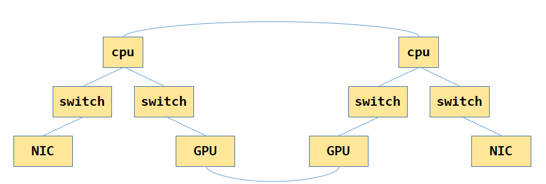
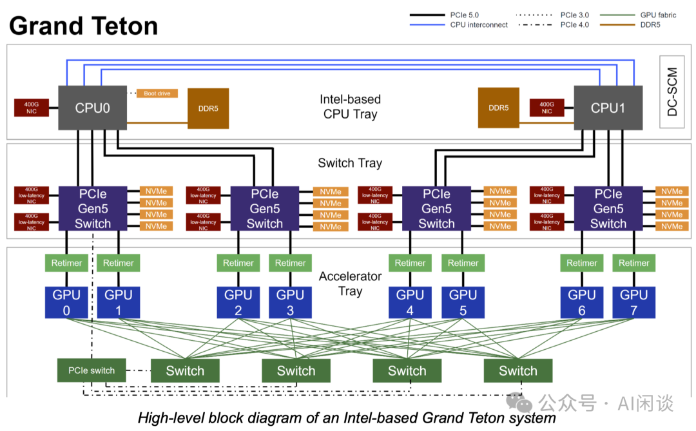
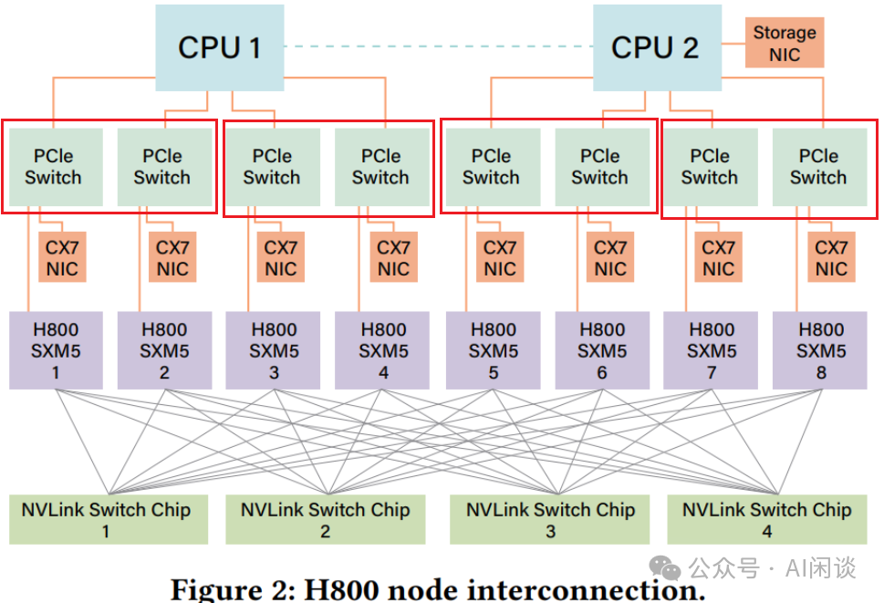
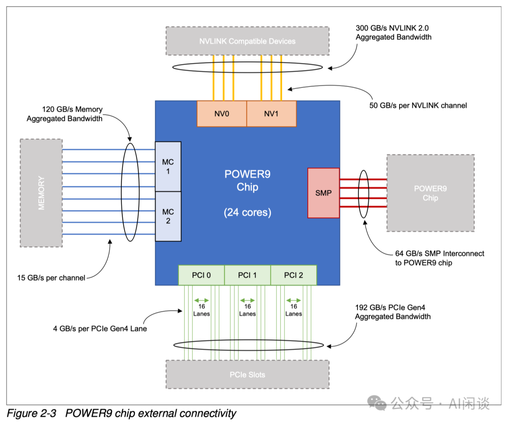
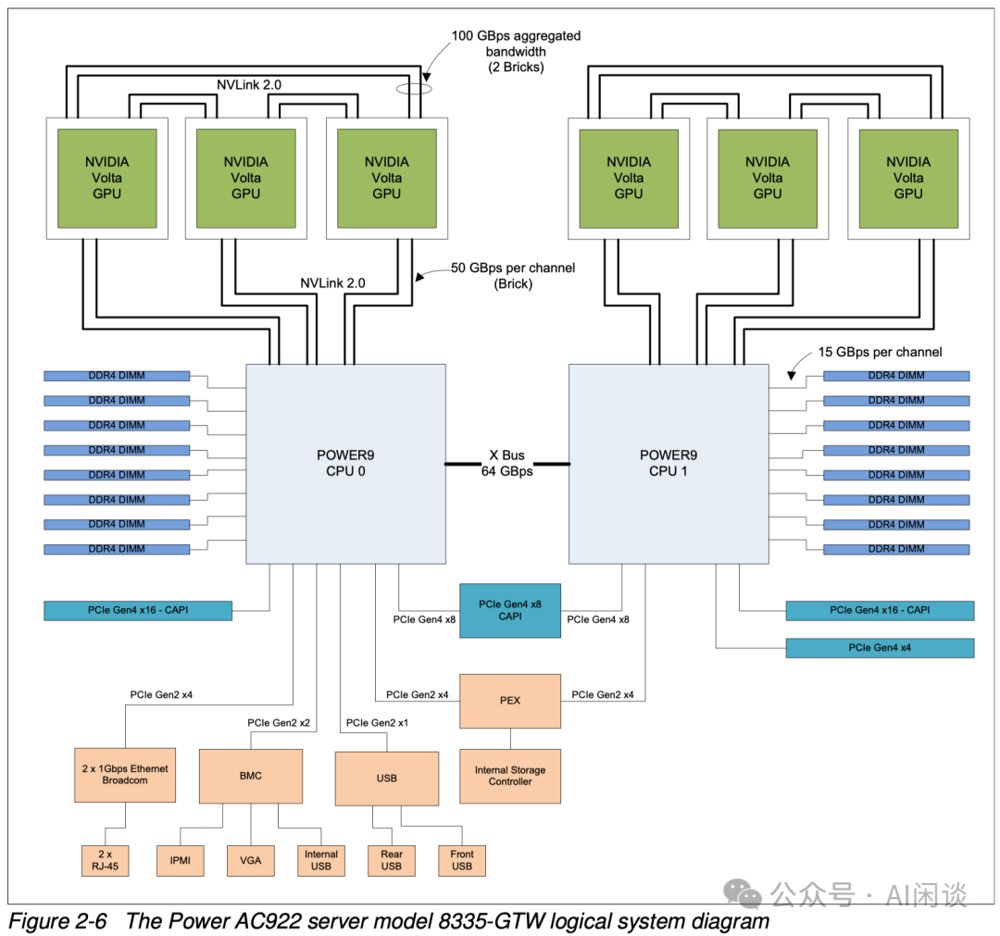
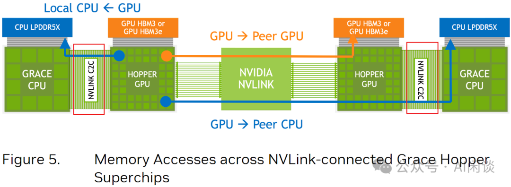
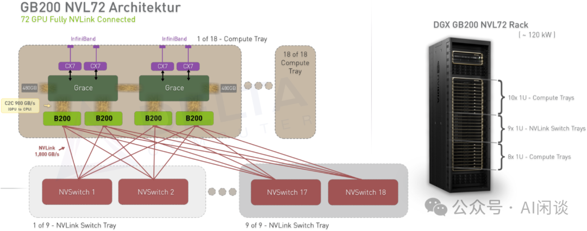

# 0 拓扑方式举例

**一个典型的机器PCI 系统拓扑图如下:** <br>


*GPU之间是通过NVLink连接起来的* <br>

**常见 8 GPU 服务器拓扑**
- 2 个 CPU，CPU 之间通过 QPI 连接。
- 每个 CPU 下有 2 个 PCIe Switch（比如常见的 Broadcom PEX89104，PEX89144），总共 4 个。
- 每个 PCIe Switch 下连接 2 个 GPU，2 个 NIC（如果一台服务器 4 个后向 NIC，这里每个 PCIe Switch 有 1 个 NIC），一些 NVMe。
- 8 个 GPU 通过 NVLink + NVSwitch 实现全互联。


**GPU 到 NIC 如何对应** <br>
如果每个 PCIe Switch 两个 GPU + 两个 NIC，那么 GPU 通过 NIC 通信时应该选择哪一个呢？有两种常见的方式：<br>

- 直接使用 8 个 物理 PCIe Switch，每个下面都有一个 GPU 和 一个 NIC。（PS：这种方式如果只有 4 个 NIC，则两个 GPU 对应一个 NIC 的距离会不同。）
- 将一个物理 PCIe Switch **虚拟化**为两个逻辑 Virtual PCIe Switch。（PS：这种方式的好处是如果只有 4 个 NIC，只要调整虚拟化，两个 GPU 与 NIC 的距离就可以相同。




**IBM Power9 : cpu 和 GPU 通过NVLink 直连** <br>


对应的拓扑图:



**NVIDIA Grace CPU & GPU** <br>
NVIDIA 从 Hopper 架构开始推出了 Grace 架构，比如 GH200 以及后续的 GB200。如下图所示为 GH200 的架构，其 Grace CPU 与 GPU 之间可以通过 NVLink C2C 连接；而 GPU 与 GPU 之间依旧可以通过 NVLink 连接.



**GB200 NVL72 Superpod** <br>
常见的 NVLink + NVSwitch 全互联通常在一台单机内，比如常见的单机 8 GPU 服务器。而 Superpod 中，比如常见的 NVL72，将 NVLink + NVSwitch 全互联的范围进一步扩展到单个机柜甚至多个机柜内。如下图所示，DGX GB200 NVL72 将其扩展到**一个机柜的 72 个 B200 GPU**。



**NCCL 中拓扑计算的路径实现** <br>
/root/projects/pytorch/third_party/nccl/nccl/src/init.cc:initTransportsRank 里会进行路径计算

```c++
NCCLCHECKGOTO(ncclTopoComputePaths(comm->topo, comm), ret, fail);
```
- 功能：基于拓扑图计算所有 GPU 与 NIC 之间的可达路径，并评估路径质量（带宽、延迟）。
- 关键作用：
  - 为每对 GPU-NIC 生成通信路径（例如：GPU0 → PCIe → CPU → NIC0）
  - 计算路径的有效带宽（考虑 PCIe 层级、NVLink 速度等）
  - 生成路径权重，用于后续选择最优通信策略（如 Ring 或 Tree 算法）
- 为什么需要：避免低效路径（如跨 NUMA 节点通信），最大化通信吞吐量。


# 1 ncclTopoComputePaths ：拓扑路径计算

问题抽象: 这个问题可以建模为给定一个**无向图**，每条边有一个权值，给定查询(u, v)，求**节点u**到**节点v**的路径，使得路径上的最小边的权值最大，类似`无向图的最小瓶颈路`，可以用生成树+LCA的方法解决；如果查询中的u是固定的，那么也可以使用类似SPFA的方法解决，将松弛方法改一下即可。

- 生成数 + LCA

- SPFA 方法

**路径优先级** <br>

```sh
# NCCL 路径选择顺序
1. PATH_NVL    // 同一节点内的 NVLink
2. PATH_PCI    // 同一节点内的 PCIe
3. PATH_PHB    // 通过 PCIe 主机桥
4. PATH_SYS    // 通过系统内存
5. PATH_NET    // 通过网络（跨节点）

# NCCL 支持的网络传输
- IB/RoCE RDMA      // 最高性能
- TCP/IP sockets    // 通用网络
- SHARP             // InfiniBand 集合操作卸载
```

## 1.1 相关数据结构

```c++
// 节点类型
#define NCCL_TOPO_NODE_TYPES 7
#define GPU 0
#define PCI 1
#define NVS 2
#define CPU 3 // Actually NUMA domains
#define NIC 4
#define NET 5 // NET 通常是指网络端点，比如 NIC 上的一个网络端口，一个 NIC 可以有多个物理端口

#define NCCL_TOPO_MAX_HOPS (NCCL_TOPO_MAX_NODES*NCCL_TOPO_NODE_TYPES) // 576 * 7

// LINK : 表示两个 node 之间的直接物理连接
// We want link types and path types to match as much as possible
#define LINK_LOC 0          // 本地连接
#define LINK_NVL 1          // 表示 NVLink 连接，包括 GPU 与 GPU 之间或者 GPU 与 NVSwitch 之间
// Skipping 2 for PATH_NVB
#define LINK_C2C 3          // C2C(chip to chip)直接连接: CPU-to-CPU 或 GPU-to-CPU
#define LINK_PCI 4          // 表示 PCIe 连接，比如 GPU 与 NIC 之间的 PCIe 通道
// Skipping 5 for PATH_PXB
// Skipping 6 for PATH_PXN
// Skipping 7 for PATH_P2C
// Skipping 8 for PATH_PHB
#define LINK_SYS 9          // 表示系统总线连接，比如 NUMA 节点间的 QPI/UPI/Infinity Fabric 等
#define LINK_NET 10         // 表示通过网络设备（如以太网，IB 或 RoCE）进行互联
extern const char* topoLinkTypeStr[];

// PATH 表示完整的通信路径，描述从源设备到目标设备的端到端路径，可能经过多个中间设备
// Local (myself)
#define PATH_LOC 0
// Connection traversing NVLink
#define PATH_NVL 1
// Connection through NVLink using an intermediate GPU
#define PATH_NVB 2 // 通过中间GPU的NVLink路径
// Connection through C2C
// Chip-to-Chip 指同一物理设备（如 NVIDIA DGX 服务器）内不同 chip 芯片之间的直接连接,
// 因为是芯片级近距离直连（无需经过主板上的长距离布线）
// C2C 的数据线本质上是NVLink 协议下的短距离专用互连线路，但物理实现更紧凑，带宽密度（单位长度的带宽）更高；
// NVLINK 和 NVSwitch 的缺点：链路长度较长（厘米级），需要考虑信号完整性和线缆成本
// IBM 的 Power8/Power9 处理器集成了 NVLink 接口，可直接与 NVIDIA GPU 通过 NVLink 链路连接，而非传统的 PCIe
#define PATH_C2C 3
// Connection traversing at most a single PCIe bridge
#define PATH_PIX 4 // 最多经过一个PCIe桥的连接
// Connection traversing multiple PCIe bridges (without traversing the PCIe Host Bridge)
// 通信的源设备和目标设备位于同一 PCIe 域（由同一主机桥管理的 PCIe 网络），
// 但物理上需要经过多个 PCIe 桥（如多级交换机）连接，
// 且数据传输无需经过主机桥与系统内存的交互，直接在设备间通过 PCIe 桥转发
#define PATH_PXB 5 // 经过多个PCIe桥（但不经过PCIe主机桥）的连接
// Connection between a GPU and a NIC using the C2C connection to the CPU and the PCIe connection to the NIC
// 数据从 GPU 出发，先通过 C2C 高速链路传输到 CPU（内存或缓存），再由 CPU 通过 PCIe 总线中转到 NIC（或反向）
// GPU 与 NIC 之间的连接，通过 C2C 链路连接到 CPU，再通过 PCIe 链路连接到 NIC
// NVLink-C2C (NVIDIA Chip-to-Chip) 是一种专为 CPU-GPU 直连 设计的高速互连协议,
// 不同于传统 PCIe，它实现了 缓存一致性(GPU 可直接访问 CPU 缓存) 和 内存统一寻址(GPU 可直接访问系统内存),
// C2C-NVSwitch-RDMA 等多为网状拓扑 (可以实现多路径并行), 而PCIe 是树型拓扑,
// 整个路径分为GPU→CPU（C2C 链路） 和CPU→NIC（PCIe 链路） 两段.
// NIC 未直接连接到 GPU 的 PCIe 域 时需要走 PATH_P2C
#define PATH_P2C 6 // C2C : UPI (Ultra Path Interconnect) and QPI (QuickPath Interconnect)
// Connection between a GPU and a NIC using an intermediate GPU. Used to enable rail-local, aggregated network send/recv operations.
// GPU 与 NIC 之间的通信通过一个中间 GPU 中转，用于实现本地网络通道（rail-local）内的聚合式网络发送 / 接收操作
// NIC 资源有限：NIC 是相对昂贵的硬件，服务器中 NIC 数量通常少于 GPU 数量（例如 8 卡 GPU 服务器配 2-4 张 NIC），必须共享使用;
// 小数据传输效率低：网络传输存在固定开销（如 TCP/UDP 头部、InfiniBand 的 RDMA 协议握手），小数据块的 “有效数据 / 总传输量” 比例低，带宽利用率差, 因此要聚合传输；
// rail-local” 强调数据传输局限在同一网络链路（rail） 内，即中间 GPU 和目标 NIC 属于同一物理网络通道（如同一 NIC 连接的端口）。这避免了跨 rail 传输的额外开销;
// 阶段 1：源 GPU→中间 GPU（高速互连）--> 阶段2：中间 GPU 聚合 --> 阶段3: NIC（网络传输）
#define PATH_PXN 7
// Connection traversing PCIe as well as a PCIe Host Bridge (typically the CPU)
// 数据传输同时经过 PCIe 链路和 PCIe 主机桥，用于设备与系统核心（CPU / 内存）或跨主机桥连接的设备之间的通信
// 几乎所有的GPU系统都支持这种路径，因为它是最基础的PCIe通信方式;
// 通信的源设备（如 GPU）与目标（如系统内存、CPU，或连接在主机桥另一侧的设备）之间必须经过主机桥中转;
// 场景 1：设备与系统内存 / CPU 的交互 + 场景 2：跨主机桥连接的设备间通信
// PCIe Host Bridge 作为 交换机 工作, 数据不进入系统内存, 类似于网络交换机的 packet switching
// GPU1 --[PCIe TLPs]--> PCIe Root Complex --[PCIe TLPs]--> GPU2
//          (事务数据包)        (CPU内)         (事务数据包)
// PCIe Host Bridge 想象成一个交通枢纽：PATH_PHB：就像数据包在枢纽内部直接换乘，不下车
#define PATH_PHB 8
// Connection traversing PCIe as well as the SMP interconnect between NUMA nodes (e.g., QPI/UPI)
// 原理: 同时经过 PCIe 总线和 NUMA 节点间的 SMP 互连（如 QPI/UPI）的连接.作为其他高速路径（如 NVLink、PCIe）不可用时的备选方案
// SMP: Symmetric Multi-Processing(对称多处理)，多个处理器共享同一内存和总线，可平等地参与任务处理的计算机架构
// QPI/UPI：Quick Path Interconnect / Ultra Path Interconnect
// 两个CPU域之间通常不能通过PCIe Switch直接通信.
// PCIe主机桥: 连接PCIe设备到CPU和内存控制器, PCIe域与内存域之间的桥梁，数据通常需要在系统内存中暂存
// 跨CPU 域间必须通过cpu 内存：
// GPU0 → PCIe → CPU0内存 → QPI/UPI → CPU1内存 → PCIe → GPU1
//        ↑              ↑              ↑              ↑
//       DMA          内存拷贝        内存拷贝          DMA
// 问题：UPI 缓存一致性协议, 可以解决 DMA 问题吗？ 答：不可以
// CPU0 L1/L2/L3缓存 ↔ QPI/UPI/IF一致性协议 ↔ CPU1 L1/L2/L3缓存
// 原因: GPU0的DMA引擎只能看到CPU0的物理地址空间, GPU1的DMA引擎只能看到CPU1的物理地址空间
#define PATH_SYS 9
// Connection through the network
// 通过网络进行连接的路径，这是跨节点多机训练的关键通信路径
// GPU → 网络适配器 → 网络交换机 → 网络适配器 → GPU
//       (本机)                         (远程机)
// 节点A: GPU1 → PCIe → IB HCA (Host Channel Adapter) → InfiniBand交换机
// 节点B: GPU2 ← PCIe ← IB HCA (Host Channel Adapter) ← InfiniBand交换机
// InfiniBand HCA（主机通道适配器）
// RoCE（RDMA over Converged Ethernet）
// 以太网 NIC（网络接口卡）
// NVLink Switch（跨节点的 NVLink）
#define PATH_NET 10
// New type of path which should precede PATH_PIX
// 基于 NVLink：继承 PATH_NVL 的高速特性
// 端口直连：通过特定的 NVLink 端口直接连接
#define PATH_PORT PATH_NVL

// Disconnected
// PATH_DIS 表示两个 GPU 之间没有可用的通信路径
#define PATH_DIS 11

struct ncclTopoLink {
  int type;
  float width;
  struct ncclTopoNode* remNode;
};

struct ncclTopoLinkList {
  // 576 * 7 NCCL_TOPO_NODE_TYPES
  struct ncclTopoLink* list[NCCL_TOPO_MAX_HOPS];
  int count;
  float width;
  int type;
};
```

## 1.2 各种类型连接

### 1.2.1 cpu 拓扑结构
lscpu 可查看

```sh
Architecture:            x86_64 # 64位x86架构
  CPU op-mode(s):        32-bit, 64-bit # CPU可以运行在两种模式下的代码（兼容32位应用程序）
  Address sizes:         46 bits physical, 57 bits virtual # 通过分页机制映射到物理内存
  Byte Order:            Little Endian # 小端序：低位字节存储在低地址
CPU(s):                  64 # 64 个逻辑cpu (32 x 2 线程)
  On-line CPU(s) list:   0-63
Vendor ID:               GenuineIntel
  # NVIDIA H100 时钟频率: 2.0 GHz，CPU基础频率为3.1GHz
  # GPU 频率低但核心多导致算力更强
  Model name:            Intel(R) Xeon(R) Gold 6346 CPU @ 3.10GHz
    CPU family:          6   # Intel 6代
    Model:               106 # 内部型号代码
    Thread(s) per core:  2   # 每个core 两个线程
    Core(s) per socket:  16  # 每个cpu 16 个核心
    Socket(s):           2   # 两个物理cpu, 两个插槽， 两个NUMA 节点， 跨NUMA节点通信需要通过UPI，性能较低
    Stepping:            6   # 修订版本号
    CPU max MHz:         3600.0000
    CPU min MHz:         800.0000
    BogoMIPS:            6200.00
Virtualization features:
  Virtualization:        VT-x
Caches (sum of all):
  L1d:                   1.5 MiB (32 instances)
  L1i:                   1 MiB (32 instances)
  L2:                    40 MiB (32 instances)
  L3:                    72 MiB (2 instances)
NUMA:
  NUMA node(s):          2
  NUMA node0 CPU(s):     0-15,32-47
  NUMA node1 CPU(s):     16-31,48-63

┌──────────────────────────────────────────────────────────────────┐
│                        NUMA Node 0                               │
│                   physic CPU Socket 0                            │
├──────────────────────────────────────────────────────────────────┤
│  ┌─────────────────────────────────────────────────────────────┐ │
│  │                     16 physical core                        │ │
│  │  ┌─────┬─────┬─────┬─────┬─────┬─────┬─────┬─────┐          │ │
│  │  │Core0│Core1│Core2│Core3│ ... │Core14│Core15│    │         │ │
│  │  └──┬──┴──┬──┴──┬──┴──┬──┴──┬──┴──┬──┴──┬──┴──┬──┘          │ │
│  │   ┌─┴─┐ ┌─┴─┐ ┌─┴─┐ ┌─┴─┐ ... ┌─┴─┐ ┌─┴─┐ ┌─┴─┐             │ │
│  │   │T0 │ │T0 │ │T0 │ │T0 │     │T0 │ │T0 │ │T0 │             │ │
│  │   │T1 │ │T1 │ │T1 │ │T1 │     │T1 │ │T1 │ │T1 │             │ │
│  │   └───┘ └───┘ └───┘ └───┘     └───┘ └───┘ └───┘             │ │
│  │     logic CPU 0-1  2-3  4-5  6-7 ... 28-29 30-31            │ │
│  └─────────────────────────────────────────────────────────────┘ │
│                                                                  │
│  ┌─────────────────────────────────────────────────────────────┐ │
│  │                   PCIe Root Complex 0                       │ │
│  │  ┌─────────────┐  ┌─────────────┐  ┌─────────────┐          │ │
│  │  │    GPU0     │  │    GPU1     │  │    GPU2     │          │ │
│  │  │             │  │             │  │             │          │ │
│  │  └─────────────┘  └─────────────┘  └─────────────┘          │ │
│  └─────────────────────────────────────────────────────────────┘ │
└──────────────────────────────────────────────────────────────────┘
                               │
                            ┌──┴──┐
                            │ UPI │
                            └──┬──┘
                               │
┌──────────────────────────────────────────────────────────────────┐
│                        NUMA Node 1                               │
│                    physical CPU Socket 1                         │
├──────────────────────────────────────────────────────────────────┤
│  ┌─────────────────────────────────────────────────────────────┐ │
│  │                     16个物理核心                             │ │
│  │  ┌─────┬─────┬─────┬─────┬─────┬─────┬─────┬─────┐          │ │
│  │  │Core0│Core1│Core2│Core3│ ... │Core14│Core15│    │         │ │
│  │  └──┬──┴──┬──┴──┬──┴──┬──┴──┬──┴──┬──┴──┬──┴──┬──┘          │ │
│  │   ┌─┴─┐ ┌─┴─┐ ┌─┴─┐ ┌─┴─┐ ... ┌─┴─┐ ┌─┴─┐ ┌─┴─┐             │ │
│  │   │T0 │ │T0 │ │T0 │ │T0 │     │T0 │ │T0 │ │T0 │             │ │
│  │   │T1 │ │T1 │ │T1 │ │T1 │     │T1 │ │T1 │ │T1 │             │ │
│  │   └───┘ └───┘ └───┘ └───┘     └───┘ └───┘ └───┘             │ │
│  │   logic CPU 32-33 34-35 36-37 ... 60-61 62-63               │ │
│  └─────────────────────────────────────────────────────────────┘ │
│                                                                  │
│  ┌─────────────────────────────────────────────────────────────┐ │
│  │                   PCIe Root Complex 1                       │ │
│  │  ┌─────────────┐  ┌─────────────┐  ┌─────────────┐          │ │
│  │  │    GPU3     │  │    GPU4     │  │    GPU5     │          │ │
│  │  │             │  │             │  │             │          │ │
│  │  └─────────────┘  └─────────────┘  └─────────────┘          │ │
│  └─────────────────────────────────────────────────────────────┘ │
└──────────────────────────────────────────────────────────────────┘
```

### 1.2.2 两个不同 pcie root complex 之间的通信

```sh
# Intel平台（UPI）
CPU0 ────── UPI Link ────── CPU1
  │                         │
  │                         │
Local RAM                Local RAM
  │                         │
PCIe Bus 0               PCIe Bus 1

# AMD平台（Infinity Fabric）
CPU0 ─── xGMI Link ─── CPU1
  │                     │
  │                     │
Local RAM            Local RAM
  │                     │
PCIe 4.0              PCIe 4.0

# PCIe根复合体 = PCIe Root Complex:
# 是CPU与PCIe设备之间的桥梁和交通枢纽，负责管理所有PCIe设备的通信，
# 通常集成在CPU内部或主板芯片组中。
┌─────────────┐
│     CPU     │
└──────┬──────┘
       │
┌──────┴──────┐
│ PCIe Root   │ ← 根复合体
│ Complex     │
└──────┬──────┘
       │
   ┌───┴───┐
   │ PCIe  │
   │ Bus   │
   └───┬───┘
       │______________
   ┌───┼───┐ ┌─|─┐ ┌─|─┐
   │Switch │ │GPU│ │NIC│ ...
   └───────┘ └───┘ └───┘

# 现代CPU集成示例
┌───────────────────────────────────┐
│            CPU Die                │
│  ┌────────┐  ┌─────────────────┐  │
│  │ Cores  │  │ PCIe Root Complex  │
│  │        │  │                 │  │
│  │ Cache  │  │ • 16-128 lanes  │  │
│  └────────┘  │ • Multiple ports│  │
│       │      └─────────┬───────┘  │
│  ┌────┴─────┐          │          │
│  │ Memory   │   ┌──────┴──────┐   │
│  │Controller│   │ PCIe Lanes  │   │
│  └──────────┘   └─────────────┘   │
└───────────────────────────────────┘

# 多路系统中的角色，在之前讨论的NUMA系统中：
┌─────────────┐    C2C互联  ┌─────────────┐
│  CPU Socket0│─────────────│  CPU Socket1│
│             │             │             │
│ PCIe Root   │             │ PCIe Root   │
│ Complex 0   │             │ Complex 1   │
│    │        │             │    │        │
└────┼────────┘             └────┼────────┘
     │                           │
┌────┼─────┐                ┌────┼─────┐
│ GPU on   │                │ NIC on   │
│ Socket0  │                │ Socket1  │
└──────────┘                └──────────┘

# 跨cpu 域数据传输
GPU0 → DMA → CPU0内存 → (CPU参与) → UPI → CPU1内存 → DMA → GPU1
       │              │                    │              │
      DMA1         内存地址             内存地址          DMA2
```

### 1.2.3 哪些方式可以经过 DMA 直接访问呢？

DMA :  Direct Memory Access（直接内存访问）核心概念：<br>
- 绕过CPU：设备直接与内存交换数据，不需要CPU参与数据搬运
- 高效传输：解放CPU去处理其他任务
- 硬件加速：专门的DMA控制器处理数据传输

1. PCIe P2P DMA（同域内）

```sh
GPU0 ────[PCIe]───→ GPU1
  │                  │
 DMA               DMA
  ↓                  ↓
内存访问          内存访问
```
- 条件：同一PCIe根复合体下的设备
- 技术：PCIe Peer-to-Peer
- 限制：不能跨CPU域

2. NVLink DMA（NVIDIA专用）

```sh
GPU0 ────[NVLink]───→ GPU1
  │                    │
直接访问对方显存       直接访问对方显存
```
- 真正的设备间直接内存访问
- 不需要经过系统内存
- 超低延迟，高带宽

3. 跨结点: GPUDirect RDMA

```sh
GPU0 ──[PCIe]──→ NIC ──[网络]──→ 远程NIC ──[PCIe]──→ GPU1
  │              │                  │              │
 DMA          RDMA               RDMA           DMA
```

- 条件：特定NVIDIA GPU + Mellanox NIC组合
- 优势：跨节点的直接内存访问

4. CXL（新兴标准）: Compute Express Link

Intel + CXL的未来架构

```sh
GPU0 ── CXL ── CPU0 ── CXL ── CPU1 ── CXL ── GPU1
  │              │              │              │
CXL DMA      一致性DMA      一致性DMA       CXL DMA
```

- CXL是一种新兴的高速互联标准，它建立在PCIe的基础上，提供了缓存一致性的内存访问。
- CXL允许设备（如GPU、FPGA）和CPU之间，以及设备与设备之间进行直接内存访问，并且保持缓存一致性。
- CXL有望实现跨CPU域的直接DMA，因为它提供了统一的地址空间和缓存一致性协议。

5. AMD Infinity Fabric

AMD Infinity Fabric在特定配置下可以实现一定程度的直接DMA，但仍有局限性.

**同cpu 域内完全DMA**
```sh
GPU0 ── IF ── CPU ── IF ── GPU1 (同一EPYC处理器内)
         │          │
        DMA        DMA
```

**跨cpu 域有限DMA : 带宽受限**
```sh
GPU0 ── IF ── CPU0 ── IF ── CPU1 ── IF ── GPU1
         │           │           │
        DMA     一致性协议       DMA
```

**延迟和带宽对比**
```sh
# 延迟
- 同复合体内DMA: ~400-600ns
- 跨复合体DMA: ~800-1200ns
- NVLink DMA: ~200-300ns
- 传统内存中转: ~2000-3000ns

# 带宽对比（理论峰值）：
NVLink 4.0: 600 GB/s
Infinity Fabric: 200-400 GB/s (同复合体)
Infinity Fabric: 100-200 GB/s (跨复合体)
PCIe 5.0: 64 GB/s (x16)
```

## 1.2.4 GPU to GPU 有哪些通信方式
```sh
// NVLink 直连（最优）
#define PATH_NVL 2
GPU1 ←[NVLink]→ GPU2

// PCIe 直连
#define PATH_PCI 1
GPU1 ←[PCIe]→ GPU2

// 通过 PCIe 主机桥
#define PATH_PHB 5
GPU1 → PCIe → PCIe Host Bridge → PCIe → GPU2

// 通过系统内存
#define PATH_SYS 9
GPU1 → 系统内存 → GPU2
```

## 1.2.5 缓存一致性原理

缓存: 缓存的核心是 “加速**已存在于主存**的数据的访问”，而`非参与数据的初始分配和存储`。

缓存一致性: 在包含多级缓存的多处理器系统中，多个缓存中同一主存数据副本保持一致的关键机制。

要解决的问题: 在多处理器系统中，**每个 CPU（或核心）**通常有`独立的`缓存（L1、L2 等），当多个 CPU 同时操作`主存`中的同一数据时，`若各自缓存中的副本不一致，会导致程序运行错误`（如读取到旧数据、写入冲突等）.

> example:

假设主存中有一个数据 **X=10**，CPU1 和 CPU2 的缓存中都缓存了X的副本：
- 若 CPU1 将**缓存**中的X修改为`20`（但未同步到主存），此时 CPU2 的**缓存**中X仍为`10`，若 CPU2 读取X会得到错误结果(10)；
- 若 CPU2 同时修改X为30，则两个 CPU 的缓存和主存的数据会完全混乱。
因此，缓存一致性技术需要解决：`当一个缓存中的数据被修改时，如何让其他缓存中的副本 “感知” 到变化并保持一致`。

- 什么时候会有缓存呢？

假设程序执行int X = 10;
> 1. 操作系统在主存中为X分配地址（例如0x1000），并将10写入主存的0x1000地址;
> 2. 此时 CPU 的缓存中，0x1000对应的缓存行是 I(Invalid) 状态（**无有效数据**），即缓存中没有X的副本;
> 3. 当 CPU 第一次执行printf("%d", X);（读取X）时：
>  - CPU 检查缓存，发现X未命中（I 状态），于是通过总线从**主存0x1000**读取10。
>  - **读取到的数据被存入 CPU 缓存**，缓存行状态标记为 E(Exclusive，独占)（假设无其他 CPU 访问）。
>  - 最终 CPU 从**缓存中**获取10并执行打印。


- 参数更新时顺序 : 优先更新缓存，主存延迟更新
> **场景 1:** 缓存命中（缓存中存在X的有效副本）
> “缓存命中” 指缓存中X的状态为M(Modified)（已修改）、E(Exclusive)（独占）或 S(Share)（共享）（非 Invalid 状态，即数据有效）。此时更新步骤如下：
> 1. **检查缓存状态，处理一致性（若需）:** M（已修改）或 E（独占）时，当前缓存时唯一持有者，无需通知其他 CPU，直接修改; 若状态为S（共享）：其他缓存可能也有X的副本，先通过总线发送Invalidate（失效）请求，`通知其他 CPU 的缓存将X标记为无效（I 状态）。待收到所有其他 CPU 的InvalidateAck（确认失效）后，才能进行修改（确保此时当前缓存是唯一有效持有者）这就是一致性检查？？？`.
> 2. **更新缓存中的数据:** 完成一致性处理后，CPU 直接`修改缓存中`X的值（如从 10 改为 20）;
> 3. **更新缓存行状态:** 原状态是 E 或 S时，修改后状态变为M（已修改）, 原状态M, 仍为M;
> 4. **主存暂不更新:** 主存中的X仍为旧值（如 10），仅缓存中的X是新值（如 20）。主存的更新会延迟到 “必要时”。

> **场景 2**：缓存未命中（缓存中不存在X的有效副本）
> 缓存中X的状态为I（无效）,此时需先加载数据到缓存，再执行更新:
> 1. **从主存或其他缓存加载X到本地缓存:** CPU 通过总线发送Read请求，获取X的当前值（若其他缓存有 M 状态的X，则由该缓存先写回主存再返回；若其他缓存有 E/S 状态的X，则直接返回；否则从主存读取）。加载后，缓存行状态根据是否有其他副本标记为 E（无其他副本）或 S（有其他副本）;
> 2. **重复场景1的1-3步骤:** 处理一致性（若为 S 状态需先失效其他副本）、更新缓存中的X值、将状态改为 M；
> 3. **更新主存:** 同场景 1，主存保持旧值，等待 “必要时” 同步。

- 主存的更新时机
> 缓存中X处于 **M 状态（已修改）时**，主存的更新才会在以下时机触发，顺序上晚于缓存更新。
> 1. **其他 CPU 请求读取X时:** 当其他 CPU 发送Read(X)请求，当前持有**M(Modified) 状态**X的 CPU 必须先将缓存中的新值写回主存（同步主存），再将数据发送给请求方，此时主存被更新。
> 2. **缓存行被替换时:** 缓存空间有限，当新数据需要加载到缓存，而当前 M 状态的X所在缓存行被选中替换时，必须先将X的新值写回主存，再腾出空间，此时主存被更新。
> 3. **程序执行强制刷新指令时(flush):** 如通过clflush（x86）等指令强制将缓存数据写回主存（确保数据持久化，如数据库事务提交），此时主存被更新。

- 完整案例
```sh
举例：X=10更新为X=20的完整流程:

假设初始状态：主存X=10，CPU0 缓存X为 S 状态（与 CPU1 共享），CPU1 缓存X为 S 状态。

1. CPU0 要更新X=20（缓存命中，S 状态）：
  步骤 1：CPU0 发送Invalidate(X)请求，CPU1 嗅探后将自己的X标记为 I 状态，返回InvalidateAck。
  步骤 2：CPU0 收到确认后，将缓存中X改为 20。
  步骤 3：CPU0 的X状态从 S→M（主存仍为 10）。
2.后续 CPU1 读取X（缓存未命中，I 状态）：
  PU1 发送Read(X)请求，CPU0 嗅探后，先将X=20写回主存（主存更新为 20），再返回X=20给 CPU1。
  CPU0 的X状态从 M→S，CPU1 的X状态为 S（此时缓存和主存均为 20）。
```

- 缓存一致性协议
  - M（Modified，已修改）：数据被修改过，与主存不一致，且当前缓存是唯一持有者（其他缓存副本无效）。
  - E（Exclusive，独占）：数据与主存一致，且只有当前缓存持有副本（无其他缓存副本），可直接修改。
  - S（Shared，共享）：数据与主存一致，且其他缓存可能也有副本，修改前需先让其他副本失效。
  - I（Invalid，无效）：数据无效（可能被其他缓存修改过），无法读取或使用

# 2 NCCL 拓扑路径计算
## 2.1 getPath
核心作用是 : 根据目标节点的类型和 ID，从当前节点的路径信息中查找并返回对应的通信路径，为 GPU 间通信路径的选择提供依据

```c++
static ncclResult_t getPath(struct ncclTopoSystem* system, struct ncclTopoNode* node, int t, int64_t id, struct ncclTopoLinkList** path) {
  for (int i=0; i<system->nodes[t].count; i++) {
    if (system->nodes[t].nodes[i].id == id) {
      *path = node->paths[t]+i;
      return ncclSuccess;
    }
  }
  WARN("Could not find node of type %d id %lx", t, id);
  return ncclInternalError;
}
```

- struct ncclTopoSystem* system：指向整个系统拓扑结构的指针，存储了所有节点（如 GPU、CPU、PCIe 交换机、NVLink 链路等）的信息，`按节点类型分类管理`。
- struct ncclTopoNode* node：指向 `当前节点` 的指针（如某个 GPU 节点），其内部包含了当前节点到其他类型节点的所有通信路径信息(直接links 已知， paths 未知)。
- int t：`目标节点的 “类型”（type）`，例如可能用枚举值表示： GPU、PCI、NVS、CPU、NIC、NET。
- int64_t id：目标节点的唯一标识符（ID），用于`在同类型节点中区分不同个体`（如 GPU 的 PCIe BDF 地址、CPU 的 socket ID 等）。
- struct ncclTopoLinkList** path：输出参数（指针的指针），用于返回找到的 “当前节点到目标节点的通信路径” 的指针。

## 2.2 ncclTopoSetPaths

&nbsp;&nbsp;&nbsp;&nbsp;&nbsp;&nbsp;&nbsp;&nbsp;该函数的核心是通过广度优先搜索（BFS） ，以baseNode（基准节点）为起点，为拓扑系统中所有可达节点计算最优通信路径，本质是 “从基准节点出发，遍历所有邻居节点，逐步扩散到全拓扑，同时记录路径的跳数、带宽和类型”。具体原理可拆解为 4 点：

1. 路径初始化：先分配内存，再处理特殊路径
- 优先为基准节点和远程节点分配 “到基准节点类型” 的路径数组（如 GPU 基准节点先分配到其他 GPU 的路径内存），初始状态设为PATH_DIS（不可达）。
- 特殊处理 `基准节点到自身` 的路径：跳数 0、带宽最高（LOC_BW）、类型PATH_LOC（本地路径），**这是 BFS 的起点**。

2. BFS 遍历：按 “跳数” 扩散，确保路径最短
- BFS 的核心优势是 “按距离（跳数）优先遍历”，能保证首次到达某个节点时，路径**跳数最少（最优）**。
- `每轮处理当前节点的所有链接`，通过 “反向链接匹配” 确保路径双向对称，避免链路断裂。

3. 路径优化：按 “带宽瓶颈” 和 “路由限制” 筛选
- 带宽计算：路径带宽取 “当前节点路径带宽” 和 “链接带宽” 的最小值（遵循 “瓶颈原则”，整体带宽由最弱环节决定）。
- 路由限制：仅允许通过 GPU 路由 1 跳，避免多跳 GPU 导致延迟升高（NCCL 通信对延迟敏感，多跳 GPU 会显著降低性能）。
- 路径更新条件：仅当远程节点路径 “未初始化（带宽 0）”“跳数更长” 或 “带宽更低” 时，才更新为新路径，确保最终路径是 “跳数最少 + 带宽最高” 的最优解。

```c++
// 为基准节点（baseNode）计算并设置其到拓扑系统中所有其他节点的通信路径
// 参数：
//   baseNode - 路径计算的起点（基准节点，可是CPU/GPU/NIC/NVS等类型）
//   system - 整个拓扑系统结构，包含所有节点和链接信息
// 返回：ncclResult_t - 操作结果（成功或错误码）
static ncclResult_t ncclTopoSetPaths(struct ncclTopoNode* baseNode, struct ncclTopoSystem* system) {
  // 1. 初始化基准节点自身类型的路径内存（如GPU节点先初始化到其他GPU的路径）
  // 检查基准节点对应"自身类型"的路径数组是否未分配（paths[节点类型]存储到同类型节点的路径）
  if (baseNode->paths[baseNode->type] == NULL) {
    // 为路径数组分配内存，大小等于系统中同类型节点的总数
    NCCLCHECK(ncclCalloc(baseNode->paths+baseNode->type, system->nodes[baseNode->type].count));
    // 初始化所有同类型节点的路径类型为"不可达"（PATH_DIS）
    for (int i=0; i<system->nodes[baseNode->type].count; i++) {
      baseNode->paths[baseNode->type][i].type = PATH_DIS;
    }
  }

  // 2. 初始化广度优先搜索（BFS）的节点列表，用于遍历所有可达节点
  struct ncclTopoNodeList nodeList;       // 当前轮待处理的节点列表
  struct ncclTopoNodeList nextNodeList = { { 0 }, 0 };  // 下一轮待处理的节点列表
  nodeList.count = 1;                      // 初始时，待处理列表只有基准节点
  nodeList.list[0] = baseNode;

  // 3. 初始化基准节点到"自身"的路径（特殊情况：自身到自身无跳数）
  struct ncclTopoLinkList* basePath;  // 存储基准节点到自身的路径信息
  // Binding 基准节点到"自身类型、自身ID"的路径（即自身到自身的路径）
  NCCLCHECK(getPath(system, baseNode, baseNode->type, baseNode->id, &basePath));
  basePath->count = 0;                 // 跳数为0（无中间链接）
  basePath->bw = LOC_BW;               // 带宽设为"本地带宽"（最高优先级）
  basePath->type = PATH_LOC;           // 路径类型设为"本地路径"（自身到自身）

  // 4. BFS主循环：遍历所有从基准节点可达的节点，计算并设置路径
  while (nodeList.count > 0) {  // 只要当前轮有待处理节点，就继续循环
    nextNodeList.count = 0;     // 重置下一轮节点列表（避免残留数据）

    // 处理当前轮的每个节点
    for (int n=0; n<nodeList.count; n++) {
      struct ncclTopoNode* node = nodeList.list[n];  // 当前处理的节点 : 刚开始就是baseNode自身

      // binding 当前节点到基准节点的路径data
      struct ncclTopoLinkList* path;                 // 当前节点到基准节点的路径
      NCCLCHECK(getPath(system, node, baseNode->type, baseNode->id, &path)); // 完成binding

      // 遍历当前节点的所有物理链接（每个链接对应的远程节点）
      for (int l=0; l<node->nlinks; l++) {            // 遍历远程links
        struct ncclTopoLink* link = node->links + l;  // 当前链接（包含带宽、类型等）
        struct ncclTopoNode* remNode = link->remNode; // 链接对应的远程节点

        // 4.1 初始化远程节点的路径内存（若未分配）
        if (remNode->paths[baseNode->type] == NULL) {
          // 为远程节点分配"到基准节点类型"的路径数组, 跟据baseNode类型的节点数量来分配
          NCCLCHECK(ncclCalloc(remNode->paths+baseNode->type, system->nodes[baseNode->type].count));
          // 初始化所有路径为"不可达" Disconnect
          for (int i=0; i<system->nodes[baseNode->type].count; i++) {
            remNode->paths[baseNode->type][i].type = PATH_DIS;
          }
        }

        // 4.2 获取远程节点到基准节点的路径 ： 仅binding
        struct ncclTopoLinkList* remPath;
        NCCLCHECK(getPath(system, remNode, baseNode->type, baseNode->id, &remPath));

        // 4.3 计算远程节点的路径带宽：取"当前节点路径带宽"和"当前链接带宽"的最小值（最小瓶颈原则）
        float bw = std::min(path->bw, link->bw);

        // 4.4 路由限制：仅允许通过GPU路由1跳（避免多跳GPU导致延迟过高）
        // 条件：当前节点不是基准节点 + 是GPU类型 + （禁用NVLink桥接/链接不是NVLink/远程节点非GPU/路径跳数超1）
        if (node != baseNode && node->type == GPU &&
            (ncclParamNvbDisable() || link->type != LINK_NVL || remNode->type != GPU || path->count > 1)) {
          continue;  // 不允许该路由，跳过当前链接
        }

        // 4.5 判断是否需要更新远程节点的路径（满足"未初始化/路径更短/带宽更高"任一条件）
        if ((remPath->bw == 0 || remPath->count > path->count) && remPath->bw < bw) {
          // 4.5.1 找到远程节点到当前节点的"反向链接"（路径是双向的，确保链路对称）
          remPath->list[0] = NULL;  // 先重置反向链接 : 反向第一跳先设置为 NULL
          for (int l_idx=0; l_idx<remNode->nlinks; l_idx++) {
            // 匹配条件：远程节点的链接指向当前节点 + 链接类型相同
            if (remNode->links[l_idx].remNode == node && remNode->links[l_idx].type == link->type) {
              remPath->list[0] = remNode->links + l_idx;  // 记录反向链接
              break;
            }
          }

          // 若未找到反向链接，属于拓扑数据错误，返回内部错误
          if (remPath->list[0] == NULL) {
            WARN("Failed to find reverse path from remNode %d/%lx nlinks %d to node %d/%lx",
                 remNode->type, remNode->id, remNode->nlinks, node->type, node->id);
            return ncclInternalError;
          }

          // 4.5.2 复制当前节点的路径到远程节点（拼接反向链接，形成完整路径）
          for (int i=0; i<path->count; i++) {
            remPath->list[i+1] = path->list[i];  // 远程节点路径 = 反向链接 + 当前节点到基准节点的路径
          }
          remPath->count = path->count + 1;  // 远程节点路径跳数 = 当前节点跳数 + 1
          remPath->bw = bw;                  // 带宽设为之前计算的瓶颈带宽

          // 4.5.3 确定远程节点的路径类型（根据链接和节点类型调整）
          // 初始类型 = 链接类型，但LINK_NET（网络链接）需替换为LINK_LOC（本地链接，因只关心NIC→GPU路径）
          int type = (link->type == LINK_NET) ? LINK_LOC : link->type;
          // 若两个PCI节点之间的链接，路径类型设为PATH_PXB（PCI桥）
          if (node->type == PCI && remNode->type == PCI) type = PATH_PXB;
          // 若链接是PCI类型且涉及CPU，路径类型设为PATH_PHB（PCI主机桥）
          if (link->type == LINK_PCI && (node->type == CPU || link->remNode->type == CPU)) type = PATH_PHB;
          // 若GPU之间通过NVLink多跳（跳数>1），路径类型设为PATH_NVB（NVLink桥）
          if (node->type == GPU && path->type == PATH_NVL && type == PATH_NVL && remPath->count > 1) {
            type = PATH_NVB;
          }
          // 取"当前节点路径类型"和"计算出的类型"的最大值（确保类型优先级正确）
          remPath->type = std::max(path->type, type);

          // 4.5.4 将远程节点加入下一轮BFS（避免重复添加）
          int i;
          for (i=0; i<nextNodeList.count; i++) {
            if (nextNodeList.list[i] == remNode) break;  // 若已在列表中，跳出循环
          }
          if (i == nextNodeList.count) {  // 若不在列表中，添加到下一轮
            nextNodeList.list[nextNodeList.count++] = remNode;
          }
        }
      }
    }

    // 4.6 切换到下一轮BFS：将下一轮节点列表复制到当前列表
    memcpy(&nodeList, &nextNodeList, sizeof(nodeList));
  }

  return ncclSuccess;  // 所有路径计算完成，返回成功
}
```

## 2.2 ncclTopoComputePaths

```c++
// 计算拓扑结构中GPU、NIC等节点之间的通信路径
// 参数：
//   system - 拓扑系统结构，包含各类节点（CPU、GPU、NIC等）的信息
//   comm - NCCL通信器，包含通信相关配置
// 返回：ncclResult_t - 操作结果（成功或错误码）
ncclResult_t ncclTopoComputePaths(struct ncclTopoSystem* system, struct ncclComm* comm) {
  // 预计算GPU和NIC之间的通信路径

  // 如果是重新计算路径，先清除已有的所有路径信息，避免冲突
  ncclTopoRemovePaths(system);

  // 设置CPU节点的直接路径（很多场景下需要CPU参与通信）
  // 遍历所有CPU节点，为每个CPU节点设置路径
  // ncclTopoSetPaths作用就是计算出其他所有节点到baseNode的path
  // 这里遍历所有的CPU节点，计算出其他所有节点到所有CPU节点的路径
  for (int c=0; c<system->nodes[CPU].count; c++) {
    NCCLCHECK(ncclTopoSetPaths(system->nodes[CPU].nodes+c, system));
  }

  // 设置GPU节点的直接路径
  // 遍历所有GPU节点，为每个GPU节点设置路径
  for (int g=0; g<system->nodes[GPU].count; g++) {
    NCCLCHECK(ncclTopoSetPaths(system->nodes[GPU].nodes+g, system));
  }

  // 设置NIC（网络接口卡）节点的直接路径
  // 遍历所有NIC节点，为每个NIC节点设置路径
  for (int n=0; n<system->nodes[NET].count; n++) {
    NCCLCHECK(ncclTopoSetPaths(system->nodes[NET].nodes+n, system));
  }

  // 设置NVSwitch（NVIDIA交换机）节点的直接路径
  // 遍历所有NVSwitch节点，为每个NVSwitch节点设置路径
  for (int n=0; n<system->nodes[NVS].count; n++) {
    NCCLCHECK(ncclTopoSetPaths(system->nodes[NVS].nodes+n, system));
  }

  // 当不希望或不能使用GPU Direct P2P（点对点直接通信）时，更新GPU之间的路径
  for (int g=0; g<system->nodes[GPU].count; g++) {  // 遍历目标GPU（g为目标GPU索引）
    for (int p=0; p<system->nodes[GPU].count; p++) {  // 遍历源GPU（p为源GPU索引）
      int p2p;  // 标记P2P是否可用（1可用，0不可用）
      // 检查源GPU p和目标GPU g之间是否支持P2P通信
      NCCLCHECK(ncclTopoCheckP2p(comm, system, system->nodes[GPU].nodes[p].gpu.rank,
                                 system->nodes[GPU].nodes[g].gpu.rank, &p2p, NULL, NULL));
      if (p2p == 0) { // 如果P2P不可用
        // 所有通信流量通过CPU转发
        int cpu;  // 本地CPU索引
        // 获取目标GPU g对应的本地CPU
        NCCLCHECK(ncclGetLocalCpu(system, g, &cpu));
        // 添加路径步骤：CPU -> 源GPU p -> 目标GPU g（通过CPU中转）
        NCCLCHECK(addInterStep(system, CPU, cpu, GPU, p, GPU, g));
      }
    }

    if (comm == NULL) continue;  // 若通信器为空，跳过后续处理

    // 移除无法通过P2P或SHM（共享内存）通信的GPU路径
    // 获取目标GPU g在通信器中的对等信息
    struct ncclPeerInfo* dstInfo = comm->peerInfo+system->nodes[GPU].nodes[g].gpu.rank;
    for (int p=0; p<system->nodes[GPU].count; p++) {  // 遍历源GPU p
      if (p == g) continue;  // 跳过自身（同一GPU无需通信）
      // 获取源GPU p在通信器中的对等信息
      struct ncclPeerInfo* srcInfo = comm->peerInfo+system->nodes[GPU].nodes[p].gpu.rank;
      int p2p;  // 标记P2P是否可用
      // 检查P2P传输是否可连接
      NCCLCHECK(ncclTransports[TRANSPORT_P2P]->canConnect(&p2p, comm, NULL, srcInfo, dstInfo));
      if (p2p == 0) {  // 若P2P不可用
        int shm;  // 标记SHM是否可用
        // 检查SHM传输是否可连接
        NCCLCHECK(ncclTransports[TRANSPORT_SHM]->canConnect(&shm, comm, NULL, srcInfo, dstInfo));
        if (shm == 0) {  // 若SHM也不可用
          // 标记该对等节点为不可访问，后续会修剪该路径
          system->nodes[GPU].nodes[p].paths[GPU][g].type = PATH_NET;
        }
      }
    }
  }

  // 在C2C（GPU到GPU）和PHB（PCIe Host Bridge）场景下，更新GPU到NIC的路径
  for (int n = 0; n < system->nodes[NET].count; n++) {  // 遍历所有NIC节点
    struct ncclTopoNode* netNode = system->nodes[NET].nodes + n;  // 当前NIC节点
    for (int g = 0; g < system->nodes[GPU].count; g++) {  // 遍历所有GPU节点
      struct ncclTopoNode* gpuNode = system->nodes[GPU].nodes + g;  // 当前GPU节点
      int c;  // GPU对应的本地CPU索引
      // 获取GPU g对应的本地CPU
      NCCLCHECK(ncclGetLocalCpu(system, g, &c));
      if (c == -1) continue;  // 若没有对应的CPU，跳过

      // 合并GPU到CPU和NIC到CPU的路径类型，若结果为PATH_P2C（PCIe到CPU）
      if (mergePathType(gpuNode->paths[CPU][c].type, netNode->paths[CPU][c].type) == PATH_P2C) {
        // 更新GPU到NIC和NIC到GPU的路径类型为PATH_P2C（取较小值，确保路径类型正确）
        gpuNode->paths[NET][n].type = std::min(PATH_P2C, gpuNode->paths[NET][n].type);
        netNode->paths[GPU][g].type = std::min(PATH_P2C, netNode->paths[GPU][g].type);
      }
    }
  }

  // 更新NIC的路径（处理无GPU Direct、PXN（PCIe over NVLink）等场景）
  for (int n=0; n<system->nodes[NET].count; n++) {  // 遍历所有NIC节点
    struct ncclTopoNode* netNode = system->nodes[NET].nodes+n;  // 当前NIC节点

    for (int g=0; g<system->nodes[GPU].count; g++) {  // 遍历所有GPU节点
      struct ncclTopoNode* gpu = system->nodes[GPU].nodes+g;  // 当前GPU节点

      // 检查是否可以通过另一个NVLink连接的GPU（PXN方式）访问NIC
      if (ncclPxnDisable(comm) != 1) {  // 若未禁用PXN
        int localGpuIndex;  // NIC对应的本地GPU索引
        // 获取与当前NIC关联的本地GPU
        NCCLCHECK(ncclTopoGetLocalGpu(system, netNode->id, &localGpuIndex));
        // 若本地GPU存在且不是当前GPU（避免自身中继）
        if (localGpuIndex != g && localGpuIndex != -1) {
          // PXN路径类型：C2C场景下为PATH_P2C，否则为PATH_PXB
          struct ncclTopoNode* peerNode = system->nodes[GPU].nodes+localGpuIndex;  // 中继GPU节点
          int pxnType = ncclParamPxnC2c() ? PATH_P2C : PATH_PXB;

          // 满足以下条件时，使用中继GPU访问NIC：
          // 1. 中继GPU到NIC的路径类型符合PXN要求
          // 2. 中继GPU与当前GPU通过NVLink连接
          // 3. 中继GPU与当前GPU在同一系统节点
          // 4. 中继GPU到NIC的带宽更高，或当前GPU到NIC的路径类型不如PXN
          if (peerNode->paths[NET][n].type <= pxnType &&
              peerNode->paths[GPU][g].type <= PATH_NVL &&
              NCCL_TOPO_ID_SYSTEM_ID(peerNode->id) == NCCL_TOPO_ID_SYSTEM_ID(gpu->id) &&
              (peerNode->paths[NET][n].bw > gpu->paths[NET][n].bw || gpu->paths[NET][n].type > PATH_PXN)) {
            // 添加路径步骤：中继GPU -> 当前GPU -> NIC（仅启用GPU到NIC方向，与net.cc逻辑一致）
            NCCLCHECK(addInterStep(system, GPU, localGpuIndex, GPU, g, NET, n));
          }
        }
      }

      // 当不希望或不能使用GPU Direct RDMA时，更新路径
      if (gpu->paths[NET][n].type < PATH_PHB) {  // 若当前GPU到NIC的路径类型低于PHB
        enum ncclTopoGdrMode gdr;  // GDR（GPU Direct RDMA）模式
        // 检查当前GPU与NIC之间是否支持GDR
        NCCLCHECK(ncclTopoCheckGdr(system, system->nodes[GPU].nodes[g].gpu.rank, netNode->id, 0, &gdr));
        if (gdr == 0) {  // 若GDR不可用
          // 所有流量通过GPU的本地CPU转发
          int localCpu;  // GPU对应的本地CPU索引
          NCCLCHECK(ncclGetLocalCpu(system, g, &localCpu));
          // 添加路径步骤：CPU -> NIC -> GPU（接收方向，通过CPU中转）
          NCCLCHECK(addInterStep(system, CPU, localCpu, NET, n, GPU, g));
          // 添加路径步骤：GPU -> CPU (发送方向，通过CPU中转）
          NCCLCHECK(addInterStep(system, CPU, localCpu, GPU, g, NET, n));
        }
      }
    }
  }

  // 预计算每个NIC对应的本地GPU，加速后续路径搜索
  for (int n=0; n<system->nodes[NET].count; n++) {
    struct ncclTopoNode* net = system->nodes[NET].nodes+n;  // 当前NIC节点
    // 获取并存储该NIC对应的本地GPU索引
    NCCLCHECK(ncclTopoGetLocalGpu(system, net->id, &net->net.localGpu));
  }

  return ncclSuccess;  // 路径计算成功
}
```

> 什么是多跳GPU ???
> 多跳 GPU 指的是两个 GPU 之间无法直接通过高速链路（如 NVLink）连接，需要经过 1 个或多个中间设备（其他 GPU、NVSwitch 等）中转数据的连接方式，比如 “GPU A → GPU B → GPU C” 中，GPU A 到 GPU C 就是 “两跳” 连接。
> 1. 通过其他 GPU 中转（无 NVSwitch 的场景）: 利用相邻 GPU 的直连链路做转发时, GPU 的计算资源会被转发占用，影响业务性能;
> 2. 通过 NVSwitch 中转（有 NVSwitch 的场景）: 中间节点是专用交换机，不占用 GPU 计算资源”，但延迟和带宽仍会比单跳低.


# 3 ncclTopoTrimSystem

```c++
/*
 * 函数功能：修剪拓扑系统（Topology System），仅保留当前通信器（comm）所属连通域的GPU节点，
 *          并在无需网络通信时移除冗余网络节点，优化NCCL通信拓扑结构。
 * 参数：
 *   - system：指向ncclTopoSystem结构体的指针，存储GPU、网络等节点的拓扑信息
 *   - comm：指向ncclComm结构体的指针，存储当前通信器的rank、进程数等信息
 * 返回值：ncclResult_t类型，操作结果（ncclSuccess表示成功，其他值表示错误）
 */
ncclResult_t ncclTopoTrimSystem(struct ncclTopoSystem* system, struct ncclComm* comm) {
  ncclResult_t ret = ncclSuccess;  // 函数返回值，初始化为"成功"
  int *domains;                    // 数组：存储每个GPU所属的"连通域"标识（同一域内GPU通过内部链路连接）
  int64_t *ids = NULL;             // 数组：存储每个GPU的唯一ID（用于后续查找GPU节点）
  int myDomain = 0;                // 当前进程（comm->rank）所属的连通域标识
  int ngpus = system->nodes[GPU].count;  // 系统中初始的GPU节点总数量

  // 为domains数组分配内存（大小为GPU总数），NCCLCHECK用于检查内存分配错误
  NCCLCHECK(ncclCalloc(&domains, system->nodes[GPU].count));
  // 为ids数组分配内存，NCCLCHECKGOTO确保分配失败时跳转到fail标签处理错误
  NCCLCHECKGOTO(ncclCalloc(&ids, system->nodes[GPU].count), ret, fail);

  /* 第一步：根据GPU间的内部连接划分连通域 */
  for (int g = 0; g < system->nodes[GPU].count; g++) {
    // 获取当前第g个GPU节点的指针
    struct ncclTopoNode* gpu = system->nodes[GPU].nodes + g;
    domains[g] = g;  // 初始化当前GPU的域标识为自身索引（暂时视为独立域）
    ids[g] = gpu->id;  // 记录当前GPU的唯一ID（用于后续查找）

    // 检查当前GPU与之前所有GPU（p < g）的连接关系
    for (int p = 0; p < g; p++) {
      // 若当前GPU到GPU p的路径类型 < PATH_NET（即非网络连接，如PCIe、NVLink等内部高速链路）
      // 说明两者属于同一连通域，需合并域标识
      if (gpu->paths[GPU][p].type < PATH_NET) {
        // 取当前域标识与GPU p的域标识的最小值，实现连通域合并（类似并查集的Union操作）
        domains[g] = std::min(domains[g], domains[p]);
      }
    }

    // 若当前GPU是通信器中当前进程对应的GPU（rank匹配），记录其所属域为"当前域"
    if (gpu->gpu.rank == comm->rank) {
      myDomain = domains[g];
    }
  }

  /* 第二步：移除非当前域（myDomain）的GPU节点，仅保留当前域内的GPU */
  for (int i = 0; i < ngpus; i++) {
    // 若当前GPU i属于"当前域"，则保留，跳过处理
    if (domains[i] == myDomain) {
      continue;
    }

    // 查找ID为ids[i]的GPU节点（ids[i]是原始第i个GPU的ID）
    struct ncclTopoNode* gpu = NULL;
    int g;
    for (g = 0; g < system->nodes[GPU].count; g++) {  // 遍历当前系统中剩余的GPU节点
      gpu = system->nodes[GPU].nodes + g;
      if (gpu->id == ids[i]) {  // 找到匹配ID的GPU
        break;
      } else {
        gpu = NULL;  // 未找到时置空
      }
    }

    // 若未找到对应GPU，报错并返回错误
    if (gpu == NULL) {
      WARN("Could not find id %lx", ids[i]);  // 打印警告日志
      ret = ncclInternalError;  // 设置错误码
      goto fail;  // 跳转到错误处理
    }

    // 移除该非当前域的GPU节点（调用ncclTopoRemoveNode实现节点移除）
    NCCLCHECKGOTO(ncclTopoRemoveNode(system, GPU, g), ret, fail);
  }

  /* 第三步：若无需网络通信，移除所有网络节点 */
  // 若剩余GPU数量等于通信器的总进程数（nRanks），说明所有进程都在当前域内，可通过内部链路通信
  if (system->nodes[GPU].count == comm->nRanks) {
    // 从后往前遍历并移除所有网络节点（NET类型），避免索引偏移问题
    for (int n = system->nodes[NET].count - 1; n >= 0; n--) {
      NCCLCHECKGOTO(ncclTopoRemoveNode(system, NET, n), ret, fail);
    }
  }

exit:  // 统一资源释放入口
  free(domains);    // 释放domains数组内存
  if (ids) free(ids);  // 释放ids数组内存（需判断是否已分配）
  return ret;       // 返回操作结果

fail:  // 错误处理标签：确保出错时仍能释放资源
  goto exit;
}
```


# 参考连接
- [GPUDirect RDMA](https://docs.nvidia.com/cuda/gpudirect-rdma/index.html)
- [NVIDIA RDMA Blog](https://developer.nvidia.com/blog/benchmarking-gpudirect-rdma-on-modern-server-platforms/)
- [参考链接](https://www.51cto.com/aigc/5605.html)
