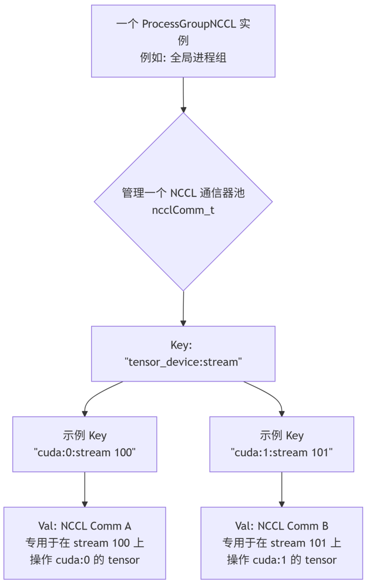

# 0 概念

NCCL 通信器 (ncclComm_t) 的核心作用是为一组特定的进程（或 GPU）定义一个唯一的、隔离的通信上下文（Context），使得在这组成员内部可以进行高效、有序的集合通信。

你可以把它想象成一个专属的私人聊天群：

有明确的成员：只有被拉进群的人（特定的一组进程/GPU）才能在群里发言和收听。

有唯一的群名（ID）：每个群都有一个独一无二的标识（**ncclUniqueId**），确保你不会误加入其他人的群。

内部交流高效有序：群里的消息（数据）只会在群成员之间传播，并且有固定的规则（通信算法）来保证大家步调一致。

# 1 NCCL 通信器 (comm) 的具体功能和重要性
## 1.1. 定义通信组 (Defining a Communication Group)

这是最根本的功能。一个通信器明确规定了：

- 有哪些成员参与通信：通过 world_size 定义总成员数。

- 每个成员是谁：通过 rank 给每个成员一个唯一的身份标识（从 0 到 world_size-1）。

- 任何集合通信操作（如 all_reduce）都只会在同一个通信器所定义的这组成员内部发生。

> 示例：假设你有 8 个 GPU，你可以创建：

> 一个通信器包含所有 8 个 GPU，用于全局同步。

> 两个通信器，每个包含 4 个 GPU（例如，前 4 个一个组，后 4 个一个组），用于分组执行不同的任务。这两个组的通信操作互不干扰。

## 1.2. 管理与优化资源 (Managing and Optimizing Resources)

在创建通信器（ncclCommInitRank）时，NCCL 会执行一系列耗时的准备工作：

- 拓扑探测：分析组内所有 GPU 之间的**连接拓扑（如 PCIe、NVLink、InfiniBand），并据此选择最快的通信路径和算法**。

- 资源分配：为即将进行的通信操作分配 GPU 内存、内核函数、网络资源等。

- 建立连接：在进程间建立必要的网络连接（如果涉及多台机器）。

*这些工作只需在初始化时做一次，之后所有使用这个 comm 的通信操作（如 all_reduce）都可以极高效地复用这些预先分配和优化好的资源。*

## 1.3 保证操作的隔离性与顺序性 (Ensuring Isolation and Ordering)

- 隔离性：不同通信器之间的操作是**完全隔离的，互不干扰**。你可以在一个通信器上执行 all_reduce 的同时，在另一个通信器上执行 broadcast。

- 顺序性：在同一个通信器和同一个 CUDA 流（Stream） 中，NCCL 操作像内核函数一样，严格按照调用的先后顺序执行。这对于保证计算的正确性至关重要。

> 一个进程组对应一个通信器，一个通信器对应一个进程组。

## 1.4. 封装连接信息 (Encapsulating Connection Information)

通信器是一个不透明的对象（ncclComm_t），对用户来说像一个“黑盒”。它内部封装了所有复杂的连接细节，如：

- 与其他 GPU 的连接句柄。

- 用于通信的算法和路径信息。

- 同步所需的状态信息。

用户无需关心这些细节，只需在调用 NCCL 函数时传入这个 comm 即可。

# 2 pytorch 中 ncclComm_t 的具体体现

## 2.1 隐式创建和使用通信器
在 PyTorch 中，通信器被完全抽象和管理在 torch.distributed 模块之下。

- 隐式创建：当你调用 torch.distributed.init_process_group(backend='nccl', ...) 时，PyTorch 在幕后为你创建了一个默认的全局通信器。

- 隐式使用：之后，当你调用任何分布式函数，如 torch.distributed.all_reduce(tensor, op=ReduceOp.SUM, group=group)：

函数内部会获取到**默认的 NCCL 通信器**。

如果你指定了 group 参数（默认为 None，表示默认的世界组），PyTorch 可能会使用为该组创建的**另一个通信器**。

执行操作时，PyTorch 会直接使用这个通信器，而无需你手动传递。

所以，在 PyTorch 中，你虽然不直接操作 comm 对象，但你通过 init_process_group 和 new_group() 等接口间接地在管理它。 每个 ProcessGroup 对象在 NCCL 后端内部都对应着**一个或多个 NCCL 通信器**。

## 2.2 为何可能一个进程组需要多个通信器



1. 多设备支持 (Multi-Device)
一个进程（一个 rank）可以控制多个 GPU。例如，在一个节点上有 8 个 GPU，你可以启动一个进程，但让这个进程使用所有 8 个 GPU 来参与分布式训练（这是一种常见的单进程多数据模式，SPMD）。

当你对位于 cuda:0 上的张量调用 all_reduce 时，NCCL 需要使用一个涉及所有进程的 cuda:0 的通信器。

紧接着，如果你又对位于 cuda:1 上的另一个张量调用 all_reduce，NCCL 需要使用另一个涉及所有进程的 cuda:1 的通信器。

每个唯一的设备（GPU）都需要一个独立的通信上下文来管理其连接和资源。因此，ProcessGroupNCCL 必须为 cuda:0, cuda:1, ..., cuda:7 分别创建和管理一个 ncclComm_t。

2. 流并发与顺序性 (Stream Concurrency and Ordering)
即使在同一个 GPU 上，为了优化性能，你也可能会使用多个 CUDA 流（Stream）来并发执行不同的操作。

NCCL 集合操作是在 CUDA 流上异步执行的。

为了保证操作的顺序性和正确性，在同一个流内的 NCCL 操作是严格顺序执行的。

然而，不同流之间的 NCCL 操作可能是并发的。为了安全地实现这种并发，PyTorch NCCL 后端可能会为同一个设备上的不同流创建不同的通信器，或者使用更复杂的同步机制。在实践中，ProcessGroupNCCL 的通信器缓存键（key）通常是 (device, stream) 对。这意味着为同一个设备的不同流可能会创建不同的通信器。

3. 性能与资源管理
**为不同的设备或流创建独立的通信器**，允许 NCCL 库为`每个特定的通信路径做针对性的优化`（例如，根据具体的 GPU 互联拓扑选择最佳算法）。同时，这也避免了不同设备或流上的操作互相争用同一个通信资源所带来的性能下降和潜在的死锁问题。

## 2.3 pytorch 中 ncclComm_t 的管理

如果你查看 PyTorch 的源码（例如 torch/csrc/distributed/c10d/ProcessGroupNCCL.hpp 和 *.cpp），你会看到 ProcessGroupNCCL 类中有类似这样的成员变量：

```cpp
std::unordered_map<std::string, std::unique_ptr<NCCLComm>> ncclComms_;
```

这里的关键（key）std::string 就是一个标识符，它通常由涉及的**设备索引和流信息**共同生成（例如 “cuda:0:stream_id”）。

**其工作流程如下：**

- 当你调用 dist.all_reduce(tensor, ...) 时，ProcessGroupNCCL 会检查 tensor.device()。

- 它用这个设备信息（和当前流）生成一个键（key）。

- 它会在 ncclComms_ 这个映射表（map）中查找是否已经存在对应的 NCCLComm 对象。

- 如果存在，则直接使用这个缓存的通信器。

- 如果不存在，它会创建一个新的 ncclComm_t，并将其缓存到映射表中供后续使用。

