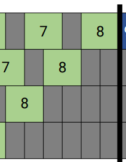
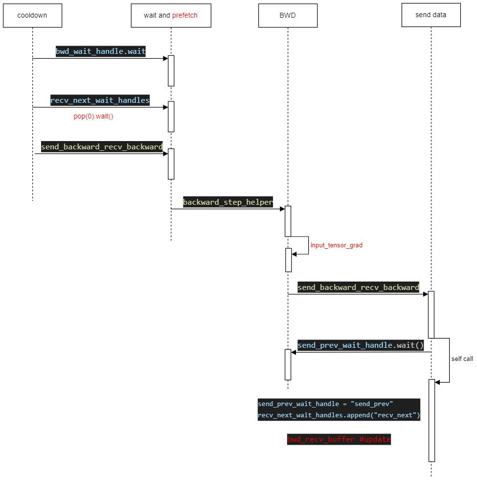

# 0 megatron-lm-pipeline-parallelism

**相关文件** <br>
megatron/core/pipeline_parallel/scheduler.py
megatron/core/pipeline_parallel/p2p_communication.py

# 1 相关数据结构

- 模型直接增加input 属性，forward_step function 里直接set

```python
def forward_step():
    ...
    set_input_tensor = get_attr_wrapped_model(model, "set_input_tensor")
    set_input_tensor(input_tensor)
    ...
```

- set 到模型的input_tensor 里

```python
class TransformerBlock(MegatronModule):
    """Transformer class."""

    def __init__(
        self,
        config: TransformerConfig,
        spec: Union[TransformerBlockSubmodules, ModuleSpec],
        post_layer_norm: bool = True,
        pre_process: bool = True,
        post_process: bool = True,
    ):
        super().__init__(config=config)

        self.submodules = _get_block_submodules(config, spec)
        self.post_layer_norm = post_layer_norm
        self.pre_process = pre_process
        self.post_process = post_process
        # Dictionary to store CUDA graphs. Number of items in the dictionary = len(self.layers).
        # Item `i` in the dictionary is a list of `N` CUDA graphs for layer 'i' where N is the
        # number of microbatches. Multiple CUDA graphs per layer is required to support
        # pipelining which requires running FWD graph of multiple microbatches before BWD graph.
        # To enable CUDA graph, this dictionary should be populated in the model training script
        # with the graphs returned by make_graphed_callables API before the first trainng step.
        self.cuda_graphs = {}
        self.current_microbatch = -1

        # required for pipeline parallel schedules
        self.input_tensor = None
```

# 2. 1F1B Pipeline Parallelism

- non-interleaved pipeline-parallel 非交织流水线并行.
- 1F1B 不支持 overlap_p2p_comm(接收到input 或 output grad 才能开始计算)
- 分三个阶段进行：warmup 阶段、steady state 阶段、cooldown 阶段
- warmup 多长更加rank 号分别计算: num_warmup_microbatches
- coldown 阶段和warmup 阶段 num_warmup_microbatches 相同

## 1.1 shedule


- warmup 阶段图示(只有前向):<br>

> recv_forward --> forward --> send_forward

- steady state 阶段图示(1F1B): <br>


> 两个通信最关键
> forward --> send_forward_recv_backward --> backward --> send_backward_recv_forward

- coldown 阶段图示(只有反向):<br>

> recv_backward --> backward --> send_backward

## 1.2 code implement

```python
def forward_backward_pipelining_without_interleaving(
    *, # 之后的参数必须通过关键字传参
    forward_step_func,
    data_iterator: Union[Iterator, List[Iterator]],
    model: Union[torch.nn.Module, List[torch.nn.Module]],
    num_microbatches: int,
    seq_length: int,
    micro_batch_size: int,
    decoder_seq_length: int = None,
    forward_only: bool = False,
    collect_non_loss_data: bool = False,
    first_val_step: bool = None,
):
    """Run non-interleaved 1F1B schedule, with communication between pipeline
    stages. Returns dictionary with losses if the last stage, empty dict otherwise."""

    if isinstance(model, list):
        assert (
            len(model) == 1
        ), "non-interleaved pipeline-parallel schedule does not support model chunking"
        model = model[0]
    if isinstance(data_iterator, list):
        assert (
            len(data_iterator) == 1
        ), "non-interleaved pipeline-parallel schedule does not support model chunking"
        data_iterator = data_iterator[0]

    # 不支持overlap_p2p_comm
    config = get_model_config(model)
    if config.overlap_p2p_comm:
        raise ValueError(
            "Non-interleaved pipeline parallelism does not support overlapping p2p communication"
        )

    # 手动清理embedding 的 buffer 缓冲区，及时释放显存
    # Needed only when gradients are finalized in M-Core
    if config.finalize_model_grads_func is not None and not forward_only:
        embedding_module = clear_embedding_activation_buffer(config, model)

    # 仅统计时间
    if config.timers is not None:
        config.timers('forward-backward', log_level=1).start(barrier=config.barrier_with_L1_time)

    # 禁用异步梯度同步, 最后统一reduce, 减少通信开销
    # Disable async grad reductions
    no_sync_func = config.no_sync_func
    if no_sync_func is None:
        no_sync_func = contextlib.nullcontext
    no_sync_context = None

    def disable_grad_sync():
        """Disable asynchronous grad reductions"""
        nonlocal no_sync_context
        if no_sync_context is None:
            no_sync_context = no_sync_func()
            no_sync_context.__enter__()

    def enable_grad_sync():
        """Enable asynchronous grad reductions"""
        nonlocal no_sync_context
        if no_sync_context is not None:
            no_sync_context.__exit__(None, None, None)
            no_sync_context = None

    disable_grad_sync() # 禁用梯度同步

    # 计算 warmup microbatches
    # 每个rank warmup 次数不同，rank0 最多，rankn-1 最少;
    # pp_size - pp_rank - 1;
    # rank 0: world_size - 1 次 warmup;
    # rank n-1: 0 次;
    num_warmup_microbatches = (
        parallel_state.get_pipeline_model_parallel_world_size()
        - parallel_state.get_pipeline_model_parallel_rank()
        - 1
    )
    num_warmup_microbatches = min(num_warmup_microbatches, num_microbatches)
    num_microbatches_remaining = num_microbatches - num_warmup_microbatches

    # 部分检查点：大于该值的必须用全部检查点，否则得用部分检查点, 进行重新计算
    # Checkpoint the activations of partial Transformer layers in a number of micro-batches
    # within the maximum outstanding micro-batch backpropagations.
    # Micro-batches with the ids less than 'num_microbatches_with_partial_activation_checkpoints'
    # checkpoint partial Transformer layers (or skip checkpointing) and
    # the rest of micro-batches within a window of micro-batches checkpoint
    # all Transformer layers. The window of micro-batches is set by the maximum
    # outstanding backpropagations and becomes smaller at later pipeline stages.
    # Please refer the appendix C in https://arxiv.org/pdf/2205.05198.pdf
    max_outstanding_backprops = None
    if config.num_microbatches_with_partial_activation_checkpoints is not None:
        max_outstanding_backprops = num_warmup_microbatches + 1

    # 模型类型: encoder-decoder or decoder-only
    model_type = get_model_type(model)
    encoder_decoder_xattn = get_model_xattn(model)

    # 获取rank
    rank = parallel_state.get_pipeline_model_parallel_rank() # rank
    recv_tensor_shapes = get_tensor_shapes(
        rank=rank - 1, # 前一个rank 的output
        model_type=model_type,
        seq_length=seq_length,
        micro_batch_size=micro_batch_size,
        decoder_seq_length=decoder_seq_length,
        config=config,
        encoder_decoder_xattn=encoder_decoder_xattn,
    )
    send_tensor_shapes = get_tensor_shapes(
        rank=rank, # 当前rank
        model_type=model_type,
        seq_length=seq_length,
        micro_batch_size=micro_batch_size,
        decoder_seq_length=decoder_seq_length,
        config=config,
        encoder_decoder_xattn=encoder_decoder_xattn,
    )

    # Input, output tensors only need to be saved when doing backward passes
    input_tensors = None
    output_tensors = None
    total_num_tokens = torch.tensor(0, dtype=torch.int).cuda()

    # 只有前向时不需要保存这些input 和 output tensors
    if not forward_only:
        input_tensors = []
        output_tensors = []
    forward_data_store = []

    # 第一阶段: 只跑forward, Run warmup forward passes.
    for i in range(num_warmup_microbatches):
        # Decide to checkpoint all layers' activations of the current micro-batch
        if max_outstanding_backprops is not None:
            checkpoint_activations_microbatch = (
                i % max_outstanding_backprops
                >= config.num_microbatches_with_partial_activation_checkpoints
            )
        else:
            checkpoint_activations_microbatch = None

        input_tensor = recv_forward(recv_tensor_shapes, config)
        output_tensor, num_tokens = forward_step(
            forward_step_func,
            data_iterator,
            model,
            num_microbatches,
            input_tensor,
            forward_data_store,
            config,
            collect_non_loss_data,
            checkpoint_activations_microbatch,
            check_first_val_step(first_val_step, forward_only, i == 0),
            current_microbatch=i,
            encoder_decoder_xattn=encoder_decoder_xattn,
        )
        send_forward(output_tensor, send_tensor_shapes, config)
        total_num_tokens += num_tokens.item() # 处理的总token数

        if not forward_only:
            # 注意：warmup 阶段input_tensors 和 output_tensors只入不出
            input_tensors.append(input_tensor)
            output_tensors.append(output_tensor)
            deallocate_output_tensor(output_tensor[0], config.deallocate_pipeline_outputs)

    # 提前接受input 前向数据
    # Before running 1F1B, need to receive first forward tensor.
    # If all microbatches are run in warmup / cooldown phase, then no need to
    # receive this tensor here.
    if num_microbatches_remaining > 0:
        input_tensor = recv_forward(recv_tensor_shapes, config)

    # Run 1F1B in steady state.
    for i in range(num_microbatches_remaining):
        # 检测是否是最后一个micro-batch iteration
        last_iteration = i == (num_microbatches_remaining - 1)

        # Decide to checkpoint all layers' activations of the current micro-batch
        if max_outstanding_backprops is not None:
            checkpoint_activations_microbatch = (
                (i + num_warmup_microbatches) % max_outstanding_backprops
            ) >= config.num_microbatches_with_partial_activation_checkpoints
        else:
            checkpoint_activations_microbatch = None

        output_tensor, num_tokens = forward_step(
            forward_step_func,
            data_iterator,
            model,
            num_microbatches,
            input_tensor,
            forward_data_store,
            config,
            collect_non_loss_data,
            checkpoint_activations_microbatch,
            check_first_val_step(
                first_val_step, forward_only, (i == 0) and (num_warmup_microbatches == 0)
            ),
            current_microbatch=i + num_warmup_microbatches,
            encoder_decoder_xattn=encoder_decoder_xattn,
        )
        total_num_tokens += num_tokens.item()

        if forward_only:
            send_forward(output_tensor, send_tensor_shapes, config)

            if not last_iteration:
                input_tensor = recv_forward(recv_tensor_shapes, config)

        else:
            # 同时进行forward send 和 backward recv
            output_tensor_grad = send_forward_recv_backward(
                output_tensor, send_tensor_shapes, config
            )

            # Add input_tensor and output_tensor to end of list.
            input_tensors.append(input_tensor)
            output_tensors.append(output_tensor)
            deallocate_output_tensor(output_tensor[0], config.deallocate_pipeline_outputs)

            # 按队列来组织，先进先出，反向传播后就不需要了，所以弹出
            # Pop input_tensor and output_tensor from the start of the list for
            # the backward pass.
            input_tensor = input_tensors.pop(0)
            output_tensor = output_tensors.pop(0)

            # Enable grad sync for the last microbatch in the batch if the full
            # backward pass completes in the 1F1B stage.
            if num_warmup_microbatches == 0 and last_iteration:
                if config.grad_sync_func is None or rank == 0:
                    enable_grad_sync()

            # 反向传播
            input_tensor_grad = backward_step(
                input_tensor, output_tensor, output_tensor_grad, model_type, config
            )

            if last_iteration:
                input_tensor = None
                send_backward(input_tensor_grad, recv_tensor_shapes, config)
            else:
                input_tensor = send_backward_recv_forward(
                    input_tensor_grad, recv_tensor_shapes, config
                )

    # 第三阶段：Run cooldown backward passes.
    if not forward_only:
        for i in range(num_warmup_microbatches):
            # 最后一个iteration 可以开始 grad_sync 了
            # Enable async grad reduction in the last backward pass
            # Note: If grad sync function is provided, only enable
            # async grad reduction in first pipeline stage. Other
            # pipeline stages do grad reduction during pipeline
            # bubble.
            if i == num_warmup_microbatches - 1:
                if config.grad_sync_func is None or rank == 0:
                    enable_grad_sync()

            input_tensor = input_tensors.pop(0)
            output_tensor = output_tensors.pop(0)

            output_tensor_grad = recv_backward(send_tensor_shapes, config)

            input_tensor_grad = backward_step(
                input_tensor, output_tensor, output_tensor_grad, model_type, config
            )

            send_backward(input_tensor_grad, recv_tensor_shapes, config)

        # Launch any remaining grad reductions.
        if no_sync_context is not None:
            enable_grad_sync()
            if config.grad_sync_func is not None:
                config.grad_sync_func(model.parameters())

    # sync model grads 对于ddp/layernorm/sequence parallelism 等情况，包括梯度检查
    if config.finalize_model_grads_func is not None and not forward_only:

        # If defer_embedding_wgrad_compute is enabled we need to do the
        # weight gradient GEMM's here.
        finish_embedding_wgrad_compute(config, embedding_module)

        # Finalize model grads (perform full grad all-reduce / reduce-scatter for
        # data parallelism, layernorm all-reduce for sequence parallelism, and
        # embedding all-reduce for pipeline parallelism).
        config.finalize_model_grads_func(
            [model], total_num_tokens if config.calculate_per_token_loss else None
        )

    if config.timers is not None:
        config.timers('forward-backward').stop()

    if hasattr(config, 'enable_cuda_graph') and config.enable_cuda_graph:
        create_cudagraphs()

    return forward_data_store
```

# 3. interleaved 1F1B Pipeline Parallelism


**要点导引** <br>

- microbatch_group_size_per_vp_stage（用N表示）: 每个虚拟阶段连续处理的微批次数量；
- 增大 N 可减少切换开销，但可能增加显存占用;
- 同样分为 warmup、steady_state、cooldown 三个阶段;
- 遍历total_num_microbatches 而不是 num_microbatches:  total_num_microbatches = num_microbatches * num_model_chunks

- 前 num_warmup_microbatches 个微批次用于填满流水线（确保每个阶段都有数据可处理）。填满后，流水线进入稳定运行状态;
- 前向的第一个stage, 反向的最后一个stage 是leading stage;
- leading_pipeline_stage 的 前 (pipeline_parallel_size - 1) 个 micro-batch 不需要recv;
- next_model_chunk_id : 当前staged 接收(receive) tensor 的chunk_id;
- recv_prev 是为 k + 1 iteration 进行prefetch 准备的

## 2.1 introduce Auxiliary variables

### 2.1.1 引入 virtual_microbatch_id

引入：**total_num_microbatches** = num_microbatches * num_model_chunks and **virtual_microbatch_id**

```python
# Convention used in this function:
# num_microbatches for number of microbatches per pipeline stage;
# num_model_chunks for virtual pipeline size;
# then total_num_microbatches = num_microbatches * num_model_chunks.
# Their corresponding index variables are
# microbatch_id in [0, num_microbatches)
# model_chunk_id in [0, num_model_chunks)
# virtual_microbatch_id in [0, total_num_microbatches)

# build schedule lookup table
# PP2 N3M5 with VP2 is constructed as below:
# virtual_microbatch_id | 0 1 2 3 4 5 6 7 8 9
# microbatch_id         | 0 1 2 0 1 2 3 4 3 4
# model_chunk_id        | 0 0 0 1 1 1 0 0 1 1


# Decouple lookup table
# Decouple individual lookup table for microbatch_id and model_chunk_id.
# For example, the micro-batch table for PP2 N3M5 with VP2 is
# virtual_microbatch_id | 0 1 2 3 4 5 6 7 8 9  # virtual_microbatch_id 直接查询 microbatch_id
# microbatch_id         | 0 1 2 0 1 2 3 4 3 4
# Similarly, the model chunk table is
# virtual_microbatch_id | 0 1 2 3 4 5 6 7 8 9  # virtual_microbatch_id 直接查询 model_chunk_id
# model_chunk_id        | 0 0 0 1 1 1 0 0 1 1
# Both tables are indexed with virtual_microbatch_id.
```

### 2.1.2 通信接口和相关handles
**send_forward_recv_forward相关操作**
- send_forward_recv_forward : 从前一个rank 接收input_tensor, 发送output_tensor给next rank, 如果overlap=true, 还得到fwd_wait_handles，用于等待inputs recv;
- fwd_wait_handles : 同步所有前向传播阶段的通信操作，包括发送（send）和接收（recv）操作;
- fwd_wait_recv_handles: 专门用于 同步前向传播阶段的接收操作（recv），仅关注从上游阶段接收数据的通信句柄.
- 常见的几种句柄：["recv_prev", "recv_next", "send_prev", "send_next"]


**send_forward_backward_recv_forward_backward**
- 发送当前stage 的 output_tensor_grad 和 input_tensor_grad;
- 接收前stage 的 output_tensor 和 下一个staged 的 input_tensor_grad;
- 无句柄返回 ？？？

**send_backward_recv_backward**

## 2.2 warmup 阶段


各stage 的 num_warmup_microbatches 不同，按照上图和如下公式计算: <br>

- warmup 次数:
```python
# Run (num_model_chunks-1)*config.microbatch_group_size_per_vp_stage on all workers,
# followed by more microbatches after depending on stage ID
# (more forward passes for earlier stages, later stages can immediately start with 1F1B).
# *2 是确保流水线中前向传播（forward）和反向传播（backward）阶段的计算重叠，从而避免流水线空转，最大化硬件利用率。
num_warmup_microbatches = (pipeline_parallel_size - pipeline_parallel_rank - 1) * 2
num_warmup_microbatches += (
    num_model_chunks - 1
) * config.microbatch_group_size_per_vp_stage
```

warmup warmup 阶段流水线图如下(异步模式):


**warmup 阶段的代码如下** <br>

```python
    # 第一阶段: Run warmup forward passes. 预热阶段
    parallel_state.set_virtual_pipeline_model_parallel_rank(0) # 固定为: 0？
    input_tensors[0].append(p2p_communication.recv_forward(tensor_shape, config)) # receive forward

    fwd_wait_handles = None      # send_forward_recv_forward
    fwd_wait_recv_handles = None #
    bwd_wait_handles = None
    bwd_wait_recv_handles = None
    if parallel_state.is_pipeline_first_stage(ignore_virtual=True):
        fwd_recv_buffer_size = (
            config.microbatch_group_size_per_vp_stage - pipeline_parallel_size + 1
        )
    else:
        fwd_recv_buffer_size = 1
    if parallel_state.is_pipeline_last_stage(ignore_virtual=True):
        bwd_recv_buffer_size = (
            config.microbatch_group_size_per_vp_stage - pipeline_parallel_size + 1
        )
    else:
        bwd_recv_buffer_size = 1
    fwd_recv_buffer = [None] * fwd_recv_buffer_size # 可能是 0 或 1
    bwd_recv_buffer = [None] * bwd_recv_buffer_size # 可能是 0 或 1
    recv_prev_wait_handles = []  # 前向时从前一个stage提前加载数据
    send_next_wait_handle = None # handle 对应的variable, 用于wait
    send_prev_wait_handle = None # handle 绑定的变量，用于wait
    recv_next_wait_handles = []  # 反向时从下一个stage 提前获取数据

    for k in range(num_warmup_microbatches):
        cur_model_chunk_id = get_model_chunk_id(k, forward=True) # 得到 model 的 chunk_id
        parallel_state.set_virtual_pipeline_model_parallel_rank(cur_model_chunk_id) # virtual_pp_rank 就是 chunk_id

        if config.overlap_p2p_comm_warmup_flush:
            if not parallel_state.is_pipeline_first_stage() and k != 0:
                assert recv_prev_wait_handles, (
                    f'pp rank {pipeline_parallel_rank}, iteration {k},'
                    'should have registered recv handle'
                )
                recv_prev_wait_handle = recv_prev_wait_handles.pop(0)
                recv_prev_wait_handle.wait() # 等待当前chunk 的 input tensor 接收完成

        # Determine if tensor should be received from previous stage.
        # 下一个chunk是否需要recv 以及那个chunk在receive
        recv_prev, next_forward_model_chunk_id = recv_tensor_from_previous_stage(k, forward=True)

        # No receive in last iteration when recv iteration k+1.
        if k == (total_num_microbatches - 1): # 如果已经是最后一个iteration 了，就不能再recv 了。
            recv_prev = False

        # Prefetch recv for iteration k+1 for non-first ranks. # 在此开始prefetch ： k+1
        if config.overlap_p2p_comm_warmup_flush and not parallel_state.is_pipeline_first_stage(
            ignore_virtual=True
        ):
            # 下一个 virtual step 提前开始预取 : 没有发送只有 prefetch
            fwd_recv_buffer[k % fwd_recv_buffer_size], fwd_wait_recv_handles = ( # wait_recv: 等待接收的handle
                p2p_communication.send_forward_recv_forward(
                    output_tensor=None,  # No output_tensor to send.
                    recv_prev=recv_prev, # only prefetch receive
                    tensor_shape=tensor_shape,
                    config=config,
                    overlap_p2p_comm=True, # overlap_p2p_comm_warmup_flush True 是，overlap_p2p_comm 一定为True
                )
            )

            # 获取prefetch 的handle
            if fwd_wait_recv_handles:
                recv_prev_wait_handles.append(fwd_wait_recv_handles.pop("recv_prev")) # 获取recv_prev 的handle 传给recv_prev_wait_handles

        # Decide to checkpoint all layers' activations of the current micro-batch.
        if max_outstanding_backprops is not None:
            checkpoint_activations_microbatch = (
                k % max_outstanding_backprops
                >= config.num_microbatches_with_partial_activation_checkpoints
            )
        else:
            checkpoint_activations_microbatch = None

        microbatch_id = get_microbatch_id_in_model_chunk(k, forward=True) # 从virtual microbatch_id 获取 microbatch_id
        output_tensor = forward_step_helper(k, microbatch_id, checkpoint_activations_microbatch) # 前向在这里进行

        # Don't send tensor downstream if on last stage.
        if parallel_state.is_pipeline_last_stage(): # 要考虑到还得不能是virtual stage 的前几个stage
            output_tensor = None

        # Send and receive tensors as appropriate (send tensors computed
        # in this iteration; receive tensors for next iteration).
        if not config.overlap_p2p_comm_warmup_flush: # 发送output 数据了该
            if (
                k == (num_warmup_microbatches - 1)
                and not config.overlap_p2p_comm
                and not forward_only
                and not all_warmup_microbatches
            ): # 最后一个warmup_microbatch 并且 没有overlap_p2p_comm，并且不是forward_only，并且不是all_warmup_microbatches
                input_tensor_grad = None
                recv_next = True
                if parallel_state.is_pipeline_last_stage(ignore_virtual=True):
                    recv_next = False
                (input_tensor, output_tensor_grad) = ( # 同步接口给，无句柄返回
                    p2p_communication.send_forward_backward_recv_forward_backward( # 最后一个microbatch 可以尝试接收梯度了
                        output_tensor,
                        input_tensor_grad,  # 占位符，用同一个接口
                        recv_prev=recv_prev,
                        recv_next=recv_next,
                        tensor_shape=tensor_shape,
                        config=config,
                    )
                )
                output_tensor_grads[num_model_chunks - 1].append(output_tensor_grad)
            else: # 没有overlap, 直接接收 input_tensor
                input_tensor = p2p_communication.send_forward_recv_forward(
                    output_tensor, recv_prev=recv_prev, tensor_shape=tensor_shape, config=config
                )
            if recv_prev:
                input_tensors[next_forward_model_chunk_id].append(input_tensor) # 缓存 input_tensor
            deallocate_output_tensor(output_tensor, config.deallocate_pipeline_outputs) # 释放 output_tensor，可以重计算来获得
        else: # 配置了overlap
            if not parallel_state.is_pipeline_first_stage(ignore_virtual=True):
                # Send only since recv prefetched. receive 被提前做了，所以这里only send
                _, fwd_wait_handles = p2p_communication.send_forward_recv_forward( # only send ...
                    output_tensor,
                    recv_prev=False,
                    tensor_shape=tensor_shape,
                    config=config,
                    overlap_p2p_comm=True,
                )
            else:  # No prefetch for first rank, so both send and recv initiated.
                fwd_recv_buffer[k % fwd_recv_buffer_size], fwd_wait_handles = ( # fwd_recv_buffer 可以用ping-pang模式来接收数据 !!!
                    p2p_communication.send_forward_recv_forward(
                        output_tensor,
                        recv_prev=recv_prev,
                        tensor_shape=tensor_shape,
                        config=config,
                        overlap_p2p_comm=True,
                    )
                )
            if send_next_wait_handle is not None:
                send_next_wait_handle.wait() # send_next 在这里等待
            if fwd_wait_handles is not None:
                send_next_wait_handle = ( # 这里弹出，下一个iter wait
                    fwd_wait_handles.pop("send_next") if "send_next" in fwd_wait_handles else None
                )
                if "recv_prev" in fwd_wait_handles:
                    recv_prev_wait_handles.append(fwd_wait_handles.pop("recv_prev"))

            deallocate_output_tensor(output_tensor, config.deallocate_pipeline_outputs)
            if recv_prev:
                input_tensors[next_forward_model_chunk_id].append(
                    fwd_recv_buffer[k % fwd_recv_buffer_size] # 当如到对应的model_chunk 里
                )
                fwd_recv_buffer[(k + 1) % fwd_recv_buffer_size] = None # 下一批次，置none

        if config.overlap_p2p_comm: # 提前开始recv backward
            if (
                k == (num_warmup_microbatches - 1) # 最后一个 iter 才提前recv
                and not forward_only
                and not all_warmup_microbatches
            ):
                input_tensor_grad = None
                recv_next = True # recv_next ? 从下一个 stage recv ?
                if parallel_state.is_pipeline_last_stage(ignore_virtual=True):
                    recv_next = False # 最后一个stage 就不用recv 了，因为是最后一个啊。

                (bwd_recv_buffer[-1], bwd_wait_handles) = (
                    p2p_communication.send_backward_recv_backward(
                        input_tensor_grad,
                        recv_next=recv_next,
                        tensor_shape=tensor_shape,
                        config=config,
                        overlap_p2p_comm=True,
                    )
                )
                if send_prev_wait_handle is not None:
                    send_prev_wait_handle.wait()
                if bwd_wait_handles is not None:
                    send_prev_wait_handle = (
                        bwd_wait_handles.pop("send_prev")
                        if "send_prev" in bwd_wait_handles
                        else None
                    )
                    if "recv_next" in bwd_wait_handles:
                        recv_next_wait_handles.append(bwd_wait_handles.pop("recv_next"))

                if recv_next:
                    output_tensor_grads[num_model_chunks - 1].append(bwd_recv_buffer[-1])
```

## 2.3 steady 稳定运行阶段

> forward_k = k + num_warmup_microbatches
> recv_prev_wait_handles.pop(0).wait()
> iteration: forward_k = k + num_warmup_microbatches and backward_k = k

**流程图** <br>


**python code implemente** <br>

```python
# Run 1F1B in steady state.
    for k in range(num_microbatches_remaining):
        # Forward pass.
        forward_k = k + num_warmup_microbatches

        # Decide to checkpoint all layers' activations of the current micro-batch.
        if max_outstanding_backprops is not None:
            checkpoint_activations_microbatch = (
                forward_k % max_outstanding_backprops
                >= config.num_microbatches_with_partial_activation_checkpoints
            )
        else:
            checkpoint_activations_microbatch = None

        cur_model_chunk_id = get_model_chunk_id(forward_k, forward=True)
        parallel_state.set_virtual_pipeline_model_parallel_rank(cur_model_chunk_id)
        microbatch_id = get_microbatch_id_in_model_chunk(forward_k, forward=True)
        if config.overlap_p2p_comm:
            if not parallel_state.is_pipeline_first_stage():
                if config.overlap_p2p_comm_warmup_flush:
                    assert recv_prev_wait_handles, (
                        f'pp rank {pipeline_parallel_rank}, fwd iteration {forward_k}, '
                        'should have registered recv handle'
                    )
                    recv_prev_wait_handle = recv_prev_wait_handles.pop(0)
                    recv_prev_wait_handle.wait()
                else:
                    if recv_prev_wait_handles is not None and recv_prev_wait_handles:
                        recv_prev_wait_handle = recv_prev_wait_handles.pop(0)
                        recv_prev_wait_handle.wait()

            deallocate_output_tensor(output_tensor, config.deallocate_pipeline_outputs)

            output_tensor = forward_step_helper(
                forward_k, microbatch_id, checkpoint_activations_microbatch
            )

            # Determine if current stage has anything to send in either direction,
            # otherwise set tensor to None.
            forward_model_chunk_id = get_model_chunk_id(forward_k, forward=True)
            parallel_state.set_virtual_pipeline_model_parallel_rank(forward_model_chunk_id)

            # Last virtual stage no activation tensor to send.
            if parallel_state.is_pipeline_last_stage():
                output_tensor = None

            recv_prev, next_forward_model_chunk_id = recv_tensor_from_previous_stage(
                forward_k, forward=True
            )

            # If last iteration, don't receive; we already received one extra
            # before the start of the for loop.
            if k == (num_microbatches_remaining - 1):
                recv_prev = False

            # Send activation tensor to the next stage and receive activation tensor from the
            # previous stage
            fwd_recv_buffer[forward_k % fwd_recv_buffer_size], fwd_wait_handles = (
                p2p_communication.send_forward_recv_forward(
                    output_tensor,
                    recv_prev=recv_prev,
                    tensor_shape=tensor_shape,
                    config=config,
                    overlap_p2p_comm=True,
                )
            )
            if send_next_wait_handle is not None:
                send_next_wait_handle.wait()
            if fwd_wait_handles is not None:
                send_next_wait_handle = (
                    fwd_wait_handles.pop("send_next") if "send_next" in fwd_wait_handles else None
                )
                if "recv_prev" in fwd_wait_handles:
                    recv_prev_wait_handles.append(fwd_wait_handles.pop("recv_prev"))
            # assert fwd_wait_handles is not None

            # Backward pass.
            backward_k = k
            backward_model_chunk_id = get_model_chunk_id(backward_k, forward=False)
            parallel_state.set_virtual_pipeline_model_parallel_rank(backward_model_chunk_id)
            if not parallel_state.is_pipeline_last_stage():
                if config.overlap_p2p_comm_warmup_flush:
                    assert recv_next_wait_handles, (
                        f'pp rank {pipeline_parallel_rank}, bwd iteration {backward_k}, '
                        'should have registered recv next handle'
                    )
                    recv_next_wait_handle = recv_next_wait_handles.pop(0)
                    recv_next_wait_handle.wait()
                else:
                    if recv_next_wait_handles is not None and recv_next_wait_handles:
                        recv_next_wait_handle = recv_next_wait_handles.pop(0)
                        recv_next_wait_handle.wait()

            input_tensor_grad = backward_step_helper(backward_k)

            # First virtual stage no activation gradient tensor to send.
            if parallel_state.is_pipeline_first_stage():
                input_tensor_grad = None

            recv_next, next_backward_model_chunk_id = recv_tensor_from_previous_stage(
                backward_k, forward=False
            )

            (bwd_recv_buffer[backward_k % bwd_recv_buffer_size], bwd_wait_handles) = (
                p2p_communication.send_backward_recv_backward(
                    input_tensor_grad,
                    recv_next=recv_next,
                    tensor_shape=tensor_shape,
                    config=config,
                    overlap_p2p_comm=True,
                )
            )
            if send_prev_wait_handle is not None:
                send_prev_wait_handle.wait()
            if bwd_wait_handles is not None:
                send_prev_wait_handle = (
                    bwd_wait_handles.pop("send_prev") if "send_prev" in bwd_wait_handles else None
                )
                if "recv_next" in bwd_wait_handles:
                    recv_next_wait_handles.append(bwd_wait_handles.pop("recv_next"))

            # Put input_tensor and output_tensor_grad in data structures in the
            # right location.
            if recv_prev:
                input_tensors[next_forward_model_chunk_id].append(
                    fwd_recv_buffer[forward_k % fwd_recv_buffer_size]
                )
                fwd_recv_buffer[(forward_k + 1) % fwd_recv_buffer_size] = None
            if recv_next:
                output_tensor_grads[next_backward_model_chunk_id].append(
                    bwd_recv_buffer[backward_k % bwd_recv_buffer_size]
                )
                bwd_recv_buffer[(backward_k + 1) % bwd_recv_buffer_size] = None
        else:  # No p2p overlap.
            output_tensor = forward_step_helper(
                forward_k, microbatch_id, checkpoint_activations_microbatch
            )

            # Backward pass.
            backward_k = k
            input_tensor_grad = backward_step_helper(backward_k)

            # Send output_tensor and input_tensor_grad, receive input_tensor
            # and output_tensor_grad.

            # Determine if current stage has anything to send in either direction,
            # otherwise set tensor to None.
            forward_model_chunk_id = get_model_chunk_id(forward_k, forward=True)
            parallel_state.set_virtual_pipeline_model_parallel_rank(forward_model_chunk_id)
            if parallel_state.is_pipeline_last_stage():
                output_tensor = None

            backward_model_chunk_id = get_model_chunk_id(backward_k, forward=False)
            parallel_state.set_virtual_pipeline_model_parallel_rank(backward_model_chunk_id)
            if parallel_state.is_pipeline_first_stage():
                input_tensor_grad = None

            recv_prev, next_forward_model_chunk_id = recv_tensor_from_previous_stage(
                forward_k, forward=True
            )

            recv_next, next_backward_model_chunk_id = recv_tensor_from_previous_stage(
                backward_k, forward=False
            )

            # If last iteration, don't receive; we already received one extra
            # before the start of the for loop.
            if k == (num_microbatches_remaining - 1):
                recv_prev = False

            # Communicate tensors.
            (input_tensor, output_tensor_grad) = (
                p2p_communication.send_forward_backward_recv_forward_backward(
                    output_tensor,
                    input_tensor_grad,
                    recv_prev=recv_prev,
                    recv_next=recv_next,
                    tensor_shape=tensor_shape,
                    config=config,
                )
            )
            deallocate_output_tensor(output_tensor, config.deallocate_pipeline_outputs)

            # Put input_tensor and output_tensor_grad in data structures in the
            # right location.
            if recv_prev:
                input_tensors[next_forward_model_chunk_id].append(input_tensor)
            if recv_next:
                output_tensor_grads[next_backward_model_chunk_id].append(output_tensor_grad)

    deallocate_output_tensor(output_tensor, config.deallocate_pipeline_outputs)
```

## 2.4 cooldown 冷却阶段
iteration range: range(num_microbatches_remaining, total_num_microbatches)




```python
# Run cooldown backward passes (flush out pipeline).
    if not forward_only:
        if bwd_wait_handles is not None:
            for bwd_wait_handle in bwd_wait_handles.values():
                bwd_wait_handle.wait()

        if all_warmup_microbatches:
            output_tensor_grads[num_model_chunks - 1].append(
                p2p_communication.recv_backward(tensor_shape, config=config)
            )
        for k in range(num_microbatches_remaining, total_num_microbatches):
            cur_model_chunk_id = get_model_chunk_id(k, forward=False)
            parallel_state.set_virtual_pipeline_model_parallel_rank(cur_model_chunk_id)
            if not parallel_state.is_pipeline_last_stage() and k != 0:
                if config.overlap_p2p_comm_warmup_flush:
                    assert recv_next_wait_handles, (
                        f'pp rank {pipeline_parallel_rank}, backward iteration {k}, '
                        'should have registered recv next handle'
                    )
                    recv_next_wait_handle = recv_next_wait_handles.pop(0)
                    recv_next_wait_handle.wait()
                else:
                    if recv_next_wait_handles is not None and recv_next_wait_handles:
                        recv_next_wait_handle = recv_next_wait_handles.pop(0)
                        recv_next_wait_handle.wait()

            recv_next, next_backward_model_chunk_id = recv_tensor_from_previous_stage(
                k, forward=False
            )

            if k == (total_num_microbatches - 1):
                recv_next = False

            # Prefetch recv for backward iteration k+1 for non last ranks.
            if config.overlap_p2p_comm_warmup_flush and not parallel_state.is_pipeline_last_stage(
                ignore_virtual=True
            ):
                bwd_recv_buffer[k % bwd_recv_buffer_size], bwd_wait_recv_handles = (
                    p2p_communication.send_backward_recv_backward(
                        input_tensor_grad=None,  # No input_tensor_grad to send.
                        recv_next=recv_next,
                        tensor_shape=tensor_shape,
                        config=config,
                        overlap_p2p_comm=True,
                    )
                )

                if bwd_wait_recv_handles:
                    recv_next_wait_handles.append(bwd_wait_recv_handles.pop("recv_next"))

            input_tensor_grad = backward_step_helper(k)

            # First virtual stage no activation gradient tensor to send.
            if parallel_state.is_pipeline_first_stage():
                input_tensor_grad = None

            if config.overlap_p2p_comm_warmup_flush:
                if not parallel_state.is_pipeline_last_stage(ignore_virtual=True):
                    _, bwd_wait_handles = p2p_communication.send_backward_recv_backward(
                        input_tensor_grad,
                        recv_next=False,
                        tensor_shape=tensor_shape,
                        config=config,
                        overlap_p2p_comm=True,
                    )
                else:
                    bwd_recv_buffer[k % bwd_recv_buffer_size], bwd_wait_handles = (
                        p2p_communication.send_backward_recv_backward(
                            input_tensor_grad,
                            recv_next=recv_next,
                            tensor_shape=tensor_shape,
                            config=config,
                            overlap_p2p_comm=True,
                        )
                    )

                if send_prev_wait_handle is not None:
                    send_prev_wait_handle.wait()
                if bwd_wait_handles is not None:
                    send_prev_wait_handle = (
                        bwd_wait_handles.pop("send_prev")
                        if "send_prev" in bwd_wait_handles
                        else None
                    )
                    if "recv_next" in bwd_wait_handles:
                        recv_next_wait_handles.append(bwd_wait_handles.pop("recv_next"))
                if recv_next:
                    output_tensor_grads[next_backward_model_chunk_id].append(
                        bwd_recv_buffer[k % bwd_recv_buffer_size]
                    )
                    bwd_recv_buffer[(k + 1) % bwd_recv_buffer_size] = None

            else:
                output_tensor_grad = p2p_communication.send_backward_recv_backward(
                    input_tensor_grad, recv_next=recv_next, tensor_shape=tensor_shape, config=config
                )

                if recv_next:
                    output_tensor_grads[next_backward_model_chunk_id].append(output_tensor_grad)

        if send_prev_wait_handle is not None:
            send_prev_wait_handle.wait()

        # Launch any remaining grad reductions.
        enable_grad_sync()
        if config.grad_sync_func is not None:
            for model_chunk_id in range(num_model_chunks):
                if model_chunk_id not in synchronized_model_chunks:
                    config.grad_sync_func[model_chunk_id](images/model[model_chunk_id].parameters())
                    synchronized_model_chunks.add(model_chunk_id)
```