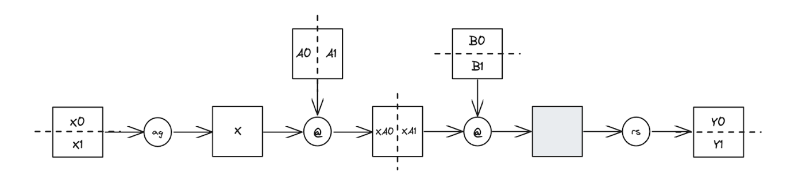
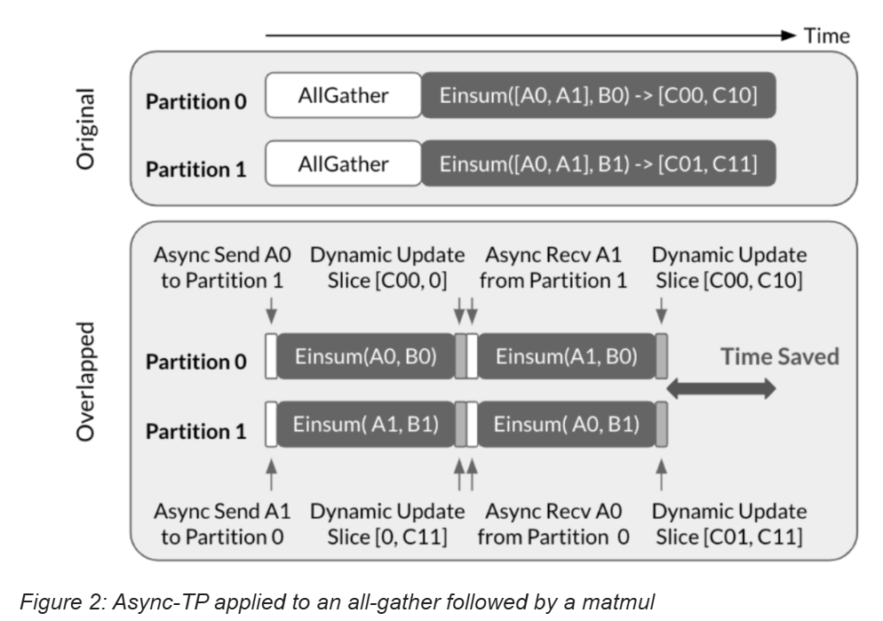

# 1 TP

张量并行（TP）是一种广泛使用的模型并行技术。与仅限于在批处理维度上划分计算的数据并行不同，TP进一步沿着特征维度分布计算，使得多个GPU可以同时处理相同的样本。这一特性使TP在大规模语言模型（LLM）训练中至关重要，允许设备数量超过全局批处理大小进行扩展。 

作为简要回顾，该图展示了应用于跨两个设备分片的两层前馈神经网络（FFN）的张量并行（TP）。我们从**按行**分片的输入[X0, X1]、**按列**分片的线性权重[A0, A1]以及**按行**分片的线性权重[B0, B1]开始。首先，在[X0, X1]上执行**all-gather**操作以**生成未分片的输入X**。然后，分别在每个设备上独立计算X @ A0 @ B0 和 X @ A1 @ B1，激活值保持分片状态。最后，通过**reduce-scatter**将未分片输出的部分和组合起来，形成最终的分片输出。

这种方法通过尽可能长时间地保持激活的分片状态，有效地减少了通信量。然而，由于**通信是暴露的**，仍然存在效率挑战。异步张量并行性是一种旨在解决此问题的优化方法。 

# 2 Async TP

据我们所知，异步张量并行（async-TP [1]）的概念最早在论文[Breaking the Computation and Communication Abstraction Barrier in Distributed Machine Learning Workloads](https://arxiv.org/abs/2105.05720)中提出，尽管还有几项平行努力，包括王等人2022年的研究和张等人2024年的研究。关键的见解是，通过**分解(decomposing)**依赖的通信和计算操作符，我们可以创造出重叠机会。

王等人提供的图表说明了如何将这种技术应用于allgather后接matmul的场景. all-gather被分解为send和recv操作,而矩阵乘法则被划分为sub-matmuls(子矩阵乘法)。通过这种分解方式，可以**在计算一个子矩阵乘法的同时传输下一个子矩阵乘法所需的数据**，从而有效地隐藏通信延迟。

**核心逻辑**  
> 每一个 token 要经过每一张GPU 上的两个矩阵乘法，得到最终output, 每张卡上的结果reduce到一个指定的GPU上.

# 3 参考连接
- [doc](https://discuss.pytorch.org/t/distributed-w-torchtitan-introducing-async-tensor-parallelism-in-pytorch/209487)
