# veScale: 一致且高效的Eager模式SPMD分布式训练系统

> **论文**: veScale: Consistent and Efficient Tensor Programming with Eager-Mode SPMD
> **机构**: ByteDance Seed
> **arXiv**: 2509.07003v1

---

## 📋 目录

1. [核心问题与解决方案](#核心问题与解决方案)
2. [系统架构概览](#系统架构概览)
3. [关键技术详解](#关键技术详解)
4. [使用教程](#使用教程)
5. [性能优势](#性能优势)

---

## 🎯 核心问题与解决方案

### 现有系统的两大挑战

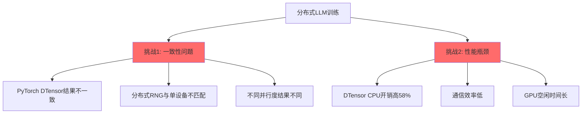

### veScale的三大解决方案

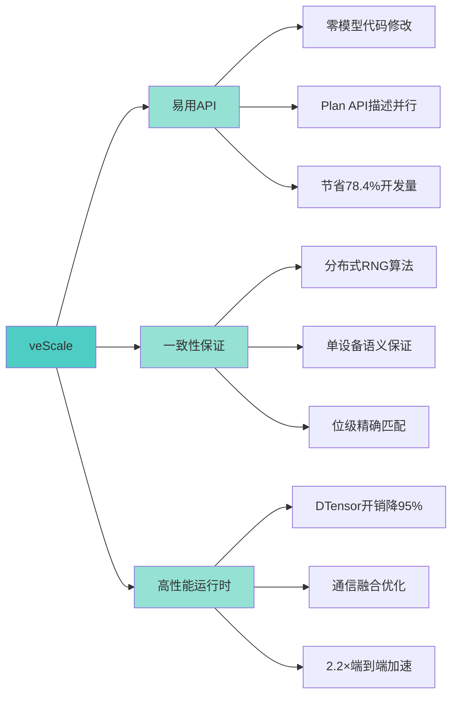

---

## 🏗️ 系统架构概览

### 整体流程图

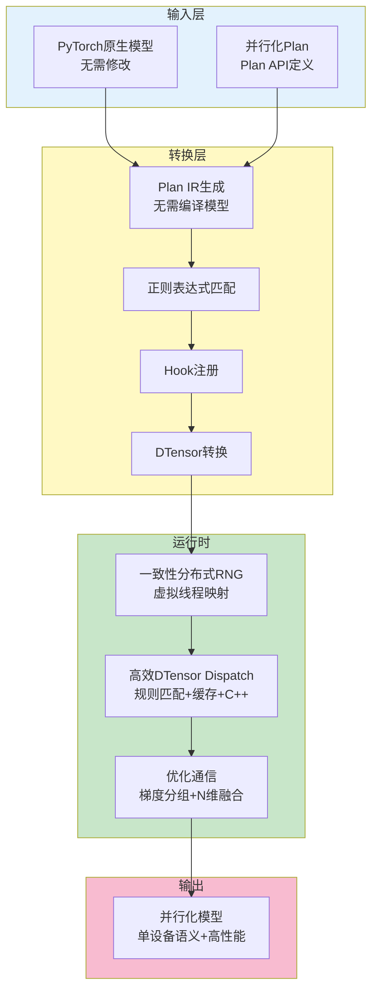

### 核心组件关系

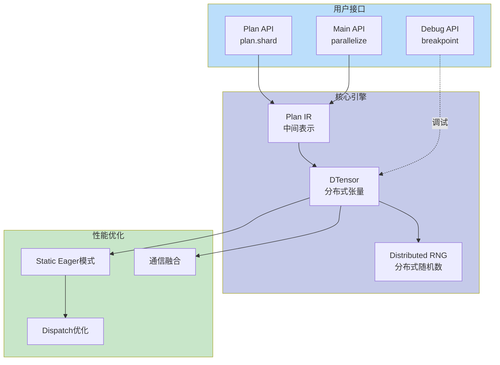

---

## 🔧 关键技术详解

### 1. 分布式RNG算法：虚拟线程映射

#### 问题对比

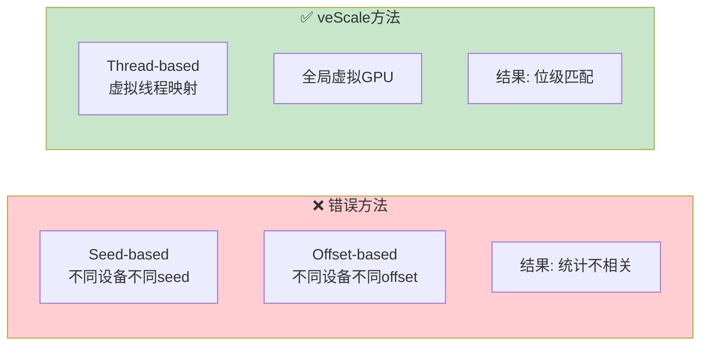

#### 虚拟线程算法流程

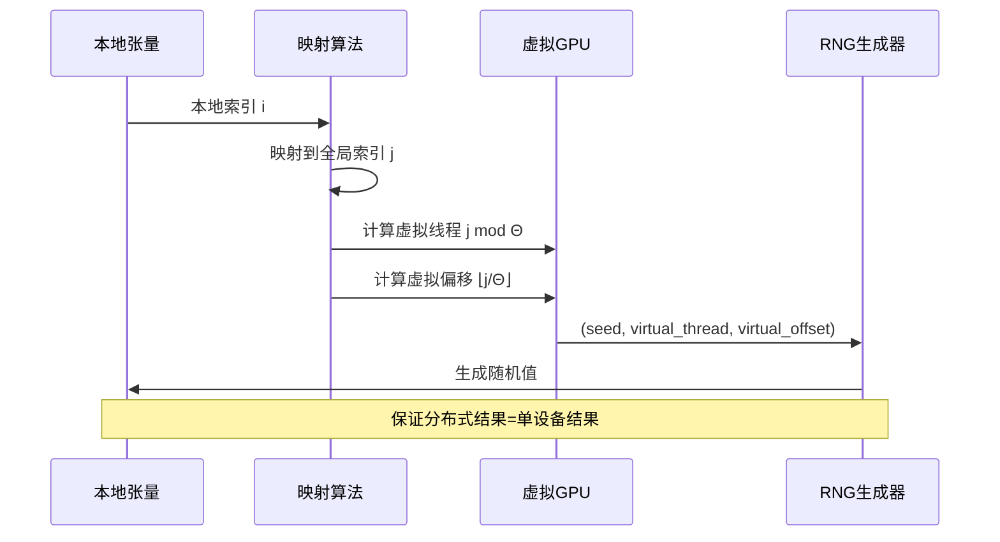

#### 关键代码逻辑

```python
# 算法伪代码
for i in range(local_tensor_size):
    # 1. 映射本地索引到全局索引
    global_index = map_local_to_global(i, tensor_coord, global_shape)

    # 2. 虚拟化线程和偏移
    virtual_thread = global_index % global_thread_count
    virtual_offset = global_index // global_thread_count

    # 3. 生成随机值（全局视角）
    random_value = curand(global_seed, virtual_thread, virtual_offset)
    local_tensor[i] = random_value
```

### 2. DTensor性能优化：三层递进

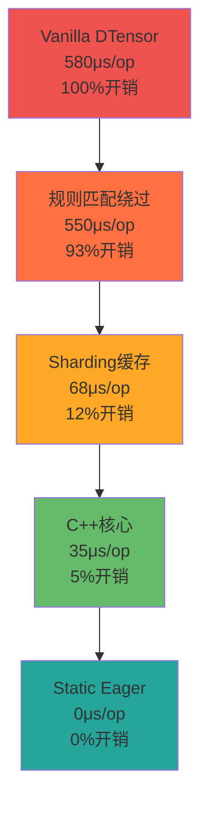

#### 优化技术对比

| 优化层级 | 技术 | 开销降低 | 适用场景 |
|---------|------|---------|---------|
| **Level 1** | 规则匹配绕过 | 7% | 已知输出元数据的算子 |
| **Level 2** | Sharding缓存 | 81% | 重复模块结构（LLM） |
| **Level 3** | C++ Core | 7% | 关键路径计算 |
| **Level 4** | Static Eager | 5% | 元数据静态的运行时 |

### 3. 通信优化：N维融合

#### 传统方法 vs veScale

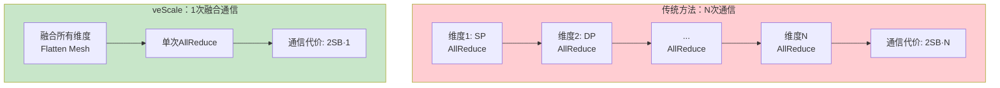

#### 融合算法步骤

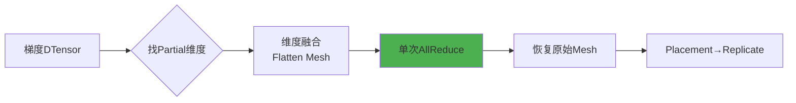

---

## 📚 使用教程

### Step 1: 定义并行策略（Plan API）

```python
from vescale import VescalePlan, Shard, Replicate

plan = VescalePlan()

# ========== Tensor Parallel ==========
# fc1输入复制，权重按列切分
plan.shard("blk\d+.fc1.<in>", Replicate, mesh="TP")
plan.shard("blk\d+.fc1.weight", Shard(1), mesh="TP")

# fc2权重按行切分
plan.shard("blk\d+.fc2.weight", Shard(0), mesh="TP")

# ========== Sequence Parallel ==========
# LayerNorm输入按序列维度切分
plan.shard("blk\d+.ln1.<in>", Shard(1), mesh="TP")
plan.shard("blk\d+.ln1.weight", Replicate, mesh="TP")

# ========== ZeRO-3 Parallel ==========
# 初始化时切分，运行时复制
plan.shard("blk\d+.\w+.weight", Shard(0), mesh="DP", phase="INIT")
plan.shard("blk\d+.\w+.weight", Replicate, mesh="DP", phase="RUN")
```

### Step 2: 应用并行化

```python
import torch
import vescale

# 原始单设备模型（无需修改！）
model = YourModel()

# 一行代码并行化
model = vescale.parallelize(model, plan)

# 优化器自动并行化
optim = torch.optim.Adam(model.parameters())

# 训练循环（单设备写法！）
for batch in data_loader:
    loss = model(batch)
    loss.backward()
    optim.step()

    # 可交互式调试
    vescale.breakpoint()  # 分布式环境下的断点调试
```

### 核心API对比

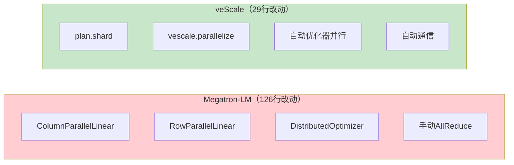

### 高级特性：Static Eager模式

```python
# 场景：MoE等包含大量轻量算子的模型

# 描述动态元数据
plan.redistribute("matmul.<in>", src=Shard(0), dst=Replicate)
plan.annotate("weight.grad", Partial)
plan.annotate("dropout.<in>", Shard(0))

# 运行时零开销
# - 直接本地张量执行
# - 无DTensor dispatch
# - 通过Plan IR预描述的Hook实现通信
```

---

## 📊 性能优势

### 端到端性能对比

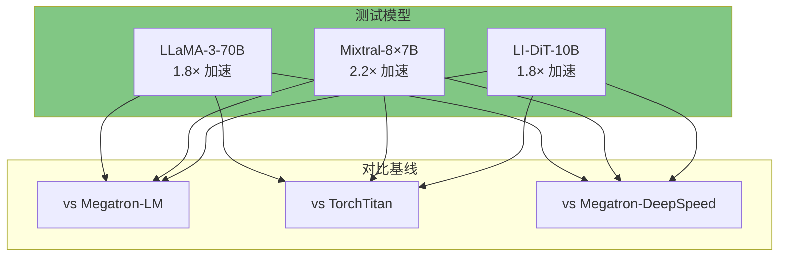

### 开发效率对比

| 系统 | LLaMA-3 | Mixtral | LI-DiT |
|------|---------|---------|--------|
| **Megatron-LM** | 126行 | 162行 | 82行 |
| **TorchTitan** | 63行 | 100行 | 95行 |
| **veScale** | **29行** | **38行** | **38行** |
| **节省比例** | **77%** | **76%** | **78%** |

### 一致性验证

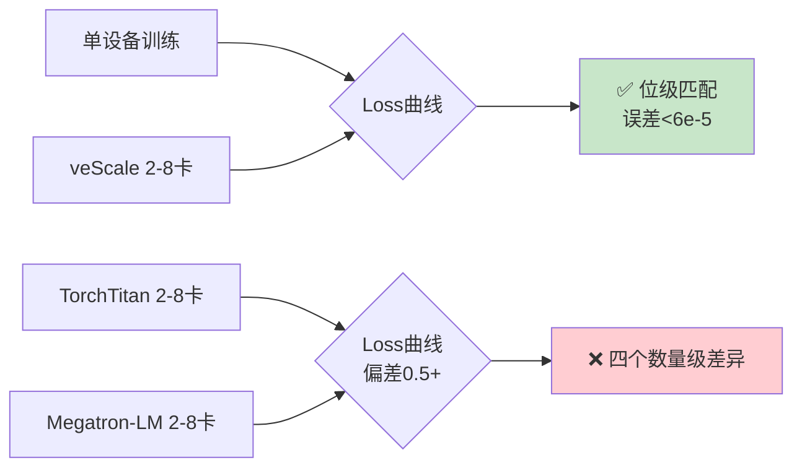

---

## 🎓 关键概念速查

### SPMD (Single Program Multiple Data)


### DTensor工作流

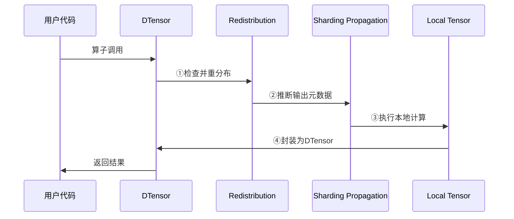

### Plan IR示例

```
# 用户Plan API
plan.shard("blk1.fc1.<in>", Replicate, mesh="TP")

# 转换为Plan IR
blk1.fc1.forward_pre:<in>:0:redist(->R,TP)
│         │           │    │      │   └─ Mesh名称
│         │           │    │      └───── 目标Placement
│         │           │    └──────────── 操作类型
│         │           └───────────────── 张量索引
│         └───────────────────────────── Hook类型
└─────────────────────────────────────── 路径
```

---

## 🚀 最佳实践

### 1. 选择合适的并行策略

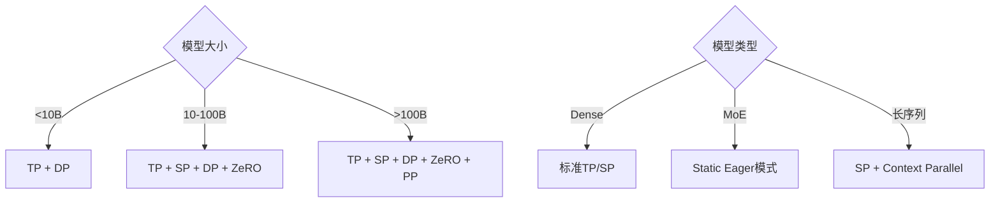

### 2. Plan API编写技巧

```python
# ✅ 推荐：使用正则表达式批量匹配
plan.shard("blk\d+.attn.qkv.weight", Shard(0), mesh="TP")

# ❌ 避免：逐个手动指定
# plan.shard("blk1.attn.qkv.weight", ...)
# plan.shard("blk2.attn.qkv.weight", ...)

# ✅ 推荐：复用Plan Zoo
from vescale.plan_zoo import llama3_4d_plan
plan = llama3_4d_plan(tp=4, sp=2, dp=8)
```

### 3. 调试策略

```python
# 1. 开启交互式断点
vescale.breakpoint()  # 类似pdb但支持分布式

# 2. 验证一致性
# - 先单设备训练，记录loss曲线
# - 再分布式训练，对比loss曲线
# - veScale保证完全一致（误差<6e-5）

# 3. 性能分析
# - 检查GPU利用率
# - 分析通信时间占比
# - 使用Static Eager降低CPU开销
```

---

## 📖 总结

### veScale核心价值

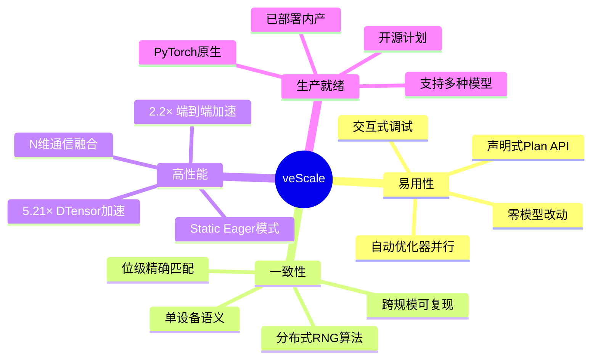

### 适用场景

| 场景 | 推荐理由 |
|------|---------|
| **LLM预训练** | 4D并行+ZeRO-3，高效且一致 |
| **LLM微调** | 零代码改动，快速迁移 |
| **MoE模型** | Static Eager解决轻量算子开销 |
| **研究实验** | 一致性保证可复现性 |
| **生产部署** | 久经考验的内部实战系统 |

### 与其他系统对比

|  | veScale | TorchTitan | Megatron-LM |
|--|---------|------------|-------------|
| **编程模式** | Eager SPMD | Eager SPMD | Eager 耦合 |
| **代码改动** | ✅ 0行模型 | ⚠️ 6行模型 | ❌ 126行模型 |
| **一致性** | ✅ 位级匹配 | ❌ 0.5+误差 | ❌ 0.5+误差 |
| **性能** | ✅ 2.2× | ⚪ 基线 | ⚠️ 缺ZeRO-3 |
| **易用性** | ✅ Plan API | ⚠️ 复杂Plan | ❌ 侵入式 |

---

## 🔗 资源链接

- **项目地址**: https://github.com/volcengine/veScale
- **论文**: arXiv:2509.07003v1
- **文档**: 即将发布
- **上游合作**: 与TorchTitan团队协作中

---

## 📝 引用

```bibtex
@article{li2025vescale,
  title={veScale: Consistent and Efficient Tensor Programming with Eager-Mode SPMD},
  author={Li, Youjie and Wan, Cheng and Lin, Zhiqi and others},
  journal={arXiv preprint arXiv:2509.07003},
  year={2025}
}
```

---

**更新日期**: 2026-03-06
**文档版本**: v1.0
