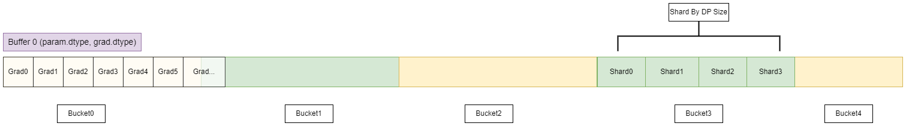
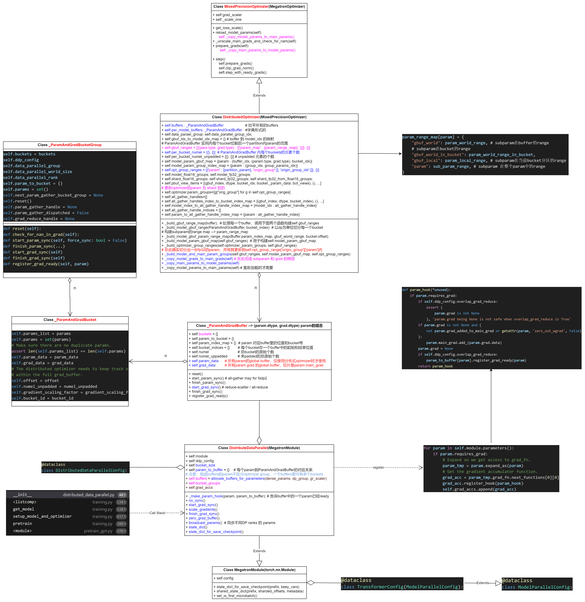

# 1 Megatron-LM ZeRO-1
目前Megatron-LM 里实现的是 ZeRO-1. 结合DistributedDataParallel 实现。

# 2 Megatron-lm 中的数据并行

## 2.1 数据并行调用栈 <br>

```python
__init__                      distributed_data_parallel.py:44
<listcomp>                    training.py:534
get_model                     training.py:534
setup_model_and_optimizer     training.py:617
pretrain                      training.py:289
<module>                      pretrain_gpt.py:278
```

## 2.2 Zero-1 数据组织




# 3 DistributedOptimizer

**一个buffer会却分成多个bucket, Zero 是在Bucket上进行切分的。`buffer里的每个bucket都要切成data_parallel_world_size份。`** <br>

几个关键函数：<br>

## 3.1 _build_gbuf_range_map

- 代码将遍历梯度缓冲区（grad buffer）的所有桶（buckets），以构建当前进程“拥有”的参数范围(注意是当前进程在buffer里的参数范围)。

- 这里的“拥有”是指每个进程负责梯度缓冲区中每个桶的特定分片（shard），其中每个分片的大小是桶大小的1/dp_world_size，dp_world_size是数据并行组中的进程数量。

## 3.2 __build_model_gbuf__param_range_map

- 由于梯度缓冲区的分区方式不考虑参数边界，因此每个数据并行进程实际上是在对梯度缓冲区的视图（views）进行操作，而不是直接对完整的参数进行操作。

- 这些操作包括梯度的规约（reduce）和参数的更新（gather）。

## 3.3 optimizer state

- 鉴于之前方法中创建的概念性梯度缓冲区划分并不遵循参数的边界，**优化器操作的是模型参数的分片**，而非完整参数。


# 4 代码结构



# 5 实现细节
## 5.1 区分dense_param 和 expert_parallel_params

- [distributed_data_parallel](https://github1s.com/NVIDIA/Megatron-LM/blob/main/megatron/core/distributed/distributed_data_parallel.py#L99-L102)
```python
    if getattr(param, 'allreduce', True):
        dense_params.append(param)
    else:
        expert_parallel_params.append(param)
```

## 5.2 按照param_dtype 和 grad_dtype 分组
- [distributed_data_parallel](https://github1s.com/NVIDIA/Megatron-LM/blob/main/megatron/core/distributed/distributed_data_parallel.py#L130-L144)

```python
    # Get the index of each param among the params with same dtype, if a param is fp8,
    # use its "fake" high precision dtype to find which params have same dtype with it.
    # For example:
    #     Case 1:
    #         params = [p1(bf16), p2(bf16), p3(bf16), p4(bf16)]
    #         param_and_grad_dtype_to_indices = {
    #             (torch.bfloat16, torch.float32): [0, 1, 2, 3],
    #         }
    #     Case 2:
    #         params = [p1(bf16), p2(fp8), p3(fp8), p4(bf16)]
    #         param_and_grad_dtype_to_indices = {
    #             (torch.bfloat16, torch.float32): [0, 3],
    #             (torch.uint8, torch.float32): [1, 2],
    #         }
    # We need these indices to load a non-native-fp8 checkpoint in native-fp8 mode.
```

## 5.3 将分组的Params用_ParamAndGradBuffer 封装

- [distributed_data_parallel](https://github1s.com/NVIDIA/Megatron-LM/blob/main/megatron/core/distributed/distributed_data_parallel.py#L178-L193)

```python
# Allocate the grad buffers and map the grads.
buffers = []
for (param_dtype, grad_dtype), params in param_and_grad_dtype_to_params.items():
    buffers.append(
        _ParamAndGradBuffer(
            self.ddp_config,
            param_dtype,
            grad_dtype,
            params,
            data_parallel_group,
            self.bucket_size,
            param_to_name,
            gradient_scaling_factor,
            param_and_grad_dtype_to_indices[(param_dtype, grad_dtype)],
        )
    )
```

## 5.4 遍历Parameters 得到每self.bucket_indices self.numel 等参数

- [distributed_data_parallel](https://github1s.com/NVIDIA/Megatron-LM/blob/main/megatron/core/distributed/param_and_grad_buffer.py#L541-L559)

- **根据设定的bucket_size 来获取分桶的大小**;

## 5.5 总buffer的初始化 : self.param_data and self.grad_data
- [distributed_data_parallel](https://github1s.com/NVIDIA/Megatron-LM/blob/main/megatron/core/distributed/param_and_grad_buffer.py#L620-L633)

- self.param_data : 原模型参数整合到 buffer中，并分桶进行allreduce;
- self.grad_data : 直接将grad 设置为一整块buffer.

```python
    # Only re-map param tensors if using distributed optimizer.
    if self.ddp_config.use_distributed_optimizer:
        self.param_data = torch.zeros(
            self.numel,
            dtype=self.param_dtype,
            device=torch.cuda.current_device(),
            requires_grad=False,
        )
    self.grad_data = torch.zeros(
        self.numel,
        dtype=self.grad_dtype,
        device=torch.cuda.current_device(),
        requires_grad=False,
    )
```

## 5.6 显存copy，并构造bucket

- [distributed_data_parallel](https://github1s.com/NVIDIA/Megatron-LM/blob/main/megatron/core/distributed/param_and_grad_buffer.py#L636-L676)

```python
    def _get(self, shape: torch.Size, start_index: int, buffer_type: BufferType) -> torch.Tensor:
        """
        Return a tensor with the input `shape` as a view into the 1-D data starting at
        `start_index`.
        """
        end_index = start_index + shape.numel()
        assert end_index <= self.numel, 'Requested tensor is out of buffer range'
        if buffer_type == BufferType.PARAM:
            assert self.param_data is not None
            buffer_tensor = self.param_data[start_index:end_index]
        elif buffer_type == BufferType.GRAD:
            buffer_tensor = self.grad_data[start_index:end_index]
        else:
            raise Exception("Illegal buffer type provided to GradBuffer._get() function")
        buffer_tensor = buffer_tensor.view(shape)
        return buffer_tensor

    for param in params[::-1]:
        param_start_index, param_end_index, bucket_id = self.param_index_map[param]

        # Assign param.data to appropriate segment of self.param_data.
        if self.param_data is not None:
            old_param_data = param.data
            new_param_data = self._get(
                param.data.shape, param_start_index, buffer_type=BufferType.PARAM
            )
            if is_float8tensor(param):
                param._data = new_param_data
            else:
                param.data = new_param_data
            assert old_param_data._base is None
            # Copy tensor values (from initialization or checkpoint).
            param.data.detach().copy_(old_param_data)
            del old_param_data # Free origin memory.

        param.main_grad = self._get( # Gradient buffer.
            param.data.shape, param_start_index, buffer_type=BufferType.GRAD
        )
```

## 5.6 每个param都事先准备一个main_grad

- [distributed_data_parallel](https://github1s.com/NVIDIA/Megatron-LM/blob/main/megatron/core/distributed/param_and_grad_buffer.py#L657-L659)

```
param.main_grad = self._get( # Gradient buffer.
    param.data.shape, param_start_index, buffer_type=BufferType.GRAD
)
```

## 5.7 param.grad copy 到 param.main_grad

- 通过钩子函数实现
- **param.grad 会被删除**
- 先类型转换后再进行通信操作;

```python
    def _make_backward_post_hook(self, param: torch.nn.Parameter):
        """
        Creates a backward post-hook to dispatch an all-reduce / reduce-scatter when
        ready (i.e., when all grads in a bucket have been computed in all microbatches
        in a batch).
        """

        def hook(*unused):
            if is_graph_capturing():
                return

            if param in self.param_to_bucket_group:
                assert param.requires_grad
                if self.ddp_config.overlap_grad_reduce:
                    assert (
                        param.grad is not None
                    ), 'param.grad being None is not safe when overlap_grad_reduce is True'
                if param.grad is not None and (
                    not param.grad_added_to_main_grad or getattr(param, 'zero_out_wgrad', False)
                ):
                    param.main_grad.add_(param.grad.data)
                param.grad = None

                if self.ddp_config.overlap_grad_reduce:
                    self.param_to_bucket_group[param].register_grad_ready(param)

        return hook
```

## 5.7 _ParamAndGradBucket 里初始化
- [distributed_data_parallel](https://github1s.com/NVIDIA/Megatron-LM/blob/main/megatron/core/distributed/param_and_grad_buffer.py#L749-L770)

- 零散的params
- 合并的param_data
- 合并的grad_data
- 通信是针对每个bucket进行通信


```python
    bucketed_param_data = None
    if self.param_data is not None:
        bucketed_param_data = self._get(
            torch.Size([end_index - start_index]), start_index, buffer_type=BufferType.PARAM
        )
    bucketed_grad_data = self._get(
        torch.Size([end_index - start_index]), start_index, buffer_type=BufferType.GRAD
    )
    bucket = _ParamAndGradBucket(
        params=bucket_params,
        param_data=bucketed_param_data,
        grad_data=bucketed_grad_data,
        offset=start_index,
        numel_unpadded=numel_unpadded,
        gradient_scaling_factor=self.gradient_scaling_factor,
        bucket_id=bucket_id,
    )
    for bucket_param in bucket_params:
        assert bucket_param not in self.param_to_bucket
        self.param_to_bucket[bucket_param] = bucket

    return bucket
```

## 5.8 注意：DP 组 和 Context 组 可能会耦合

```python
# Allocate the param+grad buffers for dense params' grads.
self.buffers, self.bucket_groups = _allocate_buffers_for_parameters(
    dense_params,
    parallel_state.get_data_parallel_group(with_context_parallel=True),
    gradient_scaling_factor=gradient_scaling_factor,
)

def get_data_parallel_group(with_context_parallel=False):
    """Get the data-parallel group the caller rank belongs to."""
    if with_context_parallel:
        assert (
            _DATA_PARALLEL_GROUP_WITH_CP is not None
        ), 'data parallel group with context parallel combined is not initialized'
        return _DATA_PARALLEL_GROUP_WITH_CP
    else:
        assert _DATA_PARALLEL_GROUP is not None, 'data parallel group is not initialized'
        return _DATA_PARALLEL_GROUP
```

# 5.8 partition_buckets 将 每个buffer里的bucket打包成总的bucket group

- [distributed_data_parallel](https://github1s.com/NVIDIA/Megatron-LM/blob/main/megatron/core/distributed/distributed_data_parallel.py#L204)

```pythn
bucket_groups = partition_buckets(buffers, force_single_bucket_group=disable_bucketing)

def partition_buckets(
    buffers: List[_ParamAndGradBuffer], force_single_bucket_group: bool = False
) -> List[_ParamAndGradBucketGroup]:
```

## 5.9 首尾连接 各bucket

- 因为分布式优化器逆向做all-gather in reverse order of bucket

- [distributed_data_parallel](https://github1s.com/NVIDIA/Megatron-LM/blob/main/megatron/core/distributed/distributed_data_parallel.py#L222-L227)

```python
    # Set `next_param_gather_bucket_group` for different bucket groups by iterating through
    # buckets in reverse order (since all-gathers happen in reverse order of buckets).
    if self.ddp_config.use_distributed_optimizer and self.ddp_config.overlap_param_gather:
        num_bucket_groups = len(bucket_groups)
        for i in range(1, num_bucket_groups):
            bucket_groups[num_bucket_groups - i].next_param_gather_bucket_group = (
                bucket_groups[num_bucket_groups - i - 1]
            )
```

## 5.10 建立param 到 每个bucket的映射关系
- [distributed_data_parallel](https://github1s.com/NVIDIA/Megatron-LM/blob/main/megatron/core/distributed/distributed_data_parallel.py#L229-L233)

```python
    # Create map from param to bucket group, used in pre_hook.
    for bucket_group in bucket_groups:
        for bucket in bucket_group.buckets:
            for param in bucket.params_list:
                self.param_to_bucket_group[param] = bucket_group

```

## 5.11 上述流程最终返回 self.buffers, self.bucket_groups

```python
    # Allocate the param+grad buffers for dense params' grads.
    self.buffers, self.bucket_groups = _allocate_buffers_for_parameters(
        dense_params,
        parallel_state.get_data_parallel_group(with_context_parallel=True),
        gradient_scaling_factor=gradient_scaling_factor,
    )
```

## 5.12 单独创建专家的 buffer 和 bucket_groups

- [distributed_data_parallel](https://github1s.com/NVIDIA/Megatron-LM/blob/main/megatron/core/distributed/distributed_data_parallel.py#L284-L291)

```python
    # Allocate separate param+grad buffers for expert parallel params' grads.
    self.expert_parallel_buffers, self.expert_parallel_bucket_groups = (
        _allocate_buffers_for_parameters(
            expert_parallel_params,
            parallel_state.get_data_modulo_expert_parallel_group(with_context_parallel=True),
            gradient_scaling_factor=expert_gradient_scaling_factor,
        )
    )
```

## 5.13 为每个参数注册反向钩子函数

- [distributed_data_parallel](https://github1s.com/NVIDIA/Megatron-LM/blob/main/megatron/core/distributed/distributed_data_parallel.py#L309-L317)

```python
    # Register backward hook.
    # Accumulation function for the gradients need to be stored so they
    # don't go out of scope.
    self.grad_accs = []
    for param in self.module.parameters():
        if param.requires_grad:
            # Expand so we get access to grad_fn.
            param_tmp = param.expand_as(param)
            # Get the gradient accumulator function.
            grad_acc = param_tmp.grad_fn.next_functions[0][0]
            grad_acc.register_hook(self._make_backward_post_hook(param))
            self.grad_accs.append(grad_acc)
```

## 5.14 具体的反向钩子函数

- [distributed_data_parallel](https://github1s.com/NVIDIA/Megatron-LM/blob/main/megatron/core/distributed/distributed_data_parallel.py##L392-L418)

- **param的梯度copy到 main_grad, 同时将param里的自带grad 清空 : param.grad = None**
- **该bucket里param均计算完事后，register_grad_ready, 并开始ReduceScatter**

```python
    def _make_backward_post_hook(self, param: torch.nn.Parameter):
        """
        Creates a backward post-hook to dispatch an all-reduce / reduce-scatter when
        ready (i.e., when all grads in a bucket have been computed in all microbatches
        in a batch).
        """

        def hook(*unused):
            if param in self.param_to_bucket_group:
                assert param.requires_grad
                if self.ddp_config.overlap_grad_reduce:
                    assert (
                        param.grad is not None
                    ), 'param.grad being None is not safe when overlap_grad_reduce is True'
                if param.grad is not None and (
                    not param.grad_added_to_main_grad or getattr(param, 'zero_out_wgrad', False)
                ):
                    param.main_grad.add_(param.grad.data)
                param.grad = None

                if self.ddp_config.overlap_grad_reduce:
                    self.param_to_bucket_group[param].register_grad_ready(param)

        return hook
```

> 只有在overlap_grad_reduce 时. register_grad_ready 里会调用 start_grad_sync 进行梯度同步.

```python
class ParamAndGradBucketGroup:
    ...

    def register_grad_ready(self, param: torch.nn.Parameter):
        """
        Registers grads for the passed-in param to be "ready" for grad sync.

        When the number of microbatches is greater than 1, we only want to register
        grads as ready when processing the last microbatch and ddp_config.overlap_grad_reduce
        is True.
        """
        assert (
            self.ddp_config.overlap_grad_reduce
        ), 'register_grad_ready() should only be called when overlap_grad_reduce is True'
        if self.is_last_microbatch:
            assert param in self.param_to_bucket, 'Param is not in the bucket group'
            assert param not in self.params_with_grad, 'Cannot set grad twice'
            self.params_with_grad.add(param)
            # If all params in bucket group have grads available, issue communication call.
            if len(self.params_with_grad) == len(self.params):
                self.start_grad_sync()
```

## 5.15 在 register_grad_ready 里进行 start_grad_sync

- **注意: DistributedOptimizer 对应这里的 reduce_scatter, 其实是`Zero1`, 只是更新了一个bucket里自己对应的那部分的grad, 但总的 grad 还是那么大。** <br>

- [distributed_data_parallel](https://github1s.com/NVIDIA/Megatron-LM/blob/main/megatron/core/distributed/param_and_grad_buffer.py#L342-L358)

```python
    # Coalesce communication kernels across buckets in the bucket group.
    with stream_context, _coalescing_manager(communication_group, async_ops=async_op) as cm:
        for bucket in self.buckets:
            if self.ddp_config.use_distributed_optimizer:
                local_data_view = shard_buffer(
                    bucket.grad_data, self.intra_distributed_optimizer_instance_size
                )[self.intra_distributed_optimizer_instance_rank]
                dist_reduce_scatter_func(
                    local_data_view,
                    bucket.grad_data,
                    op=reduce_op,
                    group=communication_group,
                    async_op=async_op,
                )
            else:
                torch.distributed.all_reduce(
                    bucket.grad_data, op=reduce_op, group=communication_group, async_op=async_op
                )
```

## 5.16 forward 时必须等待 weight的all_gather 结束

```python
    def _make_forward_pre_hook(self):
        """
        Create a forward pre-hook to wait on all-gather handles when necessary (i.e.,
        when a module uses a parameter in a bucket with a still incomplete all-gather).
        """

        def hook(module, *unused):
            assert (
                self.use_forward_hook
            ), "Should use pre-hook only when overlap_param_gather is True"

            # Make sure all parameters in this module have been all-gathered as necessary.
            for param in module.parameters(recurse=False):
                # Skip parameters without an associated buffer (such parameters have a
                # .requires_grad field equal to False).
                if param not in self.param_to_bucket_group:
                    continue
                assert param.requires_grad

                # If aligning param all-gather across pipeline stages, all-gather is dispatched
                # by start_param_sync calls in core/pipeline_parallelism/schedules.py.
                # If overlapping param all-gather with optimizer step, then all-gather has
                # already been dispatched in optimizer step.
                skip_next_bucket_dispatch = (
                    self.ddp_config.align_param_gather
                    or self.overlap_param_gather_with_optimizer_step
                )
                self.param_to_bucket_group[param].finish_param_sync(
                    skip_next_bucket_dispatch=skip_next_bucket_dispatch
                )

        return hook
```

## 5.17 具体进行 all_gather 之处

- 通过DDP的前向钩子进行的，确定的，不是在DistributedOptimzier 里进行的。


- [distributed_data_parallel](https://github1s.com/NVIDIA/Megatron-LM/blob/main/megatron/core/distributed/param_and_grad_buffer.py#L193-L239)

```python
def start_param_sync(self, force_sync: bool = False):
        """
        Initiates all necessary param all-gathers for this bucket.

        When ddp_config.overlap_param_gather is set to True, dispatches an asynchronous
        communication call (unless force_sync is True). When ddp_config.overlap_param_gather
        is set to False, makes synchronous call.

        Args:
            force_sync (bool, optional): force synchronous collective regardless of
                other settings if true.
        """
        assert self.ddp_config.use_distributed_optimizer

        if force_sync:
            if self.param_gather_handle is not None:
                self.param_gather_handle.wait()
                self.param_gather_handle = None
                return
        else:
            assert self.param_gather_handle is None

        async_op = self.ddp_config.overlap_param_gather and not force_sync
        # Coalesce communication kernels across buckets in the bucket group.
        with _coalescing_manager(
            self.intra_distributed_optimizer_instance_group, async_ops=async_op
        ) as cm:
            for bucket in self.buckets:
                local_data_view = shard_buffer(
                    bucket.param_data, self.intra_distributed_optimizer_instance_size
                )[self.intra_distributed_optimizer_instance_rank]
                dist_all_gather_func(
                    bucket.param_data,
                    local_data_view,
                    group=self.intra_distributed_optimizer_instance_group,
                    async_op=async_op,
                )
        if async_op:
            self.param_gather_handle = cm
        else:
            # When using `_coalescing_manager`, even if a synchronous op (async_op=False) is used,
            # `cm` is not None, which is different from when `_coalescing_manager` is not used in
            # which case the torch.distributed._all_gather_base() will return None. In order to
            # maintain consistency with prior code, we need to manually set communication handle to
            # None.
            self.param_gather_handle = None
        self.param_gather_dispatched = True
```


# 6 DistributedOptimizer

## 6.1 DistributedOptimizer 的初始化
- 用每个model的buffers来初始化DistributedOptimizer;

```python
    optimizer = DistributedOptimizer(
        *optimizer_args,
        model_chunks=model_chunks,
        per_model_buffers=per_model_buffers,
        data_parallel_group=data_parallel_group,
        data_parallel_group_gloo=data_parallel_group_gloo,
        data_parallel_group_idx=data_parallel_group_idx,
)
```

## 6.2 DistributedOptimzier 中额外clone 出 fp32 的 param

- [shard_main_param](https://github1s.com/NVIDIA/Megatron-LM/blob/main/megatron/core/optimizer/distrib_optimizer.py#L379-L380)

- 得到shard 的 main_param 副本
```python
  shard_main_param = shard_model_param.clone().float() # fp32的副本
```

- bind 到 model_param 的 **main_param** 属性中

```python
    # Store handle to main_param.
    model_param.main_param = shard_main_param
    model_param.main_param_sharded = True
```

## 6.3 得到几个重要group
> **Parameter groups:**
>   model_float16_groups: original float16 parameters
>   model_fp32_groups: original fp32 parameters
>   shard_float16_groups: shards of original float16 parameters
>   shard_fp32_groups: shards of original fp32 parameters
>   shard_fp32_from_float16_groups: fp32 copy of float16 parameters


## 6.4 DistributedOptimzier 中 params 的更新

- [_build_model_and_main_param_groups](https://github1s.com/NVIDIA/Megatron-LM/blob/main/megatron/core/optimizer/distrib_optimizer.py#L419-L430)

```python
    # Update optimizer's params.
    if not config.use_precision_aware_optimizer:
        group_range["orig_group"]["params"] = [
            *shard_fp32_params_this_group,
            *shard_fp32_from_float16_params_this_group,
        ]
    else:
        group_range["orig_group"]["params"] = [
            *shard_fp32_params_this_group,
            *shard_float16_params_this_group,
        ]
```

## 6.5 MixedPrecisionOptimizer step 中完成参数转化和更新

- [DistributedOptimizer](https://github1s.com/NVIDIA/Megatron-LM/blob/main/megatron/core/optimizer/optimizer.py#L469-L500)

1. step1: self.prepare_grads() : 将 param.main_grad 切片到 shard_main_param.grad
2. step2: 完成参数更新
3. step3: 将shard_main_param 再copy 回 shard_model_param

```python
@torch.no_grad()
    def step(self):
        timers = self.config.timers

        found_inf_flag = self.prepare_grads()
        if found_inf_flag:
            return False, None, None

        # Clip the main gradients.
        if timers is not None:
            timers('optimizer-clip-main-grad', log_level=1).start(
                barrier=self.config.barrier_with_L1_time
            )
        grad_norm = 0.0
        if self.config.clip_grad > 0.0:
            grad_norm = self.clip_grad_norm(self.config.clip_grad)
        if timers is not None:
            timers('optimizer-clip-main-grad').stop()

        # Count the zeros in the grads.
        if timers is not None:
            timers('optimizer-count-zeros', log_level=1).start(
                barrier=self.config.barrier_with_L1_time
            )
        num_zeros_in_grad = self.count_zeros() if self.config.log_num_zeros_in_grad else 0
        if timers is not None:
            timers('optimizer-count-zeros').stop()

        success = self.step_with_ready_grads()

        # Successful update.
        return success, grad_norm, num_zeros_in_grad
```

# 6.6 梯度抽取到切片:

- [copy_group_grads](https://github1s.com/NVIDIA/Megatron-LM/blob/main/megatron/core/optimizer/distrib_optimizer.py#L1931-L1950)

- 对model的属于当前进程的param的grad : model_param.main_grad 进行切片;
- 将切片后的grad进行copy到shard_main_groups中;
- copy_group_grads 函数定义在_copy_model_grads_to_main_grads 函数内;

```python
    # Utility method for copying group grads.
    def copy_group_grads(model_groups, shard_main_groups):
        for model_group, shard_main_group in zip(model_groups, shard_main_groups):
            for model_param, shard_main_param in zip(model_group, shard_main_group):

                param_range_map = self._get_model_param_range_map(model_param)
                param_range = param_range_map["param"]
                assert param_range.size == shard_main_param.nelement()

                model_grad = model_param.main_grad
                shard_model_grad = model_grad.view(-1)[param_range.start : param_range.end]
                if self.config.use_precision_aware_optimizer:
                    # Pytorch requires a param and its' grad to be the same dtype, but we want
                    # their types to be different in precision-aware optimizer. So we use
                    # ".decoupled_grad" to replace ".grad".
                    # Note that this requires corresponding modifications in the optimizer (Let
                    # the optimizer read gradients from ".decoupled_grad" instead of ".grad").
                    shard_main_param.decoupled_grad = shard_model_grad
                else:
                    shard_main_param.grad = shard_model_grad.float()
```

## 6.7 更新后的 param 再 copy 到 weight

- [DistributedOptimizer](https://github1s.com/NVIDIA/Megatron-LM/blob/main/megatron/core/optimizer/optimizer.py#L443-L467)

```python
    @torch.no_grad()
    def step_with_ready_grads(self) -> bool:
        """Step the optimizer with ready gradients, return successful."""
        timers = self.config.timers
        # Step the optimizer.
        if timers is not None:
            timers('optimizer-inner-step', log_level=1).start(
                barrier=self.config.barrier_with_L1_time
            )
        if not self.is_stub_optimizer:
            self.optimizer.step()
        if timers is not None:
            timers('optimizer-inner-step').stop()

        # Update params from main params.
        if timers is not None:
            timers('optimizer-copy-main-to-model-params', log_level=1).start(
                barrier=self.config.barrier_with_L1_time
            )
        if not self.is_stub_optimizer:
            self._copy_main_params_to_model_params()
        if timers is not None:
            timers('optimizer-copy-main-to-model-params').stop()

        return True
```

- [_copy_main_params_to_model_params](https://github1s.com/NVIDIA/Megatron-LM/blob/main/megatron/core/optimizer/distrib_optimizer.py#L1976-L2013)

```python
# Utility method for copying group params.
    def copy_group_params(shard_main_groups, model_groups):
        for shard_main_group, model_group in zip(shard_main_groups, model_groups):
            for shard_main_param, model_param in zip(shard_main_group, model_group):

                param_range_map = self._get_model_param_range_map(model_param)
                world_range = param_range_map["gbuf_world_in_bucket"]

                assert world_range.size == shard_main_param.nelement()

                gbuf_index, _, bucket_id = self.model_param_gbuf_map[model_param]
                model_param_buffer = self.buffers[gbuf_index].buckets[bucket_id].param_data

                shard_model_param = model_param_buffer.view(-1)[
                    world_range.start : world_range.end
                ]

                if is_float8tensor(model_param):
                    # 1. When "--fp8-param-gather" is disabled, the main param is first cast to
                    #    BF16/FP16, and then cast to FP8, so the amax_history is calculated
                    #    using BF16/FP16 param.
                    # 2. When "--fp8-param-gather" is enabled, we can cast the FP32 main param
                    #    to FP8 directly, which results in slightly different results with
                    #    higher speed. In theory, this does not affect convergence.
                    # TODO: The following code maintains the logic of the point-1 above. It can
                    # be deleted if it is not necessary.
                    shard_main_param = shard_main_param.to(model_param.dtype)

                    quantize_param_fragment(
                        shard_main_param, out=shard_model_param, param=model_param
                    )
                else:
                    shard_model_param.data.copy_(shard_main_param)

    # When using precision-aware optimizer, main params are held by self.optimizer. It will also
    # do the work of copying data from main params to model params.
    if self.config.use_precision_aware_optimizer:
        return
```


