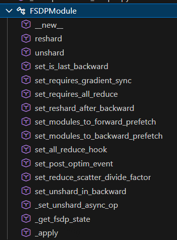
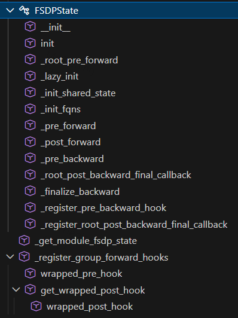

# 0 pytorch fsdp2 新特性
| 名称                              | 描述                                                                                                                                                                                                 |
|-----------------------------------|-----------------------------------------------------------------------------------------------------------------------------------------------------------------------------------------------------|
| Shard Per-Param                   | 对维度0上的每个参数进行分片，来解决`FlatParameter`的局限性。                                                                                                                                         |
| Flexible FP8-Gather               | FP8权重和其他非FP8参数可以在同一个全收集操作中灵活混合。                                                                                                                                             |
| Flexible Frozen Parameters        | 冻结和非冻结参数可以在同一个通信组中灵活混合，而无需使用额外内存。                                                                                                                                   |
| Communication-Free Sharded State Dicts | 使训练和状态字典表示相匹配，从而简化和加速检查点保存。                                                                                                                                               |
| Communication Optimization in the Compiler | 像`torch.compile`这样的partial-graph编译器可以改变`all-gather`/`reduce-scatter`的通信组。                                                                                                           |
| Avoiding RecordStream             | 通过避免使用`recordStream`使得内存释放更加确定，相比于FSDP1，FSDP2的GPU内存平均降低7%。                                                                                                             |
| Efficient Collective Kernels      | 编写了高效的kernels来实现multi-tensor的`allgather`和`reduce scatter`操作，使得通信效率相对于FSDP1没有下降。                                                                                          |

**FSDP2 相关源代码**


# 1 FSDPModule data structure

- **FSDPState + FSDPParamGroup + FSDPParam**
- **FSDPParamGroup 处理一个module 里的参数;**
- **FSDPParam 对每个Param参数进行wrap，并提供访问DTensor 和 Tensor 相互转化的API;**
- **FSDPState 和 module 一一对应的绑定起来，提供多个钩子函数的注册**
- **绑定了FSDPState的module 重新后继承FSDPModule, 得到最终的FSDP???Wrapper的module类;**
- `_pre_forward, _post_forward,`
- `_pre_backward 在FSDPState 的 _post_forward 里完成注册；`
- `post_backward 在 FSDPParamGroup 的pre_forward 里完成注册；`
- `FSDPParam 的 _setattr_on_modules 里更新module 的param;`
- `初始化过程Param 都是meta type 的，真正允许时会 _lazy_init;`


# 2 FSDPModule + nn.Module 多继承得到最终class


# 3 FSDP2 的通信

- _fsdp_distributed.py 里对comm 进行了wraper
- 有时直接对FSDPParamGroup 里tensor 直接进行通信；
- 有时需要对FSDPParam 细粒度进行通信；

> unshard : all_gather 一般对FSDPParamGroup 里统一进行；
> shard:  一般对FSDPParam 细粒度进行(自动触发)；


# FSDP2 几个点
- **module param 的替换发生在 FSDPParam init 里**

```python
class FSDPParam:
    def _setattr_on_modules(self, param: nn.Parameter) -> None:
        unsafe_setattr_param(
            self._module_info.module, self._module_info.param_name, param
        )
        for shared_module, shared_param_name in zip(
            self._module_info.shared_modules, self._module_info.shared_param_names
        ):
            unsafe_setattr_param(shared_module, shared_param_name, param)

def unsafe_setattr_param(
    module: nn.Module, param_name: str, param: nn.Parameter
) -> None:
    if getattr(module.__setattr__, "__func__", None) is nn.Module.__setattr__:
        module._parameters[param_name] = param
    else:  # slow path
        setattr(module, param_name, param)
```

- **哪里进行初始化呢???**

&nbsp;&nbsp;&nbsp;&nbsp;&nbsp;&nbsp;&nbsp;&nbsp; 用户显示调用FSDPTransformer 模型的init_weights 方法进行初始化.

```python
with torch.no_grad():
    model.init_weights(buffer_device=buffer_device)
```

FSDPState _lazy_init 完成哪些初始化呢?


|初始化内容|作用|
|:----|:----|
|根状态确定|协调分布式训练的核心角色|
|设备与通信组初始化|支持跨设备通信|
|参数分片|实现内存优化|
|优化器状态分片|降低每个设备的内存压力|
|梯度归约策略|控制通信行为|
|元数据与上下文管理|支持模块状态跟踪与恢复|

- **unshard 原理**


# 4 模型 fully_shard 过程分析

## 4.1 多层：apply_fsdp
这段代码遵循了 FSDP2 fully_shard **「自底向上（bottom-up）」** 的调用规范（`先子模块、后父模块`），对最外层model调用fully_shard并非多余，而是有明确的核心价值，主要包含以下 4 点：<br>

1. 处理未被子模块覆盖的顶层参数 / 缓冲区，实现全模型无遗漏分片;
2. 统一管理全模型的分布式状态与 FSDP 配置，保证逻辑一致性;
3. 针对性优化顶层组件的显存与通信开销（贴合代码配置）;
4. 协调全模型的通信分组，提升整体通信效率.


```python
def apply_fsdp(
    model: nn.Module,
    dp_mesh: DeviceMesh,
    param_dtype: torch.dtype,
    reduce_dtype: torch.dtype,
    pp_enabled: bool,
    cpu_offload: bool = False,
    reshard_after_forward_policy: str = "default",
):
    """
    Apply data parallelism (via FSDP2) to the model.

    Args:
        model (nn.Module): The model to apply data parallelism to.
        dp_mesh (DeviceMesh): The device mesh to use for data parallelism.
        param_dtype (torch.dtype): The data type to use for model parameters.
        reduce_dtype (torch.dtype): The data type to use for reduction operations.
        pp_enabled (bool): Whether pipeline parallelism is enabled.
        cpu_offload (bool, optional): Whether to offload model parameters to CPU. Defaults to False.
        reshard_after_forward_policy (str, optional): The policy to use for resharding after forward pass. Defaults to "default".
            Other options: "never", "always".
            - "default" applies default resharding behavior, implementing "smart defaults" for known optimal scenarios.
            - "always" will enable `reshard_after_forward` for all forward passes.
            - "never" will disable `reshard_after_forward` for all forward passes.

    """
    mp_policy = MixedPrecisionPolicy(param_dtype=param_dtype, reduce_dtype=reduce_dtype)
    fsdp_config = {"mesh": dp_mesh, "mp_policy": mp_policy}
    if cpu_offload:
        fsdp_config["offload_policy"] = CPUOffloadPolicy()

    for layer_id, transformer_block in model.layers.items():
        if reshard_after_forward_policy == "always":
            reshard_after_forward = True
        elif reshard_after_forward_policy == "never":
            reshard_after_forward = False
        elif reshard_after_forward_policy == "default":
            if pp_enabled:
                # For PP, do not reshard after forward to avoid per-microbatch
                # all-gathers, which can be expensive and non-overlapped
                reshard_after_forward = False
            else:
                # As an optimization, do not reshard after forward for the last
                # transformer block since FSDP would prefetch it immediately
                reshard_after_forward = int(layer_id) < len(model.layers) - 1
        else:
            raise ValueError(
                f"Invalid reshard_after_forward_policy: {reshard_after_forward_policy}."
            )
        fully_shard(
            transformer_block,
            **fsdp_config,
            reshard_after_forward=reshard_after_forward,
        )
    fully_shard(model, **fsdp_config, reshard_after_forward=not pp_enabled)
```

## 4.2 fully_shard 函数

1. **contract装饰器**会向module添加一个状态对象(state object)，可通过fully_shard.state(module)访问。状态对象与模块呈一一对应关系。
2. label: [1] 标志处表示 Python 运行时装饰器与静态类型检查兼容性不佳，因此需抑制部分类型检查以支持类型重载，确保调用者仍能根据输入类型获得正确的返回类型；
3. 核心目标
- 通过在数据并行 worker 间分片模块的参数、梯度和优化器状态，以增加通信开销为代价，实现内存节省（解决大规模模型训练的内存瓶颈）。
4. 关键工作流程
- 初始化阶段：根据指定的 mesh（分布式拓扑），在数据并行 worker 间对模块参数进行分片。
- 前向传播前：通过 all-gather 操作聚合所有 worker 的分片参数，得到完整参数以支持前向计算。
- 前向传播后：若 reshard_after_forward=True，释放完整参数；反向传播前需重新 all-gather 参数。
- 反向传播后：释放完整参数，并通过 reduce-scatter 操作将完整梯度分片回各 worker。
5. 数据结构与钩子机制
- 分片参数：以 DTensor 类型存储，分片维度为 dim-0；完整参数保持模块原始张量类型（如 torch.Tensor）。
- 钩子依赖：通过模块的「前向预钩子（forward pre-hook）」实现参数聚合，「前向钩子（forward hook）」实现参数释放；反向传播阶段通过类似钩子完成参数重新聚合、释放及梯度分片。
6. 分组策略与性能优化
- 分组核心目的：将多个张量归为一组进行集合通信（all-gather/reduce-scatter），是提升通信效率的关键。<br>
- 分组规则：调用 fully_shard 时，会为当前模块未被子模块分组的参数创建一个新组（需自底向上调用，先对子模块执行，再对父模块执行）。<br>
- 优化效果：按层分组（多组划分模型）可最大化峰值内存节省，并支持通信与计算重叠。<br>
- 最佳实践：不建议仅对最顶层根模块调用 fully_shard（会导致单组通信效率低下，无法充分利用分组优化）。<br>

```python
# The decorator adds a state object to `module` that can be accessed via
# `fully_shard.state(module)`. The state object and module are 1:1.
# [1] Python runtime decorator does not play well with static type checking
# so suppressing some type checks to support type overloads
# such that caller can still get correct return types based on input type
@contract(state_cls=FSDPState)  # type: ignore[misc] # see [1]
def fully_shard(
    module,
    *,
    mesh: Optional[DeviceMesh] = None,
    reshard_after_forward: Union[bool, int] = True,
    shard_placement_fn: Optional[Callable[[nn.Parameter], Optional[Shard]]] = None,
    mp_policy: MixedPrecisionPolicy = MixedPrecisionPolicy(),
    offload_policy: OffloadPolicy = OffloadPolicy(),
    ignored_params: Optional[set[nn.Parameter]] = None,
):
    """
    Args:
        module (Union[nn.Module, List[nn.Module]): The module or modules to
            shard with FSDP and group together for communication.
        mesh (Optional[DeviceMesh]): This data parallel mesh defines the
            sharding and device. If 1D, then parameters are fully sharded
            across the 1D mesh (FSDP) with ``(Shard(0),)`` placement. If 2D,
            then parameters are sharded across the 1st dim and replicated
            across the 0th dim (HSDP) with ``(Replicate(), Shard(0))``
            placement. The mesh's device type gives the device type used for
            communication; if a CUDA or CUDA-like device type, then we use the
            current device.
        reshard_after_forward (Union[bool, int]): This controls the parameter
            behavior after forward and can trade off memory and communication:

            - If ``True``, then this reshards parameters after forward and
              re-all-gathers in backward.
            - If ``False``, then this keeps the unsharded parameters in memory
              after forward and avoids the all-gather in backward.
            - If an ``int``, then this represents the world size to reshard to
              after forward. It should be a non-trivial divisor of the ``mesh``
              shard dim size (i.e. excluding 1 and the dim size itself). A
              choice may be the intra-node size (e.g. ``torch.cuda.device_count()``).
              This allows the all-gather in backward to be over a smaller world
              size at the cost of higher memory usage than setting to ``True``.
            - The root FSDP state has its value specially set to ``False`` as a
              heuristic since its parameters would typically be immediately
              all-gathered for backward.
            - After forward, the parameters registered to the module depend on
              to this: The registered parameters are the sharded parameters if
              ``True``; unsharded parameters if ``False``; and the paramters
              resharded to the smaller mesh otherwise. To modify the parameters
              between forward and backward, the registered parameters must be
              the sharded parameters. For ``False`` or an ``int``, this can be
              done by manually resharding via :meth:`reshard`.
        shard_placement_fn (Optional[Callable[[nn.Parameter], Optional[Shard]]]):
            This callable can be used to override the sharding placement for a
            parameter to shard a parameter on a dimension other than dim-0. If
            this callable returns a :class:`Shard` placement (not ``None``),
            then FSDP will shard according to that placement (e.g. ``Shard(1)``).
            If sharding on a nonzero dim, we currently require even sharding,
            i.e. the tensor dim size on that dim must be divisible by the FSDP
            shard mesh size.
        mp_policy (MixedPrecisionPolicy): This controls the mixed precision
            policy, which offers parameter/reduction mixed precision for this
            module. See :class:`MixedPrecisionPolicy` for details.
        offload_policy (OffloadPolicy): This controls the offloading policy,
            which offers parameter/gradient/optimizer state offloading. See
            :class:`OffloadPolicy` and its subclasses for details.
        ignored_params: Optional(Set[nn.Parameter]): The set of parameters that we
            don't want to shard with FSDP.

    Returns:
        FSDPModule: The module with FSDP applied (in-place).
    """
    if isinstance(module, (nn.ModuleList, nn.ModuleDict)):
        raise ValueError(
            f"fully_shard does not support containers that do not implement forward: {module}"
        )
    mesh = mesh or _init_default_fully_shard_mesh()
    if mesh.ndim not in (1, 2):
        raise ValueError(f"fully_shard expects a 1D or 2D DeviceMesh but got {mesh}")
    elif mesh.ndim == 1:
        mesh_info = FSDPMeshInfo(mesh, shard_mesh_dim=0)
    else:
        if mesh.mesh_dim_names is None:
            raise AssertionError(
                "Please init the 2D mesh for HSDP with mesh_dim_names specified"
            )
        mesh_info = HSDPMeshInfo(mesh, shard_mesh_dim=1, replicate_mesh_dim=0)
    device = _get_device_from_mesh(mesh)
    post_forward_mesh_info = _get_post_forward_mesh_info(
        reshard_after_forward, mesh_info
    )

    arg_module = module
    modules = (
        (module,) if isinstance(module, nn.Module) else tuple(_get_root_modules(module)) # 排除那些 “既是列表成员、又是列表内其他模块子模块”
    )
    state = fully_shard.state(modules[0])  # type: ignore[attr-defined] # see [1]
    state.init(modules, device, mp_policy)

    managed_modules = _get_managed_modules(modules, ignored_params)
    params, buffers = _get_managed_states(managed_modules, ignored_params)

    _move_states_to_device(params, buffers, device)
    if params:
        # 显式配置 FSDPParamGroup
        state._fsdp_param_group = FSDPParamGroup(
            params,
            modules,
            mesh_info,
            post_forward_mesh_info,
            device,
            shard_placement_fn,
            mp_policy,
            offload_policy,
        )

    # For Dynamo
    for managed_module in managed_modules:
        managed_module._is_fsdp_managed_module = True  # type: ignore[assignment]
        managed_module._fsdp_use_orig_params = True  # type: ignore[assignment]

    # Place FSDP leftmost for highest priority in the method resolution order
    for module in modules:
        cls = module.__class__
        new_cls = cls_to_fsdp_cls.get(cls, None)
        if not new_cls:
            dct = {"__deepcopy__": _unimplemented_deepcopy}
            new_cls = type(f"FSDP{cls.__name__}", (FSDPModule, cls), dct)
            cls_to_fsdp_cls[cls] = new_cls
        module.__class__ = new_cls
    return arg_module
```

## 4.3 contract 装饰器

- 函数定位：contract 是一个装饰器工厂函数，核心价值是为分布式 API（如fully_shard）提供「状态管理」和「结构约束」的基础能力，无需 API 自身实现这些通用逻辑。
- 核心流程：输入预处理→状态注入→执行原函数→输出校验→返回结果，其中「状态注入」和「FQN 不变性校验」是核心亮点。
- 关键约束：同一 API 仅可应用于模块一次、FQN 不可增删 / 重排，这些约束是为了保证分布式训练中模块结构的稳定性，避免通信逻辑（如 all-gather）出错。
- 对外能力：通过为包装函数附加 .state() 方法，实现了模块状态的外部可访问性，满足分布式场景下状态查询与修改的需求。

```python
class RegistryItem:
    """分布式可组合API的注册项，用于记录API应用信息"""
    pass

def _get_root_modules(modules: list[nn.Module]) -> list[nn.Module]:
    """提取列表中无父模块的根模块（简化实现，贴合原代码逻辑）"""
    root_modules = []
    for mod in modules:
        has_parent = False
        for other_mod in modules:
            if mod in other_mod.children():
                has_parent = True
                break
        if not has_parent:
            root_modules.append(mod)
    return root_modules

def contract(
    state_cls: type[_TState] = _State,  # type: ignore[assignment] # FSDPState
) -> Callable[
    [Callable[Concatenate[_M, _P], _M]],
    _ContractFn[Concatenate[_M, _P], _M, _TState],
]:
    r"""
    装饰器工厂函数：将普通函数包装为「可组合分布式API」，为其注入模块状态管理和结构校验能力。
    被装饰函数的第一个参数必须是 `nn.Module` 实例或 `nn.Module` 实例序列。

    参数:
        state_cls: 状态类，默认值为 `_State`（实际对应FSDPState），用于创建存储模块分布式状态的实例，
                  所有被当前装饰器处理的模块共享同一个该类的实例。

    返回值:
        嵌套的可调用对象，最终返回包装后的函数（附加了 `.state()` 方法），该函数保留原被装饰函数的功能，
        同时增加了状态注入、重复应用校验、FQN不变性校验等能力。

    核心特性:
        1.  为被装饰函数附加 `.state(module)` 方法，用于获取/修改模块的分布式状态；
        2.  强制执行FQN（完全限定名）不变性，不允许修改模块的参数、缓冲区、子模块的FQN集合和顺序；
        3.  限制同一分布式API对单个模块仅能应用一次，避免状态冲突；
        4.  支持处理单个模块或模块序列，对序列仅处理根模块（无父模块的模块）。
    """
    # wraps装饰器：保留被包装对象的元信息（如__name__、__doc__），使装饰后的函数可被pickle序列化，
    # 满足与torch.package的集成要求
    @wraps(state_cls)  # type: ignore[arg-type]
    def inner(
        func: Callable[Concatenate[_M, _P], _M],
    ) -> _ContractFn[Concatenate[_M, _P], _M, _TState]:
        """
        内层包装函数：接收被装饰的目标函数（如fully_shard），返回最终的功能包装函数wrapper。
        """
        @wraps(func)
        def wrapper(
            module: _M,
            *args: _P.args,
            **kwargs: _P.kwargs,
        ) -> _M:
            """
            核心包装函数：实现状态注入、参数校验、FQN校验等核心逻辑，最终调用原目标函数。
            """
            # 1. 输入模块预处理：区分单个模块/模块序列，提取根模块（仅根模块需要注入状态）
            inp_module = module  # 保存原始输入模块，用于后续复用（若被装饰函数返回None）
            modules: list[nn.Module]
            if isinstance(module, nn.Module):
                # 输入为单个nn.Module，直接封装为列表
                modules = [module]
            else:
                # 输入为模块序列，提取其中的根模块（无父模块的模块），仅对根模块进行状态注入
                modules = _get_root_modules(list(module))

            # 2. 创建共享实例：所有被处理的模块共享同一个state和registry_item，保证状态统一
            state = state_cls()  # 分布式状态实例，存储模块的分布式相关信息（如FSDP分片信息）
            registry_item = RegistryItem()  # 注册项实例，记录API应用记录，用于重复校验

            # 3. 记录原始模块的FQN信息（参数、缓冲区、子模块），用于后续不变性校验
            # 采用OrderedDict保证FQN的顺序可被校验，避免顺序错乱导致分布式通信异常
            all_orig_named_params: list[dict[str, nn.Parameter]] = []
            all_orig_named_buffers: list[dict[str, torch.Tensor]] = []
            all_orig_named_modules: list[dict[str, nn.Module]] = []

            for module in modules:
                # 3.1 初始化/获取模块的状态字典和注册字典
                # 从模块的__dict__中获取STATE_KEY对应的值，不存在则初始化有序字典（保证遍历顺序稳定）
                default_all_state: dict[Callable, _State] = OrderedDict()
                all_state: dict[Callable, _State] = module.__dict__.setdefault(  # type: ignore[call-overload]
                    STATE_KEY, default_all_state
                )
                # 校验状态字典的有效性，防止被篡改
                if not isinstance(all_state, dict):
                    raise AssertionError(
                        f"Distributed composable API states corrupted: {all_state}"
                    )

                # 从模块的__dict__中获取REGISTRY_KEY对应的值，不存在则初始化有序字典
                default_registry: dict[str, RegistryItem] = OrderedDict()
                registry: dict[str, RegistryItem] = module.__dict__.setdefault(  # type: ignore[call-overload]
                    REGISTRY_KEY, default_registry
                )
                # 校验注册字典的有效性，防止被篡改
                if not isinstance(registry, dict):
                    raise AssertionError(
                        f"Distributed composable API registry corrupted: {registry}"
                    )

                # 3.2 重复应用校验：确保当前分布式API（被装饰函数）未对该模块应用过
                if func in all_state or func.__name__ in registry:
                    raise AssertionError(
                        "Each distinct composable distributed API can only be applied to a "
                        f"module once. {func.__name__} has already been applied to the "
                        f"following module:\n{module}"
                    )

                # 3.3 注入状态和注册信息：将共享实例绑定到模块的字典中
                all_state.setdefault(func, state)
                registry.setdefault(func.__name__, registry_item)

                # 3.4 记录原始模块的FQN信息（参数、缓冲区、子模块）
                all_orig_named_params.append(OrderedDict(module.named_parameters()))
                all_orig_named_buffers.append(OrderedDict(module.named_buffers()))
                all_orig_named_modules.append(OrderedDict(module.named_modules()))

            # 4. 调用被装饰的原始函数（如fully_shard），执行核心分布式逻辑，获取更新后模块
            updated = func(inp_module, *args, **kwargs)
            # 兼容处理：若被装饰函数返回None，则复用原始输入模块
            if updated is None:
                updated = inp_module  # type: ignore[assignment]

            # 5. 更新后模块预处理：与输入模块预处理逻辑一致，提取根模块用于FQN校验
            updated_modules: list[nn.Module]
            if isinstance(updated, nn.Module):
                updated_modules = [updated]
            else:
                updated_modules = _get_root_modules(list(inp_module))  # type: ignore[arg-type, call-overload]

            # 6. 记录更新后模块的FQN信息，用于与原始模块进行对比校验
            all_new_named_params: list[dict[str, nn.Parameter]] = []
            all_new_named_buffers: list[dict[str, torch.Tensor]] = []
            all_new_named_modules: list[dict[str, nn.Module]] = []
            for module in updated_modules:
                all_new_named_params.append(OrderedDict(module.named_parameters()))
                all_new_named_buffers.append(OrderedDict(module.named_buffers()))
                all_new_named_modules.append(OrderedDict(module.named_modules()))

            # 7. FQN不变性校验：核心约束，保证模块结构稳定，支撑分布式通信逻辑
            # 7.1 先校验输入/输出模块数量一致
            num_orig_modules = len(all_orig_named_modules)
            num_new_modules = len(all_new_named_modules)
            if num_orig_modules != num_new_modules:
                raise AssertionError(
                    f"{func.__name__} should return the same number of modules as input modules"
                    f"Inputs: {num_orig_modules} modules\n"
                    f"Outputs: {num_new_modules} modules"
                )

            # 7.2 定义FQN校验辅助函数：校验FQN的集合和顺序是否完全一致
            def check_fqn(orig_fqns: list[str], new_fqns: list[str], check_key: str):
                if orig_fqns == new_fqns:
                    return

                # 提取仅存在于原始/更新后模块的FQN，判断是否有增删
                orig_fqn_set, new_fqn_set = set(orig_fqns), set(new_fqns)
                orig_only = orig_fqn_set - new_fqn_set
                new_only = new_fqn_set - orig_fqn_set

                if len(orig_only) or len(new_only):
                    raise RuntimeError(
                        f"{check_key}"
                        "Composable distributed API implementations cannot modify FQNs.\n"
                        f"FQNs only in original: {orig_only}\n"
                        f"FQNs only in new: {new_only}"
                    )
                else:
                    # FQN集合一致但顺序不一致，同样抛出异常
                    raise RuntimeError(
                        f"{check_key}"
                        "Composable distributed API implementations cannot modify "
                        "the order of FQNs.\n"
                        f"Original FQNs: {orig_fqns}\n"
                        f"New FQNs: {new_fqns}"
                    )

            # 7.3 批量校验：参数、缓冲区、子模块的FQN不变性
            for orig_named_params, new_named_params in zip(
                all_orig_named_params, all_new_named_params
            ):
                check_fqn(
                    list(orig_named_params.keys()),
                    list(new_named_params.keys()),
                    "Checking parameters: ",
                )
            for orig_named_buffers, new_named_buffers in zip(
                all_orig_named_buffers, all_new_named_buffers
            ):
                check_fqn(
                    list(orig_named_buffers.keys()),
                    list(new_named_buffers.keys()),
                    "Checking buffers: ",
                )
            for orig_named_modules, new_named_modules in zip(
                all_orig_named_modules, all_new_named_modules
            ):
                check_fqn(
                    list(orig_named_modules.keys()),
                    list(new_named_modules.keys()),
                    "Checking modules: ",
                )

            # 待办：验证已安装的分布式范式之间是否兼容（原代码预留注释）
            # TODO: verify that installed distributed paradigms are compatible with
            # each other.

            # 8. 返回更新后的模块，完成整个包装流程
            return updated

        # 9. 定义状态获取辅助函数：用于从模块中提取绑定的分布式状态实例
        def get_state(module: nn.Module) -> _State:
            """
            从模块中获取当前分布式API绑定的状态实例，供外部通过 `func.state(module)` 调用。

            参数:
                module: 目标nn.Module实例

            返回值:
                该模块绑定的分布式状态实例（state_cls的实例）
            """
            return module.__dict__.setdefault(  # type: ignore[call-overload]
                STATE_KEY,
                {},  # 临时修复：若状态字典不存在则初始化空字典（原代码预留优化TODO）
            ).get(func)  # type: ignore[call-overload]

        # 10. 为包装函数wrapper附加.state()方法，暴露状态获取能力
        wrapper.state = get_state  # type: ignore[attr-defined]

        # 返回带有.state()方法的包装函数
        return wrapper  # type: ignore[return-value]

    # 返回内层包装函数inner
    return inner  # type: ignore[return-value]
```

## 4.5 FSDPModule 的作用
FSDPModule与FullyShardedDataParallel：在 PyTorch 的新版 FSDP（基于fully_shard()）中，FSDPModule是核心封装类；早期版本中，FullyShardedDataParallel是核心类，二者功能类似，新版更注重模块化与可组合性，FSDPModule的灵活性更强。

**通过FSDPModule设定 FSDPState, 在FSDPState 内控制 orig_module.**


## 4.4 FSDPState

**钩子函数的注册及执行处**



## 4.5 初始化整个FSDPModule 的 FSDPParamGroup

- FSDPParamGroup 里会再初始化每个 FSDPParam
- _get_managed_modules 会跳过已经处理位FSDPModule 的模块，通过查询state 来判断

```python
if not `_is_composable_with_fsdp`(module):
    return
elif (
    module not in root_modules_set
    and `_get_module_fsdp_state`(module) is not None
):
```

```python
    managed_modules = _get_managed_modules(modules, ignored_params)
    params, buffers = _get_managed_states(managed_modules, ignored_params)

    _move_states_to_device(params, buffers, device)
    if params:
        state._fsdp_param_group = FSDPParamGroup(
            params,
            modules,
            mesh_info,
            post_forward_mesh_info,
            device,
            shard_placement_fn,
            mp_policy,
            offload_policy,
        )
```


# 5 FSDP2 example code

```python
import torch
from torch.distributed._tensor  import DeviceMesh
from torch.distributed.fsdp  import FullyShardedDataParallel as FSDP
from torch.utils.data  import Dataset, DataLoader, DistributedSampler

# 分布式初始化
def setup(rank, world_size):
    torch.distributed.init_process_group(
        backend="nccl",
        init_method="env://",
        rank=rank,
        world_size=world_size
    )
    torch.cuda.set_device(rank)

# 生成随机数据的虚拟数据集
class RandomDataset(Dataset):
    def __init__(self, num_samples=1024):
        self.data  = torch.randn(num_samples,  128)  # 随机特征数据
        self.labels  = torch.randint(0,  10, (num_samples,))  # 随机标签

    def __len__(self):
        return len(self.data)

    def __getitem__(self, idx):
        return self.data[idx],  self.labels[idx]

def main():
    rank = torch.distributed.get_rank()
    world_size = torch.distributed.get_world_size()
    setup(rank, world_size)

    # 创建DeviceMesh
    device_mesh = DeviceMesh(
        "cuda",
        torch.arange(world_size).view(-1)
    )

    # 数据加载（随机数据集）
    dataset = RandomDataset()
    sampler = DistributedSampler(dataset, num_replicas=world_size, rank=rank)
    dataloader = DataLoader(dataset, batch_size=32, sampler=sampler)

    # 模型定义与FSDP包装
    model = torch.nn.Linear(128,  10).cuda()
    fsdp_model = FSDP(
        model,
        device_mesh=device_mesh,
        use_orig_params=True
    )

    # 训练循环
    optimizer = torch.optim.SGD(fsdp_model.parameters(),  lr=0.01)
    for epoch in range(3):
        sampler.set_epoch(epoch)
        for inputs, labels in dataloader:
            inputs, labels = inputs.cuda(),  labels.cuda()
            outputs = fsdp_model(inputs)
            loss = torch.nn.functional.cross_entropy(outputs,  labels)

            optimizer.zero_grad()
            loss.backward()
            optimizer.step()
            if rank == 0:
                print(f"Epoch {epoch} Loss: {loss.item():.4f}")

if __name__ == "__main__":
    main()

```
- 启动指令

```bash
torchrun \
    --nnodes=1 \
    --nproc_per_node=4 \
    --master_addr=localhost \
    --master_port=29500 \
    fsdp_random.py
```

# 参考资料
[why FSDP2](https://github.com/pytorch/torchtitan/blob/main/docs/fsdp.md)


