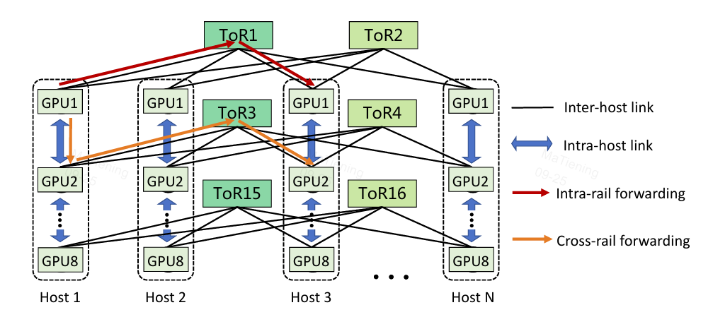
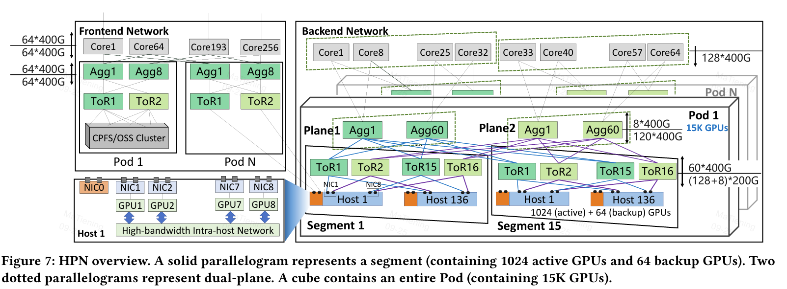
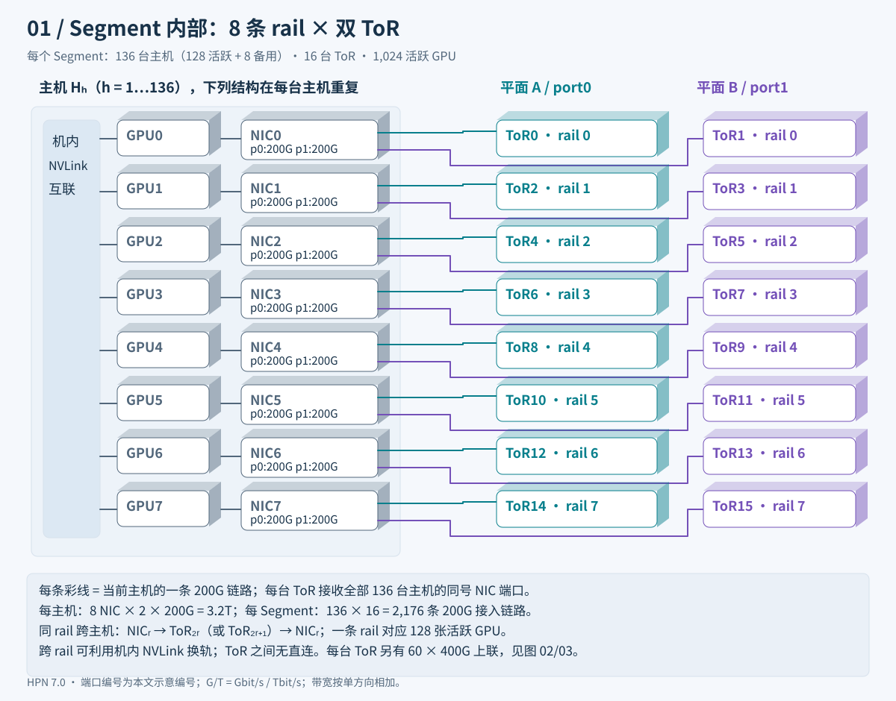
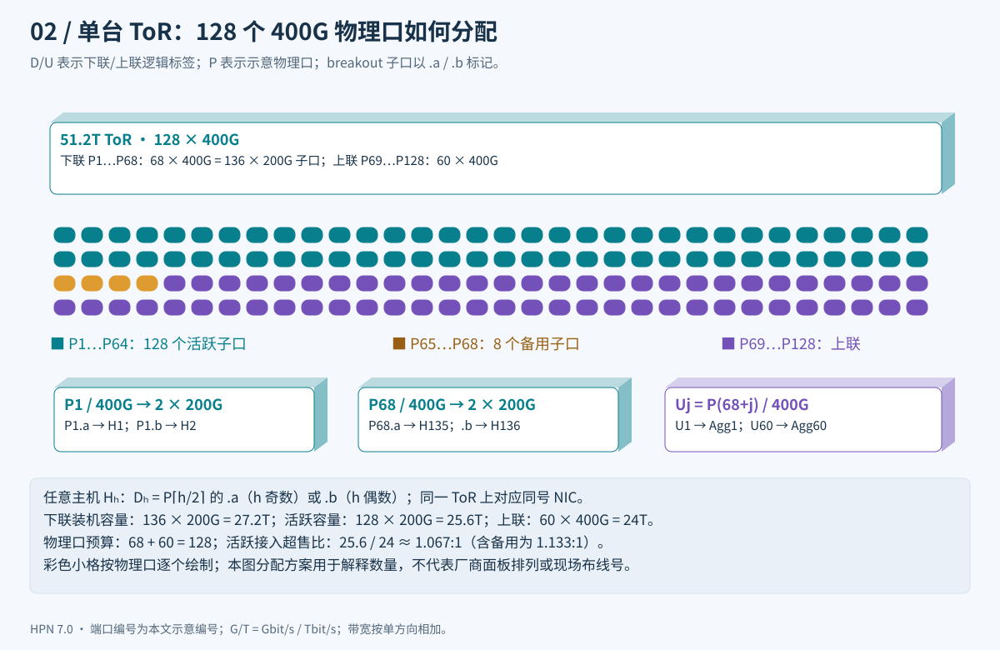
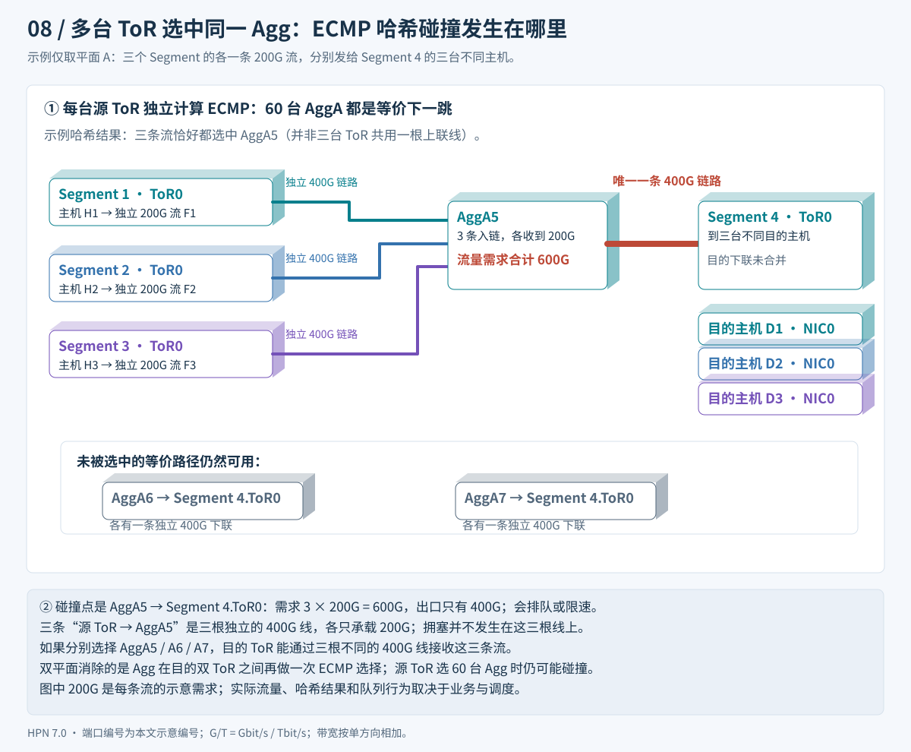
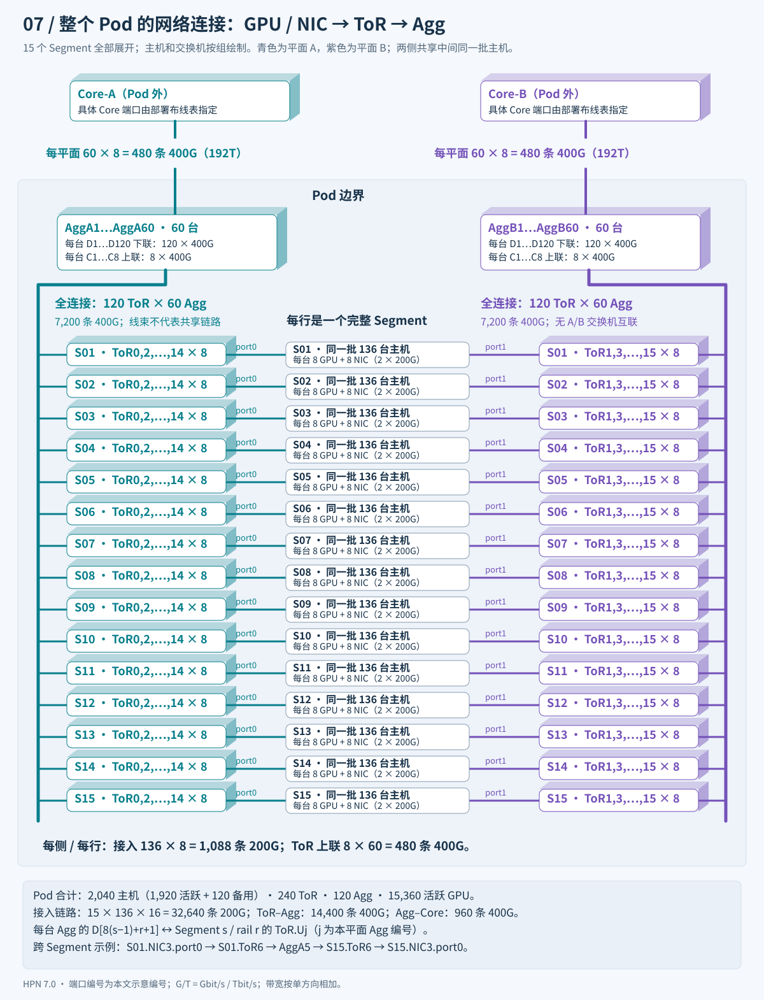
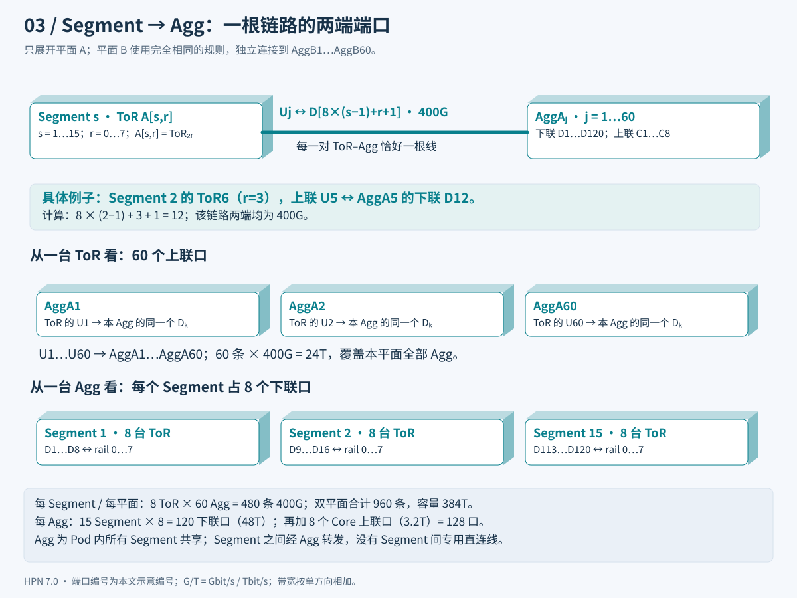
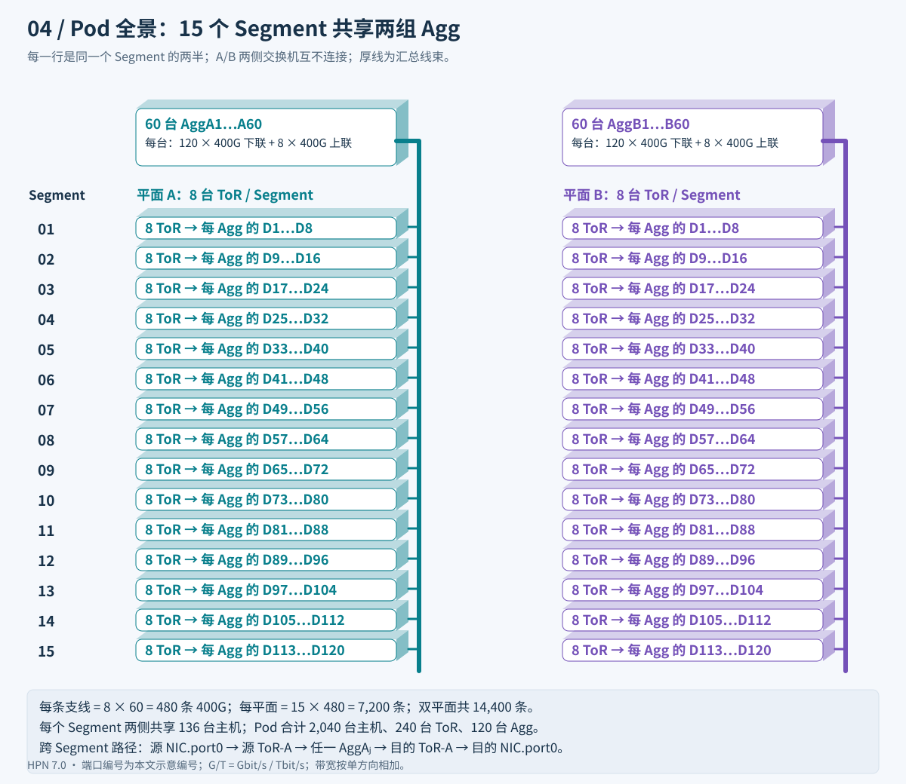
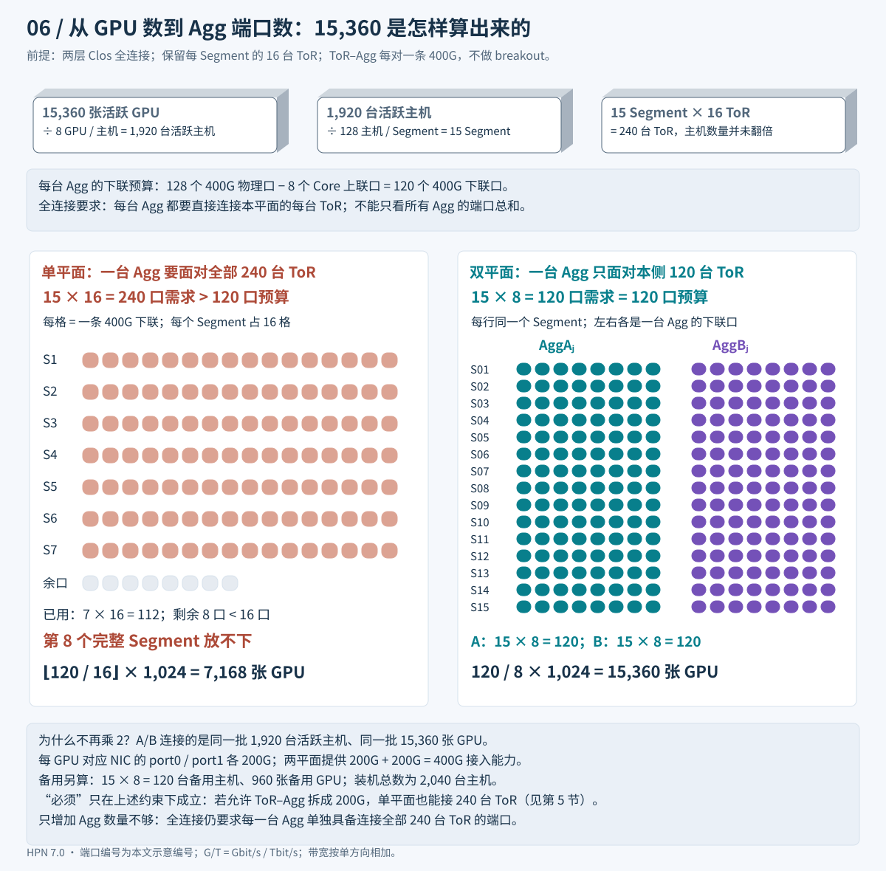
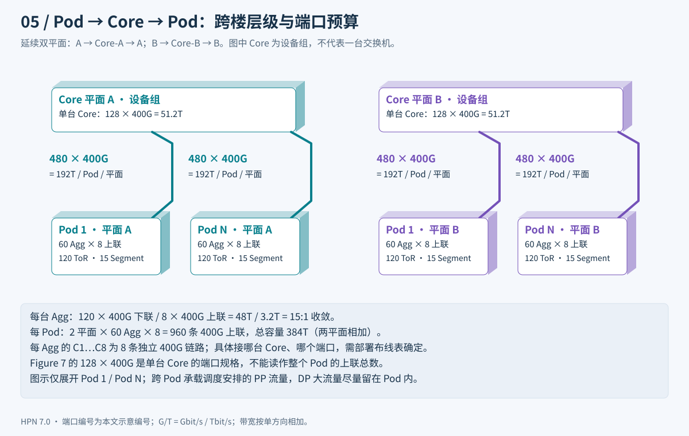

# HPN 7.0 双平面网络连接整理

## 0 论文知识提取

**一个segment 的大小由 ToR 的端口决定：**
- 1个 ToR 有 （128 + 8）200Gbps 下行端口和 60 个 400Gbps 上行端口;
- 1 个NIC 网卡需要连接 到一个 ToR, 双平面时 连接到 2个 ToR;
- 一个 segment 需要 8 张NIC卡都要连接，单平面就需要 8 个 ToR;
- 因此：一个 segment 内有 128* 8 = 1024 卡，8 个 ToR；
- 15 segment : 120 ToR, 15360 卡；
- 注意: 这里 一个网卡只能由一个端口连接到 ToR, 否则ToR 端口数不够；
- 结论：因此要连接所有网卡，需要 240 个 ToR.
- 一个segment 的多轨连接图如下：



**Agg 的大小**
- 1个Agg 只有120 个下行端口, 用于连接 ToR;
- 也就是一个平面最多 120 个 ToR;

**必须双平面的原因是:** <br>
- 1个Agg 只有120 个下行端口. 最多接 120 个 ToR, 但需要 240 个ToR.
- dual plane 将 ToR 与 agg 层之间的链路连接数减半，从而使汇聚交换机能在同一 Pod 内支持更多的网段。结果是: **第二层网络的规模翻了一倍**。

**Agg count**
- 每平面 60 个 Agg switches;
- 一个 Agg fail 时其余 Aggs 继续工作，不受影响;



> 来源：Alibaba HPN: A Data Center Network for Large Language Model Training (SIGCOMM 2024)
> https://dl.acm.org/doi/10.1145/3651890.3672265

本文按 **主机与 Segment → ToR 端口 → Segment–Agg 接线 → 整个 Pod → Core** 分层绘图。图中的立体设备块表示设备或设备组，汇总线束的数量写在线旁；点击 SVG 可查看原图并放大。

**读图约定**：GPU / 后端 NIC / rail 从 0 编号，Segment 从 1 编号；ToR 编号在每个 Segment 内重新开始。`P` 是物理口，`D` / `U` / `C` 分别是下联、ToR 上联、Agg 到 Core 上联的示意标签。端口编号与 breakout 排列是为说明连接关系而定义的示例，不是论文提供的现场布线表。带宽统一按单方向计，200G = 200 Gbit/s。

**5-tuple irrelevant**

五元组是网络流量的身份标识，包含五个字段：

| 字段 | 含义 |
|---|---|
| 源 IP 地址 | 谁发的 |
| 目的 IP 地址 | 发给谁 |
| 源端口号 | 发送方进程 |
| 目的端口号 | 接收方进程 |
| 协议号 | TCP / UDP 等 |
传统 ECMP 就是对这五个字段做哈希，来决定走哪条等价路径。

---

## 1. 基本数字（论文 Figure 7）

| 项目 | 数值 | 说明 |
|---|---|---|
| 交换芯片 | 51.2T，128 × 400G | ToR / Agg / Core 同一款 |
| 每主机 | 8 GPU + 8 后端 NIC | 每 NIC 2 × 200G 口 |
| **ToR** 下联 | (128+8) × 200G = 68 × 400G 口 | 接 136 台主机（128 活跃 + 8 备用） |
| **ToR** 上联 | 60 × 400G | 连本平面全部 60 台 Agg，每台 1 根 |
| **Agg** 下联 | 120 × 400G | 连本平面全部 120 台 ToR，每台 1 根 |
| **Agg** 上联 | 8 × 400G | 连 Core，收敛比 15:1 |
| **Segment** | 16 ToR(单平面8 ToR)，136 主机 | 1024 活跃 GPU + 64 备用 GPU |
| **Pod** | 15 Segment，240 ToR，120 Agg | 15 × 1024 = **15,360 活跃 GPU** |
| Core | 单台 128 × 400G；每 Pod 合计 960 × 400G 上联 | 120 Agg × 8；每平面 480 根，承载跨 Pod 的 PP 流量 |

### 1.1 主机与 Segment 内部接线



对于任意主机 `Hh` 的后端 `NICr`（`r=0…7`）：`port0 → ToR(2r)`，`port1 → ToR(2r+1)`，每条均为 200G。136 台主机重复同一规则，因此每台 ToR 各接 136 个 NIC 端口，整个 Segment 共 `136 × 8 × 2 = 2,176` 条接入链路。**每台主机都连接全部 16 台 ToR**，并非将主机分成 16 组。

同 rail 的两台主机可经一台 ToR 通信；一条 rail 覆盖 128 张活跃 GPU，8 条 rail 合计 1,024 张。跨 rail 可借助机内 NVLink 换轨；Pod 的 Agg 层也提供同平面不同 rail 的 ToR 间连通性。

>1. 一个 ToR 有 128 个 200G 端口，可连接 128 台机器；<br>
>1. 128 * 8 = 1024 张卡; <br>
>1. 一个平面、每个host 需要 8 个 ToR, 双平面需要 16 个 ToR. <br>

### 1.2 ToR 的物理口与 breakout 子口



按 `128 × 400G` 的芯片端口预算，ToR 的 136 个主机侧 200G 端口可由 `68` 个 400G 物理口各拆成 `2 × 200G` 得到：128 个接活跃主机，8 个接备用主机。剩下 `60` 个完整的 400G 口，分别连接本平面的 60 台 Agg。因此物理口预算是 **68 + 60 = 128**，不能把 136 个 breakout 子口直接与 60 个 400G 物理口相加。论文给出的是 136 个 200G 下联、60 个 400G 上联；图中的具体物理口编号是示意分配。

这里有三种不同的带宽比，不能统称为“1:1”：

| 比较位置 | 单台交换机端口容量 | 比值 |
|---|---|---|
| 活跃主机 → ToR → Agg | ToR 下联 `128 × 200G = 25.6T`；上联 `60 × 400G = 24T` | **约 1.067:1**，有轻微接入超售 |
| ToR ↔ Agg 的连接两端 | 本平面 120 台 ToR 的上联总计 `120 × 60 × 400G`；60 台 Agg 的下联总计 `60 × 120 × 400G` | **1:1**，是同一批链路两端的端口容量 |
| Agg → Core | 单台 Agg 下联 `120 × 400G = 48T`；上联 `8 × 400G = 3.2T` | **15:1**，跨 Pod 出口收敛 |

备用主机如果同时发满，其 8 个下联口还会增加 ToR 的接入需求。`1.067:1` 按 **128 台活跃主机**计算，正是[原论文 §5.1](https://ennanzhai.github.io/pub/sigcomm24-hpn.pdf)使用的口径。

### 1.3 多台 ToR 到 Agg：ECMP 哈希碰撞实例



图中只看平面 A：Segment 1、2、3 的三个源 ToR，各有一条 **200G** 流，发往 Segment 4 内的**三台不同主机**。每台源 ToR 都有 60 台 Agg 可选；假设三次 ECMP 哈希恰好都选中 `AggA5`。三条 `源 ToR → AggA5` 链路彼此独立，各承载 200G，并未在此处共用一根线。

冲突发生在下一跳：`AggA5 → Segment 4.ToR0` **只有一条 400G 链路**，三条流合计要求 `3 × 200G = 600G`。多出的需求会排队或被限速，而 `AggA6/A7 → Segment 4.ToR0` 的独立链路可能空闲。若三条流分别走 A5/A6/A7，目的 ToR 就能从三根不同的 400G 线接收它们。

这说明“双平面消除 hash 极化”指的是**避免 Agg 再在目的 NIC 的双 ToR 间做一次 ECMP 分流**；源 ToR 从本平面 60 台 Agg 中选路时仍可能撞到同一路径。HPN 还用精确路径选择和通信库负载调度处理这类平面内拥塞，见[论文 §6.1、Figure 12–14](https://ennanzhai.github.io/pub/sigcomm24-hpn.pdf)。

---

## 2. 层级关系：ToR → Agg → Pod

```sh
Pod（15,360 卡，一栋楼）
 ├─ 120 台 Agg（Tier2，把 ToR 连起来）
 ├─ 240 台 ToR（Tier1，直接接服务器）
 └─ 2,040 台主机（15 Segment × 136）
```

| | ToR | Agg | Pod |
|---|---|---|---|
| 是什么 | 交换机 | 交换机 | 一组设备的合称 |
| 层级 | Tier1 | Tier2 | Tier1 + Tier2 全部 |
| 下接 | 136 台主机 | 120 台 ToR | — |
| 上接 | 60 台 Agg | 8 根到 Core | Core |
| 决定什么 | Segment 的边界 | Pod 的边界 | 两层网络的最大范围 |

从一张 GPU 出发的可达范围：

```
GPU → 1 台 ToR ：同 Segment 同 rail 的 128 张活跃卡
    → 1 台 Agg ：同 Pod 全部 15 个 Segment，可达同平面各 rail 的 ToR
    → Core     ：其他 Pod（跨楼）
```

**Pod 大小由 Agg 下联口数决定**：120 ÷ 8（每 Segment 在单平面的 ToR 数）= 15 个 Segment。

### 2.1 整个 Pod 的网络连接总图



从图中任意一行的主机向两侧读：每台主机的 8 张后端 NIC，各自以 `port0 → 左侧 8 台 ToR`、`port1 → 右侧 8 台 ToR` 接入网络。再向上读：**每台 ToR 都连接本侧全部 60 台 Agg**；每台 Agg 又连接本侧全部 15 个 Segment 的 120 台 ToR。Core 在 Pod 边界之外。

图中粗线表示多条独立链路的汇总，不是所有流量共用一根线，也不表示 ToR 串接。每行左右各有 `136 × 8 = 1,088` 条 200G 接入链路，以及 `8 × 60 = 480` 条 400G ToR–Agg 链路。全 Pod 分别为 **32,640 条接入链路、14,400 条 ToR–Agg 链路、960 条 Agg–Core 链路**，每条物理连接只计一次。

### 2.2 Segment 如何连接 Agg：端口一一对应



记 `A[s,r]` 为 Segment `s` 内平面 A 的 rail `r` 对应 ToR（即 `ToR(2r)`），`B[s,r]` 对应 `ToR(2r+1)`。对任意 `s=1…15`、`r=0…7`、`j=1…60`，示意接线规则为：

```text
A[s,r].Uj ↔ AggAj.D[8×(s−1)+r+1]    1 × 400G
B[s,r].Uj ↔ AggBj.D[8×(s−1)+r+1]    1 × 400G
```

| 观察范围 | 端口对应关系 | 链路数 / 带宽 |
|---|---|---|
| 单台 ToR | U1…U60 分别连接本平面 Agg1…Agg60 | 60 × 400G = 24T |
| 一个 Segment → 一台本平面 Agg | 8 台 ToR 各连 1 口 | 8 × 400G = 3.2T |
| 一个 Segment → 本平面全部 Agg | 8 台 ToR 各连 60 台 Agg | 480 × 400G = 192T |
| 一个完整 Segment → 双平面 Agg | 上一行 × 2 | 960 × 400G = 384T |
| 一台 Agg → 全部 Segment | 每个 Segment 占 8 口，共 15 组 | 120 × 400G = 48T |

例如 `Segment 2 / ToR6 / U5 ↔ AggA5 / D12`。同一台 ToR 的 U6 则连接 AggA6 的 D12：**不同 Agg 上可以使用相同的下联端口编号**。每台 Agg 的 D1…D8 接 Segment 1，D9…D16 接 Segment 2，依此类推，D113…D120 接 Segment 15。

Agg 由全部 Segment 共享，Segment 之间不串接，也不各自独占一组 Agg。

---

## 3. Segment 与 Plane：两个正交维度

- **Segment 横着切**：按"哪些主机"分。Seg1 = 第 1~136 台主机，Seg2 = 第 137~272 台……
- **Plane 竖着切**：按"网卡哪个口"分。所有 NIC 的 port0 → 平面 A，port1 → 平面 B。



上图完整列出 15 个 Segment。每个彩色支线是 `8 ToR × 60 Agg = 480` 条 400G 链路的汇总；同一行两侧的 ToR 接入同一批 136 台主机。**单平面是 120 ToR 与 60 Agg 的全连接**，总计 7,200 条链路；两个平面合计 14,400 条。

```sh
                 平面 A（所有 NIC port0）          平面 B（所有 NIC port1）
              ┌──────────────────────────────┬──────────────────────────────┐
  Segment 1   │ ToR0,2,4,...,14  (8台)        │ ToR1,3,5,...,15  (8台)      │ ← 136 主机
  Segment 2   │ 8 台 ToR                      │ 8 台 ToR                    │ ← 136 主机
  ……          │ ……                            │ ……                          │
  Segment 15  │ 8 台 ToR                      │ 8 台 ToR                    │ ← 136 主机
              ├──────────────────────────────┼──────────────────────────────┤
  上联        │ AggA1 ~ AggA60                │ AggB1 ~ AggB60              │
              └──────────────────────────────┴──────────────────────────────┘
                 120 ToR + 60 Agg                 120 ToR + 60 Agg
                 一个完整独立的 Clos               另一个完整独立的 Clos
                        ↑ 两个平面之间交换机零互联，只在主机 NIC 交汇 ↑
```

- 每个 Segment 横跨两个平面：16 台 ToR = 8（A）+ 8（B）
- 每个平面横跨全部 15 个 Segment：120 ToR + 60 Agg
- 表格 30 个格子，每格 8 台 ToR

### 3.1 数字回顾

- 240 ToR = 15 Segment × (8 平面 A + 8 平面 B)
- 120 Agg = 60 平面 A + 60 平面 B
- 每台 ToR 60 上联 = 本平面 60 台 Agg 各 1 根
- 每台 Agg 120 下联 = 本平面 120 台 ToR 各 1 根 = 15 Segment × 8

### 3.2 报文全程只走一个平面

```
源 GPU3 → NIC3.port0 → 源 Seg ToR6 → AggA_x → 目的 Seg ToR6 → 目的 NIC3.port0 → 目的 GPU3
         └──────────────────── 全程平面 A，不会中途跳到平面 B ────────────────────┘
```

两个平面唯一的交汇点是主机 NIC（双口 bonding）：
- **正常**：每张 NIC 两口都活跃，分别走 A、B，各 200G，合计 400G 峰值接入能力。
- **一台 ToR 故障**：与它相连的某条 rail 的 136 台主机改用配对 ToR。**这些主机的对应 NIC** 从 400G 变为最多 200G；其他 7 条 rail 的 NIC 不受这个故障直接影响。单个 ToR 占 Segment 的 16 台 ToR 中的 1 台，因此损失的是该 Segment 理论接入容量的约 `1/16`，不是所有 GPU 都变成半速。
- **整个 A 平面故障**：每台主机的 8 张后端 NIC 都只能使用 B 侧端口；每张 NIC 的峰值从 400G 降到 200G。若剩余平面仍可正确转发，任务可能继续，但剩余容量在修复前不会自行恢复，训练性能可能显著下降。

“能继续”只表示链路故障可能不使训练任务立即中断，**不等于性能不受影响**。论文的 [§9.3、Figure 18](https://ennanzhai.github.io/pub/sigcomm24-hpn.pdf) 测量的是一条 NIC–ToR 链路故障：在 256 GPU 测试中，训练吞吐下降 6.25%，修复后恢复；它没有用这组数据证明“整个平面故障只下降 6.25%”，也没有给出整个平面故障后的训练吞吐实测值。

| 故障范围 | 直接损失的链路/端口 | 容量影响 | 恢复前的训练影响 |
|---|---|---|---|
| 一条 NIC–ToR 链路 | 一台主机的一张 NIC 的 1 个 200G 口 | 该 NIC 峰值 400G → 200G；其他 NIC 正常 | 论文在指定 256 GPU 测试中测得吞吐下降 6.25%；其他任务不能直接套用 |
| 一台 ToR | 一条 rail 上 136 台主机各失去 1 个 200G 口 | 对应 NIC 峰值减半；Segment 理论总接入容量少约 1/16 | 取决于训练是否依赖这条 rail、负载是否已用满，不能从端口比例直接推算训练速度 |
| 整个平面 | 全部主机的 8 张 NIC 各失去 1 个 200G 口 | 全 Pod 后端峰值接入容量约减半 | 若正常训练已接近网络瓶颈，影响可能很大；论文未给出此场景实测 |

例如，一次迭代原本计算用 8 秒、通信用 2 秒；若所有通信恰好受带宽限制且故障后通信耗时翻倍，迭代从 10 秒变成约 12 秒，训练吞吐约下降 16.7%，而不是机械地下降 50%。这是说明“链路带宽与训练吞吐不是同一个量”的**假设算例**，不是 HPN 的实测结果。故障持续多久、任务就可能在降级状态运行多久；维修或切换到健康资源后，才有条件回到原有带宽。

**会自动修复吗？**要区分自动切换与故障修复。单条 NIC–ToR 链路或单台 ToR 被明确检测为失效时，NIC 的双口聚合可改用存活端口；ToR 撤销失效路径的 `/32` 主机路由后，BGP 将流量收敛到配对 ToR，这一转发切换由网络自动完成。光纤、光模块、交换机硬件等物理故障仍需排障和修理；切换不会补回失去的 200G 端口容量。论文单链路注入实验中，修复后训练吞吐恢复，但没有报告整平面失效会自动完成无损切换、自动修复或在多长时间内恢复。链路状态未被正确感知时也可能无法正常切换，论文记录过这种单向异常案例。参见[原论文 §4.2、§9.3 和 §10](https://ennanzhai.github.io/pub/sigcomm24-hpn.pdf)。

---

## 4. 为什么当前 400G 两层方案用双平面支持 15,360 卡

**卡数本身并不要求双平面。真正的限制是：单台 Agg 只有 120 个 400G 下联口，而 15,360 张卡对应 240 台 ToR。双平面让每台 Agg 只需接其中 120 台。**

原先“必须是双平面”的说法省略了前提：沿用本文的 51.2T 交换机、每 Segment 16 台 ToR、Agg 保留 8 个 Core 上联口、两层 Clos 全连接，且 **ToR–Agg 每条链路保持 400G，不做 breakout**。下面所有推算均在这些条件下进行；主机侧仍使用 200G breakout。



### 4.1 先从 GPU 数算出需要多少台 ToR

| 步骤 | 计算 | 得到什么 |
|---|---|---|
| GPU → 主机 | 15,360 ÷ 8 GPU/主机 | 1,920 台活跃主机 |
| 主机 → Segment | 1,920 ÷ 128 活跃主机/Segment | 15 个 Segment |
| 一个 Segment 的接入 | 8 个 NIC/主机 × 2 个端口/NIC | 对应 16 台 ToR，每台承接所有主机的同一个 NIC 端口 |
| Segment → ToR | 15 × 16 | 共 240 台 ToR |
| Agg 的下联预算 | 128 个 400G 口 − 8 个 Core 上联口 | 每台剩 120 个 400G 下联口 |

备用设备不计入 15,360 张活跃卡：15 个 Segment 另有 `15 × 8 = 120` 台备用主机、960 张备用 GPU，装机主机总数为 2,040 台。

### 4.2 单平面为什么放不下：看一台 Agg，而非所有 Agg 的端口总和

两层 Clos 的全连接要求是：**每台 Agg 都与本平面每台 ToR 直接相连**。240 台 ToR 若全放在一个平面，一台 Agg 就需要 `240 × 1 = 240` 个下联口，但实际只有 120 个，缺一半。

从 Segment 角度看，一个 Segment 的 16 台 ToR 在同一台 Agg 上占 16 口：

```text
7 个 Segment：7 × 16 = 112 口，剩 8 口
8 个 Segment：8 × 16 = 128 口，超过 120 口预算
因此最多容纳 floor(120 / 16) = 7 个完整 Segment
活跃 GPU 数 = 7 × 128 主机 × 8 GPU = 7,168
```

只增加 Agg 台数不能解决这个问题：每增加一台 Agg，它仍然需要连接全部 240 台 ToR。若让不同 Agg 只接不同子集，便改变了这里要求的全连接结构。

### 4.3 双平面如何刚好放下：240 台 ToR 分成 120 + 120

每个 Segment 的 16 台 ToR 拆为 A 平面的 8 台和 B 平面的 8 台。于是每台 AggA 只连 A 侧，每台 AggB 只连 B 侧：

```text
一台 AggA：15 Segment × 8 台 A-ToR = 120 个下联口，刚好放下
一台 AggB：15 Segment × 8 台 B-ToR = 120 个下联口，刚好放下

Segment 上限 = 120 / 8 = 15
活跃 GPU 数 = 15 × 128 主机 × 8 GPU = 15,360
```

这里**不能再乘 2**：A、B 连接的是同一批主机、同一批 GPU 的两个 NIC 端口，而不是各自一批 GPU。每张 GPU 对应的 NIC 在 A、B 各提供 200G，合计 400G 接入能力。

### 4.4 再用带宽核对：连接范围减半，单台 ToR 带宽保持不变

| 对象 | 平面 A | 平面 B | 全 Pod 合计 |
|---|---|---|---|
| ToR / Agg 台数 | 120 / 60 | 120 / 60 | 240 / 120 |
| 单台 ToR 上联 | 60 × 400G = 24T | 60 × 400G = 24T | 每台仍为 24T |
| ToR–Agg 链路 | 120 × 60 = 7,200 条 | 120 × 60 = 7,200 条 | 14,400 条 400G |
| ToR 上联端口容量之和 | 120 × 24T = 2,880T | 120 × 24T = 2,880T | 5,760T |
| Agg 下联端口容量之和 | 60 × 120 × 400G = 2,880T | 60 × 120 × 400G = 2,880T | 5,760T |

最后两行是同一批链路两端的核对，不能相加。5,760T 是链路容量总和，不是任意一次通信都可获得的吞吐量。活跃主机的 NIC 接入总容量为 `15,360 × 400G = 6,144T`，与 ToR 上联相比仍有 `6,144 / 5,760 ≈ 1.067:1` 的接入超售。

**如果允许改成 200G 链路，单平面也能做到 15,360 卡**：Agg 的 120 个 400G 下联口拆成 240 个 200G 子口，恰好连接 240 台 ToR；ToR 的 60 个 400G 上联口拆成 120 个 200G 子口，连接 120 台 Agg，每台 ToR 的总上联仍是 24T。这正是下一节的比较对象。因此双平面的意义是在保留 400G ToR–Agg 链路的条件下，用两个较小的全连接网络达到这一规模，并减少链路数量。

---

## 5. 为什么双平面把 ToR–Agg 链路数"减半"

减的是**线的根数 / ECMP 等价路径数**，不是带宽。比较对象是"单平面全连接做 15K、1:1 无收敛"。

单平面下 240 ToR × 120 Agg 全连接，ToR 只有 60 个上联口却要连 120 台 Agg，
只能把每个 400G 口 breakout 成 2 × 200G。

```
        单平面（假想）                            双平面（HPN 实际）
   ┌─────────────────────────┐          ┌───────────┐  ┌───────────┐
   │  120 Agg                │          │ 60 AggA   │  │ 60 AggB   │
   │   ↕ 240 × 120 条 200G   │          │ ↕120×60条 │  │ ↕120×60条 │
   │  240 ToR                │          │ 120 ToR   │  │ 120 ToR   │
   └─────────────────────────┘          └───────────┘  └───────────┘
   连接矩阵 240 × 120 = 28,800 条         2 × (120 × 60) = 14,400 条
```

| | 单平面全连接（假想） | 双平面（HPN） |
|---|---|---|
| 每台 ToR 连几台 Agg | 120 | 60 |
| 每条链路速率 | 200G | 400G |
| 每台 ToR 上联总带宽 | 120 × 200G = 24T | 60 × 400G = 24T（一样） |
| ToR–Agg 链路总数 | 28,800 | 14,400（减半） |
| 每台 ToR 的 ECMP 路径数 | 120 | 60（减半） |
| ToR–Agg 链路是否需要 breakout | 要 | 不要（主机侧仍需 breakout） |
| ToR 上联与 Agg 下联的端口容量比 | 1:1 | 1:1（一样；主机接入仍约 1.067:1，Agg→Core 为 15:1） |

### 减半的好处

1. **光纤 / 光模块少一半**：跨楼层的 ToR→Agg 光模块很贵，成本实打实。
2. **哈希极化更少**：LLM 训练每主机只有几条 400G 大流，ECMP 路径 120 → 60，
   层数 3 → 2（哈希次数 3 → 1），大流撞到同一路的概率明显下降。
3. **精确选路搜索空间减半**：为大流挑不拥塞路径时，可选路径 120 → 60，收敛更快。

### 与"规模翻倍"是同一件事的两面

- 固定 400G 不 breakout：单平面带 7 Segment，双平面带 15 → **规模翻倍**
- 固定 15K 卡、1:1 带宽：单平面 28,800 条 200G，双平面 14,400 条 400G → **链路数减半**

本质：把全连接矩阵切成两个互不相连的小矩阵，连接对数减半，用更粗的链路补回带宽。
代价：两平面交换机层零互联，只能靠主机 NIC 双口 bonding "缝"在一起
—— 所以**双平面必须与 dual-ToR 配套出现**。

---

## 6. Pod = 一栋楼

论文第 6 节：阿里云现役机房楼供电上限 18MW，一栋 18MW 楼约容纳 15K GPU，
配合 HPN，**每栋楼恰好装下一个完整 Pod**，绝大多数链路留在楼内。

| 约束 | 数值 | 来源 |
|---|---|---|
| 一栋楼供电 | 18MW | 土建 / 电力 |
| 18MW 能供多少 GPU | ≈ 15K | 单机功耗折算 |
| Agg 端口能带多少 GPU | 15,360 | 120 ÷ 8 × 1024 |



每台 Agg 的 `C1…C8` 各提供一条 400G 上联；每平面 `60 × 8 = 480` 条，每 Pod 两平面合计 **960 条、384T**。原图中的 `128 × 400G` 标注是单台 Core 的端口规格，不能作为 Pod 上联总数。这里仅标明可由端口预算确定的对应关系；具体 `Agg.Ck → Core编号/端口号` 需要部署布线表，不能从论文概览图推定。后端 Core 与前端 Core 的编号也不能混用。

- **楼内**（ToR ↔ Agg）：14,400 根 400G，两端端口容量匹配；主机接入侧仍约 1.067:1，走 DP / AllReduce 大流量
- **楼间**（Agg ↔ Core）：每台 Agg 8 根上联，15:1 收敛，只走数据量小、容忍高延迟的 PP 流量

### 为什么 Pod 和楼对齐

1. **物理距离**：楼内几十米多模光纤即可；跨楼需几百米到公里级单模，成本高数倍，大流量要关在楼内。
2. **故障域**：一栋楼停电 / 空调故障最多影响一个 Pod，不跨 Pod 的任务不受隔壁楼影响。
3. **调度简单**："放在一个 Pod 内" = "放在一栋楼内"，不用再考虑机房拓扑。

下一代机房已上调单楼功率，配合 102.4T 芯片，让更大的 Pod 仍能塞进一栋楼。

---

## 7. 一句话总结

- **Segment** 决定"你和谁在一起"（16 ToR、136 主机、1024 活跃卡）
- **Plane** 决定"你走哪条独立的路"（port0 → A，port1 → B，交换机层零互联）
- **ToR** 接服务器，**Agg** 接 ToR，**Pod** = 一组 Agg + 其下所有 ToR 和主机 = 一栋 18MW 的楼
- **15,360 = 15 × 1024**，15 = Agg 的 120 个下联口 ÷ 8，这个 8（而不是 16）就是双平面带来的
- 双平面用更粗的 400G 链路换掉一半的连接对数：**规模翻倍、链路减半、带宽不变、ECMP 极化更少**
