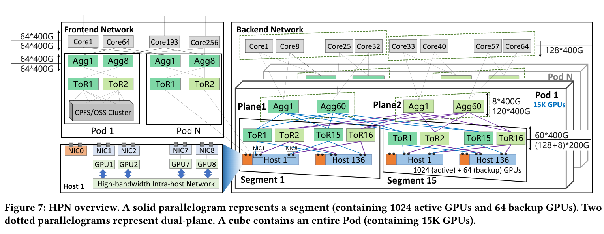
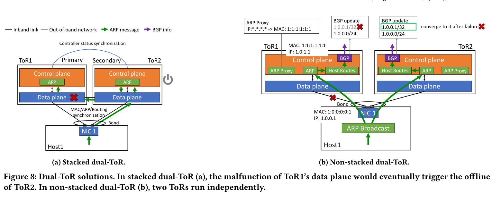
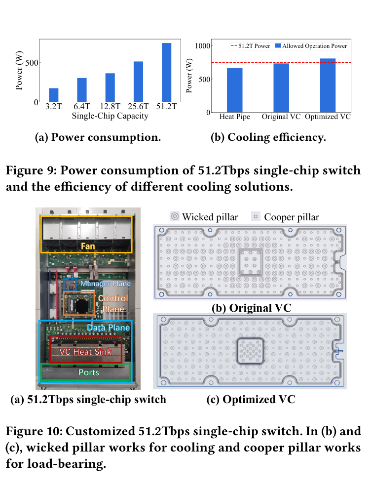
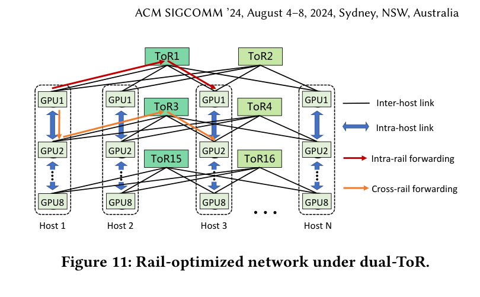
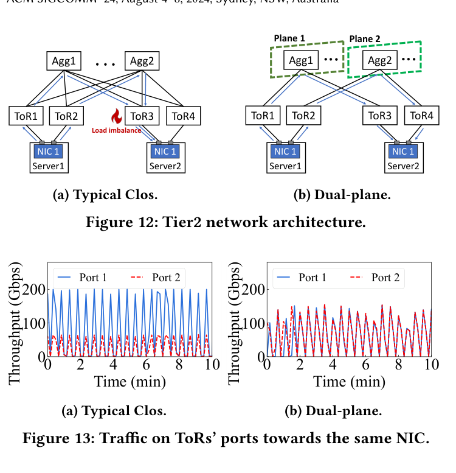
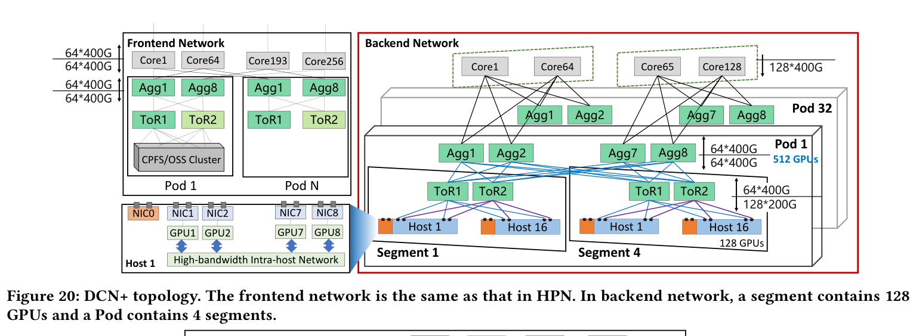
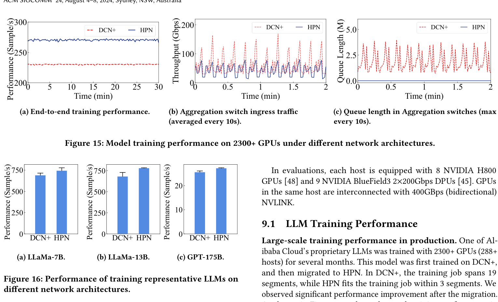
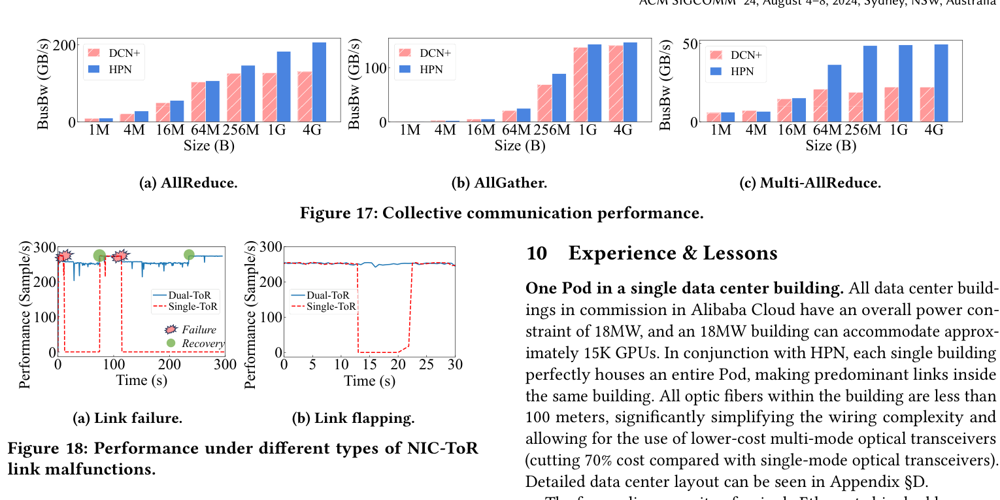
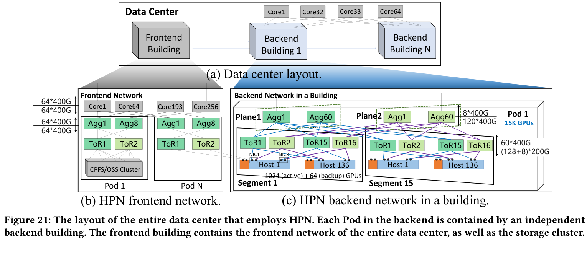

# Alibaba HPN：面向大语言模型训练的数据中心网络

> **一句话概括：**HPN 针对大模型训练“少量、周期性、突发的大象流”和“同步训练对单点故障极其敏感”的特点，以非堆叠双 ToR、Rail-optimized Tier1、双平面 Tier2 和精确路径选择为核心，在一个两层 Pod 内连接 15,360 张 GPU，并在生产环境中将端到端训练吞吐提升 14.9%。

## 1. 论文信息

- **题目：**Alibaba HPN: A Data Center Network for Large Language Model Training
- **作者：**Kun Qian、Yongqing Xi、Jiamin Cao、Jiaqi Gao、Yichi Xu、Yu Guan、Binzhang Fu、Xuemei Shi、Fangbo Zhu、Rui Miao、Chao Wang、Peng Wang、Pengcheng Zhang、Xianlong Zeng、Eddie Ruan、Zhiping Yao、Ennan Zhai、Dennis Cai
- **机构：**Alibaba Cloud
- **会议：**ACM SIGCOMM 2024
- **篇幅：**16 页
- **DOI：**[10.1145/3651890.3672265](https://doi.org/10.1145/3651890.3672265)
- **论文原文：**[sigcomm24-HPN.pdf](https://qiankun11516.github.io/pdf/sigcomm24-HPN.pdf)

## 2. 核心结论

HPN（High Performance Network）不是在传统三层 Clos 上继续叠加拥塞控制算法，而是根据 LLM 训练流量重新设计拓扑：

1. **可靠性：**用非堆叠双 ToR 消除接入层单 ToR 故障，同时避免传统堆叠双 ToR 的状态同步耦合。
2. **Tier1 规模：**结合 51.2 Tbps 单芯片交换机和 Rail-optimized 拓扑，把一个 Segment 扩展到 1,024 张工作 GPU，另配 64 张备用 GPU。
3. **Tier2 规模与负载均衡：**将每个双 ToR 对分入两个独立平面，在两层网络中构建可容纳 15,360 张 GPU 的 Pod，避免 Aggregation 层的级联 ECMP 哈希极化。
4. **精确路径选择：**借助 RePaC 找到真正不相交的等价路径，再由集合通信库依据未完成 WQE 字节数选择负载最低的连接。
5. **业务隔离：**训练通信走 Backend Network；管理、存储和推理流量走独立的 Frontend Network，避免存储流量干扰训练。
6. **生产效果：**与上一代 DCN+ 相比，2,300 多张 GPU 上的端到端训练性能提升 14.9%，AllReduce 最高提升 59.3%，Multi-AllReduce 最高提升 158.2%。

## 3. 术语表

### 3.1 拓扑与网络层次

| 术语 | 中文 | 论文中的含义 |
| --- | --- | --- |
| HPN | 高性能网络 | Alibaba Cloud 为 LLM 训练设计的以太网数据中心网络架构。 |
| Frontend Network | 前端网络 | 承载管理、数据集和镜像加载、Checkpoint 读写以及推理请求等流量。 |
| Backend Network | 后端网络 | 专门承载训练期间的 GPU 间 RDMA 和集合通信流量。 |
| Tier1 | 第一层网络 | GPU 主机经 ToR 互联的接入层；一个 Tier1 域称为 Segment。 |
| Tier2 | 第二层网络 | 通过 Aggregation 交换机互联多个 Segment；一个 Tier2 域称为 Pod。 |
| Tier3 | 第三层网络 | 通过 Core 交换机互联多个 Pod，用于超过单 Pod 规模的训练。 |
| Segment | 网段／一级网络单元 | HPN 中由一组 ToR 直接连接的网络单元，包含 1,024 张工作 GPU 和 64 张备用 GPU。 |
| Pod | 二级网络单元 | 由 15 个 Segment 组成，可连接 15,360 张 GPU。 |
| ToR | 机架顶交换机 | Top-of-Rack switch；本文重点解决其作为接入单点所带来的故障风险。 |
| Aggregation | 汇聚层 | 连接多个 Segment，并组成 Tier2 双平面的交换层。 |
| Core | 核心层 | 连接多个 Pod，支撑约 10 万张 GPU 的长期扩展目标。 |
| Clos | Clos 网络 | 数据中心常用的多级无阻塞或近无阻塞拓扑；传统三层 Clos 会让同一大象流经历多次 ECMP 哈希。 |
| Rail | 轨道 | 一张 GPU 对应一张后端 NIC；同一序号的 GPU/NIC 构成一条 Rail。 |
| Rail-optimized | 轨道优化拓扑 | 同号 NIC 接入同一组 ToR，使同轨通信走一次交换；跨轨通信可先经 NVLink 在主机内换轨。 |
| Single-ToR | 单 ToR 接入 | NIC 的两个端口聚合后只接入一台 ToR，存在接入层单点故障。 |
| Dual-ToR | 双 ToR 接入 | NIC 的两个端口以 Active-Active 方式分别连接两台 ToR。 |
| Stacked Dual-ToR | 堆叠双 ToR | 两台 ToR 通过直连链路同步 MAC、ARP 和控制器状态，对同步链路和版本兼容存在强依赖。 |
| Non-stacked Dual-ToR | 非堆叠双 ToR | HPN 的双 ToR 方案；两台 ToR 无直连同步链路、彼此独立，通过定制 LACP、ARP 和 BGP 协同。 |
| Dual-plane | 双平面 | 将双 ToR 对的两台交换机分别归入两个物理隔离的转发平面，使进入某平面后的 Pod 内路径唯一确定。 |
| Any-to-any Tier2 | 任意到任意二层网络 | HPN 实际采用的 Tier2，允许不同 Rail 之间通信，适配 MoE 和多租户等场景。 |
| Rail-only Tier2 | 纯轨道二层网络 | 只允许同轨通信，可把单 Pod 扩展到 122,880 张 GPU，但不能满足跨 Rail 流量。 |

### 3.2 流量、负载均衡与路径选择

| 术语 | 中文 | 论文中的含义 |
| --- | --- | --- |
| Low entropy | 低熵流量 | 主机只产生少量连接，ECMP 难以依靠大量随机流自然均衡负载。 |
| Bursty traffic | 突发流量 | 反向传播阶段周期性触发梯度同步，NIC 吞吐会瞬间达到 400 Gbps 并持续数秒到数十秒。 |
| Elephant flow | 大象流 | 持续时间长、数据量大、容易独占链路的大流；LLM 训练流量以此为主。 |
| ECMP | 等价多路径 | 根据五元组哈希选择等价路径；面对少量大象流时容易负载不均。 |
| Hash polarization | 哈希极化 | 同一流在多级交换机上用相同五元组反复哈希，碰撞被级联放大，导致少数路径拥塞。 |
| Disjoint paths | 不相交路径 | 除端点外不共享链路的路径集合，可避免多个逻辑连接实际落到相同瓶颈链路。 |
| RePaC | 相对路径控制 | 利用哈希线性关系复现交换机的 ECMP 结果，帮助主机确定五元组与实际路径之间的映射。 |
| Path selection | 路径选择 | HPN 先建立经过不相交路径的多个 RDMA 连接，再选择未完成工作量最小的连接发送消息。 |
| ECN | 显式拥塞通知 | 交换机标记拥塞的信号；论文将其列为常见主机侧负载均衡的反馈之一。 |
| RTT | 往返时延 | 可用作路径拥塞程度的反馈信号。 |
| INT | 带内网络遥测 | In-band Network Telemetry；HPN 还用 INT 探针核对实际布线是否符合蓝图。 |
| Bisection bandwidth | 对分带宽 | 将网络任意分成两半时可提供的带宽；HPN 双平面仍保持 1:1 对分带宽。 |
| Oversubscription | 超售比 | 下行需求与上行容量之比；HPN 的 Aggregation-Core 层采用 15:1，以换取更大的单 Pod 规模。 |

### 3.3 RDMA、交换与故障恢复

| 术语 | 中文 | 论文中的含义 |
| --- | --- | --- |
| RDMA | 远程直接内存访问 | 后端训练网络采用的高吞吐、低 CPU 开销通信方式。 |
| QP | 队列对 | RDMA Queue Pair；同一双端口 NIC 的两个端口共享 QP 上下文，因此端口切换不必打断活跃流。 |
| WQE | 工作队列元素 | Work Queue Element；HPN 统计各连接当前未完成 WQE 的总字节数，用作负载指标。 |
| CQE | 完成队列元素 | Completion Queue Element；完成通知返回时，相应连接的未完成字节计数减少。 |
| LACP | 链路聚合控制协议 | 主机用它把通向两台 ToR 的链路视为一个逻辑聚合接口。 |
| LACPDU | LACP 数据单元 | LACP 协商报文；非堆叠双 ToR 通过定制其中的 sysID 和 portID，让两台独立 ToR 表现为一个逻辑设备。 |
| sysID | 系统标识 | LACP Actor 信息中的系统 ID；HPN 使用预配置的保留虚拟路由器 MAC 生成相同 sysID。 |
| portID | 端口标识 | HPN 对两台 ToR 使用不同的端口偏移量，确保同一主机对应的 portID 不冲突。 |
| ARP Broadcast | ARP 复制广播 | 主机将 ARP 报文复制到 NIC 的两个端口，使两台独立 ToR 同时学习邻居信息。 |
| ARP Proxy | ARP 代理 | ToR 用自己的 MAC 响应主机 ARP，把原本可能发生的二层直转强制终止在 ToR，转为三层转发。 |
| Host Route | 主机路由 | ToR 将学到的 ARP 转成 BGP `/32` 路由；链路失效时撤销该路由，使流量收敛到另一台 ToR。 |
| BGP | 边界网关协议 | HPN 用成熟的 BGP 路由收敛机制处理 ToR 或链路故障。 |
| Link flapping | 链路抖动 | 链路短时间反复 Up/Down；单 ToR 会让训练停顿，双 ToR 下影响很小。 |
| LFS | 链路故障信令 | Link Fault Signaling；论文用实际案例说明固件缺陷可能造成两端观察到不对称链路状态。 |

### 3.4 训练与系统组件

| 术语 | 中文 | 论文中的含义 |
| --- | --- | --- |
| DP | 数据并行 | 每张 GPU 保留模型副本并处理不同数据，迭代时通过 AllReduce 同步梯度。 |
| PP | 流水线并行 | 模型按连续层切成多个阶段；相邻阶段以 Send/Recv 传输激活值和梯度。 |
| TP | 张量并行 | 将层内张量分散到多张 GPU，通过 AllReduce 或 AllGather 同步。 |
| AllReduce | 全归约 | 汇总并把归约结果分发给所有参与者，是梯度同步的主要集合通信。 |
| AllGather | 全收集 | 每个参与者收集所有节点的数据分片。 |
| Multi-AllReduce | 并行多组全归约 | Megatron 在 TP=8 时，同一 DP 组内相同序号 GPU 并发执行多组 AllReduce。 |
| NVLink | GPU 高速互联 | 主机内 GPU 互联，双向带宽约 400–900 GB/s，显著高于单 NIC 的 400 Gbps。 |
| NVLS | NVLink SHARP | 在 NVSwitch 内执行归约，提升 AllReduce 的主机内处理能力。 |
| Checkpoint | 检查点 | 训练状态快照；故障后从最近检查点恢复，但保存开销高且间隔通常为 2–4 小时。 |
| CPFS / OSS | 并行文件系统／对象存储 | 部署在前端网络中的训练数据、容器镜像和 Checkpoint 存储服务。 |
| DCN+ | 上一代训练网络 | HPN 的对照基线：支持双 ToR 的传统三层 Clos，单 Segment 128 张 GPU，单 Pod 512 张 GPU。 |
| VC heat sink | 均热板散热器 | Vapor Chamber；HPN 为 51.2 Tbps 单芯片交换机定制的散热方案。 |

## 4. 为什么传统数据中心网络不适合 LLM 训练

### 4.1 流量模式不同

传统云业务通常产生数百万条连续的小流，平均利用率一般低于 NIC 容量的 20%。大量流为 ECMP 提供了足够的统计随机性。

LLM 训练则相反：每台主机只有几十到几百条连接，但每条流都很大，并在反向传播阶段周期性爆发。论文生产集群中的 2 × 200 Gbps NIC 可瞬间跑满 400 Gbps，并持续数秒至数十秒。

这种“少量大象流 + 低熵 + 同步突发”的组合会导致两个问题：

- 五元组哈希样本过少，ECMP 无法保证均匀分布；
- 三层 Clos 中同一流在 ToR、Aggregation 和 Core 被连续哈希，碰撞和负载倾斜会被放大。

### 4.2 同步训练放大了长尾和故障

一次训练迭代必须等待所有 GPU 完成通信。任何一条慢流、一个 GPU 或一台交换机的异常，都可能拖慢甚至终止整个任务。

论文给出的生产数据包括：

- NIC-ToR 链路每月故障比例约为 **0.057%**；
- ToR 每月发生严重错误或宕机的比例约为 **0.051%**；
- 每天出现约 **5,000～60,000 次**链路抖动；
- 一个训练任务每月可能因此崩溃 **1～2 次**；
- LLM 训练中的故障成本约为一般云计算故障的 **20 倍**。

Checkpoint 不能完全抵消损失：每张 GPU 的 Checkpoint 数据可达 30 GB，生成一次约需 100 秒，因此生产任务通常每 2～4 小时才保存一次，开销仍约占 5%。论文估算，一个使用 3,000 张 GPU、每小时成本 2 万美元的训练任务，一次故障可能造成约 3 万美元损失。

### 4.3 HPN 的设计目标

- **G1，可扩展性：**主要目标是在单 Pod 内容纳 15,000 级 GPU，长期目标是约 100,000 张 GPU。
- **G2，高性能：**减少网络跳数和 ECMP 次数，尽量利用 GPU 间的主机内高速互联。
- **G3，单 ToR 容错：**从拓扑层面消除 ToR 接入单点。

## 5. HPN 总体架构

每台主机包含 8 张 GPU 和 9 张双端口 200 Gbps NIC：

- `NIC0` 接入 Frontend Network；
- 其余 8 张 NIC 分别服务 8 张 GPU，接入 Backend Network；
- 每张后端 NIC 提供 2 × 200 Gbps，总后端带宽为 3.2 Tbps；
- 后端 NIC 的两个端口分别连接两台 ToR，形成 Active-Active 双 ToR；
- 8 张 GPU 通过 NVLink 等主机内网络互联，双向带宽为 400～900 GB/s。

HPN 后端的层次如下：

| 层次 | 规模 | 核心设计 |
| --- | ---: | --- |
| 主机 | 8 张 GPU | 每 GPU 独占一张 400 Gbps 后端 NIC，另有一张 400 Gbps 前端 NIC |
| Segment / Tier1 | 1,024 张工作 GPU + 64 张备用 GPU | 51.2 Tbps 单芯片 ToR、非堆叠双 ToR、Rail-optimized |
| Pod / Tier2 | 15 个 Segment，15,360 张 GPU | 双平面、60 台 Aggregation／平面、精确不相交路径 |
| 多 Pod / Tier3 | 约 100K GPU 目标 | 15:1 超售，只让低流量 PP 通信跨 Pod，Core 延续双平面 |

## 6. 关键设计

### 6.1 非堆叠双 ToR：消除接入单点，也消除同步耦合

传统堆叠双 ToR 用直连链路同步 MAC、ARP、路由和主备控制器状态。它看似提供冗余，实际却引入了新的共同故障面：

- 一台 ToR 的数据面故障而控制面未感知时，另一台 ToR 可能为避免状态不一致而主动下线；
- 两台 ToR 分别运行新旧软件版本时，RPC 字段不兼容可能导致双机故障；
- 论文统计，过去三年传统数据中心中超过 40% 的严重故障与这两类堆叠双 ToR 问题有关；
- 约 70% 的 ToR 升级跨度不满足 ISSU 对小版本差异的要求。

HPN 移除了两台 ToR 之间的直连同步链路，使它们独立运行，并通过以下机制维持双端口聚合：

1. **定制 LACP：**两台 ToR 使用相同的预配置虚拟 MAC 生成相同 sysID；各自对 portID 增加不同且大于 256 的偏移，避免冲突。
2. **ARP 双发：**主机把 ARP 报文复制到 NIC 的两个端口，使两台 ToR 都能学习邻居。
3. **ARP 转 `/32` 路由：**ToR 将主机邻居转换为 BGP Host Route，并在链路故障时撤销对应路由。
4. **BGP 收敛：**故障后，只剩健康 ToR 发布目标主机的最长前缀 `/32`，全网流量自动收敛到健康路径。
5. **ARP Proxy + 三层转发：**关闭二层广播并由 ToR 代理 ARP，避免 MAC 表默认 5 分钟老化造成故障期间的二层黑洞。

作者没有让每台训练主机直接运行 BGP，因为那会把 BGP 运维规模从约 1,000 台网络设备扩大到约 10,000 台主机，并拖慢收敛和集群升级。

### 6.2 Tier1：51.2 Tbps 单芯片交换机与 Rail-optimized

每台 Tier1 交换机提供：

- 128 个工作下行 200 Gbps 端口；
- 8 个备用下行 200 Gbps 端口；
- 60 个上行 400 Gbps 端口；
- 实际约 **1.067:1** 的超售比。

HPN 选择单芯片而非多芯片框式交换机，原因是后者的片间 Fabric、片间协议和芯片到 CPU 通信会增加故障面。阿里云的运行数据中，单芯片交换机数量是多芯片交换机的 32.6 倍，但多芯片交换机严重硬件故障总数仍高出 3.77 倍。

51.2 Tbps 芯片的功耗比上一代 25.6 Tbps 芯片高 45%，而结温上限仍为 105°C。原有热管和厂商推荐均热板无法保证满载运行，团队通过优化均热板毛细结构、在芯片中心增加吸液芯柱，将散热效率提高 15%。

Rail-optimized 的要点是：同号 GPU/NIC 接入同一组双 ToR。以 GPU1 到远端 GPU2 为例，可以先通过 NVLink 从本机 GPU1 转到本机 GPU2，再从 GPU2 所在 Rail 跨主机发送。

由于主机内互联带宽约为 NIC 带宽的 4～9 倍，利用 NVLink 换轨通常比在交换网络中跨 Rail 更合算。结合双 ToR 后，一台主机的 3.2 Tbps 后端带宽分散到 16 台 ToR，单 Segment 的 GPU 规模由 128 扩大到 1,024，增长 8 倍。论文统计，96.3% 的生产训练任务使用少于 1,000 张 GPU，因此可完全放进一个 Segment，避免 Aggregation 层通信。

### 6.3 Tier2：双平面消除 Pod 内哈希极化

若双 ToR 上方仍采用普通 Clos，60 台 Aggregation 到两台 ToR 的下行流量还要再次通过 ECMP 哈希。在真实 GPT-3 175B 变体训练中，同一 NIC 对应的两条下行端口负载可相差 3 倍。

HPN 将双 ToR 对中的两台交换机分别放入两个平面：

- NIC 端口 0 的流量只在平面 0 中转发，并最终到达目标 NIC 的端口 0；
- NIC 端口 1 的流量只在平面 1 中转发，并最终到达目标 NIC 的端口 1；
- 流量一旦从 ToR 的某条上行进入平面，其 Pod 内路径便完全确定；
- 两个平面物理隔离，同时仍维持 1:1 对分带宽。

实测结果：

- ToR 下行队列长度下降 **91.8%**；
- 跨 Segment 流量性能最高提升 **71.6%**；
- 普通 Clos 中两条端口队列长期约为 267 KB 和 3 KB；双平面后两台 ToR 负载趋于均衡，平均队列约 20 KB。

### 6.4 精确不相交路径与应用层负载均衡

双平面解决了 Aggregation 层的哈希极化，但同一平面内仍有 60 条等价上行。HPN 的路径选择分两步：

1. 根据源 IP、目的 IP 和目的端口，使用 RePaC 复现交换机哈希结果，找到一组不相交路径及对应的源端口／五元组；
2. 为这些路径建立多个 RDMA 连接，在集合通信库中维护每条连接当前未完成 WQE 的总字节数，把新消息交给计数最小的连接。

计数值能间接反映拥塞：拥塞连接排空 Work Queue 更慢，未完成字节数会更大。该方案位于集合通信库，不需要修改已经由硬件实现的商用 RDMA 传输层。

在 512 张 GPU 上并发运行 4 个 AllReduce 时，这一优化使集合通信性能最高提高 **34.7%**。

双平面还把路径搜索空间压缩了 1～2 个数量级：

| 网络 | GPU 数 | 层数 | 参与负载均衡的交换层 | 路径选择复杂度 |
| --- | ---: | ---: | --- | ---: |
| HPN Pod | 15,360 | 2 | ToR | `O(60)` |
| NVIDIA SuperPod 类架构 | 16,384 | 3 | ToR + Aggregation + Core | `O(4,096)` |
| Google Jupiter | 26,000 | 3 | ToR + Aggregation | `O(2,048)` |
| `k=48` Fat-tree | 27,648 | 3 | ToR + Aggregation | `O(2,304)` |

### 6.5 规模是怎样扩展到 15K GPU 的

| 机制 | Tier1 可覆盖 GPU | Tier2 可覆盖 GPU |
| --- | ---: | ---: |
| 51.2 Tbps Clos 基础规模 | 64 | 2K |
| 非堆叠双 ToR | 128（×2） | 4K（×2） |
| Rail-optimized | 1K（×8） | — |
| 双平面 | — | 8K（×2） |
| Aggregation-Core 采用 15:1 超售 | — | 15K（×1.875） |

双平面把 ToR-Aggregation 所需链路数减半，释放 Aggregation 端口；15:1 超售又释放 87.5% 的 Aggregation 端口用于接入更多 Segment。最终一个 Pod 容纳 15,360 张 GPU，并为每张 GPU 保留 400 Gbps 接入能力。

根据论文统计，与用多个小 Pod 拼接相比，单个 15K Pod 可减少不必要的链路和交换机，网络建设成本约降低 30%。

### 6.6 Tier3：只让低流量的 PP 跨 Pod

以 GPT-3 175B、`TP=8`、`PP=8`、`DP=512` 的 32K GPU 配置为例：

| 并行方式 | 单次通信量 | 主要操作 |
| --- | ---: | --- |
| DP | 5.5 GB | AllReduce |
| PP | 6 MB | Send/Recv |
| TP | 560 MB | AllReduce / AllGather |

HPN 与调度器配合，只把通信量最小、对带宽不敏感的 PP 阶段放到跨 Pod 路径。Core 层继续沿用双平面，并采用按物理入口端口预设的转发哈希，使去往目标 Pod 的出口不依赖五元组；只有对应链路故障时才退回普通五元组哈希。

### 6.7 独立前端网络

每台主机另配一张 2 × 200 Gbps NIC 接入经典三层 Frontend Network，Aggregation 和 Core 均按 1:1 收敛比建设。该网络负责：

- 集群管理；
- 数据集和容器镜像加载；
- Checkpoint 保存与恢复；
- CPFS／OSS 存储访问；
- 推理请求与响应。

存储集群通常由 96～128 台主机构成。将其放在前端网络，可以避免存储流量扰动训练，也不会占用后端 ToR 端口，并能直接访问其他数据中心或客户自建集群的数据。

## 7. 实验与生产结果

### 7.1 实验环境与对照组

- HPN 已部署在多个连接 `O(10K)` GPU 的集群中，服务数十个客户的数千个训练任务；
- 每台实验主机包含 8 张 NVIDIA H800 GPU 和 9 张 NVIDIA BlueField-3 2 × 200 Gbps DPU；
- 主机内使用双向 400 GB/s NVLink；
- 集合通信使用 NCCL 2.18.3；
- 对照组 DCN+ 为支持双 ToR 的传统三层 Clos，单 Segment 128 张 GPU，单 Pod 512 张 GPU。

### 7.2 训练性能

| 测试 | 规模 | HPN 相对 DCN+ 的结果 |
| --- | ---: | ---: |
| 阿里云自研 LLM 长期生产训练 | 2,300+ GPU | 端到端吞吐提升 14.9% |
| LLaMA-7B | 448 GPU | 提升 7.9% |
| LLaMA-13B | 448 GPU | 提升 14.4% |
| GPT-3 175B | 448 GPU | 提升 6.3% |

2,300 多张 GPU 的任务在 DCN+ 中跨越 19 个 Segment，在 HPN 中只需 3 个 Segment；跨 Segment 流量平均减少 37%，Aggregation 下行队列积压也显著降低。

### 7.3 集合通信性能

- **AllReduce：**最高提升 59.3%；
- **AllGather：**HPN 与 DCN+ 接近，主要受 NVSwitch 能力限制；
- **Multi-AllReduce：**最高提升 158.2%，因为数据全部经过主机间网络，能更直接体现 HPN 的负载均衡收益；
- **双平面消融实验：**在 32～256 张 GPU、跨 Segment、4 GB 消息的 AllReduce 中，双平面提升 50.1%～63.7%。

### 7.4 可靠性

HPN 上线运行 8 个多月后，没有观察到 ToR 相关单点故障。作者进一步在 256 张 GPU 上注入 NIC-ToR 链路异常：

- **永久链路故障：**单 ToR 下训练立即停止；若 2 分钟内未修复便无法恢复。双 ToR 下只造成 6.25% 的性能下降，链路修复后吞吐立即恢复。
- **链路抖动：**单 ToR 下训练暂停超过 9 秒；双 ToR 下性能下降可忽略。

## 8. 工程经验与架构取舍

### 8.1 一个 Pod 对应一栋数据中心建筑

阿里云在役数据中心单栋建筑的功率上限约为 18 MW，恰好可容纳约 15K GPU。让一栋建筑承载一个 HPN Pod，可使大部分光纤长度短于 100 米，从而使用多模光模块；与单模光模块相比，成本约降低 70%。

### 8.2 102.4 Tbps 单芯片交换机是下一代演进方向

论文观察到单颗以太网交换芯片的转发能力约每两年翻倍。团队在建设规划阶段已经调整单栋建筑的供电规模，以便下一代数据中心直接部署 102.4 Tbps 单芯片交换机和下一代 HPN。

### 8.3 链路两端看到的状态可能不一致

实际部署中曾出现 NIC → ToR 光信号异常、反向正常的情况。ToR 检测到问题并通过 LFS 通知 NIC，但 NIC 固件缺陷导致通知未被正确处理，NIC 继续向坏链路发包并产生大量丢包。此类低概率问题很难在测试环境复现；双 ToR 至少能把结果从“任务崩溃”降级为“性能下降”。

### 8.4 复杂拓扑必须配套自动布线验证

Rail-optimized 和双平面显著增加了布线复杂度。早期现场出现过多次错接，导致端到端性能异常。团队使用 INT 探针逐跳读取 `switchID` 和 `portID`，在业务测试前自动核对路径是否符合设计蓝图。

### 8.5 为什么不用纯 Rail-only Tier2

| 方案 | Tier2 平面数 | 单 Pod GPU 数 | 通信限制 |
| --- | ---: | ---: | --- |
| HPN Any-to-any | 2 | 15,360 | 无 |
| Rail-only | 16 | 122,880 | 只能同 Rail 通信 |

Rail-only 可把单 Pod 扩大到 12 万张以上 GPU，但依赖“模型没有跨 Rail 流量”这一假设。MoE 训练需要面向不同 Expert 的 All-to-All，源和目的天然可能处于不同 Rail；多租户 Serverless 环境中，主机内换轨也会受到资源隔离限制。因此 HPN 选择 Any-to-any Tier2，并用 Tier3 支撑更大规模。

### 8.6 为什么不用跨 Rail 绕行代替双 ToR

在 Rail-optimized 网络中，理论上可以经主机内网络换轨来绕开故障 ToR。团队实现过原型，但最终放弃，原因包括：

- 需要大幅修改 NCCL，客户难以直接采用；
- 必须在关键数据路径增加中继模块；
- 监控噪声可能误判链路状态并触发无必要的绕行；
- 操纵集合通信的 I/O 方向会增加生产风险，误触发时可能让通信时间翻倍。

## 9. 论文的价值与边界

### 9.1 主要价值

- 它不是单点优化，而是把流量特征、故障模型、交换芯片、物理布线、路由收敛和集合通信库联合设计。
- 非堆叠双 ToR 的关键价值，是把“双机冗余”从强同步系统改成两个独立故障域。
- 双平面既缓解哈希极化，也压缩精确路径选择的搜索空间；这两个收益相互增强。
- 论文包含大规模生产数据、长期运行经验和真实故障案例，而不仅是模拟结果。

### 9.2 阅读时需要注意的边界

- 100K GPU 的 Tier3 仍以设计方案为主，论文中的核心生产验证集中在单 Pod 和 2,300+ GPU 任务。
- 路径选择依赖的主机—交换机协同系统没有在论文中展开，其控制面成本和一致性机制仍需另行评估。
- 结果主要来自 H800、BlueField-3、NCCL 2.18.3 和阿里云工作负载，迁移到其他 GPU、NIC 或训练框架时需要重新验证。
- HPN 通过 15:1 Aggregation-Core 超售换取单 Pod 规模，性能依赖调度器确保只有低通信量 PP 跨 Pod。
- 论文展示了网络建设成本下降约 30%，但没有给出完整的设备、电力、光模块、运维和故障损失 TCO 模型。
- Frontend Network 支持推理主要是兼容性设计，论文没有给出大规模在线推理的专项性能评估。

## 10. 最终总结

HPN 的设计逻辑可以压缩为下面这条链路：

1. LLM 训练只有少量同步大象流，传统 ECMP 的统计均衡前提不再成立；
2. 同步训练对任何单点故障和长尾都非常敏感，单 ToR 风险无法接受；
3. 非堆叠双 ToR 先解决接入可靠性，并为两个独立转发平面提供物理基础；
4. 51.2 Tbps 单芯片交换机和 Rail-optimized 把绝大多数任务限制在一个 1K GPU Segment 内；
5. 双平面把 15K GPU 放入两层 Pod，消除 Aggregation 层哈希极化并简化路径搜索；
6. 集合通信库在预先找到的不相交 RDMA 连接之间按 WQE 积压调度；
7. 前后端网络隔离，避免管理和存储流量污染训练关键路径；
8. 最终获得更高训练吞吐、更低队列积压和对单链路／单 ToR 故障的透明降级能力。

因此，HPN 最值得借鉴的不是某一张拓扑图，而是一个工程原则：**针对训练通信的确定性模式和故障代价，从物理拓扑开始减少不确定性，再把剩余的动态负载均衡问题缩小到可精确求解的范围。**

---

*本文为论文内容的中文整理与术语提取。文中图片均截取自原论文，仅用于学习和说明；版权归原作者及出版方所有。*
