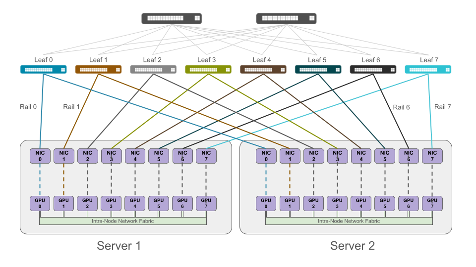
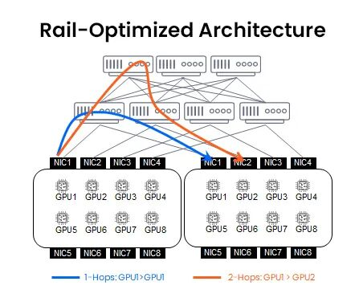
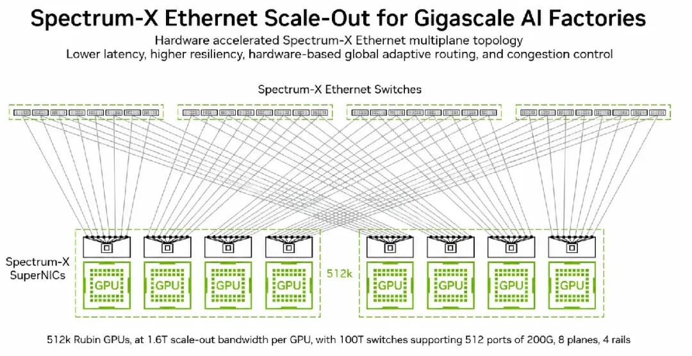
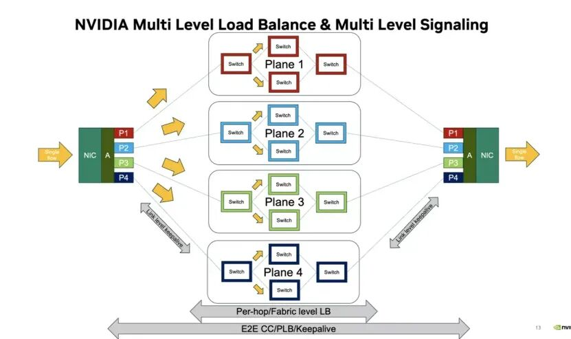
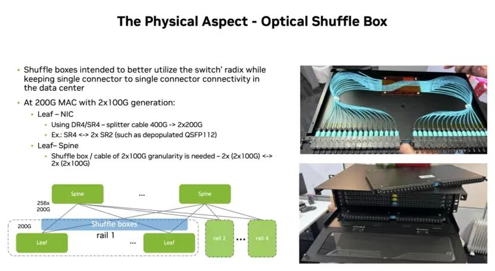

# 多轨与多平面：智算网络中两个易混淆的概念

轨道以网卡序号为切分对象，平面以交换域为切分对象——**切分维度不同**，这是二者被混用的根源。

对比两份组网方案：一份的网络配置为“8 轨道”，另一份为“4 轨道、8 平面”——多出的平面维度，正是当前超大规模组网演进的关键变量。

## 本文看点

1. **单轨与多轨：**8 张网卡如何接入网络
2. **多平面的两种语境：**职能划分与链路拆分
3. **轨道 × 平面：**正交叠加的组网框架

## 1. 轨道：网卡接入网络的拓扑方式

一台 8 卡 GPU 服务器通常配置 8 张高速网卡。这些网卡的接入方式，存在两类设计。

**单轨（Single Rail）**指服务器的全部网卡接入同一台 Leaf（ToR）交换机。该方式布线简单、运维成本低，但存在两项缺陷：

- 单台 Leaf 故障将导致该节点全部网络中断；
- 节点聚合带宽受限于单台交换机的端口与转发能力。

**多轨（Multi-Rail）**将服务器的多张网卡分别接入多台不同的 Leaf 交换机，每台交换机及其上游链路构成一条轨道。各条轨道并行承载流量，由 NCCL 等通信库在主机内统一调度。

**Rail-optimized 布线**在此之上进一步规定：所有服务器的同号网卡接入同一组轨道交换机。由此，本节点 GPU 0 与远端节点 GPU 0 之间的流量在轨道内经单跳交换机完成转发，无需跨轨。

其依据在于集合通信流量的对称性——本节点 GPU 0 的通信对端是集群内所有节点的 GPU 0，轨道布线正是对这一对称性的利用。

**多轨并不等于多张独立的物理网络。**多条轨道同属一个 Fabric、共享一套控制平面，通信库在主机内将流量分发至各条轨道。

多轨的设计目标是聚合节点内多网卡的带宽，并实现故障隔离——单台 Leaf 故障仅损失 1/8 的节点带宽——而非实现网络的物理隔离。

## 2. 平面：网络资源的两种切分方式

“多平面”存在两种不同的技术语境，需分别界定。

### 2.1 按职能划分

智算中心的网络由多套相互独立的网络构成：计算网、存储网、带内管理网、带外管理网分别部署，物理或逻辑隔离。

业内常见的**“存算分离双平面”**即属此类：计算流量与存储流量各自运行于独立网络，带宽不相互占用，故障域相互隔离。这一维度的划分依据是流量的职能属性。

### 2.2 按链路容量划分

2025 年之后成为主流的第二类多平面，指将一个高速物理端口拆分为多份，分别接入多个物理独立的交换域，并聚合成一个逻辑端口使用。NVIDIA 的对应方案为 **MPFT（Multi-Plane Fat-Tree，多平面胖树）**。

### MPFT 的端口拆分

ConnectX-8 网卡的 800G 端口，可拆分为 4 × 200G 接入四个独立物理平面；对上层应用而言，它仍呈现为一个 800G 逻辑端口。

该架构的驱动力，是单平面网络在超大规模 AI 集群中的三类瓶颈。

#### 1. 哈希极化

单平面依赖 ECMP 五元组哈希分流，AI 训练流以大象流为主，少数大流经哈希映射至同一链路，导致热点链路拥塞而其余链路空闲，整网链路利用率通常仅为 60%～70%。

多平面配合逐包喷洒（Packet Spray）技术，将报文均匀分发至所有健康平面，单流可聚合全部平面的总带宽，链路利用率提升至 90% 以上。

#### 2. PFC 反压的级联扩散

RoCE 无损网络中，局部拥塞触发的 PFC 反压沿转发路径逐跳传导，单平面架构下故障易扩散至全网。

多平面中每个平面拥有独立的 PFC 反压域与拥塞控制域，故障被限制在本平面内，集群仅损失 1/N 带宽，训练任务可降级运行。

#### 3. 多层 Clos 的转发跳数开销

单平面架构扩展至万卡规模需从两层 Clos 升级为三层，转发路径由 2 跳增至 5 跳。

多平面通过横向堆叠独立的两层交换域，使集群规模随平面数量线性增长，转发全程保持 2 跳，网络建设成本降低 30%～40%。

该架构的落地依赖两项能力：

1. 逐包分发必然引入报文乱序，网卡需具备硬件级保序能力，包括乱序接收和动态数据放置；
2. 每个平面需维护独立的拥塞控制上下文。探测报文携带平面 ID，跨平面探测报文被直接丢弃，以避免拥塞误判。

该架构已在多个主流集群中落地：DeepSeek 训练网络采用多套胖树平面并排部署；阿里云 HPN 将集合通信与存储、管理流量划分至独立平面；OpenAI 的 MRC 架构同样以 Multi-Plane 拓扑为基础。

## 3. 轨道与平面：两个正交的设计维度

结合 Spectrum-X 多平面架构的配置，可以明确二者的分工：

- **轨道决定网卡接入哪一组交换域。**4 条轨道对应服务器的 4 组网卡，同号对齐、单跳转发；
- **平面决定交换域资源的切分粒度。**每张网卡 1.6T 的横向扩展带宽拆分为 8 条 200G 链路，接入 8 个物理平面，聚合为逻辑端口。

两个维度相互正交，可独立组合。基于 100T 交换机（512 个 200G 端口）、4 轨道 8 平面配置，横向扩展网络的支撑规模与故障行为如下：

| 指标 | 结果 |
| --- | ---: |
| Rubin GPU 横向扩展规模 | 51.2 万（多轨架构的 64 倍） |
| 单平面故障后保持带宽 | 90%（传统多层拓扑降至 0） |
| 故障检测时延 | 2.68 ms |

更早的工程实践是 NVIDIA 的 MPFT 部署参考架构：1,024 节点集群采用 **8 轨道 × 2 平面**结构——每节点 8 张网卡对应 8 条轨道，每条轨道再划分为 2 个独立平面。轨道与平面为叠加关系，共同构成组网结构。

二者对比如下：

| 维度 | 多轨（Multi-Rail） | 多平面（Multi-Plane） |
| --- | --- | --- |
| 切分对象 | 服务器内的多张网卡 | 网络自身的交换域与链路 |
| 切分依据 | GPU 序号（同号对齐） | 流量职能，或链路容量 |
| 回答的问题 | 网卡接入哪一组交换机 | 一张网拆分为几套独立资源 |
| 调度主体 | 通信库（NCCL 等）按卡调度 | 网卡硬件（PLB／自适应路由）按包调度 |
| 物理含义 | 同一 Fabric 内的并行通道 | 物理隔离的独立交换域 |
| 解决的问题 | 带宽聚合、单跳转发、单点故障损失 1/N | 职能隔离、哈希极化、PFC 扩散、端口规模 |

## 4. 三个需要辨析的混淆点

### 1. 多轨不等于多张独立网络

多轨的多条轨道同属一个 Fabric，由通信库统一调度；按职能划分的独立网络（计算面、存储面、管理面）属于平面概念的职能维度，与多轨分属不同设计层面。

### 2. 多平面不等于 ECMP 多路径

二者处于不同的架构层级：多路径是单一交换域内的链路级冗余机制，规模受限于单个交换域，且各路径共享同一 PFC 反压域；多平面是跨越多个独立交换域的架构级冗余，故障严格限制在单平面内。

### 3. 平面数量并非越多越好

多平面的性能收益以硬件冗余与运维复杂度为代价。万卡以下、流量模型简单的集群部署多平面将增加建设与运维成本；其适用区间为万卡至十万卡规模、以稳定性与有效带宽为核心指标的集群。

## 结语

轨道与平面分别对应智算网络中两类不同的设计维度：轨道源于 GPU 集群“每卡一轨”的接入拓扑设计，回答网卡如何接入网络的问题；平面从职能隔离演进至链路拆分聚合，回答网络资源如何在超大规模下组织的问题。二者正交叠加，构成当前超大规模智算集群组网的基础框架。

> **核心结论：**分析具体网络方案时，应分别考察其轨道划分方式与平面划分方式：前者决定流量在网卡层面的组织，后者决定交换域层面的资源切分与故障隔离。两个维度混为一谈，是对当前组网方案产生误读的主要来源。

---

*部分图片来源于网络，版权归原作者所有。如有侵权，请联系原发布者删除。*
