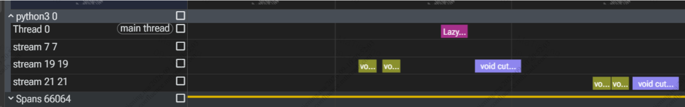
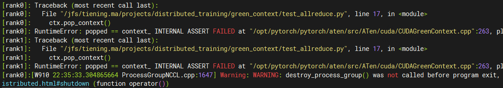
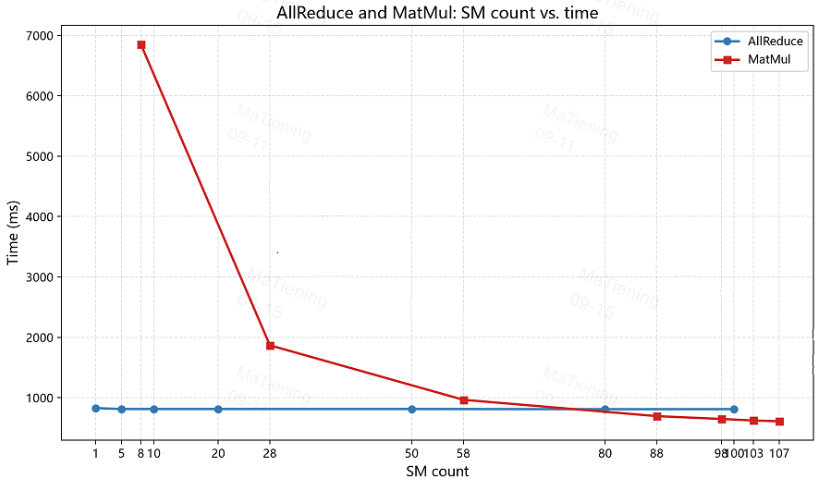

# 0. Cuda Green Context
[Cuda Green Context](https://docs.nvidia.com/cuda/cuda-driver-api/group__CUDA__GREEN__CONTEXTS.html#group__CUDA__GREEN__CONTEXTS)

[cuda Green Context Guide](https://docs.nvidia.com/cuda/cuda-programming-guide/04-special-topics/green-contexts.html#)

这里的 context（上下文）是驱动维护的一套 GPU 执行状态。它决定某些 API 当前操作哪个设备、使用什么执行资源，以及默认流如何解释。它和 stream 不同：context 提供执行环境，stream 表示任务提交的顺序。

GreenContext，并不是把整个环境重新创建一份。它依附于设备的 primary context，主要用于配置 SM 等执行资源，并关联相应的 stream.

primary context 和 GreenContext 的默认流不同，但打印出的 stream handle 都可能是 0.

# 1. Greencontext intraduce

## 1.1 Context 模型

- **Primary Context**：进程内每个设备默认对应一个，由多个线程共享。
- **Current Context**：某个线程当前绑定的 Context。
- Runtime 通常使用调用线程的 Current Context，包括 Driver 创建的非 Primary Context。
- 如果线程没有 Current Context，首次调用需要活动 Context 的 Runtime API 时，会自动选择、绑定并初始化某个设备的 Primary Context。
- Runtime 状态属于 Context，而不是线程。

## 1.2. 初始化与重置

| API | 作用 |
|---|---|
| `cudaInitDevice()` | 初始化指定设备的 Primary Context，但不绑定到调用线程 |
| `cudaSetDevice()` | 初始化指定设备的 Primary Context，并绑定到调用线程 |
| `cudaDeviceReset()` | 反初始化当前设备的 Primary Context |

注意：
- **初始化、线程绑定、重置是不同操作。**
- Reset 不解除已有的线程绑定；后续需要活动 Context 的 Runtime 调用会触发重新初始化。
- Primary Context 是共享资源，Reset 会影响其他使用它的线程，不宜随意调用。

## 1.3. Runtime 与 Driver 混用

Driver 可以创建非 Primary Context，Runtime 通常也能使用，但存在限制：

- `cudaPointerGetAttributes()` 不能查询由非 Primary Context 分配的指针。
- 当前为非 Primary Context 时，不能使用 Runtime 的 Peer Access API。
- 上述功能应改用 Driver API。
- Runtime 不支持 API 版本为 `3010` 的旧 Context。
- 文档不推荐同一进程为同一设备创建多个 Context，因为会明显降低性能。

## 1.4. 类型互通

| Driver 类型 | Runtime 类型 | 互通方式 |
|---|---|---|
| `CUstream` | `cudaStream_t` | 直接互用 |
| `CUevent` | `cudaEvent_t` | 直接互用 |
| `CUarray` | `struct cudaArray *` | 显式类型转换 |
| `CUgraphicsResource` | `cudaGraphicsResource_t` | 显式类型转换 |
| `CUtexObject` | `cudaTextureObject_t` | 显式类型转换 |
| `CUsurfObject` | `cudaSurfaceObject_t` | 显式类型转换 |
| `CUfunction` | `cudaFunction_t` | 显式类型转换 |
| `CUkernel` | `cudaKernel_t` | 显式类型转换 |

**类型可以互通，不代表资源可以跨 Context 任意使用。**


# 2. python code

[torch guide](https://docs.pytorch.org/docs/main/generated/torch.cuda.green_contexts.GreenContext.html)

## 2.1 Usage Method 1

```py
import torch.cuda.green_contexts.GreenContext as GreenContext
ctx = GreenContext(...)
stream = ctx.Stream()
with torch.cuda.stream(stream):
    # torch operations here are using resources from `ctx`
    pass
```

## 2.2 Usage Method 2
```py
import torch
a = torch.randn(1000, 1000, device='cuda')
b = torch.randn(1000, 1000, device='cuda')

ctx = torch.cuda.green_contexts.GreenContext.create(
    num_sms=20,
    device_id=0,
)

ctx.set_context()
result = torch.matmul(a, b)

ctx.pop_context()
```

- **ctx.set_context() 做了如下事情** <br>

1. 保存当前正在使用的普通 CUDA stream。
1. 把 ctx 的 CUDA Green Context 压入当前线程的 context stack。
1. 获取该 Green Context 的 default stream，并设置为 PyTorch 当前 stream。
1. 后面的 torch.randn、torch.matmul 都在这个 Green Context 的资源约束下运行。
1. pop_context() 时再恢复原来的 context 和 stream，并通过 event 保证前后顺序。

GreenContext 创建时，CUDA driver 通过 CU_GREEN_CTX_DEFAULT_STREAM 为这个 context 提供 default stream 能力。

当前 green context 的 **default stream**；它不是 PyTorch pool 中某个普通 stream。虽然这个 stream 的 PyTorch ID 可能仍然是 0，但 CUDA 的 default stream 是 context-scoped 的.

# 3 context use independent default stream



```py
import torch
import contextlib
import os
from datetime import datetime
from pathlib import Path
import torch
import torch.distributed as dist
from torch.profiler import ProfilerActivity, profile, schedule, tensorboard_trace_handler


def test_green_context():
    rank = dist.get_rank() if dist.is_initialized() else 0
    device = torch.device("cuda", rank)
    a = torch.randn(1000, 1000, device=device)
    b = torch.randn(1000, 1000, device=device)
    result = torch.matmul(a, b)

    ctx = torch.cuda.green_contexts.GreenContext.create(
        num_sms=20,
        device_id=0,
    )

    ctx.set_context()

    try:
        result = torch.matmul(a, b)
    finally:
        ctx.pop_context()


@contextlib.contextmanager
def maybe_enable_profiling(enable: bool, trace_dir: str = "./profile_traces"):
    if not enable:
        yield None
        return
    rank = dist.get_rank() if dist.is_initialized() else 0
    trace_path = Path(trace_dir)
    trace_path.mkdir(parents=True, exist_ok=True)
    activities = [torch.profiler.ProfilerActivity.CPU]
    if torch.cuda.is_available():
        activities.append(torch.profiler.ProfilerActivity.CUDA)
    with torch.profiler.profile(
        activities=activities,
        record_shapes=True,
        acc_events=True,
        with_stack=True,
    ) as prof:
        yield prof
    prof.export_chrome_trace(str(trace_path / f"rank{rank}_trace.json"))

def test_green_context_with_profiling():
    with maybe_enable_profiling(True, trace_dir="./profile_traces") as prof:
        test_green_context()

if __name__  == "__main__":
    dist.init_process_group(backend="nccl")
    test_green_context_with_profiling()
    print("Green context test passed.")

    dist.destroy_process_group()
```

# 4 primary context and green context
```py
#!/usr/bin/env python3
"""Show whether cudaSetDevice(0) creates or selects a new driver context."""

import ctypes

import torch


DRIVER = ctypes.CDLL("libcuda.so.1")
RUNTIME = ctypes.CDLL("libcudart.so")

DRIVER.cuCtxGetCurrent.argtypes = [ctypes.POINTER(ctypes.c_void_p)]
DRIVER.cuCtxGetCurrent.restype = ctypes.c_int
DRIVER.cuCtxSetCurrent.argtypes = [ctypes.c_void_p]
DRIVER.cuCtxSetCurrent.restype = ctypes.c_int
RUNTIME.cudaGetDevice.argtypes = [ctypes.POINTER(ctypes.c_int)]
RUNTIME.cudaGetDevice.restype = ctypes.c_int
RUNTIME.cudaSetDevice.argtypes = [ctypes.c_int]
RUNTIME.cudaSetDevice.restype = ctypes.c_int


def check(label: str, code: int) -> None:
    if code != 0:
        raise RuntimeError(f"{label} failed with CUDA error {code}")


def state(label: str) -> int:
    context = ctypes.c_void_p()
    device = ctypes.c_int(-1)
    check("cuCtxGetCurrent", DRIVER.cuCtxGetCurrent(ctypes.byref(context)))
    check("cudaGetDevice", RUNTIME.cudaGetDevice(ctypes.byref(device)))
    value = context.value or 0
    print(f"{label}: device={device.value} context=0x{value:x}", flush=True)
    return value


def main() -> None:
    if not torch.cuda.is_available():
        raise RuntimeError("CUDA is not available")

    torch.cuda.set_device(0)
    check("cudaSetDevice(primary)", RUNTIME.cudaSetDevice(0))
    primary = state("primary before")

    check("cudaSetDevice(primary, same device)", RUNTIME.cudaSetDevice(0))
    primary_after = state("primary after cudaSetDevice(0)")

    ctx = torch.cuda.green_contexts.GreenContext.create(num_sms=40, device_id=0)
    ctx.set_context()
    green = state("green before")
    try:
        check("cudaSetDevice(green, same device)", RUNTIME.cudaSetDevice(0))
        after_first = state("green after cudaSetDevice(0)")
        # check("cudaSetDevice(green, repeated)", RUNTIME.cudaSetDevice(0))
        # after_second = state("after repeated cudaSetDevice(0)")
        print(
            "summary: "
            f"primary_unchanged={primary == primary_after} "
            f"green_differs_from_primary={green != primary} ",
            # f"same_device_selects_primary={after_first == primary == after_second}",
            flush=True,
        )
    finally:
        # Restore the Green context before its stack pop.
        # check("cuCtxSetCurrent(green)", DRIVER.cuCtxSetCurrent(ctypes.c_void_p(green)))
        ctx.pop_context()
        state("after restore and pop")


if __name__ == "__main__":
    main()
```

cudaSetDevice 会切换 context:
```sh
primary before: device=0 context=0x976a8a0
primary after cudaSetDevice(0): device=0 context=0x976a8a0
green before: device=0 context=0xa5bae50
green after cudaSetDevice(0): device=0 context=0x976a8a0
summary: primary_unchanged=True green_differs_from_primary=True
after restore and pop: device=0 context=0x976a8a0
```

# 5. nccl 中会 green context 报错

```python
import os

import torch
import torch.distributed as dist

dist.init_process_group("nccl")
rank = dist.get_rank()
device = torch.device("cuda", rank)
torch.cuda.set_device(device)

ctx = torch.cuda.green_contexts.GreenContext.create(num_sms=40, device_id=rank)
ctx.set_context()
try:
    x = torch.ones(1024, device=device, dtype=torch.bfloat16)
    dist.all_reduce(x, async_op=False)
finally:
    ctx.pop_context()

dist.destroy_process_group()

print(f"Rank {rank} allreduce test passed.")
```



> [NCCL issue](https://github.com/NVIDIA/nccl/issues/1736)

# 6 SM 个数对 通信 性能的影响

- 代码内切换 ctx.stream() 和 ctx.set_context()

```python
import os
import torch
import time
import torch.distributed as dist
from torch.cuda.green_contexts import GreenContext

local_rank = int(os.environ["LOCAL_RANK"])
device = torch.device("cuda", local_rank)
torch.cuda.set_device(device)
dist.init_process_group("nccl", device_id=device)
rank, world = dist.get_rank(), dist.get_world_size()

a = torch.randn([1024, 1024, 1024], device=device)


ctx = GreenContext.create(num_sms=50, device_id=local_rank)
stream = ctx.Stream()
# ctx.set_context() # 这里切换 ctx.stream() 和 ctx.set_context()


with torch.cuda.stream(stream):
    for i in range(5):
        dist.all_reduce(a, async_op=False)


    torch.cuda.synchronize()
    start_time = time.time()

    for i in range(20):
        dist.all_reduce(a, async_op=False)

    torch.cuda.synchronize()
    end_time = time.time()

print(f"============= allreduce total time: {end_time - start_time}")
# ctx.pop_context()
```

| Context | SM=1: total time /s | SM=50: total time /s |
| --- | ---: | ---: |
| `ctx.Stream` | 4.82 | 4.32 |
| `ctx.set_context` | 4.32 | 4.32 |

**结论**
- 使用 ctx.Stream 的方式，green context 生效， 且SM 个数对comm 算子影响较小；
- 使用ctx.set_context 的方式，green context 不生效.

# 7. matmul + allreduce : SM effect

```python
import os
from isort import stream
import torch
import time
import torch.distributed as dist
from torch.cuda.green_contexts import GreenContext

local_rank = int(os.environ["LOCAL_RANK"])
device = torch.device("cuda", local_rank)
torch.cuda.set_device(device)
dist.init_process_group("nccl", device_id=device)
rank, world = dist.get_rank(), dist.get_world_size()

a = torch.randn([1, 1024, 1024], device=device)

b = torch.randn([2048, 2048], device=device)
c = torch.randn([2048, 2048], device=device)

comm_sm = 50
kernel_sm = 108 - comm_sm

ctx_comm = GreenContext.create(num_sms=comm_sm, device_id=local_rank)
ctx_compute = GreenContext.create(num_sms=kernel_sm, device_id=local_rank)
stream_comm = ctx_comm.Stream()
stream_compute = ctx_compute.Stream()

start = torch.cuda.Event(enable_timing=True)
end = torch.cuda.Event(enable_timing=True)

start_comm = torch.cuda.Event(enable_timing=True)
end_comm = torch.cuda.Event(enable_timing=True)

with torch.cuda.stream(stream_comm):
    for i in range(5):
        dist.all_reduce(a, async_op=False)

    start_comm.record(stream_comm)
    for i in range(20):
        dist.all_reduce(a, async_op=False)
    end_comm.record(stream_comm)


with torch.cuda.stream(stream_compute):
    for i in range(5):
        output = torch.matmul(b, c)

    start.record(stream_compute)
    for i in range(20):
        output = torch.matmul(b, c)
    end.record(stream_compute)

end_comm.synchronize()
ms_comm = start_comm.elapsed_time(end_comm)
print(f"=============rank{rank} all_reduce total time: {ms_comm} ms")


# Event timing is queried on the CPU, so wait until the GPU reaches `end`.
end.synchronize()
ms = start.elapsed_time(end)
print(f"=============rank{rank} matmul total time: {ms} ms")


# Ensure the communication stream has also completed before the process exits.
stream_comm.synchronize()
stream_compute.synchronize()
# ctx.pop_context()
```

| SM split | (1, 107) | (5, 103) | (10, 98) | (20, 88) | (50, 58) | (80, 28) | (100, 8) |
| --- | ---: | ---: | ---: | ---: | ---: | ---: | ---: |
| allreduce time / ms | 828 | 813 | 813 | 813 | 813 | 810 | 811 |
| matmul time / ms | 610 | 623 | 648 | 695 | 966 | 1868 | 6851 |

