下面是一版 **每一步都有图示的 Markdown 教程**，你可以直接复制保存为：

```bash
k9s_tutorial.md
```

---

# k9s 图示化入门教程

## 1. 启动 k9s

### 命令

```bash
k9s
```

### 图示

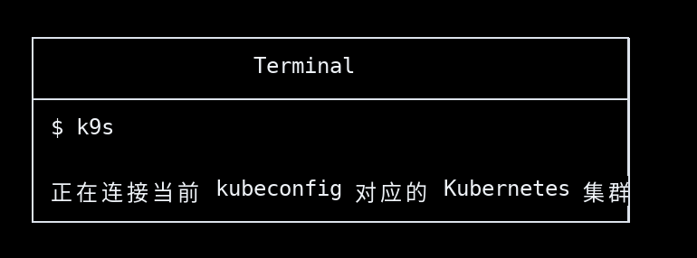

启动后，k9s 会读取：

```bash
~/.kube/config
```

它连接的集群，和你执行下面命令时使用的是同一套配置：

```bash
kubectl get nodes
```

---

## 2. k9s 主界面怎么看

### 图示

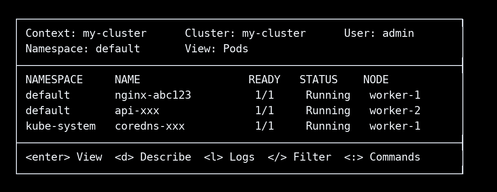

### 界面解释

```text
顶部：当前集群、用户、namespace、资源视图
中间：资源列表，比如 Pods、Nodes、Deployments
底部：快捷键提示
```

---

## 3. 查看 Namespace

### 操作

在 k9s 中输入：

```text
:ns
```

然后回车。

### 图示

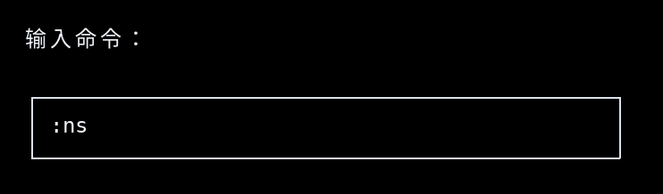

进入 namespace 页面：

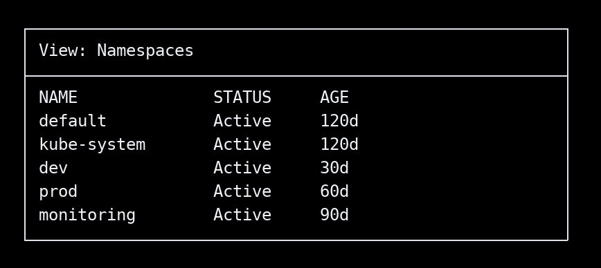

### 说明

`namespace` 是逻辑隔离空间，不是机器。

例如：

```text
default      默认空间
kube-system  Kubernetes 系统组件
dev          开发环境
prod         生产环境
monitoring   监控组件
```

---

## 4. 查看 Node

### 操作

```text
:node
```

或者：

```text
:nodes
```

### 图示

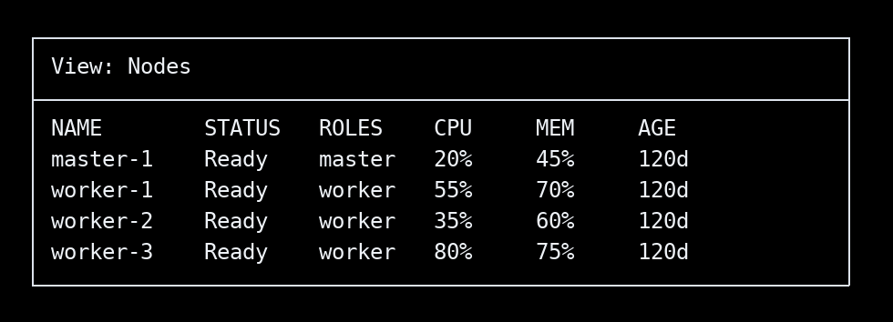

### 说明

`node` 是真实运行容器的机器。

可以理解为：

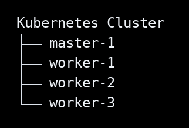

---

## 5. 查看 Pod

### 操作

```text
:pods
```

或者：

```text
:po
```

### 图示

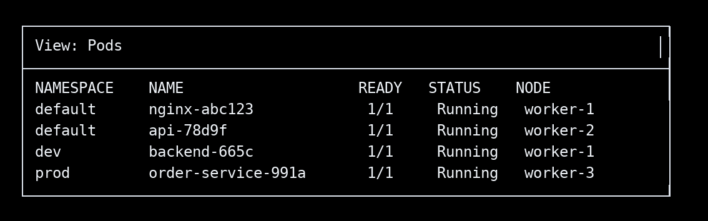

### 说明

`Pod` 是 Kubernetes 里真正被调度到 node 上运行的对象。

关系是：

```text
Pod 属于某个 Namespace
Pod 运行在某个 Node
```

例如：

```text
dev/backend-665c 运行在 worker-1 上
prod/order-service-991a 运行在 worker-3 上
```

---

## 6. 查看所有 Namespace 下的 Pod

默认情况下，k9s 可能只显示当前 namespace。

### 操作

在 Pod 页面按：

```text
0
```

### 图示：切换前

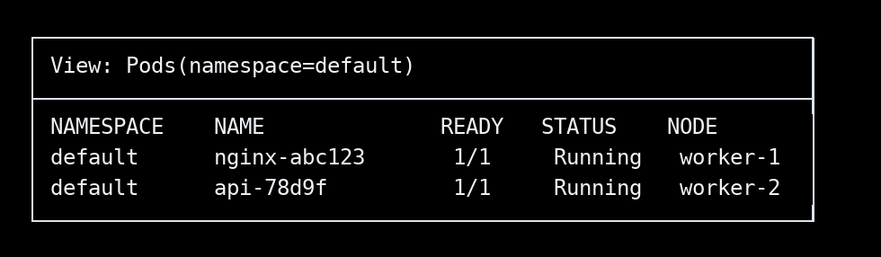

### 图示：按 `0` 后

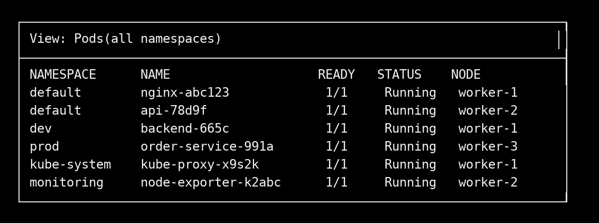

### 对应 kubectl

```bash
kubectl get pods -A
```

---

## 7. 查找某个 Node

假设要找：

```text
worker-1
```

### 操作

先进入 node 页面：

```text
:node
```

然后按：

```text
/
```

输入：

```text
worker-1
```

### 图示

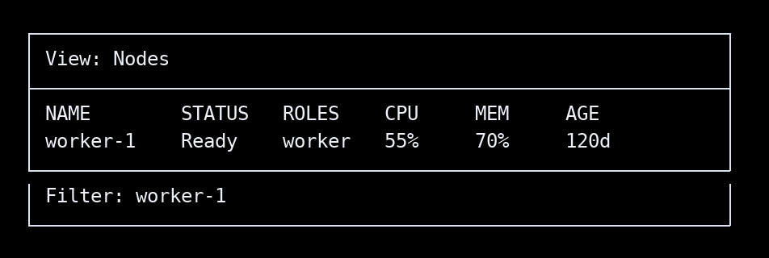

### 说明

`/` 是搜索/过滤。

类似于：

```bash
kubectl get nodes | grep worker-1
```

---

## 8. 查看某个 Node 的详细信息

### 操作

选中 `worker-1` 后按：

```text
d
```

### 图示

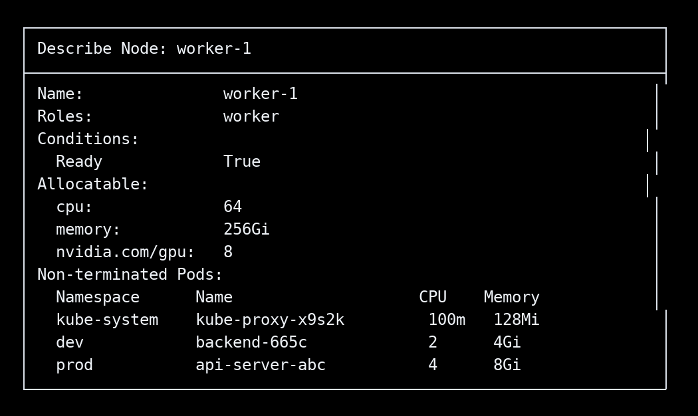

### 对应 kubectl

```bash
kubectl describe node worker-1
```

---

## 9. 查看某个 Worker 上跑了哪些 Pod

假设你要看：

```text
worker-1 上有哪些 Pod
```

### 操作步骤

进入 Pod 页面：

```text
:pods
```

切到所有 namespace：

```text
0
```

搜索 node 名：

```text
/worker-1
```

### 图示

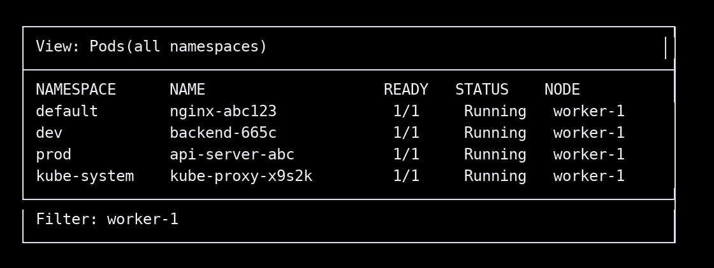

### 对应 kubectl

```bash
kubectl get pods -A -o wide | grep worker-1
```

---

## 10. 为什么一个 Worker 上会看到很多 Namespace？

### 图示

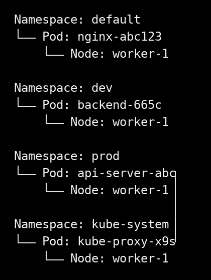

最终在 worker-1 上看到：

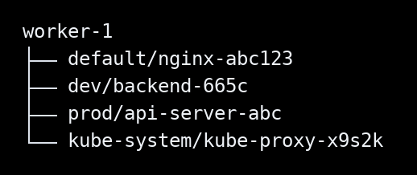

### 结论

```text
不是 worker-1 上有很多 namespace
而是 worker-1 上运行了来自多个 namespace 的 Pod
```

---

## 11. 查看 Pod 日志

### 操作

在 Pod 页面选中某个 Pod，然后按：

```text
l
```

### 图示

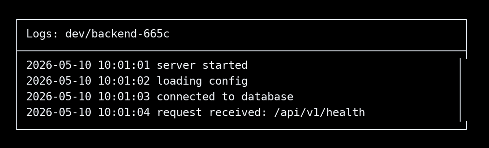

### 对应 kubectl

```bash
kubectl logs backend-665c -n dev
```

如果要持续查看日志：

```bash
kubectl logs -f backend-665c -n dev
```

---

## 12. Describe Pod 查看详细信息

### 操作

选中 Pod 后按：

```text
d
```

### 图示

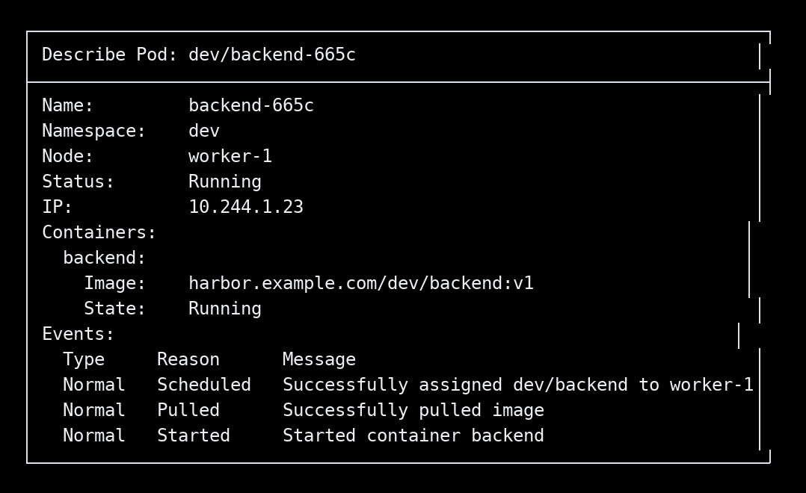

### 对应 kubectl

```bash
kubectl describe pod backend-665c -n dev
```

---

## 13. Pod 异常时怎么看

### 示例：CrashLoopBackOff

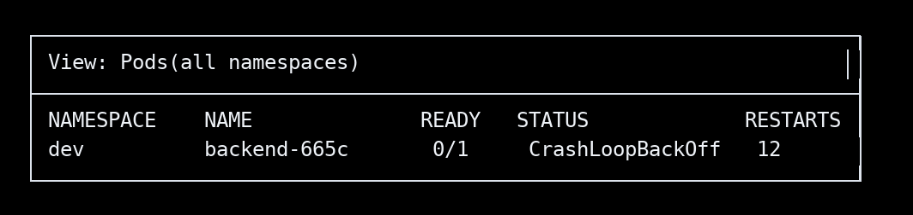

### 排查顺序图

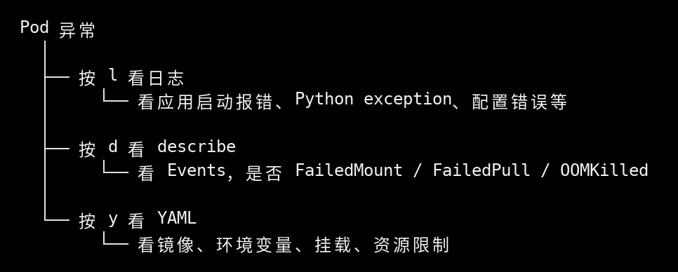

### 常见状态说明

```text
Running            正常运行
Pending            还没调度成功
CrashLoopBackOff   容器反复崩溃
ImagePullBackOff   镜像拉取失败
ErrImagePull       镜像地址或权限错误
Error              容器异常退出
Completed          Job 类任务已完成
```

---

## 14. 查看 Pod YAML

### 操作

选中 Pod 后按：

```text
y
```

### 图示

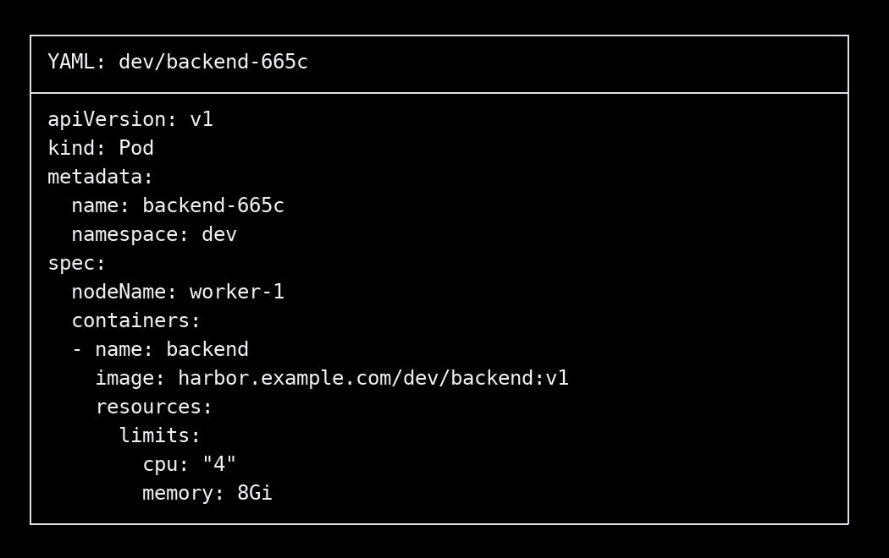

### 重点看

```text
metadata.namespace   属于哪个 namespace
spec.nodeName        被调度到哪个 node
containers.image     使用哪个镜像
resources.limits     资源限制
volumeMounts         挂载路径
env                  环境变量
```

---

## 15. 进入 Pod Shell

### 操作

选中 Pod 后按：

```text
s
```

如果一个 Pod 里有多个容器，k9s 会让你选择进入哪个容器。

### 图示

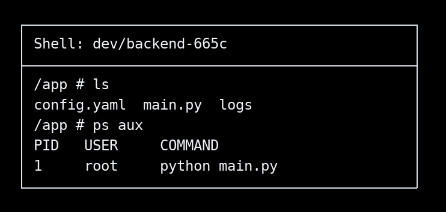

### 对应 kubectl

```bash
kubectl exec -it backend-665c -n dev -- sh
```

或者：

```bash
kubectl exec -it backend-665c -n dev -- bash
```

---

## 16. 查看 Deployment

### 操作

```text
:deploy
```

### 图示

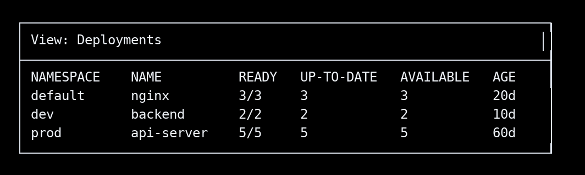

### Deployment 和 Pod 关系图

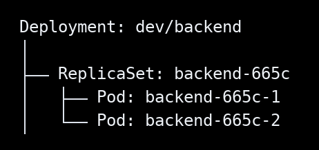

Deployment 负责管理 Pod 副本。

---

## 17. 查看 Service

### 操作

```text
:svc
```

### 图示

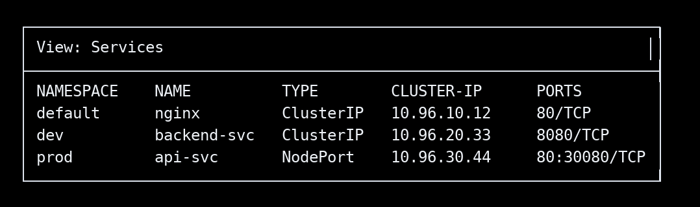

### Service 和 Pod 关系图

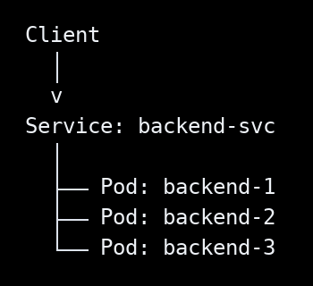

Service 给一组 Pod 提供稳定访问入口。

---

## 18. 查看 Events

### 操作

```text
:events
```

### 图示

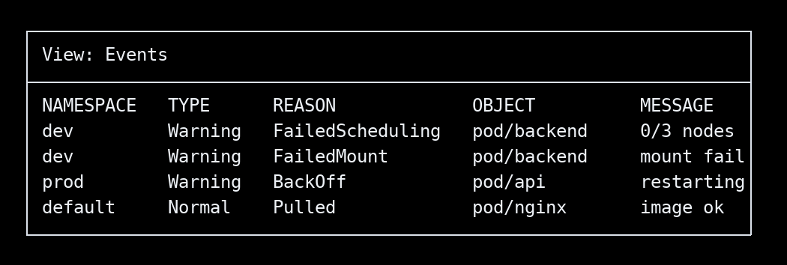

### 说明

Events 对排查问题非常重要。

常见事件：

```text
FailedScheduling   调度失败
FailedMount        挂载失败
FailedPullImage    拉镜像失败
BackOff            容器反复失败
OOMKilled          内存超限被杀
```

---

## 19. k9s 常用快捷键总览

### 图示

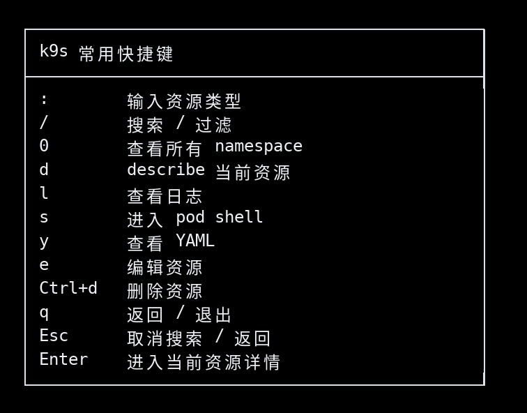

---

## 20. 最常用排查路径图

### 操作路径

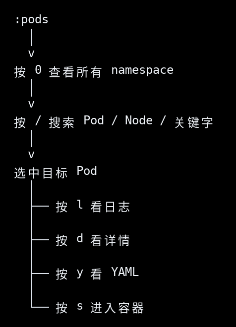

### 图示

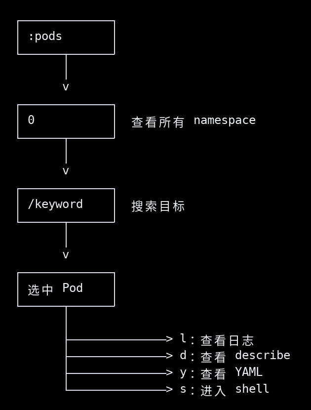

---

## 21. Node、Namespace、Pod 最终关系图

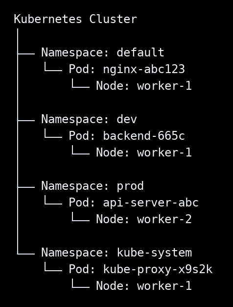

从 worker 视角看：

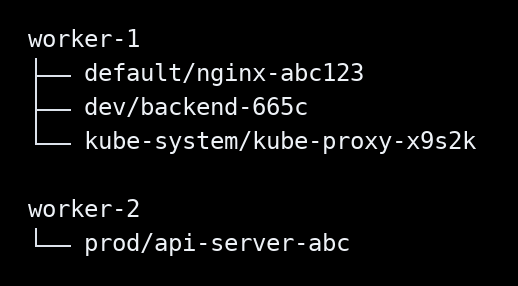

所以最重要的一句话是：

```text
Namespace 是逻辑隔离空间；
Node 是实际机器；
Pod 属于某个 Namespace，同时运行在某个 Node 上。
```

---

## 22. 最简记忆版

```text
看 namespace： :ns
看 node：      :node
看 pod：       :pods
看所有 ns：    0
搜索：         /
看详情：       d
看日志：       l
看 YAML：      y
进容器：       s
退出：         q
```

最常用组合：

```text
:pods → 0 → /关键字 → d → l
```

含义是：

```text
进入 Pod 页面
查看所有 namespace
搜索目标
查看详细信息
查看日志
```
