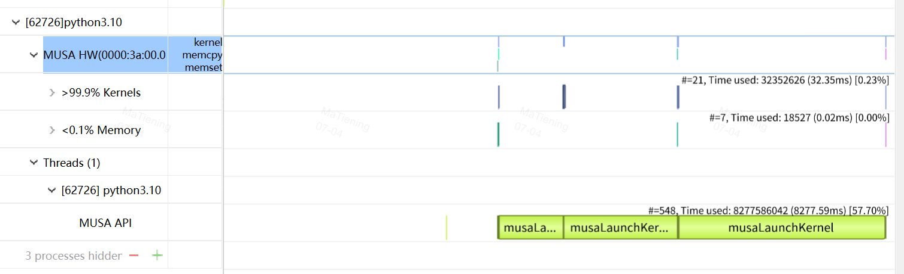
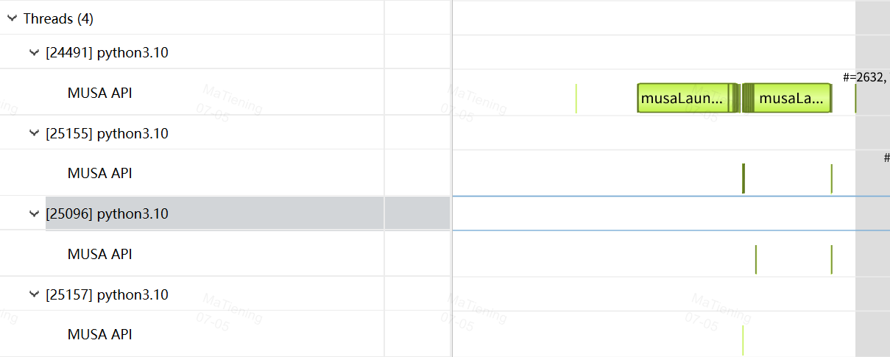
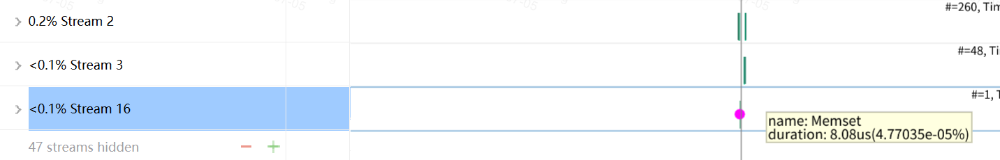

# 1. CUDA Trace 主要分两组 trace


**CUDA HW Trace**<br>
跟踪 GPU 上的活动，包括内存操作（例如，主机到设备的内存复制）和 Kernel 执行。你可以展开包含 CUDA HW 节点的进程节点以找到进程中使用的 CUDA 上下文，每个 CUDA 上下文将与其相应的 CUDA Stream 一起显示。Stream 包含 GPU 上的内存操作和 Kernel 执行情况。


**CUDA API Trace**<br>

**4个线程** <br>
1. 1 个 Python worker 主线程
1. + 1 个 ProcessGroupMCCL watchdog 线程
1. + 1 个 MCCL P2P/proxy buffer setup 线程
1. + 1 个 MCCL/MUSA helper 初始化线程



- 跟踪应用程序使用的 CUDA Runtime 和 CUDA Driver 调用。使用 CUDA API 的每个线程将作为线程子节点显示在时间线视图左侧的树结构中;
- CUDA Runtime 调用通常以前缀 musa 开始（例如，musaLaunch）;
- CUDA Driver 调用通常以前缀 mu 开始（例如，muDeviceGetCount）.

| tid | 角色 | 主要事件 | 作用 |
| --- | --- | --- | --- |
| 24489 | worker 主线程 | musaLaunchKernel, musaIpcOpenMemHandle, musaStreamSynchronize, musaFuncGetAttributes | 跑 Python 测试和 PyTorch/MUSA/MCCL 主流程 |
| 25152 | MCCL P2P/proxy buffer setup 线程 | musaStreamCreateWithFlags, musaMalloc, musaMemsetAsync, musaIpcGetMemHandle | 创建 16 个临时 stream，分配并清零 MCCL P2P shareable buffer，然后导出 IPC handle |
| 25093 | ProcessGroupMCCL watchdog/event query 线程 | musaEventQuery, musaGetDevice, muDevicePrimaryCtxGetState | 查询 MCCL work 的 start/end event，判断 collective 是否完成/异常/超时 |
| 25153 | MCCL/MUSA 内部短生命周期 helper 线程 | 只有一次 musaSetDevice | 初始化/绑定当前 device context，后续没有可见 MUSA API，可能转为 CPU-only 或很快退出 |


# 2. CUDA HW Trace 中 50 个 CUDA Stream


- stream2: MCCL 控制结构清零 + 小字段 H2D 初始化;
- stream3: MCCL connector / IPC metadata H2D 上传;
- 48 temp streams: MCCL P2P shareable buffer 分配后的异步清零，清完导出 IPC handle.

## 2.1 stream2：MCCL setup control stream

stream2 里有 Memset，也有少量/部分 Memcpy HtoD。它的作用是**初始化 MCCL device-side 控制结构**。

```sh
  典型操作是：

  Memset:
    2432B  x 32 / rank
    72B    x 32 / rank
    16B    x 33 / rank
    11872B x 1  / rank

  Memcpy HtoD:
    与上述 Memset 交错出现，写入小的指针、flag、counter、control block 字段
```

原理上是：MCCL 在首次 collective 初始化时，host 侧先分配/准备 communicator、channel、proxy、connector 等控制结构；
device 侧结构先用 musaMemsetAsync 清零，再通过 H2D copy 写入初始化字段;
stream2 同时承载 memset 和 H2D，是为了保证“先清零、再填字段”的顺序不污染默认 stream。

## 2.2 stream3：MCCL setup H2D metadata copy stream

stream3 全是 Memcpy HtoD。它不是清零 stream，而是专门把 host 侧构造好的 MCCL 元数据上传到 device。

report4 第一次 MCCL allreduce 之前，H2D 总量里最关键的是：

```sh
  152B x 48 / rank
  8B   x 128 / rank
  16B  x 33 / rank
  11872B x 1 / rank
```

其中 152B x 48/rank 和 musaIpcOpenMemHandle 的 48 次/rank `对齐`，基本就是 `P2P/IPC connector 元数据`。
也就是说:<br>
- stream2 更偏“控制结构清零 + 对刚清零区域填小字段”。
- stream3 更偏“连接描述/IPC handle 打开后的 metadata upload”；

## 2.3 临时 stream：MCCL P2P shareable buffer 临时初始化 stream

- 临时stream 个数：

```sh
单 worker 临时 stream 个数
= peer 数 x MCCL channel 数 x 每个 channel/peer 的 buffer 数
= (world_size - 1) x C(world_size) x 2

# 这里的 2 对应两类 MCCL P2P shareable buffer：2MiB 和 6MiB。每个 buffer 初始化时都会走一次：

musaStreamCreateWithFlags
  -> musaMalloc
  -> musaMemsetAsync
  -> musaStreamSynchronize
  -> musaStreamDestroy
  -> musaIpcGetMemHandle
```

- stream 个数举例

```sh
  world_size=3:
  peer 数 = 2
  MCCL channel 数 = 4
  临时 stream = 2 x 4 x 2 = 16

  world_size=4:
  peer 数 = 3
  MCCL channel 数 = 8
  临时 stream = 3 x 8 x 2 = 48

  为什么 3 -> 4 会从 16 跳到 48？核心是 MCCL channel 数也变了：3-rank 时它选了 4 个 channel，4-rank 时选了 8 个 channel。于是增长不是只乘上 peer 数，还叠加了 channel 数从 4 -> 8 的
  变化。

  对应显存也能对上：

  world_size=3:
  2 peers x 4 channels x (2MiB + 6MiB) = 64MiB / rank

  world_size=4:
  3 peers x 8 channels x (2MiB + 6MiB) = 192MiB / rank

```
**所以结论是**：`临时 stream 总数会随 worker 数增加，但真正决定单 worker 数量的是 MCCL 为这个 communicator 选出来的 peer/channel/buffer 组合；worker 数只是其中一个因素。`

- 临时 stream 创建逻辑 和 作用

```sh
# 调用栈/路径：

dist.barrier()
  -> ProcessGroupMCCL::barrier()
    -> dummy tensor allreduce
      -> MCCL communicator / P2P 初始化
        -> p2pRecvProxySetup
          -> imcclP2pAllocateShareableBuffer
            -> imcclMusaCallocDebug<char>
              -> musaStreamCreateWithFlags
              -> musaMalloc
              -> musaMemsetAsync
              -> musaStreamSynchronize
              -> musaStreamDestroy
              -> musaIpcGetMemHandle
```

作用：为 MCCL P2P/proxy transport 分配可 IPC 共享的 GPU buffer，并在导出 IPC handle 前清零。清零完成后才 musaIpcGetMemHandle，其它 rank 再 musaIpcOpenMemHandle，随后通过 stream3 那类 H2D 把 connector metadata 上传给 device。

为什么要 48 个？从计数看是按 peer/channel/protocol/buffer kind 拆出来的初始化单元。4 卡时每 rank 有 3 个 peer，MCCL 为多个 channel/协议/方向准备多组 P2P buffer，最后表现为 48 个shareable buffer 初始化. <br>
当前 MCCL helper 是“每个 buffer calloc 创建一个临时 stream，memset 后同步并销毁”，所以 profile 里看到 48 个 stream。它们不是为了测试里的 symmetric memory
op 并发执行，而是 MCCL 初始化实现上的隔离和同步方式. <br>
