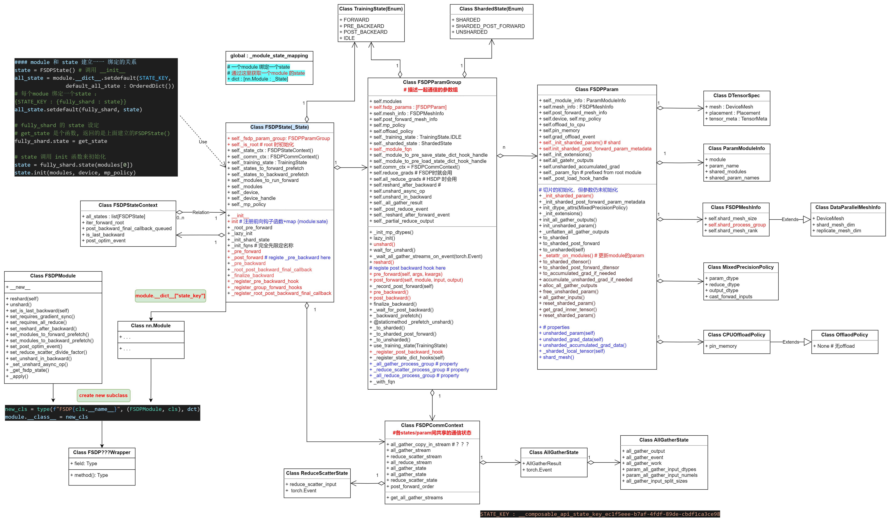
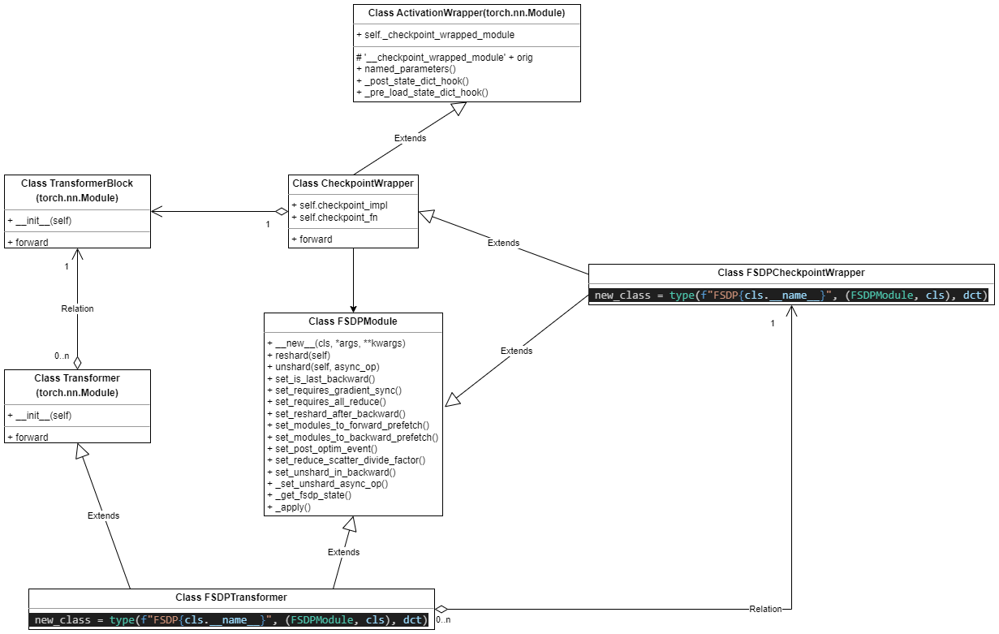
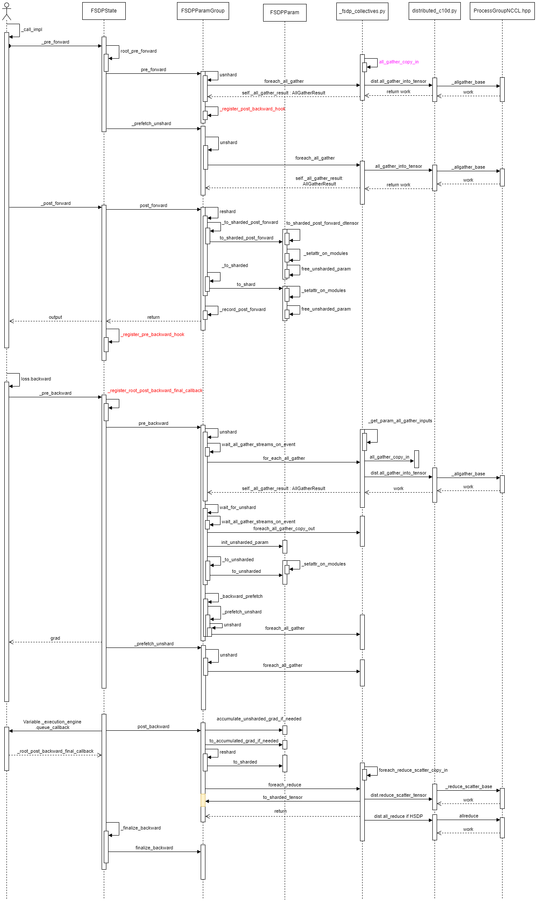
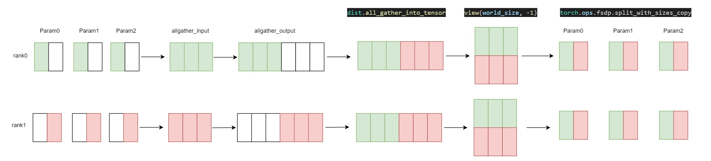

# 0 pytorch fsdp2 新特性
| 名称                              | 描述                                                                                                                                                                                                 |
|-----------------------------------|-----------------------------------------------------------------------------------------------------------------------------------------------------------------------------------------------------|
| Shard Per-Param                   | 对维度0上的每个参数进行分片，来解决`FlatParameter`的局限性。                                                                                                                                         |
| Flexible FP8-Gather               | FP8权重和其他非FP8参数可以在同一个全收集操作中灵活混合。                                                                                                                                             |
| Flexible Frozen Parameters        | 冻结和非冻结参数可以在同一个通信组中灵活混合，而无需使用额外内存。                                                                                                                                   |
| Communication-Free Sharded State Dicts | 使训练和状态字典表示相匹配，从而简化和加速检查点保存。                                                                                                                                               |
| Communication Optimization in the Compiler | 像`torch.compile`这样的partial-graph编译器可以改变`all-gather`/`reduce-scatter`的通信组。                                                                                                           |
| Avoiding RecordStream             | 通过避免使用`recordStream`使得内存释放更加确定，相比于FSDP1，FSDP2的GPU内存平均降低7%。                                                                                                             |
| Efficient Collective Kernels      | 编写了高效的kernels来实现multi-tensor的`allgather`和`reduce scatter`操作，使得通信效率相对于FSDP1没有下降。                                                                                          |

**FSDP2 相关源代码**


# 1 FSDPModule data structure

- **FSDPState + FSDPParamGroup + FSDPParam**
- **FSDPParamGroup 处理一个module 里的参数;**
- **FSDPParam 对每个Param参数进行wrap，并提供访问DTensor 和 Tensor 相互转化的API;**
- **FSDPState 和 module 一一对应的绑定起来，提供多个钩子函数的注册**
- **绑定了FSDPState的module 重新后继承FSDPModule, 得到最终的FSDP???Wrapper的module类;**
- `_pre_forward, _post_forward,`
- `_pre_backward 在FSDPState 的 _post_forward 里完成注册；`
- `post_backward 在 FSDPParamGroup 的pre_forward 里完成注册；`
- `FSDPParam 的 _setattr_on_modules 里更新module 的param;`
- `初始化过程Param 都是meta type 的，真正允许时会 _lazy_init;`



# 2 FSDPModule + nn.Module 多继承得到最终class



# 3 FSDP2 的通信

- _fsdp_distributed.py 里对comm 进行了wraper
- 有时直接对FSDPParamGroup 里tensor 直接进行通信；
- 有时需要对FSDPParam 细粒度进行通信；

> unshard : all_gather 一般对FSDPParamGroup 里统一进行；
> shard:  一般对FSDPParam 细粒度进行(自动触发)；



# FSDP2 几个点
- **module param 的替换发生在 FSDPParam init 里**

```python
class FSDPParam:
    def _setattr_on_modules(self, param: nn.Parameter) -> None:
        unsafe_setattr_param(
            self._module_info.module, self._module_info.param_name, param
        )
        for shared_module, shared_param_name in zip(
            self._module_info.shared_modules, self._module_info.shared_param_names
        ):
            unsafe_setattr_param(shared_module, shared_param_name, param)

def unsafe_setattr_param(
    module: nn.Module, param_name: str, param: nn.Parameter
) -> None:
    if getattr(module.__setattr__, "__func__", None) is nn.Module.__setattr__:
        module._parameters[param_name] = param
    else:  # slow path
        setattr(module, param_name, param)
```

- **哪里进行初始化呢???**

&nbsp;&nbsp;&nbsp;&nbsp;&nbsp;&nbsp;&nbsp;&nbsp; 用户显示调用FSDPTransformer 模型的init_weights 方法进行初始化.

```python
with torch.no_grad():
    model.init_weights(buffer_device=buffer_device)
```

FSDPState _lazy_init 完成哪些初始化呢?


|初始化内容|作用|
|:----|:----|
|根状态确定|协调分布式训练的核心角色|
|设备与通信组初始化|支持跨设备通信|
|参数分片|实现内存优化|
|优化器状态分片|降低每个设备的内存压力|
|梯度归约策略|控制通信行为|
|元数据与上下文管理|支持模块状态跟踪与恢复|

- **unshard 原理**



# 4 FSDP2 example code

```python
import torch
from torch.distributed._tensor  import DeviceMesh
from torch.distributed.fsdp  import FullyShardedDataParallel as FSDP
from torch.utils.data  import Dataset, DataLoader, DistributedSampler

# 分布式初始化
def setup(rank, world_size):
    torch.distributed.init_process_group(
        backend="nccl",
        init_method="env://",
        rank=rank,
        world_size=world_size
    )
    torch.cuda.set_device(rank)

# 生成随机数据的虚拟数据集
class RandomDataset(Dataset):
    def __init__(self, num_samples=1024):
        self.data  = torch.randn(num_samples,  128)  # 随机特征数据
        self.labels  = torch.randint(0,  10, (num_samples,))  # 随机标签

    def __len__(self):
        return len(self.data)

    def __getitem__(self, idx):
        return self.data[idx],  self.labels[idx]

def main():
    rank = torch.distributed.get_rank()
    world_size = torch.distributed.get_world_size()
    setup(rank, world_size)

    # 创建DeviceMesh
    device_mesh = DeviceMesh(
        "cuda",
        torch.arange(world_size).view(-1)
    )

    # 数据加载（随机数据集）
    dataset = RandomDataset()
    sampler = DistributedSampler(dataset, num_replicas=world_size, rank=rank)
    dataloader = DataLoader(dataset, batch_size=32, sampler=sampler)

    # 模型定义与FSDP包装
    model = torch.nn.Linear(128,  10).cuda()
    fsdp_model = FSDP(
        model,
        device_mesh=device_mesh,
        use_orig_params=True
    )

    # 训练循环
    optimizer = torch.optim.SGD(fsdp_model.parameters(),  lr=0.01)
    for epoch in range(3):
        sampler.set_epoch(epoch)
        for inputs, labels in dataloader:
            inputs, labels = inputs.cuda(),  labels.cuda()
            outputs = fsdp_model(inputs)
            loss = torch.nn.functional.cross_entropy(outputs,  labels)

            optimizer.zero_grad()
            loss.backward()
            optimizer.step()
            if rank == 0:
                print(f"Epoch {epoch} Loss: {loss.item():.4f}")

if __name__ == "__main__":
    main()

```
- 启动指令

```bash
torchrun \
    --nnodes=1 \
    --nproc_per_node=4 \
    --master_addr=localhost \
    --master_port=29500 \
    fsdp_random.py
```

# 参考资料
[why FSDP2](https://github.com/pytorch/torchtitan/blob/main/docs/fsdp.md)


